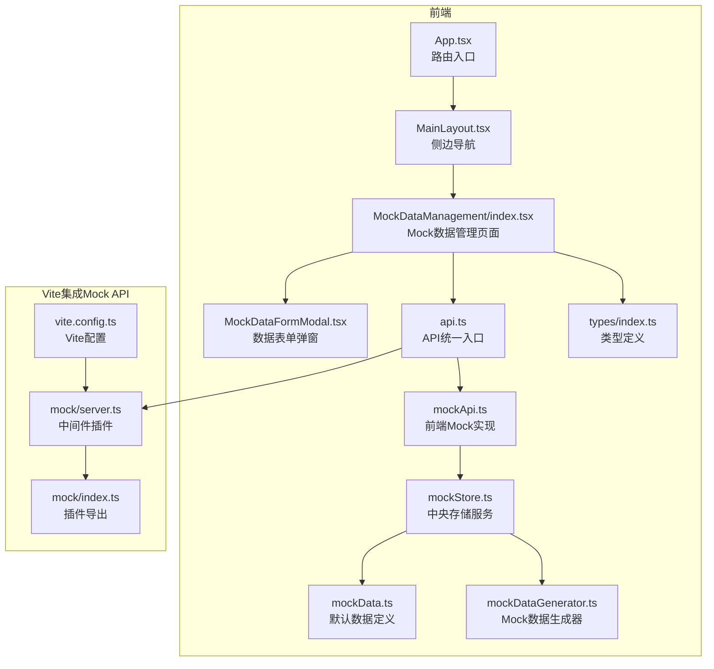
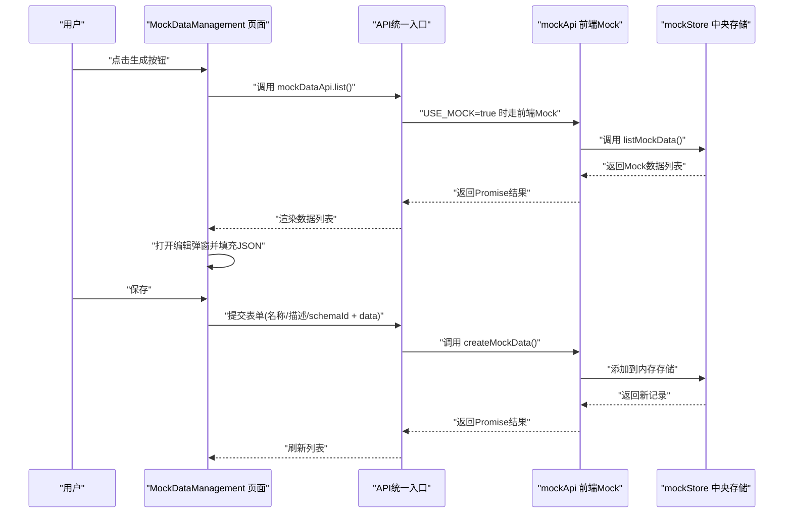
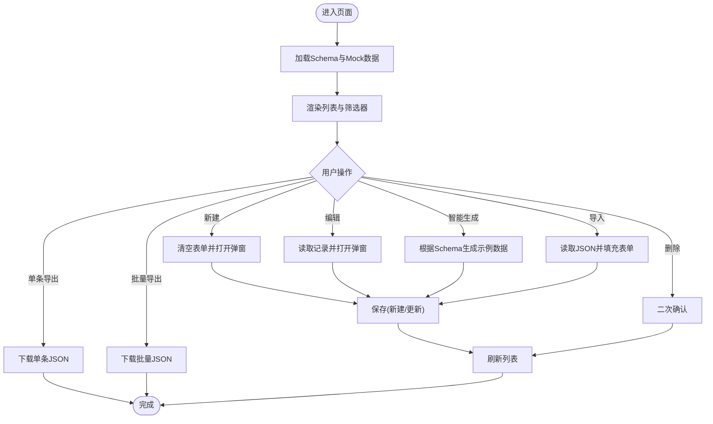
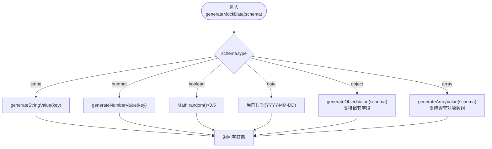
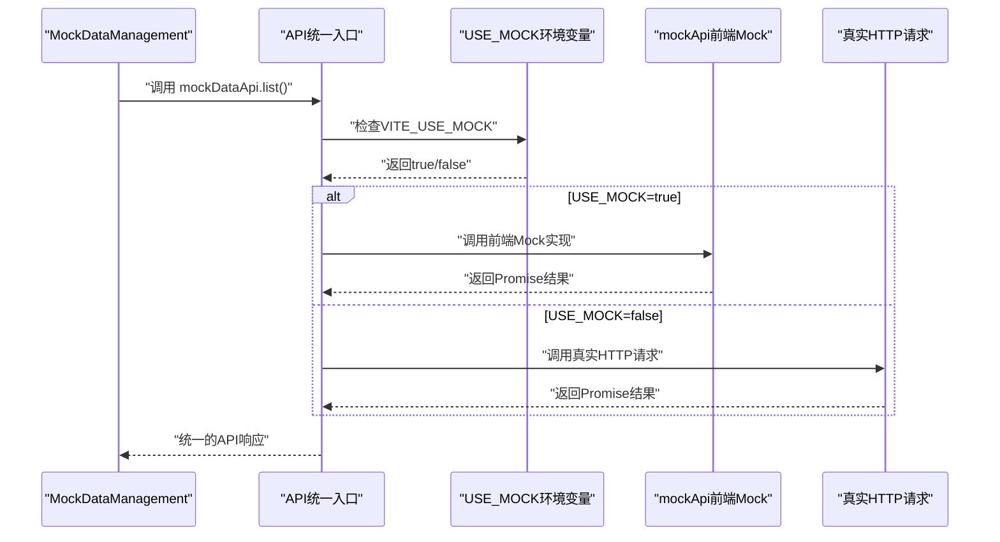
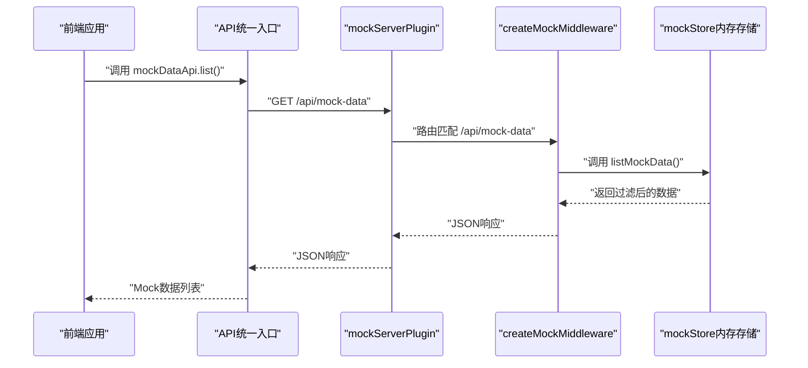
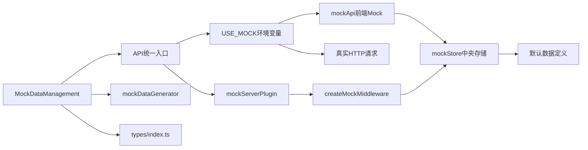

# Mock数据管理

<cite>
**本文引用的文件**
- [MockDataManagement/index.tsx](file://designer/src/pages/MockDataManagement/index.tsx)
- [MockDataFormModal.tsx](file://designer/src/pages/MockDataManagement/components/MockDataFormModal.tsx)
- [mockDataGenerator.ts](file://designer/src/utils/mockDataGenerator.ts)
- [api.ts](file://designer/src/services/api.ts)
- [mockApi.ts](file://designer/src/services/mockApi.ts)
- [mockStore.ts](file://designer/src/services/mockStore.ts)
- [mockData.ts](file://designer/src/services/mock/mockData.ts)
- [types/index.ts](file://designer/src/types/index.ts)
- [vite.config.ts](file://designer/vite.config.ts)
- [server.ts](file://designer/mock/server.ts)
- [index.ts](file://designer/src/services/mock/index.ts)
- [App.tsx](file://designer/src/App.tsx)
- [MainLayout.tsx](file://designer/src/layouts/MainLayout.tsx)
- [README.md](file://README.md)
</cite>

## 更新摘要
**变更内容**
- 架构重构：Mock数据管理系统已重构为中央存储架构，删除了旧的独立文件结构
- 引入新服务：新增mockApi.ts、mockStore.ts服务，提供统一的Mock数据操作接口
- 环境变量支持：新增VITE_USE_MOCK环境变量，支持静态部署环境切换
- API统一：前端API通过USE_MOCK环境变量动态选择真实HTTP或前端内存Mock模式
- 中央存储：mockStore提供统一的数据管理接口，支持Schema、模板、Mock数据的CRUD操作

## 目录
1. [简介](#简介)
2. [项目结构](#项目结构)
3. [核心组件](#核心组件)
4. [架构概览](#架构概览)
5. [详细组件分析](#详细组件分析)
6. [依赖关系分析](#依赖关系分析)
7. [性能考量](#性能考量)
8. [故障排查指南](#故障排查指南)
9. [结论](#结论)
10. [附录](#附录)

## 简介
Mock数据管理是打印模板平台中的关键能力，用于支撑测试数据生成、预览与开发调试。系统现已重构为中央存储架构，通过统一的mockStore服务管理Schema、模板和Mock数据，结合可视化编辑器与智能生成器，提供完整的Mock数据生命周期管理：创建、编辑、删除、批量导出与导入。Mock数据既可用于模板设计阶段的快速预览，也可作为SDK批量打印的输入数据源。

**更新** 系统现已支持静态部署环境变量VITE_USE_MOCK，可根据环境自动切换前端内存Mock模式或真实HTTP请求模式。

## 项目结构
Mock数据管理功能主要分布在以下模块：
- 前端页面与组件：Mock数据管理页面、Schema管理页面、主布局与路由配置
- 业务工具：Mock数据生成器（基于Schema的递归生成）
- 服务层：统一的mockStore中央存储服务，提供Schema、模板、Mock数据的CRUD操作
- API层：mockApi前端Mock实现，支持USE_MOCK环境变量切换
- 类型定义：Mock数据与Schema字段的类型约束

**图表来源**
- [App.tsx:1-31](file://designer/src/App.tsx#L1-L31)
- [MainLayout.tsx:1-56](file://designer/src/layouts/MainLayout.tsx#L1-L56)
- [MockDataManagement/index.tsx:1-338](file://designer/src/pages/MockDataManagement/index.tsx#L1-L338)
- [MockDataFormModal.tsx:1-129](file://designer/src/pages/MockDataManagement/components/MockDataFormModal.tsx#L1-L129)
- [api.ts:1-134](file://designer/src/services/api.ts#L1-L134)
- [mockApi.ts:1-103](file://designer/src/services/mockApi.ts#L1-L103)
- [mockStore.ts:1-135](file://designer/src/services/mockStore.ts#L1-L135)
- [mockData.ts:1-200](file://designer/src/services/mock/mockData.ts#L1-L200)
- [mockDataGenerator.ts:1-113](file://designer/src/utils/mockDataGenerator.ts#L1-L113)
- [types/index.ts:360-378](file://designer/src/types/index.ts#L360-L378)
- [vite.config.ts:1-29](file://designer/vite.config.ts#L1-L29)
- [server.ts:1-193](file://designer/mock/server.ts#L1-L193)
- [index.ts:1-4](file://designer/src/services/mock/index.ts#L1-L4)

## 核心组件
- Mock数据管理页面：提供列表展示、筛选、新建/编辑弹窗、单条导出、批量导出与导入入口；集成智能生成器与Monaco编辑器。
- Mock数据生成器：依据Schema字段类型与命名规则，递归生成合理示例数据，支持嵌套对象结构。
- API统一入口：通过USE_MOCK环境变量动态选择前端内存Mock或真实HTTP请求模式。
- 中央存储服务：mockStore提供统一的Schema、模板、Mock数据CRUD操作接口。
- Vite集成中间件：提供完整的CRUD API支持，内置CORS设置和内存存储。

**更新** 系统现已重构为中央存储架构，mockStore统一管理所有Mock数据，支持静态部署环境变量VITE_USE_MOCK。

## 架构概览
Mock数据管理采用"前端页面 + 生成器 + API统一入口 + 中央存储服务 + Vite集成中间件"的分层架构。前端负责交互与数据展示，生成器负责Schema驱动的数据构造，API统一入口负责根据环境变量选择合适的实现，中央存储服务负责统一的数据管理，Vite中间件插件负责提供REST API和内存存储。

**更新** 架构现已重构为中央存储模式，所有Mock数据操作通过mockStore统一管理，支持USE_MOCK环境变量切换。

**图表来源**
- [MockDataManagement/index.tsx:57-70](file://designer/src/pages/MockDataManagement/index.tsx#L57-L70)
- [api.ts:127-134](file://designer/src/services/api.ts#L127-L134)
- [mockApi.ts:75-102](file://designer/src/services/mockApi.ts#L75-L102)
- [mockStore.ts:97-134](file://designer/src/services/mockStore.ts#L97-L134)

## 详细组件分析

### Mock数据管理页面
- 列表与筛选：支持按Schema筛选、分页展示、时间格式化、Schema关联状态标签。
- 新建/编辑：弹窗内包含基本信息表单与JSON编辑器（Monaco），支持"手动编辑"和"智能生成"两个Tab。
- 智能生成：选择Schema后，调用生成器递归生成示例数据，填充编辑器。
- 导入/导出：支持单条导出为JSON、批量导出为JSON；单条导入JSON（解析name与data字段），批量导入预留。
- 删除：二次确认删除，调用API封装的delete方法。

**图表来源**
- [MockDataManagement/index.tsx:38-70](file://designer/src/pages/MockDataManagement/index.tsx#L38-L70)
- [MockDataManagement/index.tsx:182-200](file://designer/src/pages/MockDataManagement/index.tsx#L182-L200)

**章节来源**
- [MockDataManagement/index.tsx:1-338](file://designer/src/pages/MockDataManagement/index.tsx#L1-L338)

### Mock数据生成器
- 作用：根据Schema字段类型与命名规则，递归生成合理示例数据，覆盖字符串、数字、布尔、日期、对象、数组等类型。
- 算法要点：
  - 字符串：依据字段名关键词（如姓名、电话、邮箱、地址、编号、URL、状态）返回语义化示例。
  - 数字：依据字段名关键词（如价格、金额、数量、年龄、百分比）返回合理范围示例。
  - 布尔：50%概率返回true/false。
  - 日期：返回当前日期字符串（YYYY-MM-DD）。
  - 对象：递归生成children中的每个字段，支持嵌套结构。
  - 数组：生成2-5个元素，支持对象结构或基础类型。
- 复杂度：O(N)，N为Schema节点总数。

**图表来源**
- [mockDataGenerator.ts:4-113](file://designer/src/utils/mockDataGenerator.ts#L4-L113)

**章节来源**
- [mockDataGenerator.ts:4-113](file://designer/src/utils/mockDataGenerator.ts#L4-L113)

### API统一入口与前端Mock实现
- API统一入口：通过USE_MOCK环境变量判断，true时使用mockApi前端Mock实现，false时使用真实HTTP请求。
- 前端Mock实现：mockApi提供与真实API相同的接口，但所有操作都在前端内存中完成，支持异步延迟模拟真实网络请求。
- 环境变量支持：VITE_USE_MOCK=true时，所有API调用都走前端内存Mock，适合静态部署和演示环境。

**更新** 新增USE_MOCK环境变量支持，可根据部署环境自动切换前端Mock模式。

**更新** API统一入口现在支持USE_MOCK环境变量，可自动切换前端Mock模式。

**图表来源**
- [api.ts:127-134](file://designer/src/services/api.ts#L127-L134)
- [api.ts:10-13](file://designer/src/services/api.ts#L10-L13)

**章节来源**
- [api.ts:1-134](file://designer/src/services/api.ts#L1-L134)

### 中央存储服务与数据管理
- 中央存储服务：mockStore提供统一的数据管理接口，支持Schema、模板、Mock数据的CRUD操作。
- 内存存储：使用内存数组存储所有数据，支持结构化克隆初始化默认数据。
- 数据操作：提供完整的CRUD方法，支持条件查询和过滤。
- 默认数据：mockData.ts提供丰富的默认Schema、模板和Mock数据，支持多种业务场景。

**更新** 新增mockStore中央存储服务，统一管理所有Mock数据，提供内存存储和CRUD操作。

```mermaid
flowchart TD
Store["mockStore 中央存储"] --> Schemas["schemas: SchemaDictionary[]"]
Store --> Templates["templates: PrintTemplate[]"]
Store --> MockData["mockDataStore: MockData[]"]
Schemas --> ListSchemas["listSchemas(name?)"]
Schemas --> GetSchema["getSchema(id)"]
Schemas --> CreateSchema["createSchema(data)"]
Schemas --> UpdateSchema["updateSchema(id, data)"]
Schemas --> DeleteSchema["deleteSchema(id)"]
Templates --> ListTemplates["listTemplates(params?)"]
Templates --> GetTemplate["getTemplate(id)"]
Templates --> CreateTemplate["createTemplate(data)"]
Templates --> UpdateTemplate["updateTemplate(id, data)"]
Templates --> DeleteTemplate["deleteTemplate(id)"]
MockData --> ListMockData["listMockData(params?)"]
MockData --> GetMockData["getMockData(id)"]
MockData --> CreateMockData["createMockData(data)"]
MockData --> UpdateMockData["updateMockData(id, data)"]
MockData --> DeleteMockData["deleteMockData(id)"]
```

**更新** 中央存储服务提供统一的数据管理接口，支持Schema、模板、Mock数据的CRUD操作。

**图表来源**
- [mockStore.ts:29-134](file://designer/src/services/mockStore.ts#L29-L134)
- [mockData.ts:1-200](file://designer/src/services/mock/mockData.ts#L1-L200)

**章节来源**
- [mockStore.ts:1-135](file://designer/src/services/mockStore.ts#L1-L135)
- [mockData.ts:1-200](file://designer/src/services/mock/mockData.ts#L1-L200)

### Vite集成中间件插件
- Vite集成中间件：提供完整的CRUD API支持，内置CORS设置，支持同源访问。
- 中间件实现：createMockMiddleware处理所有/api路径的请求，支持JSON解析和响应。
- 插件配置：mockServerPlugin自动挂载到Vite开发服务器，监听/api/*路由。
- 环境变量：通过VITE_USE_MOCK控制是否启用前端Mock模式。

**更新** Vite中间件插件现在与前端mockStore服务配合，提供统一的开发体验。

**更新** Vite中间件插件提供同源访问和CORS支持，简化开发流程。

**图表来源**
- [server.ts:36-179](file://designer/mock/server.ts#L36-L179)
- [server.ts:184-193](file://designer/mock/server.ts#L184-L193)
- [vite.config.ts:5-18](file://designer/vite.config.ts#L5-L18)

**章节来源**
- [server.ts:1-193](file://designer/mock/server.ts#L1-L193)
- [vite.config.ts:1-29](file://designer/vite.config.ts#L1-L29)

### 类型定义与Schema集成
- MockData类型：包含id、name、schemaId、templateId、data、description等字段。
- SchemaField类型：包含key、label、type、children、enum、format等，支持嵌套对象与数组。
- 生成器与页面均依赖Schema进行智能生成与关联展示。
- 默认数据：mockData.ts提供丰富的默认Schema、模板和Mock数据，覆盖多种业务场景。

**章节来源**
- [types/index.ts:360-378](file://designer/src/types/index.ts#L360-L378)
- [types/index.ts:18-33](file://designer/src/types/index.ts#L18-L33)
- [mockData.ts:1-200](file://designer/src/services/mock/mockData.ts#L1-L200)

## 依赖关系分析
- MockDataManagement依赖：
  - API统一入口：根据USE_MOCK环境变量选择前端Mock或真实HTTP
  - 生成器：用于智能生成示例数据
  - 类型定义：用于表单校验与TS约束
  - 中央存储服务：提供统一的数据管理接口
- API统一入口依赖：USE_MOCK环境变量、Axios客户端
- 前端Mock实现依赖：mockStore中央存储服务
- 中央存储服务依赖：默认数据定义、UUID生成
- Vite中间件插件依赖：mockStore内存存储、CORS设置

**更新** 依赖关系现已重构为中央存储架构，所有Mock数据操作通过mockStore统一管理。

**更新** 依赖关系现已重构为中央存储架构，mockStore统一管理所有数据。

**图表来源**
- [MockDataManagement/index.tsx:22-25](file://designer/src/pages/MockDataManagement/index.tsx#L22-L25)
- [api.ts:10-13](file://designer/src/services/api.ts#L10-L13)
- [mockApi.ts:1-2](file://designer/src/services/mockApi.ts#L1-L2)
- [mockStore.ts:1-2](file://designer/src/services/mockStore.ts#L1-L2)
- [server.ts:5-6](file://designer/mock/server.ts#L5-L6)

**章节来源**
- [MockDataManagement/index.tsx:1-338](file://designer/src/pages/MockDataManagement/index.tsx#L1-L338)
- [api.ts:1-134](file://designer/src/services/api.ts#L1-L134)
- [mockApi.ts:1-103](file://designer/src/services/mockApi.ts#L1-L103)
- [mockStore.ts:1-135](file://designer/src/services/mockStore.ts#L1-L135)
- [server.ts:1-193](file://designer/mock/server.ts#L1-L193)
- [types/index.ts:1-378](file://designer/src/types/index.ts#L1-L378)

## 性能考量
- 生成器复杂度：O(N)，N为Schema节点数，通常较小，生成开销可控。
- 列表渲染：Ant Design Table分页加载，建议在大数据量时启用服务端分页与过滤。
- 导入/导出：单条导出为轻量JSON，批量导出需注意浏览器内存占用；建议对超大集合分批导出。
- 网络请求：API统一入口根据USE_MOCK环境变量选择前端Mock或真实HTTP，前端Mock无网络延迟。
- 内存存储：mockStore使用内存存储，重启后数据丢失，适合开发环境；生产环境需要持久化存储。
- 环境变量：VITE_USE_MOCK=true时，所有API调用都走前端内存Mock，性能最优。

**更新** 性能考量现在包括USE_MOCK环境变量的优势和内存存储的特点。

## 故障排查指南
- 生成失败：若未选择Schema或Schema不存在，页面会给出提示；请先创建并关联有效Schema。
- 保存失败：若JSON格式错误，会提示"JSON格式错误"，请修正后重试。
- 删除失败：若mockStore返回404，表示记录不存在；请刷新列表后重试。
- 导入失败：仅支持包含name与data字段的JSON；解析异常会提示"文件解析失败"。
- 环境变量问题：VITE_USE_MOCK未正确设置时，API可能无法正确切换前端Mock模式。
- CORS问题：Vite中间件已内置CORS设置，如遇跨域问题，检查浏览器控制台错误信息。
- 开发环境：VITE_USE_MOCK=true时，所有API调用都走前端内存Mock，无网络延迟。

**更新** 故障排查指南现在包括USE_MOCK环境变量和前端Mock模式的特有问题。

**章节来源**
- [MockDataManagement/index.tsx:101-118](file://designer/src/pages/MockDataManagement/index.tsx#L101-L118)
- [MockDataManagement/index.tsx:150-180](file://designer/src/pages/MockDataManagement/index.tsx#L150-L180)
- [api.ts:10-13](file://designer/src/services/api.ts#L10-L13)

## 结论
Mock数据管理以中央存储架构为核心，结合智能生成器与可视化编辑器，提供了高效、易用的测试数据管理方案。系统现已重构为统一的mockStore服务，支持Schema、模板、Mock数据的集中管理，通过USE_MOCK环境变量实现前端Mock模式与真实HTTP模式的无缝切换。其内置的丰富默认示例数据使开发者能够快速上手，满足测试、预览与调试的多样化需求。新增的嵌套对象支持进一步增强了系统的灵活性，能够处理复杂的多层嵌套数据结构，适用于各种复杂的业务场景。

**更新** 结论现在强调中央存储架构的优势和USE_MOCK环境变量的重要性。

## 附录

### Mock数据的作用与重要性
- 测试数据生成：快速生成符合Schema结构的示例数据，加速模板设计与验证。
- 预览功能：在设计器中直接预览打印效果，减少反复调试成本。
- 开发调试：提供稳定、可复现的数据源，便于联调与回归测试。
- 静态部署：通过USE_MOCK环境变量支持静态部署环境，无需后端服务。

**章节来源**
- [README.md:90-112](file://README.md#L90-L112)

### Mock数据的创建、编辑、删除与批量操作
- 创建：填写基本信息与JSON数据，保存后mockStore返回新建记录。
- 编辑：打开弹窗，修改名称、描述、Schema关联与JSON数据。
- 删除：二次确认后调用delete方法，mockStore返回204。
- 批量导出：将当前列表导出为JSON文件，便于备份与迁移。
- 导入：支持单条JSON导入（解析name与data字段），批量导入预留。

**更新** 操作现在通过mockStore统一执行，支持USE_MOCK环境变量切换。

**章节来源**
- [MockDataManagement/index.tsx:72-200](file://designer/src/pages/MockDataManagement/index.tsx#L72-L200)
- [mockStore.ts:116-133](file://designer/src/services/mockStore.ts#L116-L133)

### Mock数据生成器工作原理
- 随机数据生成算法：基于字段类型与关键词匹配，返回语义化示例；布尔与日期采用固定策略。
- 数据格式化规则：字符串与数字按业务语义生成；对象与数组递归展开。
- 嵌套对象支持：能够递归处理多层嵌套结构，支持复杂的字段路径表达式。
- 复杂度：O(N)，适合Schema规模场景。

**章节来源**
- [mockDataGenerator.ts:4-113](file://designer/src/utils/mockDataGenerator.ts#L4-L113)

### Mock数据导入导出使用指南
- 导出：单条导出为{name, schemaId, description, data} JSON；批量导出为数组JSON。
- 导入：单条导入需包含name与data字段；批量导入预留（当前TODO）。
- CSV支持：当前未实现CSV导入导出，如需可扩展Reader/Writer与格式转换。

**章节来源**
- [MockDataManagement/index.tsx:120-180](file://designer/src/pages/MockDataManagement/index.tsx#L120-L180)

### 环境变量配置与静态部署
- VITE_USE_MOCK：控制是否启用前端Mock模式，true时所有API调用都走前端内存Mock。
- Vite配置：vite.config.ts通过define选项强制注入环境变量，避免平台兼容性问题。
- 部署支持：静态部署时可通过环境变量控制，无需后端服务依赖。
- 演示模式：通过--mode demo构建时自动启用前端Mock模式。

**更新** 新增环境变量配置和静态部署支持的详细说明。

**章节来源**
- [api.ts:10-13](file://designer/src/services/api.ts#L10-L13)
- [vite.config.ts:10-13](file://designer/vite.config.ts#L10-L13)

### 中央存储架构最佳实践与实际应用场景
- 最佳实践：
  - 使用mockStore统一管理所有Mock数据，确保数据一致性。
  - 通过USE_MOCK环境变量实现开发与生产的无缝切换。
  - 利用默认数据快速启动项目，减少初始化成本。
  - 在静态部署环境中充分利用前端Mock模式的优势。
  - 合理使用嵌套对象结构，提高数据表达能力。
- 实际场景：
  - 模板设计阶段的快速预览与对比。
  - SDK集成时的离线测试与演示数据准备。
  - 团队协作中的数据共享与版本管理。
  - 开发环境中的同源访问和CORS支持。
  - 复杂业务场景下的多层嵌套数据处理。
  - 静态部署环境中的独立运行能力。

**更新** 最佳实践现在包括中央存储架构和环境变量配置的使用场景。

**章节来源**
- [README.md:49-54](file://README.md#L49-L54)
- [mockStore.ts:18-23](file://designer/src/services/mockStore.ts#L18-L23)
- [api.ts:127-134](file://designer/src/services/api.ts#L127-L134)