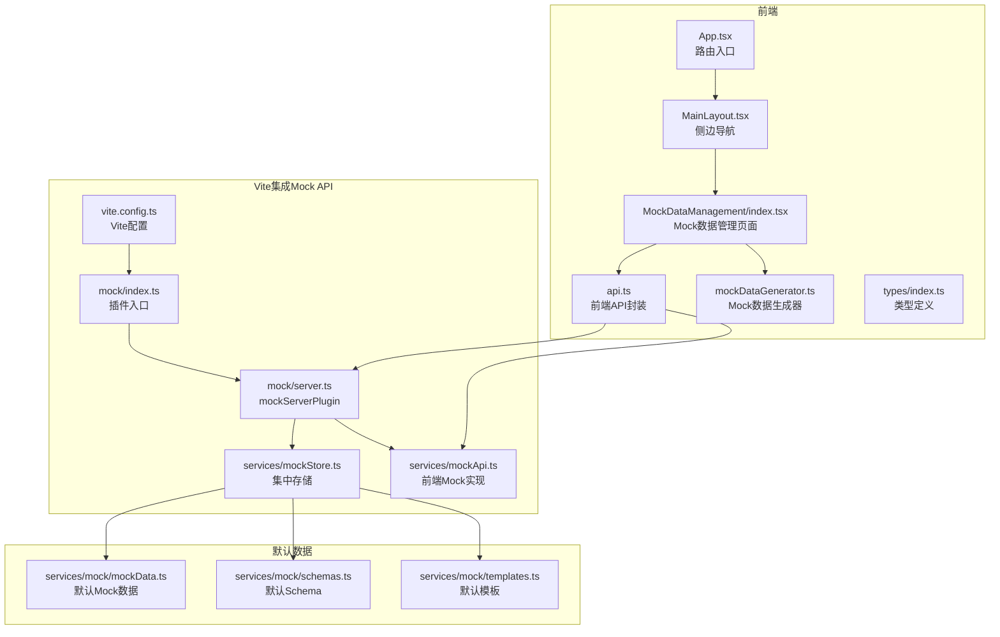
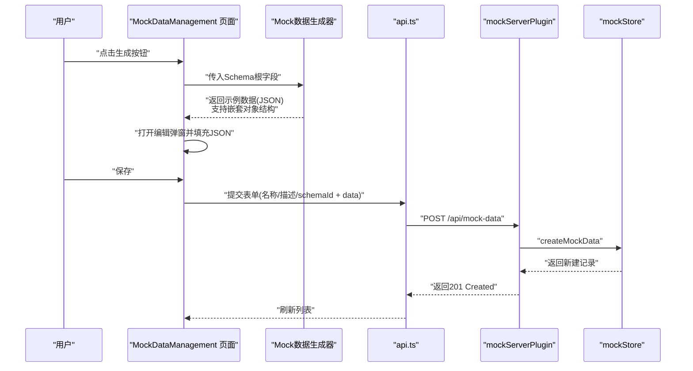
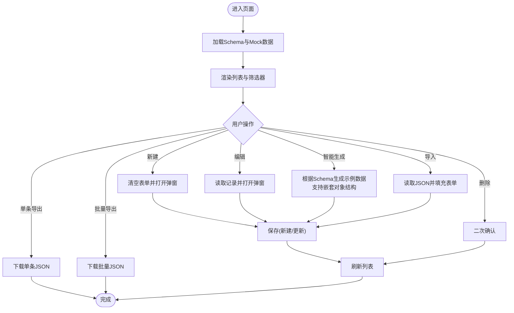
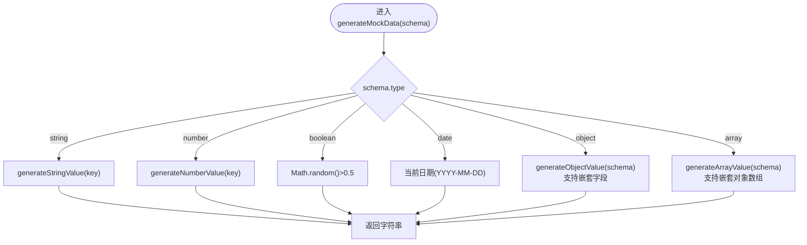
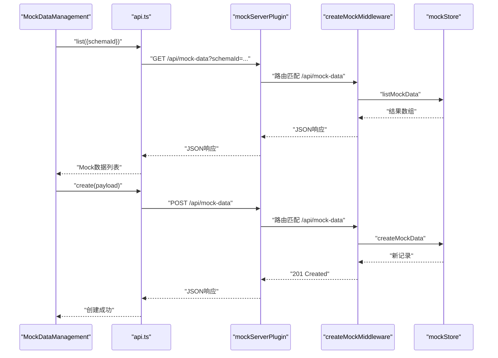
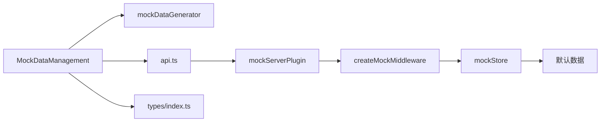

# Mock数据管理

<cite>
**本文引用的文件**
- [MockDataManagement/index.tsx](file://designer/src/pages/MockDataManagement/index.tsx)
- [mockDataGenerator.ts](file://designer/src/utils/mockDataGenerator.ts)
- [api.ts](file://designer/src/services/api.ts)
- [mockApi.ts](file://designer/src/services/mockApi.ts)
- [mockStore.ts](file://designer/src/services/mockStore.ts)
- [types/index.ts](file://designer/src/types/index.ts)
- [vite.config.ts](file://designer/vite.config.ts)
- [server.ts](file://designer/mock/server.ts)
- [mockData.ts](file://designer/src/services/mock/mockData.ts)
- [schemas.ts](file://designer/src/services/mock/schemas.ts)
- [templates.ts](file://designer/src/services/mock/templates.ts)
- [index.ts](file://designer/mock/index.ts)
- [App.tsx](file://designer/src/App.tsx)
- [MainLayout.tsx](file://designer/src/layouts/MainLayout.tsx)
- [README.md](file://README.md)
</cite>

## 更新摘要
**变更内容**
- 更新架构重构：移除旧的AssetManagement组织结构，采用集中式Mock服务架构
- 更新Mock API实现：从Express中间件迁移到Vite插件系统，统一mockServerPlugin
- 更新Mock数据生成器：保持原有功能，增强嵌套对象支持
- 更新Mock存储系统：集中化mockStore管理，支持前后端共享
- 新增嵌套对象数据结构支持：支持深层嵌套的对象字段，如`product.name`、`customer.address`等

## 目录
1. [简介](#简介)
2. [项目结构](#项目结构)
3. [核心组件](#核心组件)
4. [架构概览](#架构概览)
5. [详细组件分析](#详细组件分析)
6. [依赖关系分析](#依赖关系分析)
7. [性能考量](#性能考量)
8. [故障排查指南](#故障排查指南)
9. [结论](#结论)
10. [附录](#附录)

## 简介
Mock数据管理是打印模板平台中的关键能力，用于支撑测试数据生成、预览与开发调试。它通过Schema驱动的智能生成器，结合可视化编辑器与Vite集成的mock API，提供完整的Mock数据生命周期管理：创建、编辑、删除、批量导出与导入（单条JSON导入已完成，批量导入预留）。Mock数据既可用于模板设计阶段的快速预览，也可作为SDK批量打印的输入数据源。

**更新** 系统现已采用集中式架构，移除了旧的AssetManagement组织结构，Mock服务通过mockServerPlugin统一管理，支持嵌套对象数据结构，能够处理复杂的多层嵌套字段，如`items[0].product.name`等路径表达式。

## 项目结构
Mock数据管理功能主要分布在以下模块：
- 前端页面与组件：Mock数据管理页面、Schema管理页面、主布局与路由配置
- 业务工具：Mock数据生成器（基于Schema的递归生成）
- Vite集成mock API：前端API封装与Vite中间件插件
- 类型定义：Mock数据与Schema字段的类型约束
- Mock存储系统：集中化的内存存储管理

**图表来源**
- [App.tsx:1-31](file://designer/src/App.tsx#L1-L31)
- [MainLayout.tsx:1-56](file://designer/src/layouts/MainLayout.tsx#L1-L56)
- [MockDataManagement/index.tsx:1-338](file://designer/src/pages/MockDataManagement/index.tsx#L1-L338)
- [api.ts:1-134](file://designer/src/services/api.ts#L1-L134)
- [mockDataGenerator.ts:1-113](file://designer/src/utils/mockDataGenerator.ts#L1-L113)
- [types/index.ts:1-378](file://designer/src/types/index.ts#L1-L378)
- [vite.config.ts:1-29](file://designer/vite.config.ts#L1-L29)
- [index.ts:1-7](file://designer/mock/index.ts#L1-L7)
- [server.ts:1-193](file://designer/mock/server.ts#L1-L193)
- [mockStore.ts:1-135](file://designer/src/services/mockStore.ts#L1-L135)
- [mockApi.ts:1-103](file://designer/src/services/mockApi.ts#L1-L103)
- [mockData.ts:1-562](file://designer/src/services/mock/mockData.ts#L1-L562)
- [schemas.ts:1-147](file://designer/src/services/mock/schemas.ts#L1-L147)
- [templates.ts:1-800](file://designer/src/services/mock/templates.ts#L1-L800)

## 核心组件
- Mock数据管理页面：提供列表展示、筛选、新建/编辑弹窗、单条导出、批量导出与导入入口；集成智能生成器与Monaco编辑器。
- Mock数据生成器：依据Schema字段类型与命名规则，递归生成合理示例数据，支持嵌套对象结构。
- Vite集成API封装：统一调用mockServerPlugin提供的REST接口，支持分页查询与条件过滤。
- 集中式Mock存储：统一管理Schema、模板和Mock数据，支持前后端共享同一套数据。
- 集中式Mock服务：通过mockServerPlugin提供完整的CRUD API支持，内置CORS设置和内存存储。

**更新** Mock数据管理页面现已采用集中式架构，Mock服务通过mockServerPlugin统一管理，支持嵌套对象数据结构，能够递归生成复杂的多层嵌套数据结构。

**章节来源**
- [MockDataManagement/index.tsx:27-338](file://designer/src/pages/MockDataManagement/index.tsx#L27-L338)
- [mockDataGenerator.ts:4-113](file://designer/src/utils/mockDataGenerator.ts#L4-L113)
- [api.ts:97-125](file://designer/src/services/api.ts#L97-L125)
- [server.ts:184-193](file://designer/mock/server.ts#L184-L193)
- [mockStore.ts:29-135](file://designer/src/services/mockStore.ts#L29-L135)

## 架构概览
Mock数据管理采用"前端页面 + 生成器 + Vite集成API + 集中式Mock存储"的分层架构。前端负责交互与数据展示，生成器负责Schema驱动的数据构造，API封装负责与Vite中间件通信，集中式Mock存储负责提供统一的数据源。

**更新** 生成器现在能够处理嵌套对象结构，支持复杂的多层嵌套字段，API调用通过mockServerPlugin统一管理。

**图表来源**
- [MockDataManagement/index.tsx:102-118](file://designer/src/pages/MockDataManagement/index.tsx#L102-L118)
- [mockDataGenerator.ts:4-113](file://designer/src/utils/mockDataGenerator.ts#L4-L113)
- [api.ts:112-115](file://designer/src/services/api.ts#L112-L115)
- [server.ts:151-155](file://designer/mock/server.ts#L151-L155)
- [mockStore.ts:116-120](file://designer/src/services/mockStore.ts#L116-L120)

## 详细组件分析

### Mock数据管理页面
- 列表与筛选：支持按Schema筛选、分页展示、时间格式化、Schema关联状态标签。
- 新建/编辑：弹窗内包含基本信息表单与JSON编辑器（Monaco），支持"手动编辑"和"智能生成"两个Tab。
- 智能生成：选择Schema后，调用生成器递归生成示例数据，填充编辑器。
- 导入/导出：支持单条导出为JSON、批量导出为JSON；单条导入JSON（解析name与data字段），批量导入预留。
- 删除：二次确认删除，调用mockServerPlugin删除接口。

**图表来源**
- [MockDataManagement/index.tsx:38-70](file://designer/src/pages/MockDataManagement/index.tsx#L38-L70)
- [MockDataManagement/index.tsx:182-210](file://designer/src/pages/MockDataManagement/index.tsx#L182-L210)

**章节来源**
- [MockDataManagement/index.tsx:27-338](file://designer/src/pages/MockDataManagement/index.tsx#L27-L338)

### Mock数据生成器
- 作用：根据Schema字段类型与命名规则，递归生成合理示例数据，覆盖字符串、数字、布尔、日期、对象、数组等类型。
- 算法要点：
  - 字符串：依据字段名关键词（如姓名、电话、邮箱、地址、编号、URL、状态）返回语义化示例。
  - 数字：依据字段名关键词（如价格、金额、数量、年龄、百分比）返回合理范围示例。
  - 布尔：50%概率返回true/false。
  - 日期：返回当前日期字符串（YYYY-MM-DD）。
  - 对象：递归生成children中的每个字段，支持嵌套结构。
  - 数组：生成2-5个元素，支持对象结构或基础类型。
- 复杂度：O(N)，N为Schema节点总数。

**更新** 生成器现已增强对嵌套对象的支持，能够递归处理多层嵌套结构，支持复杂的字段路径表达式。

**图表来源**
- [mockDataGenerator.ts:4-113](file://designer/src/utils/mockDataGenerator.ts#L4-L113)

**章节来源**
- [mockDataGenerator.ts:4-113](file://designer/src/utils/mockDataGenerator.ts#L4-L113)

### Vite集成API封装与集中式Mock服务
- Vite集成API封装：提供Mock数据的list/get/create/update/delete方法，统一使用`/api`前缀，支持name/schemaId/templateId查询参数。
- 集中式Mock服务：通过mockServerPlugin提供完整的CRUD API支持，内置CORS设置，支持同源访问；使用集中化的mockStore替代文件存储，支持热重载。
- 开发环境配置：Vite配置中集成mockServerPlugin，自动挂载到`/api`路径。

**更新** API封装现在使用mockServerPlugin，提供更好的开发体验和同源访问支持，采用集中式mockStore统一管理数据。

**更新** API调用现在通过mockServerPlugin，使用`/api`前缀，支持同源访问和CORS设置，采用集中式mockStore管理数据。

**图表来源**
- [api.ts:97-125](file://designer/src/services/api.ts#L97-L125)
- [server.ts:134-169](file://designer/mock/server.ts#L134-L169)
- [server.ts:184-193](file://designer/mock/server.ts#L184-L193)
- [vite.config.ts:5-18](file://designer/vite.config.ts#L5-L18)

**章节来源**
- [api.ts:97-125](file://designer/src/services/api.ts#L97-L125)
- [server.ts:134-169](file://designer/mock/server.ts#L134-L169)
- [vite.config.ts:5-18](file://designer/vite.config.ts#L5-L18)

### 集中式Mock存储系统
- 集中式存储：统一管理Schema、模板和Mock数据，支持前后端共享同一套数据。
- 内存存储：使用mockStore进行内存存储，支持resetMockStore重置为初始状态。
- 数据同步：前后端通过mockApi和mockServerPlugin共享同一套数据逻辑。

**更新** Mock存储系统已集中化，通过mockStore统一管理所有数据类型，支持前后端共享。

**章节来源**
- [mockStore.ts:29-135](file://designer/src/services/mockStore.ts#L29-L135)
- [mockApi.ts:75-102](file://designer/src/services/mockApi.ts#L75-L102)

### 类型定义与Schema集成
- MockData类型：包含id、name、schemaId、templateId、data、description等字段。
- SchemaField类型：包含key、label、type、children、enum、format等，支持嵌套对象与数组。
- 生成器与页面均依赖Schema进行智能生成与关联展示。

**更新** Schema现在支持更复杂的嵌套对象结构，能够处理多层嵌套字段，支持嵌套路径的数据绑定。

**章节来源**
- [types/index.ts:364-378](file://designer/src/types/index.ts#L364-L378)
- [types/index.ts:18-33](file://designer/src/types/index.ts#L18-L33)
- [MockDataManagement/index.tsx:28-29](file://designer/src/pages/MockDataManagement/index.tsx#L28-L29)

## 依赖关系分析
- MockDataManagement依赖：
  - 生成器：用于智能生成示例数据
  - API封装：用于CRUD与查询
  - 类型定义：用于表单校验与TS约束
  - Mock服务：提供后端数据源
- 生成器依赖：SchemaField类型与递归结构
- API封装依赖：Axios客户端与mockServerPlugin
- Mock服务依赖：mockStore集中存储

**更新** 依赖关系现在通过mockServerPlugin，提供更好的开发体验和同源访问支持，采用集中式mockStore管理数据。

**更新** 依赖关系现在通过mockServerPlugin，提供更好的开发体验和同源访问支持，采用集中式mockStore管理数据。

**图表来源**
- [MockDataManagement/index.tsx:28-29](file://designer/src/pages/MockDataManagement/index.tsx#L28-L29)
- [mockDataGenerator.ts:1](file://designer/src/utils/mockDataGenerator.ts#L1)
- [api.ts:1-134](file://designer/src/services/api.ts#L1-L134)
- [server.ts:1-193](file://designer/mock/server.ts#L1-L193)
- [types/index.ts:18-33](file://designer/src/types/index.ts#L18-L33)
- [mockStore.ts:1-135](file://designer/src/services/mockStore.ts#L1-L135)

**章节来源**
- [MockDataManagement/index.tsx:1-338](file://designer/src/pages/MockDataManagement/index.tsx#L1-L338)
- [mockDataGenerator.ts:1-113](file://designer/src/utils/mockDataGenerator.ts#L1-L113)
- [api.ts:1-134](file://designer/src/services/api.ts#L1-L134)
- [server.ts:1-193](file://designer/mock/server.ts#L1-L193)
- [types/index.ts:1-378](file://designer/src/types/index.ts#L1-L378)

## 性能考量
- 生成器复杂度：O(N)，N为Schema节点数，通常较小，生成开销可控。
- 列表渲染：Ant Design Table分页加载，建议在大数据量时启用服务端分页与过滤。
- 导入/导出：单条导出为轻量JSON，批量导出需注意浏览器内存占用；建议对超大集合分批导出。
- 网络请求：API封装统一基地址，使用mockServerPlugin提供更好的开发体验和同源访问。
- 内存存储：中间件使用集中式mockStore内存存储，重启后数据丢失，适合开发环境；生产环境需要持久化存储。

**更新** 性能考量现在包括mockServerPlugin的优势和集中式mockStore的特点。

## 故障排查指南
- 生成失败：若未选择Schema或Schema不存在，页面会给出提示；请先创建并关联有效Schema。
- 保存失败：若JSON格式错误，会提示"JSON格式错误"，请修正后重试。
- 删除失败：若中间件返回404，表示记录不存在；请刷新列表后重试。
- 导入失败：仅支持包含name与data字段的JSON；解析异常会提示"文件解析失败"。
- CORS问题：中间件已内置CORS设置，如遇跨域问题，检查浏览器控制台错误信息。
- 开发环境：mockServerPlugin自动挂载到`/api`路径，确保API调用使用正确的端点。

**更新** 故障排查指南现在包括mockServerPlugin特有的问题和解决方案。

**章节来源**
- [MockDataManagement/index.tsx:102-118](file://designer/src/pages/MockDataManagement/index.tsx#L102-L118)
- [MockDataManagement/index.tsx:182-210](file://designer/src/pages/MockDataManagement/index.tsx#L182-L210)
- [MockDataManagement/index.tsx:151-180](file://designer/src/pages/MockDataManagement/index.tsx#L151-L180)
- [server.ts:173-178](file://designer/mock/server.ts#L173-L178)

## 结论
Mock数据管理以Schema为核心，结合智能生成器与可视化编辑器，提供了高效、易用的测试数据管理方案。通过集中式的mockServerPlugin，开发者能够获得更好的开发体验，享受同源访问和CORS支持带来的便利。其内置的默认示例数据使开发者能够快速上手，满足测试、预览与调试的多样化需求。新增的嵌套对象支持进一步增强了系统的灵活性，能够处理复杂的多层嵌套数据结构，适用于各种复杂的业务场景。

**更新** 结论现在强调mockServerPlugin的优势和开发体验改进，以及嵌套对象支持的重要意义。

## 附录

### Mock数据的作用与重要性
- 测试数据生成：快速生成符合Schema结构的示例数据，加速模板设计与验证。
- 预览功能：在设计器中直接预览打印效果，减少反复调试成本。
- 开发调试：提供稳定、可复现的数据源，便于联调与回归测试。

**章节来源**
- [README.md:90-112](file://README.md#L90-L112)

### Mock数据的创建、编辑、删除与批量操作
- 创建：填写基本信息与JSON数据，保存后mockServerPlugin返回新建记录。
- 编辑：打开弹窗，修改名称、描述、Schema关联与JSON数据。
- 删除：二次确认后调用删除接口，mockServerPlugin返回204。
- 批量导出：将当前列表导出为JSON文件，便于备份与迁移。
- 导入：支持单条JSON导入（解析name与data字段），批量导入预留。

**更新** 操作现在通过mockServerPlugin执行，提供更好的开发体验。

**章节来源**
- [MockDataManagement/index.tsx:72-210](file://designer/src/pages/MockDataManagement/index.tsx#L72-L210)
- [server.ts:151-169](file://designer/mock/server.ts#L151-L169)

### Mock数据生成器工作原理
- 随机数据生成算法：基于字段类型与关键词匹配，返回语义化示例；布尔与日期采用固定策略。
- 数据格式化规则：字符串与数字按业务语义生成；对象与数组递归展开。
- 嵌套对象支持：能够递归处理多层嵌套结构，支持复杂的字段路径表达式。
- 复杂度：O(N)，适合Schema规模场景。

**更新** 生成器现已增强对嵌套对象的支持，能够处理复杂的多层嵌套数据结构。

**章节来源**
- [mockDataGenerator.ts:4-113](file://designer/src/utils/mockDataGenerator.ts#L4-L113)

### Mock数据导入导出使用指南
- 导出：单条导出为{name, schemaId, description, data} JSON；批量导出为数组JSON。
- 导入：单条导入需包含name与data字段；批量导入预留（当前TODO）。
- CSV支持：当前未实现CSV导入导出，如需可扩展Reader/Writer与格式转换。

**章节来源**
- [MockDataManagement/index.tsx:121-180](file://designer/src/pages/MockDataManagement/index.tsx#L121-L180)

### 嵌套对象数据结构支持详解

**更新** 新增嵌套对象数据结构支持的详细说明

#### 支持的嵌套路径类型
- 基础嵌套：如`customer.name`、`supplier.contact`
- 数组嵌套：如`items[0].product.name`、`details[1].spec`
- 多层嵌套：如`items[0].product.category.name`

#### 示例数据结构
系统提供了完整的嵌套对象示例：
- **mock-nested-order-001**：采购订单数据，每行包含嵌套的`product`对象
- **schema-demo-order-nested**：专门的嵌套对象Schema，演示多层嵌套字段
- **template-demo-label**：嵌套路径模板，展示如何在表格中使用嵌套字段

#### 应用场景
- 表格列绑定：使用`product.name`、`product.code`等嵌套路径
- 数据绑定：支持复杂的多层数据结构绑定
- 模板渲染：在打印模板中灵活使用嵌套数据

**章节来源**
- [mockData.ts:370-423](file://designer/src/services/mock/mockData.ts#L370-L423)
- [schemas.ts:88-145](file://designer/src/services/mock/schemas.ts#L88-L145)
- [templates.ts:722-800](file://designer/src/services/mock/templates.ts#L722-L800)

### 集中式Mock服务最佳实践与实际应用场景
- 最佳实践：
  - 为常用数据结构建立Schema，提升生成质量与一致性。
  - 使用"智能生成 + 手动编辑"组合，先生成再微调。
  - 对批量打印场景，确保data为数组结构，便于SDK批量渲染。
  - 利用mockServerPlugin的内存存储特性，在开发环境中快速迭代。
  - 合理使用嵌套对象结构，提高数据表达能力。
  - 通过mockStore统一管理数据，支持前后端共享。
- 实际场景：
  - 模板设计阶段的快速预览与对比。
  - SDK集成时的离线测试与演示数据准备。
  - 团队协作中的数据共享与版本管理。
  - 开发环境中的同源访问和CORS支持。
  - 复杂业务场景下的多层嵌套数据处理。
  - 集中式数据管理与维护。

**更新** 最佳实践现在包括嵌套对象支持的使用场景和注意事项，以及集中式mockStore的优势。

**章节来源**
- [README.md:49-54](file://README.md#L49-L54)
- [MockDataManagement/index.tsx:318-338](file://designer/src/pages/MockDataManagement/index.tsx#L318-L338)
- [server.ts:184-193](file://designer/mock/server.ts#L184-L193)
- [mockStore.ts:29-135](file://designer/src/services/mockStore.ts#L29-L135)