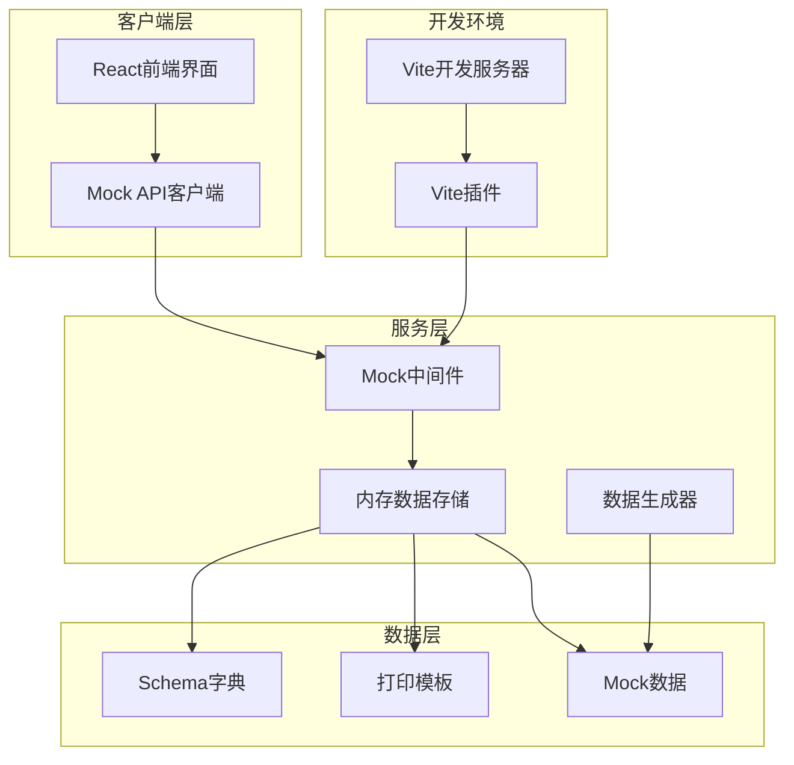
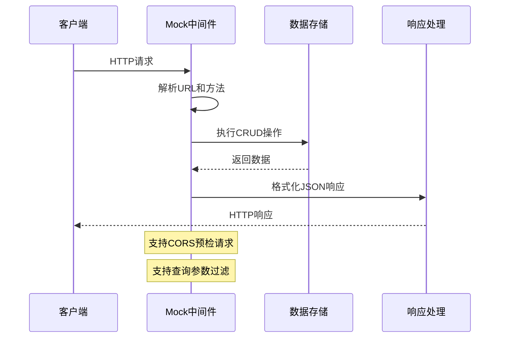
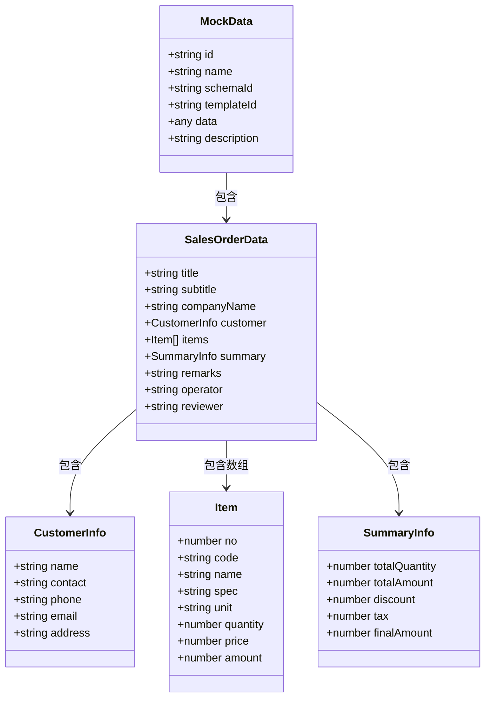
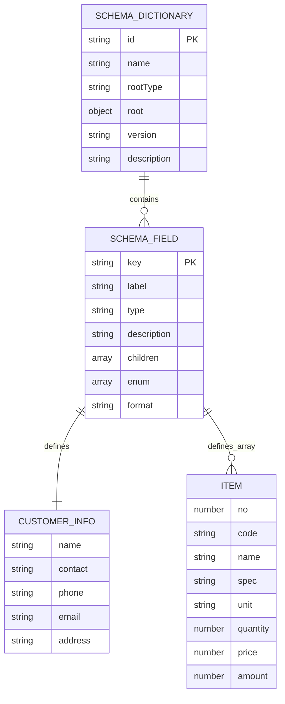
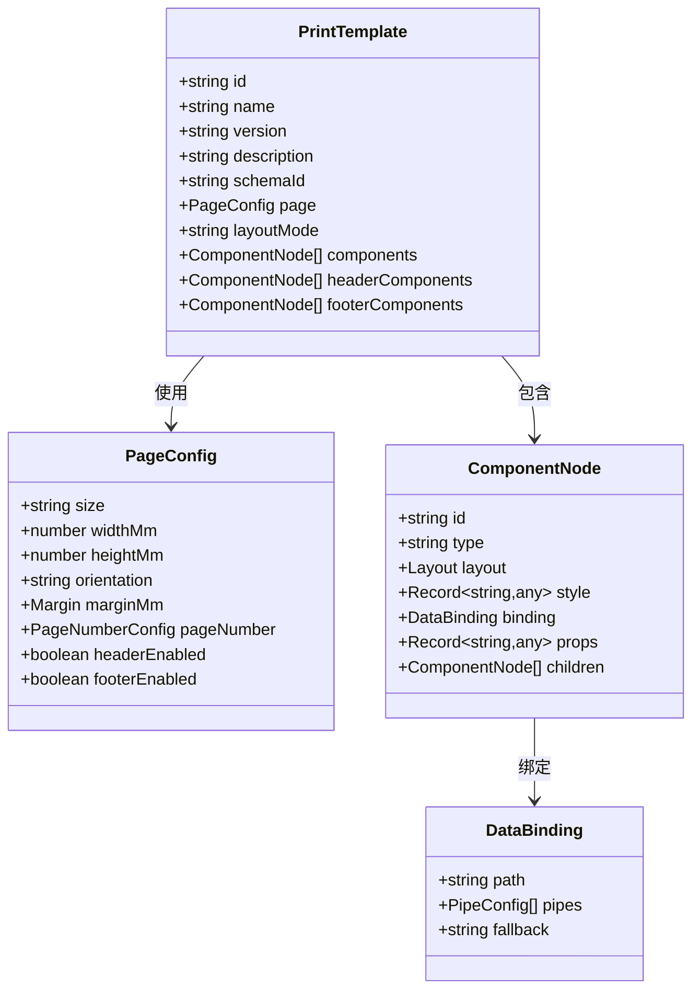
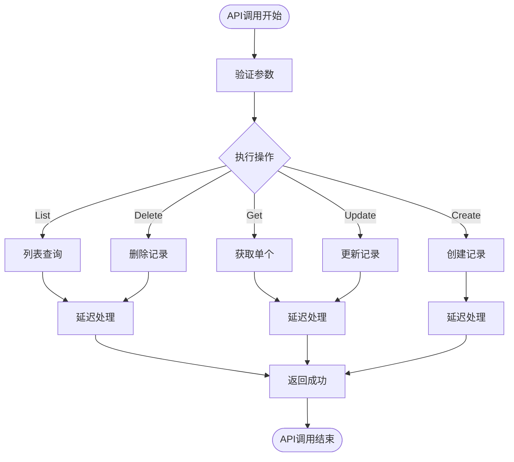
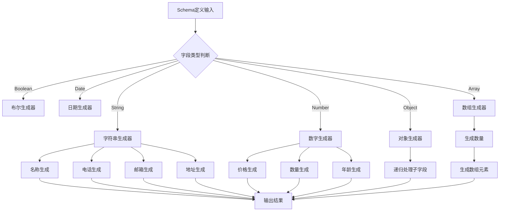
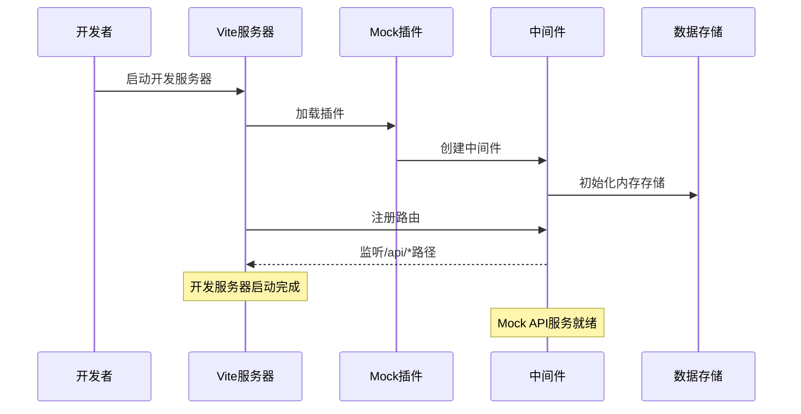

# 集中式Mock数据系统

<cite>
**本文档引用的文件**
- [mock/index.ts](file://designer/mock/index.ts)
- [mock/server.ts](file://designer/mock/server.ts)
- [services/mockStore.ts](file://designer/src/services/mockStore.ts)
- [services/mockApi.ts](file://designer/src/services/mockApi.ts)
- [services/mock/mockData.ts](file://designer/src/services/mock/mockData.ts)
- [services/mock/schemas.ts](file://designer/src/services/mock/schemas.ts)
- [services/mock/templates.ts](file://designer/src/services/mock/templates.ts)
- [utils/mockDataGenerator.ts](file://designer/src/utils/mockDataGenerator.ts)
- [types/index.ts](file://designer/src/types/index.ts)
- [vite.config.ts](file://designer/vite.config.ts)
- [package.json](file://designer/package.json)
</cite>

## 目录
1. [项目概述](#项目概述)
2. [系统架构](#系统架构)
3. [核心组件](#核心组件)
4. [Mock数据管理](#mock数据管理)
5. [Schema字典系统](#schema字典系统)
6. [打印模板系统](#打印模板系统)
7. [API接口设计](#api接口设计)
8. [数据生成机制](#数据生成机制)
9. [开发环境集成](#开发环境集成)
10. [性能优化策略](#性能优化策略)
11. [故障排除指南](#故障排除指南)
12. [总结](#总结)

## 项目概述

集中式Mock数据系统是一个专为打印设计器应用开发的完整Mock数据解决方案。该系统提供了完整的CRUD API、内存数据存储、数据生成器和开发环境集成，支持Schema字典、打印模板和Mock数据的统一管理。

系统采用Vite开发服务器中间件插件的形式，在开发环境中提供真实的API端点，同时保持数据的内存存储特性，确保开发效率和数据一致性。

## 系统架构

**架构图来源**
- [mock/server.ts:1-193](file://designer/mock/server.ts#L1-L193)
- [services/mockStore.ts:1-135](file://designer/src/services/mockStore.ts#L1-L135)
- [vite.config.ts:1-29](file://designer/vite.config.ts#L1-L29)

## 核心组件

### Mock中间件系统

Mock中间件是整个系统的核心，负责拦截API请求并提供相应的响应。它支持完整的RESTful API规范，包括CRUD操作和查询参数。

**架构图来源**
- [mock/server.ts:37-179](file://designer/mock/server.ts#L37-L179)

### 内存数据存储

系统使用内存存储来模拟数据库操作，提供完整的CRUD功能和数据查询能力。

**章节来源**
- [services/mockStore.ts:13-23](file://designer/src/services/mockStore.ts#L13-L23)

## Mock数据管理

### 内置Mock数据集

系统提供了丰富的内置Mock数据，涵盖各种业务场景和数据复杂度：

**架构图来源**
- [services/mock/mockData.ts:6-562](file://designer/src/services/mock/mockData.ts#L6-L562)

### 数据类型定义

系统使用TypeScript接口定义了完整的数据结构：

**章节来源**
- [types/index.ts:364-378](file://designer/src/types/index.ts#L364-L378)

## Schema字典系统

### Schema结构设计

Schema字典系统提供了灵活的数据模型定义能力，支持嵌套对象和数组结构：

**架构图来源**
- [services/mock/schemas.ts:6-147](file://designer/src/services/mock/schemas.ts#L6-L147)

### 内置Schema示例

系统提供了两个主要的Schema示例：

1. **销售出库单Schema**：标准的业务单据结构
2. **采购订单Schema**：演示嵌套对象路径的数据结构

**章节来源**
- [services/mock/schemas.ts:6-147](file://designer/src/services/mock/schemas.ts#L6-L147)

## 打印模板系统

### 模板结构设计

打印模板系统支持复杂的页面布局和组件配置：

**架构图来源**
- [types/index.ts:337-358](file://designer/src/types/index.ts#L337-L358)

### 内置模板示例

系统提供了多种预定义的打印模板：

1. **订单打印模板**：标准的A4订单模板
2. **快递面单模板**：物流快递面单设计
3. **产品标签模板**：工业产品小尺寸标签
4. **采购订单模板**：演示嵌套路径的模板

**章节来源**
- [services/mock/templates.ts:6-720](file://designer/src/services/mock/templates.ts#L6-L720)

## API接口设计

### Mock API实现

系统提供了完整的前端Mock API实现，模拟异步延迟和错误处理：

**架构图来源**
- [services/mockApi.ts:1-103](file://designer/src/services/mockApi.ts#L1-L103)

### API功能特性

- **异步延迟**：模拟网络请求延迟
- **错误处理**：404错误和自定义异常
- **数据验证**：参数验证和类型检查
- **响应格式**：标准化的JSON响应格式

**章节来源**
- [services/mockApi.ts:19-102](file://designer/src/services/mockApi.ts#L19-L102)

## 数据生成机制

### Mock数据生成器

系统内置了智能的数据生成器，能够根据Schema定义自动生成符合业务规则的Mock数据：

**架构图来源**
- [utils/mockDataGenerator.ts:4-113](file://designer/src/utils/mockDataGenerator.ts#L4-L113)

### 生成策略

数据生成器采用智能策略，根据字段名称和类型生成合理的示例数据：

- **名称字段**：生成常见的中文名称
- **联系方式**：生成合法的手机号码和邮箱地址
- **金额数量**：生成符合业务逻辑的数值
- **日期时间**：生成当前时间或合理的历史时间

**章节来源**
- [utils/mockDataGenerator.ts:24-113](file://designer/src/utils/mockDataGenerator.ts#L24-L113)

## 开发环境集成

### Vite插件集成

系统通过Vite插件无缝集成Mock服务到开发环境：

**架构图来源**
- [vite.config.ts:15-19](file://designer/vite.config.ts#L15-L19)
- [mock/server.ts:184-192](file://designer/mock/server.ts#L184-L192)

### 插件配置

Vite插件提供了灵活的配置选项：

- **自动加载**：开发环境下自动启用
- **路径映射**：统一的API路由前缀
- **CORS支持**：完整的跨域资源共享支持
- **错误处理**：友好的开发时错误提示

**章节来源**
- [vite.config.ts:1-29](file://designer/vite.config.ts#L1-L29)

## 性能优化策略

### 内存存储优化

系统采用内存存储策略，在保证性能的同时提供完整的数据管理功能：

- **结构化克隆**：使用structuredClone确保数据完整性
- **增量更新**：支持局部数据更新而非全量替换
- **查询优化**：基于索引的快速查找和过滤
- **缓存策略**：避免重复的数据解析和转换

### 并发处理

系统设计考虑了并发访问的需求：

- **无锁设计**：内存操作天然支持高并发
- **原子操作**：CRUD操作的原子性保证
- **事务支持**：批量操作的事务性处理

## 故障排除指南

### 常见问题诊断

1. **API请求失败**
   - 检查Vite插件是否正确加载
   - 验证CORS配置是否正确
   - 确认路由前缀是否匹配

2. **数据查询异常**
   - 检查查询参数格式
   - 验证Schema ID的有效性
   - 确认数据存储状态

3. **开发服务器启动问题**
   - 检查端口占用情况
   - 验证依赖包安装状态
   - 确认配置文件语法正确

### 调试技巧

- **日志输出**：利用console.log进行调试
- **断点调试**：在浏览器开发者工具中设置断点
- **数据验证**：检查数据结构的完整性
- **网络监控**：使用浏览器网络面板监控请求

**章节来源**
- [mock/server.ts:173-178](file://designer/mock/server.ts#L173-L178)

## 总结

集中式Mock数据系统为打印设计器应用提供了完整的开发支持。通过Vite插件集成、内存存储、智能数据生成和完善的API设计，系统实现了高效、灵活且易于使用的Mock数据解决方案。

系统的主要优势包括：

- **开发效率**：无需外部API即可进行完整开发
- **数据一致性**：统一的数据模型和验证机制
- **扩展性强**：模块化的架构设计支持功能扩展
- **维护友好**：清晰的代码结构和完善的文档

该系统特别适合需要复杂数据模型和打印模板的业务场景，为开发者提供了可靠的Mock数据支持。