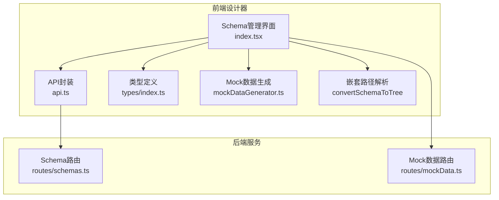
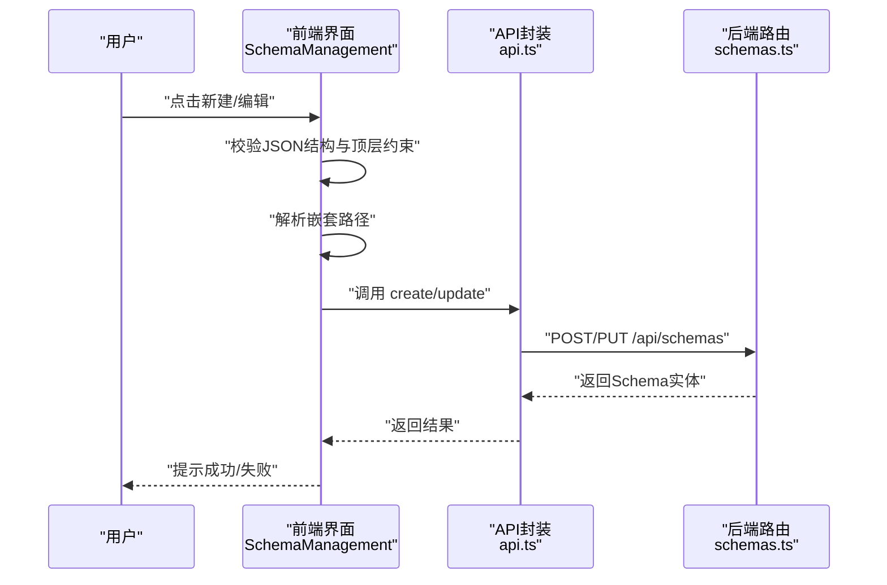
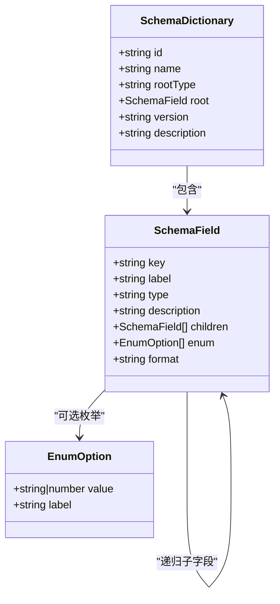
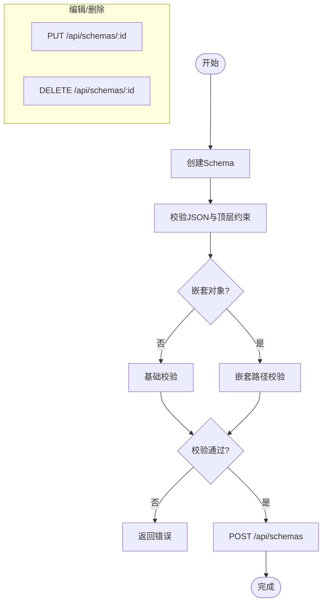
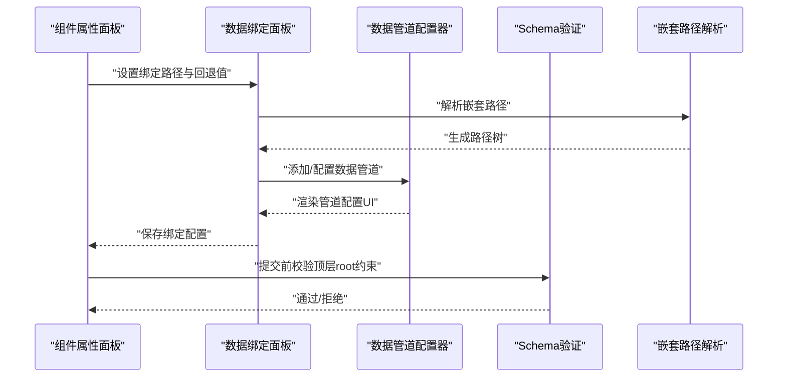
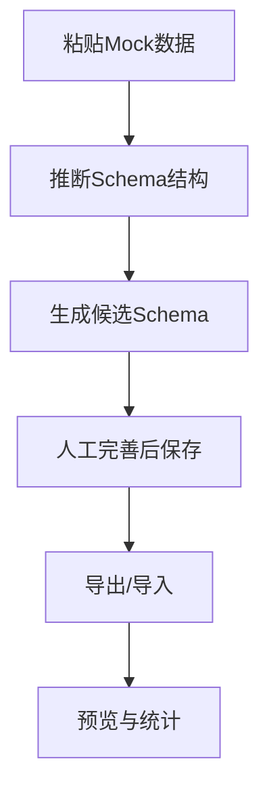
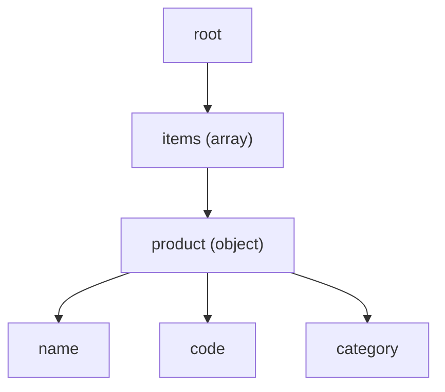
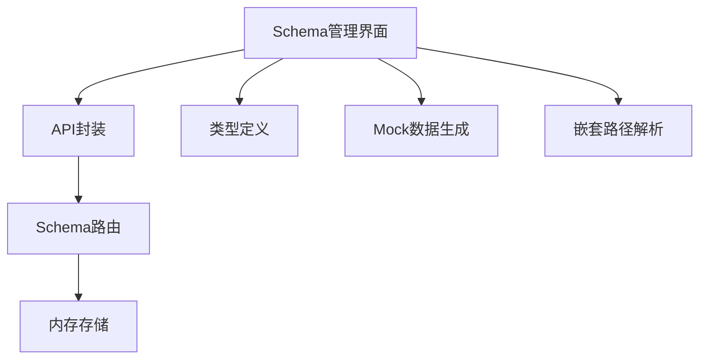

# Schema管理

<cite>
**本文引用的文件**
- [server/src/routes/schemas.ts](file://server/src/routes/schemas.ts)
- [designer/src/types/index.ts](file://designer/src/types/index.ts)
- [designer/src/services/api.ts](file://designer/src/services/api.ts)
- [designer/src/pages/AssetManagement/components/SchemaManagement/index.tsx](file://designer/src/pages/AssetManagement/components/SchemaManagement/index.tsx)
- [designer/src/pages/Designer/components/PropertyPanel/DataBindingSection.tsx](file://designer/src/pages/Designer/components/PropertyPanel/DataBindingSection.tsx)
- [designer/src/utils/mockDataGenerator.ts](file://designer/src/utils/mockDataGenerator.ts)
- [server/src/routes/mockData.ts](file://server/src/routes/mockData.ts)
- [designer/mock/schemas.ts](file://designer/mock/schemas.ts)
- [designer/mock/mockData.ts](file://designer/mock/mockData.ts)
- [designer/mock/templates.ts](file://designer/mock/templates.ts)
</cite>

## 更新摘要
**变更内容**
- 新增嵌套对象Schema支持，包括完整的嵌套路径解析机制
- 添加`schema-demo-order-nested`示例Schema，演示复杂嵌套数据结构
- 增强Schema树形结构渲染，支持多层级嵌套字段的可视化展示
- 完善数据绑定路径解析，支持点号路径语法的嵌套访问

## 目录
1. [简介](#简介)
2. [项目结构](#项目结构)
3. [核心组件](#核心组件)
4. [架构总览](#架构总览)
5. [详细组件分析](#详细组件分析)
6. [嵌套对象Schema支持](#嵌套对象schema支持)
7. [依赖关系分析](#依赖关系分析)
8. [性能考量](#性能考量)
9. [故障排查指南](#故障排查指南)
10. [结论](#结论)
11. [附录](#附录)

## 简介
本技术文档围绕Schema管理功能展开，系统性阐述SchemaDictionary的设计理念、数据模型结构、字段定义与类型系统、约束规则，以及Schema的创建、编辑、删除与版本管理能力。特别关注新增的嵌套对象Schema支持，深入说明多层级数据结构的建模与数据绑定机制。同时，文档详细说明Schema与组件绑定的关系、字段映射机制与数据验证流程，并提供最佳实践、常见使用场景、实际配置示例与数据模型设计指导，帮助开发者与设计师高效构建可维护的打印模板与数据资产。

## 项目结构
Schema管理功能由"前端设计器"和"后端服务"两部分组成：
- 前端设计器负责Schema的可视化编辑、智能生成、导入导出、预览与统计展示，并通过API与后端交互。
- 后端服务提供Schema的增删改查接口，内置默认示例Schema，支持按名称检索。
- 新增嵌套对象支持，通过增强的Schema树形渲染和路径解析机制实现复杂的多层级数据绑定。



**图表来源**
- [designer/src/pages/AssetManagement/components/SchemaManagement/index.tsx:1-757](file://designer/src/pages/AssetManagement/components/SchemaManagement/index.tsx#L1-L757)
- [designer/src/services/api.ts:1-97](file://designer/src/services/api.ts#L1-L97)
- [designer/src/types/index.ts:1-317](file://designer/src/types/index.ts#L1-L317)
- [designer/src/utils/mockDataGenerator.ts:1-113](file://designer/src/utils/mockDataGenerator.ts#L1-L113)
- [server/src/routes/schemas.ts:1-178](file://server/src/routes/schemas.ts#L1-L178)
- [server/src/routes/mockData.ts:380-447](file://server/src/routes/mockData.ts#L380-L447)

**章节来源**
- [designer/src/pages/AssetManagement/components/SchemaManagement/index.tsx:1-757](file://designer/src/pages/AssetManagement/components/SchemaManagement/index.tsx#L1-L757)
- [server/src/routes/schemas.ts:1-178](file://server/src/routes/schemas.ts#L1-L178)

## 核心组件
- SchemaDictionary：Schema的顶层容器，包含标识、名称、根类型、根字段、版本与描述等。
- SchemaField：Schema的字段定义，支持基础类型与复合类型，具备子字段、枚举、格式化标记等扩展属性。
- 嵌套路径解析器：增强的Schema树形渲染机制，支持多层级字段路径的可视化展示。
- 前端Schema管理界面：提供表格展示、新增/编辑/删除、导入导出、智能生成、预览与统计。
- 后端Schema路由：提供REST接口，支持查询、创建、更新、删除。
- 数据绑定面板：在组件属性面板中配置数据绑定路径、回退值与数据管道。

**章节来源**
- [designer/src/types/index.ts:18-52](file://designer/src/types/index.ts#L18-L52)
- [server/src/routes/schemas.ts:6-32](file://server/src/routes/schemas.ts#L6-L32)
- [designer/src/pages/AssetManagement/components/SchemaManagement/index.tsx:80-120](file://designer/src/pages/AssetManagement/components/SchemaManagement/index.tsx#L80-L120)
- [server/src/routes/schemas.ts:120-175](file://server/src/routes/schemas.ts#L120-L175)
- [designer/src/pages/Designer/components/PropertyPanel/DataBindingSection.tsx:15-125](file://designer/src/pages/Designer/components/PropertyPanel/DataBindingSection.tsx#L15-L125)

## 架构总览
Schema管理采用前后端分离架构：
- 前端通过Axios客户端调用后端API，完成Schema的全生命周期管理。
- 后端基于Express Router提供REST接口，内存存储Schema集合。
- 设计器中的Mock数据与Schema相互配合，支持从样例数据自动生成Schema结构。
- 嵌套对象支持通过增强的路径解析机制实现复杂的多层级数据绑定。



**图表来源**
- [designer/src/pages/AssetManagement/components/SchemaManagement/index.tsx:374-420](file://designer/src/pages/AssetManagement/components/SchemaManagement/index.tsx#L374-L420)
- [designer/src/services/api.ts:14-38](file://designer/src/services/api.ts#L14-L38)
- [server/src/routes/schemas.ts:120-175](file://server/src/routes/schemas.ts#L120-L175)

## 详细组件分析

### 数据模型与类型系统
SchemaDictionary与SchemaField构成Schema的核心数据模型：
- SchemaDictionary
  - id：唯一标识
  - name：显示名称
  - rootType：根类型，限定为object或array
  - root：根字段，必须为object类型且key为"root"
  - version：版本号
  - description：描述
- SchemaField
  - key：字段键名
  - label：显示标签
  - type：字段类型，支持string/number/boolean/date/datetime/object/array
  - description：字段描述
  - children：子字段数组（仅对object/array有效）
  - enum：枚举选项数组
  - format：格式化标记，如date/datetime/money/percent



**图表来源**
- [designer/src/types/index.ts:18-52](file://designer/src/types/index.ts#L18-L52)

**章节来源**
- [designer/src/types/index.ts:18-52](file://designer/src/types/index.ts#L18-L52)

### Schema创建、编辑、删除与版本管理
- 创建：前端提交不含id的Schema对象，后端分配UUID并入库。
- 编辑：按id更新整个SchemaDictionary。
- 删除：按id删除对应Schema。
- 版本管理：通过version字段标识版本；前端界面提供版本输入与展示。
- 查询：支持按名称模糊过滤。



**图表来源**
- [designer/src/pages/AssetManagement/components/SchemaManagement/index.tsx:374-420](file://designer/src/pages/AssetManagement/components/SchemaManagement/index.tsx#L374-L420)
- [server/src/routes/schemas.ts:120-175](file://server/src/routes/schemas.ts#L120-L175)

**章节来源**
- [designer/src/pages/AssetManagement/components/SchemaManagement/index.tsx:134-420](file://designer/src/pages/AssetManagement/components/SchemaManagement/index.tsx#L134-L420)
- [server/src/routes/schemas.ts:120-175](file://server/src/routes/schemas.ts#L120-L175)

### 字段映射机制与数据验证流程
- 字段映射：组件属性面板中的"绑定路径"使用JSON路径语法，如"user.name"、"items.0.title"、"items.product.name"，支持从数据资产拖拽。
- 嵌套路径支持：通过增强的convertSchemaToTree函数实现多层级路径的可视化展示。
- 回退值：当数据为空、null或undefined时，显示fallback默认值。
- 数据管道：支持按顺序执行多个数据管道，每个管道可配置参数。
- Schema验证：前端在保存前强制校验顶层root节点的key必须为"root"，type必须为"object"。



**图表来源**
- [designer/src/pages/Designer/components/PropertyPanel/DataBindingSection.tsx:15-125](file://designer/src/pages/Designer/components/PropertyPanel/DataBindingSection.tsx#L15-L125)
- [designer/src/pages/AssetManagement/components/SchemaManagement/index.tsx:374-420](file://designer/src/pages/AssetManagement/components/SchemaManagement/index.tsx#L374-L420)

**章节来源**
- [designer/src/pages/Designer/components/PropertyPanel/DataBindingSection.tsx:15-125](file://designer/src/pages/Designer/components/PropertyPanel/DataBindingSection.tsx#L15-L125)
- [designer/src/pages/AssetManagement/components/SchemaManagement/index.tsx:374-420](file://designer/src/pages/AssetManagement/components/SchemaManagement/index.tsx#L374-L420)

### 智能生成与导入导出
- 智能生成：从Mock数据自动推断Schema结构与类型，生成候选Schema供人工完善。
- 导入导出：支持单个/批量导出Schema；支持从JSON文件导入Schema。
- 预览：以卡片形式展示Schema基本信息与字段数量，支持直接导出。



**图表来源**
- [designer/src/pages/AssetManagement/components/SchemaManagement/index.tsx:171-182](file://designer/src/pages/AssetManagement/components/SchemaManagement/index.tsx#L171-L182)

**章节来源**
- [designer/src/pages/AssetManagement/components/SchemaManagement/index.tsx:171-182](file://designer/src/pages/AssetManagement/components/SchemaManagement/index.tsx#L171-L182)

### Mock数据与Schema协同
- Mock数据生成：根据Schema字段类型与键名特征生成合理示例数据。
- Mock数据查询：支持按名称、SchemaId、TemplateId过滤。
- 与Schema绑定：模板与Mock数据均通过schemaId关联到Schema，便于数据资产复用。

```mermaid
graph LR
Schema["SchemaDictionary"] <- --> Mock["MockData"]
Schema <- --> Template["PrintTemplate"]
Mock --> Generator["Mock数据生成器"]
```

**图表来源**
- [designer/src/utils/mockDataGenerator.ts:1-113](file://designer/src/utils/mockDataGenerator.ts#L1-L113)
- [designer/src/types/index.ts:303-316](file://designer/src/types/index.ts#L303-L316)
- [server/src/routes/mockData.ts:380-447](file://server/src/routes/mockData.ts#L380-L447)

**章节来源**
- [designer/src/utils/mockDataGenerator.ts:1-113](file://designer/src/utils/mockDataGenerator.ts#L1-L113)
- [designer/src/types/index.ts:303-316](file://designer/src/types/index.ts#L303-L316)
- [server/src/routes/mockData.ts:380-447](file://server/src/routes/mockData.ts#L380-L447)

## 嵌套对象Schema支持

### 新增功能概述
系统现已支持嵌套对象Schema，通过增强的路径解析机制实现复杂的多层级数据绑定。这一功能特别适用于表格组件的数据绑定，允许直接访问嵌套对象的子字段。

### 核心实现机制
- 嵌套路径解析：convertSchemaToTree函数现在支持递归解析多层级字段路径
- 路径可视化：在Schema树形结构中正确显示嵌套字段的完整路径
- 表格绑定支持：表格组件可以直接绑定到嵌套路径，如"items.product.name"

### 示例Schema：采购订单（嵌套对象）
系统新增了`schema-demo-order-nested`示例，演示复杂的嵌套数据结构：

```json
{
  "id": "schema-demo-order-nested",
  "name": "采购订单（嵌套对象）",
  "rootType": "object",
  "root": {
    "key": "root",
    "label": "采购订单",
    "type": "object",
    "children": [
      {
        "key": "items",
        "label": "采购明细",
        "type": "array",
        "children": [
          {
            "key": "product",
            "label": "商品信息",
            "type": "object",
            "children": [
              { "key": "name", "label": "商品名称", "type": "string" },
              { "key": "code", "label": "商品编码", "type": "string" },
              { "key": "category", "label": "分类", "type": "string" }
            ]
          }
        ]
      }
    ]
  }
}
```

### 嵌套路径绑定示例
在数据绑定中，可以直接使用嵌套路径：
- `"product.name"` - 访问嵌套对象的name字段
- `"items.0.product.code"` - 访问数组第一项的嵌套字段



**图表来源**
- [designer/mock/schemas.ts:87-145](file://designer/mock/schemas.ts#L87-L145)

**章节来源**
- [designer/mock/schemas.ts:87-145](file://designer/mock/schemas.ts#L87-L145)
- [designer/mock/mockData.ts:368-421](file://designer/mock/mockData.ts#L368-L421)
- [designer/mock/templates.ts:1107-1127](file://designer/mock/templates.ts#L1107-L1127)

## 依赖关系分析
- 前端依赖
  - 类型定义：统一的SchemaDictionary、SchemaField、ComponentNode等类型。
  - API封装：集中管理HTTP请求，屏蔽后端接口细节。
  - 组件：Ant Design表单、弹窗、上传、统计等组件。
  - 嵌套路径解析：增强的convertSchemaToTree函数支持多层级路径。
- 后端依赖
  - Express Router：提供REST接口。
  - 内存存储：Schema集合，支持默认内置示例。
- 耦合与内聚
  - 前后端通过SchemaDictionary契约耦合，保持高内聚与低耦合。
  - 数据绑定与Schema解耦，通过JSON路径实现松散耦合。



**图表来源**
- [designer/src/services/api.ts:14-38](file://designer/src/services/api.ts#L14-L38)
- [server/src/routes/schemas.ts:118-118](file://server/src/routes/schemas.ts#L118-L118)

**章节来源**
- [designer/src/services/api.ts:14-38](file://designer/src/services/api.ts#L14-L38)
- [server/src/routes/schemas.ts:118-118](file://server/src/routes/schemas.ts#L118-L118)

## 性能考量
- 前端
  - 大型Schema的JSON编辑体验：建议使用Monaco Editor的折叠与语法高亮，避免一次性渲染过多节点。
  - 表格分页与懒加载：对大量Schema列表启用分页与虚拟滚动。
  - 嵌套路径渲染：对于深层嵌套的Schema，建议使用树形控件的懒加载机制。
- 后端
  - 内存存储适合开发与小规模场景；生产环境建议持久化存储（数据库）并引入缓存层。
  - 接口幂等：确保重复请求不会产生副作用。
- 数据绑定
  - 路径解析复杂度与层级深度相关，建议控制Schema层级与数组长度，避免深层嵌套导致渲染卡顿。
  - 嵌套路径解析：对于复杂的嵌套结构，建议优化路径解析算法。

## 故障排查指南
- 常见错误
  - 顶层root节点校验失败：key非"root"或type非"object"。
  - JSON格式错误：保存时捕获语法异常并提示。
  - Schema未找到：GET/PUT/DELETE时返回404。
  - 嵌套路径解析失败：路径格式不正确或字段不存在。
- 定位方法
  - 前端：查看消息提示与控制台错误；核对表单校验规则。
  - 后端：检查路由处理逻辑与错误中间件。
- 建议
  - 在保存前进行本地校验，减少无效请求。
  - 对外暴露的接口增加参数校验与限流策略。
  - 嵌套路径绑定时，先在Schema树中验证路径的有效性。

**章节来源**
- [designer/src/pages/AssetManagement/components/SchemaManagement/index.tsx:412-420](file://designer/src/pages/AssetManagement/components/SchemaManagement/index.tsx#L412-L420)
- [server/src/routes/schemas.ts:141-175](file://server/src/routes/schemas.ts#L141-L175)

## 结论
Schema管理功能通过清晰的数据模型、严格的前端校验与灵活的导入导出机制，实现了Schema的全生命周期管理。新增的嵌套对象支持进一步增强了系统的表达能力，使得复杂的多层级数据结构能够被直观地建模和绑定。结合Mock数据与数据绑定面板，用户可以快速构建可复用的打印模板数据资产。建议在生产环境中引入持久化存储与版本演进策略，持续优化大Schema的渲染与查询性能。

## 附录

### 最佳实践
- 字段命名规范：使用语义化key，便于生成与绑定。
- 枚举与格式化：为状态、日期等字段提供enum与format，提升展示一致性。
- 层级控制：避免过深嵌套与超长数组，保证渲染与绑定效率。
- 版本治理：每次重大变更提升version，保留历史Schema以便回溯。
- 嵌套设计：合理规划嵌套层级，避免过度复杂的多层嵌套结构。

### 常见使用场景
- 销售出库单：包含基础信息、客户信息、明细列表与汇总信息。
- 商品清单：根为object，包含商品数组，每项含名称、规格、单价、数量等。
- 报表模板：根为array，用于循环渲染多页报表。
- 采购订单（嵌套对象）：演示复杂嵌套数据结构的建模与绑定。

### 实际配置示例与设计指导
- 示例参考
  - 默认内置示例Schema包含标题、公司信息、明细与汇总等典型字段。
  - 嵌套对象示例Schema演示了复杂的多层级数据结构。
  - 建议从Mock数据智能生成Schema，再人工完善label与枚举。
- 设计指导
  - 先定义根字段与常用基础字段，再逐步扩展子字段。
  - 对日期类字段明确format，避免渲染歧义。
  - 为关键字段提供枚举，降低输入错误率。
  - 嵌套对象设计时，考虑数据访问的便利性和性能影响。

**章节来源**
- [server/src/routes/schemas.ts:35-115](file://server/src/routes/schemas.ts#L35-L115)
- [designer/src/pages/AssetManagement/components/SchemaManagement/index.tsx:171-182](file://designer/src/pages/AssetManagement/components/SchemaManagement/index.tsx#L171-L182)
- [designer/mock/schemas.ts:87-145](file://designer/mock/schemas.ts#L87-L145)