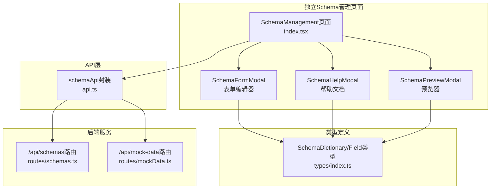
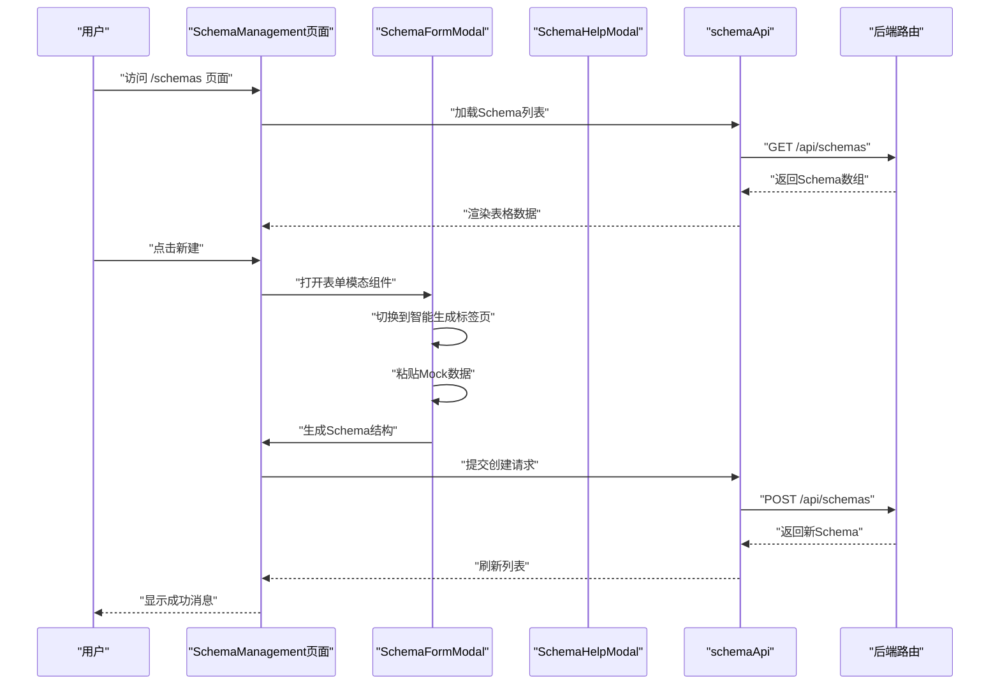
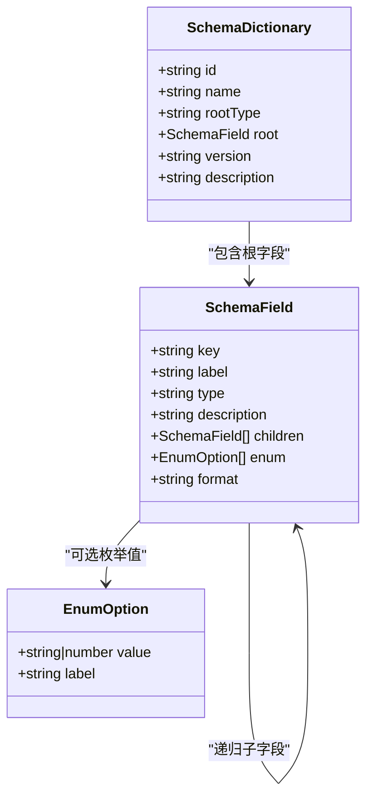
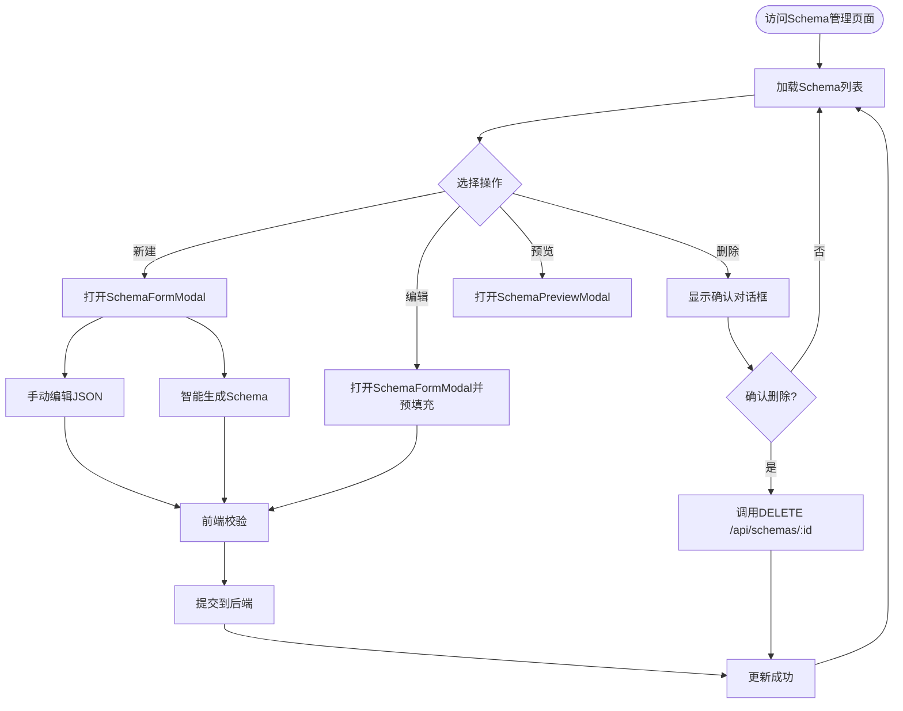
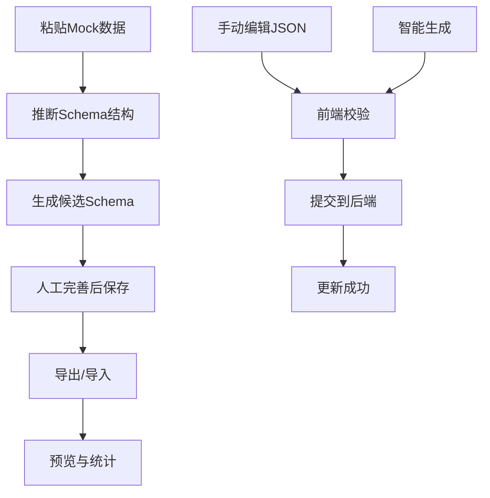
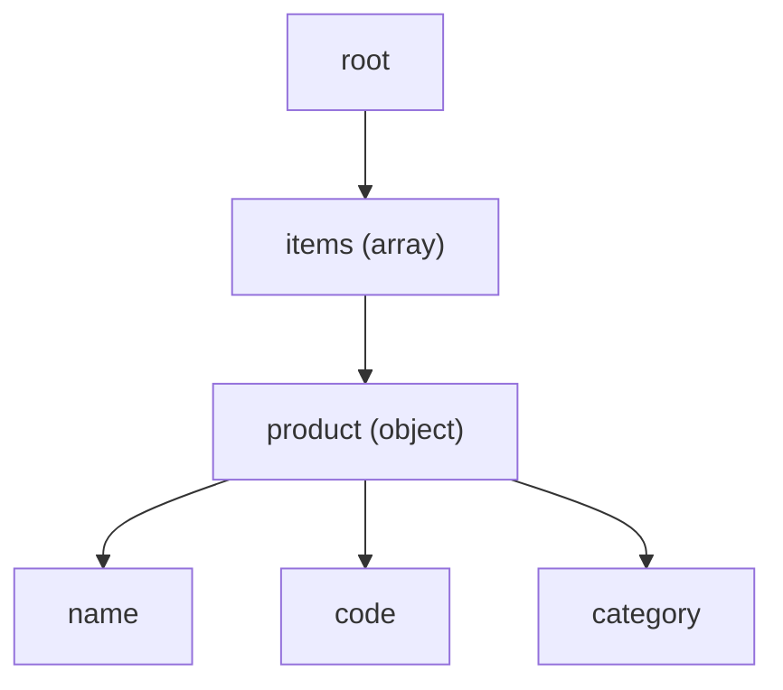
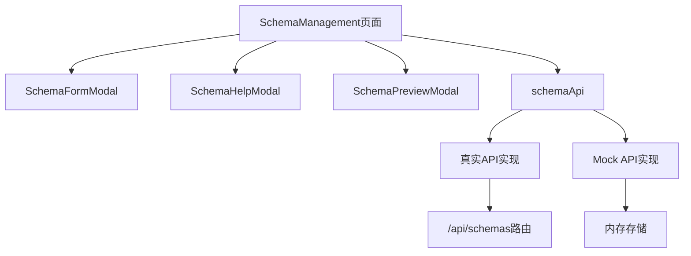

# Schema管理

<cite>
**本文引用的文件**
- [designer/src/pages/SchemaManagement/index.tsx](file://designer/src/pages/SchemaManagement/index.tsx)
- [designer/src/pages/SchemaManagement/components/SchemaFormModal.tsx](file://designer/src/pages/SchemaManagement/components/SchemaFormModal.tsx)
- [designer/src/pages/SchemaManagement/components/SchemaHelpModal.tsx](file://designer/src/pages/SchemaManagement/components/SchemaHelpModal.tsx)
- [designer/src/pages/SchemaManagement/components/SchemaPreviewModal.tsx](file://designer/src/pages/SchemaManagement/components/SchemaPreviewModal.tsx)
- [designer/src/services/api.ts](file://designer/src/services/api.ts)
- [designer/src/types/index.ts](file://designer/src/types/index.ts)
- [designer/src/App.tsx](file://designer/src/App.tsx)
- [designer/src/services/mock/schemas.ts](file://designer/src/services/mock/schemas.ts)
- [designer/src/pages/Designer/components/PropertyPanel/DataBindingSection.tsx](file://designer/src/pages/Designer/components/PropertyPanel/DataBindingSection.tsx)
- [designer/src/utils/mockDataGenerator.ts](file://designer/src/utils/mockDataGenerator.ts)
- [server/src/routes/schemas.ts](file://server/src/routes/schemas.ts)
- [server/src/routes/mockData.ts](file://server/src/routes/mockData.ts)
</cite>

## 更新摘要
**变更内容**
- 新架构：Schema管理从旧的AssetManagement架构重构为独立的SchemaManagement页面
- 组件重构：Schema表单模态组件、帮助文档模态组件和预览模态组件完全重新设计
- 路由调整：Schema管理页面独立路由，不再嵌套在资产管理中
- 功能增强：新增智能生成Schema功能，支持从Mock数据自动推断Schema结构
- 用户界面：全新的表格界面，支持字段数量统计、版本管理、批量导出等功能

## 目录
1. [简介](#简介)
2. [项目结构](#项目结构)
3. [核心组件](#核心组件)
4. [架构总览](#架构总览)
5. [详细组件分析](#详细组件分析)
6. [嵌套对象Schema支持](#嵌套对象schema支持)
7. [依赖关系分析](#依赖关系分析)
8. [性能考量](#性能考量)
9. [故障排查指南](#故障排查指南)
10. [结论](#结论)
11. [附录](#附录)

## 简介
本技术文档围绕重构后的Schema管理功能展开，系统性阐述SchemaDictionary的设计理念、数据模型结构、字段定义与类型系统、约束规则，以及Schema的创建、编辑、删除与版本管理能力。新架构采用独立的SchemaManagement页面，提供更加直观和高效的Schema管理体验。特别关注新增的智能生成功能，深入说明如何从Mock数据自动推断Schema结构，以及多层级数据结构的建模与数据绑定机制。同时，文档详细说明Schema与组件绑定的关系、字段映射机制与数据验证流程，并提供最佳实践、常见使用场景、实际配置示例与数据模型设计指导，帮助开发者与设计师高效构建可维护的打印模板与数据资产。

## 项目结构
Schema管理功能经过重构后采用独立页面架构：
- 独立SchemaManagement页面：提供完整的Schema管理功能，包括表格展示、新增/编辑/删除、导入导出、智能生成、预览与统计。
- 专用组件库：包含SchemaFormModal、SchemaHelpModal、SchemaPreviewModal三个核心组件。
- 前端API封装：通过schemaApi统一管理Schema相关的HTTP请求。
- 后端服务：提供REST接口，支持Schema的增删改查和查询功能。
- Mock数据支持：内置默认示例Schema，支持从样例数据自动生成Schema结构。



**图表来源**
- [designer/src/pages/SchemaManagement/index.tsx:1-551](file://designer/src/pages/SchemaManagement/index.tsx#L1-L551)
- [designer/src/services/api.ts:37-61](file://designer/src/services/api.ts#L37-L61)
- [designer/src/types/index.ts:18-52](file://designer/src/types/index.ts#L18-L52)

**章节来源**
- [designer/src/pages/SchemaManagement/index.tsx:1-551](file://designer/src/pages/SchemaManagement/index.tsx#L1-L551)
- [designer/src/services/api.ts:37-61](file://designer/src/services/api.ts#L37-L61)
- [designer/src/types/index.ts:18-52](file://designer/src/types/index.ts#L18-L52)

## 核心组件
- SchemaManagement主页面：提供表格展示、搜索过滤、批量操作的完整管理界面。
- SchemaFormModal：双标签页表单编辑器，支持手动编辑JSON和智能生成两种方式。
- SchemaHelpModal：专门的帮助文档模态组件，提供Schema字段类型的详细说明。
- SchemaPreviewModal：Schema预览和导出工具，支持查看完整JSON结构。
- schemaApi：统一的Schema管理API封装，支持列表查询、创建、更新、删除。
- SchemaDictionary/SchemaField类型系统：完整的数据模型定义和类型约束。
- 智能生成器：从Mock数据自动推断Schema结构的AI助手功能。

**章节来源**
- [designer/src/pages/SchemaManagement/index.tsx:41-551](file://designer/src/pages/SchemaManagement/index.tsx#L41-L551)
- [designer/src/pages/SchemaManagement/components/SchemaFormModal.tsx:20-154](file://designer/src/pages/SchemaManagement/components/SchemaFormModal.tsx#L20-L154)
- [designer/src/pages/SchemaManagement/components/SchemaHelpModal.tsx:10-25](file://designer/src/pages/SchemaManagement/components/SchemaHelpModal.tsx#L10-L25)
- [designer/src/pages/SchemaManagement/components/SchemaPreviewModal.tsx:13-96](file://designer/src/pages/SchemaManagement/components/SchemaPreviewModal.tsx#L13-L96)
- [designer/src/services/api.ts:37-61](file://designer/src/services/api.ts#L37-L61)
- [designer/src/types/index.ts:18-52](file://designer/src/types/index.ts#L18-L52)

## 架构总览
Schema管理采用全新的独立页面架构，前后端分离设计：
- 前端通过独立的SchemaManagement页面提供完整的管理体验
- 通过schemaApi统一管理所有Schema相关的HTTP请求
- 后端基于Express Router提供REST接口，支持内存存储和默认示例
- 新增智能生成功能，支持从Mock数据自动推断Schema结构
- 采用现代化的Monaco编辑器提供更好的JSON编辑体验



**图表来源**
- [designer/src/pages/SchemaManagement/index.tsx:113-124](file://designer/src/pages/SchemaManagement/index.tsx#L113-L124)
- [designer/src/pages/SchemaManagement/index.tsx:365-411](file://designer/src/pages/SchemaManagement/index.tsx#L365-L411)
- [designer/src/services/api.ts:38-51](file://designer/src/services/api.ts#L38-L51)

## 详细组件分析

### 数据模型与类型系统
重构后的SchemaDictionary与SchemaField构成Schema的核心数据模型：
- SchemaDictionary
  - id：唯一标识符
  - name：显示名称
  - rootType：根类型，限定为object或array
  - root：根字段，必须为object类型且key为"root"
  - version：版本号
  - description：描述信息
- SchemaField
  - key：字段键名
  - label：显示标签
  - type：字段类型，支持string/number/boolean/date/datetime/object/array
  - description：字段描述
  - children：子字段数组（仅对object/array有效）
  - enum：枚举选项数组
  - format：格式化标记，如date/datetime/money/percent



**图表来源**
- [designer/src/types/index.ts:18-52](file://designer/src/types/index.ts#L18-L52)

**章节来源**
- [designer/src/types/index.ts:18-52](file://designer/src/types/index.ts#L18-L52)

### Schema创建、编辑、删除与版本管理
重构后的Schema管理流程更加直观和安全：
- 创建：通过SchemaFormModal的双标签页界面，支持手动编辑和智能生成两种方式
- 编辑：预填充现有Schema数据，支持在线修改和重新生成
- 删除：通过Popconfirm确认，确保操作安全性
- 版本管理：通过version字段标识版本；支持版本号的增删改查
- 查询：支持按名称模糊过滤，提供搜索功能



**图表来源**
- [designer/src/pages/SchemaManagement/index.tsx:126-160](file://designer/src/pages/SchemaManagement/index.tsx#L126-L160)
- [designer/src/pages/SchemaManagement/index.tsx:365-411](file://designer/src/pages/SchemaManagement/index.tsx#L365-L411)

**章节来源**
- [designer/src/pages/SchemaManagement/index.tsx:126-160](file://designer/src/pages/SchemaManagement/index.tsx#L126-L160)
- [designer/src/pages/SchemaManagement/index.tsx:365-411](file://designer/src/pages/SchemaManagement/index.tsx#L365-L411)

### 字段映射机制与数据验证流程
重构后的数据绑定机制更加完善和安全：
- 字段映射：组件属性面板中的"绑定路径"使用JSON路径语法，如"user.name"、"items.0.title"、"items.product.name"
- 嵌套路径支持：通过增强的convertSchemaToTree函数实现多层级路径的可视化展示
- 回退值：当数据为空、null或undefined时，显示fallback默认值
- 数据管道：支持按顺序执行多个数据管道，每个管道可配置参数
- Schema验证：前端在保存前强制校验顶层root节点的key必须为"root"，type必须为"object"


**图表来源**
- [designer/src/pages/Designer/components/PropertyPanel/DataBindingSection.tsx:15-125](file://designer/src/pages/Designer/components/PropertyPanel/DataBindingSection.tsx#L15-L125)

**章节来源**
- [designer/src/pages/Designer/components/PropertyPanel/DataBindingSection.tsx:15-125](file://designer/src/pages/Designer/components/PropertyPanel/DataBindingSection.tsx#L15-L125)

### 智能生成与导入导出
重构后的智能生成功能更加强大和易用：
- 智能生成：从Mock数据自动推断Schema结构与类型，生成候选Schema供人工完善
- 导入导出：支持单个/批量导出Schema；支持从JSON文件导入Schema
- 预览：以卡片形式展示Schema基本信息与字段数量，支持直接导出
- 编辑器：采用Monaco编辑器提供更好的JSON编辑体验



**图表来源**
- [designer/src/pages/SchemaManagement/index.tsx:163-173](file://designer/src/pages/SchemaManagement/index.tsx#L163-L173)
- [designer/src/pages/SchemaManagement/components/SchemaFormModal.tsx:102-143](file://designer/src/pages/SchemaManagement/components/SchemaFormModal.tsx#L102-L143)

**章节来源**
- [designer/src/pages/SchemaManagement/index.tsx:163-173](file://designer/src/pages/SchemaManagement/index.tsx#L163-L173)
- [designer/src/pages/SchemaManagement/components/SchemaFormModal.tsx:102-143](file://designer/src/pages/SchemaManagement/components/SchemaFormModal.tsx#L102-L143)

### Mock数据与Schema协同
重构后的Mock数据系统更加完善：
- Mock数据生成：根据Schema字段类型与键名特征生成合理示例数据
- Mock数据查询：支持按名称、SchemaId、TemplateId过滤
- 与Schema绑定：模板与Mock数据均通过schemaId关联到Schema，便于数据资产复用
- 内置示例：提供完整的销售出库单和采购订单示例

```mermaid
graph LR
Schema["SchemaDictionary"] <- --> Mock["MockData"]
Schema <- --> Template["PrintTemplate"]
Mock --> Generator["Mock数据生成器"]
Default["默认内置Schema"] --> Schema
Nested["嵌套对象示例"] --> Schema
```

**图表来源**
- [designer/src/services/mock/schemas.ts:6-146](file://designer/src/services/mock/schemas.ts#L6-L146)
- [designer/src/utils/mockDataGenerator.ts:1-113](file://designer/src/utils/mockDataGenerator.ts#L1-L113)

**章节来源**
- [designer/src/services/mock/schemas.ts:6-146](file://designer/src/services/mock/schemas.ts#L6-L146)
- [designer/src/utils/mockDataGenerator.ts:1-113](file://designer/src/utils/mockDataGenerator.ts#L1-L113)

## 嵌套对象Schema支持

### 新增功能概述
系统现已支持嵌套对象Schema，通过增强的路径解析机制实现复杂的多层级数据绑定。这一功能特别适用于表格组件的数据绑定，允许直接访问嵌套对象的子字段。

### 核心实现机制
- 嵌套路径解析：convertSchemaToTree函数现在支持递归解析多层级字段路径
- 路径可视化：在Schema树形结构中正确显示嵌套字段的完整路径
- 表格绑定支持：表格组件可以直接绑定到嵌套路径，如"items.product.name"

### 示例Schema：采购订单（嵌套对象）
系统新增了`schema-demo-order-nested`示例，演示复杂的嵌套数据结构：

```json
{
  "id": "schema-demo-order-nested",
  "name": "采购订单（嵌套对象）",
  "rootType": "object",
  "root": {
    "key": "root",
    "label": "采购订单",
    "type": "object",
    "children": [
      {
        "key": "items",
        "label": "采购明细",
        "type": "array",
        "children": [
          {
            "key": "product",
            "label": "商品信息",
            "type": "object",
            "children": [
              { "key": "name", "label": "商品名称", "type": "string" },
              { "key": "code", "label": "商品编码", "type": "string" },
              { "key": "category", "label": "分类", "type": "string" }
            ]
          }
        ]
      }
    ]
  }
}
```

### 嵌套路径绑定示例
在数据绑定中，可以直接使用嵌套路径：
- `"product.name"` - 访问嵌套对象的name字段
- `"items.0.product.code"` - 访问数组第一项的嵌套字段



**图表来源**
- [designer/src/services/mock/schemas.ts:87-145](file://designer/src/services/mock/schemas.ts#L87-L145)

**章节来源**
- [designer/src/services/mock/schemas.ts:87-145](file://designer/src/services/mock/schemas.ts#L87-L145)

## 依赖关系分析
重构后的Schema管理具有清晰的依赖层次：
- 前端依赖
  - 独立页面架构：SchemaManagement页面作为单一职责组件
  - 专用组件库：三个核心模态组件各司其职
  - Monaco编辑器：提供专业的JSON编辑体验
  - Ant Design组件：统一的UI设计语言
- API层依赖
  - schemaApi封装：集中管理HTTP请求
  - 环境变量：支持Mock模式和真实API切换
- 后端依赖
  - Express Router：提供REST接口
  - 内存存储：支持默认内置示例
- 耦合与内聚
  - 页面与组件高内聚，通过props传递数据
  - API层与后端通过契约耦合
  - 数据绑定与Schema解耦，通过JSON路径实现松散耦合



**图表来源**
- [designer/src/pages/SchemaManagement/index.tsx:32-36](file://designer/src/pages/SchemaManagement/index.tsx#L32-L36)
- [designer/src/services/api.ts:131-134](file://designer/src/services/api.ts#L131-L134)

**章节来源**
- [designer/src/pages/SchemaManagement/index.tsx:32-36](file://designer/src/pages/SchemaManagement/index.tsx#L32-L36)
- [designer/src/services/api.ts:131-134](file://designer/src/services/api.ts#L131-L134)

## 性能考量
重构后的Schema管理在性能方面有显著改进：
- 前端
  - 独立页面架构：减少不必要的组件渲染
  - Monaco编辑器：按需加载，支持代码折叠和语法高亮
  - 虚拟滚动：对大量Schema列表启用分页机制
  - 智能生成：前端推断算法优化，避免重复计算
- 后端
  - 内存存储：适合开发与小规模场景
  - 接口幂等：确保重复请求不会产生副作用
  - Mock模式：开发环境零配置部署
- 数据绑定
  - 路径解析复杂度与层级深度相关，建议控制Schema层级
  - 嵌套路径解析：优化路径解析算法，支持深层嵌套结构

## 故障排查指南
重构后的Schema管理具有完善的错误处理机制：
- 常见错误
  - 顶层root节点校验失败：key非"root"或type非"object"
  - JSON格式错误：保存时捕获语法异常并提示
  - Schema未找到：GET/PUT/DELETE时返回404
  - 嵌套路径解析失败：路径格式不正确或字段不存在
  - Mock数据格式错误：智能生成时的JSON解析异常
- 定位方法
  - 前端：查看消息提示与控制台错误；核对表单校验规则
  - 后端：检查路由处理逻辑与错误中间件
- 建议
  - 在保存前进行本地校验，减少无效请求
  - 对外暴露的接口增加参数校验与限流策略
  - 嵌套路径绑定时，先在Schema树中验证路径的有效性

**章节来源**
- [designer/src/pages/SchemaManagement/index.tsx:403-411](file://designer/src/pages/SchemaManagement/index.tsx#L403-L411)
- [designer/src/pages/SchemaManagement/index.tsx:169-173](file://designer/src/pages/SchemaManagement/index.tsx#L169-L173)

## 结论
重构后的Schema管理功能通过独立页面架构、现代化组件设计和智能生成功能，实现了Schema的全生命周期管理。新的架构提供了更加直观和高效的用户体验，新增的智能生成功能大大降低了Schema创建的门槛。结合Mock数据与数据绑定面板，用户可以快速构建可复用的打印模板数据资产。建议在生产环境中引入持久化存储与版本演进策略，持续优化大Schema的渲染与查询性能。

## 附录

### 最佳实践
- 字段命名规范：使用语义化key，便于生成与绑定
- 枚举与格式化：为状态、日期等字段提供enum与format，提升展示一致性
- 层级控制：避免过深嵌套与超长数组，保证渲染与绑定效率
- 版本治理：每次重大变更提升version，保留历史Schema以便回溯
- 嵌套设计：合理规划嵌套层级，避免过度复杂的多层嵌套结构

### 常见使用场景
- 销售出库单：包含基础信息、客户信息、明细列表与汇总信息
- 商品清单：根为object，包含商品数组，每项含名称、规格、单价、数量等
- 报表模板：根为array，用于循环渲染多页报表
- 采购订单（嵌套对象）：演示复杂嵌套数据结构的建模与绑定

### 实际配置示例与设计指导
- 示例参考
  - 默认内置示例Schema包含标题、公司信息、明细与汇总等典型字段
  - 嵌套对象示例Schema演示了复杂的多层级数据结构
  - 建议从Mock数据智能生成Schema，再人工完善label与枚举
- 设计指导
  - 先定义根字段与常用基础字段，再逐步扩展子字段
  - 对日期类字段明确format，避免渲染歧义
  - 为关键字段提供枚举，降低输入错误率
  - 嵌套对象设计时，考虑数据访问的便利性和性能影响

**章节来源**
- [designer/src/services/mock/schemas.ts:6-146](file://designer/src/services/mock/schemas.ts#L6-L146)
- [designer/src/pages/SchemaManagement/index.tsx:163-173](file://designer/src/pages/SchemaManagement/index.tsx#L163-L173)
- [designer/src/services/api.ts:37-61](file://designer/src/services/api.ts#L37-L61)