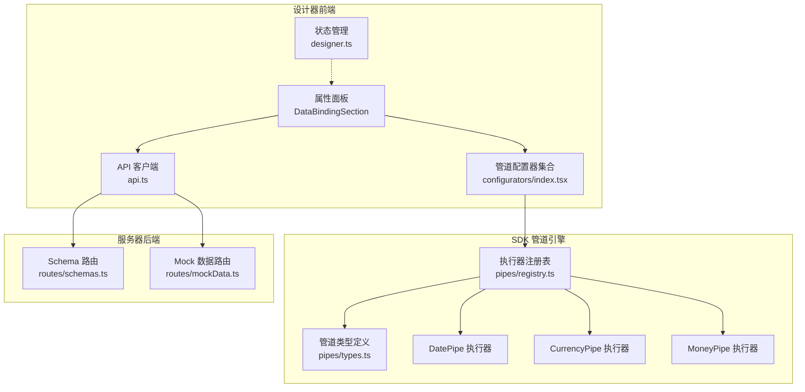
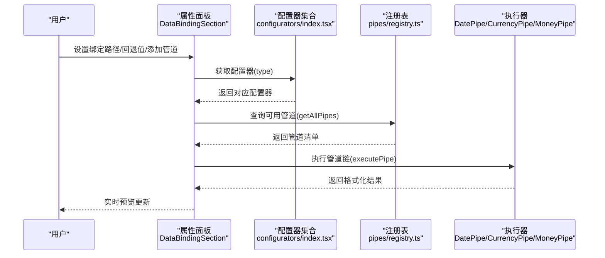
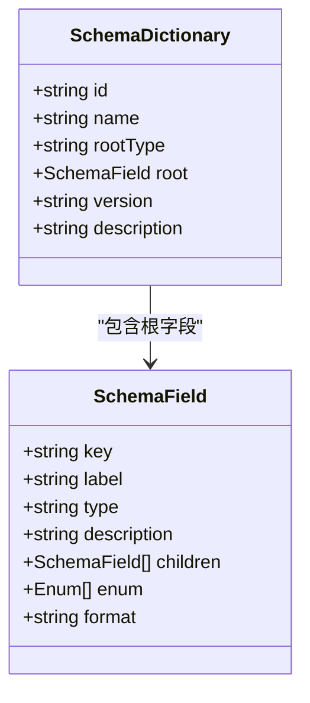
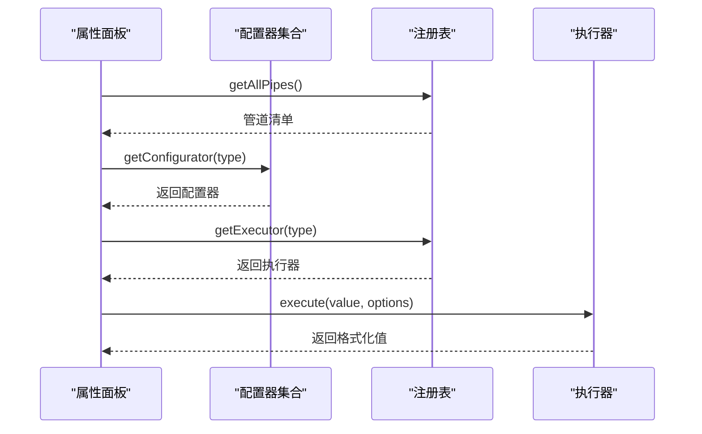
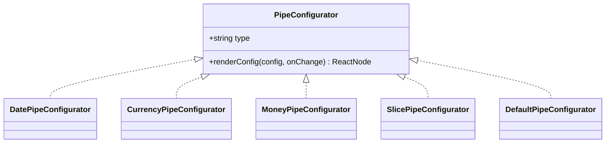
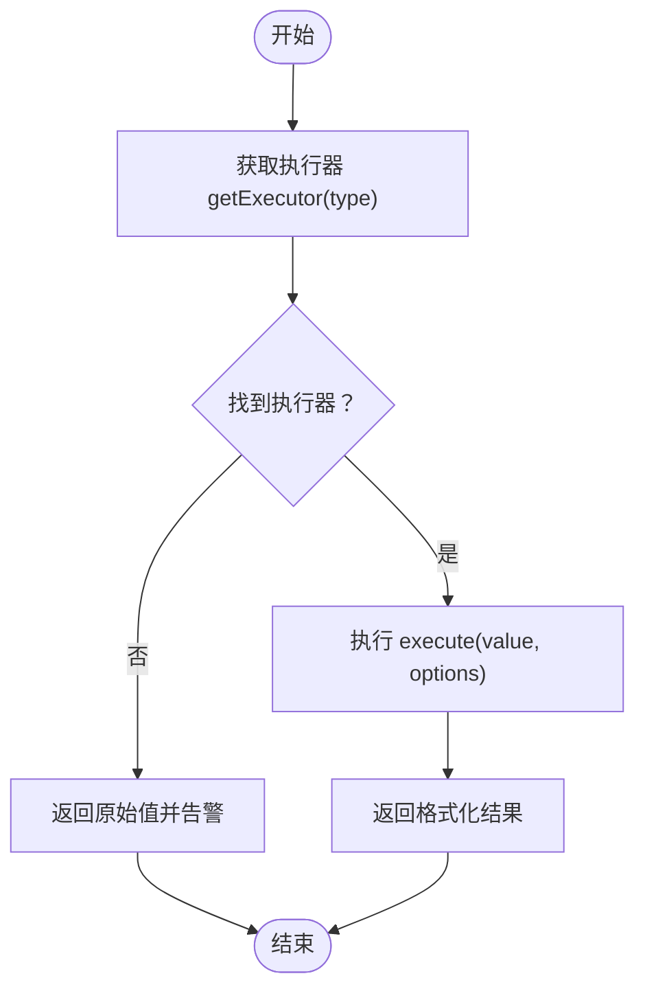
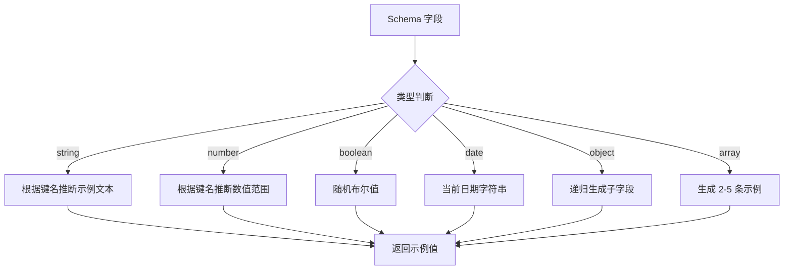
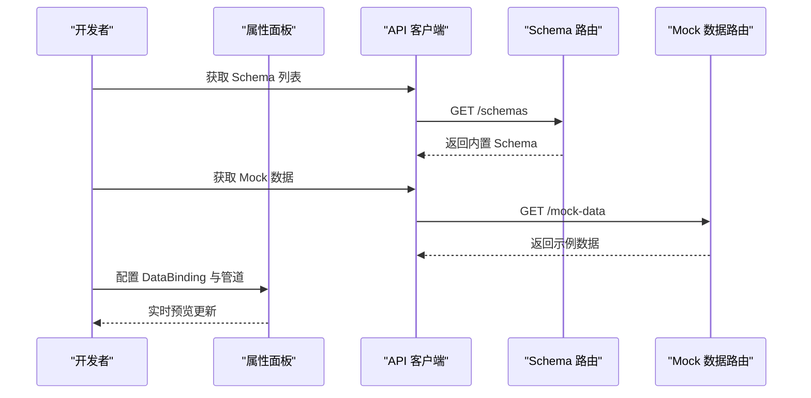
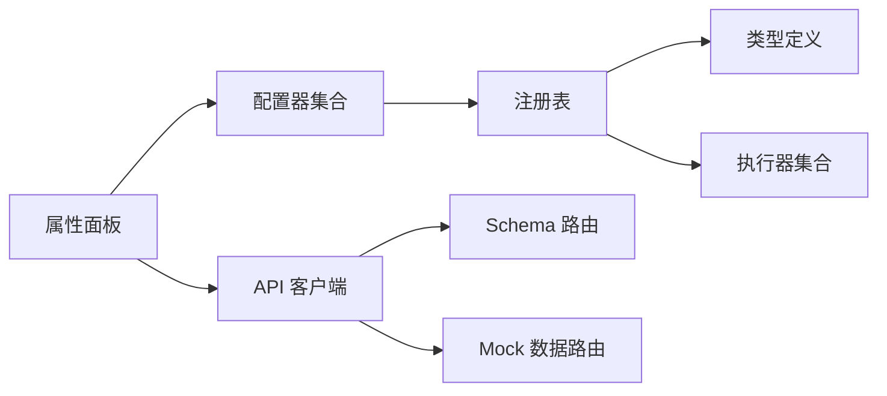

# 数据绑定系统

<cite>
**本文引用的文件**
- [designer/src/types/index.ts](file://designer/src/types/index.ts)
- [sdk/src/pipes/types.ts](file://sdk/src/pipes/types.ts)
- [sdk/src/pipes/registry.ts](file://sdk/src/pipes/registry.ts)
- [sdk/src/pipes/executors/DatePipe.ts](file://sdk/src/pipes/executors/DatePipe.ts)
- [sdk/src/pipes/executors/CurrencyPipe.ts](file://sdk/src/pipes/executors/CurrencyPipe.ts)
- [sdk/src/pipes/executors/MoneyPipe.ts](file://sdk/src/pipes/executors/MoneyPipe.ts)
- [designer/src/pipes/configurators/index.tsx](file://designer/src/pipes/configurators/index.tsx)
- [designer/src/pipes/configurators/DatePipeConfigurator.tsx](file://designer/src/pipes/configurators/DatePipeConfigurator.tsx)
- [designer/src/pipes/configurators/CurrencyPipeConfigurator.tsx](file://designer/src/pipes/configurators/CurrencyPipeConfigurator.tsx)
- [designer/src/pipes/configurators/MoneyPipeConfigurator.tsx](file://designer/src/pipes/configurators/MoneyPipeConfigurator.tsx)
- [designer/src/pages/Designer/components/PropertyPanel/DataBindingSection.tsx](file://designer/src/pages/Designer/components/PropertyPanel/DataBindingSection.tsx)
- [designer/src/utils/mockDataGenerator.ts](file://designer/src/utils/mockDataGenerator.ts)
- [designer/src/services/api.ts](file://designer/src/services/api.ts)
- [server/src/routes/schemas.ts](file://server/src/routes/schemas.ts)
- [server/src/routes/mockData.ts](file://server/src/routes/mockData.ts)
- [designer/src/store/designer.ts](file://designer/src/store/designer.ts)
</cite>

## 目录
1. [引言](#引言)
2. [项目结构](#项目结构)
3. [核心组件](#核心组件)
4. [架构总览](#架构总览)
5. [详细组件分析](#详细组件分析)
6. [依赖关系分析](#依赖关系分析)
7. [性能考虑](#性能考虑)
8. [故障排查指南](#故障排查指南)
9. [结论](#结论)
10. [附录](#附录)

## 引言
本技术文档围绕“数据绑定系统”展开，系统采用 Schema 驱动的数据模型设计，结合可视化属性面板完成数据绑定与管道配置，并通过后端路由提供 Schema 与 Mock 数据的增删改查能力。本文将从 SchemaDictionary 的定义与字段类型管理、数据绑定配置的实现原理、管道系统 UI 配置器、Mock 数据管理与导入导出等方面进行深入解析，并给出实际使用示例与最佳实践。

## 项目结构
数据绑定系统由三层组成：
- 设计器前端（React + Zustand 状态管理）：负责可视化编辑、属性面板配置、Mock 数据生成与 API 交互。
- SDK 管道引擎（TypeScript）：提供管道执行器注册、执行与类型定义，支持日期、货币、金额等格式化。
- 服务器后端（Express）：提供 Schema 与 Mock 数据的 REST 接口，内置示例数据便于快速上手。

**图示来源**
- [designer/src/pages/Designer/components/PropertyPanel/DataBindingSection.tsx:1-128](file://designer/src/pages/Designer/components/PropertyPanel/DataBindingSection.tsx#L1-L128)
- [designer/src/services/api.ts:1-97](file://designer/src/services/api.ts#L1-L97)
- [designer/src/pipes/configurators/index.tsx:1-83](file://designer/src/pipes/configurators/index.tsx#L1-L83)
- [sdk/src/pipes/types.ts:1-30](file://sdk/src/pipes/types.ts#L1-L30)
- [sdk/src/pipes/registry.ts:1-64](file://sdk/src/pipes/registry.ts#L1-L64)
- [sdk/src/pipes/executors/DatePipe.ts:1-35](file://sdk/src/pipes/executors/DatePipe.ts#L1-L35)
- [sdk/src/pipes/executors/CurrencyPipe.ts:1-17](file://sdk/src/pipes/executors/CurrencyPipe.ts#L1-L17)
- [sdk/src/pipes/executors/MoneyPipe.ts:1-62](file://sdk/src/pipes/executors/MoneyPipe.ts#L1-L62)
- [server/src/routes/schemas.ts:1-178](file://server/src/routes/schemas.ts#L1-L178)
- [server/src/routes/mockData.ts:1-448](file://server/src/routes/mockData.ts#L1-L448)

**章节来源**
- [designer/src/types/index.ts:1-160](file://designer/src/types/index.ts#L1-L160)
- [sdk/src/pipes/types.ts:1-30](file://sdk/src/pipes/types.ts#L1-L30)
- [sdk/src/pipes/registry.ts:1-64](file://sdk/src/pipes/registry.ts#L1-L64)
- [designer/src/pipes/configurators/index.tsx:1-83](file://designer/src/pipes/configurators/index.tsx#L1-L83)
- [designer/src/pages/Designer/components/PropertyPanel/DataBindingSection.tsx:1-128](file://designer/src/pages/Designer/components/PropertyPanel/DataBindingSection.tsx#L1-L128)
- [designer/src/utils/mockDataGenerator.ts:1-113](file://designer/src/utils/mockDataGenerator.ts#L1-L113)
- [designer/src/services/api.ts:1-97](file://designer/src/services/api.ts#L1-L97)
- [server/src/routes/schemas.ts:1-178](file://server/src/routes/schemas.ts#L1-L178)
- [server/src/routes/mockData.ts:1-448](file://server/src/routes/mockData.ts#L1-L448)
- [designer/src/store/designer.ts:1-539](file://designer/src/store/designer.ts#L1-L539)

## 核心组件
- Schema 驱动模型
  - SchemaField：描述字段键、标签、类型、子节点、枚举、格式等。
  - SchemaDictionary：描述顶层对象或数组结构，包含版本与描述。
- 数据绑定配置
  - DataBinding：包含绑定路径、管道链、回退值。
  - PipeConfig：管道类型与选项。
- 管道系统
  - PipeExecutor：执行器接口，定义 type、label 与 execute 方法。
  - 注册表：集中注册与获取执行器，统一执行入口。
- 属性面板
  - DataBindingSection：可视化配置绑定路径、回退值与管道链，动态渲染配置器 UI。
- Mock 数据
  - MockData：Mock 数据实体，支持按 Schema 或模板过滤。
  - 生成器：根据 Schema 字段类型与键名推断合理示例值。

**章节来源**
- [designer/src/types/index.ts:11-28](file://designer/src/types/index.ts#L11-L28)
- [designer/src/types/index.ts:71-75](file://designer/src/types/index.ts#L71-L75)
- [designer/src/types/index.ts:66-69](file://designer/src/types/index.ts#L66-L69)
- [sdk/src/pipes/types.ts:11-29](file://sdk/src/pipes/types.ts#L11-L29)
- [sdk/src/pipes/registry.ts:12-26](file://sdk/src/pipes/registry.ts#L12-L26)
- [designer/src/pages/Designer/components/PropertyPanel/DataBindingSection.tsx:15-18](file://designer/src/pages/Designer/components/PropertyPanel/DataBindingSection.tsx#L15-L18)
- [designer/src/utils/mockDataGenerator.ts:4-21](file://designer/src/utils/mockDataGenerator.ts#L4-L21)

## 架构总览
数据绑定系统遵循“前端可视化配置 + SDK 管道执行 + 后端数据服务”的分层架构。前端通过属性面板配置 DataBinding 与管道链，SDK 注册表统一调度执行器，后端提供 Schema 与 Mock 数据的持久化与查询。

**图示来源**
- [designer/src/pages/Designer/components/PropertyPanel/DataBindingSection.tsx:10-11](file://designer/src/pages/Designer/components/PropertyPanel/DataBindingSection.tsx#L10-L11)
- [designer/src/pipes/configurators/index.tsx:68-82](file://designer/src/pipes/configurators/index.tsx#L68-L82)
- [sdk/src/pipes/registry.ts:31-40](file://sdk/src/pipes/registry.ts#L31-L40)
- [sdk/src/pipes/registry.ts:45-52](file://sdk/src/pipes/registry.ts#L45-L52)
- [sdk/src/pipes/executors/DatePipe.ts:11-33](file://sdk/src/pipes/executors/DatePipe.ts#L11-L33)
- [sdk/src/pipes/executors/CurrencyPipe.ts:11-14](file://sdk/src/pipes/executors/CurrencyPipe.ts#L11-L14)
- [sdk/src/pipes/executors/MoneyPipe.ts:13-60](file://sdk/src/pipes/executors/MoneyPipe.ts#L13-L60)

## 详细组件分析

### Schema 驱动的数据模型设计
- SchemaField
  - 关键字段：key、label、type、children、enum、format。
  - 支持嵌套对象与数组，数组子项可为单一类型或对象结构。
- SchemaDictionary
  - rootType：顶层为 object 或 array。
  - root：顶层 SchemaField。
  - 版本与描述便于演进与说明。
- 字段类型管理
  - 支持 string、number、boolean、date、datetime、object、array。
  - format 提供 date、datetime、money、percent 等语义化提示。

**图示来源**
- [designer/src/types/index.ts:11-28](file://designer/src/types/index.ts#L11-L28)

**章节来源**
- [designer/src/types/index.ts:2-19](file://designer/src/types/index.ts#L2-L19)
- [designer/src/types/index.ts:21-28](file://designer/src/types/index.ts#L21-L28)

### 数据绑定配置实现原理
- DataBinding 结构
  - path：JSON 路径，如 user.name、items.0.title。
  - pipes：管道链，按顺序执行。
  - fallback：空值回退显示。
- 属性面板 DataBindingSection
  - 绑定路径输入与回退值输入。
  - 管道下拉选择与动态配置器渲染。
  - 管道增删与选项变更回调 onBindingChange。
- 管道执行流程
  - 前端调用 getAllPipes 获取可用管道清单。
  - 通过注册表 getExecutor 获取执行器。
  - 调用 executePipe 执行管道链，返回最终结果。

**图示来源**
- [designer/src/pages/Designer/components/PropertyPanel/DataBindingSection.tsx:10-11](file://designer/src/pages/Designer/components/PropertyPanel/DataBindingSection.tsx#L10-L11)
- [designer/src/pipes/configurators/index.tsx:80-82](file://designer/src/pipes/configurators/index.tsx#L80-L82)
- [sdk/src/pipes/registry.ts:31-40](file://sdk/src/pipes/registry.ts#L31-L40)
- [sdk/src/pipes/registry.ts:24-26](file://sdk/src/pipes/registry.ts#L24-L26)
- [sdk/src/pipes/registry.ts:45-52](file://sdk/src/pipes/registry.ts#L45-L52)

**章节来源**
- [designer/src/types/index.ts:71-75](file://designer/src/types/index.ts#L71-L75)
- [designer/src/pages/Designer/components/PropertyPanel/DataBindingSection.tsx:21-43](file://designer/src/pages/Designer/components/PropertyPanel/DataBindingSection.tsx#L21-L43)
- [sdk/src/pipes/registry.ts:45-52](file://sdk/src/pipes/registry.ts#L45-L52)

### 管道系统 UI 配置器
- 配置器接口 PipeConfigurator
  - type：管道类型标识。
  - renderConfig：渲染配置 UI 并通过 onChange(option, value) 更新选项。
- 内置配置器
  - DatePipeConfigurator：日期格式化，支持格式字符串。
  - CurrencyPipeConfigurator：货币格式化，支持符号。
  - MoneyPipeConfigurator：金额转换，支持分/元互转、精度、千分位与符号。
  - SlicePipeConfigurator：字符串截取，起止位置。
  - DefaultPipeConfigurator：默认值。
- 注册与获取
  - configuratorRegistry：Map 存储，getConfigurator(type) 获取配置器。

**图示来源**
- [designer/src/pipes/configurators/index.tsx:16-19](file://designer/src/pipes/configurators/index.tsx#L16-L19)
- [designer/src/pipes/configurators/DatePipeConfigurator.tsx:9-22](file://designer/src/pipes/configurators/DatePipeConfigurator.tsx#L9-L22)
- [designer/src/pipes/configurators/CurrencyPipeConfigurator.tsx:9-22](file://designer/src/pipes/configurators/CurrencyPipeConfigurator.tsx#L9-L22)
- [designer/src/pipes/configurators/MoneyPipeConfigurator.tsx:9-79](file://designer/src/pipes/configurators/MoneyPipeConfigurator.tsx#L9-L79)

**章节来源**
- [designer/src/pipes/configurators/index.tsx:68-82](file://designer/src/pipes/configurators/index.tsx#L68-L82)
- [designer/src/pipes/configurators/DatePipeConfigurator.tsx:1-23](file://designer/src/pipes/configurators/DatePipeConfigurator.tsx#L1-L23)
- [designer/src/pipes/configurators/CurrencyPipeConfigurator.tsx:1-23](file://designer/src/pipes/configurators/CurrencyPipeConfigurator.tsx#L1-L23)
- [designer/src/pipes/configurators/MoneyPipeConfigurator.tsx:1-80](file://designer/src/pipes/configurators/MoneyPipeConfigurator.tsx#L1-L80)

### 管道执行器与类型定义
- PipeExecutor
  - type、label、execute(value, options)。
- 注册表
  - registerExecutor、getExecutor、getAllPipes、executePipe。
- 内置执行器
  - DatePipe：日期格式化，支持 YYYY-MM-DD HH:mm:ss 等占位符。
  - CurrencyPipe：货币格式化，固定精度与符号。
  - MoneyPipe：金额转换（分/元），支持精度、千分位与符号，使用高精度库避免浮点误差。

**图示来源**
- [sdk/src/pipes/registry.ts:45-52](file://sdk/src/pipes/registry.ts#L45-L52)
- [sdk/src/pipes/executors/DatePipe.ts:11-33](file://sdk/src/pipes/executors/DatePipe.ts#L11-L33)
- [sdk/src/pipes/executors/CurrencyPipe.ts:11-14](file://sdk/src/pipes/executors/CurrencyPipe.ts#L11-L14)
- [sdk/src/pipes/executors/MoneyPipe.ts:13-60](file://sdk/src/pipes/executors/MoneyPipe.ts#L13-L60)

**章节来源**
- [sdk/src/pipes/types.ts:11-29](file://sdk/src/pipes/types.ts#L11-L29)
- [sdk/src/pipes/registry.ts:17-26](file://sdk/src/pipes/registry.ts#L17-L26)
- [sdk/src/pipes/registry.ts:31-40](file://sdk/src/pipes/registry.ts#L31-L40)
- [sdk/src/pipes/registry.ts:56-63](file://sdk/src/pipes/registry.ts#L56-L63)
- [sdk/src/pipes/executors/DatePipe.ts:1-35](file://sdk/src/pipes/executors/DatePipe.ts#L1-L35)
- [sdk/src/pipes/executors/CurrencyPipe.ts:1-17](file://sdk/src/pipes/executors/CurrencyPipe.ts#L1-L17)
- [sdk/src/pipes/executors/MoneyPipe.ts:1-62](file://sdk/src/pipes/executors/MoneyPipe.ts#L1-L62)

### Mock 数据管理
- MockData 实体
  - id、name、schemaId、templateId、data、description。
- 生成策略
  - 根据字段类型与键名猜测内容，如 name、phone、email、address、code、url、status。
  - 数字类型根据 price、quantity、age、percent 推断合理范围。
  - 对象与数组递归生成，数组默认生成 2-5 条。
- API 与路由
  - api.ts 提供 list/get/create/update/delete。
  - server 路由提供 CRUD 与内置示例数据。

**图示来源**
- [designer/src/utils/mockDataGenerator.ts:4-21](file://designer/src/utils/mockDataGenerator.ts#L4-L21)
- [designer/src/utils/mockDataGenerator.ts:24-51](file://designer/src/utils/mockDataGenerator.ts#L24-L51)
- [designer/src/utils/mockDataGenerator.ts:54-71](file://designer/src/utils/mockDataGenerator.ts#L54-L71)
- [designer/src/utils/mockDataGenerator.ts:74-85](file://designer/src/utils/mockDataGenerator.ts#L74-L85)
- [designer/src/utils/mockDataGenerator.ts:88-112](file://designer/src/utils/mockDataGenerator.ts#L88-L112)

**章节来源**
- [designer/src/types/index.ts:152-159](file://designer/src/types/index.ts#L152-L159)
- [designer/src/utils/mockDataGenerator.ts:1-113](file://designer/src/utils/mockDataGenerator.ts#L1-L113)
- [designer/src/services/api.ts:68-96](file://designer/src/services/api.ts#L68-L96)
- [server/src/routes/mockData.ts:1-448](file://server/src/routes/mockData.ts#L1-L448)

### Schema 管理与数据绑定示例
- Schema 管理
  - 内置示例 Schema（销售出库单），包含标题、客户信息、明细列表、汇总信息等。
  - 提供 CRUD 接口，支持按名称筛选。
- 数据绑定示例
  - 在属性面板中设置 path 为 items.0.name，添加 money 管道并配置精度与符号，观察实时预览。
  - 使用 date 管道设置格式为 YYYY-MM-DD，验证日期展示效果。
  - 设置 fallback，在数据为空时显示默认值。

**图示来源**
- [server/src/routes/schemas.ts:132-139](file://server/src/routes/schemas.ts#L132-L139)
- [server/src/routes/schemas.ts:141-149](file://server/src/routes/schemas.ts#L141-L149)
- [server/src/routes/mockData.ts:394-408](file://server/src/routes/mockData.ts#L394-L408)
- [designer/src/services/api.ts:14-38](file://designer/src/services/api.ts#L14-L38)
- [designer/src/services/api.ts:68-96](file://designer/src/services/api.ts#L68-L96)
- [designer/src/pages/Designer/components/PropertyPanel/DataBindingSection.tsx:53-68](file://designer/src/pages/Designer/components/PropertyPanel/DataBindingSection.tsx#L53-L68)

**章节来源**
- [server/src/routes/schemas.ts:35-116](file://server/src/routes/schemas.ts#L35-L116)
- [designer/src/services/api.ts:14-38](file://designer/src/services/api.ts#L14-L38)
- [designer/src/services/api.ts:68-96](file://designer/src/services/api.ts#L68-L96)
- [designer/src/pages/Designer/components/PropertyPanel/DataBindingSection.tsx:49-70](file://designer/src/pages/Designer/components/PropertyPanel/DataBindingSection.tsx#L49-L70)

## 依赖关系分析
- 前端依赖
  - 属性面板依赖配置器集合与注册表，通过 API 客户端访问后端。
- SDK 依赖
  - 执行器依赖注册表统一调度；类型定义约束执行器行为。
- 后端依赖
  - 路由依赖内存存储与 UUID 生成，提供内置示例数据。

**图示来源**
- [designer/src/pages/Designer/components/PropertyPanel/DataBindingSection.tsx:10-11](file://designer/src/pages/Designer/components/PropertyPanel/DataBindingSection.tsx#L10-L11)
- [designer/src/pipes/configurators/index.tsx:68-82](file://designer/src/pipes/configurators/index.tsx#L68-L82)
- [sdk/src/pipes/registry.ts:17-26](file://sdk/src/pipes/registry.ts#L17-L26)
- [sdk/src/pipes/types.ts:11-29](file://sdk/src/pipes/types.ts#L11-L29)
- [designer/src/services/api.ts:14-38](file://designer/src/services/api.ts#L14-L38)
- [server/src/routes/schemas.ts:120-130](file://server/src/routes/schemas.ts#L120-L130)
- [server/src/routes/mockData.ts:382-392](file://server/src/routes/mockData.ts#L382-L392)

**章节来源**
- [designer/src/pipes/configurators/index.tsx:68-82](file://designer/src/pipes/configurators/index.tsx#L68-L82)
- [sdk/src/pipes/registry.ts:17-26](file://sdk/src/pipes/registry.ts#L17-L26)
- [sdk/src/pipes/types.ts:11-29](file://sdk/src/pipes/types.ts#L11-L29)
- [designer/src/services/api.ts:14-38](file://designer/src/services/api.ts#L14-L38)
- [server/src/routes/schemas.ts:120-130](file://server/src/routes/schemas.ts#L120-L130)
- [server/src/routes/mockData.ts:382-392](file://server/src/routes/mockData.ts#L382-L392)

## 性能考虑
- 管道执行
  - 优先使用高精度计算（MoneyPipe 使用高精度库），避免浮点误差。
  - 日期格式化采用字符串替换，复杂格式建议在后端或离线场景处理。
- Mock 数据生成
  - 递归生成对象与数组时注意深度与数组长度，避免过大数据导致渲染卡顿。
- 前端渲染
  - 属性面板对管道链的实时预览应避免高频重渲染，可通过节流或防抖优化。
- 状态管理
  - Zustand 状态变更需控制粒度，避免不必要的组件重渲染。

## 故障排查指南
- 管道未找到
  - 现象：控制台告警“Pipe executor not found”。
  - 排查：确认管道类型是否正确，是否已在注册表中注册。
- 日期格式异常
  - 现象：日期无法解析或格式不生效。
  - 排查：确认传入值为可识别的时间戳或日期字符串，格式字符串是否符合预期。
- 金额转换错误
  - 现象：转换结果异常或报错。
  - 排查：确认输入为合法数值，模式（分/元）与精度设置是否合理。
- Mock 数据为空
  - 现象：绑定路径无数据显示。
  - 排查：确认 Schema 与 Mock 数据匹配，路径是否正确，fallback 是否设置。

**章节来源**
- [sdk/src/pipes/registry.ts:45-52](file://sdk/src/pipes/registry.ts#L45-L52)
- [sdk/src/pipes/executors/DatePipe.ts:11-17](file://sdk/src/pipes/executors/DatePipe.ts#L11-L17)
- [sdk/src/pipes/executors/MoneyPipe.ts:56-60](file://sdk/src/pipes/executors/MoneyPipe.ts#L56-L60)
- [designer/src/utils/mockDataGenerator.ts:4-21](file://designer/src/utils/mockDataGenerator.ts#L4-L21)

## 结论
该数据绑定系统以 Schema 为核心，结合可视化属性面板与可扩展的管道系统，实现了从数据建模到实时渲染的完整闭环。通过前后端分离的 API 设计与内置示例数据，开发者可以快速搭建与调试打印模板。建议在生产环境中加强输入校验、错误日志与性能监控，确保复杂场景下的稳定性与可维护性。

## 附录
- 最佳实践
  - 使用明确的 Schema 字段命名，便于 Mock 生成与管道推断。
  - 管道链顺序重要，先做格式化再做转换，避免重复处理。
  - 为关键字段设置合理的 fallback，提升用户体验。
  - 对大数组与深层对象谨慎使用 Mock 生成，必要时提供精简示例。
- 快速上手步骤
  - 在 Schema 管理中选择内置示例，复制其 ID。
  - 在 Mock 数据中选择匹配的示例数据，或创建新数据。
  - 在属性面板中设置 DataBinding 的 path 与管道，实时预览效果。
  - 导出模板时，确保 schemaId 与 page 配置正确。