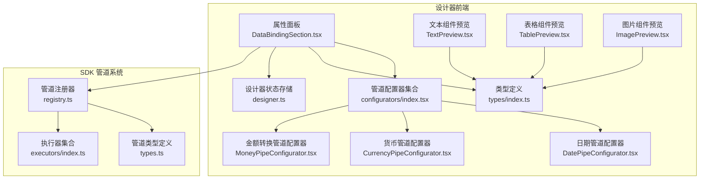
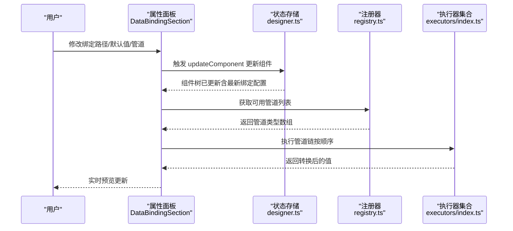
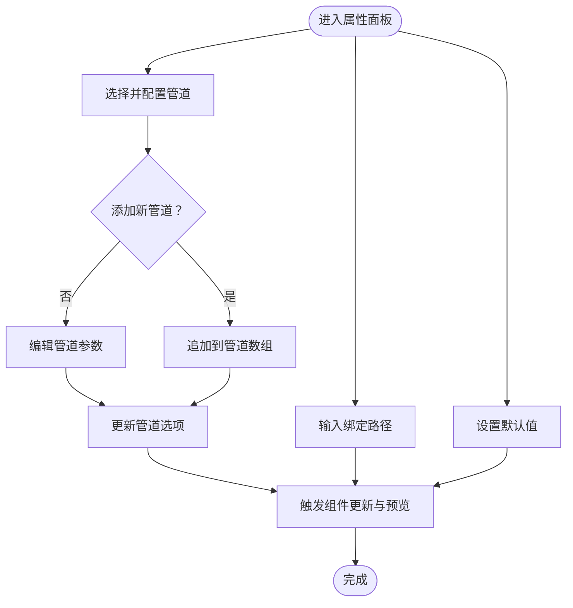
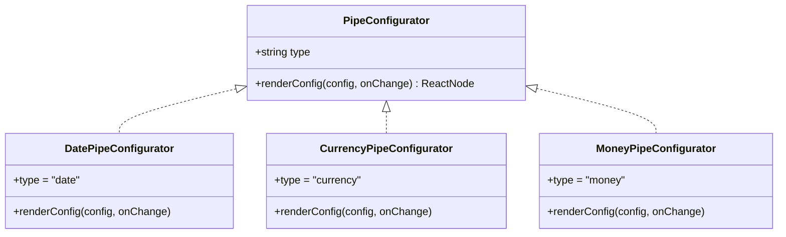
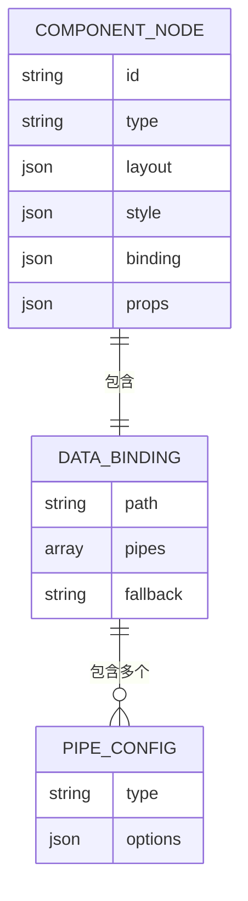
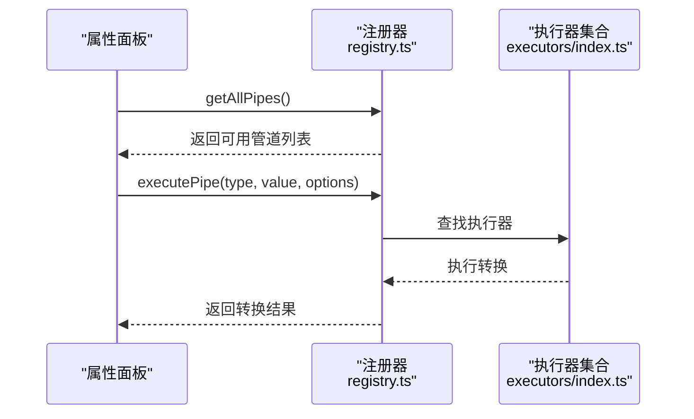
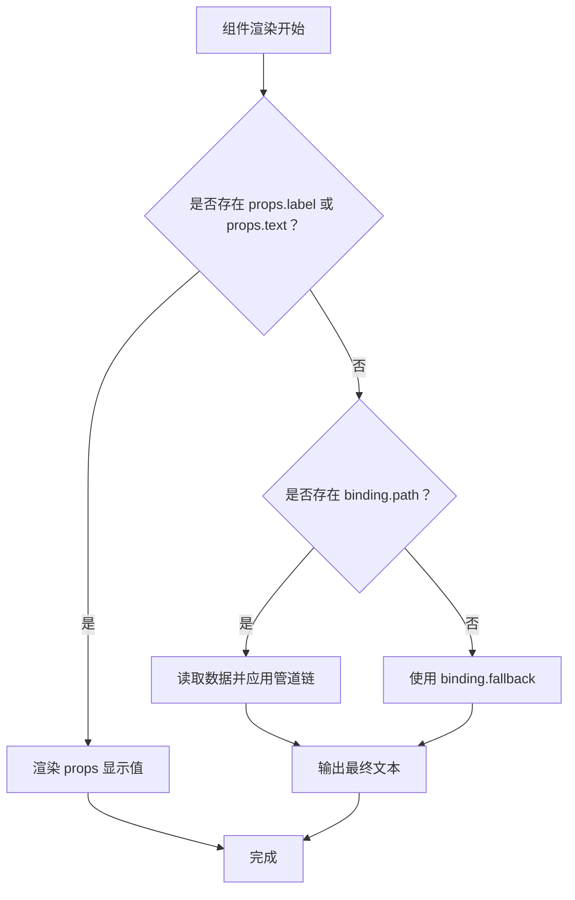
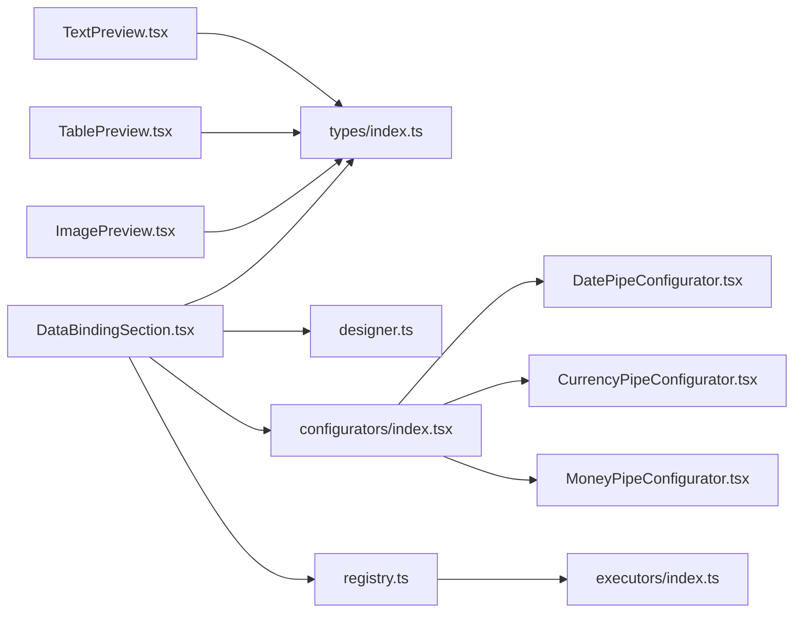

# 数据绑定配置

<cite>
**本文引用的文件**
- [DataBindingSection.tsx](file://designer/src/pages/Designer/components/PropertyPanel/DataBindingSection.tsx)
- [configurators/index.tsx](file://designer/src/pipes/configurators/index.tsx)
- [DatePipeConfigurator.tsx](file://designer/src/pipes/configurators/DatePipeConfigurator.tsx)
- [CurrencyPipeConfigurator.tsx](file://designer/src/pipes/configurators/CurrencyPipeConfigurator.tsx)
- [MoneyPipeConfigurator.tsx](file://designer/src/pipes/configurators/MoneyPipeConfigurator.tsx)
- [types/index.ts](file://designer/src/types/index.ts)
- [registry.ts](file://sdk/src/pipes/registry.ts)
- [types.ts](file://sdk/src/pipes/types.ts)
- [executors/index.ts](file://sdk/src/pipes/executors/index.ts)
- [designer.ts](file://designer/src/store/designer.ts)
- [TextPreview.tsx](file://designer/src/pages/Designer/components/Canvas/componentRenderers/TextPreview.tsx)
- [TablePreview.tsx](file://designer/src/pages/Designer/components/Canvas/componentRenderers/TablePreview.tsx)
- [ImagePreview.tsx](file://designer/src/pages/Designer/components/Canvas/componentRenderers/ImagePreview.tsx)
</cite>

## 目录
1. [简介](#简介)
2. [项目结构](#项目结构)
3. [核心组件](#核心组件)
4. [架构总览](#架构总览)
5. [详细组件分析](#详细组件分析)
6. [依赖分析](#依赖分析)
7. [性能考虑](#性能考虑)
8. [故障排除指南](#故障排除指南)
9. [结论](#结论)
10. [附录](#附录)

## 简介
本技术文档围绕“数据绑定配置”功能展开，系统性说明其在设计器中的实现原理、UI 设计、生命周期管理、最佳实践以及复杂场景示例与排障建议。重点涵盖以下方面：
- Schema 字段与组件属性的映射关系
- 数据绑定配置的 UI 设计：字段选择器、管道应用与实时预览
- 生命周期管理：绑定建立、更新与销毁
- 性能优化与错误处理策略
- 复杂数据绑定场景与常见问题排查

## 项目结构
数据绑定配置位于设计器前端模块中，涉及属性面板、管道配置器、类型定义与状态存储；同时通过 SDK 的管道注册器与执行器完成数据转换。

图表来源
- [DataBindingSection.tsx:1-128](file://designer/src/pages/Designer/components/PropertyPanel/DataBindingSection.tsx#L1-L128)
- [configurators/index.tsx:1-83](file://designer/src/pipes/configurators/index.tsx#L1-L83)
- [DatePipeConfigurator.tsx:1-23](file://designer/src/pipes/configurators/DatePipeConfigurator.tsx#L1-L23)
- [CurrencyPipeConfigurator.tsx:1-23](file://designer/src/pipes/configurators/CurrencyPipeConfigurator.tsx#L1-L23)
- [MoneyPipeConfigurator.tsx:1-80](file://designer/src/pipes/configurators/MoneyPipeConfigurator.tsx#L1-L80)
- [types/index.ts:66-138](file://designer/src/types/index.ts#L66-L138)
- [designer.ts:1-539](file://designer/src/store/designer.ts#L1-L539)
- [TextPreview.tsx:1-31](file://designer/src/pages/Designer/components/Canvas/componentRenderers/TextPreview.tsx#L1-L31)
- [TablePreview.tsx:1-56](file://designer/src/pages/Designer/components/Canvas/componentRenderers/TablePreview.tsx#L1-L56)
- [ImagePreview.tsx:1-34](file://designer/src/pages/Designer/components/Canvas/componentRenderers/ImagePreview.tsx#L1-L34)
- [registry.ts:1-64](file://sdk/src/pipes/registry.ts#L1-L64)
- [types.ts:1-30](file://sdk/src/pipes/types.ts#L1-L30)
- [executors/index.ts:1-44](file://sdk/src/pipes/executors/index.ts#L1-L44)

章节来源
- [DataBindingSection.tsx:1-128](file://designer/src/pages/Designer/components/PropertyPanel/DataBindingSection.tsx#L1-L128)
- [configurators/index.tsx:1-83](file://designer/src/pipes/configurators/index.tsx#L1-L83)
- [types/index.ts:66-138](file://designer/src/types/index.ts#L66-L138)
- [registry.ts:1-64](file://sdk/src/pipes/registry.ts#L1-L64)
- [designer.ts:1-539](file://designer/src/store/designer.ts#L1-L539)

## 核心组件
- 数据绑定配置区：负责绑定路径、默认值与管道的增删改查与配置项变更。
- 管道配置器集合：以插件化方式注册不同管道的 UI 配置器，并根据类型动态渲染。
- 类型定义：统一描述组件节点、数据绑定、管道配置与 Schema 字段等结构。
- 状态存储：维护组件树、选中状态、撤销重做历史等，支持绑定变更的持久化与回放。
- 预览渲染器：在画布上展示组件的最终呈现，体现数据绑定与管道转换效果。

章节来源
- [DataBindingSection.tsx:1-128](file://designer/src/pages/Designer/components/PropertyPanel/DataBindingSection.tsx#L1-L128)
- [configurators/index.tsx:1-83](file://designer/src/pipes/configurators/index.tsx#L1-L83)
- [types/index.ts:66-138](file://designer/src/types/index.ts#L66-L138)
- [designer.ts:1-539](file://designer/src/store/designer.ts#L1-L539)
- [TextPreview.tsx:1-31](file://designer/src/pages/Designer/components/Canvas/componentRenderers/TextPreview.tsx#L1-L31)
- [TablePreview.tsx:1-56](file://designer/src/pages/Designer/components/Canvas/componentRenderers/TablePreview.tsx#L1-L56)
- [ImagePreview.tsx:1-34](file://designer/src/pages/Designer/components/Canvas/componentRenderers/ImagePreview.tsx#L1-L34)

## 架构总览
数据绑定配置采用“UI 配置 + 插件化管道 + SDK 执行”的分层架构：
- UI 层：属性面板收集绑定路径、默认值与管道配置，调用状态存储更新组件树。
- 管道层：配置器渲染具体管道参数，注册器提供管道枚举与执行入口。
- 执行层：SDK 注册器加载执行器，按顺序执行管道转换，输出最终值供渲染器使用。

图表来源
- [DataBindingSection.tsx:1-128](file://designer/src/pages/Designer/components/PropertyPanel/DataBindingSection.tsx#L1-L128)
- [designer.ts:93-100](file://designer/src/store/designer.ts#L93-L100)
- [registry.ts:31-52](file://sdk/src/pipes/registry.ts#L31-L52)
- [executors/index.ts:1-44](file://sdk/src/pipes/executors/index.ts#L1-L44)

## 详细组件分析

### 数据绑定配置区（属性面板）
- 功能职责
  - 绑定路径输入：支持 JSON 路径表达式，如对象嵌套与数组索引。
  - 默认值（Fallback）：当数据为空、null 或 undefined 时的占位显示。
  - 管道管理：动态添加/删除管道，按顺序执行；每个管道通过配置器渲染专属参数界面。
- 关键交互
  - 添加管道：从下拉选择器中选取类型，追加到管道数组。
  - 删除管道：点击关闭按钮移除对应索引的管道。
  - 参数变更：通过配置器回调更新管道选项。
- 与状态存储联动
  - 任何绑定变更均通过状态存储的更新方法持久化，触发撤销/重做历史记录保存。

图表来源
- [DataBindingSection.tsx:20-43](file://designer/src/pages/Designer/components/PropertyPanel/DataBindingSection.tsx#L20-L43)
- [designer.ts:93-100](file://designer/src/store/designer.ts#L93-L100)

章节来源
- [DataBindingSection.tsx:1-128](file://designer/src/pages/Designer/components/PropertyPanel/DataBindingSection.tsx#L1-L128)
- [designer.ts:93-100](file://designer/src/store/designer.ts#L93-L100)

### 管道配置器集合（插件化 UI）
- 设计要点
  - 统一接口：每个配置器实现类型标识与渲染函数，便于注册与查找。
  - 注册表：集中注册内置配置器，提供按类型检索能力。
  - 动态渲染：根据当前管道类型，调用对应配置器渲染参数 UI。
- 内置配置器
  - 日期管道：支持格式化模板参数。
  - 货币管道：支持符号与显示格式。
  - 金额转换：支持分/元互转、精度、符号与千分位分隔。
  - 其他：如截取、默认值等。

图表来源
- [configurators/index.tsx:13-82](file://designer/src/pipes/configurators/index.tsx#L13-L82)
- [DatePipeConfigurator.tsx:9-22](file://designer/src/pipes/configurators/DatePipeConfigurator.tsx#L9-L22)
- [CurrencyPipeConfigurator.tsx:9-22](file://designer/src/pipes/configurators/CurrencyPipeConfigurator.tsx#L9-L22)
- [MoneyPipeConfigurator.tsx:9-79](file://designer/src/pipes/configurators/MoneyPipeConfigurator.tsx#L9-L79)

章节来源
- [configurators/index.tsx:1-83](file://designer/src/pipes/configurators/index.tsx#L1-L83)
- [DatePipeConfigurator.tsx:1-23](file://designer/src/pipes/configurators/DatePipeConfigurator.tsx#L1-L23)
- [CurrencyPipeConfigurator.tsx:1-23](file://designer/src/pipes/configurators/CurrencyPipeConfigurator.tsx#L1-L23)
- [MoneyPipeConfigurator.tsx:1-80](file://designer/src/pipes/configurators/MoneyPipeConfigurator.tsx#L1-L80)

### 类型定义与映射关系
- 组件节点（ComponentNode）
  - 包含布局、样式、绑定与属性等字段，其中 binding 支持 path、pipes、fallback。
- 数据绑定（DataBinding）
  - path：JSON 路径，指向 Schema 字典中的字段。
  - pipes：管道数组，按序执行。
  - fallback：默认值。
- 管道配置（PipeConfig）
  - type：管道类型。
  - options：管道参数对象。
- Schema 字段（SchemaField）
  - key、label、type、children、enum、format 等，用于描述数据结构与格式。

图表来源
- [types/index.ts:123-138](file://designer/src/types/index.ts#L123-L138)
- [types/index.ts:71-75](file://designer/src/types/index.ts#L71-L75)
- [types/index.ts:66-69](file://designer/src/types/index.ts#L66-L69)

章节来源
- [types/index.ts:66-138](file://designer/src/types/index.ts#L66-L138)

### 管道执行器与注册器
- 注册器职责
  - 提供管道枚举（用于 UI 下拉选择）。
  - 执行管道转换（按顺序），返回最终值。
- 执行器集合
  - 内置执行器包括日期、货币、金额转换、大小写、截取、默认值等。
- 执行流程
  - UI 侧传入管道数组与参数，注册器按顺序调用执行器，输出结果。

图表来源
- [registry.ts:31-52](file://sdk/src/pipes/registry.ts#L31-L52)
- [executors/index.ts:1-44](file://sdk/src/pipes/executors/index.ts#L1-L44)

章节来源
- [registry.ts:1-64](file://sdk/src/pipes/registry.ts#L1-L64)
- [types.ts:1-30](file://sdk/src/pipes/types.ts#L1-L30)
- [executors/index.ts:1-44](file://sdk/src/pipes/executors/index.ts#L1-L44)

### 预览渲染器与数据绑定
- 文本组件预览
  - 优先展示 props 中的标签/文本，其次回退到绑定路径，最终为空时显示默认占位。
- 表格组件预览
  - 展示列标题与占位提示，体现列配置与可见性。
- 图片组件预览
  - 若存在资源地址则渲染图片，否则显示占位提示。

图表来源
- [TextPreview.tsx:10-28](file://designer/src/pages/Designer/components/Canvas/componentRenderers/TextPreview.tsx#L10-L28)
- [TablePreview.tsx:10-55](file://designer/src/pages/Designer/components/Canvas/componentRenderers/TablePreview.tsx#L10-L55)
- [ImagePreview.tsx:10-33](file://designer/src/pages/Designer/components/Canvas/componentRenderers/ImagePreview.tsx#L10-L33)

章节来源
- [TextPreview.tsx:1-31](file://designer/src/pages/Designer/components/Canvas/componentRenderers/TextPreview.tsx#L1-L31)
- [TablePreview.tsx:1-56](file://designer/src/pages/Designer/components/Canvas/componentRenderers/TablePreview.tsx#L1-L56)
- [ImagePreview.tsx:1-34](file://designer/src/pages/Designer/components/Canvas/componentRenderers/ImagePreview.tsx#L1-L34)

## 依赖分析
- 组件耦合
  - 属性面板依赖类型定义与状态存储；依赖注册器获取可用管道；依赖配置器渲染参数 UI。
  - 预览渲染器依赖类型定义与组件绑定信息。
- 外部依赖
  - SDK 管道系统提供执行器与注册器，保证前后端一致的转换行为。
- 循环依赖
  - 当前结构清晰，未发现循环依赖迹象。

图表来源
- [DataBindingSection.tsx:1-128](file://designer/src/pages/Designer/components/PropertyPanel/DataBindingSection.tsx#L1-L128)
- [configurators/index.tsx:1-83](file://designer/src/pipes/configurators/index.tsx#L1-L83)
- [DatePipeConfigurator.tsx:1-23](file://designer/src/pipes/configurators/DatePipeConfigurator.tsx#L1-L23)
- [CurrencyPipeConfigurator.tsx:1-23](file://designer/src/pipes/configurators/CurrencyPipeConfigurator.tsx#L1-L23)
- [MoneyPipeConfigurator.tsx:1-80](file://designer/src/pipes/configurators/MoneyPipeConfigurator.tsx#L1-L80)
- [types/index.ts:66-138](file://designer/src/types/index.ts#L66-L138)
- [designer.ts:1-539](file://designer/src/store/designer.ts#L1-L539)
- [registry.ts:1-64](file://sdk/src/pipes/registry.ts#L1-L64)
- [executors/index.ts:1-44](file://sdk/src/pipes/executors/index.ts#L1-L44)
- [TextPreview.tsx:1-31](file://designer/src/pages/Designer/components/Canvas/componentRenderers/TextPreview.tsx#L1-L31)
- [TablePreview.tsx:1-56](file://designer/src/pages/Designer/components/Canvas/componentRenderers/TablePreview.tsx#L1-L56)
- [ImagePreview.tsx:1-34](file://designer/src/pages/Designer/components/Canvas/componentRenderers/ImagePreview.tsx#L1-L34)

章节来源
- [DataBindingSection.tsx:1-128](file://designer/src/pages/Designer/components/PropertyPanel/DataBindingSection.tsx#L1-L128)
- [configurators/index.tsx:1-83](file://designer/src/pipes/configurators/index.tsx#L1-L83)
- [types/index.ts:66-138](file://designer/src/types/index.ts#L66-L138)
- [registry.ts:1-64](file://sdk/src/pipes/registry.ts#L1-L64)
- [designer.ts:1-539](file://designer/src/store/designer.ts#L1-L539)

## 性能考虑
- 管道链执行
  - 建议控制管道数量与复杂度，避免过长链导致渲染延迟。
  - 对高频字段可缓存中间结果，减少重复计算。
- 状态更新
  - 使用状态存储的批量更新方法，合并多次变更，降低重渲染次数。
- 预览渲染
  - 文本与表格预览应尽量避免不必要的 DOM 重建，优先复用结构。
- 数据访问
  - 绑定路径解析应避免深层递归与频繁对象拷贝，必要时引入路径缓存。

## 故障排除指南
- 绑定路径无效
  - 检查路径是否符合 JSON 路径规范；确认数据源中存在对应字段。
  - 若路径为空，检查默认值是否正确设置。
- 管道不生效
  - 确认管道类型是否正确注册；检查配置器参数是否完整。
  - 在执行器层面验证转换逻辑是否符合预期。
- 预览异常
  - 文本组件若显示为空，优先检查 props 是否存在；其次检查绑定路径与默认值。
  - 表格组件无数据显示属正常占位，确认列配置与可见性。
- 撤销/重做异常
  - 确保每次变更都通过状态存储的更新方法进行，避免绕过历史记录保存。

章节来源
- [DataBindingSection.tsx:20-43](file://designer/src/pages/Designer/components/PropertyPanel/DataBindingSection.tsx#L20-L43)
- [designer.ts:93-100](file://designer/src/store/designer.ts#L93-L100)
- [registry.ts:45-52](file://sdk/src/pipes/registry.ts#L45-L52)

## 结论
数据绑定配置通过“UI 配置 + 插件化管道 + SDK 执行”的架构实现了灵活、可扩展且可预览的数据绑定体验。配合类型定义与状态存储，确保了配置的一致性与可追溯性。遵循本文的最佳实践与排障建议，可在复杂场景中稳定地构建高质量的打印模板。

## 附录
- 复杂场景示例
  - 多级嵌套对象绑定：使用路径定位到深层字段，结合默认值保障健壮性。
  - 数值金额转换：先进行单位换算，再设置精度与符号，最后启用千分位分隔。
  - 日期格式化：指定格式模板，确保输出符合业务要求。
- 开发建议
  - 新增管道时，同步完善配置器与执行器，并在注册器中注册。
  - 对于高频渲染组件，优先采用轻量级管道组合，避免阻塞主线程。
  - 在模板导出前，校验绑定路径与管道配置的有效性，提升运行期稳定性。