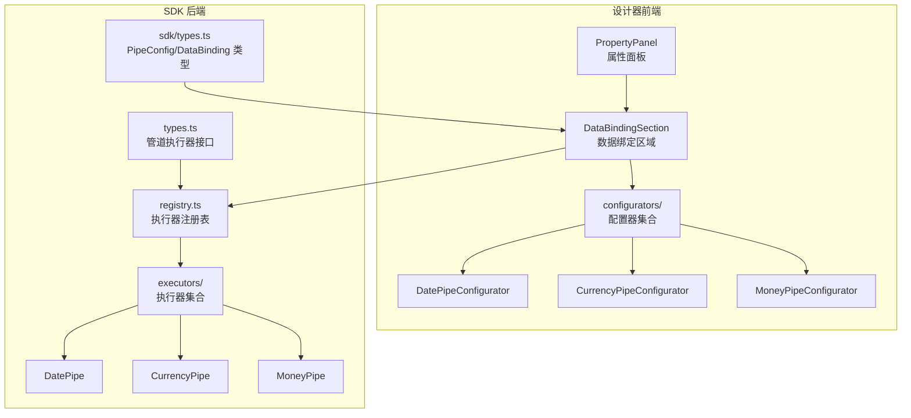
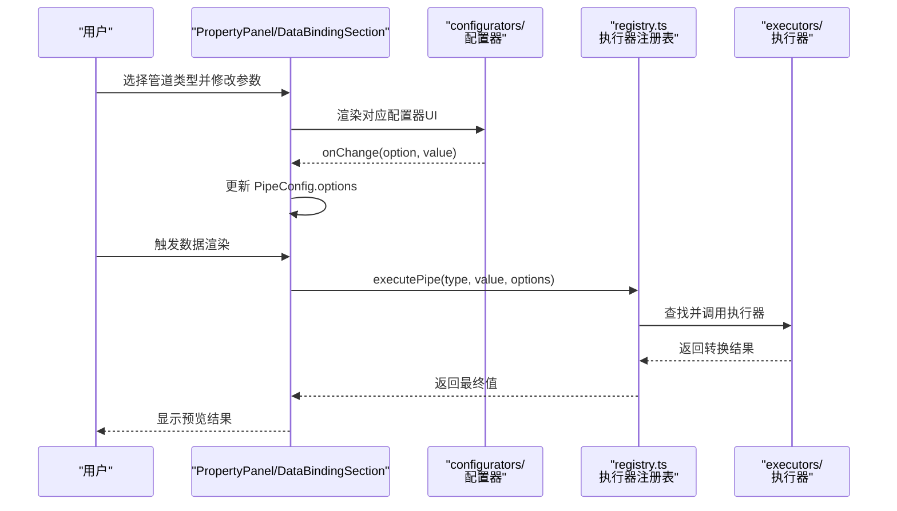
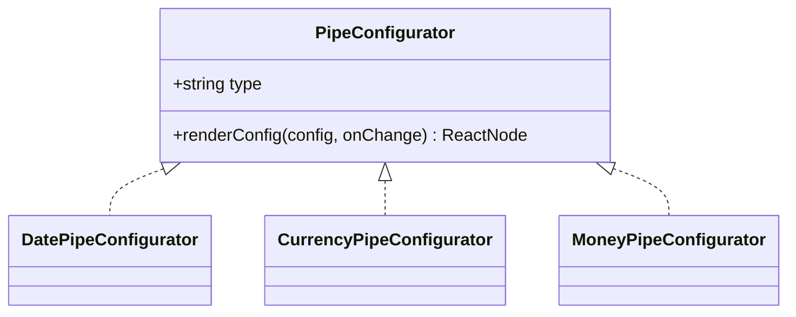
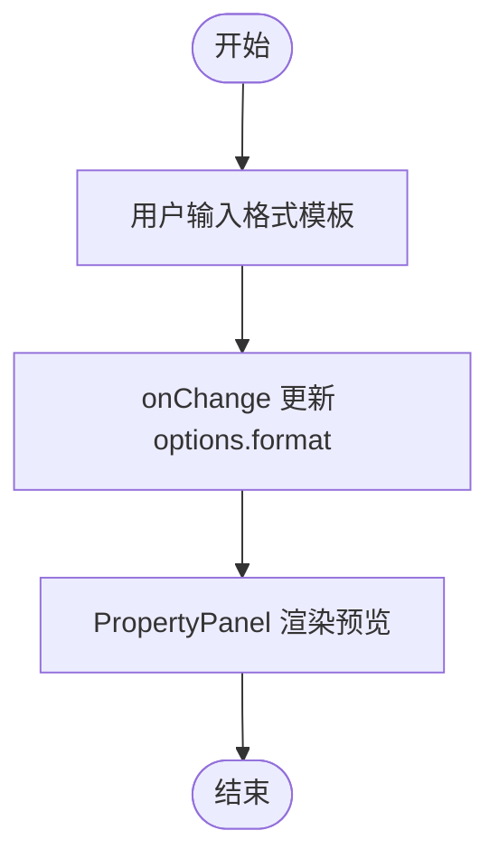
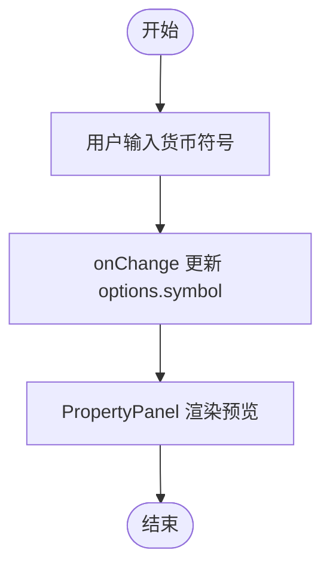
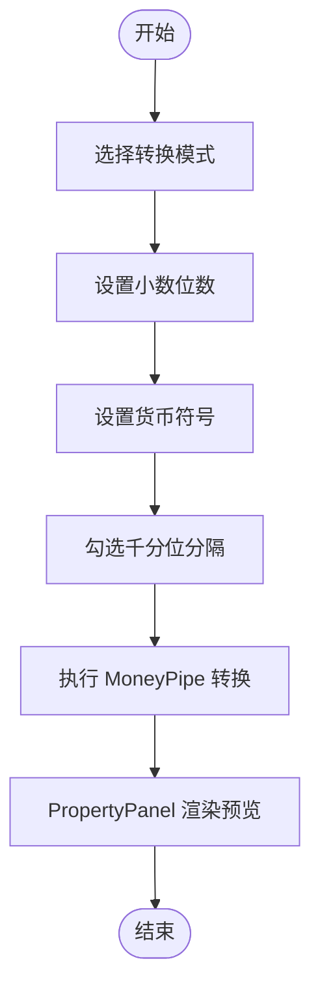
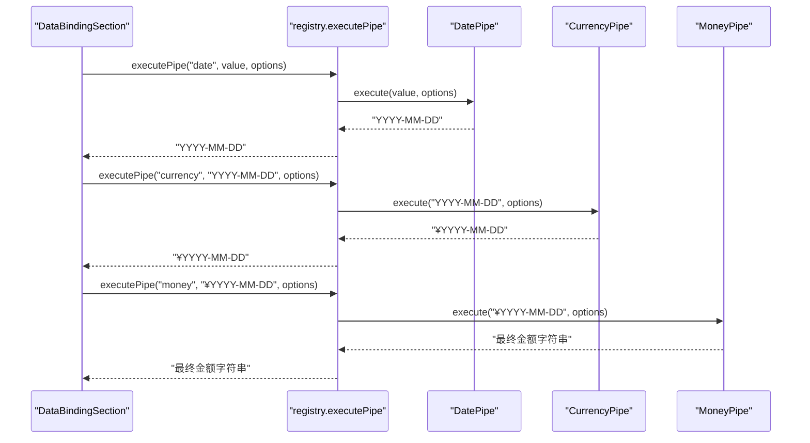
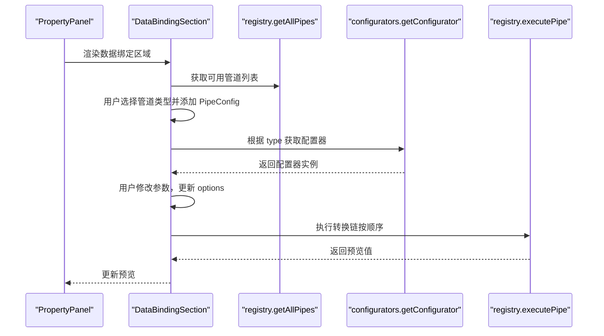
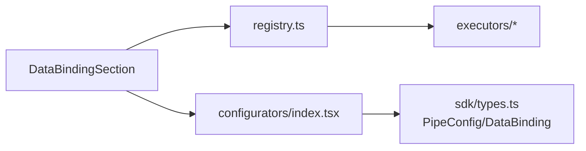

# 管道配置器

<cite>
**本文引用的文件**
- [designer/src/pipes/configurators/index.tsx](file://designer/src/pipes/configurators/index.tsx)
- [designer/src/pipes/configurators/DatePipeConfigurator.tsx](file://designer/src/pipes/configurators/DatePipeConfigurator.tsx)
- [designer/src/pipes/configurators/CurrencyPipeConfigurator.tsx](file://designer/src/pipes/configurators/CurrencyPipeConfigurator.tsx)
- [designer/src/pipes/configurators/MoneyPipeConfigurator.tsx](file://designer/src/pipes/configurators/MoneyPipeConfigurator.tsx)
- [sdk/src/pipes/executors/index.ts](file://sdk/src/pipes/executors/index.ts)
- [sdk/src/pipes/executors/DatePipe.ts](file://sdk/src/pipes/executors/DatePipe.ts)
- [sdk/src/pipes/executors/CurrencyPipe.ts](file://sdk/src/pipes/executors/CurrencyPipe.ts)
- [sdk/src/pipes/executors/MoneyPipe.ts](file://sdk/src/pipes/executors/MoneyPipe.ts)
- [sdk/src/pipes/registry.ts](file://sdk/src/pipes/registry.ts)
- [sdk/src/pipes/types.ts](file://sdk/src/pipes/types.ts)
- [sdk/src/types.ts](file://sdk/src/types.ts)
- [designer/src/pages/Designer/components/PropertyPanel/DataBindingSection.tsx](file://designer/src/pages/Designer/components/PropertyPanel/DataBindingSection.tsx)
- [designer/src/pages/Designer/components/PropertyPanel/index.tsx](file://designer/src/pages/Designer/components/PropertyPanel/index.tsx)
</cite>

## 目录
1. [简介](#简介)
2. [项目结构](#项目结构)
3. [核心组件](#核心组件)
4. [架构总览](#架构总览)
5. [详细组件分析](#详细组件分析)
6. [依赖关系分析](#依赖关系分析)
7. [性能考虑](#性能考虑)
8. [故障排查指南](#故障排查指南)
9. [结论](#结论)
10. [附录](#附录)

## 简介
本技术文档围绕“管道配置器系统”展开，系统由两部分组成：
- 设计器前端的“管道配置器”（UI 层），负责为不同类型的管道提供参数输入界面与实时预览能力；
- SDK 后端的“管道执行器”，负责根据配置选项对数据进行转换与格式化。

本文将深入解析以下内容：
- 各类管道配置器的实现原理与 UI 交互逻辑（DatePipeConfigurator、CurrencyPipeConfigurator、MoneyPipeConfigurator 等）；
- 管道执行器的工作机制（数据转换链的构建与执行流程）；
- 自定义管道配置器与执行器的开发指南与扩展方法；
- 实际使用示例与性能优化建议。

## 项目结构
管道配置器系统主要分布在两个模块：
- 设计器前端（designer）：提供可视化配置界面与交互逻辑；
- SDK（sdk）：提供管道执行器、注册表与类型定义。

图表来源
- [designer/src/pages/Designer/components/PropertyPanel/index.tsx:1-129](file://designer/src/pages/Designer/components/PropertyPanel/index.tsx#L1-L129)
- [designer/src/pages/Designer/components/PropertyPanel/DataBindingSection.tsx:1-128](file://designer/src/pages/Designer/components/PropertyPanel/DataBindingSection.tsx#L1-L128)
- [designer/src/pipes/configurators/index.tsx:1-83](file://designer/src/pipes/configurators/index.tsx#L1-L83)
- [sdk/src/pipes/registry.ts:1-64](file://sdk/src/pipes/registry.ts#L1-L64)
- [sdk/src/pipes/executors/index.ts:1-44](file://sdk/src/pipes/executors/index.ts#L1-L44)
- [sdk/src/pipes/types.ts:1-30](file://sdk/src/pipes/types.ts#L1-L30)
- [sdk/src/types.ts:66-76](file://sdk/src/types.ts#L66-L76)

章节来源
- [designer/src/pipes/configurators/index.tsx:1-83](file://designer/src/pipes/configurators/index.tsx#L1-L83)
- [sdk/src/pipes/registry.ts:1-64](file://sdk/src/pipes/registry.ts#L1-L64)

## 核心组件
- 管道配置器接口（UI 层）
  - 定义了 type 与 renderConfig 方法，用于渲染对应管道的参数 UI，并通过回调 onChange 推送参数变化。
- 管道执行器接口（后端）
  - 定义了 type、label 与 execute 方法，execute(value, options) 返回转换后的结果。
- 管道注册表
  - 提供注册、查询、遍历与执行管道的方法；初始化时注册内置执行器。

章节来源
- [sdk/src/pipes/types.ts:7-29](file://sdk/src/pipes/types.ts#L7-L29)
- [sdk/src/pipes/registry.ts:9-64](file://sdk/src/pipes/registry.ts#L9-L64)
- [sdk/src/types.ts:66-76](file://sdk/src/types.ts#L66-L76)

## 架构总览
管道配置器系统采用“前端配置 + 后端执行”的双层架构：
- 前端负责收集用户输入（参数），并将其保存到 PipeConfig 中；
- 后端根据 PipeConfig 的数组顺序依次执行各管道，形成“数据转换链”。

图表来源
- [designer/src/pages/Designer/components/PropertyPanel/DataBindingSection.tsx:20-43](file://designer/src/pages/Designer/components/PropertyPanel/DataBindingSection.tsx#L20-L43)
- [designer/src/pipes/configurators/index.tsx:70-82](file://designer/src/pipes/configurators/index.tsx#L70-L82)
- [sdk/src/pipes/registry.ts:44-52](file://sdk/src/pipes/registry.ts#L44-L52)
- [sdk/src/pipes/executors/index.ts:6-8](file://sdk/src/pipes/executors/index.ts#L6-L8)

## 详细组件分析

### 管道配置器集合与注册表
- 配置器集合导出多个内置配置器（date/currency/money/slice/default），并通过注册表统一管理与检索。
- 注册表提供 getConfigurator(type) 以按类型获取对应的配置器实例，用于渲染参数 UI。

图表来源
- [designer/src/pipes/configurators/index.tsx:14-19](file://designer/src/pipes/configurators/index.tsx#L14-L19)
- [designer/src/pipes/configurators/DatePipeConfigurator.tsx:9-22](file://designer/src/pipes/configurators/DatePipeConfigurator.tsx#L9-L22)
- [designer/src/pipes/configurators/CurrencyPipeConfigurator.tsx:9-22](file://designer/src/pipes/configurators/CurrencyPipeConfigurator.tsx#L9-L22)
- [designer/src/pipes/configurators/MoneyPipeConfigurator.tsx:9-79](file://designer/src/pipes/configurators/MoneyPipeConfigurator.tsx#L9-L79)

章节来源
- [designer/src/pipes/configurators/index.tsx:68-82](file://designer/src/pipes/configurators/index.tsx#L68-L82)

### DatePipeConfigurator（日期格式化）
- 参数：format（格式模板，如 YYYY-MM-DD HH:mm:ss）。
- 交互：输入框实时更新 options.format，onChange 回调触发上层更新 PipeConfig。
- 预览：后端执行器根据 format 进行替换，返回格式化后的日期字符串。

图表来源
- [designer/src/pipes/configurators/DatePipeConfigurator.tsx:12-21](file://designer/src/pipes/configurators/DatePipeConfigurator.tsx#L12-L21)
- [sdk/src/pipes/executors/DatePipe.ts:11-34](file://sdk/src/pipes/executors/DatePipe.ts#L11-L34)

章节来源
- [designer/src/pipes/configurators/DatePipeConfigurator.tsx:1-23](file://designer/src/pipes/configurators/DatePipeConfigurator.tsx#L1-L23)
- [sdk/src/pipes/executors/DatePipe.ts:1-35](file://sdk/src/pipes/executors/DatePipe.ts#L1-L35)

### CurrencyPipeConfigurator（货币格式化）
- 参数：symbol（货币符号，默认 ¥）。
- 交互：输入框实时更新 options.symbol，onChange 回调触发上层更新 PipeConfig。
- 预览：后端执行器根据 symbol 与默认精度拼接货币字符串。

图表来源
- [designer/src/pipes/configurators/CurrencyPipeConfigurator.tsx:12-21](file://designer/src/pipes/configurators/CurrencyPipeConfigurator.tsx#L12-L21)
- [sdk/src/pipes/executors/CurrencyPipe.ts:11-16](file://sdk/src/pipes/executors/CurrencyPipe.ts#L11-L16)

章节来源
- [designer/src/pipes/configurators/CurrencyPipeConfigurator.tsx:1-23](file://designer/src/pipes/configurators/CurrencyPipeConfigurator.tsx#L1-L23)
- [sdk/src/pipes/executors/CurrencyPipe.ts:1-17](file://sdk/src/pipes/executors/CurrencyPipe.ts#L1-L17)

### MoneyPipeConfigurator（金额转换）
- 参数：
  - mode：转换模式（fenToYuan、yuanToFen、none）
  - precision：小数位数（默认 2）
  - symbol：货币符号（可留空）
  - separator：是否启用千分位分隔
- 交互：Radio、InputNumber、Input、Checkbox 组合，onChange 更新对应 options。
- 预览：后端执行器基于 Decimal.js 进行高精度计算，支持分/元互转、精度控制与千分位分隔。

图表来源
- [designer/src/pipes/configurators/MoneyPipeConfigurator.tsx:12-78](file://designer/src/pipes/configurators/MoneyPipeConfigurator.tsx#L12-L78)
- [sdk/src/pipes/executors/MoneyPipe.ts:13-61](file://sdk/src/pipes/executors/MoneyPipe.ts#L13-L61)

章节来源
- [designer/src/pipes/configurators/MoneyPipeConfigurator.tsx:1-80](file://designer/src/pipes/configurators/MoneyPipeConfigurator.tsx#L1-L80)
- [sdk/src/pipes/executors/MoneyPipe.ts:1-62](file://sdk/src/pipes/executors/MoneyPipe.ts#L1-L62)

### 管道执行器与执行链
- 管道执行器接口定义了 type、label 与 execute 方法。
- 注册表负责注册内置执行器（DatePipe、CurrencyPipe、MoneyPipe 等），并提供 executePipe(type, value, options) 执行转换。
- 数据绑定区域将多个管道按顺序执行，形成“转换链”。每个执行器接收上游输出作为输入，返回当前转换结果，最终得到渲染值。

图表来源
- [sdk/src/pipes/executors/index.ts:6-8](file://sdk/src/pipes/executors/index.ts#L6-L8)
- [sdk/src/pipes/registry.ts:44-52](file://sdk/src/pipes/registry.ts#L44-L52)
- [sdk/src/pipes/executors/DatePipe.ts:11-34](file://sdk/src/pipes/executors/DatePipe.ts#L11-L34)
- [sdk/src/pipes/executors/CurrencyPipe.ts:11-16](file://sdk/src/pipes/executors/CurrencyPipe.ts#L11-L16)
- [sdk/src/pipes/executors/MoneyPipe.ts:13-61](file://sdk/src/pipes/executors/MoneyPipe.ts#L13-L61)

章节来源
- [sdk/src/pipes/executors/index.ts:1-44](file://sdk/src/pipes/executors/index.ts#L1-L44)
- [sdk/src/pipes/registry.ts:44-64](file://sdk/src/pipes/registry.ts#L44-L64)

### 数据绑定与管道配置的 UI 流程
- 用户在“数据绑定”区域选择管道类型，系统追加一条空的 PipeConfig。
- 针对每条管道，根据 type 获取对应配置器，渲染参数 UI。
- 用户修改参数时，通过 onChange 回调更新该管道的 options。
- 渲染时，PropertyPanel 会调用执行器执行转换链，展示预览效果。

图表来源
- [designer/src/pages/Designer/components/PropertyPanel/DataBindingSection.tsx:20-43](file://designer/src/pages/Designer/components/PropertyPanel/DataBindingSection.tsx#L20-L43)
- [designer/src/pipes/configurators/index.tsx:70-82](file://designer/src/pipes/configurators/index.tsx#L70-L82)
- [sdk/src/pipes/registry.ts:31-40](file://sdk/src/pipes/registry.ts#L31-L40)

章节来源
- [designer/src/pages/Designer/components/PropertyPanel/DataBindingSection.tsx:1-128](file://designer/src/pages/Designer/components/PropertyPanel/DataBindingSection.tsx#L1-L128)
- [designer/src/pages/Designer/components/PropertyPanel/index.tsx:64-74](file://designer/src/pages/Designer/components/PropertyPanel/index.tsx#L64-L74)

## 依赖关系分析
- 前端依赖后端的注册表与执行器：
  - DataBindingSection 通过 registry.getAllPipes 获取下拉选项；
  - 通过 getConfigurator 获取配置器渲染 UI；
  - 通过 executePipe 执行转换链并预览。
- 执行器注册表集中管理所有执行器，便于扩展与统一调度。

图表来源
- [designer/src/pages/Designer/components/PropertyPanel/DataBindingSection.tsx:10-11](file://designer/src/pages/Designer/components/PropertyPanel/DataBindingSection.tsx#L10-L11)
- [designer/src/pipes/configurators/index.tsx:68-82](file://designer/src/pipes/configurators/index.tsx#L68-L82)
- [sdk/src/pipes/registry.ts:44-52](file://sdk/src/pipes/registry.ts#L44-L52)
- [sdk/src/types.ts:66-76](file://sdk/src/types.ts#L66-L76)

章节来源
- [sdk/src/pipes/registry.ts:1-64](file://sdk/src/pipes/registry.ts#L1-L64)
- [sdk/src/types.ts:66-76](file://sdk/src/types.ts#L66-L76)

## 性能考虑
- 高精度计算：MoneyPipe 使用 Decimal.js 进行金额转换，避免浮点误差，适合金融场景。
- 顺序执行：管道按序执行，复杂链路可能带来性能开销，建议：
  - 合理拆分管道，避免过长链路；
  - 对频繁使用的转换结果进行缓存（可在应用层实现）；
  - 控制小数位数与千分位分隔的使用频率。
- UI 渲染：配置器参数变更应节流或防抖，减少不必要的重渲染（可在配置器内部实现）。

## 故障排查指南
- 管道未找到
  - 现象：executePipe 无法找到执行器，返回原始值并打印警告。
  - 处理：确认管道类型是否正确，检查注册表是否已注册对应执行器。
- 日期格式无效
  - 现象：输入非法日期或格式，返回原值。
  - 处理：确保输入为可识别的时间戳或日期字符串，格式模板符合预期。
- 金额转换异常
  - 现象：非数字输入导致错误，回退为原值。
  - 处理：确保输入为合法数值或可转换为数值的字符串；检查 mode、precision、separator 的组合。
- UI 参数未生效
  - 现象：修改参数后预览未更新。
  - 处理：确认 onChange 回调正确更新 PipeConfig.options；检查 DataBindingSection 的更新逻辑。

章节来源
- [sdk/src/pipes/registry.ts:44-52](file://sdk/src/pipes/registry.ts#L44-L52)
- [sdk/src/pipes/executors/DatePipe.ts:11-17](file://sdk/src/pipes/executors/DatePipe.ts#L11-L17)
- [sdk/src/pipes/executors/MoneyPipe.ts:56-59](file://sdk/src/pipes/executors/MoneyPipe.ts#L56-L59)
- [designer/src/pages/Designer/components/PropertyPanel/DataBindingSection.tsx:33-43](file://designer/src/pages/Designer/components/PropertyPanel/DataBindingSection.tsx#L33-L43)

## 结论
管道配置器系统通过“前端配置 + 后端执行”的解耦设计，实现了灵活、可扩展的数据格式化与转换能力。配置器提供直观的参数界面，执行器保证转换的准确性与一致性。通过注册表与类型定义，系统具备良好的扩展性，便于新增自定义管道配置器与执行器。

## 附录

### 自定义管道配置器开发指南
- 步骤
  - 在 configurators 目录新建配置器文件，导出实现 PipeConfigurator 接口的对象；
  - 在注册表中注册该配置器（type 与 renderConfig）；
  - 在 DataBindingSection 中通过 getConfigurator(type) 获取并渲染 UI；
  - 在 onChange 回调中更新 PipeConfig.options。
- 最佳实践
  - 参数校验与默认值设置；
  - UI 布局清晰，提示文案完整；
  - 与执行器保持一致的参数命名与语义。

章节来源
- [designer/src/pipes/configurators/index.tsx:14-19](file://designer/src/pipes/configurators/index.tsx#L14-L19)
- [designer/src/pipes/configurators/index.tsx:70-82](file://designer/src/pipes/configurators/index.tsx#L70-L82)

### 自定义管道执行器开发指南
- 步骤
  - 在 executors 目录新建执行器文件，导出实现 PipeExecutor 接口的对象；
  - 在 registry 中注册该执行器；
  - 在 DataBindingSection 的管道下拉中可见该执行器；
  - 在渲染时通过 executePipe(type, value, options) 执行转换。
- 最佳实践
  - 保持 execute 方法纯函数特性，避免副作用；
  - 对异常输入进行兜底处理，保证稳定性；
  - 与配置器参数保持一致，文档化默认行为。

章节来源
- [sdk/src/pipes/executors/index.ts:6-8](file://sdk/src/pipes/executors/index.ts#L6-L8)
- [sdk/src/pipes/registry.ts:17-26](file://sdk/src/pipes/registry.ts#L17-L26)
- [sdk/src/pipes/types.ts:11-29](file://sdk/src/pipes/types.ts#L11-L29)

### 实际使用示例（步骤说明）
- 日期格式化
  - 在“数据管道”下拉中选择“日期格式化”，在配置器中输入格式模板（如 YYYY-MM-DD HH:mm:ss），预览即为格式化后的日期字符串。
- 货币格式化
  - 选择“货币格式化”，在配置器中输入货币符号（如 ¥），预览即为带符号的货币字符串。
- 金额转换
  - 选择“金额转换”，设置转换模式（分→元/元→分/不转换）、小数位数、货币符号与千分位分隔，预览即为格式化后的金额字符串。

章节来源
- [designer/src/pipes/configurators/DatePipeConfigurator.tsx:12-21](file://designer/src/pipes/configurators/DatePipeConfigurator.tsx#L12-L21)
- [designer/src/pipes/configurators/CurrencyPipeConfigurator.tsx:12-21](file://designer/src/pipes/configurators/CurrencyPipeConfigurator.tsx#L12-L21)
- [designer/src/pipes/configurators/MoneyPipeConfigurator.tsx:12-78](file://designer/src/pipes/configurators/MoneyPipeConfigurator.tsx#L12-L78)
- [sdk/src/pipes/executors/DatePipe.ts:11-34](file://sdk/src/pipes/executors/DatePipe.ts#L11-L34)
- [sdk/src/pipes/executors/CurrencyPipe.ts:11-16](file://sdk/src/pipes/executors/CurrencyPipe.ts#L11-L16)
- [sdk/src/pipes/executors/MoneyPipe.ts:13-61](file://sdk/src/pipes/executors/MoneyPipe.ts#L13-L61)