# 架构设计

<cite>
**本文引用的文件**
- [main.tsx](file://designer/src/main.tsx)
- [App.tsx](file://designer/src/App.tsx)
- [MainLayout.tsx](file://designer/src/layouts/MainLayout.tsx)
- [Designer.tsx](file://designer/src/pages/Designer/index.tsx)
- [index.module.css](file://designer/src/pages/Designer/index.module.css)
- [Canvas/index.tsx](file://designer/src/pages/Designer/components/Canvas/index.tsx)
- [PrintPreview/index.tsx](file://designer/src/components/PrintPreview/index.tsx)
- [PropertyPanel/index.tsx](file://designer/src/pages/Designer/components/PropertyPanel/index.tsx)
- [PropertyPanel/index.module.css](file://designer/src/pages/Designer/components/PropertyPanel/index.module.css)
- [AssetPanel/index.tsx](file://designer/src/pages/Designer/components/AssetPanel/index.tsx)
- [DataAsset/index.tsx](file://designer/src/pages/Designer/components/AssetPanel/DataAsset/index.tsx)
- [MockDataFormModal.tsx](file://designer/src/pages/MockDataManagement/components/MockDataFormModal.tsx)
- [SchemaFormModal.tsx](file://designer/src/pages/SchemaManagement/components/SchemaFormModal.tsx)
- [TemplateFormModal.tsx](file://designer/src/pages/TemplateManagement/components/TemplateFormModal.tsx)
- [designer.ts](file://designer/src/store/designer.ts)
- [types/index.ts](file://designer/src/types/index.ts)
- [api.ts](file://designer/src/services/api.ts)
- [grid.ts](file://designer/src/utils/grid.ts)
- [alignmentDetector.ts](file://designer/src/pages/Designer/components/Canvas/alignmentDetector.ts)
- [constants/index.ts](file://designer/src/constants/index.ts)
- [vite.config.ts](file://designer/vite.config.ts)
- [package.json](file://designer/package.json)
- [tsconfig.json](file://designer/tsconfig.json)
</cite>

## 更新摘要
**变更内容**
- 设计态存储重大扩展：新增页头/页脚区域状态管理、组件区域移动、拖拽状态跟踪
- 三区域布局完整支持：页头、内容、页脚三大区域的完整状态管理与交互
- 拖拽状态管理增强：实时拖拽状态跟踪、跨区域拖拽判断、拖拽手柄状态管理
- 区域感知的组件操作：对齐、分布、层级管理均支持跨区域操作
- 页码配置与区域高度管理：支持页头/页脚区域的高度动态调整

## 目录
1. [引言](#引言)
2. [项目结构](#项目结构)
3. [核心组件](#核心组件)
4. [架构总览](#架构总览)
5. [详细组件分析](#详细组件分析)
6. [依赖分析](#依赖分析)
7. [性能考虑](#性能考虑)
8. [故障排查指南](#故障排查指南)
9. [结论](#结论)
10. [附录](#附录)

## 引言
本技术文档面向"打印设计器"项目的前端架构，围绕 React 18 + TypeScript 技术栈，系统性阐述以下主题：
- 路由配置与两种布局模式：全屏设计器模式与管理页面布局模式
- 主布局组件 MainLayout 的职责与实现原理
- Zustand 状态管理的设计理念、状态持久化策略、组件间通信与性能优化
- **新增的三区域布局架构**：页头、内容、页脚三大区域的完整状态管理与交互
- **增强的拖拽状态管理**：实时拖拽状态跟踪、跨区域拖拽判断、拖拽手柄状态管理
- **区域感知的组件操作**：对齐、分布、层级管理均支持跨区域操作
- 新增多模板模式支持：PrintPreview 组件中的模板组管理与多模板预览功能
- 统一表单模态框架构：MockDataFormModal、SchemaFormModal、TemplateFormModal 的设计模式
- CSS Grid 布局系统在属性面板中的应用
- 关键流程的序列图与时序图，帮助读者快速理解交互与数据流
- 最佳实践与常见问题排查建议

## 项目结构
项目采用"功能域 + 层次化"的组织方式：
- pages：页面级组件，包含设计器、模板管理、Schema 管理、Mock 数据管理等
- layouts：布局组件，如 MainLayout
- store：状态管理（Zustand），**现已扩展支持三区域布局状态管理**
- services：API 客户端封装
- types：类型定义，**新增 PageSection 类型与区域感知的组件操作**
- utils：工具函数（网格、对齐检测等）
- components：可复用的低层组件（如打印预览、二维码、条形码等）

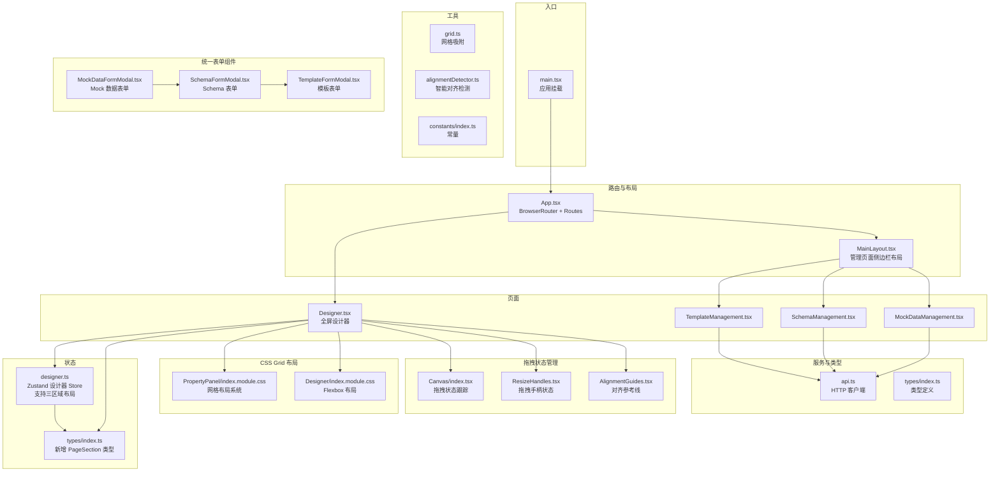

**图表来源**
- [main.tsx:1-8](file://designer/src/main.tsx#L1-L8)
- [App.tsx:1-31](file://designer/src/App.tsx#L1-L31)
- [MainLayout.tsx:1-56](file://designer/src/layouts/MainLayout.tsx#L1-L56)
- [Designer.tsx:1-279](file://designer/src/pages/Designer/index.tsx#L1-L279)
- [designer.ts:110-111](file://designer/src/store/designer.ts#L110-L111)
- [types/index.ts:139-140](file://designer/src/types/index.ts#L139-L140)
- [Canvas/index.tsx:57-76](file://designer/src/pages/Designer/components/Canvas/index.tsx#L57-L76)
- [ResizeHandles.tsx:24-32](file://designer/src/pages/Designer/components/Canvas/ResizeHandles.tsx#L24-L32)
- [AlignmentGuides.tsx:9-13](file://designer/src/pages/Designer/components/Canvas/AlignmentGuides.tsx#L9-L13)

**章节来源**
- [main.tsx:1-8](file://designer/src/main.tsx#L1-L8)
- [App.tsx:1-31](file://designer/src/App.tsx#L1-L31)
- [package.json:1-43](file://designer/package.json#L1-L43)

## 核心组件
- 路由与入口
  - 应用通过入口文件挂载根组件，根组件包裹在 BrowserRouter 中，定义全屏设计器路由与管理页面路由组。
- 主布局组件 MainLayout
  - 提供左侧菜单导航，结合 Outlet 实现管理页面的嵌套路由渲染。
- 设计器页面 Designer
  - 全屏布局，包含左侧面板（素材库）、中心画布、右侧面板（组件树/属性），并提供调试抽屉。
- **三区域布局系统**
  - **页头区域（headerComponents）**：支持动态高度调整，可拖拽组件进入
  - **内容区域（components）**：主设计区域，支持所有组件操作
  - **页脚区域（footerComponents）**：支持动态高度调整，可拖拽组件进入
  - **区域移动操作**：支持组件在三大区域间的移动与跨区域对齐
- **增强的拖拽状态管理**
  - **拖拽状态跟踪**：实时跟踪拖拽开始位置、布局状态、鼠标位置
  - **跨区域拖拽判断**：在拖拽过程中判断组件是否跨区域移动
  - **拖拽手柄状态管理**：支持8个方向的尺寸调整手柄状态跟踪
  - **拖拽引用缓存**：使用useRef缓存状态值，避免频繁重绑事件监听器
- 统一表单模态框组件
  - MockDataFormModal：支持手动编辑和智能生成的 Mock 数据表单
  - SchemaFormModal：支持手动编辑和从 Mock 数据智能生成的 Schema 表单
  - TemplateFormModal：简洁的模板信息表单
- CSS Grid 布局系统
  - PropertyPanel 采用 CSS Grid 实现响应式表单布局，支持两列自适应排列
  - Designer 采用 Flexbox + CSS Grid 混合布局，提升组件间的协调性
- PrintPreview 组件（新增）
  - 支持单模板模式和多模板模式，提供模板组管理、批量数据预览、页码导航等功能。
- Zustand 设计器 Store
  - **扩展支持三区域布局状态管理**：统一管理组件集合、选中状态、模板信息、页面配置、撤销/重做、复制/粘贴、网格与对齐、层级管理等
  - **区域感知的操作**：对齐、分布、层级管理均支持跨区域操作
  - **区域移动功能**：支持组件在三大区域间的移动与跨区域对齐
- API 客户端
  - 封装模板、Schema、Mock 数据的 CRUD 接口，统一基地址与请求头。

**章节来源**
- [App.tsx:1-31](file://designer/src/App.tsx#L1-L31)
- [MainLayout.tsx:1-56](file://designer/src/layouts/MainLayout.tsx#L1-L56)
- [Designer.tsx:1-279](file://designer/src/pages/Designer/index.tsx#L1-L279)
- [designer.ts:110-111](file://designer/src/store/designer.ts#L110-L111)
- [types/index.ts:139-140](file://designer/src/types/index.ts#L139-L140)
- [Canvas/index.tsx:57-76](file://designer/src/pages/Designer/components/Canvas/index.tsx#L57-L76)
- [ResizeHandles.tsx:24-32](file://designer/src/pages/Designer/components/Canvas/ResizeHandles.tsx#L24-L32)
- [MockDataFormModal.tsx:1-129](file://designer/src/pages/MockDataManagement/components/MockDataFormModal.tsx#L1-L129)
- [SchemaFormModal.tsx:1-154](file://designer/src/pages/SchemaManagement/components/SchemaFormModal.tsx#L1-L154)
- [TemplateFormModal.tsx:1-61](file://designer/src/pages/TemplateManagement/components/TemplateFormModal.tsx#L1-L61)
- [PropertyPanel/index.module.css:24-30](file://designer/src/pages/Designer/components/PropertyPanel/index.module.css#L24-L30)
- [Designer/index.module.css:1-23](file://designer/src/pages/Designer/index.module.css#L1-L23)
- [PrintPreview/index.tsx:1-567](file://designer/src/components/PrintPreview/index.tsx#L1-L567)
- [designer.ts:1-773](file://designer/src/store/designer.ts#L1-L773)
- [api.ts:1-115](file://designer/src/services/api.ts#L1-L115)

## 架构总览
整体采用"路由驱动 + 状态集中 + 统一表单 + 三区域布局"的架构模式：
- 路由层：BrowserRouter 管理路径与布局切换；全屏设计器与管理页面共享不同的布局容器。
- 布局层：MainLayout 提供管理页面的侧边栏与内容区；Designer 页面自定义全屏三栏布局。
- 状态层：**Zustand Store 聚合设计器核心状态，支持三区域布局的完整状态管理**，提供高内聚、低耦合的状态操作接口。
- 服务层：API 客户端封装 HTTP 请求，统一错误处理与数据格式。
- 工具层：网格吸附、智能对齐、常量等工具函数支撑画布交互体验。
- 统一表单层：MockDataFormModal、SchemaFormModal、TemplateFormModal 提供一致的表单体验。
- CSS Grid 布局层：PropertyPanel 采用网格系统，提升表单布局的一致性和响应性。
- **拖拽状态管理层**：Canvas 组件提供完整的拖拽状态跟踪与跨区域操作支持。

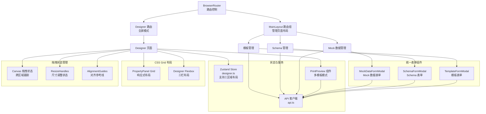

**图表来源**
- [App.tsx:1-31](file://designer/src/App.tsx#L1-L31)
- [MainLayout.tsx:1-56](file://designer/src/layouts/MainLayout.tsx#L1-L56)
- [designer.ts:110-111](file://designer/src/store/designer.ts#L110-L111)
- [Canvas/index.tsx:57-76](file://designer/src/pages/Designer/components/Canvas/index.tsx#L57-L76)
- [ResizeHandles.tsx:24-32](file://designer/src/pages/Designer/components/Canvas/ResizeHandles.tsx#L24-L32)
- [AlignmentGuides.tsx:9-13](file://designer/src/pages/Designer/components/Canvas/AlignmentGuides.tsx#L9-L13)
- [api.ts:1-115](file://designer/src/services/api.ts#L1-L115)
- [PrintPreview/index.tsx:1-567](file://designer/src/components/PrintPreview/index.tsx#L1-L567)
- [MockDataFormModal.tsx:1-129](file://designer/src/pages/MockDataManagement/components/MockDataFormModal.tsx#L1-L129)
- [SchemaFormModal.tsx:1-154](file://designer/src/pages/SchemaManagement/components/SchemaFormModal.tsx#L1-L154)
- [TemplateFormModal.tsx:1-61](file://designer/src/pages/TemplateManagement/components/TemplateFormModal.tsx#L1-L61)
- [PropertyPanel/index.module.css:24-30](file://designer/src/pages/Designer/components/PropertyPanel/index.module.css#L24-L30)
- [Designer/index.module.css:1-23](file://designer/src/pages/Designer/index.module.css#L1-L23)

## 详细组件分析

### 路由系统与布局模式
- 全屏设计器模式
  - 路由路径 "/designer"，直接渲染 Designer 页面，无侧边栏，适合专注设计。
- 管理页面布局模式
  - 通过 MainLayout 包裹一组子路由，提供侧边菜单导航至模板、Schema、Mock 数据管理页面。
  - 通过 useNavigate/useLocation 控制菜单选中态与跳转。

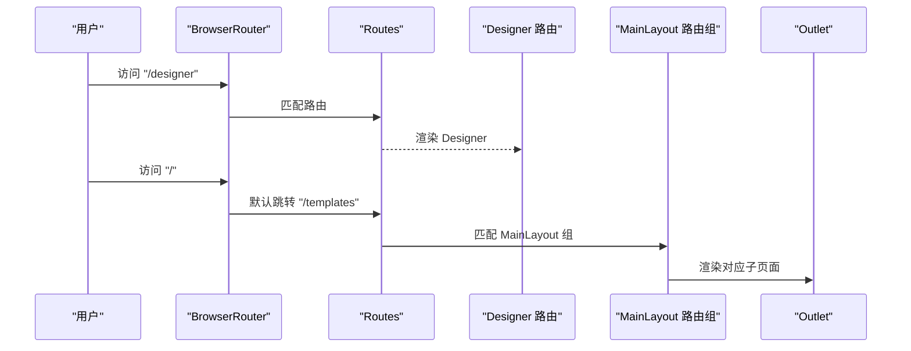

**图表来源**
- [App.tsx:1-31](file://designer/src/App.tsx#L1-L31)
- [MainLayout.tsx:1-56](file://designer/src/layouts/MainLayout.tsx#L1-L56)

**章节来源**
- [App.tsx:1-31](file://designer/src/App.tsx#L1-L31)
- [MainLayout.tsx:1-56](file://designer/src/layouts/MainLayout.tsx#L1-L56)

### MainLayout 布局组件
- 职责
  - 提供固定宽度侧边栏与内容区，菜单项与路径一一对应，支持点击导航与选中态同步。
- 实现要点
  - 使用 Ant Design Layout/Sider/Content 组织结构。
  - 使用 useNavigate/useLocation 动态设置选中项与跳转。
  - 通过 Outlet 渲染子路由内容。


**图表来源**
- [MainLayout.tsx:1-56](file://designer/src/layouts/MainLayout.tsx#L1-L56)

**章节来源**
- [MainLayout.tsx:1-56](file://designer/src/layouts/MainLayout.tsx#L1-L56)

### 三区域布局系统
- **页头区域（headerComponents）**
  - 独立的状态管理，支持动态高度调整（15mm最小高度）
  - 可拖拽组件进入，支持组件预览与操作
  - 与内容区域共享相同的组件操作能力
- **内容区域（components）**
  - 主设计区域，支持所有组件操作
  - 与页头/页脚区域协同工作，共同构成完整页面布局
- **页脚区域（footerComponents）**
  - 独立的状态管理，支持动态高度调整（15mm最小高度）
  - 可拖拽组件进入，支持组件预览与操作
  - 与内容区域共享相同的组件操作能力
- **区域移动操作**
  - 支持组件在三大区域间的移动
  - 跨区域移动时自动调整组件位置到目标区域顶部
  - 表格组件不允许放入页头/页脚区域
- **区域感知的组件操作**
  - 对齐操作：垂直对齐（top/bottom/centerV）不允许跨区域操作
  - 分布操作：垂直分布不允许跨区域操作
  - 层级管理：支持跨区域的置顶、置底、上移、下移操作

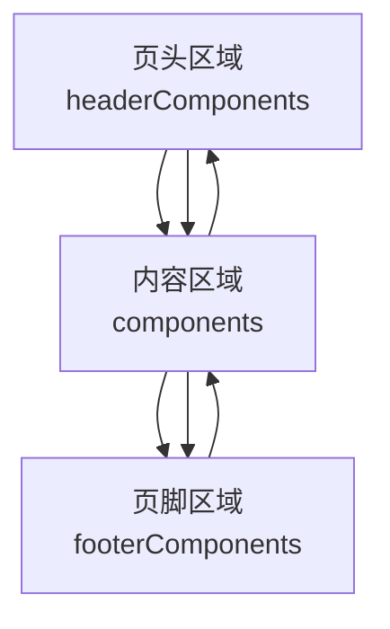

**图表来源**
- [designer.ts:110-111](file://designer/src/store/designer.ts#L110-L111)
- [types/index.ts:139-140](file://designer/src/types/index.ts#L139-L140)
- [Canvas/index.tsx:1176-1200](file://designer/src/pages/Designer/components/Canvas/index.tsx#L1176-L1200)

**章节来源**
- [designer.ts:110-111](file://designer/src/store/designer.ts#L110-L111)
- [types/index.ts:139-140](file://designer/src/types/index.ts#L139-L140)
- [Canvas/index.tsx:1176-1200](file://designer/src/pages/Designer/components/Canvas/index.tsx#L1176-L1200)

### 增强的拖拽状态管理
- **拖拽状态跟踪**
  - `draggingComponentId`：实时跟踪当前拖拽的组件ID
  - `dragStartPos`：拖拽开始时的鼠标位置
  - `dragStartLayout`：拖拽开始时的组件布局状态
  - `dragStartLayouts`：多选拖拽时各组件的初始布局映射
  - `lastMousePosRef`：拖拽过程中的最后鼠标位置，用于跨区域判断
- **跨区域拖拽判断**
  - 在拖拽过程中实时跟踪鼠标位置
  - 通过 `lastMousePosRef` 判断组件是否跨区域移动
  - 支持拖拽到不同区域时的视觉反馈
- **拖拽手柄状态管理**
  - `ResizeHandles` 组件提供8个方向的尺寸调整手柄
  - 实时跟踪拖拽方向、起始位置、起始布局状态
  - 支持最小尺寸限制（5mm）和网格吸附
- **拖拽引用缓存**
  - 使用 `useRef` 缓存状态值，避免频繁重绑事件监听器
  - 缓存 `headerComponents`、`components`、`footerComponents` 等状态
  - 缓存 `pageConfig`、`zoomLevel`、`selectedComponentIds` 等关键状态

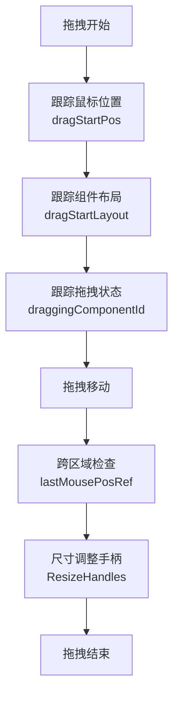

**图表来源**
- [Canvas/index.tsx:57-76](file://designer/src/pages/Designer/components/Canvas/index.tsx#L57-L76)
- [Canvas/index.tsx:78-98](file://designer/src/pages/Designer/components/Canvas/index.tsx#L78-L98)
- [ResizeHandles.tsx:24-32](file://designer/src/pages/Designer/components/Canvas/ResizeHandles.tsx#L24-L32)

**章节来源**
- [Canvas/index.tsx:57-76](file://designer/src/pages/Designer/components/Canvas/index.tsx#L57-L76)
- [Canvas/index.tsx:78-98](file://designer/src/pages/Designer/components/Canvas/index.tsx#L78-L98)
- [ResizeHandles.tsx:24-32](file://designer/src/pages/Designer/components/Canvas/ResizeHandles.tsx#L24-L32)

### 统一表单模态框架构
- MockDataFormModal 组件
  - 采用左右分栏布局：左侧基本信息表单，右侧 JSON 编辑器
  - 支持手动编辑和智能生成两种模式，通过 Tabs 切换
  - 集成 Monaco Editor 提供语法高亮的 JSON 编辑体验
  - 支持从关联 Schema 智能生成 Mock 数据
- SchemaFormModal 组件
  - 提供 Schema 基本信息和版本管理
  - 支持从 Mock 数据自动推断 Schema 结构
  - 两个 Monaco Editor 分别用于 Schema 定义和示例数据输入
- TemplateFormModal 组件
  - 简洁的模板信息表单，包含名称、关联 Schema、描述等基础字段
  - 采用垂直布局，适合快速创建模板

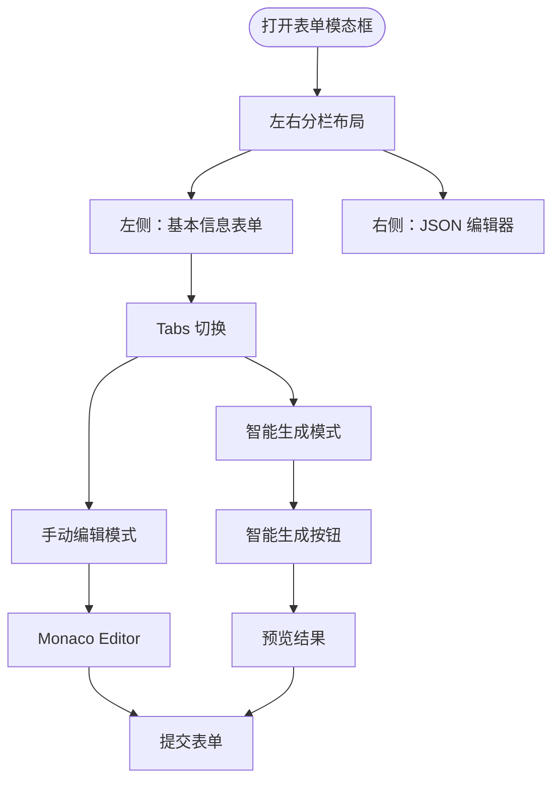

**图表来源**
- [MockDataFormModal.tsx:41-124](file://designer/src/pages/MockDataManagement/components/MockDataFormModal.tsx#L41-L124)
- [SchemaFormModal.tsx:43-149](file://designer/src/pages/SchemaManagement/components/SchemaFormModal.tsx#L43-L149)
- [TemplateFormModal.tsx:31-55](file://designer/src/pages/TemplateManagement/components/TemplateFormModal.tsx#L31-L55)

**章节来源**
- [MockDataFormModal.tsx:1-129](file://designer/src/pages/MockDataManagement/components/MockDataFormModal.tsx#L1-L129)
- [SchemaFormModal.tsx:1-154](file://designer/src/pages/SchemaManagement/components/SchemaFormModal.tsx#L1-L154)
- [TemplateFormModal.tsx:1-61](file://designer/src/pages/TemplateManagement/components/TemplateFormModal.tsx#L1-L61)

### CSS Grid 布局系统
- PropertyPanel 网格布局
  - 采用 `display: grid` 和 `grid-template-columns: 1fr 1fr` 实现两列自适应布局
  - 通过 `gap: 12px 16px` 控制行列间距，提供良好的视觉层次
  - 使用 `align-items: start` 确保不同高度的表单项顶部对齐
  - 支持 `grid-column: span 2` 实现跨列布局，适用于完整宽度的表单项
- Designer 三栏布局
  - 左侧面板：`display: flex; flex-direction: column`
  - 中心画布：`flex: 1; overflow: hidden`
  - 右侧面板：`display: flex; flex-direction: column`
  - 通过 `border-right` 和 `border-left` 实现视觉分隔

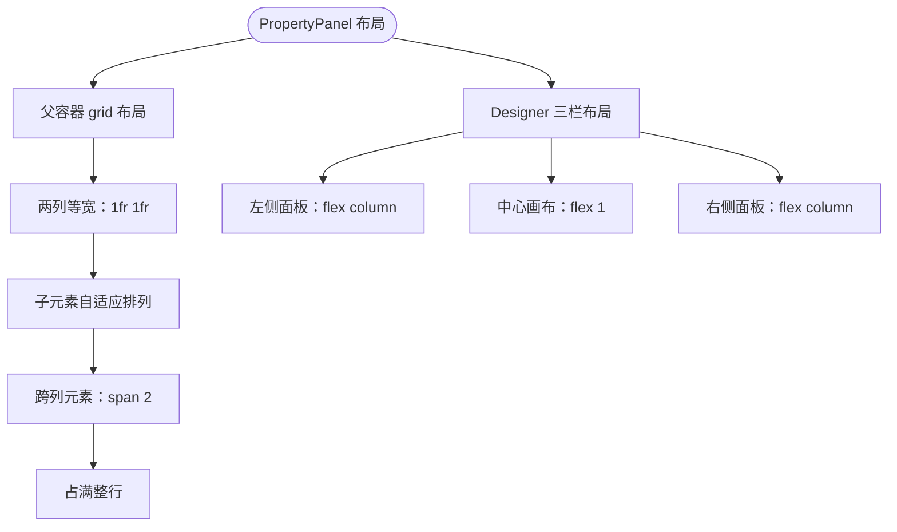

**图表来源**
- [PropertyPanel/index.module.css:24-30](file://designer/src/pages/Designer/components/PropertyPanel/index.module.css#L24-L30)
- [Designer/index.module.css:6-22](file://designer/src/pages/Designer/index.module.css#L6-L22)

**章节来源**
- [PropertyPanel/index.module.css:1-60](file://designer/src/pages/Designer/components/PropertyPanel/index.module.css#L1-L60)
- [Designer/index.module.css:1-23](file://designer/src/pages/Designer/index.module.css#L1-L23)

### PrintPreview 组件（新增）
- 多模板模式支持
  - 新增 templateMode 状态，支持 'single' 和 'multi' 两种模式。
  - 模板组管理：通过 TemplateGroup 接口管理多个模板组，每个组包含模板来源、标签和数据ID。
  - 模板缓存：使用 templateCacheRef 缓存已加载的模板，避免重复请求。
- 核心功能
  - 单模板模式：保持原有逻辑，支持批量数据预览。
  - 多模板模式：支持添加多个模板组，每个组可选择不同模板和数据源。
  - 批量预览：将多个模板组的预览结果合并为一个 HTML 文档。
  - 页码导航：支持上一页/下一页导航，显示总页数。
- 状态管理
  - templateGroups：模板组列表状态。
  - templateCacheRef：模板缓存引用。
  - templateMode：当前模板模式。
  - batchCount：批量文档数量。

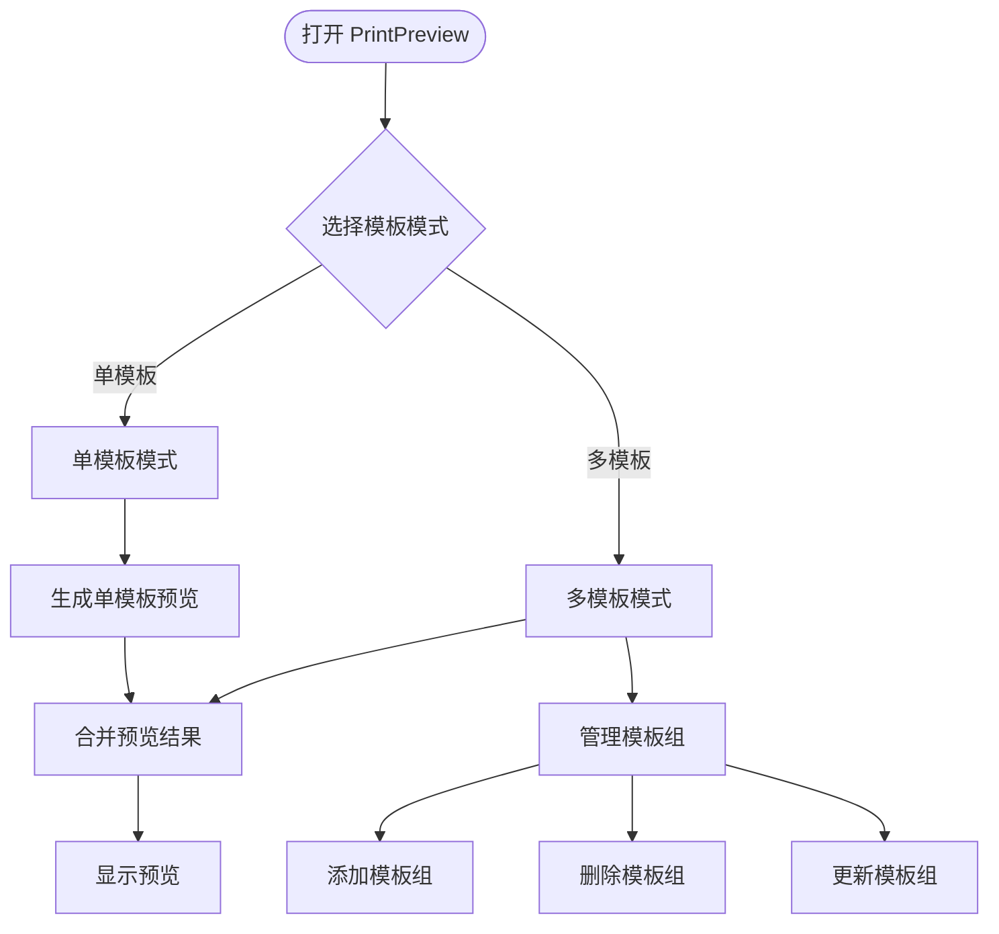

**图表来源**
- [PrintPreview/index.tsx:37-84](file://designer/src/components/PrintPreview/index.tsx#L37-L84)
- [PrintPreview/index.tsx:137-153](file://designer/src/components/PrintPreview/index.tsx#L137-L153)
- [PrintPreview/index.tsx:238-304](file://designer/src/components/PrintPreview/index.tsx#L238-L304)

**章节来源**
- [PrintPreview/index.tsx:1-567](file://designer/src/components/PrintPreview/index.tsx#L1-L567)

### Zustand 状态管理设计
- 设计理念
  - **三区域布局支持**：将设计器状态集中在一个 Store 中，扩展支持页头、内容、页脚三大区域的状态管理
  - **区域感知操作**：暴露原子化的动作（add/update/remove/select/copy/paste/undo/redo 等），支持跨区域的对齐、分布、层级管理
  - 通过"历史快照 + 索引"的机制实现撤销/重做，限制最大步数避免内存膨胀。
- 状态持久化
  - Store 本身不内置持久化逻辑；可通过中间件或外部存储（如 localStorage）扩展持久化能力（建议在应用层接入）。
- 组件间通信
  - 所有 UI 组件通过 useDesignerStore 订阅状态与触发动作，无需层层 props 传递。
- 性能优化策略
  - 使用 create 的选择器式订阅，避免不必要的重渲染。
  - 对历史记录进行截断与浅拷贝，控制内存占用。
  - 在复杂计算（如对齐、分布）中，尽量减少对象深拷贝次数，复用已有数据结构。
  - **拖拽状态优化**：使用 useRef 缓存状态值，避免频繁重绑事件监听器

```mermaid
classDiagram
class DesignerStore {
+components : ComponentNode[]
+headerComponents : ComponentNode[]
+footerComponents : ComponentNode[]
+selectedComponentId : string|null
+selectedComponentIds : string[]
+clipboard : ComponentNode[]
+history : {headerComponents : ComponentNode[]; components : ComponentNode[]; footerComponents : ComponentNode[]}[]
+historyIndex : number
+addComponent(component, section)
+updateComponent(id, updates)
+removeComponent(id)
+selectComponent(id)
+toggleSelectComponent(id)
+clearSelection()
+selectMultiple(ids)
+copyComponents(ids)
+pasteComponents(section)
+duplicateComponent(id)
+moveComponentToSection(id, targetSection, newYm)
+undo()
+redo()
+canUndo() : boolean
+canRedo() : boolean
+alignComponents(direction)
+distributeComponents(direction)
+bringToFront(id)
+sendToBack(id)
+bringForward(id)
+sendBackward(id)
}
class ComponentNode {
+id : string
+type : ComponentType
+layout : Layout
+style : Record
+binding : DataBinding
+props : Record
+children : ComponentNode[]
}
DesignerStore --> ComponentNode : "管理三大区域组件"
```

**图表来源**
- [designer.ts:9-90](file://designer/src/store/designer.ts#L9-L90)
- [types/index.ts:246-274](file://designer/src/types/index.ts#L246-L274)

**章节来源**
- [designer.ts:1-773](file://designer/src/store/designer.ts#L1-L773)
- [types/index.ts:1-378](file://designer/src/types/index.ts#L1-L378)

### 画布交互与工具链
- 画布 Canvas
  - 支持拖拽添加组件、多选拖拽、键盘快捷键（删除、复制、粘贴、撤销、重做、克隆）、右键菜单、层级操作、页面设置、打印预览等。
  - 通过网格吸附与智能对齐提升布局精度与效率。
  - 集成 PrintPreview 组件，支持快速打印功能。
  - **三区域布局支持**：页头、内容、页脚三大区域的完整交互体验
  - **增强的拖拽功能**：实时拖拽状态跟踪、跨区域拖拽判断、拖拽手柄状态管理
- 网格吸附
  - 通过工具函数将坐标吸附到网格，支持按住 Shift 临时禁用吸附。
- 智能对齐
  - 基于对齐检测算法，计算对齐线与吸附建议，优先于网格吸附生效。
- 常量
  - 提供连续纸默认宽高、mm 到 px 的换算系数等。

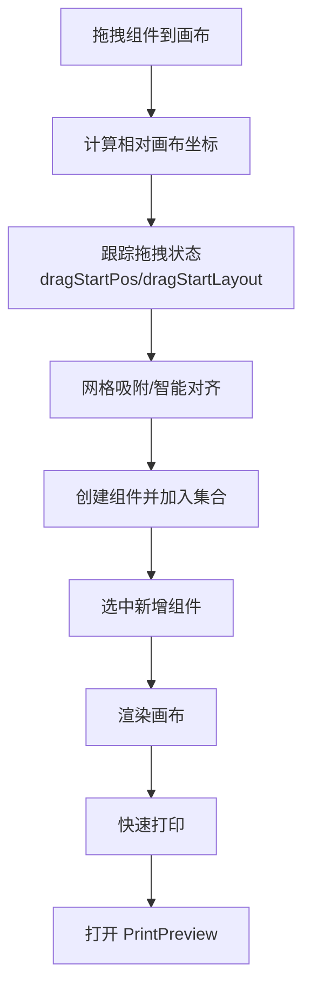

**图表来源**
- [Canvas/index.tsx:195-378](file://designer/src/pages/Designer/components/Canvas/index.tsx#L195-L378)
- [Canvas/index.tsx:708-716](file://designer/src/pages/Designer/components/Canvas/index.tsx#L708-L716)
- [Canvas/index.tsx:57-76](file://designer/src/pages/Designer/components/Canvas/index.tsx#L57-L76)
- [grid.ts:12-15](file://designer/src/utils/grid.ts#L12-L15)
- [alignmentDetector.ts:24-157](file://designer/src/pages/Designer/components/Canvas/alignmentDetector.ts#L24-L157)
- [constants/index.ts:7-19](file://designer/src/constants/index.ts#L7-L19)

**章节来源**
- [Canvas/index.tsx:1-1362](file://designer/src/pages/Designer/components/Canvas/index.tsx#L1-L1362)
- [grid.ts:1-36](file://designer/src/utils/grid.ts#L1-L36)
- [alignmentDetector.ts:1-158](file://designer/src/pages/Designer/components/Canvas/alignmentDetector.ts#L1-L158)
- [constants/index.ts:1-20](file://designer/src/constants/index.ts#L1-L20)

### 属性面板与样式插件
- 属性面板
  - 根据选中组件类型，分别渲染布局、数据绑定、样式与表格列等区域。
  - 通过回调更新组件的 layout/style/props/binding 字段。
  - 采用 CSS Grid 布局，提供响应式的两列表单排列。
- 样式插件
  - 采用插件注册表，按组件类型选择对应样式编辑器，支持扩展新组件的样式配置。

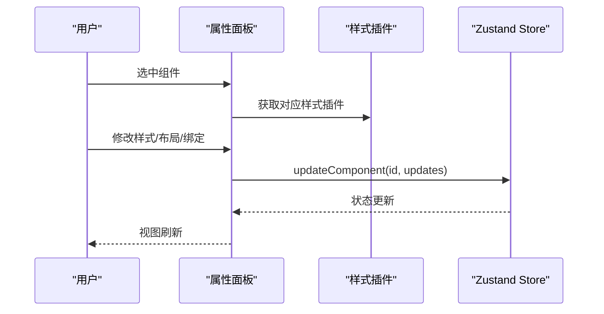

**图表来源**
- [PropertyPanel/index.tsx:16-126](file://designer/src/pages/Designer/components/PropertyPanel/index.tsx#L16-L126)
- [designer.ts:93-99](file://designer/src/store/designer.ts#L93-L99)

**章节来源**
- [PropertyPanel/index.tsx:1-129](file://designer/src/pages/Designer/components/PropertyPanel/index.tsx#L1-L129)
- [designer.ts:1-773](file://designer/src/store/designer.ts#L1-L773)

### 设计器页面与调试抽屉
- 全屏三栏布局：左侧面板（素材库）、中心画布、右侧面板（组件树/属性）
- 折叠按钮与抽屉交互，支持复制模板 JSON、查看调试信息
- 通过 API 加载模板并回填 Store
- 集成 PrintPreview 组件，支持多模板模式下的批量预览
- 采用 Flexbox + CSS Grid 混合布局，提升组件协调性
- **三区域布局支持**：完整的页头、内容、页脚区域交互体验

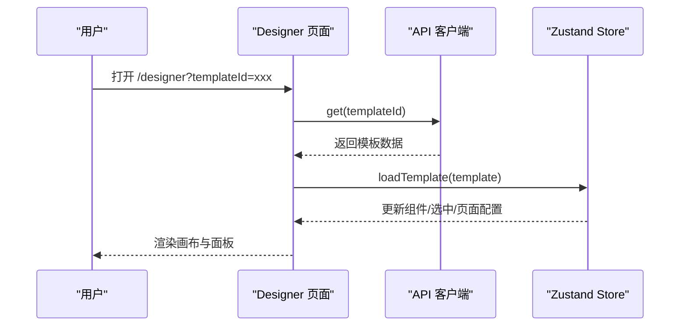

**图表来源**
- [Designer.tsx:26-46](file://designer/src/pages/Designer/index.tsx#L26-L46)
- [api.ts:62-65](file://designer/src/services/api.ts#L62-L65)
- [designer.ts:203-250](file://designer/src/store/designer.ts#L203-L250)

**章节来源**
- [Designer.tsx:1-279](file://designer/src/pages/Designer/index.tsx#L1-L279)
- [api.ts:1-115](file://designer/src/services/api.ts#L1-L115)
- [designer.ts:1-773](file://designer/src/store/designer.ts#L1-L773)

## 依赖分析
- 运行时依赖
  - React 18、react-router-dom、antd、axios、zustand 等
- 构建与开发
  - Vite + React 插件，TypeScript 编译，ESLint 规范
- 本地 SDK 映射
  - 通过 Vite 别名将 @jcyao/print-sdk 指向本地 SDK 源码，便于联调

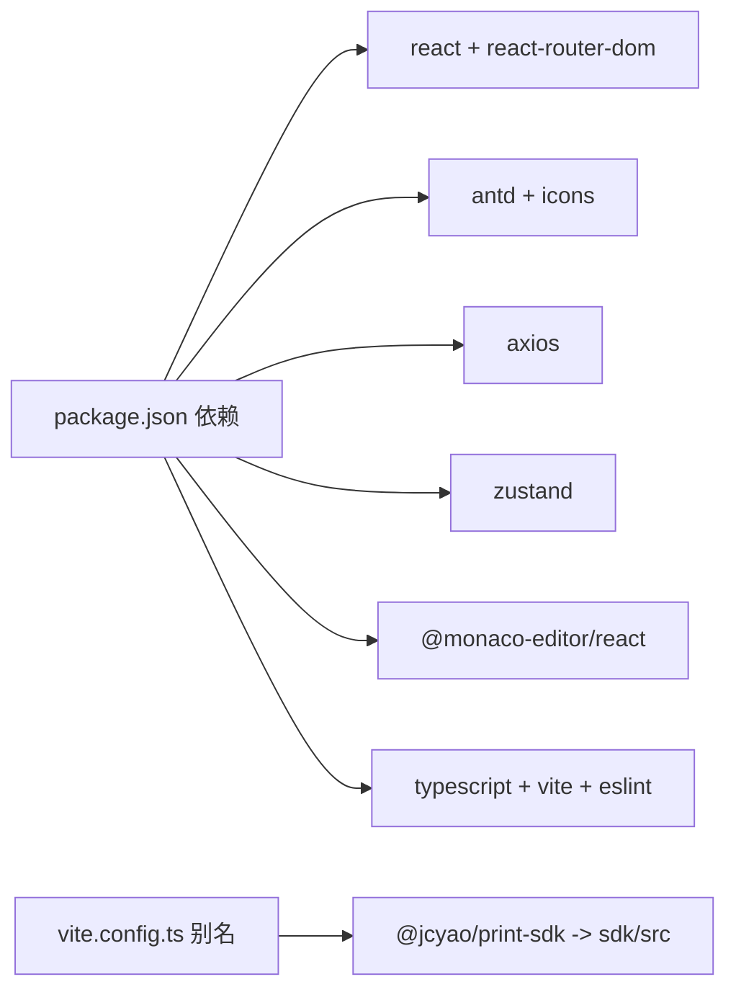

**图表来源**
- [package.json:12-27](file://designer/package.json#L12-L27)
- [vite.config.ts:8-14](file://designer/vite.config.ts#L8-L14)

**章节来源**
- [package.json:1-43](file://designer/package.json#L1-L43)
- [vite.config.ts:1-15](file://designer/vite.config.ts#L1-L15)
- [tsconfig.json:1-26](file://designer/tsconfig.json#L1-L26)

## 性能考虑
- 状态粒度与订阅
  - 使用选择器式订阅，避免整 Store 重渲染
  - 将高频更新拆分为独立动作，减少无关状态联动
- 历史记录优化
  - 固定最大步数，及时截断历史数组，避免内存泄漏
- 渲染优化
  - 对齐/分布等批量操作合并为一次 set，减少多次 re-render
  - **拖拽状态优化**：使用 useRef 缓存状态值，避免频繁重绑事件监听器
- 画布交互
  - 鼠标事件监听在拖拽阶段开启，结束后及时解绑
  - 对齐线绘制与吸附建议仅在单选拖拽时计算，多选时清空参考线
  - **跨区域拖拽优化**：通过 lastMousePosRef 实时跟踪，避免不必要的状态更新
- PrintPreview 组件优化
  - 模板缓存机制避免重复加载相同模板
  - 批量预览时使用模板缓存和模板组管理提升性能
  - 合并 HTML 时进行全局编号重排，确保页码连续性
- CSS Grid 优化
  - PropertyPanel 采用 CSS Grid 减少 JavaScript 计算开销
  - 网格布局自动适配不同屏幕尺寸，提升响应式表现
- 表单组件优化
  - 统一的表单模态框减少重复代码和状态管理复杂度
  - Monaco Editor 按需加载，避免影响初始渲染性能
- **三区域布局优化**
  - 区域状态分离管理，避免不必要的状态同步
  - 区域移动操作时的坐标变换优化
  - 区域高度调整的性能优化

## 故障排查指南
- 路由跳转异常
  - 检查 App 路由配置与默认跳转规则
  - 确认 MainLayout 的菜单项 key 与路由路径一致
- 状态不更新
  - 确认使用的是 useDesignerStore 的动作方法而非直接 set
  - 检查动作是否正确传入 id 或 updates
  - **检查三区域状态更新**：确认组件是否正确添加到对应的区域状态中
- 画布越界或组件不可见
  - 检查页面尺寸与方向配置，确认连续纸/自定义尺寸参数
  - 核对网格吸附与智能对齐是否导致位置被约束
  - **检查三区域高度**：确认页头/页脚高度设置是否合理
- 模板加载失败
  - 查看 API 客户端请求日志与错误消息
  - 确认后端接口与跨域配置
- PrintPreview 多模板模式问题
  - 检查模板组配置是否正确，确保每个组都有有效的模板和数据
  - 确认模板缓存机制正常工作，避免重复加载
  - 验证批量预览合并逻辑，确保页码编号正确
- 表单组件问题
  - 检查统一表单组件的 props 传递是否正确
  - 确认 Monaco Editor 的加载状态和配置选项
  - 验证 Tabs 切换逻辑和内容渲染
- CSS Grid 布局问题
  - 检查 PropertyPanel 的网格布局是否正确应用
  - 确认跨列元素的 `grid-column` 设置
  - 验证 Designer 三栏布局的 Flexbox 属性
- **拖拽状态问题**
  - 检查拖拽状态跟踪是否正常，确认 dragStartPos/dragStartLayout 等状态更新
  - 确认跨区域拖拽判断逻辑，检查 lastMousePosRef 的使用
  - 验证拖拽手柄状态管理，确认 ResizeHandles 的状态同步
- **三区域布局问题**
  - 检查区域移动操作是否正常，确认 moveComponentToSection 的实现
  - 确认区域对齐/分布操作的跨区域限制逻辑
  - 验证区域高度调整功能，检查 headerHeight/footerHeight 的更新
- **区域感知操作问题**
  - 检查垂直对齐/分布的跨区域限制是否正确
  - 确认层级操作在三大区域间的正确性
  - 验证表格组件的区域限制逻辑

**章节来源**
- [App.tsx:1-31](file://designer/src/App.tsx#L1-L31)
- [MainLayout.tsx:1-56](file://designer/src/layouts/MainLayout.tsx#L1-L56)
- [designer.ts:1-773](file://designer/src/store/designer.ts#L1-L773)
- [api.ts:1-115](file://designer/src/services/api.ts#L1-L115)
- [PrintPreview/index.tsx:1-567](file://designer/src/components/PrintPreview/index.tsx#L1-L567)
- [MockDataFormModal.tsx:1-129](file://designer/src/pages/MockDataManagement/components/MockDataFormModal.tsx#L1-L129)
- [SchemaFormModal.tsx:1-154](file://designer/src/pages/SchemaManagement/components/SchemaFormModal.tsx#L1-L154)
- [TemplateFormModal.tsx:1-61](file://designer/src/pages/TemplateManagement/components/TemplateFormModal.tsx#L1-L61)
- [PropertyPanel/index.module.css:1-60](file://designer/src/pages/Designer/components/PropertyPanel/index.module.css#L1-L60)
- [Designer/index.module.css:1-23](file://designer/src/pages/Designer/index.module.css#L1-L23)
- [Canvas/index.tsx:1-1362](file://designer/src/pages/Designer/components/Canvas/index.tsx#L1-L1362)

## 结论
本项目以 React 18 + TypeScript 为基础，结合 React Router 的路由体系与 Ant Design 的布局组件，构建了清晰的"全屏设计器 + 管理页面"双模式架构。Zustand Store 将设计器状态集中化，配合网格吸附与智能对齐工具，提供了良好的交互体验。

**本次重大更新显著增强了三区域布局支持**：
- **完整的三区域状态管理**：页头、内容、页脚三大区域的独立状态管理与协同工作
- **区域感知的组件操作**：对齐、分布、层级管理均支持跨区域操作，提供更灵活的设计体验
- **增强的拖拽状态管理**：实时拖拽状态跟踪、跨区域拖拽判断、拖拽手柄状态管理
- **区域移动功能**：支持组件在三大区域间的移动与跨区域对齐，表格组件的区域限制逻辑

**新增的统一表单组件和 CSS Grid 布局系统**显著提升了开发效率和用户体验：
- MockDataFormModal、SchemaFormModal、TemplateFormModal 三个表单组件提供了统一的表单体验和一致的交互模式
- CSS Grid 布局系统在 PropertyPanel 中实现了响应式的两列表单排列，提升了表单的可读性和易用性
- Flexbox + CSS Grid 混合布局方案优化了 Designer 页面的三栏布局协调性
- Monaco Editor 的集成提供了专业的 JSON 编辑体验，支持智能生成和语法高亮

**新增的多模板模式**显著增强了批量预览能力：
- 通过 PrintPreview 组件的模板组管理，支持同时预览多个不同模板和数据组合
- 模板缓存机制提升了性能，避免重复加载
- 批量预览合并功能确保输出文档的完整性
- 页码导航功能改善了用户体验

通过模块化与插件化设计，系统具备良好的可扩展性与可维护性。建议后续在应用层引入状态持久化与更完善的错误边界与日志体系，进一步提升稳定性与可观测性。

## 附录
- 最佳实践
  - 将 Store 动作按领域拆分，保持单一职责
  - 使用 TypeScript 严格类型约束，减少运行期错误
  - 对外暴露稳定的 API 与类型定义，便于 SDK 与服务端协作
  - 在 Vite 中合理配置别名与路径解析，提升开发体验
  - 多模板模式下合理使用模板缓存，避免重复加载
  - 批量预览时注意内存使用，及时清理不需要的模板缓存
  - 统一表单组件的设计模式应保持一致的 props 接口和行为规范
  - CSS Grid 布局应遵循语义化命名和可维护性的原则
  - Monaco Editor 的配置应考虑性能和用户体验的平衡
  - **三区域布局开发注意事项**：
    - 区域状态分离管理，避免状态污染
    - 跨区域操作时注意坐标变换和约束条件
    - 表格组件的区域限制逻辑要特别处理
    - 区域高度调整时要考虑内容区域的最小高度要求
  - **拖拽状态管理最佳实践**：
    - 使用 useRef 缓存关键状态值，避免频繁重绑事件监听器
    - 实时跟踪拖拽状态，提供准确的视觉反馈
    - 跨区域拖拽时要处理好状态同步和坐标变换
    - 拖拽手柄的状态管理要精确到像素级别