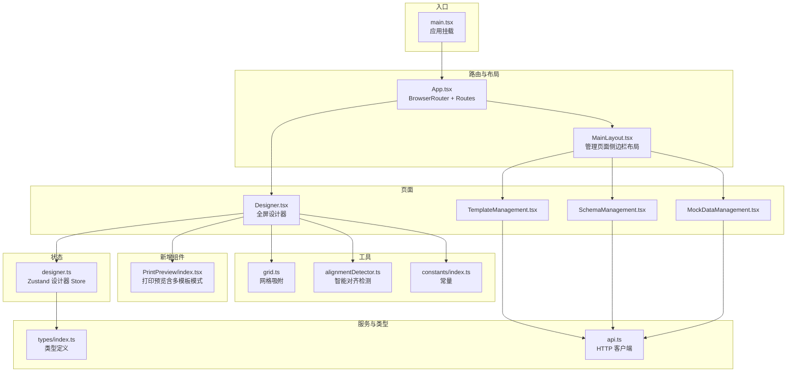
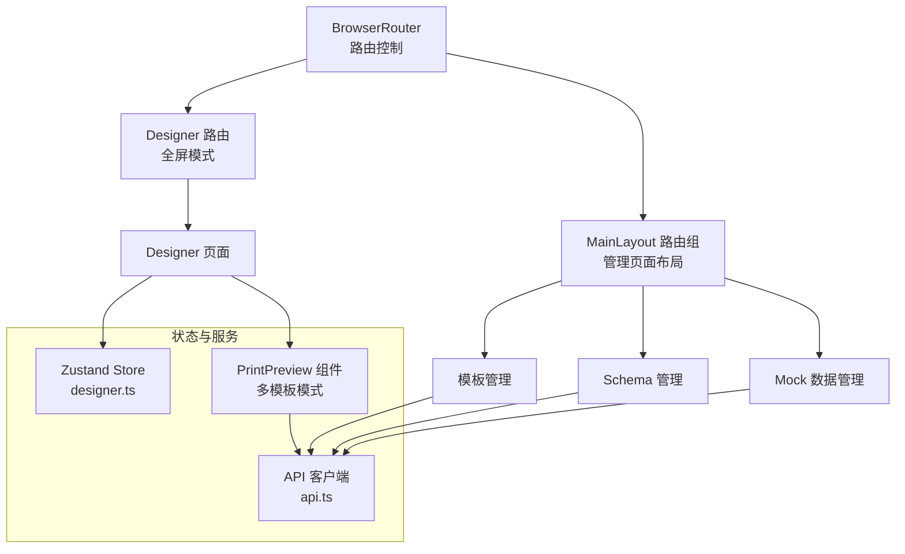
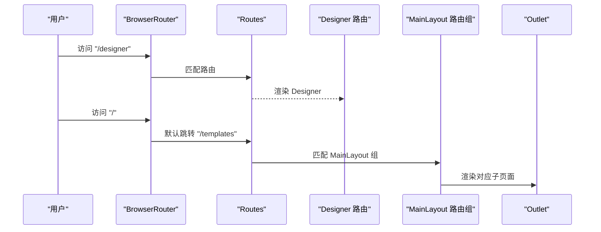
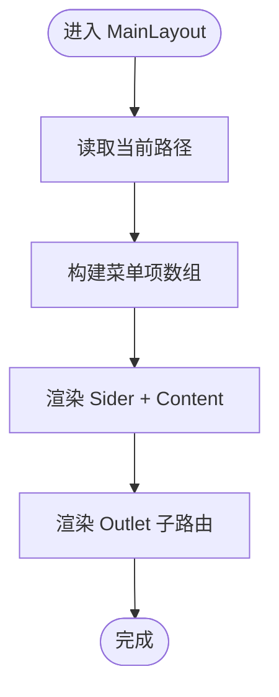
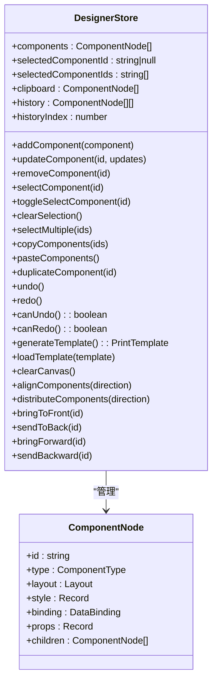
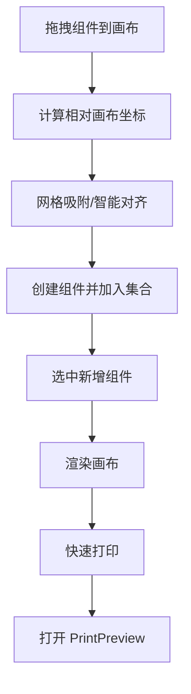
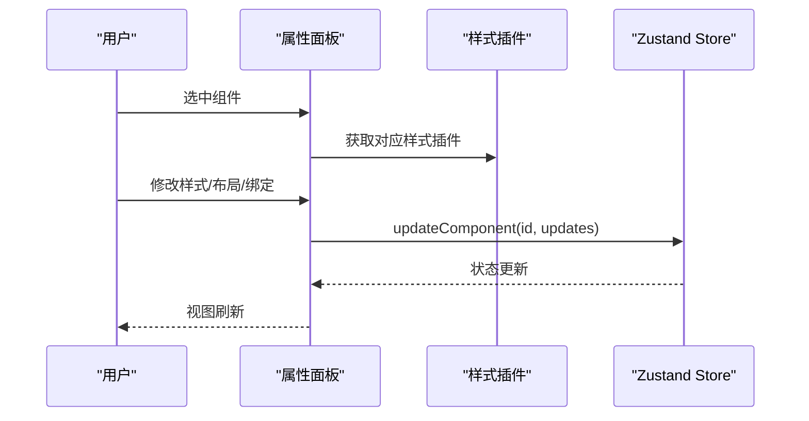
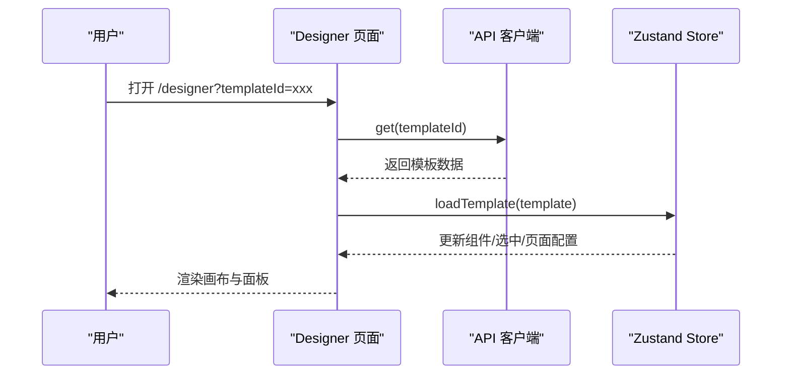
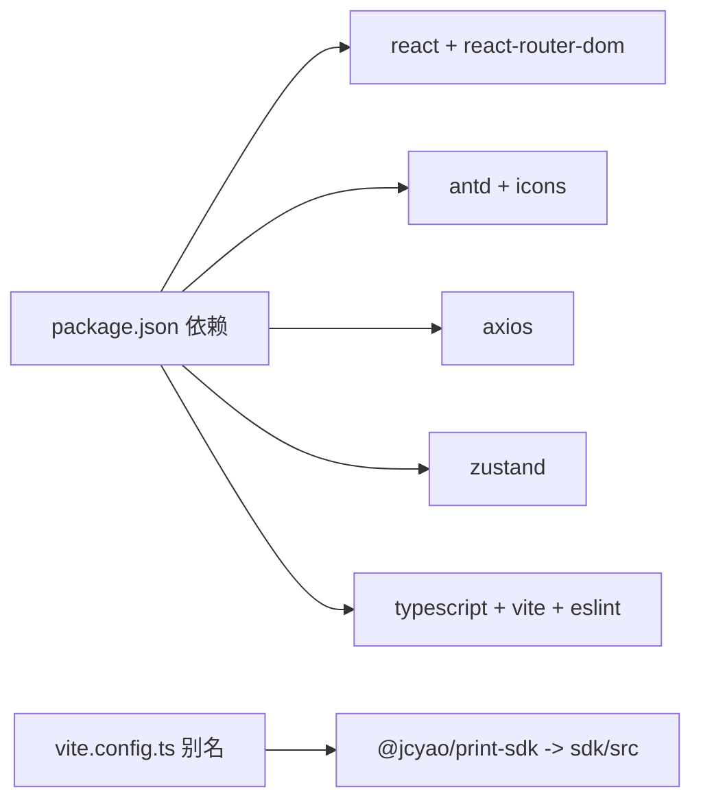

# 架构设计

<cite>
**本文引用的文件**
- [main.tsx](file://designer/src/main.tsx)
- [App.tsx](file://designer/src/App.tsx)
- [MainLayout.tsx](file://designer/src/layouts/MainLayout.tsx)
- [Designer.tsx](file://designer/src/pages/Designer/index.tsx)
- [Canvas/index.tsx](file://designer/src/pages/Designer/components/Canvas/index.tsx)
- [PrintPreview/index.tsx](file://designer/src/components/PrintPreview/index.tsx)
- [PropertyPanel/index.tsx](file://designer/src/pages/Designer/components/PropertyPanel/index.tsx)
- [designer.ts](file://designer/src/store/designer.ts)
- [types/index.ts](file://designer/src/types/index.ts)
- [api.ts](file://designer/src/services/api.ts)
- [grid.ts](file://designer/src/utils/grid.ts)
- [alignmentDetector.ts](file://designer/src/pages/Designer/components/Canvas/alignmentDetector.ts)
- [constants/index.ts](file://designer/src/constants/index.ts)
- [vite.config.ts](file://designer/vite.config.ts)
- [package.json](file://designer/package.json)
- [tsconfig.json](file://designer/tsconfig.json)
</cite>

## 目录
1. [引言](#引言)
2. [项目结构](#项目结构)
3. [核心组件](#核心组件)
4. [架构总览](#架构总览)
5. [详细组件分析](#详细组件分析)
6. [依赖分析](#依赖分析)
7. [性能考虑](#性能考虑)
8. [故障排查指南](#故障排查指南)
9. [结论](#结论)
10. [附录](#附录)

## 引言
本技术文档面向"打印设计器"项目的前端架构，围绕 React 18 + TypeScript 技术栈，系统性阐述以下主题：
- 路由配置与两种布局模式：全屏设计器模式与管理页面布局模式
- 主布局组件 MainLayout 的职责与实现原理
- Zustand 状态管理的设计理念、状态持久化策略、组件间通信与性能优化
- 新增多模板模式支持：PrintPreview 组件中的模板组管理与多模板预览功能
- 关键流程的序列图与时序图，帮助读者快速理解交互与数据流
- 最佳实践与常见问题排查建议

## 项目结构
项目采用"功能域 + 层次化"的组织方式：
- pages：页面级组件，包含设计器、模板管理、Schema 管理、Mock 数据管理等
- layouts：布局组件，如 MainLayout
- store：状态管理（Zustand）
- services：API 客户端封装
- types：类型定义
- utils：工具函数（网格、对齐检测等）
- components：可复用的低层组件（如打印预览、二维码、条形码等）

**图表来源**
- [main.tsx:1-8](file://designer/src/main.tsx#L1-L8)
- [App.tsx:1-31](file://designer/src/App.tsx#L1-L31)
- [MainLayout.tsx:1-56](file://designer/src/layouts/MainLayout.tsx#L1-L56)
- [Designer.tsx:1-279](file://designer/src/pages/Designer/index.tsx#L1-L279)
- [PrintPreview/index.tsx:1-567](file://designer/src/components/PrintPreview/index.tsx#L1-L567)
- [designer.ts:1-539](file://designer/src/store/designer.ts#L1-L539)
- [api.ts:1-115](file://designer/src/services/api.ts#L1-L115)
- [grid.ts:1-36](file://designer/src/utils/grid.ts#L1-L36)
- [alignmentDetector.ts:1-158](file://designer/src/pages/Designer/components/Canvas/alignmentDetector.ts#L1-L158)
- [constants/index.ts:1-20](file://designer/src/constants/index.ts#L1-L20)

**章节来源**
- [main.tsx:1-8](file://designer/src/main.tsx#L1-L8)
- [App.tsx:1-31](file://designer/src/App.tsx#L1-L31)
- [package.json:1-43](file://designer/package.json#L1-L43)

## 核心组件
- 路由与入口
  - 应用通过入口文件挂载根组件，根组件包裹在 BrowserRouter 中，定义全屏设计器路由与管理页面路由组。
- 主布局组件 MainLayout
  - 提供左侧菜单导航，结合 Outlet 实现管理页面的嵌套路由渲染。
- 设计器页面 Designer
  - 全屏布局，包含左侧面板（素材库）、中心画布、右侧面板（组件树/属性），并提供调试抽屉。
- PrintPreview 组件（新增）
  - 支持单模板模式和多模板模式，提供模板组管理、批量数据预览、页码导航等功能。
- Zustand 设计器 Store
  - 统一管理组件集合、选中状态、模板信息、页面配置、撤销/重做、复制/粘贴、网格与对齐、层级管理等。
- API 客户端
  - 封装模板、Schema、Mock 数据的 CRUD 接口，统一基地址与请求头。

**章节来源**
- [App.tsx:1-31](file://designer/src/App.tsx#L1-L31)
- [MainLayout.tsx:1-56](file://designer/src/layouts/MainLayout.tsx#L1-L56)
- [Designer.tsx:1-279](file://designer/src/pages/Designer/index.tsx#L1-L279)
- [PrintPreview/index.tsx:1-567](file://designer/src/components/PrintPreview/index.tsx#L1-L567)
- [designer.ts:1-539](file://designer/src/store/designer.ts#L1-L539)
- [api.ts:1-115](file://designer/src/services/api.ts#L1-L115)

## 架构总览
整体采用"路由驱动 + 状态集中"的架构模式：
- 路由层：BrowserRouter 管理路径与布局切换；全屏设计器与管理页面共享不同的布局容器。
- 布局层：MainLayout 提供管理页面的侧边栏与内容区；Designer 页面自定义全屏三栏布局。
- 状态层：Zustand Store 聚合设计器核心状态，提供高内聚、低耦合的状态操作接口。
- 服务层：API 客户端封装 HTTP 请求，统一错误处理与数据格式。
- 工具层：网格吸附、智能对齐、常量等工具函数支撑画布交互体验。
- 新增组件层：PrintPreview 组件提供多模板模式支持，增强批量预览能力。

**图表来源**
- [App.tsx:1-31](file://designer/src/App.tsx#L1-L31)
- [MainLayout.tsx:1-56](file://designer/src/layouts/MainLayout.tsx#L1-L56)
- [designer.ts:1-539](file://designer/src/store/designer.ts#L1-L539)
- [api.ts:1-115](file://designer/src/services/api.ts#L1-L115)
- [PrintPreview/index.tsx:1-567](file://designer/src/components/PrintPreview/index.tsx#L1-L567)

## 详细组件分析

### 路由系统与布局模式
- 全屏设计器模式
  - 路由路径 "/designer"，直接渲染 Designer 页面，无侧边栏，适合专注设计。
- 管理页面布局模式
  - 通过 MainLayout 包裹一组子路由，提供侧边菜单导航至模板、Schema、Mock 数据管理页面。
  - 通过 useNavigate/useLocation 控制菜单选中态与跳转。

**图表来源**
- [App.tsx:1-31](file://designer/src/App.tsx#L1-L31)
- [MainLayout.tsx:1-56](file://designer/src/layouts/MainLayout.tsx#L1-L56)

**章节来源**
- [App.tsx:1-31](file://designer/src/App.tsx#L1-L31)
- [MainLayout.tsx:1-56](file://designer/src/layouts/MainLayout.tsx#L1-L56)

### MainLayout 布局组件
- 职责
  - 提供固定宽度侧边栏与内容区，菜单项与路径一一对应，支持点击导航与选中态同步。
- 实现要点
  - 使用 Ant Design Layout/Sider/Content 组织结构。
  - 使用 useNavigate/useLocation 动态设置选中项与跳转。
  - 通过 Outlet 渲染子路由内容。

**图表来源**
- [MainLayout.tsx:1-56](file://designer/src/layouts/MainLayout.tsx#L1-L56)

**章节来源**
- [MainLayout.tsx:1-56](file://designer/src/layouts/MainLayout.tsx#L1-L56)

### PrintPreview 组件（新增）
- 多模板模式支持
  - 新增 templateMode 状态，支持 'single' 和 'multi' 两种模式。
  - 模板组管理：通过 TemplateGroup 接口管理多个模板组，每个组包含模板来源、标签和数据ID。
  - 模板缓存：使用 templateCacheRef 缓存已加载的模板，避免重复请求。
- 核心功能
  - 单模板模式：保持原有逻辑，支持批量数据预览。
  - 多模板模式：支持添加多个模板组，每个组可选择不同模板和数据源。
  - 批量预览：将多个模板组的预览结果合并为一个 HTML 文档。
  - 页码导航：支持上一页/下一页导航，显示总页数。
- 状态管理
  - templateGroups：模板组列表状态。
  - templateCacheRef：模板缓存引用。
  - templateMode：当前模板模式。
  - batchCount：批量文档数量。

**图表来源**
- [PrintPreview/index.tsx:37-84](file://designer/src/components/PrintPreview/index.tsx#L37-L84)
- [PrintPreview/index.tsx:137-153](file://designer/src/components/PrintPreview/index.tsx#L137-L153)
- [PrintPreview/index.tsx:238-304](file://designer/src/components/PrintPreview/index.tsx#L238-L304)

**章节来源**
- [PrintPreview/index.tsx:1-567](file://designer/src/components/PrintPreview/index.tsx#L1-L567)

### Zustand 状态管理设计
- 设计理念
  - 将设计器状态集中在一个 Store 中，暴露原子化的动作（add/update/remove/select/copy/paste/undo/redo 等），降低组件间耦合。
  - 通过"历史快照 + 索引"的机制实现撤销/重做，限制最大步数避免内存膨胀。
- 状态持久化
  - Store 本身不内置持久化逻辑；可通过中间件或外部存储（如 localStorage）扩展持久化能力（建议在应用层接入）。
- 组件间通信
  - 所有 UI 组件通过 useDesignerStore 订阅状态与触发动作，无需层层 props 传递。
- 性能优化策略
  - 使用 create 的选择器式订阅，避免不必要的重渲染。
  - 对历史记录进行截断与浅拷贝，控制内存占用。
  - 在复杂计算（如对齐、分布）中，尽量减少对象深拷贝次数，复用已有数据结构。

**图表来源**
- [designer.ts:8-71](file://designer/src/store/designer.ts#L8-L71)
- [types/index.ts:246-274](file://designer/src/types/index.ts#L246-L274)

**章节来源**
- [designer.ts:1-539](file://designer/src/store/designer.ts#L1-L539)
- [types/index.ts:1-317](file://designer/src/types/index.ts#L1-L317)

### 画布交互与工具链
- 画布 Canvas
  - 支持拖拽添加组件、多选拖拽、键盘快捷键（删除、复制、粘贴、撤销、重做、克隆）、右键菜单、层级操作、页面设置、打印预览等。
  - 通过网格吸附与智能对齐提升布局精度与效率。
  - 集成 PrintPreview 组件，支持快速打印功能。
- 网格吸附
  - 通过工具函数将坐标吸附到网格，支持按住 Shift 临时禁用吸附。
- 智能对齐
  - 基于对齐检测算法，计算对齐线与吸附建议，优先于网格吸附生效。
- 常量
  - 提供连续纸默认宽高、mm 到 px 的换算系数等。

**图表来源**
- [Canvas/index.tsx:195-378](file://designer/src/pages/Designer/components/Canvas/index.tsx#L195-L378)
- [Canvas/index.tsx:708-716](file://designer/src/pages/Designer/components/Canvas/index.tsx#L708-L716)
- [grid.ts:12-15](file://designer/src/utils/grid.ts#L12-L15)
- [alignmentDetector.ts:24-157](file://designer/src/pages/Designer/components/Canvas/alignmentDetector.ts#L24-L157)
- [constants/index.ts:7-19](file://designer/src/constants/index.ts#L7-L19)

**章节来源**
- [Canvas/index.tsx:1-1030](file://designer/src/pages/Designer/components/Canvas/index.tsx#L1-L1030)
- [grid.ts:1-36](file://designer/src/utils/grid.ts#L1-L36)
- [alignmentDetector.ts:1-158](file://designer/src/pages/Designer/components/Canvas/alignmentDetector.ts#L1-L158)
- [constants/index.ts:1-20](file://designer/src/constants/index.ts#L1-L20)

### 属性面板与样式插件
- 属性面板
  - 根据选中组件类型，分别渲染布局、数据绑定、样式与表格列等区域。
  - 通过回调更新组件的 layout/style/props/binding 字段。
- 样式插件
  - 采用插件注册表，按组件类型选择对应样式编辑器，支持扩展新组件的样式配置。

**图表来源**
- [PropertyPanel/index.tsx:16-126](file://designer/src/pages/Designer/components/PropertyPanel/index.tsx#L16-L126)
- [designer.ts:93-99](file://designer/src/store/designer.ts#L93-L99)

**章节来源**
- [PropertyPanel/index.tsx:1-129](file://designer/src/pages/Designer/components/PropertyPanel/index.tsx#L1-L129)
- [designer.ts:1-539](file://designer/src/store/designer.ts#L1-L539)

### 设计器页面与调试抽屉
- 全屏三栏布局：左侧面板（素材库）、中心画布、右侧面板（组件树/属性）
- 折叠按钮与抽屉交互，支持复制模板 JSON、查看调试信息
- 通过 API 加载模板并回填 Store
- 集成 PrintPreview 组件，支持多模板模式下的批量预览

**图表来源**
- [Designer.tsx:26-46](file://designer/src/pages/Designer/index.tsx#L26-L46)
- [api.ts:62-65](file://designer/src/services/api.ts#L62-L65)
- [designer.ts:150-159](file://designer/src/store/designer.ts#L150-L159)

**章节来源**
- [Designer.tsx:1-279](file://designer/src/pages/Designer/index.tsx#L1-L279)
- [api.ts:1-115](file://designer/src/services/api.ts#L1-L115)
- [designer.ts:1-539](file://designer/src/store/designer.ts#L1-L539)

## 依赖分析
- 运行时依赖
  - React 18、react-router-dom、antd、axios、zustand 等
- 构建与开发
  - Vite + React 插件，TypeScript 编译，ESLint 规范
- 本地 SDK 映射
  - 通过 Vite 别名将 @jcyao/print-sdk 指向本地 SDK 源码，便于联调

**图表来源**
- [package.json:12-27](file://designer/package.json#L12-L27)
- [vite.config.ts:8-14](file://designer/vite.config.ts#L8-L14)

**章节来源**
- [package.json:1-43](file://designer/package.json#L1-L43)
- [vite.config.ts:1-15](file://designer/vite.config.ts#L1-L15)
- [tsconfig.json:1-26](file://designer/tsconfig.json#L1-L26)

## 性能考虑
- 状态粒度与订阅
  - 使用选择器式订阅，避免整 Store 重渲染
  - 将高频更新拆分为独立动作，减少无关状态联动
- 历史记录优化
  - 固定最大步数，及时截断历史数组，避免内存泄漏
- 渲染优化
  - 对齐/分布等批量操作合并为一次 set，减少多次 re-render
- 画布交互
  - 鼠标事件监听在拖拽阶段开启，结束后及时解绑
  - 对齐线绘制与吸附建议仅在单选拖拽时计算，多选时清空参考线
- PrintPreview 组件优化
  - 模板缓存机制避免重复加载相同模板
  - 批量预览时使用模板缓存和模板组管理提升性能
  - 合并 HTML 时进行全局编号重排，确保页码连续性

## 故障排查指南
- 路由跳转异常
  - 检查 App 路由配置与默认跳转规则
  - 确认 MainLayout 的菜单项 key 与路由路径一致
- 状态不更新
  - 确认使用的是 useDesignerStore 的动作方法而非直接 set
  - 检查动作是否正确传入 id 或 updates
- 画布越界或组件不可见
  - 检查页面尺寸与方向配置，确认连续纸/自定义尺寸参数
  - 核对网格吸附与智能对齐是否导致位置被约束
- 模板加载失败
  - 查看 API 客户端请求日志与错误消息
  - 确认后端接口与跨域配置
- PrintPreview 多模板模式问题
  - 检查模板组配置是否正确，确保每个组都有有效的模板和数据
  - 确认模板缓存机制正常工作，避免重复加载
  - 验证批量预览合并逻辑，确保页码编号正确

**章节来源**
- [App.tsx:1-31](file://designer/src/App.tsx#L1-L31)
- [MainLayout.tsx:1-56](file://designer/src/layouts/MainLayout.tsx#L1-L56)
- [designer.ts:1-539](file://designer/src/store/designer.ts#L1-L539)
- [api.ts:1-115](file://designer/src/services/api.ts#L1-L115)
- [PrintPreview/index.tsx:1-567](file://designer/src/components/PrintPreview/index.tsx#L1-L567)

## 结论
本项目以 React 18 + TypeScript 为基础，结合 React Router 的路由体系与 Ant Design 的布局组件，构建了清晰的"全屏设计器 + 管理页面"双模式架构。Zustand Store 将设计器状态集中化，配合网格吸附与智能对齐工具，提供了良好的交互体验。

**新增的多模板模式**显著增强了批量预览能力：
- 通过 PrintPreview 组件的模板组管理，支持同时预览多个不同模板和数据组合
- 模板缓存机制提升了性能，避免重复加载
- 批量预览合并功能确保输出文档的完整性
- 页码导航功能改善了用户体验

通过模块化与插件化设计，系统具备良好的可扩展性与可维护性。建议后续在应用层引入状态持久化与更完善的错误边界与日志体系，进一步提升稳定性与可观测性。

## 附录
- 最佳实践
  - 将 Store 动作按领域拆分，保持单一职责
  - 使用 TypeScript 严格类型约束，减少运行期错误
  - 对外暴露稳定的 API 与类型定义，便于 SDK 与服务端协作
  - 在 Vite 中合理配置别名与路径解析，提升开发体验
  - 多模板模式下合理使用模板缓存，避免重复加载
  - 批量预览时注意内存使用，及时清理不需要的模板缓存