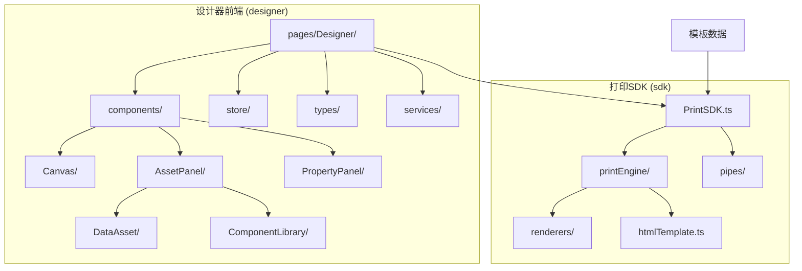
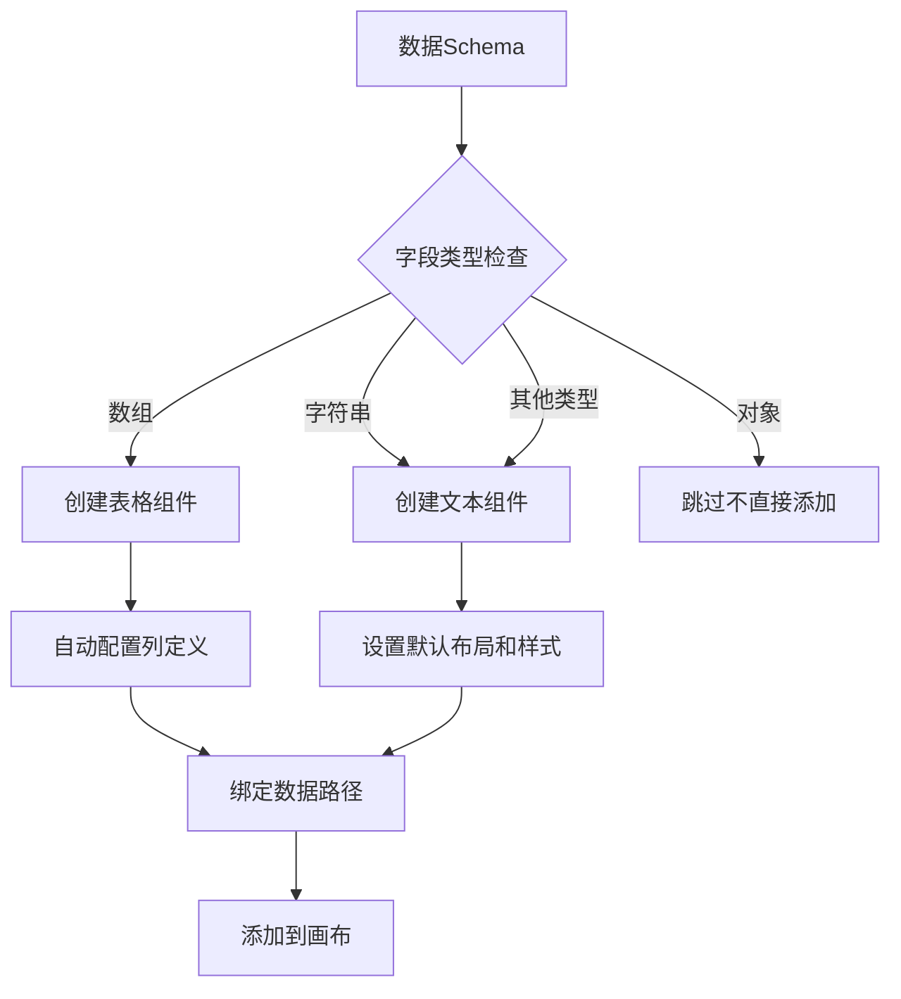
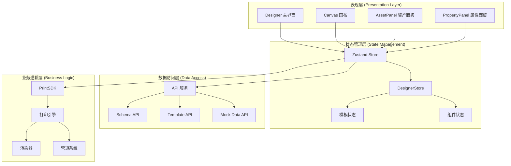
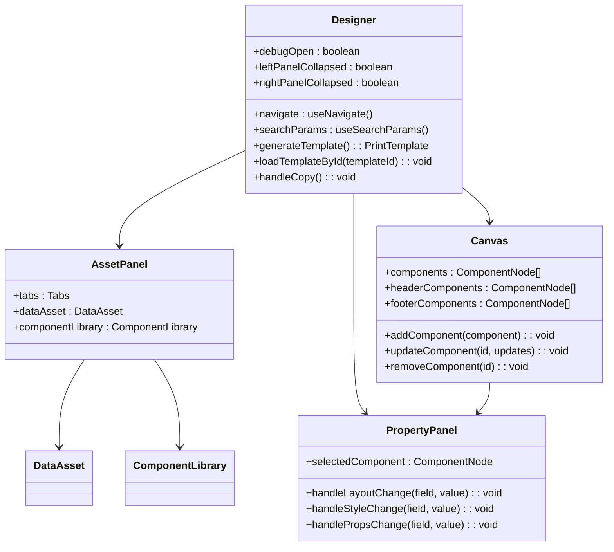
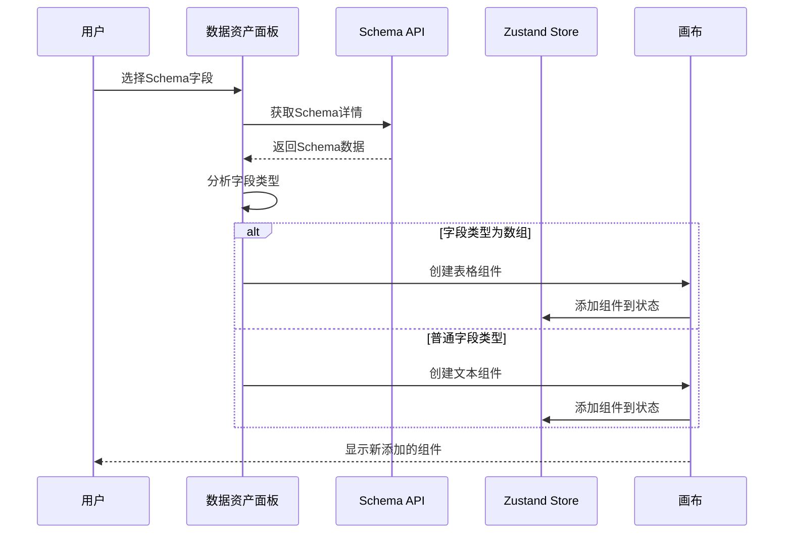
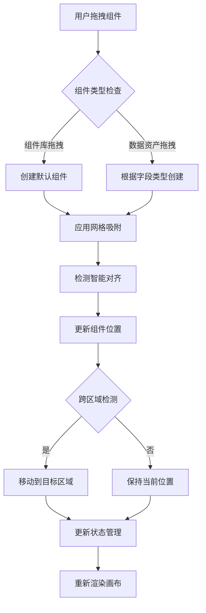
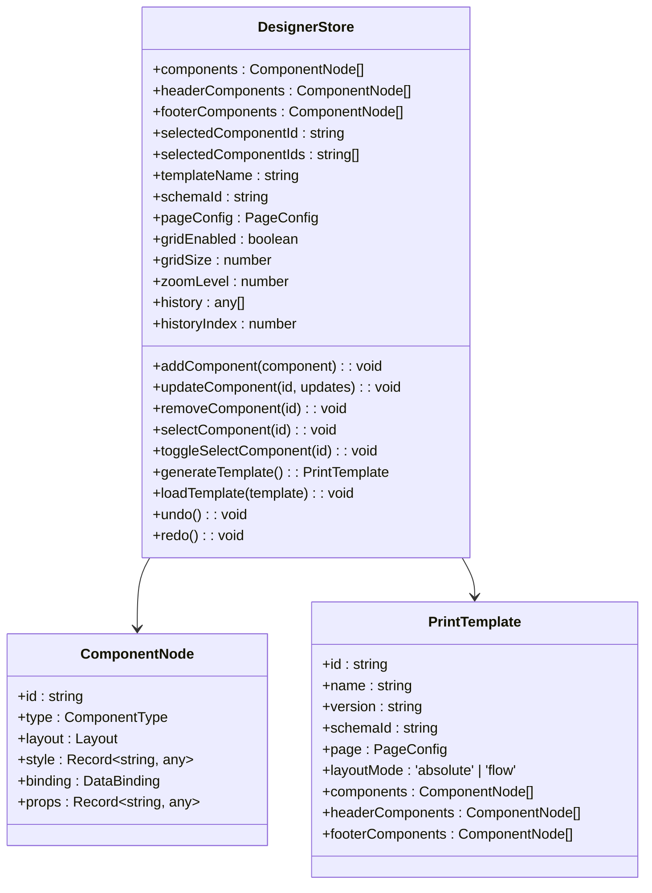
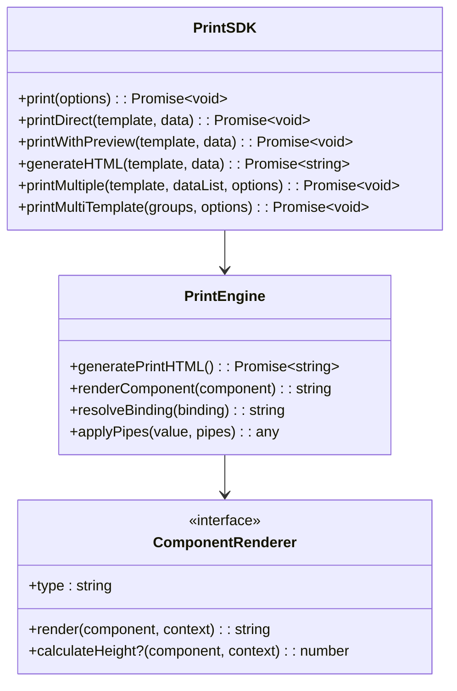
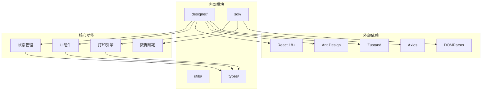

# 模态组件抽取系统

<cite>
**本文档引用的文件**
- [designer/src/pages/Designer/index.tsx](file://designer/src/pages/Designer/index.tsx)
- [designer/src/pages/Designer/components/Canvas/index.tsx](file://designer/src/pages/Designer/components/Canvas/index.tsx)
- [designer/src/pages/Designer/components/AssetPanel/index.tsx](file://designer/src/pages/Designer/components/AssetPanel/index.tsx)
- [designer/src/pages/Designer/components/AssetPanel/DataAsset/index.tsx](file://designer/src/pages/Designer/components/AssetPanel/DataAsset/index.tsx)
- [designer/src/pages/Designer/components/AssetPanel/ComponentLibrary/index.tsx](file://designer/src/pages/Designer/components/AssetPanel/ComponentLibrary/index.tsx)
- [designer/src/pages/Designer/components/PropertyPanel/index.tsx](file://designer/src/pages/Designer/components/PropertyPanel/index.tsx)
- [designer/src/store/designer.ts](file://designer/src/store/designer.ts)
- [designer/src/types/index.ts](file://designer/src/types/index.ts)
- [designer/src/services/api.ts](file://designer/src/services/api.ts)
- [sdk/src/PrintSDK.ts](file://sdk/src/PrintSDK.ts)
- [sdk/src/printEngine/types.ts](file://sdk/src/printEngine/types.ts)
- [sdk/src/types.ts](file://sdk/src/types.ts)
</cite>

## 目录
1. [简介](#简介)
2. [项目结构](#项目结构)
3. [核心组件](#核心组件)
4. [架构概览](#架构概览)
5. [详细组件分析](#详细组件分析)
6. [依赖分析](#依赖分析)
7. [性能考虑](#性能考虑)
8. [故障排除指南](#故障排除指南)
9. [结论](#结论)

## 简介

模态组件抽取系统是一个基于React和TypeScript开发的可视化打印模板设计器，专注于提供直观的拖拽式界面来创建和管理打印模板。该系统采用模块化架构设计，将UI组件、状态管理和打印引擎分离，实现了高度的可扩展性和维护性。

系统的核心功能包括：
- 可视化模板设计器，支持拖拽式组件添加
- 多种组件类型（文本、图片、表格、二维码、条形码等）
- 数据绑定和格式化管道系统
- 打印预览和批量打印功能
- 模板管理和存储机制

## 项目结构

该项目采用清晰的分层架构，主要分为两个核心部分：

**图表来源**
- [designer/src/pages/Designer/index.tsx:1-362](file://designer/src/pages/Designer/index.tsx#L1-L362)
- [sdk/src/PrintSDK.ts:100-477](file://sdk/src/PrintSDK.ts#L100-L477)

**章节来源**
- [designer/src/pages/Designer/index.tsx:1-362](file://designer/src/pages/Designer/index.tsx#L1-L362)
- [sdk/src/PrintSDK.ts:100-477](file://sdk/src/PrintSDK.ts#L100-L477)

## 核心组件

系统的核心组件围绕"模态组件抽取"这一核心概念构建，主要包括以下几类：

### 设计器主界面组件
- **Designer主容器**：负责整体布局和状态管理
- **画布区域**：提供拖拽式组件放置和编辑功能
- **资产面板**：包含数据资产和组件库两个子面板
- **属性面板**：显示和编辑选中组件的属性

### 组件抽取机制
系统实现了智能的组件抽取功能，能够从数据Schema中自动识别和抽取可用的组件类型：

**图表来源**
- [designer/src/pages/Designer/components/AssetPanel/DataAsset/index.tsx:206-287](file://designer/src/pages/Designer/components/AssetPanel/DataAsset/index.tsx#L206-L287)

**章节来源**
- [designer/src/pages/Designer/components/AssetPanel/DataAsset/index.tsx:19-350](file://designer/src/pages/Designer/components/AssetPanel/DataAsset/index.tsx#L19-L350)
- [designer/src/pages/Designer/components/AssetPanel/ComponentLibrary/index.tsx:26-238](file://designer/src/pages/Designer/components/AssetPanel/ComponentLibrary/index.tsx#L26-L238)

## 架构概览

系统采用分层架构设计，实现了关注点分离：

**图表来源**
- [designer/src/store/designer.ts:107-637](file://designer/src/store/designer.ts#L107-L637)
- [sdk/src/PrintSDK.ts:100-477](file://sdk/src/PrintSDK.ts#L100-L477)

**章节来源**
- [designer/src/store/designer.ts:107-637](file://designer/src/store/designer.ts#L107-L637)
- [sdk/src/PrintSDK.ts:100-477](file://sdk/src/PrintSDK.ts#L100-L477)

## 详细组件分析

### 设计器主界面组件

Designer组件作为整个应用的根组件，负责协调各个子组件的工作：

**图表来源**
- [designer/src/pages/Designer/index.tsx:17-362](file://designer/src/pages/Designer/index.tsx#L17-L362)
- [designer/src/pages/Designer/components/AssetPanel/index.tsx:7-32](file://designer/src/pages/Designer/components/AssetPanel/index.tsx#L7-L32)
- [designer/src/pages/Designer/components/Canvas/index.tsx:22-1312](file://designer/src/pages/Designer/components/Canvas/index.tsx#L22-L1312)
- [designer/src/pages/Designer/components/PropertyPanel/index.tsx:17-150](file://designer/src/pages/Designer/components/PropertyPanel/index.tsx#L17-L150)

**章节来源**
- [designer/src/pages/Designer/index.tsx:17-362](file://designer/src/pages/Designer/index.tsx#L17-L362)

### 资产面板组件

资产面板包含两个主要子面板，分别处理数据资产和组件库：

#### 数据资产面板
数据资产面板实现了智能的组件抽取功能，能够根据数据Schema自动创建相应的组件：

**图表来源**
- [designer/src/pages/Designer/components/AssetPanel/DataAsset/index.tsx:206-287](file://designer/src/pages/Designer/components/AssetPanel/DataAsset/index.tsx#L206-L287)

#### 组件库面板
组件库面板提供了预定义的组件模板，支持快速添加各种类型的组件：

**章节来源**
- [designer/src/pages/Designer/components/AssetPanel/DataAsset/index.tsx:19-350](file://designer/src/pages/Designer/components/AssetPanel/DataAsset/index.tsx#L19-L350)
- [designer/src/pages/Designer/components/AssetPanel/ComponentLibrary/index.tsx:26-238](file://designer/src/pages/Designer/components/AssetPanel/ComponentLibrary/index.tsx#L26-L238)

### 画布组件

画布组件是系统的核心交互区域，实现了复杂的拖拽、缩放和对齐功能：

**图表来源**
- [designer/src/pages/Designer/components/Canvas/index.tsx:250-437](file://designer/src/pages/Designer/components/Canvas/index.tsx#L250-L437)

**章节来源**
- [designer/src/pages/Designer/components/Canvas/index.tsx:22-1312](file://designer/src/pages/Designer/components/Canvas/index.tsx#L22-L1312)

### 属性面板组件

属性面板提供了组件属性的统一编辑界面，支持布局、样式、数据绑定等多种属性的修改：

**章节来源**
- [designer/src/pages/Designer/components/PropertyPanel/index.tsx:17-150](file://designer/src/pages/Designer/components/PropertyPanel/index.tsx#L17-L150)

### 状态管理系统

系统使用Zustand实现轻量级的状态管理，集中管理所有组件状态：

**图表来源**
- [designer/src/store/designer.ts:8-637](file://designer/src/store/designer.ts#L8-L637)
- [designer/src/types/index.ts:303-358](file://designer/src/types/index.ts#L303-L358)

**章节来源**
- [designer/src/store/designer.ts:8-637](file://designer/src/store/designer.ts#L8-L637)

### 打印SDK系统

打印SDK提供了完整的打印功能封装，实现了与设计器的解耦设计：

**图表来源**
- [sdk/src/PrintSDK.ts:100-477](file://sdk/src/PrintSDK.ts#L100-L477)
- [sdk/src/printEngine/types.ts:61-82](file://sdk/src/printEngine/types.ts#L61-L82)

**章节来源**
- [sdk/src/PrintSDK.ts:100-477](file://sdk/src/PrintSDK.ts#L100-L477)

## 依赖分析

系统采用了清晰的依赖关系设计，实现了模块间的松耦合：

**图表来源**
- [designer/src/store/designer.ts:1-637](file://designer/src/store/designer.ts#L1-L637)
- [sdk/src/PrintSDK.ts:1-477](file://sdk/src/PrintSDK.ts#L1-L477)

**章节来源**
- [designer/src/store/designer.ts:1-637](file://designer/src/store/designer.ts#L1-L637)
- [sdk/src/PrintSDK.ts:1-477](file://sdk/src/PrintSDK.ts#L1-L477)

## 性能考虑

系统在设计时充分考虑了性能优化：

### 状态管理优化
- 使用Zustand替代Redux，减少不必要的状态更新
- 实现历史记录的增量保存，避免全量状态复制
- 组件选择状态的批量操作支持

### 渲染性能优化
- 画布组件的虚拟滚动支持
- 组件更新的局部状态管理
- 拖拽过程中的防抖处理

### 打印性能优化
- HTML生成的缓存机制
- 图片资源的异步加载
- 批量打印的并行处理

## 故障排除指南

### 常见问题及解决方案

#### 组件无法拖拽到画布
1. **检查组件类型**：确保组件类型不是被禁止的类型
2. **验证数据绑定**：确认数据Schema正确配置
3. **检查画布边界**：确保组件位置在有效区域内

#### 打印预览异常
1. **检查资源加载**：确认所有图片资源可访问
2. **验证模板结构**：确保模板数据格式正确
3. **查看浏览器控制台**：检查JavaScript错误

#### 性能问题
1. **减少组件数量**：大量组件会影响渲染性能
2. **优化数据绑定**：避免复杂的管道转换
3. **使用合适的缩放级别**：过高的缩放会影响性能

**章节来源**
- [designer/src/pages/Designer/components/Canvas/index.tsx:194-248](file://designer/src/pages/Designer/components/Canvas/index.tsx#L194-L248)
- [sdk/src/PrintSDK.ts:110-172](file://sdk/src/PrintSDK.ts#L110-L172)

## 结论

模态组件抽取系统通过其精心设计的架构和组件化思维，成功实现了复杂打印模板设计的可视化需求。系统的主要优势包括：

1. **模块化设计**：清晰的分层架构便于维护和扩展
2. **组件抽取机制**：智能的数据绑定和组件生成
3. **状态管理优化**：高效的Zustand状态管理
4. **打印引擎解耦**：独立的打印功能便于集成
5. **用户体验友好**：直观的拖拽式界面设计

该系统为打印模板设计提供了一个强大而灵活的平台，既满足了专业用户的需求，又保持了良好的易用性。通过持续的优化和扩展，该系统有望成为打印模板设计领域的优秀解决方案。