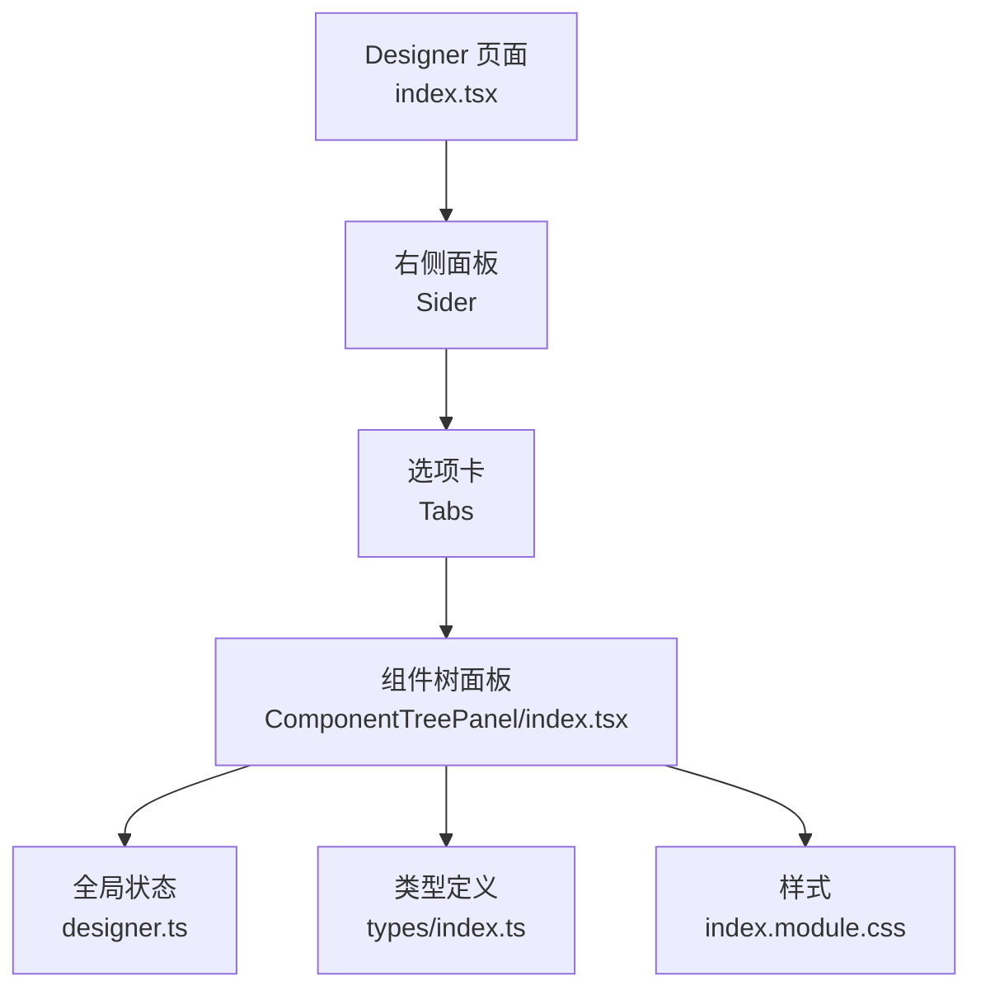
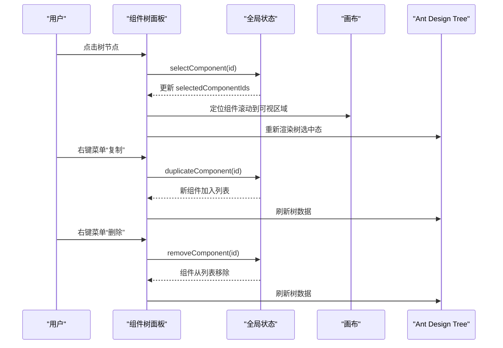
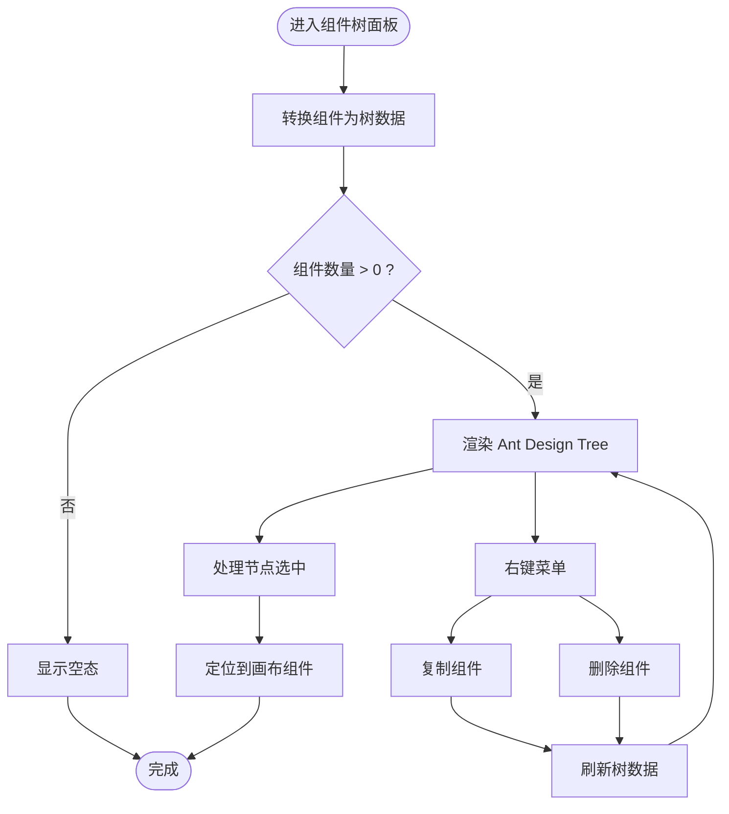
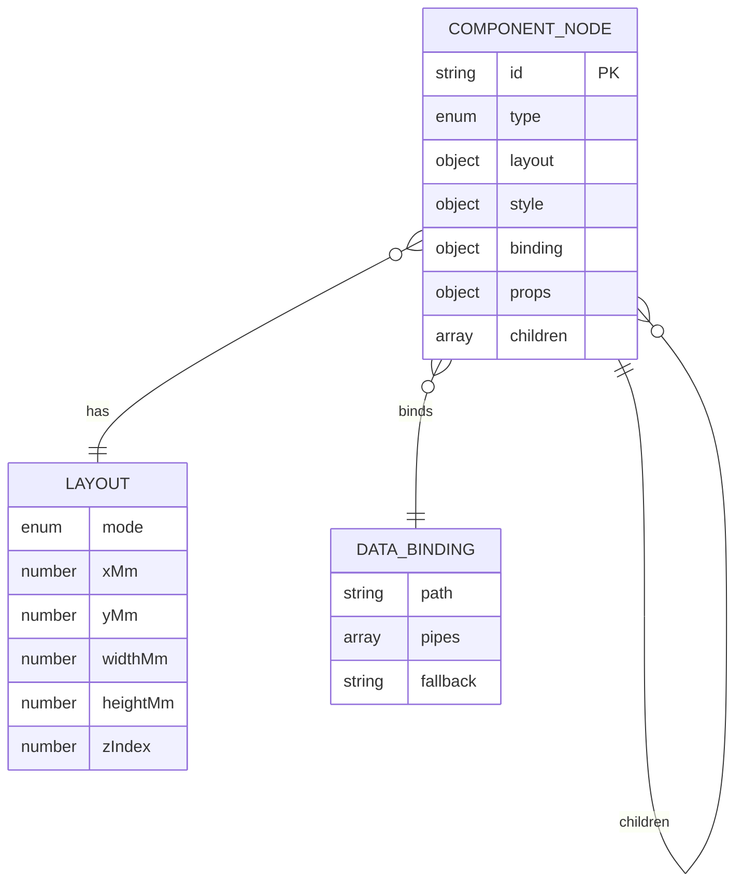
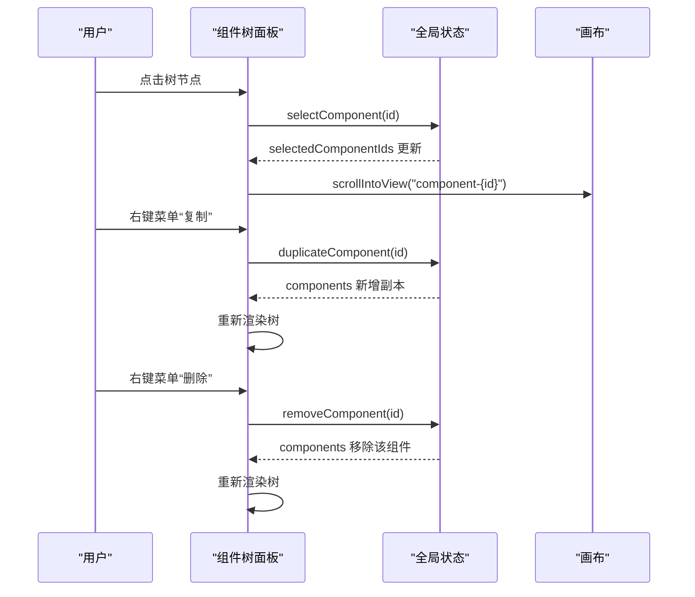
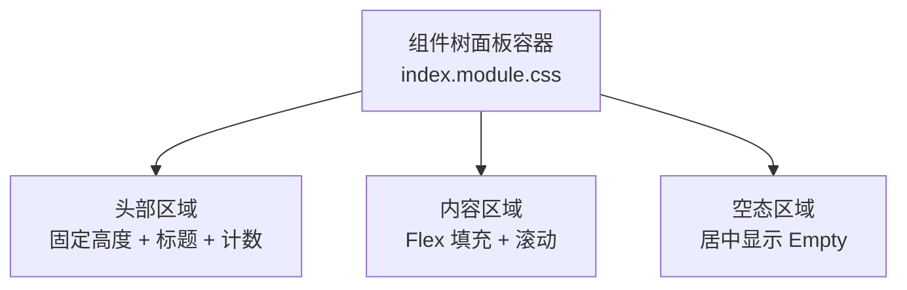
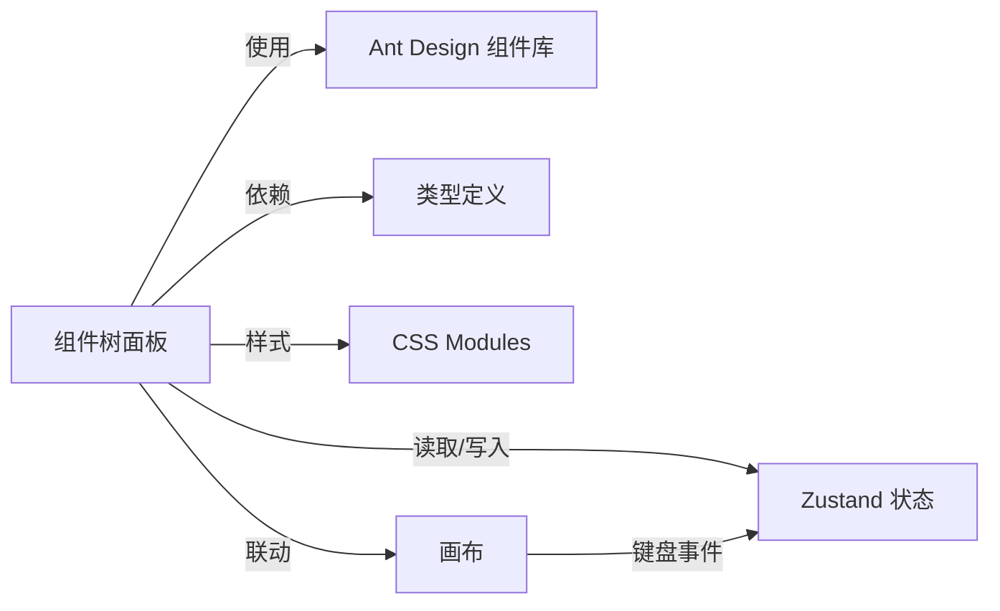

# 组件树面板

<cite>
**本文引用的文件**
- [index.tsx](file://designer/src/pages/Designer/components/ComponentTreePanel/index.tsx)
- [index.module.css](file://designer/src/pages/Designer/components/ComponentTreePanel/index.module.css)
- [designer.ts](file://designer/src/store/designer.ts)
- [index.tsx](file://designer/src/pages/Designer/index.tsx)
- [index.tsx](file://designer/src/pages/Designer/components/Canvas/index.tsx)
- [index.module.css](file://designer/src/pages/Designer/components/Canvas/index.module.css)
- [index.ts](file://designer/src/types/index.ts)
- [grid.ts](file://designer/src/utils/grid.ts)
</cite>

## 目录
1. [简介](#简介)
2. [项目结构](#项目结构)
3. [核心组件](#核心组件)
4. [架构总览](#架构总览)
5. [详细组件分析](#详细组件分析)
6. [依赖分析](#依赖分析)
7. [性能考虑](#性能考虑)
8. [故障排查指南](#故障排查指南)
9. [结论](#结论)
10. [附录](#附录)

## 简介
本技术文档围绕“组件树面板”进行系统化说明，涵盖其功能实现、数据结构设计、交互逻辑、样式与响应式实现，以及扩展开发指南。组件树面板负责以树形结构展示画布上所有组件的层级关系，支持组件选择、定位、右键菜单（复制、删除）等操作，并通过状态管理与画布联动，实现组件的可视化高亮与定位。

## 项目结构
组件树面板位于设计器页面的右侧面板中，作为“属性配置”选项卡下的子组件存在；它依赖全局状态存储（Zustand）中的组件列表、选中状态、删除与复制等功能，并通过 Ant Design 的 Tree 组件渲染树形视图。

图表来源
- [index.tsx:204-231](file://designer/src/pages/Designer/index.tsx#L204-L231)
- [index.tsx:1-176](file://designer/src/pages/Designer/components/ComponentTreePanel/index.tsx#L1-L176)
- [designer.ts:85-125](file://designer/src/store/designer.ts#L85-L125)
- [index.ts:123-138](file://designer/src/types/index.ts#L123-L138)
- [index.module.css:1-29](file://designer/src/pages/Designer/components/ComponentTreePanel/index.module.css#L1-L29)

章节来源
- [index.tsx:17-279](file://designer/src/pages/Designer/index.tsx#L17-L279)
- [index.tsx:1-176](file://designer/src/pages/Designer/components/ComponentTreePanel/index.tsx#L1-L176)

## 核心组件
- 组件树面板：基于 Ant Design Tree 组件，将组件列表转换为树形数据，支持选中、右键菜单、空态提示。
- 全局状态管理：提供组件增删改、选中状态、复制粘贴、撤销重做、层级管理等能力。
- 类型系统：定义组件节点结构、布局、样式、数据绑定等类型，确保组件树数据一致性。
- 画布联动：组件树选中后，画布会滚动到对应组件位置，实现“所见即所得”的定位体验。

章节来源
- [index.tsx:74-173](file://designer/src/pages/Designer/components/ComponentTreePanel/index.tsx#L74-L173)
- [designer.ts:85-331](file://designer/src/store/designer.ts#L85-L331)
- [index.ts:123-138](file://designer/src/types/index.ts#L123-L138)
- [index.tsx:112-161](file://designer/src/pages/Designer/components/Canvas/index.tsx#L112-L161)

## 架构总览
组件树面板与全局状态、类型系统、Ant Design Tree 组件协同工作，形成“数据驱动视图”的单向数据流。用户在组件树中进行选择或右键操作，触发状态更新；状态变化驱动画布高亮与定位。

图表来源
- [index.tsx:82-117](file://designer/src/pages/Designer/components/ComponentTreePanel/index.tsx#L82-L117)
- [designer.ts:108-125](file://designer/src/store/designer.ts#L108-L125)
- [designer.ts:206-229](file://designer/src/store/designer.ts#L206-L229)
- [designer.ts:101-106](file://designer/src/store/designer.ts#L101-L106)
- [index.tsx:88-92](file://designer/src/pages/Designer/components/Canvas/index.tsx#L88-L92)

## 详细组件分析

### 组件树面板实现
- 数据转换：将全局组件列表转换为 Ant Design Tree 所需的树形数据格式，包含 key、title、icon 等字段。
- 选中处理：点击节点后调用状态选择器，同时尝试滚动到画布中对应组件位置。
- 右键菜单：提供“复制组件”和“删除组件”两个操作，分别触发复制与删除逻辑。
- 空态处理：当组件列表为空时，显示“暂无组件”的空态提示。

图表来源
- [index.tsx:54-72](file://designer/src/pages/Designer/components/ComponentTreePanel/index.tsx#L54-L72)
- [index.tsx:82-93](file://designer/src/pages/Designer/components/ComponentTreePanel/index.tsx#L82-L93)
- [index.tsx:96-117](file://designer/src/pages/Designer/components/ComponentTreePanel/index.tsx#L96-L117)
- [index.tsx:132-149](file://designer/src/pages/Designer/components/ComponentTreePanel/index.tsx#L132-L149)

章节来源
- [index.tsx:53-173](file://designer/src/pages/Designer/components/ComponentTreePanel/index.tsx#L53-L173)

### 组件树数据结构设计
- 组件节点类型：ComponentNode 定义了组件的唯一标识、类型、布局、样式、数据绑定、属性及子节点数组。
- 布局与层级：布局对象包含绝对定位或流式布局模式、坐标、宽高、z-index 等；children 数组表达父子层级关系。
- 数据绑定：支持路径绑定与管道链，便于运行期动态渲染。
- 选中与多选：全局状态提供单选与多选两种模式，统一维护选中组件 ID 列表。

图表来源
- [index.ts:123-138](file://designer/src/types/index.ts#L123-L138)
- [index.ts:126-133](file://designer/src/types/index.ts#L126-L133)
- [index.ts:71-75](file://designer/src/types/index.ts#L71-L75)

章节来源
- [index.ts:123-138](file://designer/src/types/index.ts#L123-L138)

### 交互逻辑
- 点击选择：Tree onSelect 回调中根据选中 key 调用状态选择器，并尝试滚动到画布组件位置。
- 右键菜单：通过 Ant Design Dropdown 包裹树节点标题，提供复制与删除操作。
- 键盘快捷键：画布侧监听 Delete/Backspace 删除当前选中组件；Ctrl/Cmd+C/V 复制/粘贴；Ctrl/Cmd+Z/Z+Shift 重做/撤销；Ctrl/Cmd+D 复制当前组件。
- 定位联动：组件树选中后，通过 DOM 查询组件容器并滚动到可视区域中心。

图表来源
- [index.tsx:82-117](file://designer/src/pages/Designer/components/ComponentTreePanel/index.tsx#L82-L117)
- [designer.ts:108-125](file://designer/src/store/designer.ts#L108-L125)
- [designer.ts:206-229](file://designer/src/store/designer.ts#L206-L229)
- [designer.ts:101-106](file://designer/src/store/designer.ts#L101-L106)
- [index.tsx:88-92](file://designer/src/pages/Designer/components/Canvas/index.tsx#L88-L92)

章节来源
- [index.tsx:81-130](file://designer/src/pages/Designer/components/ComponentTreePanel/index.tsx#L81-L130)
- [index.tsx:112-161](file://designer/src/pages/Designer/components/Canvas/index.tsx#L112-L161)

### 样式与响应式设计
- 面板布局：采用 Flex 布局，头部固定高度，内容区自适应填充，整体高度随视口变化。
- 树形渲染：Tree 组件 blockNode 与 titleRender 支持自定义节点标题，结合 Ant Design 图标与组件类型名称。
- 空态样式：居中显示 Empty 组件，提升无数据时的用户体验。
- 响应式策略：右侧面板支持折叠/展开，折叠时通过悬浮按钮快速切换，不影响组件树面板的可视性。

图表来源
- [index.module.css:1-29](file://designer/src/pages/Designer/components/ComponentTreePanel/index.module.css#L1-L29)

章节来源
- [index.module.css:1-29](file://designer/src/pages/Designer/components/ComponentTreePanel/index.module.css#L1-L29)
- [index.tsx:178-232](file://designer/src/pages/Designer/index.tsx#L178-L232)

### 扩展开发指南
- 新增右键菜单项：在 getContextMenuItems 中添加新的菜单项，绑定对应的状态操作（如复制、删除、置顶/置底等）。
- 自定义节点标题：通过 titleRender 返回自定义 JSX，可增加状态徽标、绑定路径提示等。
- 与画布联动：在 onSelect 中扩展定位逻辑，例如高亮画布组件、显示属性面板等。
- 性能优化建议：
  - 树数据转换仅在组件列表变化时执行，避免频繁重渲染。
  - 使用 React.memo 或稳定引用减少不必要的重渲染。
  - 对于大量组件场景，可考虑虚拟化树渲染或分页加载。
- 可访问性增强：为 Tree 节点添加 aria-label、aria-selected 等属性，提升屏幕阅读器支持。

章节来源
- [index.tsx:96-130](file://designer/src/pages/Designer/components/ComponentTreePanel/index.tsx#L96-L130)
- [designer.ts:85-125](file://designer/src/store/designer.ts#L85-L125)

## 依赖分析
- 组件树面板依赖：
  - Ant Design Tree、Dropdown、Typography、Empty、Tooltip 组件库。
  - 全局状态 store（Zustand），提供组件列表、选中状态、删除、复制等方法。
  - 类型定义（ComponentNode、ComponentType、DataBinding 等）。
  - 样式模块（index.module.css）。
- 与画布联动：
  - 通过 DOM 查询组件容器并滚动到可视区域，实现“所见即所得”的定位体验。
  - 画布侧监听键盘事件，统一处理删除、复制、粘贴、撤销/重做等快捷键。

图表来源
- [index.tsx:6-21](file://designer/src/pages/Designer/components/ComponentTreePanel/index.tsx#L6-L21)
- [designer.ts:85-125](file://designer/src/store/designer.ts#L85-L125)
- [index.ts:123-138](file://designer/src/types/index.ts#L123-L138)
- [index.tsx:112-161](file://designer/src/pages/Designer/components/Canvas/index.tsx#L112-L161)

章节来源
- [index.tsx:6-21](file://designer/src/pages/Designer/components/ComponentTreePanel/index.tsx#L6-L21)
- [designer.ts:85-125](file://designer/src/store/designer.ts#L85-L125)
- [index.tsx:112-161](file://designer/src/pages/Designer/components/Canvas/index.tsx#L112-L161)

## 性能考虑
- 渲染优化：Tree 组件仅在组件列表或选中状态变化时更新；titleRender 返回稳定的节点标题结构，减少重渲染。
- 数据转换：convertComponentsToTree 在每次渲染前执行，建议在组件外部缓存或使用 useMemo 优化。
- 大数据量场景：可考虑虚拟化树渲染、懒加载子节点、分页展示等方式降低内存占用与重排成本。
- 事件处理：滚动定位仅在选中节点变化时触发，避免频繁 DOM 查询。

## 故障排查指南
- 组件树不显示：检查全局组件列表是否为空；确认 Tree 组件的 treeData 是否正确生成。
- 选中无效：确认 selectedKeys 与 selectedComponentIds 是否同步；检查状态选择器是否被正确调用。
- 右键菜单不生效：确认 Dropdown 的 trigger 设置为 contextMenu；检查菜单项 onClick 是否绑定到状态操作。
- 定位不到组件：确认 DOM 中是否存在以“component-{id}”命名的元素；检查画布组件容器的 id 规范。
- 快捷键冲突：画布侧监听了多个键盘事件，若与其他组件冲突，可在事件处理器中增加焦点判断或阻止冒泡。

章节来源
- [index.tsx:132-149](file://designer/src/pages/Designer/components/ComponentTreePanel/index.tsx#L132-L149)
- [index.tsx:82-93](file://designer/src/pages/Designer/components/ComponentTreePanel/index.tsx#L82-L93)
- [index.tsx:120-130](file://designer/src/pages/Designer/components/ComponentTreePanel/index.tsx#L120-L130)
- [index.tsx:88-92](file://designer/src/pages/Designer/components/Canvas/index.tsx#L88-L92)
- [index.tsx:112-161](file://designer/src/pages/Designer/components/Canvas/index.tsx#L112-L161)

## 结论
组件树面板通过简洁的树形结构与 Ant Design Tree 组件，实现了组件层级的直观展示与高效交互。配合全局状态管理与画布联动，用户可以快速定位、选择、复制与删除组件。在扩展开发方面，可通过右键菜单、自定义标题、快捷键等进一步增强可用性与效率。

## 附录
- 关键实现路径参考：
  - 组件树面板主文件：[index.tsx:1-176](file://designer/src/pages/Designer/components/ComponentTreePanel/index.tsx#L1-L176)
  - 样式文件：[index.module.css:1-29](file://designer/src/pages/Designer/components/ComponentTreePanel/index.module.css#L1-L29)
  - 全局状态（Zustand）：[designer.ts:85-331](file://designer/src/store/designer.ts#L85-L331)
  - 类型定义：[index.ts:123-138](file://designer/src/types/index.ts#L123-L138)
  - 画布联动与快捷键：[index.tsx:112-161](file://designer/src/pages/Designer/components/Canvas/index.tsx#L112-L161)
  - 网格吸附工具：[grid.ts:12-15](file://designer/src/utils/grid.ts#L12-L15)