# 组件渲染器

<cite>
**本文引用的文件**
- [TextPreview.tsx](file://designer/src/pages/Designer/components/Canvas/componentRenderers/TextPreview.tsx)
- [TablePreview.tsx](file://designer/src/pages/Designer/components/Canvas/componentRenderers/TablePreview.tsx)
- [ImagePreview.tsx](file://designer/src/pages/Designer/components/Canvas/componentRenderers/ImagePreview.tsx)
- [QRCodePreview.tsx](file://designer/src/pages/Designer/components/Canvas/componentRenderers/QRCodePreview.tsx)
- [BarcodePreview.tsx](file://designer/src/pages/Designer/components/Canvas/componentRenderers/BarcodePreview.tsx)
- [LinePreview.tsx](file://designer/src/pages/Designer/components/Canvas/componentRenderers/LinePreview.tsx)
- [RectPreview.tsx](file://designer/src/pages/Designer/components/Canvas/componentRenderers/RectPreview.tsx)
- [index.ts](file://designer/src/pages/Designer/components/Canvas/componentRenderers/index.ts)
- [ComponentPreview.tsx](file://designer/src/pages/Designer/components/Canvas/ComponentPreview.tsx)
- [index.ts](file://designer/src/pages/Designer/components/PropertyPanel/stylePlugins/index.ts)
- [TextStylePlugin.tsx](file://designer/src/pages/Designer/components/PropertyPanel/stylePlugins/TextStylePlugin.tsx)
- [TableStylePlugin.tsx](file://designer/src/pages/Designer/components/PropertyPanel/stylePlugins/TableStylePlugin.tsx)
- [LineStylePlugin.tsx](file://designer/src/pages/Designer/components/PropertyPanel/stylePlugins/LineStylePlugin.tsx)
- [DefaultStylePlugin.tsx](file://designer/src/pages/Designer/components/PropertyPanel/stylePlugins/DefaultStylePlugin.tsx)
- [index.ts](file://designer/src/types/index.ts)
</cite>

## 目录
1. [引言](#引言)
2. [项目结构](#项目结构)
3. [核心组件](#核心组件)
4. [架构总览](#架构总览)
5. [详细组件分析](#详细组件分析)
6. [依赖关系分析](#依赖关系分析)
7. [性能考量](#性能考量)
8. [故障排查指南](#故障排查指南)
9. [结论](#结论)
10. [附录](#附录)

## 引言
本文件系统性梳理设计器中“组件渲染器”的技术实现与使用方法，覆盖8种内置渲染器：文本、表格、图片、二维码、条形码、线条、矩形，并阐述其 props 接口、渲染逻辑、样式处理与交互行为。同时说明渲染器注册机制、统一导出与动态渲染流程，并提供自定义渲染器的开发指南。

## 项目结构
组件渲染器位于设计器前端工程的画布组件目录下，采用按文件拆分的模块化组织方式，每个渲染器独立文件并通过统一入口导出；画布预览组件根据组件类型进行动态分发渲染。

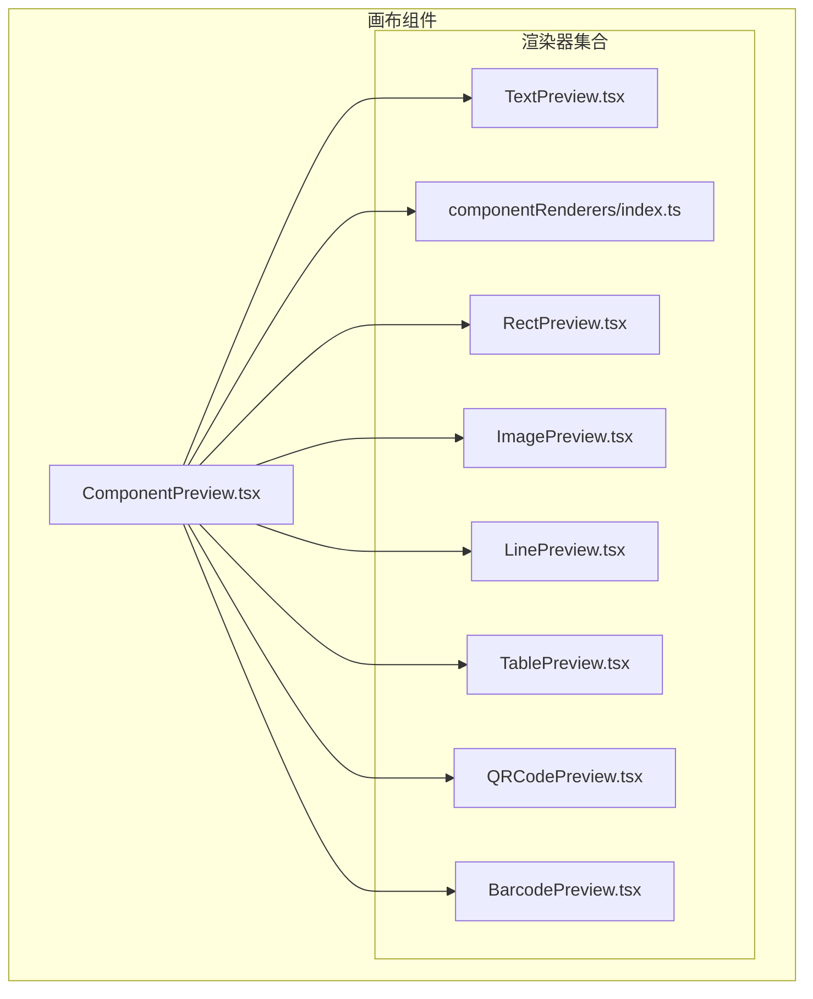

图表来源
- [ComponentPreview.tsx:20-50](file://designer/src/pages/Designer/components/Canvas/ComponentPreview.tsx#L20-L50)
- [index.ts:1-11](file://designer/src/pages/Designer/components/Canvas/componentRenderers/index.ts#L1-L11)

章节来源
- [ComponentPreview.tsx:1-53](file://designer/src/pages/Designer/components/Canvas/ComponentPreview.tsx#L1-L53)
- [index.ts:1-11](file://designer/src/pages/Designer/components/Canvas/componentRenderers/index.ts#L1-L11)

## 核心组件
本节概述8种内置渲染器的职责与关键特性：
- 文本渲染器：基于组件样式计算对齐方式，支持标签/静态文本/数据绑定回退值。
- 表格渲染器：根据列配置渲染表头与占位数据，支持边框与表头开关。
- 图片渲染器：优先展示资源地址，否则以占位提示呈现。
- 二维码渲染器：根据组件尺寸换算像素，读取绑定回退或显式内容。
- 条形码渲染器：根据组件尺寸换算宽高，支持格式与内容配置。
- 线条渲染器：通过上边框模拟线条，支持线宽、样式与颜色。
- 矩形渲染器：直接渲染边框与背景，作为容器或装饰元素。

章节来源
- [TextPreview.tsx:1-31](file://designer/src/pages/Designer/components/Canvas/componentRenderers/TextPreview.tsx#L1-L31)
- [TablePreview.tsx:1-56](file://designer/src/pages/Designer/components/Canvas/componentRenderers/TablePreview.tsx#L1-L56)
- [ImagePreview.tsx:1-34](file://designer/src/pages/Designer/components/Canvas/componentRenderers/ImagePreview.tsx#L1-L34)
- [QRCodePreview.tsx:1-17](file://designer/src/pages/Designer/components/Canvas/componentRenderers/QRCodePreview.tsx#L1-L17)
- [BarcodePreview.tsx:1-26](file://designer/src/pages/Designer/components/Canvas/componentRenderers/BarcodePreview.tsx#L1-L26)
- [LinePreview.tsx:1-31](file://designer/src/pages/Designer/components/Canvas/componentRenderers/LinePreview.tsx#L1-L31)
- [RectPreview.tsx:1-20](file://designer/src/pages/Designer/components/Canvas/componentRenderers/RectPreview.tsx#L1-L20)

## 架构总览
渲染器体系由“类型定义 → 渲染器集合 → 动态分发 → 属性面板样式插件”构成，形成清晰的职责边界与扩展点。

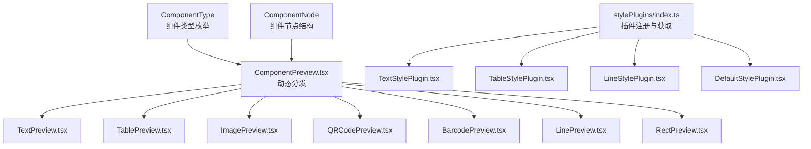

图表来源
- [index.ts:64](file://designer/src/types/index.ts#L64)
- [index.ts:123-138](file://designer/src/types/index.ts#L123-L138)
- [ComponentPreview.tsx:20-50](file://designer/src/pages/Designer/components/Canvas/ComponentPreview.tsx#L20-L50)
- [index.ts:12-47](file://designer/src/pages/Designer/components/PropertyPanel/stylePlugins/index.ts#L12-L47)

## 详细组件分析

### 文本渲染器（TextPreview）
- Props 接口
  - component: ComponentNode
- 渲染逻辑
  - 计算水平对齐：依据 textAlign 映射到 flex 的 justifyContent。
  - 文本内容优先级：label > text > binding.path > 占位文案。
  - 样式要点：字号、颜色、字重、溢出省略、垂直居中、整高填充。
- 交互行为
  - 画布预览中仅展示视觉效果，不涉及编辑交互。
- 复杂度
  - 时间复杂度 O(1)，空间复杂度 O(1)。

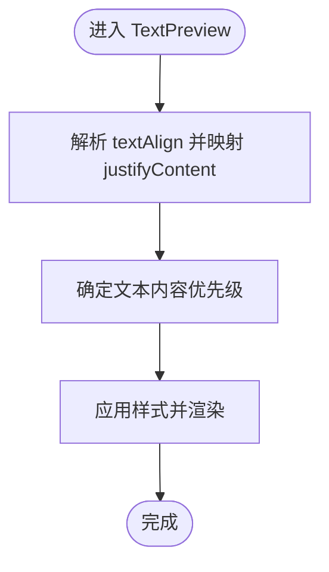

图表来源
- [TextPreview.tsx:10-28](file://designer/src/pages/Designer/components/Canvas/componentRenderers/TextPreview.tsx#L10-L28)

章节来源
- [TextPreview.tsx:1-31](file://designer/src/pages/Designer/components/Canvas/componentRenderers/TextPreview.tsx#L1-L31)
- [index.ts:123-138](file://designer/src/types/index.ts#L123-L138)

### 表格渲染器（TablePreview）
- Props 接口
  - component: ComponentNode
- 渲染逻辑
  - 列过滤：剔除 hidden 列后参与渲染。
  - 表头控制：showHeader 开关与 bordered 开关。
  - 内容占位：无数据时显示“暂无数据”，跨列居中。
  - 样式控制：字号、对齐方式、边框合并。
- 交互行为
  - 画布预览中仅展示结构与占位，不响应点击等事件。
- 复杂度
  - 渲染开销与可见列数量线性相关，时间复杂度 O(n)。

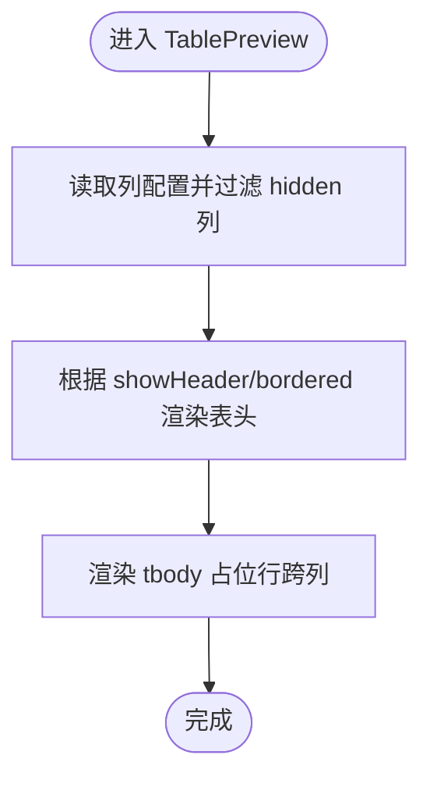

图表来源
- [TablePreview.tsx:10-54](file://designer/src/pages/Designer/components/Canvas/componentRenderers/TablePreview.tsx#L10-L54)

章节来源
- [TablePreview.tsx:1-56](file://designer/src/pages/Designer/components/Canvas/componentRenderers/TablePreview.tsx#L1-L56)
- [index.ts:108-121](file://designer/src/types/index.ts#L108-L121)

### 图片渲染器（ImagePreview）
- Props 接口
  - component: ComponentNode
- 渲染逻辑
  - 若存在 src，则以 img 渲染并设置最大宽高与对象填充策略。
  - 若不存在 src，则以占位容器展示“图片”提示与浅色背景。
- 交互行为
  - 画布预览中仅展示占位或图片，不涉及下载或错误处理。
- 复杂度
  - 时间复杂度 O(1)，空间复杂度 O(1)。

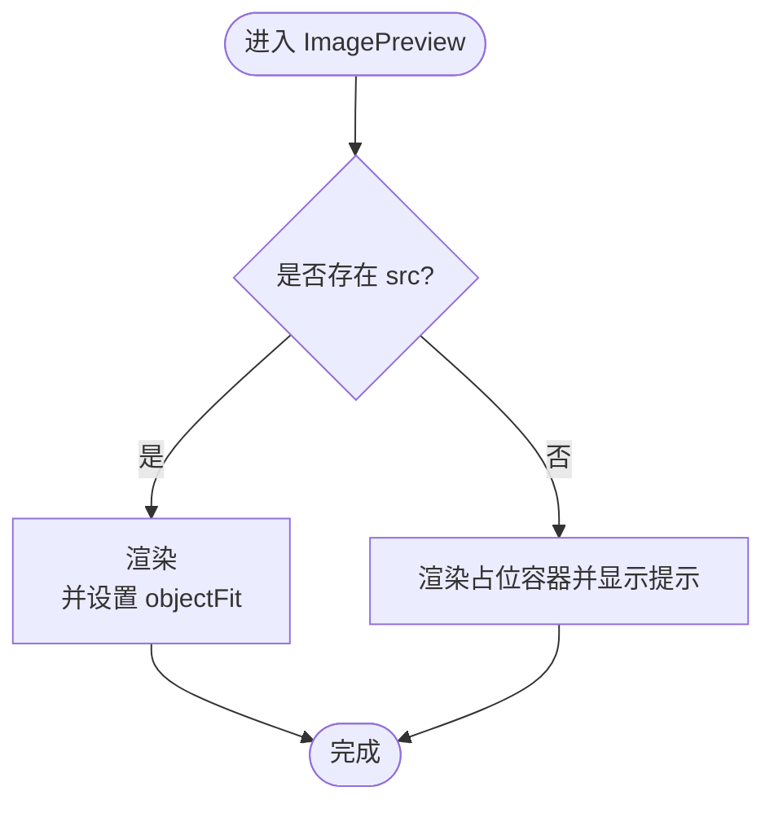

图表来源
- [ImagePreview.tsx:10-33](file://designer/src/pages/Designer/components/Canvas/componentRenderers/ImagePreview.tsx#L10-L33)

章节来源
- [ImagePreview.tsx:1-34](file://designer/src/pages/Designer/components/Canvas/componentRenderers/ImagePreview.tsx#L1-L34)

### 二维码渲染器（QRCodePreview）
- Props 接口
  - component: ComponentNode
- 渲染逻辑
  - 尺寸换算：将 mm 转换为 px（按约 3.78 的换算系数）。
  - 内容来源：binding.fallback > props.content > 默认值。
  - 委托渲染：将内容与尺寸传递给专用二维码组件。
- 交互行为
  - 画布预览中仅展示二维码图像，不涉及扫码交互。
- 复杂度
  - 时间复杂度 O(1)，空间复杂度 O(1)。

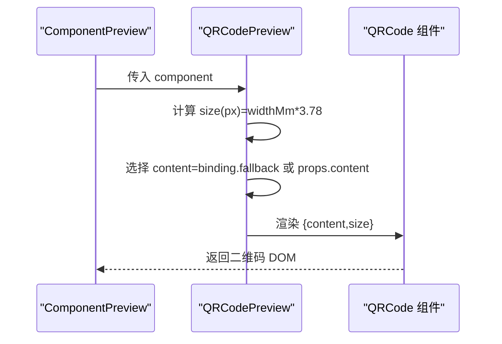

图表来源
- [QRCodePreview.tsx:11-16](file://designer/src/pages/Designer/components/Canvas/componentRenderers/QRCodePreview.tsx#L11-L16)

章节来源
- [QRCodePreview.tsx:1-17](file://designer/src/pages/Designer/components/Canvas/componentRenderers/QRCodePreview.tsx#L1-L17)

### 条形码渲染器（BarcodePreview）
- Props 接口
  - component: ComponentNode
- 渲染逻辑
  - 尺寸换算：widthMm/heightMm 乘以 3.78 得到 px。
  - 内容与格式：content 取 binding.fallback 或 props.content；format 取 props.format。
  - 委托渲染：将内容、格式与尺寸传递给专用条形码组件。
- 交互行为
  - 画布预览中仅展示条形码图像，不涉及扫描交互。
- 复杂度
  - 时间复杂度 O(1)，空间复杂度 O(1)。

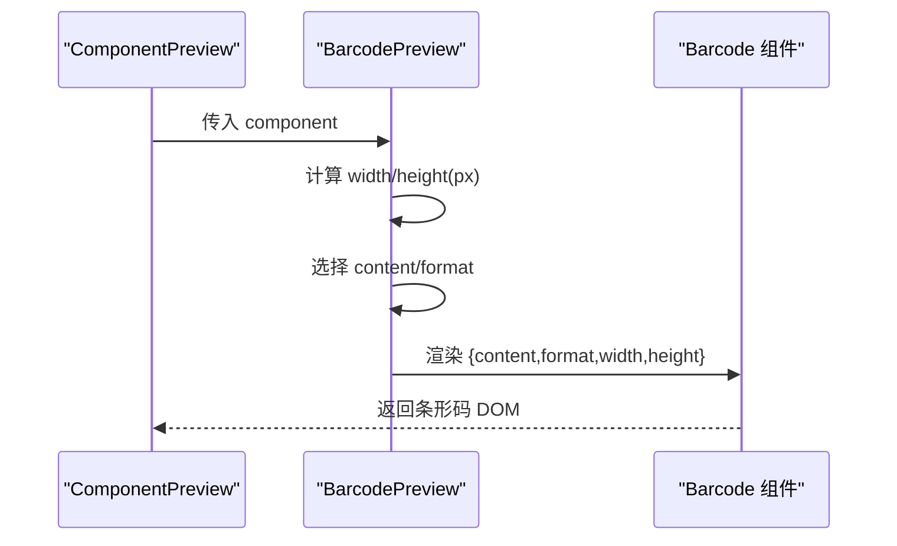

图表来源
- [BarcodePreview.tsx:11-25](file://designer/src/pages/Designer/components/Canvas/componentRenderers/BarcodePreview.tsx#L11-L25)

章节来源
- [BarcodePreview.tsx:1-26](file://designer/src/pages/Designer/components/Canvas/componentRenderers/BarcodePreview.tsx#L1-L26)

### 线条渲染器（LinePreview）
- Props 接口
  - component: ComponentNode
- 渲染逻辑
  - 通过上边框模拟线条：borderTopWidth/Style/Color。
  - 将像素线宽转换为 mm（约 1px ≈ 0.265mm），便于属性面板同步布局高度。
- 交互行为
  - 画布预览中仅展示线条，不响应交互。
- 复杂度
  - 时间复杂度 O(1)，空间复杂度 O(1)。

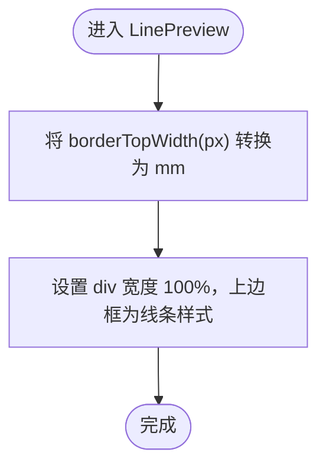

图表来源
- [LinePreview.tsx:10-29](file://designer/src/pages/Designer/components/Canvas/componentRenderers/LinePreview.tsx#L10-L29)

章节来源
- [LinePreview.tsx:1-31](file://designer/src/pages/Designer/components/Canvas/componentRenderers/LinePreview.tsx#L1-L31)

### 矩形渲染器（RectPreview）
- Props 接口
  - component: ComponentNode
- 渲染逻辑
  - 直接渲染容器：边框与背景色由样式控制。
  - 适合用作容器、分隔区域或装饰块。
- 交互行为
  - 画布预览中仅展示矩形外观，不响应交互。
- 复杂度
  - 时间复杂度 O(1)，空间复杂度 O(1)。

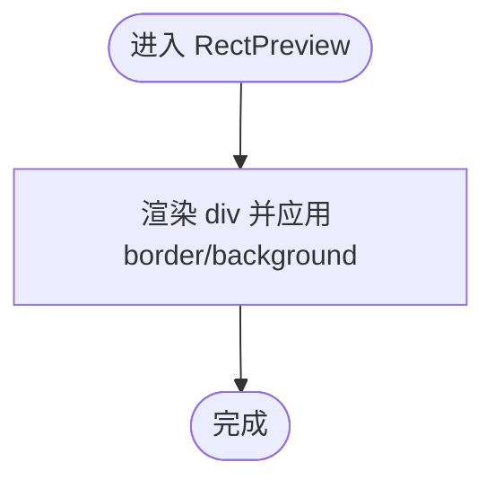

图表来源
- [RectPreview.tsx:10-18](file://designer/src/pages/Designer/components/Canvas/componentRenderers/RectPreview.tsx#L10-L18)

章节来源
- [RectPreview.tsx:1-20](file://designer/src/pages/Designer/components/Canvas/componentRenderers/RectPreview.tsx#L1-L20)

## 依赖关系分析
- 统一导出
  - 渲染器集合通过单一入口导出，便于集中管理与按需引入。
- 动态渲染
  - 画布预览组件根据组件类型进行 switch 分发，确保渲染器职责单一且可替换。
- 样式插件
  - 样式插件注册器负责维护组件类型到样式面板插件的映射，未匹配时回退到默认插件。
  - 文本、表格、线条分别拥有专属插件，其余组件共享默认插件。

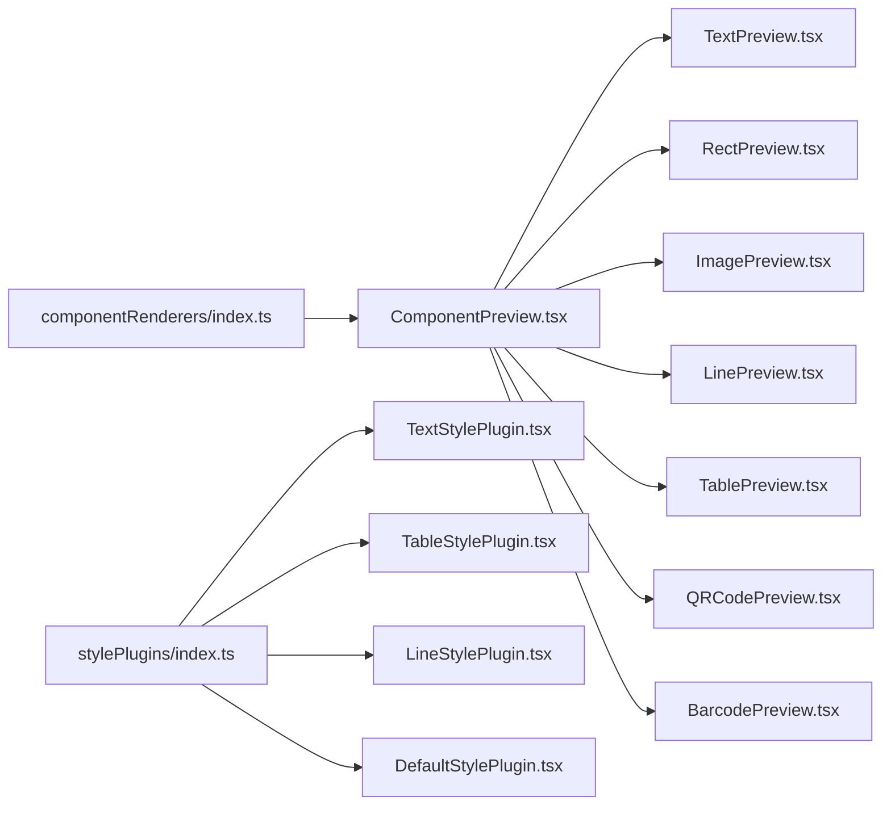

图表来源
- [index.ts:1-11](file://designer/src/pages/Designer/components/Canvas/componentRenderers/index.ts#L1-L11)
- [ComponentPreview.tsx:20-50](file://designer/src/pages/Designer/components/Canvas/ComponentPreview.tsx#L20-L50)
- [index.ts:12-47](file://designer/src/pages/Designer/components/PropertyPanel/stylePlugins/index.ts#L12-L47)

章节来源
- [index.ts:1-11](file://designer/src/pages/Designer/components/Canvas/componentRenderers/index.ts#L1-L11)
- [ComponentPreview.tsx:1-53](file://designer/src/pages/Designer/components/Canvas/ComponentPreview.tsx#L1-L53)
- [index.ts:12-47](file://designer/src/pages/Designer/components/PropertyPanel/stylePlugins/index.ts#L12-L47)

## 性能考量
- 渲染器均为纯函数组件，无副作用，渲染成本低。
- 文本与表格渲染器避免多余 DOM 层级，减少重排风险。
- 二维码与条形码渲染委托第三方组件，建议在画布预览中保持合理尺寸，避免过大像素导致渲染卡顿。
- 样式插件仅影响属性面板输入，不影响画布渲染性能。

## 故障排查指南
- 文本不显示或被截断
  - 检查 textAlign 与容器高度是否一致；确认 label/text/binding.path 是否正确设置。
- 表格无数据显示
  - 确认 columns 中未全部 hidden；检查 showHeader/bordered 设置。
- 图片不显示
  - 确认 src 是否为空；若为空将显示占位提示。
- 二维码/条形码空白
  - 检查 widthMm/heightMm 是否合理；确认 content/format 是否正确。
- 线条不可见
  - 检查 borderTopWidth 是否过小；确认样式中 border 的 style/color 是否有效。
- 样式面板不生效
  - 确认组件类型与插件名称一致；若未注册，将回退至默认插件。

章节来源
- [TextPreview.tsx:10-28](file://designer/src/pages/Designer/components/Canvas/componentRenderers/TextPreview.tsx#L10-L28)
- [TablePreview.tsx:10-54](file://designer/src/pages/Designer/components/Canvas/componentRenderers/TablePreview.tsx#L10-L54)
- [ImagePreview.tsx:10-33](file://designer/src/pages/Designer/components/Canvas/componentRenderers/ImagePreview.tsx#L10-L33)
- [QRCodePreview.tsx:11-16](file://designer/src/pages/Designer/components/Canvas/componentRenderers/QRCodePreview.tsx#L11-L16)
- [BarcodePreview.tsx:11-25](file://designer/src/pages/Designer/components/Canvas/componentRenderers/BarcodePreview.tsx#L11-L25)
- [LinePreview.tsx:10-29](file://designer/src/pages/Designer/components/Canvas/componentRenderers/LinePreview.tsx#L10-L29)
- [index.ts:12-47](file://designer/src/pages/Designer/components/PropertyPanel/stylePlugins/index.ts#L12-L47)

## 结论
该渲染器体系以“单一职责、统一导出、动态分发”为核心设计原则，既保证了画布预览的稳定与高效，又为后续扩展自定义渲染器提供了清晰的接口与最佳实践路径。

## 附录

### 渲染器注册机制与动态渲染流程
- 统一导出
  - 渲染器集合通过入口文件集中导出，便于集中管理与按需引入。
- 动态渲染
  - 画布预览组件根据组件类型进行 switch 分发，确保渲染器职责单一且可替换。
- 样式插件注册
  - 插件注册器使用 Map 维护组件类型到样式插件的映射，未匹配时回退默认插件。

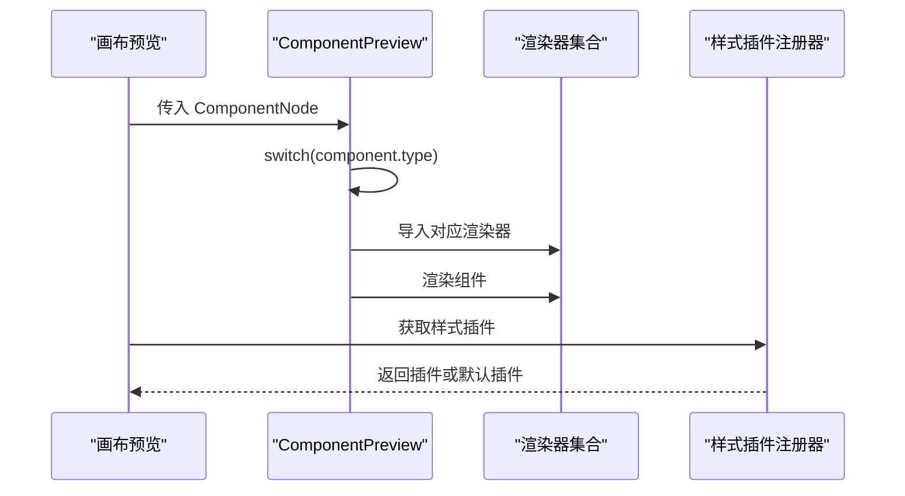

图表来源
- [ComponentPreview.tsx:20-50](file://designer/src/pages/Designer/components/Canvas/ComponentPreview.tsx#L20-L50)
- [index.ts:1-11](file://designer/src/pages/Designer/components/Canvas/componentRenderers/index.ts#L1-L11)
- [index.ts:12-47](file://designer/src/pages/Designer/components/PropertyPanel/stylePlugins/index.ts#L12-L47)

章节来源
- [index.ts:1-11](file://designer/src/pages/Designer/components/Canvas/componentRenderers/index.ts#L1-L11)
- [ComponentPreview.tsx:1-53](file://designer/src/pages/Designer/components/Canvas/ComponentPreview.tsx#L1-L53)
- [index.ts:12-47](file://designer/src/pages/Designer/components/PropertyPanel/stylePlugins/index.ts#L12-L47)

### 自定义渲染器开发指南
- 步骤
  - 新建文件：在渲染器集合目录新增自定义渲染器文件。
  - 接口规范：接收 props: { component: ComponentNode }，返回 JSX。
  - 样式与布局：优先使用 component.style 与 component.layout 的字段；必要时进行单位换算（mm→px）。
  - 导出与分发：在统一导出文件中导出自定义渲染器，并在画布预览组件的 switch 中添加对应分支。
  - 样式插件：若需要属性面板配置，编写样式插件并在注册器中注册。
- 最佳实践
  - 保持纯函数式渲染，避免副作用。
  - 对空值与异常输入做安全兜底（如占位提示）。
  - 与属性面板联动时，确保样式变更能同步到布局（如线条高度与 heightMm 的联动）。

章节来源
- [ComponentPreview.tsx:20-50](file://designer/src/pages/Designer/components/Canvas/ComponentPreview.tsx#L20-L50)
- [index.ts:12-47](file://designer/src/pages/Designer/components/PropertyPanel/stylePlugins/index.ts#L12-L47)
- [TextStylePlugin.tsx:11-78](file://designer/src/pages/Designer/components/PropertyPanel/stylePlugins/TextStylePlugin.tsx#L11-L78)
- [TableStylePlugin.tsx:11-46](file://designer/src/pages/Designer/components/PropertyPanel/stylePlugins/TableStylePlugin.tsx#L11-L46)
- [LineStylePlugin.tsx:11-70](file://designer/src/pages/Designer/components/PropertyPanel/stylePlugins/LineStylePlugin.tsx#L11-L70)
- [DefaultStylePlugin.tsx:12-30](file://designer/src/pages/Designer/components/PropertyPanel/stylePlugins/DefaultStylePlugin.tsx#L12-L30)