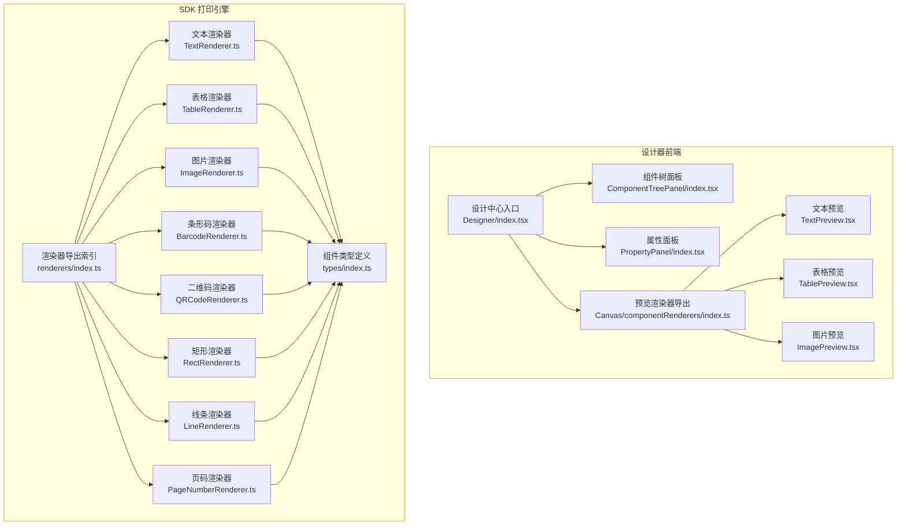
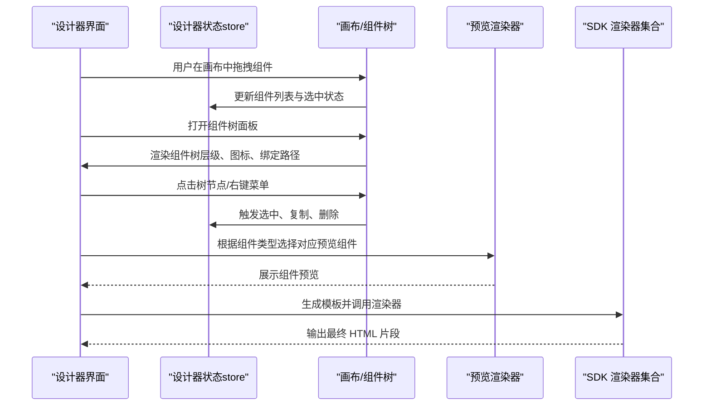
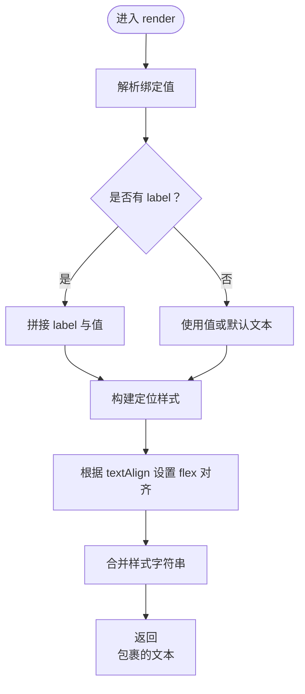
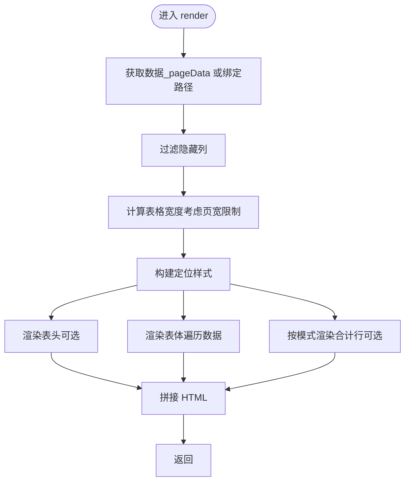
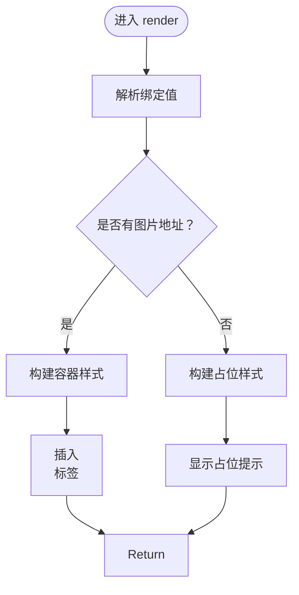
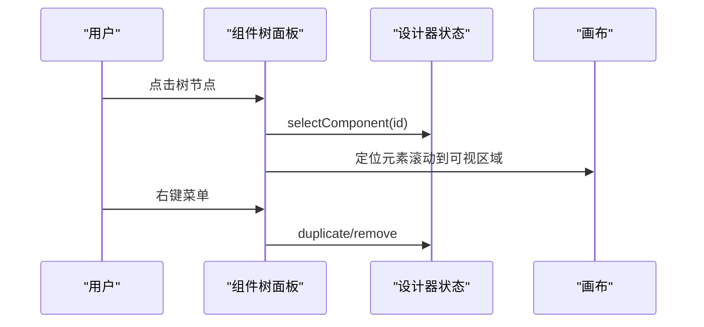
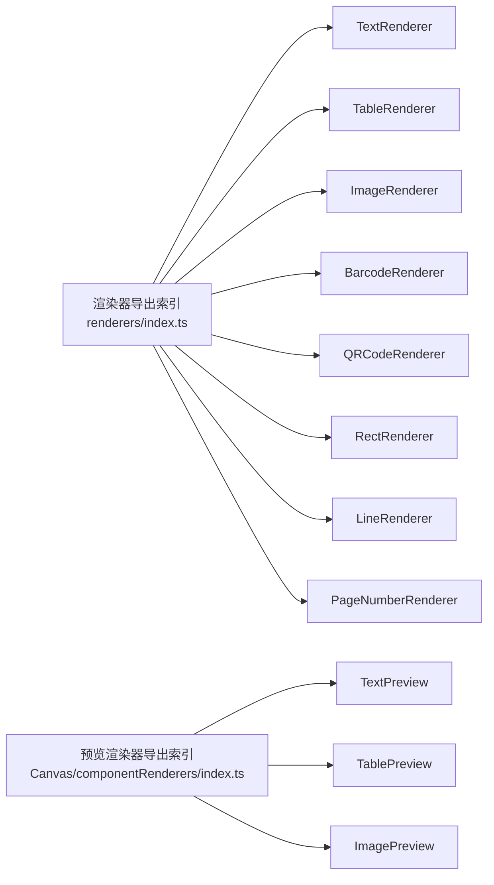

# 组件系统

<cite>
**本文引用的文件**
- [设计中心入口](file://designer/src/pages/Designer/index.tsx)
- [组件树面板](file://designer/src/pages/Designer/components/ComponentTreePanel/index.tsx)
- [属性面板](file://designer/src/pages/Designer/components/PropertyPanel/index.tsx)
- [渲染器导出索引（SDK）](file://sdk/src/printEngine/renderers/index.ts)
- [组件预览渲染器导出索引（设计器）](file://designer/src/pages/Designer/components/Canvas/componentRenderers/index.ts)
- [文本渲染器（SDK）](file://sdk/src/printEngine/renderers/TextRenderer.ts)
- [表格渲染器（SDK）](file://sdk/src/printEngine/renderers/TableRenderer.ts)
- [图片渲染器（SDK）](file://sdk/src/printEngine/renderers/ImageRenderer.ts)
- [条形码渲染器（SDK）](file://sdk/src/printEngine/renderers/BarcodeRenderer.ts)
- [二维码渲染器（SDK）](file://sdk/src/printEngine/renderers/QRCodeRenderer.ts)
- [矩形渲染器（SDK）](file://sdk/src/printEngine/renderers/RectRenderer.ts)
- [线条渲染器（SDK）](file://sdk/src/printEngine/renderers/LineRenderer.ts)
- [页码渲染器（SDK）](file://sdk/src/printEngine/renderers/PageNumberRenderer.ts)
- [文本预览（设计器）](file://designer/src/pages/Designer/components/Canvas/componentRenderers/TextPreview.tsx)
- [表格预览（设计器）](file://designer/src/pages/Designer/components/Canvas/componentRenderers/TablePreview.tsx)
- [图片预览（设计器）](file://designer/src/pages/Designer/components/Canvas/componentRenderers/ImagePreview.tsx)
- [组件类型定义](file://sdk/src/types/index.ts)
</cite>

## 目录
1. [简介](#简介)
2. [项目结构](#项目结构)
3. [核心组件](#核心组件)
4. [架构总览](#架构总览)
5. [详细组件分析](#详细组件分析)
6. [依赖关系分析](#依赖关系分析)
7. [性能考量](#性能考量)
8. [故障排查指南](#故障排查指南)
9. [结论](#结论)
10. [附录](#附录)

## 简介
本文件面向“组件系统”的技术文档，聚焦以下目标：
- 组件类型定义与组件渲染机制，涵盖 TextRenderer、TableRenderer、ImageRenderer 等8种内置组件的实现原理与差异点
- 组件树面板的功能与实现，包括层级展示、选择高亮、定位与删除操作
- 组件预览功能的技术实现，包括预览渲染器的注册机制与动态渲染过程
- 组件扩展开发指南，包括自定义组件的实现步骤与注册流程
- 提供具体代码示例路径与最佳实践建议

## 项目结构
组件系统主要分布在两个子工程：
- 设计器前端（designer）：负责组件库、画布、组件树面板、属性面板、组件预览等
- 打印引擎（SDK）：负责组件渲染器集合、渲染上下文、样式构建工具等

图表来源
- [设计中心入口:1-279](file://designer/src/pages/Designer/index.tsx#L1-L279)
- [组件树面板:1-176](file://designer/src/pages/Designer/components/ComponentTreePanel/index.tsx#L1-L176)
- [属性面板:1-129](file://designer/src/pages/Designer/components/PropertyPanel/index.tsx#L1-L129)
- [渲染器导出索引（SDK）:1-13](file://sdk/src/printEngine/renderers/index.ts#L1-L13)
- [组件预览渲染器导出索引（设计器）:1-11](file://designer/src/pages/Designer/components/Canvas/componentRenderers/index.ts#L1-L11)
- [文本渲染器（SDK）:1-60](file://sdk/src/printEngine/renderers/TextRenderer.ts#L1-L60)
- [表格渲染器（SDK）:1-275](file://sdk/src/printEngine/renderers/TableRenderer.ts#L1-L275)
- [图片渲染器（SDK）:1-55](file://sdk/src/printEngine/renderers/ImageRenderer.ts#L1-L55)
- [条形码渲染器（SDK）:1-63](file://sdk/src/printEngine/renderers/BarcodeRenderer.ts#L1-L63)
- [二维码渲染器（SDK）:1-63](file://sdk/src/printEngine/renderers/QRCodeRenderer.ts#L1-L63)
- [矩形渲染器（SDK）:1-39](file://sdk/src/printEngine/renderers/RectRenderer.ts#L1-L39)
- [线条渲染器（SDK）:1-59](file://sdk/src/printEngine/renderers/LineRenderer.ts#L1-L59)
- [页码渲染器（SDK）:1-105](file://sdk/src/printEngine/renderers/PageNumberRenderer.ts#L1-L105)
- [组件类型定义:1-160](file://sdk/src/types/index.ts#L1-L160)

章节来源
- [设计中心入口:1-279](file://designer/src/pages/Designer/index.tsx#L1-L279)
- [组件树面板:1-176](file://designer/src/pages/Designer/components/ComponentTreePanel/index.tsx#L1-L176)
- [属性面板:1-129](file://designer/src/pages/Designer/components/PropertyPanel/index.tsx#L1-L129)
- [渲染器导出索引（SDK）:1-13](file://sdk/src/printEngine/renderers/index.ts#L1-L13)
- [组件预览渲染器导出索引（设计器）:1-11](file://designer/src/pages/Designer/components/Canvas/componentRenderers/index.ts#L1-L11)
- [组件类型定义:1-160](file://sdk/src/types/index.ts#L1-L160)

## 核心组件
本节概述8种内置组件的职责与关键特性：
- 文本组件（text）：基于绑定或静态文本渲染，支持对齐、字号、颜色、字重等样式；使用 flex 布局实现水平对齐
- 表格组件（table）：支持列过滤、边框、表头、跨页重复表头、合计行（sum/avg/max/min/count），使用 Decimal.js 精确计算
- 图片组件（image）：优先使用绑定数据作为图片地址，容器严格按模板尺寸渲染，避免自适应导致排版错乱
- 矩形组件（rect）：纯背景与边框容器，用于占位或分隔
- 线条组件（line）：通过 border 实现水平/垂直线，采用双层容器结构以保证布局占位一致
- 二维码组件（qrcode）：在浏览器内同步生成二维码 base64 并嵌入 img 标签
- 条形码组件（barcode）：在浏览器内同步生成条形码 base64 并嵌入 img 标签
- 页码组件（pageNumber）：支持 simple/text/slash 三种格式，可注入当前页与总页数

章节来源
- [文本渲染器（SDK）:1-60](file://sdk/src/printEngine/renderers/TextRenderer.ts#L1-L60)
- [表格渲染器（SDK）:1-275](file://sdk/src/printEngine/renderers/TableRenderer.ts#L1-L275)
- [图片渲染器（SDK）:1-55](file://sdk/src/printEngine/renderers/ImageRenderer.ts#L1-L55)
- [矩形渲染器（SDK）:1-39](file://sdk/src/printEngine/renderers/RectRenderer.ts#L1-L39)
- [线条渲染器（SDK）:1-59](file://sdk/src/printEngine/renderers/LineRenderer.ts#L1-L59)
- [二维码渲染器（SDK）:1-63](file://sdk/src/printEngine/renderers/QRCodeRenderer.ts#L1-L63)
- [条形码渲染器（SDK）:1-63](file://sdk/src/printEngine/renderers/BarcodeRenderer.ts#L1-L63)
- [页码渲染器（SDK）:1-105](file://sdk/src/printEngine/renderers/PageNumberRenderer.ts#L1-L105)

## 架构总览
组件系统由“设计器前端”和“SDK 打印引擎”两部分协作构成：
- 设计器前端负责组件树、属性面板、画布与预览渲染器的组织与交互
- SDK 打印引擎负责组件渲染器集合、渲染上下文、样式构建与输出 HTML

图表来源
- [设计中心入口:1-279](file://designer/src/pages/Designer/index.tsx#L1-L279)
- [组件树面板:1-176](file://designer/src/pages/Designer/components/ComponentTreePanel/index.tsx#L1-L176)
- [属性面板:1-129](file://designer/src/pages/Designer/components/PropertyPanel/index.tsx#L1-L129)
- [组件预览渲染器导出索引（设计器）:1-11](file://designer/src/pages/Designer/components/Canvas/componentRenderers/index.ts#L1-L11)
- [渲染器导出索引（SDK）:1-13](file://sdk/src/printEngine/renderers/index.ts#L1-L13)

## 详细组件分析

### 组件类型定义与约束
- 组件类型枚举包含 text、image、rect、container、table、line、qrcode、barcode
- 组件节点包含布局（绝对/流式）、样式、数据绑定、属性与子节点
- 表格组件支持列定义、合计配置、跨页重复表头等高级能力
- 页码组件支持多种格式与对齐方式，并可注入当前页与总页数

章节来源
- [组件类型定义:64-160](file://sdk/src/types/index.ts#L64-L160)

### 文本组件（TextRenderer）
- 渲染逻辑：解析绑定值，支持 label 前缀拼接；使用 flex 布局实现对齐；支持字体、颜色、字重、行高等样式
- 高度计算：使用布局高度或默认值
- 预览逻辑：与渲染器保持一致的样式映射，但预览容器高度为 100%，文本截断策略不同

图表来源
- [文本渲染器（SDK）:13-53](file://sdk/src/printEngine/renderers/TextRenderer.ts#L13-L53)
- [文本预览（设计器）:10-30](file://designer/src/pages/Designer/components/Canvas/componentRenderers/TextPreview.tsx#L10-L30)

章节来源
- [文本渲染器（SDK）:1-60](file://sdk/src/printEngine/renderers/TextRenderer.ts#L1-L60)
- [文本预览（设计器）:1-31](file://designer/src/pages/Designer/components/Canvas/componentRenderers/TextPreview.tsx#L1-L31)

### 表格组件（TableRenderer）
- 渲染逻辑：支持绑定数据或分页数据；自动计算可用宽度并避免溢出；表头/表体/合计行三段式渲染；合计计算使用 Decimal.js
- 高度计算：根据表头、行数、合计行估算总高度
- 关键点：跨页重复表头、合计模式（每页/最后一页）、列过滤与对齐

图表来源
- [表格渲染器（SDK）:14-151](file://sdk/src/printEngine/renderers/TableRenderer.ts#L14-L151)

章节来源
- [表格渲染器（SDK）:1-275](file://sdk/src/printEngine/renderers/TableRenderer.ts#L1-L275)
- [表格预览（设计器）:1-56](file://designer/src/pages/Designer/components/Canvas/componentRenderers/TablePreview.tsx#L1-L56)

### 图片组件（ImageRenderer）
- 渲染逻辑：优先使用绑定值作为图片地址；容器严格按模板尺寸渲染；图片使用 object-fit 控制裁切
- 高度计算：使用布局高度或默认值
- 预览逻辑：无资源时显示占位提示；支持 objectFit 样式

图表来源
- [图片渲染器（SDK）:13-49](file://sdk/src/printEngine/renderers/ImageRenderer.ts#L13-L49)
- [图片预览（设计器）:10-33](file://designer/src/pages/Designer/components/Canvas/componentRenderers/ImagePreview.tsx#L10-L33)

章节来源
- [图片渲染器（SDK）:1-55](file://sdk/src/printEngine/renderers/ImageRenderer.ts#L1-L55)
- [图片预览（设计器）:1-34](file://designer/src/pages/Designer/components/Canvas/componentRenderers/ImagePreview.tsx#L1-L34)

### 矩形组件（RectRenderer）
- 渲染逻辑：容器背景与边框由样式控制；定位样式来自布局参数
- 高度计算：使用布局高度或默认值

章节来源
- [矩形渲染器（SDK）:1-39](file://sdk/src/printEngine/renderers/RectRenderer.ts#L1-L39)

### 线条组件（LineRenderer）
- 渲染逻辑：通过双层容器（外层 flex 居中 + 内层 border）实现水平/垂直线；根据方向切换边框方向
- 高度计算：返回外层容器高度（布局高度）

章节来源
- [线条渲染器（SDK）:1-59](file://sdk/src/printEngine/renderers/LineRenderer.ts#L1-L59)

### 二维码组件（QRCodeRenderer）
- 渲染逻辑：在浏览器内同步生成二维码到临时 canvas，转为 base64 并嵌入 img 标签；异常时返回占位提示
- 高度计算：使用布局高度或默认值

章节来源
- [二维码渲染器（SDK）:1-63](file://sdk/src/printEngine/renderers/QRCodeRenderer.ts#L1-L63)

### 条形码组件（BarcodeRenderer）
- 渲染逻辑：在浏览器内同步生成条形码到临时 canvas，转为 base64 并嵌入 img 标签；异常时返回占位提示
- 高度计算：使用布局高度或默认值

章节来源
- [条形码渲染器（SDK）:1-63](file://sdk/src/printEngine/renderers/BarcodeRenderer.ts#L1-L63)

### 页码组件（PageNumberRenderer）
- 渲染逻辑：根据格式（simple/text/slash）生成页码文本；支持前缀/后缀/分隔符；对齐方式与文本样式可配置
- 高度计算：使用布局高度或默认值

章节来源
- [页码渲染器（SDK）:1-105](file://sdk/src/printEngine/renderers/PageNumberRenderer.ts#L1-L105)

### 组件树面板（ComponentTreePanel）
- 功能：展示组件层级、图标映射、绑定路径提示；支持选中高亮、定位到画布、右键复制/删除
- 实现要点：将组件列表转换为 Ant Design Tree 的数据结构；选中时滚动到可视区域；右键菜单触发复制/删除

图表来源
- [组件树面板:74-173](file://designer/src/pages/Designer/components/ComponentTreePanel/index.tsx#L74-L173)

章节来源
- [组件树面板:1-176](file://designer/src/pages/Designer/components/ComponentTreePanel/index.tsx#L1-L176)

### 组件预览（ComponentPreview）
- 设计思路：预览渲染器与真实渲染器分离，便于在画布中快速预览而不引入复杂渲染上下文
- 注册机制：统一从 componentRenderers/index.ts 导出，按组件类型映射到对应预览组件
- 动态渲染：根据组件类型选择预览组件，传递组件节点 props，实现轻量级预览

章节来源
- [组件预览渲染器导出索引（设计器）:1-11](file://designer/src/pages/Designer/components/Canvas/componentRenderers/index.ts#L1-L11)
- [文本预览（设计器）:1-31](file://designer/src/pages/Designer/components/Canvas/componentRenderers/TextPreview.tsx#L1-L31)
- [表格预览（设计器）:1-56](file://designer/src/pages/Designer/components/Canvas/componentRenderers/TablePreview.tsx#L1-L56)
- [图片预览（设计器）:1-34](file://designer/src/pages/Designer/components/Canvas/componentRenderers/ImagePreview.tsx#L1-L34)

## 依赖关系分析
- 渲染器导出索引集中导出全部内置渲染器，便于上层按类型查找与调用
- 预览渲染器导出索引集中导出全部预览组件，便于画布侧按类型渲染
- 组件类型定义位于 SDK，被渲染器与设计器共同引用，确保类型一致性

图表来源
- [渲染器导出索引（SDK）:1-13](file://sdk/src/printEngine/renderers/index.ts#L1-L13)
- [组件预览渲染器导出索引（设计器）:1-11](file://designer/src/pages/Designer/components/Canvas/componentRenderers/index.ts#L1-L11)

章节来源
- [渲染器导出索引（SDK）:1-13](file://sdk/src/printEngine/renderers/index.ts#L1-L13)
- [组件预览渲染器导出索引（设计器）:1-11](file://designer/src/pages/Designer/components/Canvas/componentRenderers/index.ts#L1-L11)

## 性能考量
- 表格渲染：当数据量较大时，建议启用分页或虚拟化策略；合计计算使用 Decimal.js 保证精度但会增加 CPU 开销
- 二维码/条形码：在浏览器内同步生成图片，建议控制尺寸与刷新频率，避免频繁重绘
- 预览渲染器：预览组件仅做视觉示意，避免引入复杂上下文，提升交互流畅性
- 定位与溢出：表格宽度应考虑页边距与偏移，避免溢出导致重排与布局抖动

## 故障排查指南
- 绑定路径无效：检查 DataBinding 的 path 与 pipes 配置，确认数据源是否存在
- 表格溢出：查看日志中关于宽度溢出的警告，适当调整布局宽度或列宽
- 二维码/条形码失败：捕获异常并回退到占位提示，检查输入内容与格式配置
- 预览不一致：确认预览渲染器与真实渲染器的样式映射是否一致，避免视觉偏差

章节来源
- [表格渲染器（SDK）:48-56](file://sdk/src/printEngine/renderers/TableRenderer.ts#L48-L56)
- [二维码渲染器（SDK）:52-56](file://sdk/src/printEngine/renderers/QRCodeRenderer.ts#L52-L56)
- [条形码渲染器（SDK）:52-56](file://sdk/src/printEngine/renderers/BarcodeRenderer.ts#L52-L56)

## 结论
组件系统通过“类型定义—渲染器—预览渲染器—面板交互”的分层设计，实现了从可视化编辑到可打印输出的完整闭环。内置8种渲染器覆盖常见打印场景，组件树与属性面板提供直观的编辑体验。扩展开发时，遵循统一的类型与接口规范，即可快速接入新的组件类型。

## 附录

### 组件扩展开发指南
- 步骤一：定义组件类型与属性
  - 在组件类型定义中添加新类型与 props 接口
  - 示例参考：[组件类型定义:64-160](file://sdk/src/types/index.ts#L64-L160)
- 步骤二：实现渲染器
  - 实现 render 与 calculateHeight 方法，遵循现有渲染器风格
  - 示例参考：[文本渲染器:10-59](file://sdk/src/printEngine/renderers/TextRenderer.ts#L10-L59)
- 步骤三：注册渲染器
  - 在渲染器导出索引中导出新渲染器
  - 示例参考：[渲染器导出索引（SDK）:5-12](file://sdk/src/printEngine/renderers/index.ts#L5-L12)
- 步骤四：实现预览组件
  - 在预览渲染器导出索引中导出对应预览组件
  - 示例参考：[组件预览渲染器导出索引（设计器）:4-10](file://designer/src/pages/Designer/components/Canvas/componentRenderers/index.ts#L4-L10)
- 步骤五：集成到画布与组件树
  - 在画布与组件树面板中识别新类型并正确渲染与交互
  - 示例参考：[组件树面板:25-51](file://designer/src/pages/Designer/components/ComponentTreePanel/index.tsx#L25-L51)

### 最佳实践建议
- 统一样式构建：复用样式构建工具，确保渲染器与预览组件样式一致
- 边界与容错：对输入进行边界检查（如表格宽度、图片资源），并在异常时提供占位提示
- 数据绑定：合理使用 pipes 与 fallback，增强数据健壮性
- 高度估算：calculateHeight 应尽可能贴近真实渲染高度，减少布局抖动