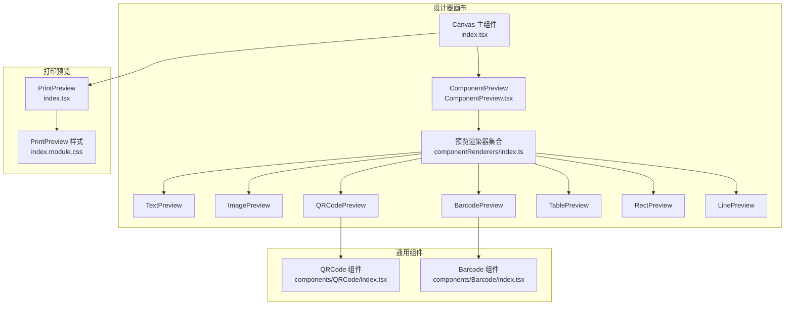
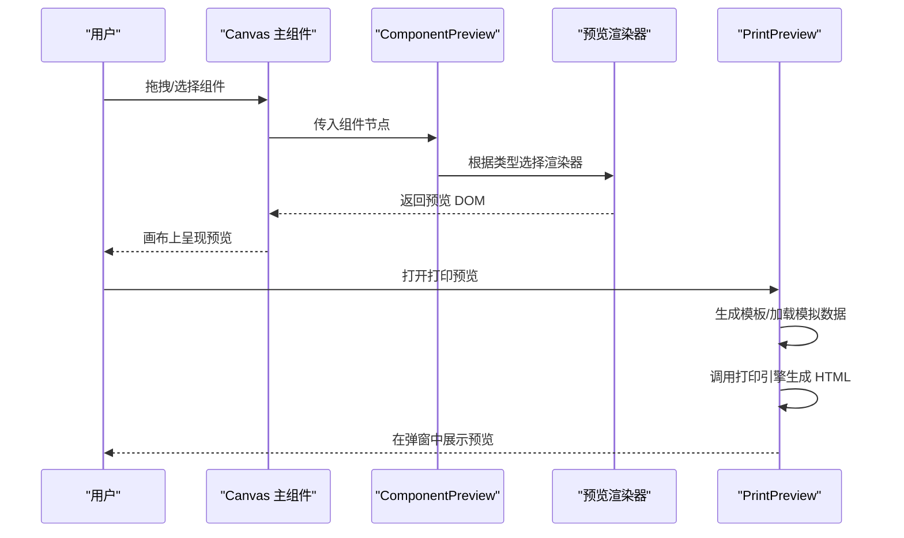
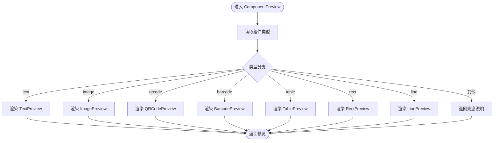
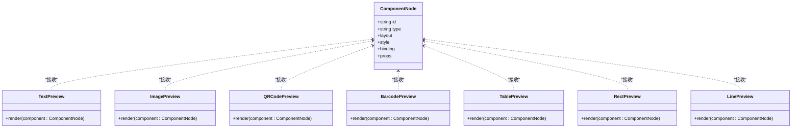
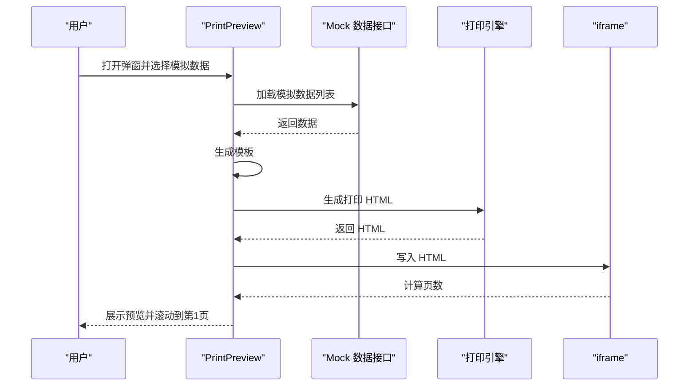
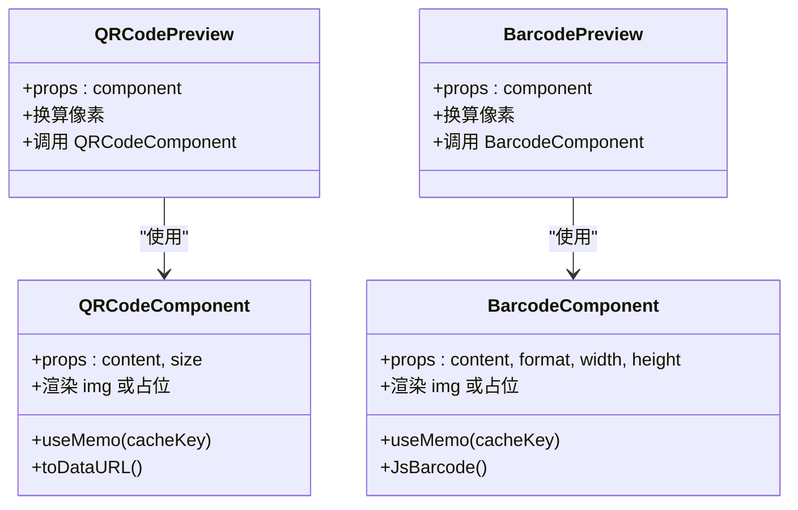
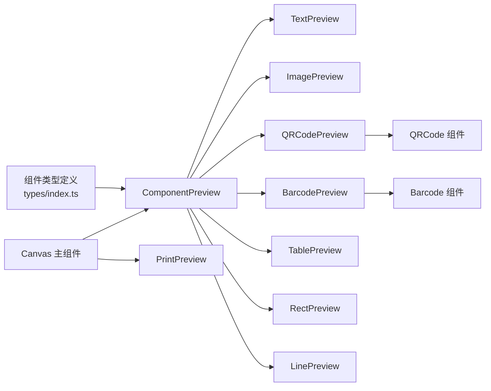

# 组件预览功能

<cite>
**本文引用的文件**
- [ComponentPreview.tsx](file://designer/src/pages/Designer/components/Canvas/ComponentPreview.tsx)
- [index.tsx（画布主组件）](file://designer/src/pages/Designer/components/Canvas/index.tsx)
- [index.ts（预览渲染器统一导出）](file://designer/src/pages/Designer/components/Canvas/componentRenderers/index.ts)
- [TextPreview.tsx](file://designer/src/pages/Designer/components/Canvas/componentRenderers/TextPreview.tsx)
- [ImagePreview.tsx](file://designer/src/pages/Designer/components/Canvas/componentRenderers/ImagePreview.tsx)
- [QRCodePreview.tsx](file://designer/src/pages/Designer/components/Canvas/componentRenderers/QRCodePreview.tsx)
- [BarcodePreview.tsx](file://designer/src/pages/Designer/components/Canvas/componentRenderers/BarcodePreview.tsx)
- [TablePreview.tsx](file://designer/src/pages/Designer/components/Canvas/componentRenderers/TablePreview.tsx)
- [RectPreview.tsx](file://designer/src/pages/Designer/components/Canvas/componentRenderers/RectPreview.tsx)
- [LinePreview.tsx](file://designer/src/pages/Designer/components/Canvas/componentRenderers/LinePreview.tsx)
- [index.tsx（打印预览）](file://designer/src/components/PrintPreview/index.tsx)
- [index.module.css（打印预览样式）](file://designer/src/components/PrintPreview/index.module.css)
- [index.tsx（条形码组件）](file://designer/src/components/Barcode/index.tsx)
- [index.tsx（二维码组件）](file://designer/src/components/QRCode/index.tsx)
- [index.ts（类型定义）](file://designer/src/types/index.ts)
- [index.module.css（画布样式）](file://designer/src/pages/Designer/components/Canvas/index.module.css)
</cite>

## 目录
1. [简介](#简介)
2. [项目结构](#项目结构)
3. [核心组件](#核心组件)
4. [架构总览](#架构总览)
5. [详细组件分析](#详细组件分析)
6. [依赖关系分析](#依赖关系分析)
7. [性能考量](#性能考量)
8. [故障排查指南](#故障排查指南)
9. [结论](#结论)
10. [附录](#附录)

## 简介
本文件系统性阐述组件预览功能的技术实现，重点覆盖以下方面：
- 组件预览器的统一管理与动态渲染机制
- ComponentPreview 组件的设计思路：预览容器、渲染器选择逻辑、预览状态管理
- 预览与真实渲染的差异与联系：预览模式下的性能优化与交互限制
- 扩展开发指南：如何新增自定义预览器与定制预览效果
- 实战建议与最佳实践

## 项目结构
组件预览功能主要分布在设计器画布模块与打印预览模块中：
- 画布层：负责组件在设计态的可视化预览，通过 ComponentPreview 动态路由到各组件预览渲染器
- 预览渲染器：针对不同组件类型提供轻量、可交互的预览实现
- 打印预览：负责将模板与模拟数据结合，生成最终可打印的 HTML 并在弹窗中展示

**图表来源**
- [index.tsx（画布主组件）:1-1006](file://designer/src/pages/Designer/components/Canvas/index.tsx#L1-L1006)
- [ComponentPreview.tsx:1-53](file://designer/src/pages/Designer/components/Canvas/ComponentPreview.tsx#L1-L53)
- [index.ts（预览渲染器统一导出）:1-11](file://designer/src/pages/Designer/components/Canvas/componentRenderers/index.ts#L1-L11)
- [index.tsx（打印预览）:1-325](file://designer/src/components/PrintPreview/index.tsx#L1-L325)

**章节来源**
- [index.tsx（画布主组件）:1-1006](file://designer/src/pages/Designer/components/Canvas/index.tsx#L1-L1006)
- [ComponentPreview.tsx:1-53](file://designer/src/pages/Designer/components/Canvas/ComponentPreview.tsx#L1-L53)
- [index.ts（预览渲染器统一导出）:1-11](file://designer/src/pages/Designer/components/Canvas/componentRenderers/index.ts#L1-L11)
- [index.tsx（打印预览）:1-325](file://designer/src/components/PrintPreview/index.tsx#L1-L325)

## 核心组件
- ComponentPreview：根据组件类型动态选择对应预览渲染器，作为画布上组件的“设计态”展示容器
- 预览渲染器集合：TextPreview、ImagePreview、QRCodePreview、BarcodePreview、TablePreview、RectPreview、LinePreview
- 打印预览：PrintPreview，负责将模板与模拟数据结合生成可打印 HTML，并在弹窗中展示

关键职责与关系：
- ComponentPreview 仅负责“选择器”，不承担具体渲染细节
- 预览渲染器专注于“轻量化预览”，避免真实渲染器的复杂逻辑
- 打印预览基于真实渲染引擎生成最终 HTML，确保与实际打印一致

**章节来源**
- [ComponentPreview.tsx:12-50](file://designer/src/pages/Designer/components/Canvas/ComponentPreview.tsx#L12-L50)
- [index.ts（预览渲染器统一导出）:1-11](file://designer/src/pages/Designer/components/Canvas/componentRenderers/index.ts#L1-L11)
- [index.tsx（打印预览）:10-325](file://designer/src/components/PrintPreview/index.tsx#L10-L325)

## 架构总览
组件预览的运行时流程如下：
- 设计态：画布组件渲染时，调用 ComponentPreview，依据组件类型选择对应预览渲染器
- 预览渲染器：直接使用组件的 props/style/binding 等属性进行轻量渲染
- 打印态：PrintPreview 生成模板与模拟数据，交由打印引擎生成完整 HTML，写入 iframe 展示

**图表来源**
- [index.tsx（画布主组件）:1-1006](file://designer/src/pages/Designer/components/Canvas/index.tsx#L1-L1006)
- [ComponentPreview.tsx:1-53](file://designer/src/pages/Designer/components/Canvas/ComponentPreview.tsx#L1-L53)
- [index.tsx（打印预览）:103-165](file://designer/src/components/PrintPreview/index.tsx#L103-L165)

## 详细组件分析

### ComponentPreview 组件
- 设计目标：在画布上以“轻量、快速、可交互”的方式展示组件预览
- 选择逻辑：通过组件类型分支，映射到对应的预览渲染器
- 容器职责：仅负责路由与兜底展示，不参与复杂逻辑
- 兜底策略：未知类型时返回简短说明文本，便于调试

**图表来源**
- [ComponentPreview.tsx:20-50](file://designer/src/pages/Designer/components/Canvas/ComponentPreview.tsx#L20-L50)

**章节来源**
- [ComponentPreview.tsx:12-50](file://designer/src/pages/Designer/components/Canvas/ComponentPreview.tsx#L12-L50)

### 预览渲染器集合
- TextPreview：基于组件样式与绑定路径，渲染文本预览，支持对齐与省略
- ImagePreview：优先展示图片，否则显示占位提示
- QRCodePreview：基于通用 QRCode 组件，按布局尺寸换算像素
- BarcodePreview：基于通用 Barcode 组件，按布局尺寸换算像素
- TablePreview：渲染表格骨架，支持表头开关与边框控制
- RectPreview：按样式渲染边框与背景
- LinePreview：按样式渲染线条，适配水平/垂直方向

**图表来源**
- [index.ts（类型定义）:123-138](file://designer/src/types/index.ts#L123-L138)
- [TextPreview.tsx:1-31](file://designer/src/pages/Designer/components/Canvas/componentRenderers/TextPreview.tsx#L1-L31)
- [ImagePreview.tsx:1-34](file://designer/src/pages/Designer/components/Canvas/componentRenderers/ImagePreview.tsx#L1-L34)
- [QRCodePreview.tsx:1-17](file://designer/src/pages/Designer/components/Canvas/componentRenderers/QRCodePreview.tsx#L1-L17)
- [BarcodePreview.tsx:1-26](file://designer/src/pages/Designer/components/Canvas/componentRenderers/BarcodePreview.tsx#L1-L26)
- [TablePreview.tsx:1-56](file://designer/src/pages/Designer/components/Canvas/componentRenderers/TablePreview.tsx#L1-L56)
- [RectPreview.tsx:1-20](file://designer/src/pages/Designer/components/Canvas/componentRenderers/RectPreview.tsx#L1-L20)
- [LinePreview.tsx:1-31](file://designer/src/pages/Designer/components/Canvas/componentRenderers/LinePreview.tsx#L1-L31)

**章节来源**
- [index.ts（预览渲染器统一导出）:1-11](file://designer/src/pages/Designer/components/Canvas/componentRenderers/index.ts#L1-L11)
- [TextPreview.tsx:7-30](file://designer/src/pages/Designer/components/Canvas/componentRenderers/TextPreview.tsx#L7-L30)
- [ImagePreview.tsx:7-33](file://designer/src/pages/Designer/components/Canvas/componentRenderers/ImagePreview.tsx#L7-L33)
- [QRCodePreview.tsx:8-16](file://designer/src/pages/Designer/components/Canvas/componentRenderers/QRCodePreview.tsx#L8-L16)
- [BarcodePreview.tsx:8-25](file://designer/src/pages/Designer/components/Canvas/componentRenderers/BarcodePreview.tsx#L8-L25)
- [TablePreview.tsx:7-55](file://designer/src/pages/Designer/components/Canvas/componentRenderers/TablePreview.tsx#L7-L55)
- [RectPreview.tsx:7-19](file://designer/src/pages/Designer/components/Canvas/componentRenderers/RectPreview.tsx#L7-L19)
- [LinePreview.tsx:7-30](file://designer/src/pages/Designer/components/Canvas/componentRenderers/LinePreview.tsx#L7-L30)

### 打印预览（PrintPreview）
- 功能定位：将模板与模拟数据结合，生成最终可打印 HTML，并在弹窗中展示
- 关键流程：
  - 选择模拟数据 → 生成模板 → 调用打印引擎生成 HTML → 写入 iframe → 计算页数并滚动到第一页
  - 支持单份与批量两种模式；批量模式会合并多份文档并在中间插入分隔
  - 打印时等待图片加载完成再触发打印，若失败仍允许打印
- 与设计态预览的关系：打印预览使用真实渲染引擎，确保与实际打印一致；设计态预览更关注“所见即所得”的交互体验

**图表来源**
- [index.tsx（打印预览）:85-201](file://designer/src/components/PrintPreview/index.tsx#L85-L201)

**章节来源**
- [index.tsx（打印预览）:10-325](file://designer/src/components/PrintPreview/index.tsx#L10-L325)
- [index.module.css（打印预览样式）:1-71](file://designer/src/components/PrintPreview/index.module.css#L1-L71)

### 通用组件（QRCode 与 Barcode）
- QRCode 组件：基于 qrcode 库生成二维码数据 URL，缓存渲染结果，避免重复计算
- Barcode 组件：基于 jsbarcode 生成条形码数据 URL，缓存渲染结果，避免重复计算
- 与预览的关系：QRCodePreview/BarcodePreview 直接复用这两个组件，按布局尺寸换算像素后传入

**图表来源**
- [index.tsx（二维码组件）:10-51](file://designer/src/components/QRCode/index.tsx#L10-L51)
- [index.tsx（条形码组件）:12-65](file://designer/src/components/Barcode/index.tsx#L12-L65)
- [QRCodePreview.tsx:11-15](file://designer/src/pages/Designer/components/Canvas/componentRenderers/QRCodePreview.tsx#L11-L15)
- [BarcodePreview.tsx:17-24](file://designer/src/pages/Designer/components/Canvas/componentRenderers/BarcodePreview.tsx#L17-L24)

**章节来源**
- [index.tsx（二维码组件）:1-52](file://designer/src/components/QRCode/index.tsx#L1-L52)
- [index.tsx（条形码组件）:1-66](file://designer/src/components/Barcode/index.tsx#L1-L66)
- [QRCodePreview.tsx:1-17](file://designer/src/pages/Designer/components/Canvas/componentRenderers/QRCodePreview.tsx#L1-L17)
- [BarcodePreview.tsx:1-26](file://designer/src/pages/Designer/components/Canvas/componentRenderers/BarcodePreview.tsx#L1-L26)

## 依赖关系分析
- 组件类型与渲染器的耦合：通过 ComponentPreview 的类型分支实现低耦合的动态路由
- 预览渲染器与通用组件的依赖：QRCodePreview/BarcodePreview 依赖通用组件，实现“预览态”的高质量渲染
- 打印预览与真实渲染：PrintPreview 依赖打印引擎，确保与真实打印一致

**图表来源**
- [index.ts（类型定义）:64-138](file://designer/src/types/index.ts#L64-L138)
- [ComponentPreview.tsx:20-50](file://designer/src/pages/Designer/components/Canvas/ComponentPreview.tsx#L20-L50)
- [index.tsx（打印预览）:1-325](file://designer/src/components/PrintPreview/index.tsx#L1-L325)

**章节来源**
- [index.ts（类型定义）:64-138](file://designer/src/types/index.ts#L64-L138)
- [ComponentPreview.tsx:1-53](file://designer/src/pages/Designer/components/Canvas/ComponentPreview.tsx#L1-L53)
- [index.tsx（打印预览）:1-325](file://designer/src/components/PrintPreview/index.tsx#L1-L325)

## 性能考量
- 预览渲染器的轻量化原则
  - 不引入复杂的状态管理与副作用，仅基于 props/style/binding 渲染
  - 使用 useMemo 缓存计算结果，减少重复渲染
- 通用组件的缓存策略
  - QRCode/Barcode 组件通过缓存 key 避免重复生成数据 URL
- 打印预览的异步与分页
  - 生成 HTML 后延迟计算页数，避免阻塞 UI
  - 批量模式下合并 HTML，减少多次写入开销
- 交互限制
  - 设计态预览不执行真实打印，避免不必要的资源消耗
  - 预览态不加载外部资源（如真实图片），降低网络与渲染压力

**章节来源**
- [TextPreview.tsx:10-30](file://designer/src/pages/Designer/components/Canvas/componentRenderers/TextPreview.tsx#L10-L30)
- [ImagePreview.tsx:10-33](file://designer/src/pages/Designer/components/Canvas/componentRenderers/ImagePreview.tsx#L10-L33)
- [QRCodePreview.tsx:11-15](file://designer/src/pages/Designer/components/Canvas/componentRenderers/QRCodePreview.tsx#L11-L15)
- [BarcodePreview.tsx:17-24](file://designer/src/pages/Designer/components/Canvas/componentRenderers/BarcodePreview.tsx#L17-L24)
- [index.tsx（二维码组件）:13-20](file://designer/src/components/QRCode/index.tsx#L13-L20)
- [index.tsx（条形码组件）:15-34](file://designer/src/components/Barcode/index.tsx#L15-L34)
- [index.tsx（打印预览）:34-53](file://designer/src/components/PrintPreview/index.tsx#L34-L53)

## 故障排查指南
- 预览空白或异常
  - 检查组件类型是否在 ComponentPreview 的分支中覆盖
  - 确认预览渲染器是否正确接收并使用组件的 props/style/binding
- 二维码/条形码未显示
  - 检查通用组件的缓存 key 是否正确更新（content/format/尺寸变化）
  - 确认预览渲染器传入的尺寸是否合理（mm→px 的换算）
- 打印预览无法分页或页码错误
  - 确认 iframe 写入完成后再计算页数
  - 检查批量模式下 HTML 合并逻辑与分隔符插入
- 性能问题
  - 预览渲染器中避免不必要的计算与副作用
  - 通用组件的缓存 key 应包含所有影响因素

**章节来源**
- [ComponentPreview.tsx:20-50](file://designer/src/pages/Designer/components/Canvas/ComponentPreview.tsx#L20-L50)
- [index.tsx（打印预览）:34-53](file://designer/src/components/PrintPreview/index.tsx#L34-L53)
- [index.tsx（二维码组件）:13-20](file://designer/src/components/QRCode/index.tsx#L13-L20)
- [index.tsx（条形码组件）:15-34](file://designer/src/components/Barcode/index.tsx#L15-L34)

## 结论
组件预览功能通过“统一选择器 + 轻量化渲染器”的架构，在保证设计态交互体验的同时，与真实打印保持一致的输出质量。其优势在于：
- 易扩展：新增组件只需新增预览渲染器并接入 ComponentPreview
- 易维护：预览渲染器职责单一，通用组件集中处理复杂计算
- 易迁移：打印预览与设计态预览解耦，互不影响

## 附录

### 扩展开发指南：新增自定义预览器
- 步骤
  - 在预览渲染器目录新增文件，导出函数式组件，接收组件节点参数
  - 在统一导出文件中注册新渲染器
  - 在 ComponentPreview 中增加类型分支，映射到新渲染器
  - 如需高质量图形，复用通用组件（QRCode/Barcode）
- 最佳实践
  - 仅使用必要的 props/style/binding，避免复杂逻辑
  - 使用 useMemo 缓存计算结果
  - 注意 mm→px 的换算，确保预览尺寸与布局一致

**章节来源**
- [index.ts（预览渲染器统一导出）:1-11](file://designer/src/pages/Designer/components/Canvas/componentRenderers/index.ts#L1-L11)
- [ComponentPreview.tsx:20-50](file://designer/src/pages/Designer/components/Canvas/ComponentPreview.tsx#L20-L50)

### 预览效果定制方法
- 文本预览：通过 style 对齐、颜色、字号等控制
- 图片预览：通过 style.objectFit 控制裁剪方式
- 表格预览：通过 props.columns 与 style.textAlign 控制表头与内容对齐
- 线条预览：通过 style.borderTopWidth/Style/Color 控制样式
- 二维码/条形码：通过布局尺寸换算像素，确保预览清晰

**章节来源**
- [TextPreview.tsx:10-28](file://designer/src/pages/Designer/components/Canvas/componentRenderers/TextPreview.tsx#L10-L28)
- [ImagePreview.tsx:10-32](file://designer/src/pages/Designer/components/Canvas/componentRenderers/ImagePreview.tsx#L10-L32)
- [TablePreview.tsx:10-54](file://designer/src/pages/Designer/components/Canvas/componentRenderers/TablePreview.tsx#L10-L54)
- [LinePreview.tsx:10-29](file://designer/src/pages/Designer/components/Canvas/componentRenderers/LinePreview.tsx#L10-L29)
- [QRCodePreview.tsx:11-15](file://designer/src/pages/Designer/components/Canvas/componentRenderers/QRCodePreview.tsx#L11-L15)
- [BarcodePreview.tsx:17-24](file://designer/src/pages/Designer/components/Canvas/componentRenderers/BarcodePreview.tsx#L17-L24)