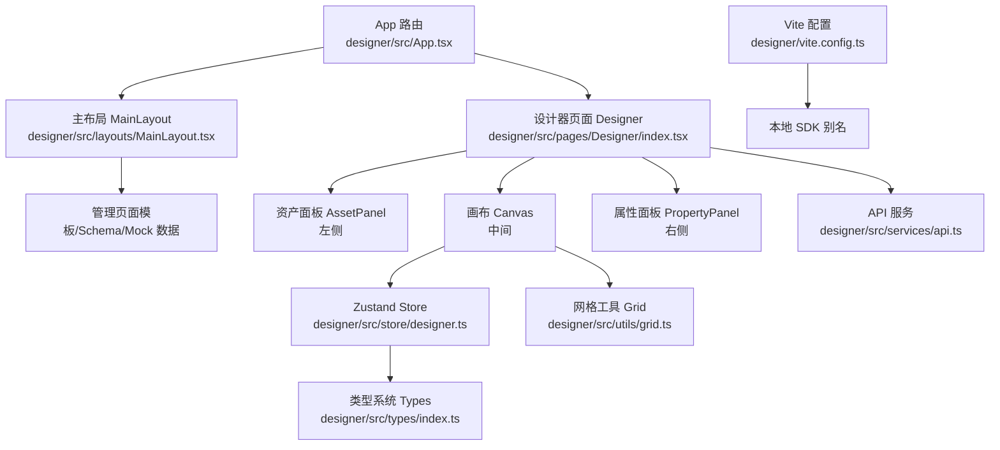
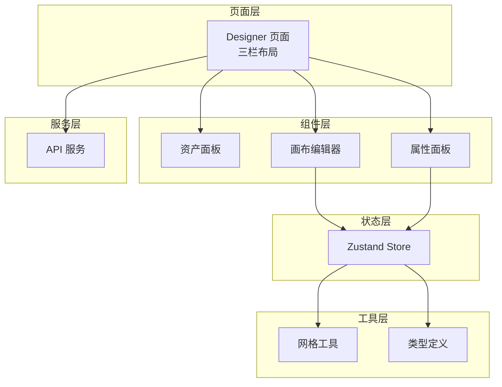
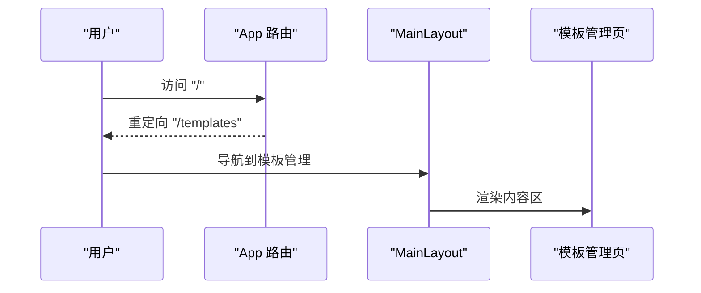
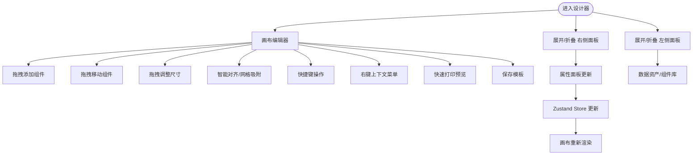
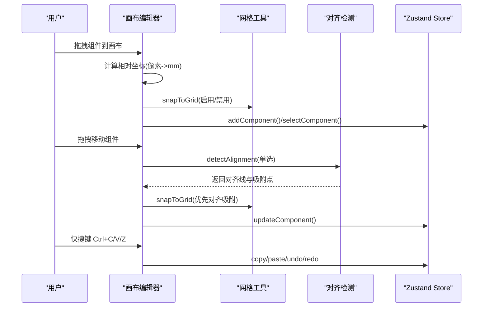
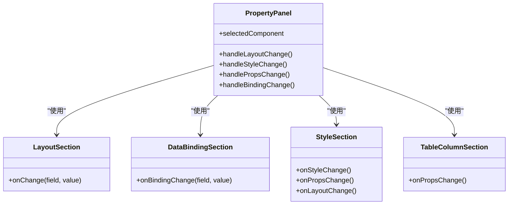
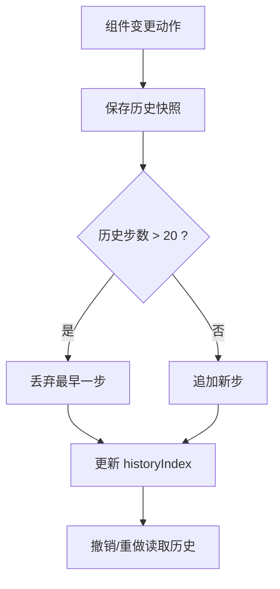
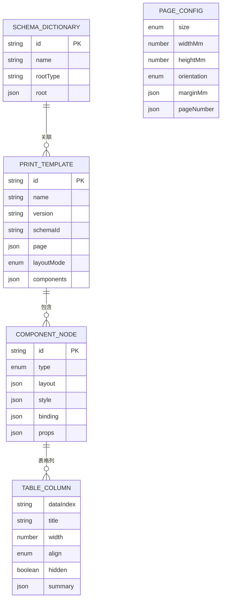
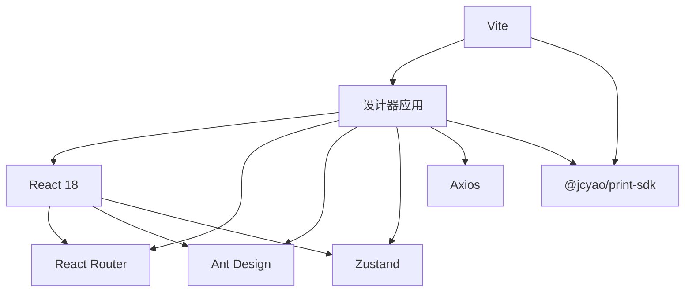

# 设计器前端应用

<cite>
**本文引用的文件**
- [designer/src/App.tsx](file://designer/src/App.tsx)
- [designer/src/main.tsx](file://designer/src/main.tsx)
- [designer/src/layouts/MainLayout.tsx](file://designer/src/layouts/MainLayout.tsx)
- [designer/src/pages/Designer/index.tsx](file://designer/src/pages/Designer/index.tsx)
- [designer/src/pages/Designer/components/Canvas/index.tsx](file://designer/src/pages/Designer/components/Canvas/index.tsx)
- [designer/src/pages/Designer/components/PropertyPanel/index.tsx](file://designer/src/pages/Designer/components/PropertyPanel/index.tsx)
- [designer/src/pages/Designer/components/AssetPanel/index.tsx](file://designer/src/pages/Designer/components/AssetPanel/index.tsx)
- [designer/src/store/designer.ts](file://designer/src/store/designer.ts)
- [designer/src/types/index.ts](file://designer/src/types/index.ts)
- [designer/src/utils/grid.ts](file://designer/src/utils/grid.ts)
- [designer/src/services/api.ts](file://designer/src/services/api.ts)
- [designer/vite.config.ts](file://designer/vite.config.ts)
- [designer/package.json](file://designer/package.json)
</cite>

## 目录
1. [简介](#简介)
2. [项目结构](#项目结构)
3. [核心组件](#核心组件)
4. [架构总览](#架构总览)
5. [详细组件分析](#详细组件分析)
6. [依赖关系分析](#依赖关系分析)
7. [性能考量](#性能考量)
8. [故障排查指南](#故障排查指南)
9. [结论](#结论)
10. [附录](#附录)

## 简介
本项目是一个基于 React 18 + TypeScript 的打印模板设计器前端应用，采用 Vite 构建与 Ant Design UI 组件库，使用 Zustand 管理全局状态，支持三栏布局（左侧数据资产树、中间画布编辑器、右侧属性面板），提供拖拽式设计、智能网格吸附、对齐参考线、撤销/重做、组件层级管理、页面设置等功能。本文档系统性介绍架构设计、组件层次、状态管理、路由配置以及可视化编辑器的关键能力，并给出最佳实践与排障建议。

## 项目结构
- 应用入口与路由
  - 入口文件负责挂载根组件，路由配置包含设计器全屏模式与管理页面布局。
  - 主布局组件提供侧边菜单导航，承载管理类页面内容区。
- 页面与组件
  - 设计器页面采用三栏布局：左侧资产面板（数据资产/组件库）、中间画布编辑器、右侧属性面板（含组件树）。
  - 画布编辑器为核心交互区，支持拖拽、缩放、对齐、吸附、快捷键、上下文菜单等。
  - 属性面板按区域拆分，分别处理布局、数据绑定、样式与表格列配置。
- 状态管理
  - 使用 Zustand Store 统一管理组件集合、选中状态、模板信息、页面配置、历史记录、网格与对齐工具等。
- 类型系统
  - 定义了 Schema、PageConfig、ComponentNode、PrintTemplate 等核心类型，保证数据结构一致性。
- 工具与服务
  - 网格工具提供吸附能力；API 服务封装后端接口；Vite 配置支持本地 SDK 开发联调。

**图示来源**
- [designer/src/App.tsx:1-31](file://designer/src/App.tsx#L1-L31)
- [designer/src/layouts/MainLayout.tsx:1-56](file://designer/src/layouts/MainLayout.tsx#L1-L56)
- [designer/src/pages/Designer/index.tsx:1-279](file://designer/src/pages/Designer/index.tsx#L1-L279)
- [designer/src/store/designer.ts:1-539](file://designer/src/store/designer.ts#L1-L539)
- [designer/src/types/index.ts:1-160](file://designer/src/types/index.ts#L1-L160)
- [designer/src/utils/grid.ts:1-36](file://designer/src/utils/grid.ts#L1-L36)
- [designer/src/services/api.ts:1-97](file://designer/src/services/api.ts#L1-L97)
- [designer/vite.config.ts:1-15](file://designer/vite.config.ts#L1-L15)

**章节来源**
- [designer/src/App.tsx:1-31](file://designer/src/App.tsx#L1-L31)
- [designer/src/main.tsx:1-8](file://designer/src/main.tsx#L1-L8)
- [designer/src/layouts/MainLayout.tsx:1-56](file://designer/src/layouts/MainLayout.tsx#L1-L56)
- [designer/src/pages/Designer/index.tsx:1-279](file://designer/src/pages/Designer/index.tsx#L1-L279)
- [designer/vite.config.ts:1-15](file://designer/vite.config.ts#L1-L15)

## 核心组件
- 路由与入口
  - 应用通过 BrowserRouter 配置路由，支持设计器全屏模式与管理页面布局。
  - 入口文件负责渲染根组件并挂载到 DOM。
- 主布局
  - 提供侧边菜单与内容区，支持模板管理、Schema 字典、Mock 数据导航。
- 设计器页面
  - 三栏布局：左侧资产面板、中间画布、右侧属性面板（含组件树）。
  - 提供悬浮操作按钮、抽屉调试面板、面板折叠控制。
- 画布编辑器
  - 支持拖拽添加组件、组件拖拽移动、尺寸调整、多选、键盘快捷键、上下文菜单、对齐参考线、网格吸附。
- 属性面板
  - 拆分为布局、数据绑定、样式（插件化）、表格列管理等区域，统一通过 Store 更新组件属性。
- 状态管理（Zustand）
  - 统一管理组件集合、选中状态、模板信息、页面配置、剪贴板、历史记录、网格与对齐工具、层级管理等。
- 类型系统
  - 定义 Schema 字段、页面配置、组件节点、打印模板、表格列、管道配置等类型。
- 工具与服务
  - 网格吸附工具；API 服务封装后端接口；Vite 别名指向本地 SDK 便于开发联调。

**章节来源**
- [designer/src/App.tsx:1-31](file://designer/src/App.tsx#L1-L31)
- [designer/src/main.tsx:1-8](file://designer/src/main.tsx#L1-L8)
- [designer/src/layouts/MainLayout.tsx:1-56](file://designer/src/layouts/MainLayout.tsx#L1-L56)
- [designer/src/pages/Designer/index.tsx:1-279](file://designer/src/pages/Designer/index.tsx#L1-L279)
- [designer/src/store/designer.ts:1-539](file://designer/src/store/designer.ts#L1-L539)
- [designer/src/types/index.ts:1-160](file://designer/src/types/index.ts#L1-L160)
- [designer/src/utils/grid.ts:1-36](file://designer/src/utils/grid.ts#L1-L36)
- [designer/src/services/api.ts:1-97](file://designer/src/services/api.ts#L1-L97)

## 架构总览
整体采用“页面层-组件层-状态层-工具层-服务层”的分层架构：
- 页面层：Designer 页面组织三栏布局与交互。
- 组件层：资产面板、画布、属性面板等模块化组件。
- 状态层：Zustand Store 统一管理全局状态与业务动作。
- 工具层：网格吸附、类型定义、常量等。
- 服务层：API 服务封装后端接口。

**图示来源**
- [designer/src/pages/Designer/index.tsx:1-279](file://designer/src/pages/Designer/index.tsx#L1-L279)
- [designer/src/store/designer.ts:1-539](file://designer/src/store/designer.ts#L1-L539)
- [designer/src/utils/grid.ts:1-36](file://designer/src/utils/grid.ts#L1-L36)
- [designer/src/types/index.ts:1-160](file://designer/src/types/index.ts#L1-L160)
- [designer/src/services/api.ts:1-97](file://designer/src/services/api.ts#L1-L97)

## 详细组件分析

### 路由与布局
- 路由配置
  - 设计器全屏模式路径为“/designer”，管理页面通过 MainLayout 包裹，包含模板管理、Schema 管理、Mock 数据三个子路由。
  - 默认路径重定向至模板管理。
- 主布局
  - 使用 Ant Design Layout/Sider/Content 组织侧边菜单与内容区。
  - 菜单项与当前路径联动，点击切换路由。

**图示来源**
- [designer/src/App.tsx:1-31](file://designer/src/App.tsx#L1-L31)
- [designer/src/layouts/MainLayout.tsx:1-56](file://designer/src/layouts/MainLayout.tsx#L1-L56)

**章节来源**
- [designer/src/App.tsx:1-31](file://designer/src/App.tsx#L1-L31)
- [designer/src/layouts/MainLayout.tsx:1-56](file://designer/src/layouts/MainLayout.tsx#L1-L56)

### 三栏布局设计与交互
- 左侧资产面板
  - 选项卡切换“数据资产”和“组件库”，分别承载数据字段拖拽与组件拖拽。
- 中间画布
  - 支持拖拽添加组件、组件拖拽移动、尺寸调整、多选、键盘快捷键、上下文菜单、对齐参考线、网格吸附。
- 右侧属性面板
  - 选项卡切换“组件树”和“属性配置”，属性面板按区域拆分，统一通过 Store 更新组件属性。
- 折叠控制
  - 左右面板支持折叠/展开，悬浮按钮组提供返回与调试入口。

**图示来源**
- [designer/src/pages/Designer/index.tsx:1-279](file://designer/src/pages/Designer/index.tsx#L1-L279)
- [designer/src/pages/Designer/components/Canvas/index.tsx:1-1006](file://designer/src/pages/Designer/components/Canvas/index.tsx#L1-L1006)
- [designer/src/pages/Designer/components/PropertyPanel/index.tsx:1-129](file://designer/src/pages/Designer/components/PropertyPanel/index.tsx#L1-L129)
- [designer/src/pages/Designer/components/AssetPanel/index.tsx:1-32](file://designer/src/pages/Designer/components/AssetPanel/index.tsx#L1-L32)

**章节来源**
- [designer/src/pages/Designer/index.tsx:1-279](file://designer/src/pages/Designer/index.tsx#L1-L279)
- [designer/src/pages/Designer/components/AssetPanel/index.tsx:1-32](file://designer/src/pages/Designer/components/AssetPanel/index.tsx#L1-L32)
- [designer/src/pages/Designer/components/PropertyPanel/index.tsx:1-129](file://designer/src/pages/Designer/components/PropertyPanel/index.tsx#L1-L129)

### 画布编辑器：拖拽、吸附与对齐
- 拖拽添加组件
  - 支持从组件库拖入与从数据资产拖入，自动计算可用区域与默认尺寸。
- 拖拽移动与吸附
  - 鼠标拖拽时计算偏移，应用网格吸附；按住 Shift 可临时禁用网格吸附。
- 智能对齐参考线
  - 单选拖拽时检测对齐，绘制对齐参考线并进行对齐吸附。
- 尺寸调整与边界约束
  - 支持四角/边缘拖拽调整尺寸，约束在页面有效区域内。
- 快捷键与上下文菜单
  - Delete/Backspace 删除；Ctrl+C/V/D 操作；右键菜单支持复制、克隆、层级管理、删除。
- 页面设置与连续纸模式
  - 支持 A4/A5/CUSTOM/CONTINUOUS 四种页面尺寸与方向，连续纸模式动态计算高度。

**图示来源**
- [designer/src/pages/Designer/components/Canvas/index.tsx:1-1006](file://designer/src/pages/Designer/components/Canvas/index.tsx#L1-L1006)
- [designer/src/utils/grid.ts:1-36](file://designer/src/utils/grid.ts#L1-L36)

**章节来源**
- [designer/src/pages/Designer/components/Canvas/index.tsx:1-1006](file://designer/src/pages/Designer/components/Canvas/index.tsx#L1-L1006)
- [designer/src/utils/grid.ts:1-36](file://designer/src/utils/grid.ts#L1-L36)

### 属性面板：布局、数据绑定与样式
- 结构拆分
  - 布局属性、数据绑定、样式（插件化）、表格列管理四个区域，分别处理不同维度的配置。
- 统一更新机制
  - 通过 Store 的 updateComponent 动作统一更新组件的 layout/style/props/binding 字段。
- 表格组件专项
  - 表格列管理支持列增删改、汇总配置、跨页重复表头等。

**图示来源**
- [designer/src/pages/Designer/components/PropertyPanel/index.tsx:1-129](file://designer/src/pages/Designer/components/PropertyPanel/index.tsx#L1-L129)

**章节来源**
- [designer/src/pages/Designer/components/PropertyPanel/index.tsx:1-129](file://designer/src/pages/Designer/components/PropertyPanel/index.tsx#L1-L129)

### 状态管理：Zustand Store
- 状态模型
  - 组件集合、选中状态、模板信息、页面配置、剪贴板、历史记录、网格与对齐工具、层级管理等。
- 功能要点
  - 组件增删改、多选、复制/粘贴/克隆、撤销/重做（最多 20 步）、对齐与分布、层级上下移动、网格开关与尺寸。
- 历史记录
  - 每次变更保存快照，限制最大步数，支持回退与前进。

**图示来源**
- [designer/src/store/designer.ts:1-539](file://designer/src/store/designer.ts#L1-L539)

**章节来源**
- [designer/src/store/designer.ts:1-539](file://designer/src/store/designer.ts#L1-L539)

### 类型系统与数据模型
- 核心类型
  - Schema 字段类型、Schema 字典、页面配置（尺寸、方向、边距、页码）、组件节点（布局、样式、绑定、props）、打印模板、表格列与汇总配置、管道配置等。
- 作用
  - 统一前后端数据契约，保障 Store 与 API 交互的数据结构正确性。

**图示来源**
- [designer/src/types/index.ts:1-160](file://designer/src/types/index.ts#L1-L160)

**章节来源**
- [designer/src/types/index.ts:1-160](file://designer/src/types/index.ts#L1-L160)

### 组件库与可视化渲染
- 组件库
  - 资产面板包含“数据资产”和“组件库”两个选项卡，分别承载数据字段与组件拖拽。
- 可视化渲染
  - 画布根据组件类型渲染对应预览组件（文本、图片、矩形、线条、表格、二维码、条形码等），支持预览与编辑。

**章节来源**
- [designer/src/pages/Designer/components/AssetPanel/index.tsx:1-32](file://designer/src/pages/Designer/components/AssetPanel/index.tsx#L1-L32)

## 依赖关系分析
- 依赖概览
  - React 18、React Router、Ant Design、Zustand、Axios、Monaco Editor、@jcyao/print-sdk 等。
- 关键依赖
  - Zustand：全局状态管理，替代 Redux。
  - Ant Design：UI 组件库，提供布局、表单、模态框、抽屉等。
  - Axios：HTTP 客户端，封装后端 API。
  - Vite：构建工具，配置本地 SDK 别名，便于开发联调。

**图示来源**
- [designer/package.json:1-43](file://designer/package.json#L1-L43)
- [designer/vite.config.ts:1-15](file://designer/vite.config.ts#L1-L15)

**章节来源**
- [designer/package.json:1-43](file://designer/package.json#L1-L43)
- [designer/vite.config.ts:1-15](file://designer/vite.config.ts#L1-L15)

## 性能考量
- 状态粒度与更新范围
  - Store 将组件集合、选中状态、模板信息等集中管理，避免跨组件重复订阅；对齐与吸附在画布层局部计算，减少全局重渲染。
- 渲染优化
  - 属性面板按区域拆分，仅在选中组件变化时重渲染；组件库与数据资产采用 Tab 切换，降低一次性渲染压力。
- 网格与对齐
  - 网格吸附与对齐检测在拖拽过程中按需触发，避免高频重绘；Shift 临时禁用吸附提升交互体验。
- 构建与开发
  - Vite 提供快速冷启动与热更新；本地 SDK 别名减少打包体积与联调成本。

## 故障排查指南
- 无法加载模板
  - 检查后端服务是否运行、API 基础地址是否正确、网络请求是否被拦截。
  - 在调试抽屉中查看模板 JSON 与组件数量，定位加载失败原因。
- 画布空白或组件不可见
  - 检查页面尺寸与方向设置，确认组件坐标与尺寸未越界；连续纸模式下注意动态高度计算。
- 拖拽无效或吸附异常
  - 确认网格开关与网格尺寸设置；按住 Shift 可临时禁用吸附；检查浏览器事件监听是否正常。
- 快捷键无响应
  - 确保焦点不在输入框或可编辑区域；确认键盘事件监听未被覆盖。
- 属性更新未生效
  - 检查 Store 的 updateComponent 调用链路；确认选中组件存在且字段名正确。

**章节来源**
- [designer/src/pages/Designer/index.tsx:1-279](file://designer/src/pages/Designer/index.tsx#L1-L279)
- [designer/src/pages/Designer/components/Canvas/index.tsx:1-1006](file://designer/src/pages/Designer/components/Canvas/index.tsx#L1-L1006)
- [designer/src/services/api.ts:1-97](file://designer/src/services/api.ts#L1-L97)

## 结论
本设计器前端应用以 React 18 + TypeScript 为基础，结合 Ant Design 与 Zustand，构建了清晰的三层布局与完善的画布编辑能力。通过统一的状态管理、类型系统与工具层支持，实现了拖拽式设计、智能网格吸附与对齐参考线、撤销/重做、组件层级管理等核心功能。配合模块化的属性面板与组件库，满足打印模板设计的高效与易用需求。建议在后续迭代中持续完善 API 与错误处理、扩展更多组件类型与样式插件，并引入更丰富的数据绑定与管道能力。

## 附录
- 最佳实践
  - 使用 Store 管理全局状态，避免跨组件重复订阅；对齐与吸附在画布层局部处理，减少全局重渲染。
  - 属性面板按区域拆分，统一通过 updateComponent 更新组件属性，保持数据一致性。
  - 为关键交互（拖拽、吸附、对齐）提供可视化反馈（参考线、提示气泡）。
  - 为组件库与数据资产采用 Tab 切换，降低一次性渲染压力。
  - 在开发阶段利用 Vite 别名与本地 SDK 联调，提升迭代效率。
- 常见问题
  - 模板加载失败：检查后端服务与网络；在调试抽屉中核对模板 JSON。
  - 画布越界：检查页面尺寸与组件坐标；连续纸模式注意动态高度。
  - 快捷键冲突：确保焦点不在输入框；避免第三方库覆盖键盘事件。