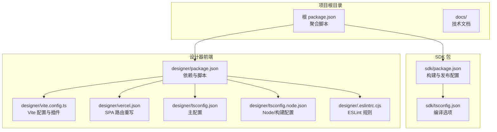
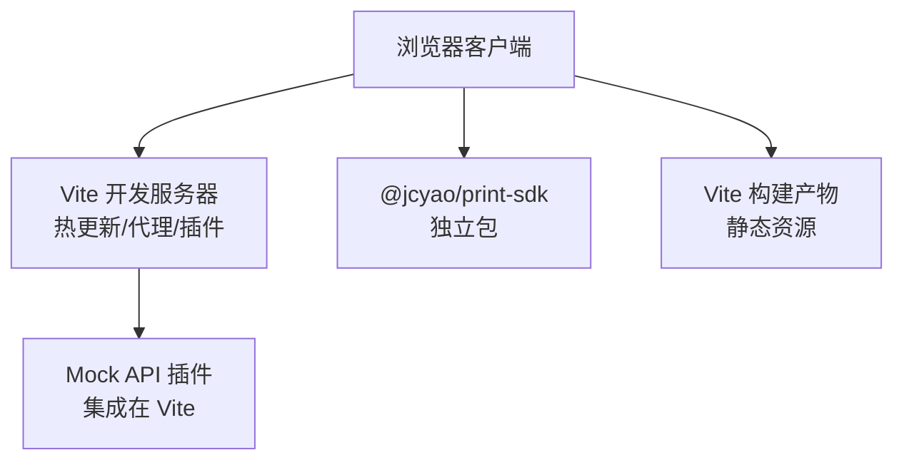
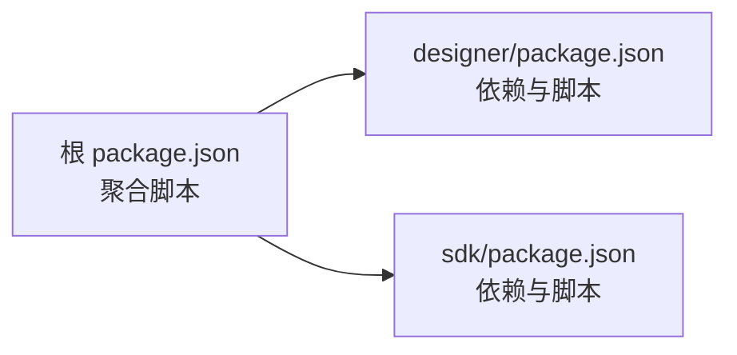

# 部署运维指南

<cite>
**本文引用的文件**
- [package.json](file://package.json)
- [README.md](file://README.md)
- [designer/package.json](file://designer/package.json)
- [designer/vite.config.ts](file://designer/vite.config.ts)
- [designer/vercel.json](file://designer/vercel.json)
- [designer/tsconfig.json](file://designer/tsconfig.json)
- [designer/tsconfig.node.json](file://designer/tsconfig.node.json)
- [designer/.eslintrc.cjs](file://designer/.eslintrc.cjs)
- [sdk/package.json](file://sdk/package.json)
- [sdk/tsconfig.json](file://sdk/tsconfig.json)
</cite>

## 目录
1. [简介](#简介)
2. [项目结构](#项目结构)
3. [核心组件](#核心组件)
4. [架构总览](#架构总览)
5. [详细组件分析](#详细组件分析)
6. [依赖分析](#依赖分析)
7. [性能考虑](#性能考虑)
8. [故障排查指南](#故障排查指南)
9. [结论](#结论)
10. [附录](#附录)

## 简介
本指南面向运维与开发团队，提供该打印服务平台的部署与运维实践，涵盖开发环境搭建、生产部署、容器化与编排、CI/CD 流水线、性能监控与日志管理、故障排查、安全与权限、版本发布与回滚策略以及监控与告警配置。项目由“设计器”前端应用与“SDK”两个主要模块组成，采用 Vite + React + TypeScript 技术栈，并通过 Vercel JSON 配置实现 SPA 单页路由。

## 项目结构
项目采用多包结构，核心模块包括：
- sdk：独立的打印 SDK 包，提供纯前端打印能力，支持浏览器端直接使用
- designer：可视化模板设计器前端应用，内置 Mock API 服务，无需后端即可运行
- docs：技术文档与需求文档（用于参考）

图表来源
- [package.json:1-10](file://package.json#L1-L10)
- [sdk/package.json:1-61](file://sdk/package.json#L1-L61)
- [sdk/tsconfig.json:1-17](file://sdk/tsconfig.json#L1-L17)
- [designer/package.json:1-46](file://designer/package.json#L1-L46)
- [designer/vite.config.ts:1-29](file://designer/vite.config.ts#L1-L29)
- [designer/vercel.json:1-6](file://designer/vercel.json#L1-L6)
- [designer/tsconfig.json:1-26](file://designer/tsconfig.json#L1-L26)
- [designer/tsconfig.node.json:1-12](file://designer/tsconfig.node.json#L1-L12)
- [designer/.eslintrc.cjs:1-19](file://designer/.eslintrc.cjs#L1-L19)

章节来源
- [README.md:369-406](file://README.md#L369-L406)
- [package.json:1-10](file://package.json#L1-L10)

## 核心组件
- SDK（打印引擎与工具集）
  - 用途：提供纯前端打印能力，支持浏览器端模板渲染与打印；打包为 ESM/CJS，便于在多种环境中使用
  - 关键配置：构建脚本、入口文件、类型声明、依赖与发布配置
- 设计器（可视化模板设计器）
  - 用途：提供拖拽式模板设计、属性配置、打印预览与 Mock 数据管理
  - 关键配置：Vite 开发与构建配置、Monaco 编辑器插件、Mock API 插件、TypeScript 编译选项、ESLint 规则

章节来源
- [sdk/package.json:1-61](file://sdk/package.json#L1-L61)
- [sdk/tsconfig.json:1-17](file://sdk/tsconfig.json#L1-L17)
- [designer/package.json:1-46](file://designer/package.json#L1-L46)
- [designer/vite.config.ts:1-29](file://designer/vite.config.ts#L1-L29)
- [designer/tsconfig.json:1-26](file://designer/tsconfig.json#L1-L26)
- [designer/tsconfig.node.json:1-12](file://designer/tsconfig.node.json#L1-L12)
- [designer/.eslintrc.cjs:1-19](file://designer/.eslintrc.cjs#L1-L19)

## 架构总览
系统采用“前端即服务”的架构：设计器作为单页应用（SPA），通过 Vite 提供开发与构建能力；SDK 以独立包形式发布，供外部项目集成。Mock API 服务内置于 Vite 插件中，无需额外后端服务即可运行。

图表来源
- [designer/vite.config.ts:1-29](file://designer/vite.config.ts#L1-L29)
- [designer/vercel.json:1-6](file://designer/vercel.json#L1-L6)
- [sdk/package.json:1-61](file://sdk/package.json#L1-L61)

## 详细组件分析

### 开发环境搭建
- 系统要求
  - Node.js 与包管理器（建议使用 pnpm，仓库中存在 pnpm-lock 文件）
  - Git
- 步骤
  - 安装根依赖：在项目根目录执行安装命令
  - 进入设计器目录，安装依赖并启动开发服务器
  - 若需本地联调 SDK，Vite 在开发模式下会将 @jcyao/print-sdk 指向当前仓库的 SDK 源码
- 关键配置
  - Vite 配置启用 React 插件与 Monaco 编辑器插件，并挂载 Mock API 插件
  - TypeScript 编译选项针对主应用与 Node/构建分别设置
  - ESLint 规则保证代码质量

章节来源
- [package.json:1-10](file://package.json#L1-L10)
- [designer/package.json:1-46](file://designer/package.json#L1-L46)
- [designer/vite.config.ts:1-29](file://designer/vite.config.ts#L1-L29)
- [designer/tsconfig.json:1-26](file://designer/tsconfig.json#L1-L26)
- [designer/tsconfig.node.json:1-12](file://designer/tsconfig.node.json#L1-L12)
- [designer/.eslintrc.cjs:1-19](file://designer/.eslintrc.cjs#L1-L19)

### 生产环境部署
- 部署目标
  - 将设计器构建产物部署到静态站点或反向代理（Nginx/Apache/Tengine）
  - SDK 作为 npm 包发布，供外部项目通过 npm 安装使用
- 构建与发布
  - 设计器：执行构建脚本生成静态资源
  - SDK：执行构建脚本生成 ESM/CJS 产物与类型声明
- 路由与 SPA
  - 使用 Vercel JSON 配置实现前端路由重写，确保刷新不会返回 404

章节来源
- [designer/package.json:1-46](file://designer/package.json#L1-L46)
- [sdk/package.json:1-61](file://sdk/package.json#L1-L61)
- [designer/vercel.json:1-6](file://designer/vercel.json#L1-L6)

### Docker 容器化部署方案
- 设计思路
  - 使用 Nginx 镜像作为静态站点容器，挂载设计器构建产物
  - SDK 不需要容器化，直接通过 npm 发布与消费
- 推荐步骤
  - 在 CI 中构建设计器产物
  - 使用多阶段构建或直接将 dist 目录复制到 Nginx 官方镜像
  - 配置 Nginx 将所有未匹配路径重写到 index.html（与 Vercel JSON 一致）
- 注意事项
  - 由于项目为前端单页应用，容器内只需提供静态文件服务
  - 如需 Mock API，可在同一容器内运行或通过反向代理转发到后端服务

（本节为通用容器化实践说明，未直接分析具体文件，故不附加章节来源）

### Kubernetes 部署配置
- 设计思路
  - 使用 Deployment 部署 Nginx 服务，暴露为 Service
  - 使用 Ingress 控制器提供域名与 TLS 终止
  - ConfigMap/Secret 管理静态站点配置与证书
- 推荐步骤
  - 构建 Nginx 镜像并推送至镜像仓库
  - 定义 Deployment、Service、Ingress、ConfigMap、Secret
  - 通过 Helm 或 Kustomize 管理清单
- 注意事项
  - Ingress 需要与 Vercel JSON 的 SPA 路由行为保持一致
  - 如需 Mock API，另起 Pod 并通过 Service 暴露

（本节为通用 Kubernetes 实践说明，未直接分析具体文件，故不附加章节来源）

### CI/CD 流水线与自动化部署
- 构建与测试
  - 设计器：安装依赖、TypeScript 编译、Vite 构建、ESLint 检查
  - SDK：安装依赖、Rollup 构建、生成类型声明
- 发布策略
  - SDK：通过 npm 发布（公开注册表），版本号与变更记录随版本迭代
  - 设计器：构建产物上传至对象存储或直接部署到静态站点
- 自动化建议
  - 使用工作流触发器（分支/标签/PR）
  - 缓存依赖与构建产物，加速流水线
  - 构建完成后进行健康检查与安全扫描

章节来源
- [package.json:1-10](file://package.json#L1-L10)
- [designer/package.json:1-46](file://designer/package.json#L1-L46)
- [sdk/package.json:1-61](file://sdk/package.json#L1-L61)

### 性能监控与日志管理
- 前端性能监控
  - 使用浏览器性能 API 与 Web Vitals 指标采集
  - 通过埋点上报关键操作耗时（模板加载、打印预览、批量打印等）
- 日志管理
  - 前端：集中化日志收集（如 Sentry/DataDog），区分错误/警告/信息级别
  - 后端（如存在）：结构化日志输出，结合 ELK/Fluentd/Grafana Loki
- 资源优化
  - 启用 Gzip/Brotli 压缩
  - 使用 CDN 加速静态资源
  - 合理拆分代码与懒加载

（本节为通用性能与日志实践说明，未直接分析具体文件，故不附加章节来源）

### 故障排查与问题诊断
- 常见问题
  - 刷新页面 404：检查前端路由重写配置是否与 SPA 行为一致
  - 开发代理失败：检查 Vite 插件与端口占用情况
  - 打包产物异常：检查 TypeScript 编译与 Rollup 配置
- 诊断步骤
  - 查看浏览器控制台与网络面板
  - 检查构建日志与 ESLint 报错
  - 使用最小化复现案例验证问题范围
- 参考配置
  - Vite 配置、TypeScript 配置、ESLint 规则

章节来源
- [designer/vite.config.ts:1-29](file://designer/vite.config.ts#L1-L29)
- [designer/tsconfig.json:1-26](file://designer/tsconfig.json#L1-L26)
- [designer/.eslintrc.cjs:1-19](file://designer/.eslintrc.cjs#L1-L19)

### 安全配置与权限管理
- 前端安全
  - CSP 策略：限制脚本执行来源，避免内联脚本
  - HTTPS 强制：通过反向代理或 CDN 启用 TLS
  - XSS/CSRF 防护：输入校验、输出编码、同源策略
- 访问控制
  - 通过网关或反向代理配置访问白名单
  - 对敏感接口（如 Mock API）增加鉴权与限流
- 供应链安全
  - 固定依赖版本，定期审计依赖漏洞
  - 使用可信的 npm 注册表与镜像

（本节为通用安全实践说明，未直接分析具体文件，故不附加章节来源）

### 版本发布与回滚策略
- 版本管理
  - 使用语义化版本（SemVer），在 SDK 的 package.json 中维护版本号
  - 在 README 中记录版本变更与发布说明
- 发布流程
  - SDK：通过 npm 发布，确保构建产物与类型声明完整
  - 设计器：构建产物发布到静态站点或对象存储
- 回滚策略
  - 回滚到上一个稳定版本的构建产物
  - 如涉及 SDK，回滚到上一个已发布的 npm 版本

章节来源
- [sdk/package.json:1-61](file://sdk/package.json#L1-L61)
- [README.md:1-547](file://README.md#L1-L547)

### 运维监控与告警配置
- 指标采集
  - 前端：页面加载时间、首次内容绘制、打印预览响应时间
  - 后端：请求延迟、错误率、吞吐量
- 告警规则
  - 页面 404 率异常升高
  - 打印预览失败率超过阈值
  - 构建失败或发布中断
- 工具建议
  - 前端：Sentry/Prometheus Browser Exporter
  - 后端：Prometheus/Grafana/Alertmanager

（本节为通用监控与告警实践说明，未直接分析具体文件，故不附加章节来源）

## 依赖分析
- 组件耦合
  - 设计器在开发模式下通过 Vite 别名指向 SDK 源码，便于联调
  - SDK 与设计器之间为松耦合，SDK 以独立包形式发布
- 外部依赖
  - 设计器：React、Ant Design、Monaco Editor、Vite、ESLint 等
  - SDK：qrcode、jsbarcode、decimal.js 等

图表来源
- [package.json:1-10](file://package.json#L1-L10)
- [designer/package.json:1-46](file://designer/package.json#L1-L46)
- [sdk/package.json:1-61](file://sdk/package.json#L1-L61)

章节来源
- [package.json:1-10](file://package.json#L1-L10)
- [designer/package.json:1-46](file://designer/package.json#L1-L46)
- [sdk/package.json:1-61](file://sdk/package.json#L1-L61)

## 性能考虑
- 构建优化
  - 合理拆分代码与懒加载，减少首屏体积
  - 启用压缩与缓存策略
- 运行时优化
  - 使用 CDN 加速静态资源
  - 合理设置缓存头与 ETag
- 打印引擎
  - 高精度计算与分页模型优化，减少渲染抖动与重排

（本节提供一般性指导，未直接分析具体文件，故不附加章节来源）

## 故障排查指南
- 环境问题
  - 检查 Node.js 与包管理器版本
  - 清理缓存并重新安装依赖
- 构建问题
  - 查看 TypeScript 编译错误与 ESLint 报错
  - 确认 Vite 配置与插件加载顺序
- 运行问题
  - 检查浏览器控制台与网络面板
  - 验证路由重写与静态资源路径

章节来源
- [designer/tsconfig.json:1-26](file://designer/tsconfig.json#L1-L26)
- [designer/.eslintrc.cjs:1-19](file://designer/.eslintrc.cjs#L1-L19)
- [designer/vite.config.ts:1-29](file://designer/vite.config.ts#L1-L29)
- [designer/vercel.json:1-6](file://designer/vercel.json#L1-L6)

## 结论
本指南基于仓库现有配置，给出了开发、构建、部署、容器化、编排、CI/CD、监控、安全与版本管理等方面的实践建议。由于项目为前端单页应用与独立 SDK 的组合，部署与运维重点在于静态资源服务、路由重写与 SDK 发布流程。建议在生产环境中配合反向代理与 CDN，确保性能与可用性；同时建立完善的监控与告警体系，保障用户体验与系统稳定性。

## 附录
- 快速开始
  - 一键启动：在项目根目录执行开发脚本，自动检查依赖并启动设计器
  - 手动启动：进入设计器目录安装依赖并启动开发服务器
  - 构建 SDK：进入 SDK 目录安装依赖并执行构建脚本
- 在线演示
  - 提供在线演示地址，内置示例数据，无需后端即可体验设计器功能

章节来源
- [README.md:436-479](file://README.md#L436-L479)
- [package.json:1-10](file://package.json#L1-L10)
- [designer/package.json:1-46](file://designer/package.json#L1-L46)
- [sdk/package.json:1-61](file://sdk/package.json#L1-L61)