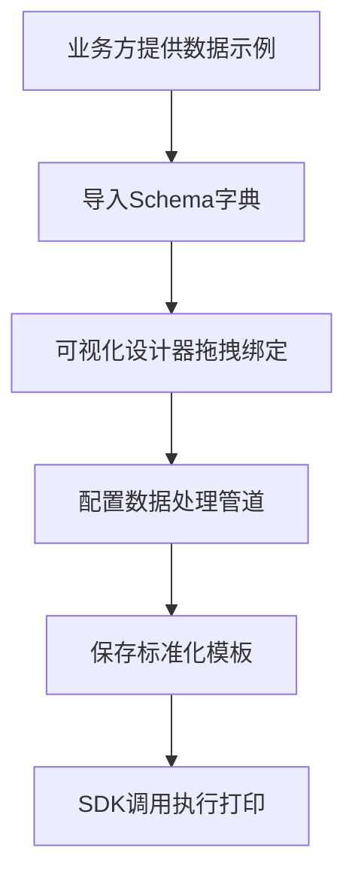
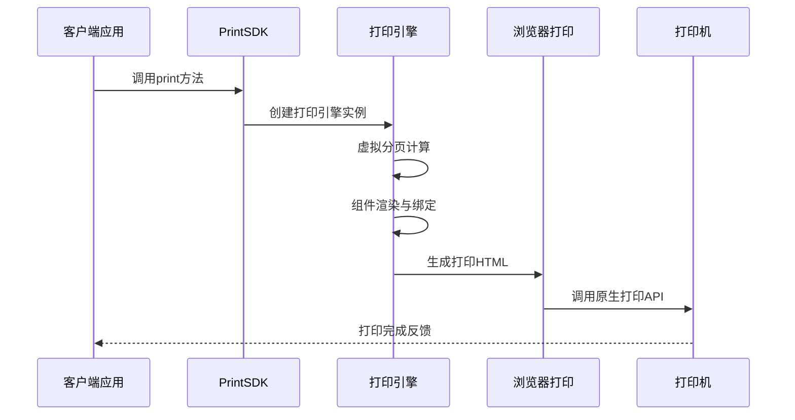
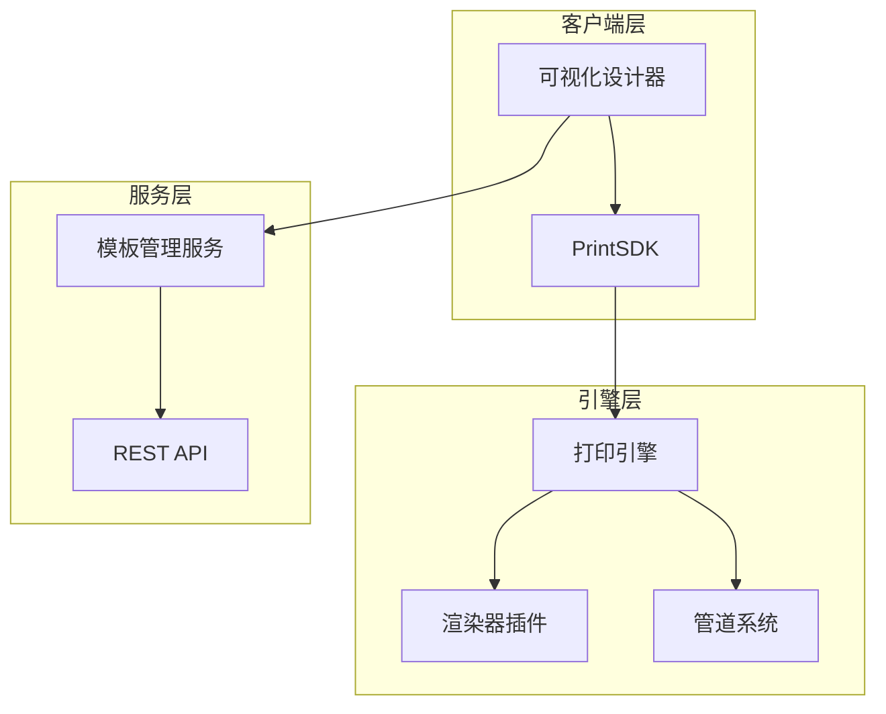
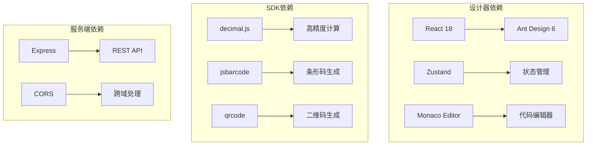

# 需求文档

<cite>
**本文档引用的文件**
- [README.md](file://README.md)
- [需求文档.md](file://docs/需求文档.md)
- [package.json](file://designer/package.json)
- [package.json](file://sdk/package.json)
- [package.json](file://server/package.json)
- [App.tsx](file://designer/src/App.tsx)
- [index.tsx](file://designer/src/pages/Designer/index.tsx)
- [designer.ts](file://designer/src/store/designer.ts)
- [PrintSDK.ts](file://sdk/src/PrintSDK.ts)
- [printEngine.ts](file://sdk/src/printEngine.ts)
- [types.ts](file://sdk/src/types.ts)
- [registry.ts](file://sdk/src/pipes/registry.ts)
- [renderers/index.ts](file://sdk/src/printEngine/renderers/index.ts)
- [templates.ts](file://server/src/routes/templates.ts)
</cite>

## 目录
1. [项目概述](#项目概述)
2. [核心业务流程](#核心业务流程)
3. [功能需求分析](#功能需求分析)
4. [技术架构需求](#技术架构需求)
5. [非功能性需求](#非功能性需求)
6. [版本演进需求](#版本演进需求)
7. [依赖关系分析](#依赖关系分析)
8. [风险评估与应对](#风险评估与应对)
9. [实施建议](#实施建议)
10. [总结](#总结)

## 项目概述

通用打印服务平台是一个基于浏览器的客户端打印解决方案，旨在解决各业务线在打印场景中重复开发、维护困难及服务器渲染成本高的问题。该平台采用"零服务端压力"的设计理念，利用浏览器算力进行虚拟分页计算，实现所见即所得(WYSIWYG)的打印体验。

### 核心价值主张

- **零服务端压力**：所有打印计算在客户端浏览器中完成，无需服务器参与
- **插件化扩展**：支持组件渲染器和管道系统的插件化架构
- **数据与模板解耦**：模板与数据完全分离，支持动态绑定
- **跨平台兼容**：强依赖Chromium内核浏览器，确保CSS Paged Media渲染一致性

## 核心业务流程

### 1. 模板设计流程

### 2. 打印执行流程

**章节来源**
- [README.md:93-106](file://README.md#L93-L106)

## 功能需求分析

### 1. 可视化模板设计器

#### 1.1 交互能力需求
- **物理标尺支持**：毫米(mm)级别的精确测量
- **网格吸附系统**：支持5mm网格，Shift键可临时禁用
- **智能对齐参考线**：自动检测组件对齐并提供视觉引导
- **三栏布局设计**：数据资产树 + 画布编辑器 + 属性面板

#### 1.2 组件体系需求
- **基础组件**：文本、图片、形状组件
- **动态容器**：表格和项组容器
- **插件化渲染器**：支持7种组件类型的插件化扩展

#### 1.3 布局模式需求
- **流式布局(Flows)**：组件随内容自动下移
- **绝对定位(Absolute)**：固定坐标，适合套打场景

**章节来源**
- [README.md:110-123](file://README.md#L110-L123)
- [设计器/src/store/designer.ts:85-539](file://designer/src/store/designer.ts#L85-L539)

### 2. 数据绑定与管道系统

#### 2.1 Schema驱动的数据模型
- **字段定义**：支持string、number、boolean、date等类型
- **嵌套路径访问**：支持a.b.c形式的安全取值
- **枚举预设**：状态码映射配置

#### 2.2 管道转换链
- **内置管道**：日期格式化、货币格式化、金额转换、大小写转换、字符串截取、默认值
- **插件化架构**：支持自定义管道扩展
- **高精度计算**：使用decimal.js保证数值计算精度

#### 2.3 数据绑定逻辑
- **单点绑定**：静态字段处理
- **作用域绑定**：循环容器内的行内上下文切换
- **空值处理**：支持fallback默认值配置

**章节来源**
- [README.md:90-113](file://README.md#L90-L113)
- [sdk/src/pipes/registry.ts:1-64](file://sdk/src/pipes/registry.ts#L1-L64)
- [sdk/src/types.ts:1-171](file://sdk/src/types.ts#L1-L171)

### 3. 打印引擎与分页算法

#### 3.1 虚拟分页计算
- **相对间距模型**：基于组件间的相对间距进行布局
- **智能跨页拆分**：表格组件自动计算分页，支持表头重复
- **页边距控制**：精确控制页面边距和内容区域

#### 3.2 表格高级功能
- **表格合计**：支持SUM、AVG、MAX、MIN、COUNT五种聚合类型
- **合计模式**：支持每页合计和最后一页合计两种模式
- **高精度计算**：使用decimal.js避免浮点误差

#### 3.3 页码功能
- **位置配置**：支持6种页码位置(top-left, top-center, top-right, bottom-left, bottom-center, bottom-right)
- **格式支持**：简单格式(1)、斜线格式(1/3)、文字格式(第1页 共3页)
- **样式定制**：字体大小、颜色、字重可配置

**章节来源**
- [README.md:114-148](file://README.md#L114-L148)
- [sdk/src/printEngine.ts:394-557](file://sdk/src/printEngine.ts#L394-L557)
- [sdk/src/types.ts:30-46](file://sdk/src/types.ts#L30-L46)

### 4. SDK集成需求

#### 4.1 打印SDK核心功能
- **独立使用**：纯TypeScript实现，无UI依赖
- **批量打印**：支持多数据批量预览和打印
- **浏览器兼容**：支持主流浏览器打印API

#### 4.2 打印选项配置
- **预览模式**：打开新窗口进行打印预览
- **直接打印**：在隐藏iframe中直接执行打印
- **批量处理**：支持同模板多数据的批量打印

**章节来源**
- [README.md:140-159](file://README.md#L140-L159)
- [sdk/src/PrintSDK.ts:71-299](file://sdk/src/PrintSDK.ts#L71-L299)

## 技术架构需求

### 1. 混合架构设计

### 2. 技术栈需求

#### 2.1 前端技术栈
- **框架**：React 18 + TypeScript
- **构建工具**：Vite 5
- **状态管理**：Zustand
- **UI组件库**：Ant Design 6

#### 2.2 SDK技术栈
- **构建工具**：Rollup
- **打包格式**：ESM + CommonJS
- **核心依赖**：qrcode、jsbarcode、decimal.js

#### 2.3 服务端技术栈
- **框架**：Express.js
- **语言**：TypeScript
- **数据库**：内存存储(可扩展)

**章节来源**
- [README.md:163-187](file://README.md#L163-L187)
- [designer/package.json:12-28](file://designer/package.json#L12-L28)
- [sdk/package.json:49-53](file://sdk/package.json#L49-L53)
- [server/package.json:11-15](file://server/package.json#L11-L15)

## 非功能性需求

### 1. 性能需求
- **响应时间**：100页数据从加载到预览耗时<3秒
- **包体积**：SDK包体积(Gzip)<100KB
- **渲染效率**：支持大数据量表格的高效渲染

### 2. 安全需求
- **数据隐私**：数据即用即走，不存储在服务器
- **跨域安全**：严格控制外部资源加载
- **XSS防护**：HTML转义和内容安全策略

### 3. 交互需求
- **设计器功能**：自动备份(LocalStorage)、撤销/重做能力
- **用户体验**：快捷键提示、会话级关闭记忆
- **错误处理**：友好的错误提示和降级处理

**章节来源**
- [README.md:169-174](file://README.md#L169-L174)

## 版本演进需求

### 1. V1.1.0 核心优化

#### 1.1 表格分页精度革命性提升
- **渲染后测量**：将表格真实渲染到隐藏DOM中测量每行高度
- **长文本处理**：彻底解决长文本换行导致的分页截断问题
- **表头真实测量**：支持表头换行的高度测量

#### 1.2 组件定位逻辑优化
- **负间距支持**：完全保留设计时的相对位置关系
- **表格跨页定位**：后续组件精确定位到表格实际底部

#### 1.3 工程改进
- **打印清理优化**：iframe打印使用afterprint事件+5秒兜底
- **批量打印健壮性**：使用DOMParser替代正则提取body内容
- **错误提示增强**：Decimal.js合计计算添加友好错误提示

**章节来源**
- [需求文档.md:17-67](file://docs/需求文档.md#L17-L67)

### 2. V1.0.1 功能增强

#### 2.1 分页打印页码功能
- **位置配置**：6种页码位置支持
- **格式多样化**：3种页码格式支持
- **样式定制**：完整的样式配置选项

#### 2.2 批量打印预览
- **多文档预览**：支持多份文档一次性预览
- **自动合并**：自动合并HTML并添加分页符
- **文档标识**：显示文档分割线和文档序号

#### 2.3 交互体验优化
- **双击添加**：组件库和数据资产均支持双击快速添加
- **拖拽定位**：支持拖拽精确定位
- **智能中心**：智能计算画布中心位置

**章节来源**
- [需求文档.md:40-67](file://docs/需求文档.md#L40-L67)

## 依赖关系分析

### 1. 组件依赖关系

### 2. 关键依赖分析

#### 2.1 核心依赖
- **decimal.js**：确保数值计算的高精度
- **jsbarcode**：客户端条形码生成
- **qrcode**：客户端二维码生成

#### 2.2 开发依赖
- **@rollup/plugin-typescript**：TypeScript打包支持
- **@types/qrcode**：类型定义支持
- **vite**：现代化构建工具

**章节来源**
- [sdk/package.json:49-53](file://sdk/package.json#L49-L53)
- [designer/package.json:12-28](file://designer/package.json#L12-L28)
- [server/package.json:11-15](file://server/package.json#L11-L15)

## 风险评估与应对

### 1. 技术风险

#### 1.1 浏览器兼容性
- **风险**：不同浏览器CSS Paged Media支持差异
- **应对**：强依赖Chromium内核(Chrome/Edge 80+)，提供兼容性检测

#### 1.2 性能瓶颈
- **风险**：大数据量渲染性能问题
- **应对**：虚拟滚动、懒加载、分页渲染优化

### 2. 业务风险

#### 2.1 数据安全
- **风险**：敏感数据泄露
- **应对**：客户端处理，无服务器存储，HTTPS传输

#### 2.2 用户体验
- **风险**：复杂操作学习成本高
- **应对**：直观的可视化设计，完善的帮助文档

## 实施建议

### 1. 开发实施建议

#### 1.1 分阶段实施
- **第一阶段**：核心打印引擎和基础组件
- **第二阶段**：可视化设计器和数据绑定
- **第三阶段**：高级功能和性能优化

#### 1.2 质量保证
- **单元测试**：覆盖核心算法和边界条件
- **集成测试**：验证组件间协作
- **性能测试**：大数据量场景下的性能表现

### 2. 部署运维建议

#### 2.1 部署策略
- **CDN分发**：SDK通过CDN分发，降低带宽成本
- **缓存策略**：合理设置缓存头，平衡新鲜度和性能
- **监控告警**：建立完整的监控指标和告警机制

#### 2.2 维护升级
- **版本管理**：严格的版本控制和变更管理
- **回滚机制**：快速回滚到稳定版本的能力
- **用户通知**：重要的功能变更及时通知用户

## 总结

通用打印服务平台通过创新的客户端渲染架构，成功解决了传统打印服务的痛点问题。该平台具有以下核心优势：

1. **架构优势**：零服务端压力的设计理念，大幅降低了运营成本
2. **技术优势**：插件化架构支持灵活扩展，高精度计算确保数据准确性
3. **用户体验**：所见即所得的设计，简化了复杂的打印配置过程
4. **业务价值**：支持多行业应用场景，提高了打印服务的标准化程度

随着版本的持续演进，平台将继续优化表格分页精度、增强组件定位逻辑，并扩展更多的业务场景支持。通过合理的实施策略和风险管理，该平台将成为企业数字化转型的重要基础设施。