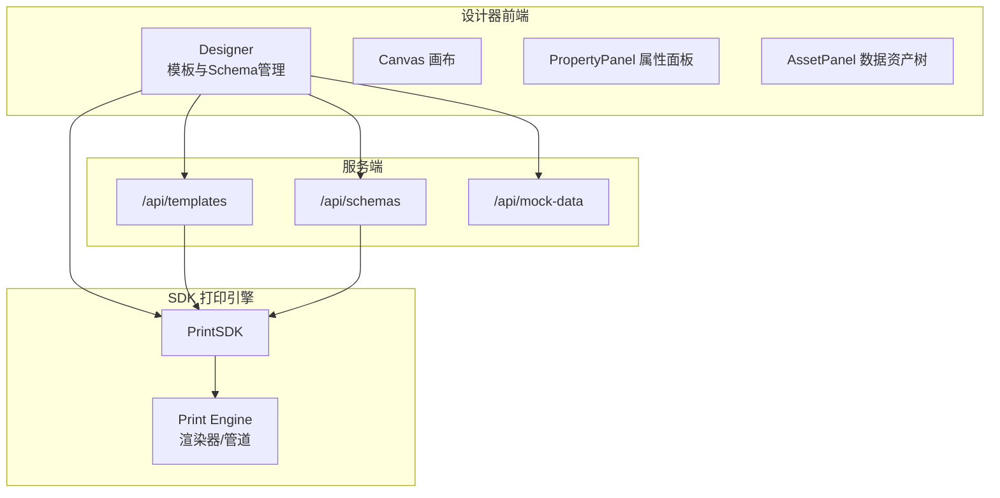
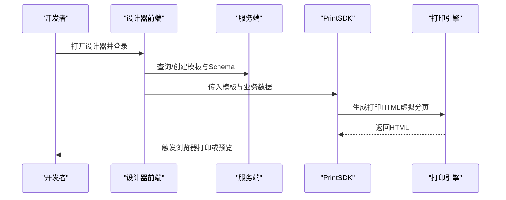
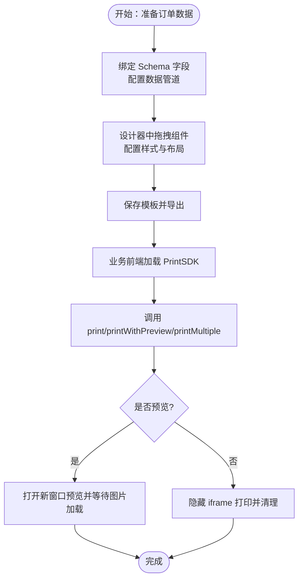
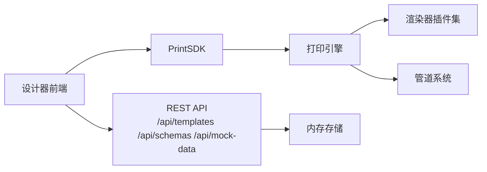

# 典型使用场景

<cite>
**本文引用的文件**
- [README.md](file://README.md)
- [需求文档.md](file://docs/需求文档.md)
- [server/index.ts](file://server/src/index.ts)
- [designer/Designer/index.tsx](file://designer/src/pages/Designer/index.tsx)
- [designer/TemplateManagement/index.tsx](file://designer/src/pages/TemplateManagement/index.tsx)
- [designer/SchemaManagement/index.tsx](file://designer/src/pages/SchemaManagement/index.tsx)
- [sdk/PrintSDK.ts](file://sdk/src/PrintSDK.ts)
- [sdk/printEngine/types.ts](file://sdk/src/printEngine/types.ts)
- [sdk/types.ts](file://sdk/src/types.ts)
- [designer/Barcode/index.tsx](file://designer/src/components/Barcode/index.tsx)
</cite>

## 目录
1. [简介](#简介)
2. [项目结构](#项目结构)
3. [核心组件](#核心组件)
4. [架构总览](#架构总览)
5. [典型使用场景详解](#典型使用场景详解)
6. [依赖关系分析](#依赖关系分析)
7. [性能考量](#性能考量)
8. [故障排查指南](#故障排查指南)
9. [结论](#结论)
10. [附录](#附录)

## 简介
本文件面向打印服务平台的典型业务场景，围绕电商订单打印、发票打印、报表生成、证书制作等常见业务，系统阐述模板设计、数据绑定、SDK 集成与批量打印、分页与页码配置、以及不同规模企业的部署与最佳实践。读者可据此快速落地各类打印需求，并获得从设计器到 SDK 的完整使用路径。

## 项目结构
系统采用三层架构：可视化设计器（React + TypeScript）、打印 SDK（纯 TS，无 UI 依赖）、服务端模板管理（Node.js + Express）。三者通过 REST 接口协同工作，设计器负责模板与 Schema 的可视化管理，SDK 负责在浏览器端完成虚拟分页与打印，服务端提供模板与 Schema 的持久化与查询。

图示来源
- [README.md: 191-234:191-234](file://README.md#L191-L234)
- [需求文档.md: 129-142:129-142](file://docs/需求文档.md#L129-L142)
- [server/index.ts: 1-25:1-25](file://server/src/index.ts#L1-L25)

章节来源
- [README.md: 191-234:191-234](file://README.md#L191-L234)
- [需求文档.md: 129-142:129-142](file://docs/需求文档.md#L129-L142)
- [server/index.ts: 1-25:1-25](file://server/src/index.ts#L1-L25)

## 核心组件
- 可视化设计器：三栏布局（数据资产树、画布、属性面板），支持拖拽、网格吸附、智能对齐、组件树、撤销/重做、批量预览等。
- 打印 SDK：提供 print/printDirect/printWithPreview/generateHTML/printMultiple 等 API，支持批量打印与进度回调。
- 打印引擎：基于 CSS Paged Media 的虚拟分页，组件渲染器插件化，表格跨页与合计、页码页面级配置。
- 管道系统：内置日期、货币、金额转换、大小写、截取、默认值等管道，支持链式转换。
- 服务端：提供模板、Schema、Mock 数据的 REST 接口，便于设计器与业务前端集成。

章节来源
- [README.md: 66-187:66-187](file://README.md#L66-L187)
- [需求文档.md: 83-127:83-127](file://docs/需求文档.md#L83-L127)
- [sdk/PrintSDK.ts: 43-244:43-244](file://sdk/src/PrintSDK.ts#L43-L244)
- [sdk/printEngine/types.ts: 57-82:57-82](file://sdk/src/printEngine/types.ts#L57-L82)

## 架构总览
系统采用“设计器 + SDK + 服务端”的混合架构，渲染与分页在浏览器端完成，服务端仅承担模板与 Schema 的持久化与查询，降低服务端压力，提升可扩展性与一致性。

图示来源
- [README.md: 265-326:265-326](file://README.md#L265-L326)
- [需求文档.md: 68-80:68-80](file://docs/需求文档.md#L68-L80)
- [sdk/PrintSDK.ts: 53-97:53-97](file://sdk/src/PrintSDK.ts#L53-L97)

## 典型使用场景详解

### 场景一：电商订单打印（含面单、发货单）
适用对象：电商/零售企业，需要为订单生成发货面单、快递单、拣货单等。

- 模板设计要点
  - 布局模式：建议使用绝对定位（absolute），便于与快递单/面单版式对齐。
  - 关键组件：文本（订单号、收件人、电话、地址）、条码（运单号）、表格（商品明细）。
  - 数据绑定：通过 Schema 的点号路径绑定字段，必要时使用管道（如日期格式化、金额转换）。
  - 页码：根据需要开启页码，设置位置与格式，保证多联单一致性。
- 使用流程
  1) 在设计器中创建模板，绑定对应 Schema；
  2) 在属性面板配置组件样式与管道；
  3) 保存模板并导出；
  4) 在业务前端加载 PrintSDK，调用 print 或 printWithPreview；
  5) 若需要批量打印，使用 printMultiple 并监听进度回调。
- 最佳实践
  - 使用 CONTINUOUS 连续纸时，合理设置 minHeightMm；
  - 表格跨页重复表头，确保拣货/复核效率；
  - 条码/二维码建议提前生成 base64，减少网络请求；
  - 预览阶段先验证分页与跨页切割，再执行真实打印。
- 配置要求
  - 模板 page.orientation 与实际打印机介质匹配；
  - 组件尺寸以 mm 为单位，结合 mmToPx 进行换算；
  - 页码启用时，注意 offset 与样式，避免遮挡关键信息。

图示来源
- [需求文档.md: 68-80:68-80](file://docs/需求文档.md#L68-L80)
- [sdk/PrintSDK.ts: 53-97:53-97](file://sdk/src/PrintSDK.ts#L53-L97)
- [sdk/PrintSDK.ts: 135-243:135-243](file://sdk/src/PrintSDK.ts#L135-L243)

章节来源
- [需求文档.md: 68-80:68-80](file://docs/需求文档.md#L68-L80)
- [sdk/PrintSDK.ts: 53-97:53-97](file://sdk/src/PrintSDK.ts#L53-L97)
- [sdk/PrintSDK.ts: 135-243:135-243](file://sdk/src/PrintSDK.ts#L135-L243)

### 场景二：发票打印（增值税发票/电子发票）
适用对象：财务/税务系统，需要生成合规发票并支持批量打印。

- 模板设计要点
  - 关键字段：发票代码、发票号码、开票日期、购买方信息、销售方信息、金额（不含税/含税/税额）、货物或服务明细。
  - 表格：商品/服务明细，启用合计（sum/avg/max/min/count），支持分页合计或最后一页总计。
  - 管道：金额转换（分/元）、货币格式化、日期格式化。
  - 页码：建议使用“文字格式”或“斜线格式”，并在底部居中/靠右，避免遮挡金额区域。
- 使用流程
  1) 设计器中创建发票模板，绑定发票 Schema；
  2) 配置金额转换与货币格式化管道；
  3) 保存模板并导出；
  4) 业务前端调用 SDK 执行打印或批量打印。
- 最佳实践
  - 使用 decimal.js 精度保障，避免浮点误差；
  - 表格合计行样式与正文区分（字号、字重、背景色）；
  - 页码与发票编号在同一视觉区域时，注意 offset 与颜色对比度。
- 配置要求
  - 纸张尺寸与发票联次匹配（A4 或 CUSTOM）；
  - 边距设置需满足税务打印规范；
  - 页码格式建议“第X页 共Y页”。

章节来源
- [README.md: 114-139:114-139](file://README.md#L114-L139)
- [需求文档.md: 117-126:117-126](file://docs/需求文档.md#L117-L126)
- [sdk/types.ts: 107-116:107-116](file://sdk/src/types.ts#L107-L116)

### 场景三：报表生成（销售日报/库存汇总）
适用对象：运营/财务/仓储系统，需要生成周期性报表并支持导出与打印。

- 模板设计要点
  - 表格：按日期/品类/仓库维度汇总，启用跨页表头与合计；
  - 管道：日期格式化、百分比/金额格式化；
  - 页码：顶部/底部均可，建议“斜线格式”便于阅读。
- 使用流程
  1) 设计器中创建报表模板，绑定报表 Schema；
  2) 配置表格列与合计配置；
  3) 保存模板并导出；
  4) 业务前端调用 SDK 执行打印或批量打印。
- 最佳实践
  - 合计模式选择“每页合计”或“仅最后一页合计”，依据阅读习惯；
  - 表格列宽与内容长度匹配，避免跨页被截断；
  - 使用预览模式先检查跨页与合计位置。
- 配置要求
  - 表格 props 中 repeatHeader 与 summaryMode 合理配置；
  - 页边距与页眉页脚留白充足。

章节来源
- [需求文档.md: 117-126:117-126](file://docs/需求文档.md#L117-L126)
- [sdk/types.ts: 118-132:118-132](file://sdk/src/types.ts#L118-L132)

### 场景四：证书制作（培训结业证/荣誉证书）
适用对象：教育/培训/企业内训系统，需要生成标准化证书并支持批量打印。

- 模板设计要点
  - 布局：使用绝对定位，确保印章、姓名、落款等元素精准对齐；
  - 组件：文本（姓名、课程/项目名称、颁发日期）、二维码/条码（证书编号）、图片（印章）；
  - 管道：日期格式化、字符串截取（脱敏）；
  - 页码：可选，建议置于底部居中，避免遮挡印章。
- 使用流程
  1) 设计器中创建证书模板，绑定证书 Schema；
  2) 配置文本与图片组件，设置样式与管道；
  3) 保存模板并导出；
  4) 业务前端调用 SDK 执行打印或批量打印。
- 最佳实践
  - 二维码/条码建议使用稳定格式（如常用条形码/二维码库），确保扫描识别率；
  - 图片建议使用 base64 内嵌，减少外部依赖；
  - 预览阶段重点检查印章与文字的对齐与留白。
- 配置要求
  - 纸张尺寸与证书规格匹配；
  - 组件 z-index 与覆盖层顺序合理安排。

章节来源
- [需求文档.md: 83-100:83-100](file://docs/需求文档.md#L83-L100)
- [designer/Barcode/index.tsx: 12-34:12-34](file://designer/src/components/Barcode/index.tsx#L12-L34)

## 依赖关系分析
- 设计器依赖服务端接口进行模板与 Schema 的增删改查；同时可直接调用 SDK 执行打印预览。
- SDK 依赖打印引擎与渲染器插件，渲染器插件化便于扩展新组件类型。
- 管道系统通过注册器模式组织，支持链式转换，提高数据处理灵活性。
- 服务端采用 CORS + JSON 中间件，路由清晰，便于扩展。

图示来源
- [server/index.ts: 14-18:14-18](file://server/src/index.ts#L14-L18)
- [sdk/printEngine/types.ts: 57-82:57-82](file://sdk/src/printEngine/types.ts#L57-L82)
- [sdk/types.ts: 64-75:64-75](file://sdk/src/types.ts#L64-L75)

章节来源
- [server/index.ts: 14-18:14-18](file://server/src/index.ts#L14-L18)
- [sdk/printEngine/types.ts: 57-82:57-82](file://sdk/src/printEngine/types.ts#L57-L82)
- [sdk/types.ts: 64-75:64-75](file://sdk/src/types.ts#L64-L75)

## 性能考量
- 虚拟分页与跨页策略：通过 DOM 预计算与分页符插入，避免服务端渲染；表格跨页自动补齐表头，防止内容断裂。
- 图片加载：在预览与打印前等待图片加载完成，二维码/条形码已同步生成为 base64，减少异步依赖。
- 批量打印：将多个数据的 HTML 片段合并为一个完整文档，仅需用户确认一次打印，显著提升效率。
- 包体积与加载：SDK 采用 Rollup 打包，ESM/CJS 双格式，建议在生产环境按需引入与懒加载。

章节来源
- [README.md: 114-147:114-147](file://README.md#L114-L147)
- [sdk/PrintSDK.ts: 135-243:135-243](file://sdk/src/PrintSDK.ts#L135-L243)

## 故障排查指南
- 打不开打印窗口或隐藏 iframe 打印失败
  - 检查浏览器弹窗策略与权限设置；
  - 确认 printWindow/document 访问正常。
- 图片未加载导致打印空白
  - 确保在调用 print 前等待图片加载完成；
  - 外链图片建议转为 base64 或确保网络可达。
- 模板预览与实际打印不一致
  - 检查 mm 与 px 换算系数与页边距；
  - 核对组件绝对定位坐标与布局模式。
- 批量打印进度异常
  - 确认 onProgress 回调参数与 currentIndex 状态；
  - 捕获异常并统计 failed 数量。

章节来源
- [sdk/PrintSDK.ts: 53-97:53-97](file://sdk/src/PrintSDK.ts#L53-L97)
- [sdk/PrintSDK.ts: 135-243:135-243](file://sdk/src/PrintSDK.ts#L135-L243)

## 结论
该打印服务平台通过“设计器 + SDK + 服务端”的轻量架构，实现了所见即所得的模板设计、强大的数据绑定与管道系统、以及高效的浏览器端虚拟分页与打印。针对电商订单、发票、报表、证书等典型场景，系统提供了清晰的设计流程、配置要点与最佳实践，能够满足不同规模企业的多样化打印需求。

## 附录

### A. 设计器与模板管理
- 模板管理：支持新建、编辑、复制、导出、批量导出、刷新与预览；可按名称与 Schema 筛选。
- Schema 管理：支持手动编辑与从 Mock 数据智能生成；提供字段类型说明与示例。
- 设计器：三栏布局，支持组件树、属性面板、画布、调试抽屉与模板 JSON 导出。

章节来源
- [designer/TemplateManagement/index.tsx: 36-565:36-565](file://designer/src/pages/TemplateManagement/index.tsx#L36-L565)
- [designer/SchemaManagement/index.tsx: 48-745:48-745](file://designer/src/pages/SchemaManagement/index.tsx#L48-L745)
- [designer/Designer/index.tsx: 17-279:17-279](file://designer/src/pages/Designer/index.tsx#L17-L279)

### B. SDK 使用与集成要点
- 基本打印：print/printDirect/printWithPreview/generateHTML；
- 批量打印：printMultiple，支持进度回调；
- 页码：通过 pageConfig.pageNumber 配置位置、格式、偏移与样式；
- 表格：跨页重复表头、合计模式、合计行样式；
- 管道：日期、货币、金额转换、大小写、截取、默认值。

章节来源
- [sdk/PrintSDK.ts: 43-244:43-244](file://sdk/src/PrintSDK.ts#L43-L244)
- [sdk/types.ts: 30-46:30-46](file://sdk/src/types.ts#L30-L46)
- [sdk/types.ts: 107-132:107-132](file://sdk/src/types.ts#L107-L132)
- [README.md: 99-113:99-113](file://README.md#L99-L113)

### C. 服务端接口与部署建议
- 接口：/api/schemas、/api/templates、/api/mock-data；
- 部署：服务端监听端口默认 3000，可在生产环境通过环境变量覆盖；
- 建议：将服务端与设计器前端部署在同域或允许 CORS，便于模板与 Schema 的读取与保存。

章节来源
- [server/index.ts: 1-25:1-25](file://server/src/index.ts#L1-L25)