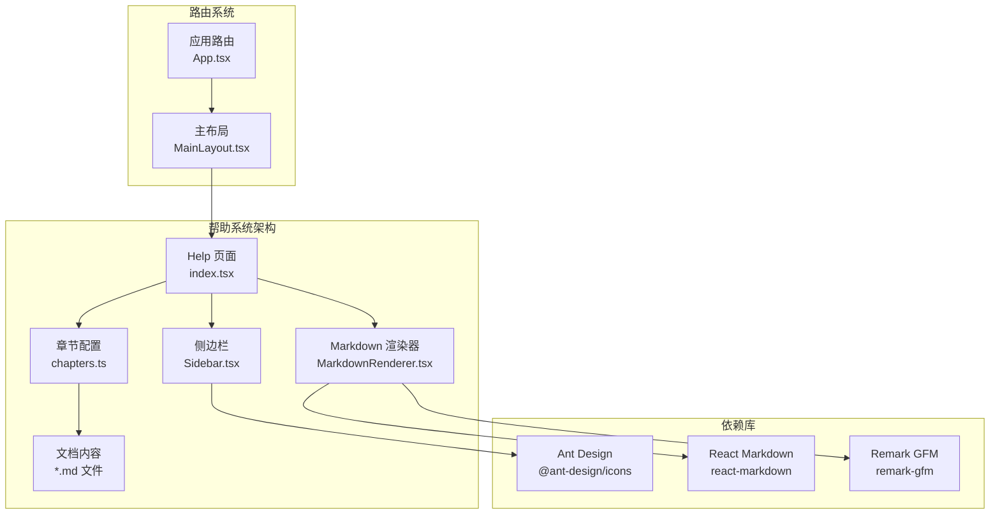
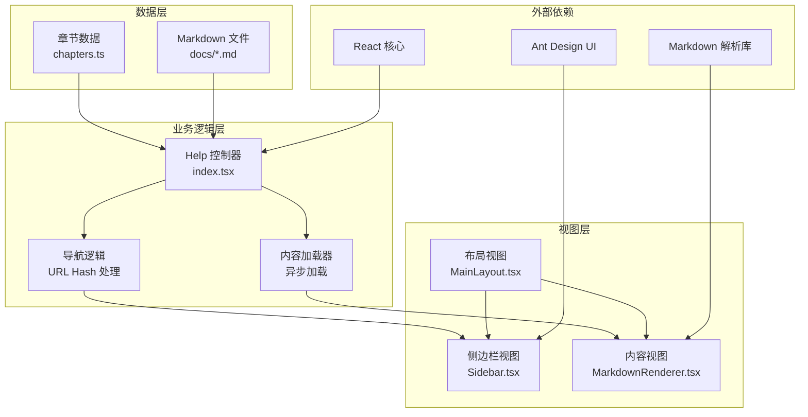
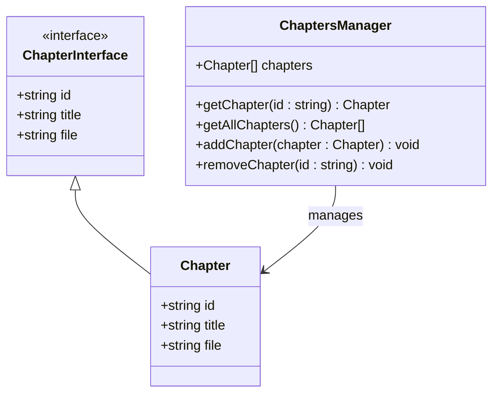
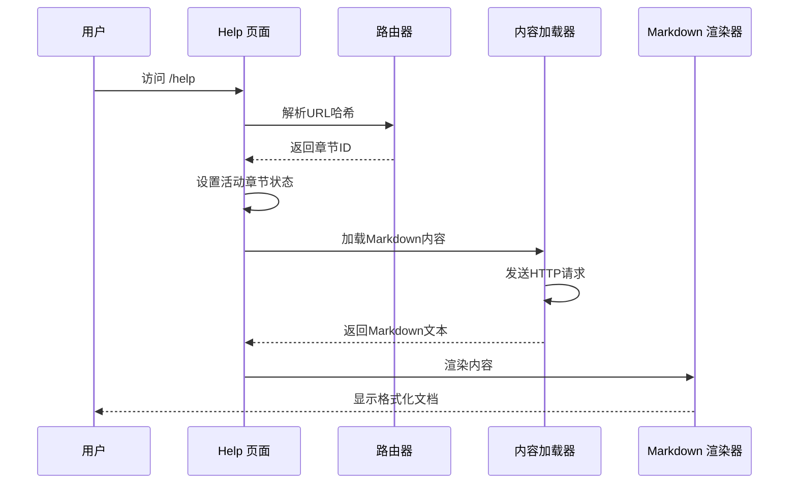
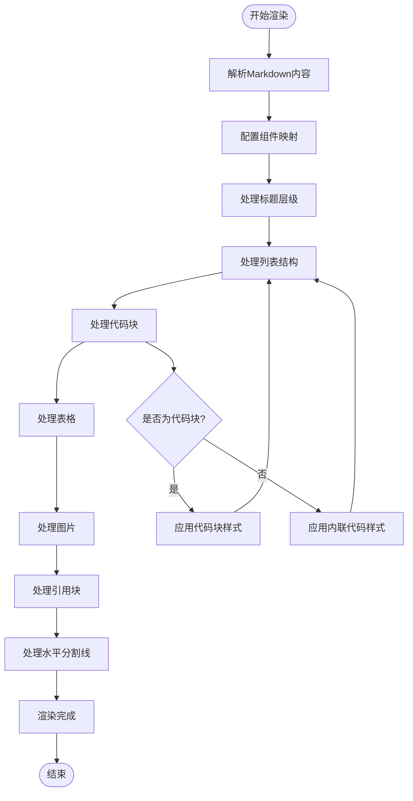
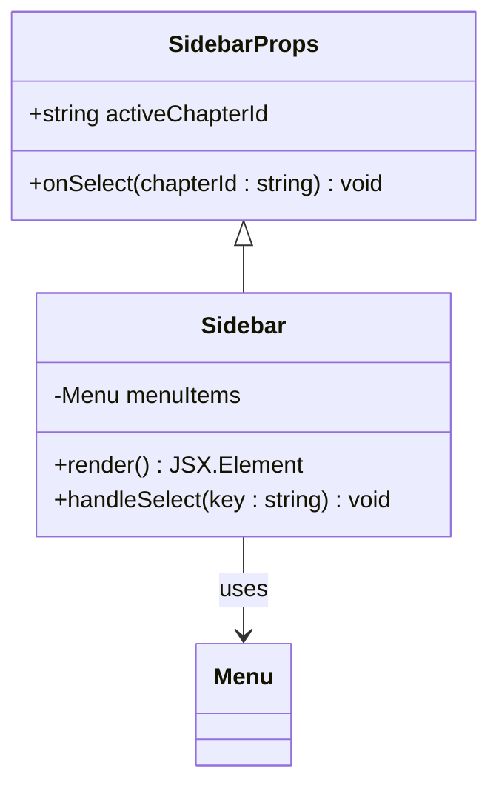
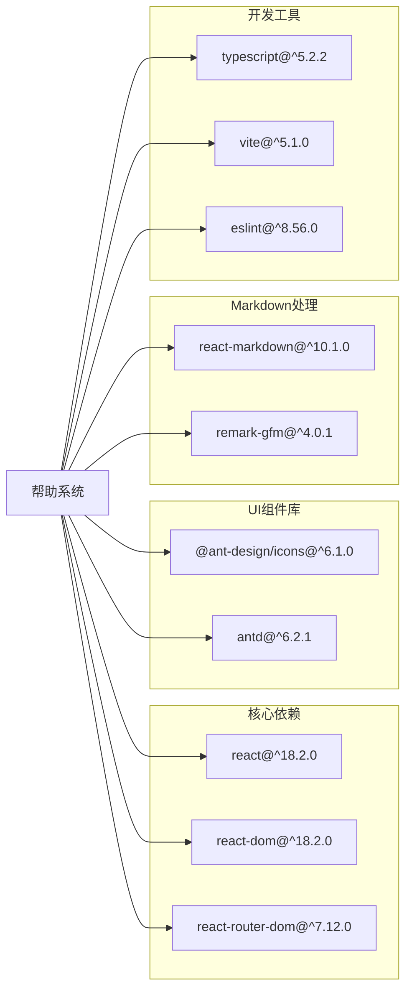

# 帮助系统

<cite>
**本文档引用的文件**
- [chapters.ts](file://designer/src/help/chapters.ts)
- [Help/index.tsx](file://designer/src/pages/Help/index.tsx)
- [Help/Sidebar.tsx](file://designer/src/pages/Help/components/Sidebar.tsx)
- [Help/MarkdownRenderer.tsx](file://designer/src/pages/Help/components/MarkdownRenderer.tsx)
- [02-快速入门.md](file://designer/src/help/docs/02-快速入门.md)
- [05-设计器基础.md](file://designer/src/help/docs/05-设计器基础.md)
- [06-组件使用指南.md](file://designer/src/help/docs/06-组件使用指南.md)
- [07-数据绑定与管道.md](file://designer/src/help/docs/07-数据绑定与管道.md)
- [08-表格高级配置.md](file://designer/src/help/docs/08-表格高级配置.md)
- [10-打印预览与调试.md](file://designer/src/help/docs/10-打印预览与调试.md)
- [11-快捷键速查.md](file://designer/src/help/docs/11-快捷键速查.md)
- [App.tsx](file://designer/src/App.tsx)
- [MainLayout.tsx](file://designer/src/layouts/MainLayout.tsx)
- [package.json](file://designer/package.json)
- [Help/index.module.css](file://designer/src/pages/Help/index.module.css)
</cite>

## 目录
1. [简介](#简介)
2. [项目结构](#项目结构)
3. [核心组件](#核心组件)
4. [架构概览](#架构概览)
5. [详细组件分析](#详细组件分析)
6. [依赖分析](#依赖分析)
7. [性能考虑](#性能考虑)
8. [故障排除指南](#故障排除指南)
9. [结论](#结论)

## 简介

帮助系统是打印模板平台的重要组成部分，为用户提供全面的使用指导和技术文档。该系统采用现代化的前端技术栈构建，基于React框架开发，集成了Ant Design组件库和Markdown渲染功能，为用户提供了直观易用的帮助文档浏览体验。

系统的核心功能包括：
- 多章节帮助文档管理
- 响应式布局设计
- Markdown格式内容渲染
- 章节导航和内容检索
- 图片资源的智能加载
- 用户友好的交互体验

## 项目结构

帮助系统位于`designer/src/pages/Help/`目录下，采用模块化的设计模式，将功能分解为独立的组件和工具模块。

**图表来源**
- [Help/index.tsx:1-82](file://designer/src/pages/Help/index.tsx#L1-L82)
- [chapters.ts:1-64](file://designer/src/help/chapters.ts#L1-L64)
- [App.tsx:1-33](file://designer/src/App.tsx#L1-L33)

**章节来源**
- [Help/index.tsx:1-82](file://designer/src/pages/Help/index.tsx#L1-L82)
- [chapters.ts:1-64](file://designer/src/help/chapters.ts#L1-L64)
- [MainLayout.tsx:1-62](file://designer/src/layouts/MainLayout.tsx#L1-L62)

## 核心组件

帮助系统由四个核心组件构成，每个组件都有明确的职责分工：

### 章节管理器 (Chapters Manager)
负责管理所有帮助文档的章节信息，包括章节ID、标题和对应的Markdown文件路径。

### 帮助页面 (Help Page)
主页面组件，负责处理URL哈希导航、内容加载和状态管理。

### 侧边栏导航 (Sidebar Navigation)
提供章节列表的导航功能，支持章节间的快速跳转。

### Markdown渲染器 (Markdown Renderer)
专门负责将Markdown内容渲染为美观的HTML格式。

**章节来源**
- [chapters.ts:1-64](file://designer/src/help/chapters.ts#L1-L64)
- [Help/index.tsx:1-82](file://designer/src/pages/Help/index.tsx#L1-L82)
- [Help/Sidebar.tsx:1-46](file://designer/src/pages/Help/components/Sidebar.tsx#L1-L46)
- [Help/MarkdownRenderer.tsx:1-163](file://designer/src/pages/Help/components/MarkdownRenderer.tsx#L1-L163)

## 架构概览

帮助系统采用分层架构设计，从底层的数据存储到顶层的用户界面呈现，形成了清晰的层次结构。

**图表来源**
- [Help/index.tsx:1-82](file://designer/src/pages/Help/index.tsx#L1-L82)
- [Help/Sidebar.tsx:1-46](file://designer/src/pages/Help/components/Sidebar.tsx#L1-L46)
- [Help/MarkdownRenderer.tsx:1-163](file://designer/src/pages/Help/components/MarkdownRenderer.tsx#L1-L163)

系统采用响应式设计，支持不同屏幕尺寸的设备访问。页面布局采用Flexbox实现，确保内容区域的自适应调整。

## 详细组件分析

### 章节管理系统

章节管理系统是帮助系统的核心数据结构，通过统一的接口管理所有帮助文档。

**图表来源**
- [chapters.ts:1-64](file://designer/src/help/chapters.ts#L1-L64)

章节管理器支持64个不同的章节，涵盖了从平台概述到具体功能使用的完整知识体系。每个章节都有唯一的ID、标题和对应的Markdown文件路径。

**章节来源**
- [chapters.ts:7-63](file://designer/src/help/chapters.ts#L7-L63)

### 帮助页面控制器

Help页面控制器是整个帮助系统的核心逻辑组件，负责处理用户交互和状态管理。

**图表来源**
- [Help/index.tsx:24-55](file://designer/src/pages/Help/index.tsx#L24-L55)

页面控制器实现了完整的生命周期管理，包括初始化、状态更新和错误处理机制。

**章节来源**
- [Help/index.tsx:9-82](file://designer/src/pages/Help/index.tsx#L9-L82)

### Markdown渲染器

Markdown渲染器组件专门负责将Markdown格式的内容转换为美观的HTML文档。

**图表来源**
- [Help/MarkdownRenderer.tsx:10-160](file://designer/src/pages/Help/components/MarkdownRenderer.tsx#L10-L160)

渲染器支持多种Markdown扩展功能，包括表格、任务列表、代码高亮等。

**章节来源**
- [Help/MarkdownRenderer.tsx:1-163](file://designer/src/pages/Help/components/MarkdownRenderer.tsx#L1-L163)

### 侧边栏导航组件

侧边栏组件提供直观的章节导航功能，支持章节间的快速跳转。

**图表来源**
- [Help/Sidebar.tsx:6-46](file://designer/src/pages/Help/components/Sidebar.tsx#L6-L46)

侧边栏组件采用Ant Design的Menu组件，提供了标准的导航体验。

**章节来源**
- [Help/Sidebar.tsx:1-46](file://designer/src/pages/Help/components/Sidebar.tsx#L1-L46)

## 依赖分析

帮助系统依赖于多个第三方库来实现其核心功能。

**图表来源**
- [package.json:13-31](file://designer/package.json#L13-L31)

系统的主要依赖包括：
- **React生态系统**：提供核心的组件模型和状态管理
- **Ant Design**：提供丰富的UI组件和图标库
- **Markdown处理库**：支持GFM扩展的Markdown渲染
- **路由系统**：实现单页应用的导航功能

**章节来源**
- [package.json:1-48](file://designer/package.json#L1-L48)

## 性能考虑

帮助系统在设计时充分考虑了性能优化，采用了多种策略来提升用户体验：

### 内容缓存策略
- 使用异步加载避免阻塞页面渲染
- 缓存已加载的Markdown内容减少重复请求
- 实现加载状态指示器提升用户感知

### 资源优化
- 图片资源采用相对路径和BASE_URL结合的方式
- 代码块使用语法高亮但避免过度渲染
- 表格内容支持滚动容器防止布局重排

### 响应式设计
- Flexbox布局确保内容区域自适应
- 移动端友好的触摸交互
- 适当的字体大小和行间距

## 故障排除指南

### 常见问题及解决方案

**问题1：文档无法加载**
- 检查网络连接和服务器状态
- 验证Markdown文件路径是否正确
- 确认文件权限设置

**问题2：图片显示异常**
- 检查图片URL是否正确
- 验证BASE_URL配置
- 确认图片文件是否存在

**问题3：导航失效**
- 检查URL哈希格式
- 验证章节ID配置
- 确认路由配置正确

**问题4：样式显示问题**
- 检查CSS模块导入
- 验证样式类名拼写
- 确认Ant Design主题配置

**章节来源**
- [Help/index.tsx:37-42](file://designer/src/pages/Help/index.tsx#L37-L42)
- [Help/MarkdownRenderer.tsx:111-135](file://designer/src/pages/Help/components/MarkdownRenderer.tsx#L111-L135)

## 结论

帮助系统作为打印模板平台的重要组成部分，展现了现代前端开发的最佳实践。系统采用模块化设计、响应式布局和组件化架构，为用户提供了优质的帮助文档浏览体验。

### 主要优势
- **模块化架构**：清晰的组件分离和职责划分
- **响应式设计**：适配多种设备和屏幕尺寸
- **性能优化**：异步加载和缓存策略
- **用户体验**：直观的导航和交互设计

### 技术亮点
- 基于React的现代前端技术栈
- Ant Design提供的丰富UI组件
- Markdown格式的结构化内容管理
- 单页应用的流畅用户体验

该系统为后续的功能扩展和维护奠定了良好的基础，是企业级应用开发的优秀范例。