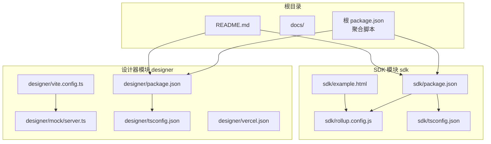
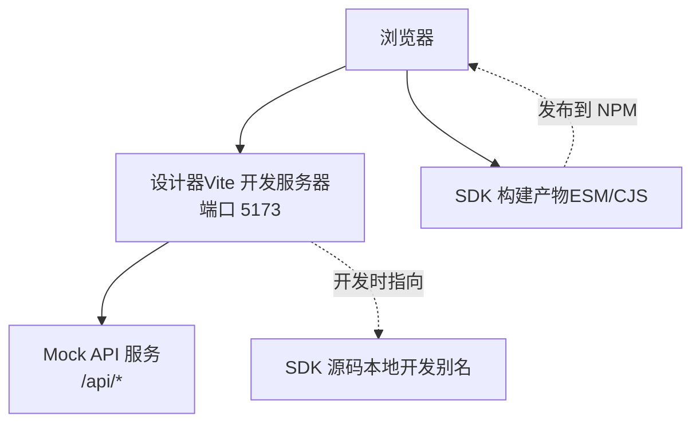
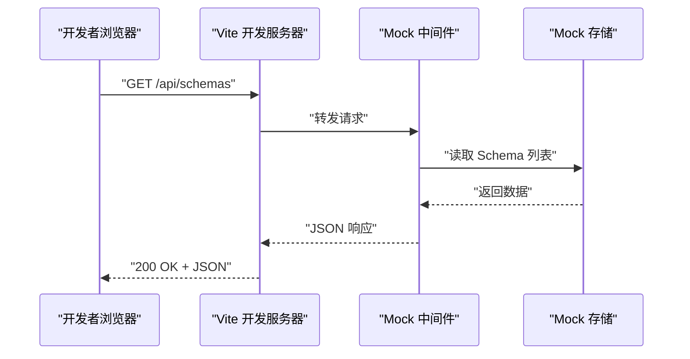
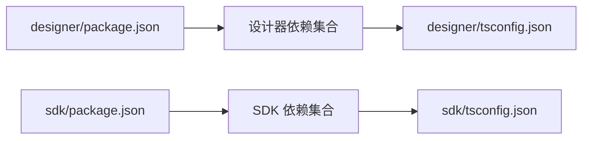

# 快速开始

<cite>
**本文引用的文件**
- [README.md](file://README.md)
- [package.json](file://package.json)
- [designer/package.json](file://designer/package.json)
- [sdk/package.json](file://sdk/package.json)
- [designer/vite.config.ts](file://designer/vite.config.ts)
- [designer/mock/server.ts](file://designer/mock/server.ts)
- [sdk/rollup.config.js](file://sdk/rollup.config.js)
- [designer/tsconfig.json](file://designer/tsconfig.json)
- [sdk/tsconfig.json](file://sdk/tsconfig.json)
- [designer/vercel.json](file://designer/vercel.json)
- [sdk/example.html](file://sdk/example.html)
</cite>

## 目录
1. [简介](#简介)
2. [项目结构](#项目结构)
3. [核心组件](#核心组件)
4. [架构概览](#架构概览)
5. [详细组件分析](#详细组件分析)
6. [依赖分析](#依赖分析)
7. [性能注意事项](#性能注意事项)
8. [故障排除指南](#故障排除指南)
9. [结论](#结论)
10. [附录](#附录)

## 简介
本指南面向首次接触“打印设计器”项目的开发者与使用者，提供两种启动方式的完整步骤：一键启动脚本方式与手动启动方式；明确开发环境准备要求（Node.js 版本、包管理器选择等）；给出完整的安装与依赖安装流程；说明设计器的启动步骤（端口、浏览器访问、Mock API 服务说明）；介绍 SDK 的构建过程（构建命令、产物说明、使用方式）；提供在线演示的访问方式与基本使用指导；并包含常见问题的解决方案（如端口冲突、依赖安装失败等），帮助新用户快速上手。

## 项目结构
该项目采用多包结构，包含以下关键模块：
- designer：可视化模板设计器（React + TypeScript + Vite），内置 Mock API 服务，支持三区域画布（页头/内容/页脚）与组件拖拽设计。
- sdk：独立的打印 SDK（TypeScript + Rollup），提供浏览器端打印能力与批量打印支持。
- docs：技术文档与需求文档（参考）。
- 根目录 README.md：项目发布说明、在线演示地址、快速开始与使用指南等。

图表来源
- [README.md](file://README.md)
- [package.json](file://package.json)
- [designer/package.json](file://designer/package.json)
- [sdk/package.json](file://sdk/package.json)
- [designer/vite.config.ts](file://designer/vite.config.ts)
- [designer/mock/server.ts](file://designer/mock/server.ts)
- [sdk/rollup.config.js](file://sdk/rollup.config.js)
- [designer/tsconfig.json](file://designer/tsconfig.json)
- [sdk/tsconfig.json](file://sdk/tsconfig.json)
- [designer/vercel.json](file://designer/vercel.json)
- [sdk/example.html](file://sdk/example.html)

章节来源
- [README.md](file://README.md)
- [package.json](file://package.json)

## 核心组件
- 设计器（designer）
  - 基于 React 18 + TypeScript + Vite 5，使用 Zustand 管理状态，Ant Design 6 作为 UI 基础组件库。
  - 内置 Mock API 服务，通过 Vite 插件集成，路由前缀为 /api，提供 Schema、模板、Mock 数据的 CRUD 接口。
  - 开发时默认端口为 5173，支持热更新与本地 SDK 源码别名映射。
- SDK（sdk）
  - 纯 TypeScript 实现，Rollup 打包，支持 ESM 与 CommonJS 两种格式。
  - 外部依赖：qrcode、jsbarcode、decimal.js；通过 external 配置避免打包进 SDK。
  - 提供 createPrintSDK、print、generateHTML、printMultiple 等核心 API。

章节来源
- [designer/package.json](file://designer/package.json)
- [sdk/package.json](file://sdk/package.json)
- [designer/vite.config.ts](file://designer/vite.config.ts)
- [designer/mock/server.ts](file://designer/mock/server.ts)
- [sdk/rollup.config.js](file://sdk/rollup.config.js)

## 架构概览
下面的图展示了“设计器 + SDK”的整体关系与数据流：设计器负责可视化设计与 Mock 数据/Schema/模板管理；SDK 负责将模板与数据渲染为可打印的 HTML 并触发浏览器打印。

图表来源
- [designer/vite.config.ts](file://designer/vite.config.ts)
- [designer/mock/server.ts](file://designer/mock/server.ts)
- [sdk/rollup.config.js](file://sdk/rollup.config.js)

## 详细组件分析

### 启动方式一：一键启动脚本（推荐）
- 适用场景：希望一步到位启动设计器并自动检查依赖。
- 关键步骤
  - 在项目根目录执行一键启动脚本，自动进入设计器目录、安装依赖、启动开发服务器。
  - 停止服务：执行停止脚本或在终端按 Ctrl+C。
- 端口与访问
  - 设计器默认运行在 http://localhost:5173。
  - Mock API 已集成，无需单独启动后端服务。
- 参考路径
  - [README.md](file://README.md)

章节来源
- [README.md](file://README.md)

### 启动方式二：手动启动
- 适用场景：需要更细粒度控制或排查问题。
- 关键步骤
  - 进入设计器目录，安装依赖并启动开发服务器。
  - 打开浏览器访问 http://localhost:5173。
  - Mock API 服务随 Vite 启动，无需额外配置。
- 参考路径
  - [README.md](file://README.md)
  - [designer/package.json](file://designer/package.json)
  - [designer/vite.config.ts](file://designer/vite.config.ts)

章节来源
- [README.md](file://README.md)
- [designer/package.json](file://designer/package.json)
- [designer/vite.config.ts](file://designer/vite.config.ts)

### Mock API 服务说明
- 服务集成方式
  - 通过 Vite 插件将 Mock 中间件挂载到 /api 前缀，拦截并处理 Schema、模板、Mock 数据的 CRUD 请求。
  - 支持 CORS 预检请求，返回标准 JSON 响应。
- 主要接口
  - /api/schemas：Schema 列表、创建、查询、更新、删除。
  - /api/templates：模板列表、创建、查询、更新、删除。
  - /api/mock-data：Mock 数据列表、创建、查询、更新、删除。
- 错误处理
  - 对异常进行捕获并返回统一错误结构与 500 状态码。
- 参考路径
  - [designer/mock/server.ts](file://designer/mock/server.ts)

图表来源
- [designer/mock/server.ts](file://designer/mock/server.ts)

章节来源
- [designer/mock/server.ts](file://designer/mock/server.ts)

### SDK 构建与使用
- 构建命令
  - 进入 sdk 目录，执行构建脚本，生成 CJS 与 ESM 两种格式的产物。
- 产物说明
  - 产物位于 dist 目录，包含 CommonJS 与 ESM 两种入口文件，同时生成 sourcemap 便于调试。
- 使用方式
  - 在业务项目中引入 SDK，调用 print/generateHTML/printMultiple 等 API 即可完成打印或生成 HTML。
  - 示例页面提供基本用法与交互按钮，可直接在浏览器中验证。
- 参考路径
  - [sdk/package.json](file://sdk/package.json)
  - [sdk/rollup.config.js](file://sdk/rollup.config.js)
  - [sdk/example.html](file://sdk/example.html)

章节来源
- [sdk/package.json](file://sdk/package.json)
- [sdk/rollup.config.js](file://sdk/rollup.config.js)
- [sdk/example.html](file://sdk/example.html)

### 在线演示与基本使用
- 在线演示地址
  - 访问演示站点，无需后端即可体验设计器功能，内置示例数据（Schema、模板、Mock 数据）。
- 基本使用指导
  - 打开设计器，从左侧数据资产树选择 Schema，拖拽字段到画布生成组件，在右侧属性面板配置样式与管道，点击“测试打印”预览效果，最后保存模板。
- 参考路径
  - [README.md](file://README.md)

章节来源
- [README.md](file://README.md)

## 依赖分析
- 开发环境要求
  - Node.js：用于运行 Vite、Rollup、NPM/PNPM 等工具链。
  - 包管理器：项目使用 NPM 脚本与依赖声明，建议使用与团队一致的包管理器以避免锁文件差异。
- 设计器依赖
  - React 18、Ant Design 6、Monaco Editor、Zustand、Axios 等，满足可视化设计器与状态管理、编辑器、网络请求等需求。
- SDK 依赖
  - qrcode、jsbarcode、decimal.js 为外部依赖，通过 Rollup external 配置排除打包，减少 SDK 体积并避免版本冲突。
- TypeScript 配置
  - 设计器与 SDK 分别维护 tsconfig，确保编译目标、模块解析策略与严格性符合各自用途。
- 参考路径
  - [designer/package.json](file://designer/package.json)
  - [sdk/package.json](file://sdk/package.json)
  - [designer/tsconfig.json](file://designer/tsconfig.json)
  - [sdk/tsconfig.json](file://sdk/tsconfig.json)

图表来源
- [designer/package.json](file://designer/package.json)
- [sdk/package.json](file://sdk/package.json)
- [designer/tsconfig.json](file://designer/tsconfig.json)
- [sdk/tsconfig.json](file://sdk/tsconfig.json)

章节来源
- [designer/package.json](file://designer/package.json)
- [sdk/package.json](file://sdk/package.json)
- [designer/tsconfig.json](file://designer/tsconfig.json)
- [sdk/tsconfig.json](file://sdk/tsconfig.json)

## 性能注意事项
- 设计器端
  - 使用 Vite 的热更新与按需加载，减少开发时等待时间；合理拆分组件与按需引入第三方库。
  - Mock API 仅在开发环境启用，生产构建时通过 Vercel 重写规则保证 SPA 正常访问。
- SDK 端
  - 通过 external 排除 qrcode、jsbarcode、decimal.js，减小 SDK 体积；业务侧自行引入这些库以获得更好的版本控制与体积优化空间。
- 参考路径
  - [designer/vite.config.ts](file://designer/vite.config.ts)
  - [sdk/rollup.config.js](file://sdk/rollup.config.js)
  - [designer/vercel.json](file://designer/vercel.json)

章节来源
- [designer/vite.config.ts](file://designer/vite.config.ts)
- [sdk/rollup.config.js](file://sdk/rollup.config.js)
- [designer/vercel.json](file://designer/vercel.json)

## 故障排除指南
- 端口冲突
  - 现象：启动失败，提示端口被占用。
  - 处理：修改 Vite 配置中的端口或释放占用端口；重启开发服务器。
  - 参考路径：[designer/vite.config.ts](file://designer/vite.config.ts)
- 依赖安装失败
  - 现象：npm/pnpm 安装报错或依赖不兼容。
  - 处理：清理缓存与锁文件后重试；确保 Node.js 版本满足要求；必要时更换镜像源或使用一致的包管理器。
  - 参考路径：[designer/package.json](file://designer/package.json)，[sdk/package.json](file://sdk/package.json)
- Mock API 无法访问
  - 现象：浏览器请求 /api/* 返回 404 或跨域错误。
  - 处理：确认 Vite 插件已正确挂载；检查路由前缀与资源名称是否匹配；查看控制台是否有错误日志。
  - 参考路径：[designer/mock/server.ts](file://designer/mock/server.ts)，[designer/vite.config.ts](file://designer/vite.config.ts)
- SDK 构建产物缺失
  - 现象：dist 目录为空或缺少产物。
  - 处理：确认构建脚本执行成功；检查 Rollup 配置与输入文件路径；确保外部依赖未被错误打包。
  - 参考路径：[sdk/rollup.config.js](file://sdk/rollup.config.js)，[sdk/package.json](file://sdk/package.json)

章节来源
- [designer/vite.config.ts](file://designer/vite.config.ts)
- [designer/mock/server.ts](file://designer/mock/server.ts)
- [sdk/rollup.config.js](file://sdk/rollup.config.js)
- [sdk/package.json](file://sdk/package.json)

## 结论
通过本快速开始指南，您可以在本地快速启动“打印设计器”项目，了解 Mock API 的使用方式与 SDK 的构建与集成方法，并掌握在线演示的访问与基本操作。遇到问题时，可依据故障排除指南进行定位与修复。建议在开发环境中优先使用一键启动脚本，以便更快进入开发状态；在需要精细控制时再切换到手动启动方式。

## 附录
- 在线演示地址与功能概览详见项目 README。
- 在线演示适合快速体验设计器功能，数据存储在浏览器内存中，刷新页面会重置为默认示例数据。
- 参考路径：[README.md](file://README.md)

章节来源
- [README.md](file://README.md)