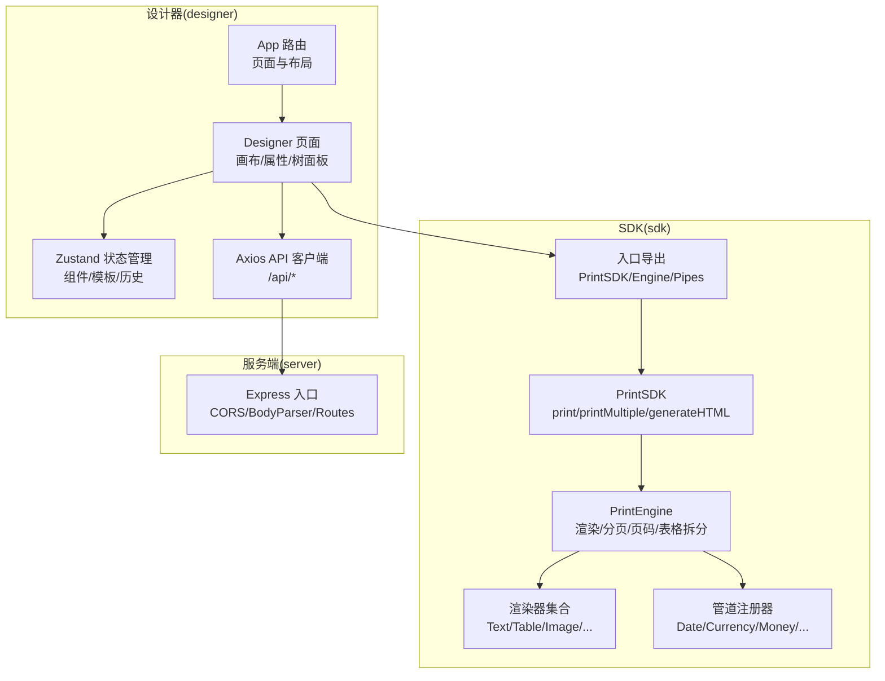
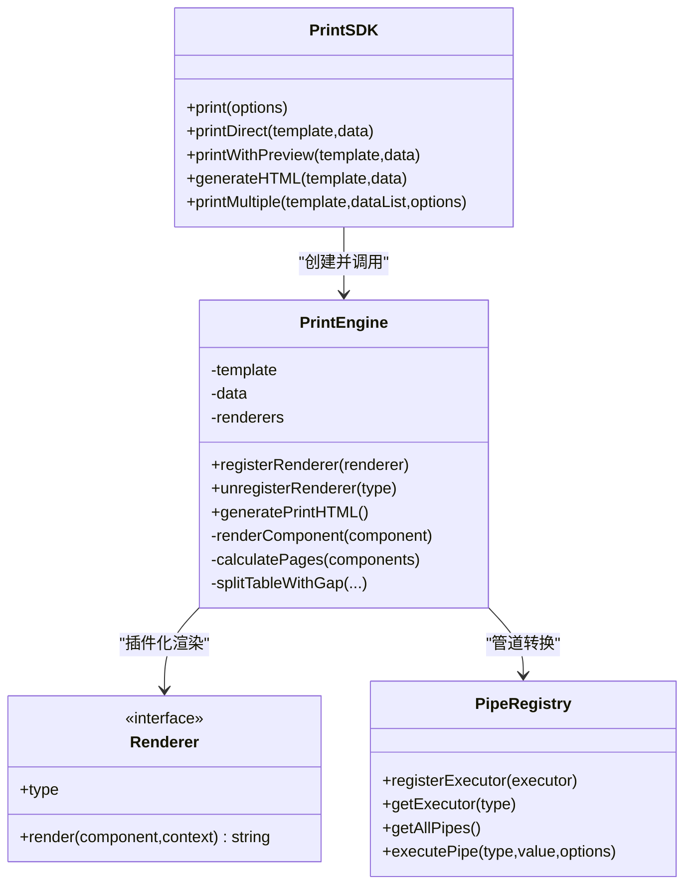
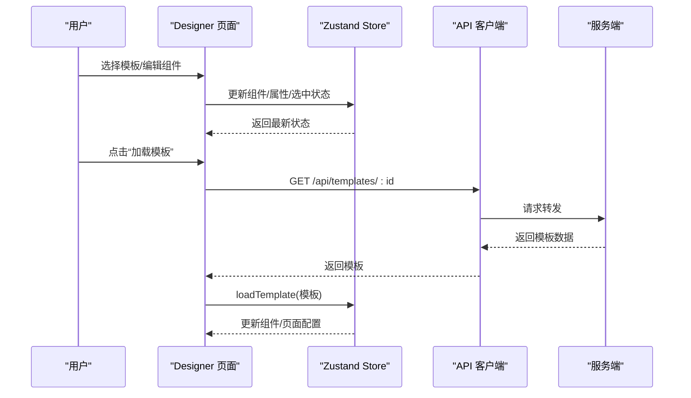
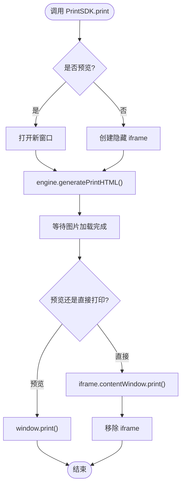
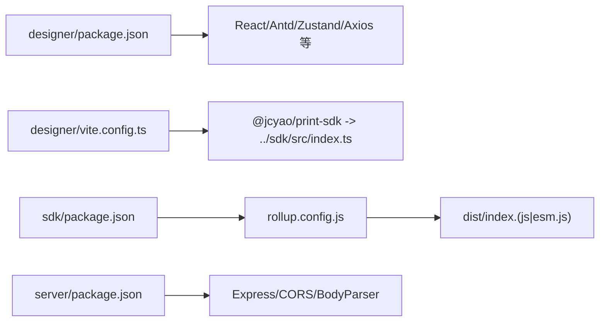

# 技术架构总览

<cite>
**本文引用的文件**
- [designer/package.json](file://designer/package.json)
- [designer/vite.config.ts](file://designer/vite.config.ts)
- [designer/src/App.tsx](file://designer/src/App.tsx)
- [designer/src/pages/Designer/index.tsx](file://designer/src/pages/Designer/index.tsx)
- [designer/src/store/designer.ts](file://designer/src/store/designer.ts)
- [designer/src/services/api.ts](file://designer/src/services/api.ts)
- [sdk/package.json](file://sdk/package.json)
- [sdk/rollup.config.js](file://sdk/rollup.config.js)
- [sdk/src/index.ts](file://sdk/src/index.ts)
- [sdk/src/sdk.ts](file://sdk/src/sdk.ts)
- [sdk/src/types.ts](file://sdk/src/types.ts)
- [sdk/src/PrintSDK.ts](file://sdk/src/PrintSDK.ts)
- [sdk/src/printEngine.ts](file://sdk/src/printEngine.ts)
- [sdk/src/pipes/registry.ts](file://sdk/src/pipes/registry.ts)
- [sdk/src/pipes/index.ts](file://sdk/src/pipes/index.ts)
- [sdk/src/printEngine/renderers/index.ts](file://sdk/src/printEngine/renderers/index.ts)
- [server/package.json](file://server/package.json)
- [server/src/index.ts](file://server/src/index.ts)
</cite>

## 目录
1. [简介](#简介)
2. [项目结构](#项目结构)
3. [核心组件](#核心组件)
4. [架构总览](#架构总览)
5. [详细组件分析](#详细组件分析)
6. [依赖分析](#依赖分析)
7. [性能考量](#性能考量)
8. [故障排查指南](#故障排查指南)
9. [结论](#结论)
10. [附录](#附录)

## 简介
本项目是一个“打印服务平台”，采用“设计器 + SDK + 服务端”三层架构，围绕“模板驱动 + 插件化渲染”的设计理念构建。前端使用 React 18 + TypeScript + Vite 构建可视化设计器；SDK 使用 Rollup 打包，支持 ESM/CJS 输出，提供纯浏览器端打印能力；服务端基于 Express 提供 REST API，支撑模板、Schema、Mock 数据的管理。

技术选型与设计目标：
- 前端：以 DX 优先，快速迭代，组件化与状态管理清晰，路由与布局明确。
- SDK：完全解耦、无状态、可扩展，支持批量打印、页码、表格跨页等复杂场景。
- 服务端：轻量 API，统一跨域与错误处理，便于前后端分离协作。

## 项目结构
项目采用“模块化目录 + 分层职责”的组织方式：
- designer：可视化设计器，负责模板编辑、属性配置、组件树与画布交互。
- sdk：打印 SDK，提供 PrintSDK 与 PrintEngine，渲染器插件化，管道系统可扩展。
- server：REST API 服务，提供模板、Schema、Mock 数据的 CRUD。

图示来源
- [designer/src/App.tsx:1-31](file://designer/src/App.tsx#L1-L31)
- [designer/src/pages/Designer/index.tsx:1-279](file://designer/src/pages/Designer/index.tsx#L1-L279)
- [designer/src/store/designer.ts:1-539](file://designer/src/store/designer.ts#L1-L539)
- [designer/src/services/api.ts:1-97](file://designer/src/services/api.ts#L1-L97)
- [sdk/src/index.ts:1-22](file://sdk/src/index.ts#L1-L22)
- [sdk/src/sdk.ts:1-63](file://sdk/src/sdk.ts#L1-L63)
- [sdk/src/PrintSDK.ts:1-253](file://sdk/src/PrintSDK.ts#L1-L253)
- [sdk/src/printEngine.ts:1-757](file://sdk/src/printEngine.ts#L1-L757)
- [sdk/src/pipes/registry.ts:1-64](file://sdk/src/pipes/registry.ts#L1-L64)
- [server/src/index.ts:1-25](file://server/src/index.ts#L1-L25)

章节来源
- [designer/package.json:1-43](file://designer/package.json#L1-L43)
- [designer/vite.config.ts:1-15](file://designer/vite.config.ts#L1-L15)
- [sdk/package.json:1-60](file://sdk/package.json#L1-L60)
- [sdk/rollup.config.js:1-25](file://sdk/rollup.config.js#L1-L25)
- [server/package.json:1-25](file://server/package.json#L1-L25)

## 核心组件
- 设计器（React 18 + Zustand + Ant Design）
  - 路由与布局：App 路由控制页面切换与 MainLayout 布局。
  - Designer 页面：左侧资产面板、中间画布、右侧属性/树面板，支持折叠与悬浮操作按钮。
  - 状态管理：Zustand Store 管理组件列表、选中、网格、对齐、层级、撤销/重做、复制/粘贴等。
  - API 客户端：Axios 封装 /api/* 接口，支持 Schema、Template、Mock Data 的增删改查。
- SDK（Rollup + ESM/CJS）
  - PrintSDK：对外 API，支持直接打印、预览打印、仅生成 HTML、批量打印（同模板多数据）。
  - PrintEngine：插件化渲染引擎，支持数据绑定、管道转换、虚拟分页、表格跨页拆分、页码渲染。
  - 管道系统：注册器模式管理执行器，内置日期、货币、金额、大小写、切片、默认值等。
  - 渲染器：文本、表格、图片、矩形、直线、二维码、条形码、页码等渲染器插件。
- 服务端（Express）
  - 路由：/api/schemas、/api/templates、/api/mock-data。
  - 中间件：CORS、BodyParser、统一错误处理。

章节来源
- [designer/src/App.tsx:1-31](file://designer/src/App.tsx#L1-L31)
- [designer/src/pages/Designer/index.tsx:1-279](file://designer/src/pages/Designer/index.tsx#L1-L279)
- [designer/src/store/designer.ts:1-539](file://designer/src/store/designer.ts#L1-L539)
- [designer/src/services/api.ts:1-97](file://designer/src/services/api.ts#L1-L97)
- [sdk/src/sdk.ts:1-63](file://sdk/src/sdk.ts#L1-L63)
- [sdk/src/PrintSDK.ts:1-253](file://sdk/src/PrintSDK.ts#L1-L253)
- [sdk/src/printEngine.ts:1-757](file://sdk/src/printEngine.ts#L1-L757)
- [sdk/src/pipes/registry.ts:1-64](file://sdk/src/pipes/registry.ts#L1-L64)
- [server/src/index.ts:1-25](file://server/src/index.ts#L1-L25)

## 架构总览
整体采用“分层架构 + 插件化 + 注册器模式”的设计：
- 分层架构：UI 层（设计器）、业务层（SDK）、数据层（服务端 API）。
- 插件化：PrintEngine 通过注册默认渲染器，并允许外部扩展自定义渲染器。
- 注册器模式：管道系统通过注册表集中管理执行器，支持动态查找与执行。

图示来源
- [sdk/src/PrintSDK.ts:43-244](file://sdk/src/PrintSDK.ts#L43-L244)
- [sdk/src/printEngine.ts:31-756](file://sdk/src/printEngine.ts#L31-L756)
- [sdk/src/pipes/registry.ts:12-52](file://sdk/src/pipes/registry.ts#L12-L52)

## 详细组件分析

### 设计器组件分析
- 路由与布局
  - App 使用 React Router v6+ 管理路由，支持设计器全屏模式与管理页布局。
- 画布与面板
  - Designer 页面包含资产面板、画布、属性面板、组件树面板，支持折叠与悬浮按钮。
- 状态管理
  - Zustand Store 提供组件增删改、选中、复制粘贴、网格、对齐、层级、撤销/重做等能力。
- API 交互
  - Axios 封装 /api/*，分别对接服务端的 schemas、templates、mock-data。

图示来源
- [designer/src/pages/Designer/index.tsx:34-46](file://designer/src/pages/Designer/index.tsx#L34-L46)
- [designer/src/store/designer.ts:150-159](file://designer/src/store/designer.ts#L150-L159)
- [designer/src/services/api.ts:47-50](file://designer/src/services/api.ts#L47-L50)
- [server/src/index.ts:14-16](file://server/src/index.ts#L14-L16)

章节来源
- [designer/src/App.tsx:1-31](file://designer/src/App.tsx#L1-L31)
- [designer/src/pages/Designer/index.tsx:1-279](file://designer/src/pages/Designer/index.tsx#L1-L279)
- [designer/src/store/designer.ts:1-539](file://designer/src/store/designer.ts#L1-L539)
- [designer/src/services/api.ts:1-97](file://designer/src/services/api.ts#L1-L97)

### SDK 组件分析
- PrintSDK
  - 对外提供 print/printDirect/printWithPreview/generateHTML/printMultiple 等方法，支持预览与直接打印、批量打印。
- PrintEngine
  - 插件化渲染引擎，注册默认渲染器，支持数据绑定、管道转换、虚拟分页、表格跨页拆分、页码渲染。
- 管道系统
  - 注册器集中管理执行器，支持动态查找与执行，内置多种常用管道。
- 渲染器集合
  - 文本、表格、图片、矩形、直线、二维码、条形码、页码等渲染器插件。

图示来源
- [sdk/src/PrintSDK.ts:53-97](file://sdk/src/PrintSDK.ts#L53-L97)
- [sdk/src/printEngine.ts:668-725](file://sdk/src/printEngine.ts#L668-L725)

章节来源
- [sdk/src/sdk.ts:1-63](file://sdk/src/sdk.ts#L1-L63)
- [sdk/src/PrintSDK.ts:1-253](file://sdk/src/PrintSDK.ts#L1-L253)
- [sdk/src/printEngine.ts:1-757](file://sdk/src/printEngine.ts#L1-L757)
- [sdk/src/pipes/registry.ts:1-64](file://sdk/src/pipes/registry.ts#L1-L64)
- [sdk/src/printEngine/renderers/index.ts:1-13](file://sdk/src/printEngine/renderers/index.ts#L1-L13)

### 服务端组件分析
- Express 入口
  - 启用 CORS、解析 JSON，挂载路由与统一错误处理。
- 路由
  - /api/schemas、/api/templates、/api/mock-data，分别对应 Schema、Template、Mock Data 的接口。
- 错误处理
  - 中间件统一捕获异常，保证响应一致性。

章节来源
- [server/src/index.ts:1-25](file://server/src/index.ts#L1-L25)

## 依赖分析
- 前端依赖
  - React 18、Ant Design、Zustand、React Router、Axios、Monaco Editor、二维码/条形码库等。
  - Vite 作为构建工具，开发时通过本地 SDK 路径映射实现联调。
- SDK 依赖
  - Rollup 打包，ESM/CJS 双产物，外部依赖通过 external 配置避免打包进 SDK。
  - 内部导出 PrintSDK、PrintEngine、渲染器、管道系统与类型定义。
- 服务端依赖
  - Express、CORS、UUID、BodyParser，提供 REST API。

图示来源
- [designer/package.json:12-28](file://designer/package.json#L12-L28)
- [designer/vite.config.ts:8-12](file://designer/vite.config.ts#L8-L12)
- [sdk/package.json:6-18](file://sdk/package.json#L6-L18)
- [sdk/rollup.config.js:4-18](file://sdk/rollup.config.js#L4-L18)
- [server/package.json:11-15](file://server/package.json#L11-L15)

章节来源
- [designer/package.json:1-43](file://designer/package.json#L1-L43)
- [designer/vite.config.ts:1-15](file://designer/vite.config.ts#L1-L15)
- [sdk/package.json:1-60](file://sdk/package.json#L1-L60)
- [sdk/rollup.config.js:1-25](file://sdk/rollup.config.js#L1-L25)
- [server/package.json:1-25](file://server/package.json#L1-L25)

## 性能考量
- 前端
  - 使用 Zustand 替代 Redux，减少样板代码与内存占用；组件渲染按需更新，避免全局重渲染。
  - Vite 开发体验与热更新，生产构建按需分割与 Tree-shaking。
- SDK
  - 外部依赖 external，减小 SDK 体积；图片资源异步加载，打印前等待资源就绪。
  - 表格跨页拆分采用“精确行高 + 表头复用”策略，避免无效换页。
- 服务端
  - 轻量中间件，统一错误处理，避免异常穿透；路由按模块划分，便于扩展。

## 故障排查指南
- 打印窗口无法打开
  - 检查浏览器弹窗策略，确保允许弹窗；参考 PrintSDK 预览打印分支的错误提示。
- 图片未加载导致打印空白
  - 确认 waitForImagesLoaded 在打印前被正确调用；检查资源地址与跨域。
- 表格跨页异常
  - 检查表格数据与分页配置，确认 repeatHeader 与行高设置；关注控制台警告。
- 设计器无法加载模板
  - 检查 /api/templates/:id 接口连通性与返回格式；确认 Store loadTemplate 流程。
- SDK 本地联调
  - 确认 Vite alias 指向本地 SDK 源码；重启开发服务器使变更生效。

章节来源
- [sdk/src/PrintSDK.ts:59-62](file://sdk/src/PrintSDK.ts#L59-L62)
- [sdk/src/PrintSDK.ts:88-91](file://sdk/src/PrintSDK.ts#L88-L91)
- [sdk/src/printEngine.ts:446-451](file://sdk/src/printEngine.ts#L446-L451)
- [designer/src/services/api.ts:47-50](file://designer/src/services/api.ts#L47-L50)
- [designer/vite.config.ts:10-11](file://designer/vite.config.ts#L10-L11)

## 结论
该打印服务平台以“模板驱动 + 插件化渲染 + 注册器模式”为核心，实现了设计器、SDK、服务端的清晰分层与良好扩展性。前端强调易用性与开发效率，SDK 强调解耦与可扩展，服务端强调简洁与稳定。整体架构适合在企业级打印场景中快速落地与持续演进。

## 附录
- 关键类型与约定
  - PrintTemplate、ComponentNode、DataBinding、PipeConfig、PageConfig 等类型定义见 SDK 类型文件。
  - 设计器 Store 管理模板信息、页面配置、组件列表与历史记录，支持撤销/重做与对齐/分布等高级操作。
- 打印流程建议
  - 优先使用 generateHTML 获取 HTML，再交由 PrintSDK 执行打印或预览。
  - 批量打印时提供进度回调，提升用户体验。

章节来源
- [sdk/src/types.ts:1-171](file://sdk/src/types.ts#L1-L171)
- [designer/src/store/designer.ts:138-148](file://designer/src/store/designer.ts#L138-L148)