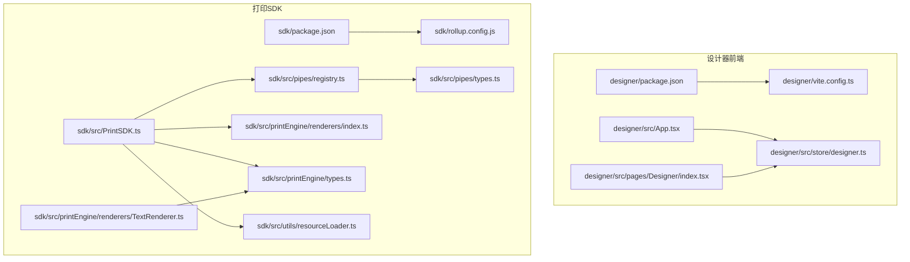
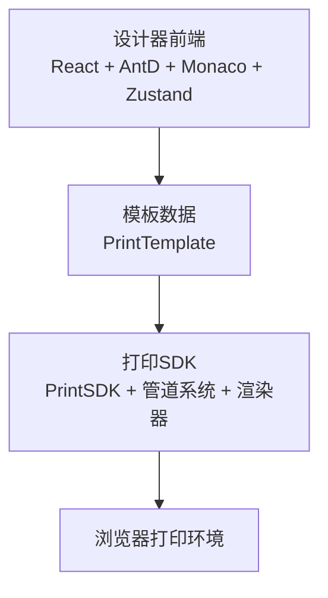
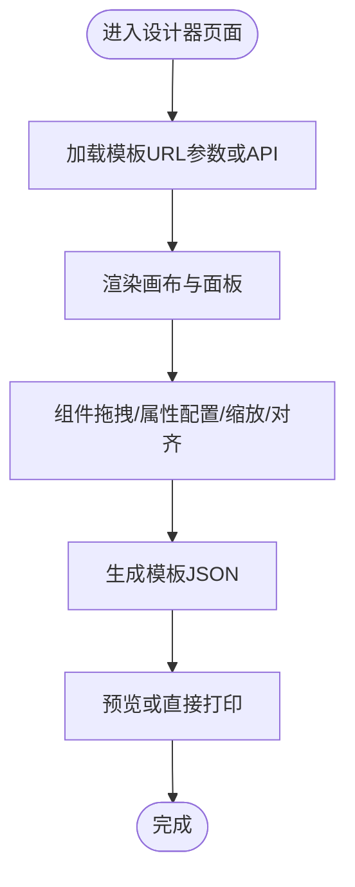
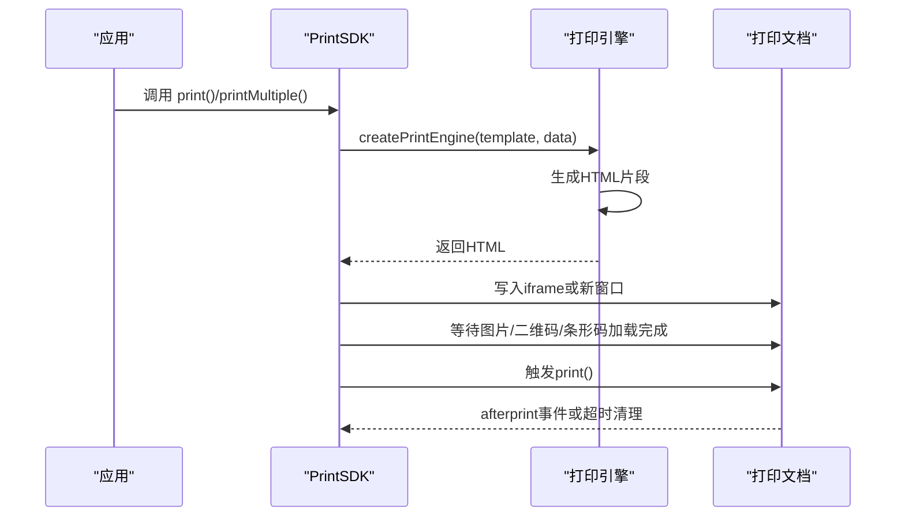
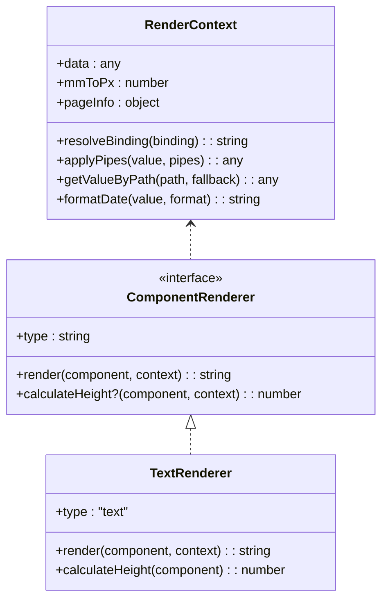
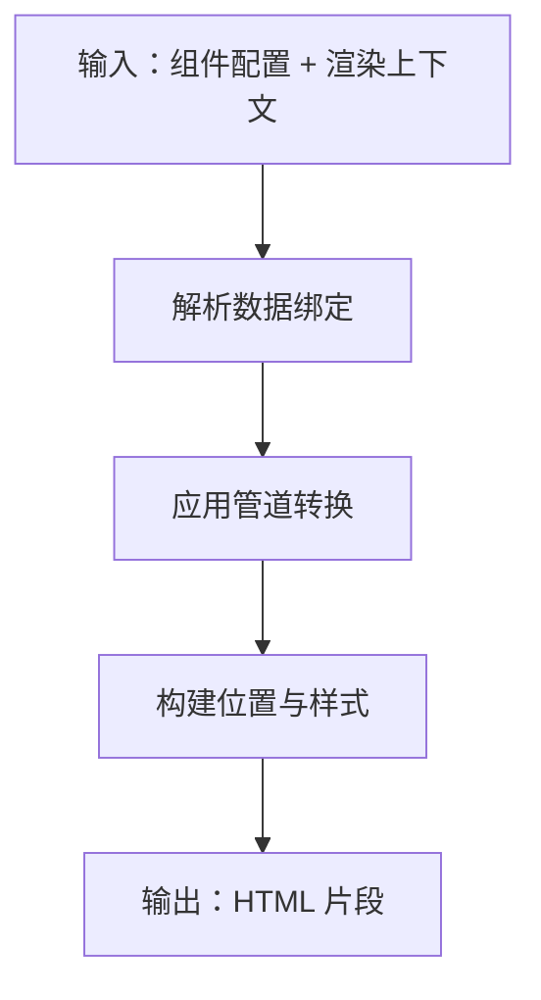
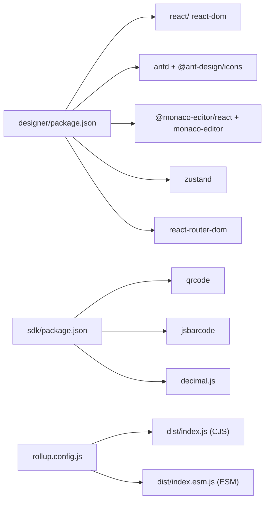

# 技术栈

<cite>
**本文引用的文件**
- [designer/package.json](file://designer/package.json)
- [sdk/package.json](file://sdk/package.json)
- [designer/vite.config.ts](file://designer/vite.config.ts)
- [sdk/rollup.config.js](file://sdk/rollup.config.js)
- [designer/src/App.tsx](file://designer/src/App.tsx)
- [designer/src/store/designer.ts](file://designer/src/store/designer.ts)
- [designer/src/pages/Designer/index.tsx](file://designer/src/pages/Designer/index.tsx)
- [sdk/src/PrintSDK.ts](file://sdk/src/PrintSDK.ts)
- [sdk/src/pipes/registry.ts](file://sdk/src/pipes/registry.ts)
- [sdk/src/printEngine/renderers/index.ts](file://sdk/src/printEngine/renderers/index.ts)
- [sdk/src/printEngine/types.ts](file://sdk/src/printEngine/types.ts)
- [sdk/src/pipes/types.ts](file://sdk/src/pipes/types.ts)
- [sdk/src/printEngine/renderers/TextRenderer.ts](file://sdk/src/printEngine/renderers/TextRenderer.ts)
- [sdk/src/utils/resourceLoader.ts](file://sdk/src/utils/resourceLoader.ts)
- [designer/tsconfig.json](file://designer/tsconfig.json)
</cite>

## 目录
1. [简介](#简介)
2. [项目结构](#项目结构)
3. [核心组件](#核心组件)
4. [架构总览](#架构总览)
5. [详细组件分析](#详细组件分析)
6. [依赖关系分析](#依赖关系分析)
7. [性能考量](#性能考量)
8. [故障排查指南](#故障排查指南)
9. [结论](#结论)
10. [附录](#附录)

## 简介
本文件面向打印设计器项目的开发者与维护者，系统梳理并解释前端与 SDK 技术栈的构成、设计模式与技术选型考量。重点覆盖：
- 前端技术栈：React 18 + TypeScript、Vite 5、Ant Design 6、Monaco Editor、Zustand 状态管理
- SDK 技术栈：Rollup 打包、ESM/CommonJS 双格式输出、qrcode、jsbarcode、decimal.js 等依赖
- 设计模式：注册器模式、插件化架构、分层架构、执行器/配置器分离
- 选型依据：性能、可维护性、扩展性与生态成熟度

## 项目结构
项目采用多包结构，分为设计器前端与打印 SDK 两部分：
- designer：基于 Vite + React 18 + TypeScript 的可视化设计器
- sdk：基于 Rollup 的打印 SDK，提供模板驱动的打印能力

图示来源
- [designer/package.json:1-46](file://designer/package.json#L1-L46)
- [designer/vite.config.ts:1-29](file://designer/vite.config.ts#L1-L29)
- [designer/src/App.tsx:1-31](file://designer/src/App.tsx#L1-L31)
- [designer/src/store/designer.ts:1-773](file://designer/src/store/designer.ts#L1-L773)
- [designer/src/pages/Designer/index.tsx:1-365](file://designer/src/pages/Designer/index.tsx#L1-L365)
- [sdk/package.json:1-61](file://sdk/package.json#L1-L61)
- [sdk/rollup.config.js:1-25](file://sdk/rollup.config.js#L1-L25)
- [sdk/src/PrintSDK.ts:1-477](file://sdk/src/PrintSDK.ts#L1-L477)
- [sdk/src/pipes/registry.ts:1-65](file://sdk/src/pipes/registry.ts#L1-L65)
- [sdk/src/printEngine/renderers/index.ts:1-13](file://sdk/src/printEngine/renderers/index.ts#L1-L13)
- [sdk/src/printEngine/types.ts:1-116](file://sdk/src/printEngine/types.ts#L1-L116)
- [sdk/src/pipes/types.ts:1-30](file://sdk/src/pipes/types.ts#L1-L30)
- [sdk/src/printEngine/renderers/TextRenderer.ts:1-60](file://sdk/src/printEngine/renderers/TextRenderer.ts#L1-L60)
- [sdk/src/utils/resourceLoader.ts:1-90](file://sdk/src/utils/resourceLoader.ts#L1-L90)

章节来源
- [designer/package.json:1-46](file://designer/package.json#L1-L46)
- [sdk/package.json:1-61](file://sdk/package.json#L1-L61)
- [designer/vite.config.ts:1-29](file://designer/vite.config.ts#L1-L29)
- [sdk/rollup.config.js:1-25](file://sdk/rollup.config.js#L1-L25)

## 核心组件
- 前端框架与构建
  - React 18 + TypeScript：提供声明式 UI 与强类型保障
  - Vite 5：快速冷启动、热更新与现代化打包
  - Ant Design 6：企业级 UI 组件库，提供丰富的布局与控件
  - Monaco Editor：代码编辑体验，结合本地化插件提升开发效率
- 状态管理
  - Zustand：轻量、易用的状态管理，适合复杂画布与模板状态
- SDK 打包与运行时
  - Rollup：稳定可靠的打包工具，支持 ESM/CommonJS 双格式
  - qrcode、jsbarcode、decimal.js：打印场景的核心依赖，分别负责二维码、条形码与高精度数值计算

章节来源
- [designer/package.json:13-30](file://designer/package.json#L13-L30)
- [sdk/package.json:49-53](file://sdk/package.json#L49-L53)
- [designer/vite.config.ts:1-29](file://designer/vite.config.ts#L1-L29)
- [sdk/rollup.config.js:1-25](file://sdk/rollup.config.js#L1-L25)
- [designer/src/store/designer.ts:1-773](file://designer/src/store/designer.ts#L1-L773)

## 架构总览
整体架构由“设计器前端 + 打印 SDK”组成，二者通过模板数据进行解耦协作：
- 设计器负责模板的可视化编辑、属性配置与导出
- SDK 负责将模板与数据渲染为可打印的 HTML，并支持预览与直接打印
- 管道系统与渲染器体系实现插件化扩展

图示来源
- [designer/src/App.tsx:1-31](file://designer/src/App.tsx#L1-L31)
- [sdk/src/PrintSDK.ts:100-172](file://sdk/src/PrintSDK.ts#L100-L172)
- [sdk/src/pipes/registry.ts:12-52](file://sdk/src/pipes/registry.ts#L12-L52)
- [sdk/src/printEngine/renderers/index.ts:1-13](file://sdk/src/printEngine/renderers/index.ts#L1-13)

## 详细组件分析

### 前端技术栈与构建
- React 18 + TypeScript
  - 使用 bundler 模式与 JSX 运行时，确保与 Vite 协作顺畅
  - tsconfig 严格模式与无副作用编译，提升构建稳定性
- Vite 5
  - 开发模式下通过别名指向本地 SDK 源码，便于联调
  - 注入环境变量以适配不同部署平台
- Ant Design 6
  - 提供布局、抽屉、标签页、按钮等组件，支撑设计器的面板与交互
- Monaco Editor
  - 本地化插件增强编辑体验，配合 TypeScript 与 ESLint 插件
- Zustand
  - 管理画布组件、模板元数据、网格缩放、撤销重做等复杂状态

图示来源
- [designer/src/pages/Designer/index.tsx:26-46](file://designer/src/pages/Designer/index.tsx#L26-L46)
- [designer/src/store/designer.ts:189-201](file://designer/src/store/designer.ts#L189-L201)

章节来源
- [designer/tsconfig.json:1-26](file://designer/tsconfig.json#L1-L26)
- [designer/vite.config.ts:8-28](file://designer/vite.config.ts#L8-L28)
- [designer/src/pages/Designer/index.tsx:17-365](file://designer/src/pages/Designer/index.tsx#L17-L365)
- [designer/src/store/designer.ts:108-773](file://designer/src/store/designer.ts#L108-L773)

### SDK 技术栈与打包
- 打包工具：Rollup
  - 输出 CJS 与 ESM 两种格式，满足不同运行时需求
  - 外部化 qrcode、jsbarcode、decimal.js，减小包体并避免重复依赖
- 依赖选择
  - qrcode/jsbarcode：浏览器内同步生成二维码/条形码图像，保证打印一致性
  - decimal.js：高精度十进制运算，避免浮点误差
- 打印流程
  - 通过 PrintSDK 接收模板与数据，生成 HTML 并触发打印
  - 支持预览、直接打印、批量打印与多模板批量打印
  - 资源加载完成后触发打印，兜底清理 iframe

图示来源
- [sdk/src/PrintSDK.ts:110-172](file://sdk/src/PrintSDK.ts#L110-L172)
- [sdk/src/PrintSDK.ts:210-322](file://sdk/src/PrintSDK.ts#L210-L322)
- [sdk/src/utils/resourceLoader.ts:12-73](file://sdk/src/utils/resourceLoader.ts#L12-L73)

章节来源
- [sdk/rollup.config.js:1-25](file://sdk/rollup.config.js#L1-L25)
- [sdk/package.json:49-53](file://sdk/package.json#L49-L53)
- [sdk/src/PrintSDK.ts:100-477](file://sdk/src/PrintSDK.ts#L100-L477)
- [sdk/src/utils/resourceLoader.ts:1-90](file://sdk/src/utils/resourceLoader.ts#L1-L90)

### 设计模式与架构要点
- 注册器模式
  - 管道执行器通过注册表集中管理，支持动态查询与扩展
- 插件化架构
  - 渲染器接口统一，新增组件只需实现渲染器即可接入
- 分层架构
  - 渲染上下文、渲染器、样式构建、HTML 生成分层清晰
- 执行器/配置器分离
  - 管道执行器只负责转换逻辑，配置器负责描述与参数传递

图示来源
- [sdk/src/printEngine/types.ts:11-82](file://sdk/src/printEngine/types.ts#L11-L82)
- [sdk/src/printEngine/renderers/TextRenderer.ts:10-59](file://sdk/src/printEngine/renderers/TextRenderer.ts#L10-L59)

章节来源
- [sdk/src/pipes/registry.ts:12-52](file://sdk/src/pipes/registry.ts#L12-L52)
- [sdk/src/pipes/types.ts:11-29](file://sdk/src/pipes/types.ts#L11-L29)
- [sdk/src/printEngine/types.ts:1-116](file://sdk/src/printEngine/types.ts#L1-L116)
- [sdk/src/printEngine/renderers/index.ts:1-13](file://sdk/src/printEngine/renderers/index.ts#L1-L13)

### 管道系统与渲染器体系
- 管道注册器
  - 维护执行器映射，提供查询与执行入口
  - 初始化时注册多种内置管道（日期、货币、中文大写等）
- 渲染器导出
  - 统一导出各类组件渲染器，便于按类型选择
- 渲染上下文
  - 提供数据绑定解析、管道应用、样式构建等能力

图示来源
- [sdk/src/pipes/registry.ts:45-52](file://sdk/src/pipes/registry.ts#L45-L52)
- [sdk/src/printEngine/renderers/index.ts:5-12](file://sdk/src/printEngine/renderers/index.ts#L5-L12)
- [sdk/src/printEngine/renderers/TextRenderer.ts:13-52](file://sdk/src/printEngine/renderers/TextRenderer.ts#L13-L52)

章节来源
- [sdk/src/pipes/registry.ts:1-65](file://sdk/src/pipes/registry.ts#L1-L65)
- [sdk/src/printEngine/renderers/index.ts:1-13](file://sdk/src/printEngine/renderers/index.ts#L1-L13)
- [sdk/src/printEngine/renderers/TextRenderer.ts:1-60](file://sdk/src/printEngine/renderers/TextRenderer.ts#L1-L60)

## 依赖关系分析
- 前端依赖
  - React 生态与 Ant Design 6 提供 UI 与路由
  - Monaco Editor 与本地化插件提升编辑体验
  - Zustand 管理复杂状态
- SDK 依赖
  - qrcode、jsbarcode、decimal.js 为核心运行时依赖
  - Rollup 输出双格式，external 外部化三方库

图示来源
- [designer/package.json:13-30](file://designer/package.json#L13-L30)
- [sdk/package.json:49-53](file://sdk/package.json#L49-L53)
- [sdk/rollup.config.js:5-16](file://sdk/rollup.config.js#L5-L16)

章节来源
- [designer/package.json:1-46](file://designer/package.json#L1-L46)
- [sdk/package.json:1-61](file://sdk/package.json#L1-L61)
- [sdk/rollup.config.js:1-25](file://sdk/rollup.config.js#L1-L25)

## 性能考量
- 构建性能
  - Vite 5 提供快速冷启动与热更新，开发体验优秀
  - Rollup 输出双格式，兼顾 Node 与浏览器生态
- 运行时性能
  - 资源加载等待策略：图片/二维码/条形码加载完成后触发打印，避免白屏或裁切异常
  - 打印完成后清理 iframe，避免内存泄漏
- 状态管理
  - Zustand 无样板代码，状态更新粒度可控，减少不必要重渲染

## 故障排查指南
- 打印窗口无法弹出
  - 检查浏览器弹窗策略与权限设置
  - 确认 PrintSDK 预览模式分支逻辑
- 图片未加载导致打印空白
  - 确认资源加载等待函数已执行
  - 关注超时与错误统计日志
- 模板切换后状态异常
  - 检查模板加载与历史快照回放逻辑
  - 确认撤销/重做索引与历史数组长度一致

章节来源
- [sdk/src/PrintSDK.ts:114-172](file://sdk/src/PrintSDK.ts#L114-L172)
- [sdk/src/utils/resourceLoader.ts:12-73](file://sdk/src/utils/resourceLoader.ts#L12-L73)
- [designer/src/store/designer.ts:509-548](file://designer/src/store/designer.ts#L509-L548)

## 结论
本项目在前端与 SDK 两端均选择了成熟稳定的生态方案：React 18 + TypeScript + Vite 5 保证开发效率与构建质量；Ant Design 6 与 Monaco Editor 提升用户体验；Zustand 降低状态管理复杂度。SDK 侧以 Rollup 产出双格式包，结合 qrcode、jsbarcode、decimal.js 等依赖，形成可扩展、可维护的打印能力。设计模式层面，注册器与插件化架构使系统具备良好的扩展性与可演进性。

## 附录
- 开发与构建建议
  - 使用 Vite 的本地别名指向 SDK 源码，便于联调
  - 在生产构建中开启最小化与 sourcemap，便于问题追踪
- 发布与分发
  - 通过 npm 发布 ESM/CJS 双产物，满足不同消费场景
  - 保持 external 依赖明确，避免重复打包