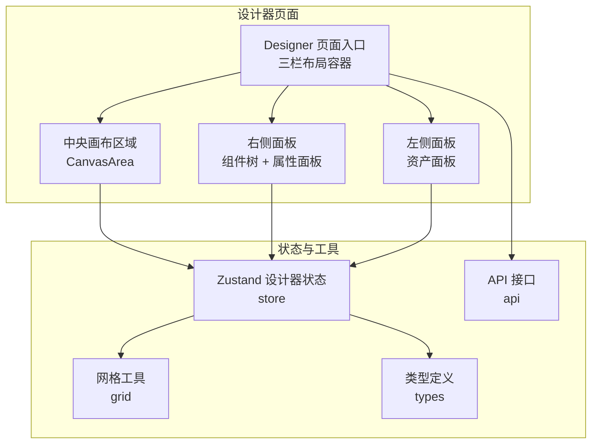
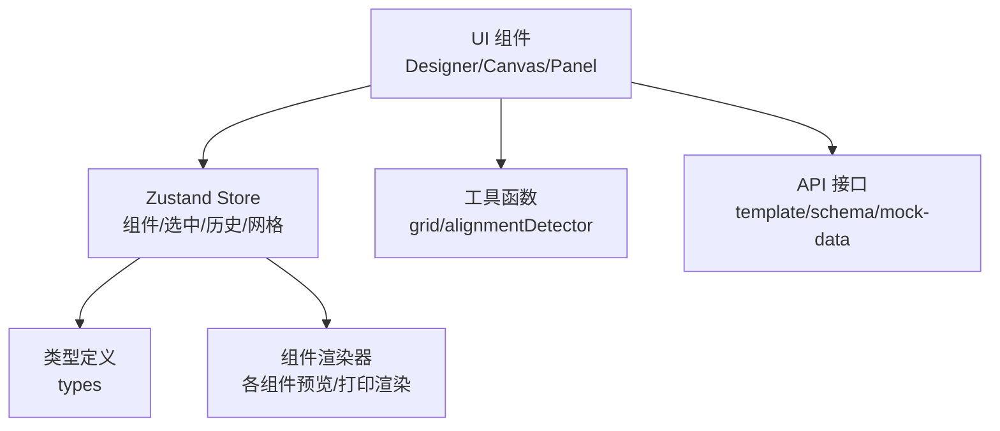
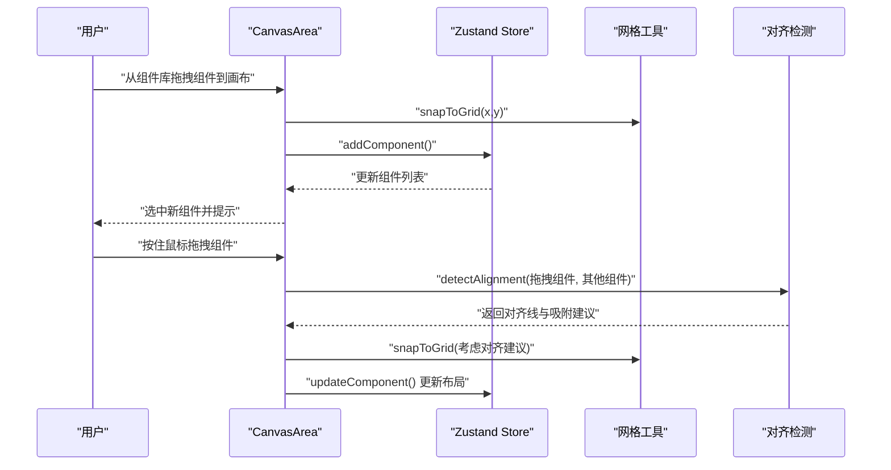
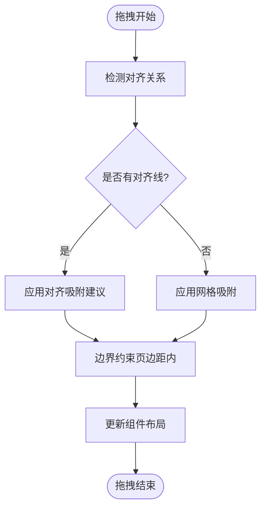
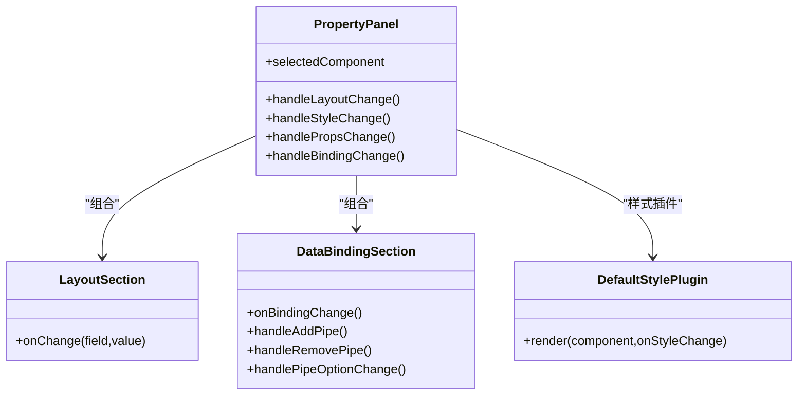
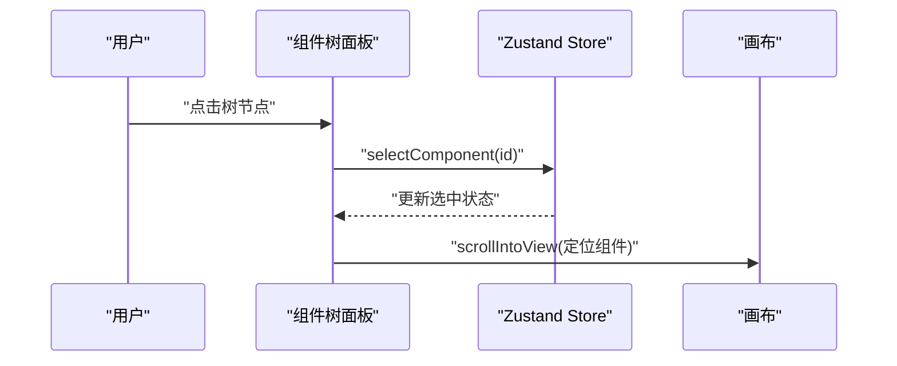
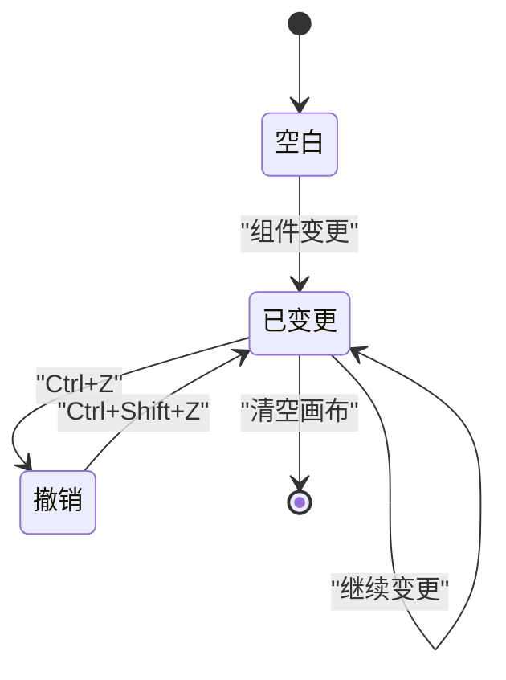
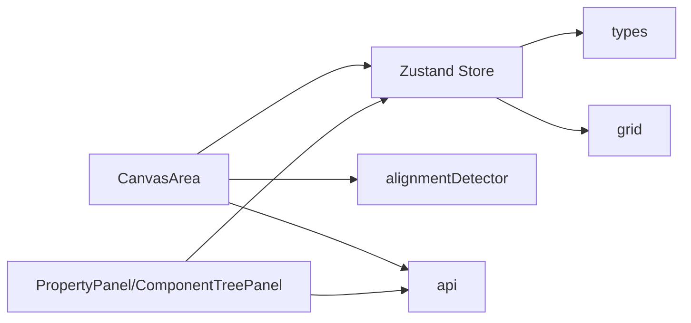

# 可视化模板设计器

<cite>
**本文引用的文件**
- [Designer 页面入口](file://designer/src/pages/Designer/index.tsx)
- [画布区域 CanvasArea](file://designer/src/pages/Designer/components/Canvas/index.tsx)
- [画布工具栏 CanvasToolbar](file://designer/src/pages/Designer/components/Canvas/CanvasToolbar.tsx)
- [智能对齐参考线 AlignmentGuides](file://designer/src/pages/Designer/components/Canvas/AlignmentGuides.tsx)
- [对齐检测工具 alignmentDetector](file://designer/src/pages/Designer/components/Canvas/alignmentDetector.ts)
- [网格工具 grid](file://designer/src/utils/grid.ts)
- [设计器状态管理 store](file://designer/src/store/designer.ts)
- [属性面板 PropertyPanel](file://designer/src/pages/Designer/components/PropertyPanel/index.tsx)
- [布局属性 LayoutSection](file://designer/src/pages/Designer/components/PropertyPanel/LayoutSection.tsx)
- [数据绑定 DataBindingSection](file://designer/src/pages/Designer/components/PropertyPanel/DataBindingSection.tsx)
- [默认样式插件 DefaultStylePlugin](file://designer/src/pages/Designer/components/PropertyPanel/stylePlugins/DefaultStylePlugin.tsx)
- [组件树面板 ComponentTreePanel](file://designer/src/pages/Designer/components/ComponentTreePanel/index.tsx)
- [资产面板 AssetPanel](file://designer/src/pages/Designer/components/AssetPanel/index.tsx)
- [设计器类型定义 types](file://designer/src/types/index.ts)
- [设计器 API 接口 api](file://designer/src/services/api.ts)
</cite>

## 目录
1. [简介](#简介)
2. [项目结构](#项目结构)
3. [核心组件](#核心组件)
4. [架构总览](#架构总览)
5. [详细组件分析](#详细组件分析)
6. [依赖关系分析](#依赖关系分析)
7. [性能考量](#性能考量)
8. [故障排查指南](#故障排查指南)
9. [结论](#结论)
10. [附录](#附录)

## 简介
本文件系统性阐述“可视化模板设计器”的功能与实现，覆盖三栏布局（数据资产树 + 画布编辑器 + 属性面板）、拖拽式设计、智能网格吸附与对齐参考线、组件树面板、撤销/重做、多页预览与快速打印、数据绑定与管道（Pipes）等核心能力。文档面向设计师与开发者，既提供高层架构说明，也给出交互流程图与使用步骤，帮助快速上手并高效产出高质量打印模板。

## 项目结构
设计器采用页面级模块化组织，核心位于 Designer 页面，围绕画布区域、属性面板、组件树面板与资产面板协同工作；状态管理集中于 Zustand store，类型定义与 API 接口分别位于 types 与 services 目录。

图表来源
- [Designer 页面入口:17-279](file://designer/src/pages/Designer/index.tsx#L17-L279)
- [画布区域 CanvasArea:20-1006](file://designer/src/pages/Designer/components/Canvas/index.tsx#L20-L1006)
- [设计器状态管理 store:85-539](file://designer/src/store/designer.ts#L85-L539)
- [网格工具 grid:12-35](file://designer/src/utils/grid.ts#L12-L35)
- [设计器类型定义 types:48-160](file://designer/src/types/index.ts#L48-L160)
- [设计器 API 接口 api:1-97](file://designer/src/services/api.ts#L1-L97)

章节来源
- [Designer 页面入口:17-279](file://designer/src/pages/Designer/index.tsx#L17-L279)

## 核心组件
- 三栏布局容器：左侧资产面板（数据资产 + 组件库），中央画布区域，右侧组件树 + 属性面板。
- 画布区域：拖拽添加组件、拖拽移动、智能对齐、网格吸附、快捷键操作、页面设置、快速打印。
- 属性面板：布局、数据绑定、样式（插件化）、表格列配置。
- 组件树面板：树状展示、快速定位、右键菜单。
- 状态管理：组件集合、选中状态、历史记录、网格、对齐与分布、层级管理、复制粘贴等。
- 工具与类型：网格吸附、对齐检测、模板与组件类型、API 接口。

章节来源
- [资产面板 AssetPanel:7-32](file://designer/src/pages/Designer/components/AssetPanel/index.tsx#L7-L32)
- [画布区域 CanvasArea:20-1006](file://designer/src/pages/Designer/components/Canvas/index.tsx#L20-L1006)
- [属性面板 PropertyPanel:16-129](file://designer/src/pages/Designer/components/PropertyPanel/index.tsx#L16-L129)
- [组件树面板 ComponentTreePanel:74-176](file://designer/src/pages/Designer/components/ComponentTreePanel/index.tsx#L74-L176)
- [设计器状态管理 store:85-539](file://designer/src/store/designer.ts#L85-L539)

## 架构总览
设计器采用“页面容器 + 画布 + 面板 + 状态管理 + 工具函数”的分层架构。画布负责用户交互与实时渲染，状态管理统一维护组件树与历史，工具函数提供网格与对齐能力，类型定义保证数据一致性，API 提供模板与 Schema 的增删改查。

图表来源
- [画布区域 CanvasArea:20-1006](file://designer/src/pages/Designer/components/Canvas/index.tsx#L20-L1006)
- [设计器状态管理 store:85-539](file://designer/src/store/designer.ts#L85-L539)
- [网格工具 grid:12-35](file://designer/src/utils/grid.ts#L12-L35)
- [对齐检测工具 alignmentDetector:24-158](file://designer/src/pages/Designer/components/Canvas/alignmentDetector.ts#L24-L158)
- [设计器类型定义 types:48-160](file://designer/src/types/index.ts#L48-L160)
- [设计器 API 接口 api:1-97](file://designer/src/services/api.ts#L1-L97)

## 详细组件分析

### 画布区域 CanvasArea
- 拖拽添加组件：支持从组件库拖拽到画布中心附近，自动吸附到网格；支持从数据资产拖拽生成文本/表格组件，并绑定字段路径。
- 拖拽移动与吸附：鼠标拖拽组件时，实时计算偏移并应用网格吸附；按住 Shift 可临时禁用网格吸附；单选时启用智能对齐参考线检测。
- 快捷键：Delete/Backspace 删除选中组件；Ctrl+C/V/D 复制/粘贴/克隆；Ctrl+Z/Z+Shift 一键撤销/重做。
- 页面设置：支持 A4/A5/自定义/连续纸，横竖向切换，页边距与页码配置。
- 快速打印：无需保存即可打开预览弹窗进行多页预览与实时打印。

图表来源
- [画布区域 CanvasArea:195-562](file://designer/src/pages/Designer/components/Canvas/index.tsx#L195-L562)
- [网格工具 grid:12-15](file://designer/src/utils/grid.ts#L12-L15)
- [对齐检测工具 alignmentDetector:24-158](file://designer/src/pages/Designer/components/Canvas/alignmentDetector.ts#L24-L158)
- [设计器状态管理 store:87-100](file://designer/src/store/designer.ts#L87-L100)

章节来源
- [画布区域 CanvasArea:66-161](file://designer/src/pages/Designer/components/Canvas/index.tsx#L66-L161)
- [画布区域 CanvasArea:195-378](file://designer/src/pages/Designer/components/Canvas/index.tsx#L195-L378)
- [画布区域 CanvasArea:434-562](file://designer/src/pages/Designer/components/Canvas/index.tsx#L434-L562)
- [画布工具栏 CanvasToolbar:54-166](file://designer/src/pages/Designer/components/Canvas/CanvasToolbar.tsx#L54-L166)

### 智能网格吸附与对齐参考线
- 网格吸附：开启后将坐标按网格步进吸附；按住 Shift 可临时禁用网格吸附。
- 对齐检测：单选组件拖拽时，检测与其它组件的对齐关系（左/右/中、上/下/中），绘制参考线并提供吸附建议，优先级高于网格吸附。
- 参考线渲染：垂直/水平参考线与标签提示，便于精确对齐。

图表来源
- [对齐检测工具 alignmentDetector:24-158](file://designer/src/pages/Designer/components/Canvas/alignmentDetector.ts#L24-L158)
- [智能对齐参考线 AlignmentGuides:21-66](file://designer/src/pages/Designer/components/Canvas/AlignmentGuides.tsx#L21-L66)
- [网格工具 grid:12-15](file://designer/src/utils/grid.ts#L12-L15)
- [画布区域 CanvasArea:465-543](file://designer/src/pages/Designer/components/Canvas/index.tsx#L465-L543)

章节来源
- [画布区域 CanvasArea:66-73](file://designer/src/pages/Designer/components/Canvas/index.tsx#L66-L73)
- [对齐检测工具 alignmentDetector:24-158](file://designer/src/pages/Designer/components/Canvas/alignmentDetector.ts#L24-L158)
- [智能对齐参考线 AlignmentGuides:21-66](file://designer/src/pages/Designer/components/Canvas/AlignmentGuides.tsx#L21-L66)

### 属性面板 PropertyPanel
- 布局属性：X/Y/宽/高数值输入，支持直接修改与拖拽。
- 数据绑定：绑定路径、默认值（fallback）、数据管道（Pipes）链式配置，支持动态增删与参数配置。
- 样式属性：通过插件化样式插件适配不同组件的样式配置（如默认样式插件提供字体大小）。
- 表格列配置：仅表格组件显示，支持列标题、宽度、对齐、隐藏、合计等。

图表来源
- [属性面板 PropertyPanel:16-129](file://designer/src/pages/Designer/components/PropertyPanel/index.tsx#L16-L129)
- [布局属性 LayoutSection:17-68](file://designer/src/pages/Designer/components/PropertyPanel/LayoutSection.tsx#L17-L68)
- [数据绑定 DataBindingSection:20-128](file://designer/src/pages/Designer/components/PropertyPanel/DataBindingSection.tsx#L20-L128)
- [默认样式插件 DefaultStylePlugin:12-30](file://designer/src/pages/Designer/components/PropertyPanel/stylePlugins/DefaultStylePlugin.tsx#L12-L30)

章节来源
- [属性面板 PropertyPanel:16-129](file://designer/src/pages/Designer/components/PropertyPanel/index.tsx#L16-L129)
- [布局属性 LayoutSection:17-68](file://designer/src/pages/Designer/components/PropertyPanel/LayoutSection.tsx#L17-L68)
- [数据绑定 DataBindingSection:20-128](file://designer/src/pages/Designer/components/PropertyPanel/DataBindingSection.tsx#L20-L128)
- [默认样式插件 DefaultStylePlugin:12-30](file://designer/src/pages/Designer/components/PropertyPanel/stylePlugins/DefaultStylePlugin.tsx#L12-L30)

### 组件树面板 ComponentTreePanel
- 树状展示：按组件类型与索引显示，支持绑定路径标注。
- 快速定位：点击树节点滚动到画布对应组件。
- 右键菜单：复制组件、删除组件等操作。
- 选中同步：树节点选中即选中画布组件。

图表来源
- [组件树面板 ComponentTreePanel:74-176](file://designer/src/pages/Designer/components/ComponentTreePanel/index.tsx#L74-L176)
- [设计器状态管理 store:108-125](file://designer/src/store/designer.ts#L108-L125)

章节来源
- [组件树面板 ComponentTreePanel:74-176](file://designer/src/pages/Designer/components/ComponentTreePanel/index.tsx#L74-L176)

### 资产面板 AssetPanel
- 数据资产：展示 Schema 字段，支持拖拽到画布生成组件。
- 组件库：提供常用组件（文本、图片、表格、线条、二维码、条形码、矩形）的拖拽添加。

章节来源
- [资产面板 AssetPanel:7-32](file://designer/src/pages/Designer/components/AssetPanel/index.tsx#L7-L32)

### 撤销/重做与历史管理
- 历史记录：最多保存固定步数的历史快照，每次组件变更均入栈。
- 撤销/重做：基于 historyIndex 的前后指针，支持条件判断（canUndo/canRedo）。
- 快捷键：Ctrl+Z 撤销，Ctrl+Shift+Z 重做。

图表来源
- [设计器状态管理 store:297-331](file://designer/src/store/designer.ts#L297-L331)
- [画布区域 CanvasArea:139-148](file://designer/src/pages/Designer/components/Canvas/index.tsx#L139-L148)

章节来源
- [设计器状态管理 store:297-331](file://designer/src/store/designer.ts#L297-L331)
- [画布区域 CanvasArea:139-148](file://designer/src/pages/Designer/components/Canvas/index.tsx#L139-L148)

### 多页预览与实时打印
- 快速打印：画布非空时可直接打开预览弹窗进行多页预览与打印。
- 页面设置：支持 A4/A5/自定义/连续纸，横竖向切换，页边距与页码配置。

章节来源
- [画布区域 CanvasArea:688-731](file://designer/src/pages/Designer/components/Canvas/index.tsx#L688-L731)
- [画布工具栏 CanvasToolbar:139-160](file://designer/src/pages/Designer/components/Canvas/CanvasToolbar.tsx#L139-L160)

### 数据绑定系统集成
- 绑定路径：支持 JSON Path，如 user.name、items.0.title。
- 管道（Pipes）：链式数据格式化，按顺序执行，支持动态增删与参数配置。
- 与 SDK 集成：通过 SDK 注册器获取可用管道类型与配置器。

章节来源
- [数据绑定 DataBindingSection:20-128](file://designer/src/pages/Designer/components/PropertyPanel/DataBindingSection.tsx#L20-L128)
- [设计器类型定义 types:66-75](file://designer/src/types/index.ts#L66-L75)

## 依赖关系分析
- 组件耦合：画布区域与状态管理强耦合，负责事件处理与状态更新；属性面板与组件树面板通过 store 读取与写入选中状态。
- 外部依赖：API 接口封装模板/Schema/MockData 的 CRUD；SDK 提供 Pipes 注册与配置器。
- 循环依赖：未见循环导入；工具函数（grid/alignmentDetector）为纯函数，避免状态耦合。

图表来源
- [画布区域 CanvasArea:20-1006](file://designer/src/pages/Designer/components/Canvas/index.tsx#L20-L1006)
- [属性面板 PropertyPanel:16-129](file://designer/src/pages/Designer/components/PropertyPanel/index.tsx#L16-L129)
- [组件树面板 ComponentTreePanel:74-176](file://designer/src/pages/Designer/components/ComponentTreePanel/index.tsx#L74-L176)
- [设计器状态管理 store:85-539](file://designer/src/store/designer.ts#L85-L539)
- [网格工具 grid:12-35](file://designer/src/utils/grid.ts#L12-L35)
- [对齐检测工具 alignmentDetector:24-158](file://designer/src/pages/Designer/components/Canvas/alignmentDetector.ts#L24-L158)
- [设计器类型定义 types:48-160](file://designer/src/types/index.ts#L48-L160)
- [设计器 API 接口 api:1-97](file://designer/src/services/api.ts#L1-L97)

章节来源
- [设计器状态管理 store:85-539](file://designer/src/store/designer.ts#L85-L539)
- [设计器类型定义 types:48-160](file://designer/src/types/index.ts#L48-L160)
- [设计器 API 接口 api:1-97](file://designer/src/services/api.ts#L1-L97)

## 性能考量
- 历史记录上限：最多保存固定步数历史，避免内存膨胀。
- 网格吸附与对齐：在拖拽过程中按需计算，避免不必要的重渲染。
- 连续纸动态高度：仅在连续纸模式下计算内容最大底部，减少常规场景开销。
- 复制粘贴偏移：粘贴时对坐标进行网格吸附并轻微偏移，提升批量操作体验。

章节来源
- [设计器状态管理 store:5-83](file://designer/src/store/designer.ts#L5-L83)
- [画布区域 CanvasArea:734-770](file://designer/src/pages/Designer/components/Canvas/index.tsx#L734-L770)
- [网格工具 grid:12-15](file://designer/src/utils/grid.ts#L12-L15)

## 故障排查指南
- 无法拖拽组件：检查画布是否处于可拖拽状态，确认未在输入框等可编辑元素中触发快捷键。
- 网格吸附无效：确认网格开关已开启，按住 Shift 可临时禁用吸附。
- 对齐参考线不出现：仅在单选组件拖拽时生效，多选会清空参考线。
- 删除快捷键无效：确保焦点不在输入框、文本域或可编辑元素中。
- 预览空白：确保画布存在组件，或先添加组件再进行快速打印。
- 模板加载失败：检查服务端接口连通性与模板 ID 正确性。

章节来源
- [画布区域 CanvasArea:112-161](file://designer/src/pages/Designer/components/Canvas/index.tsx#L112-L161)
- [画布区域 CanvasArea:688-695](file://designer/src/pages/Designer/components/Canvas/index.tsx#L688-L695)
- [设计器状态管理 store:297-331](file://designer/src/store/designer.ts#L297-L331)

## 结论
该可视化模板设计器以清晰的三栏布局与完善的交互体系为核心，结合网格吸附与智能对齐、撤销/重做、数据绑定与管道、组件树与属性面板，形成一套高效、易用且可扩展的设计方案。通过状态集中管理与工具函数解耦，既保证了开发效率，也为后续扩展（如更多组件类型、更复杂的对齐策略）提供了良好基础。

## 附录

### 使用步骤与快捷键
- 新建/重置：点击“重置”清空画布。
- 添加组件：从“组件库”拖拽到画布；或从“数据资产”拖拽生成带绑定的组件。
- 移动与吸附：拖拽组件，自动吸附网格；按住 Shift 可临时禁用网格吸附。
- 对齐与分布：选中多个组件后使用对齐/分布按钮。
- 快捷键：
  - 删除：Delete/Backspace
  - 复制：Ctrl+C
  - 粘贴：Ctrl+V
  - 克隆：Ctrl+D
  - 撤销：Ctrl+Z
  - 重做：Ctrl+Shift+Z
- 页面设置：点击“页面设置”配置纸张、方向、边距与页码。
- 快速打印：点击“测试打印”打开预览弹窗进行多页预览与打印。

章节来源
- [画布工具栏 CanvasToolbar:54-166](file://designer/src/pages/Designer/components/Canvas/CanvasToolbar.tsx#L54-L166)
- [画布区域 CanvasArea:112-161](file://designer/src/pages/Designer/components/Canvas/index.tsx#L112-L161)
- [画布区域 CanvasArea:688-731](file://designer/src/pages/Designer/components/Canvas/index.tsx#L688-L731)