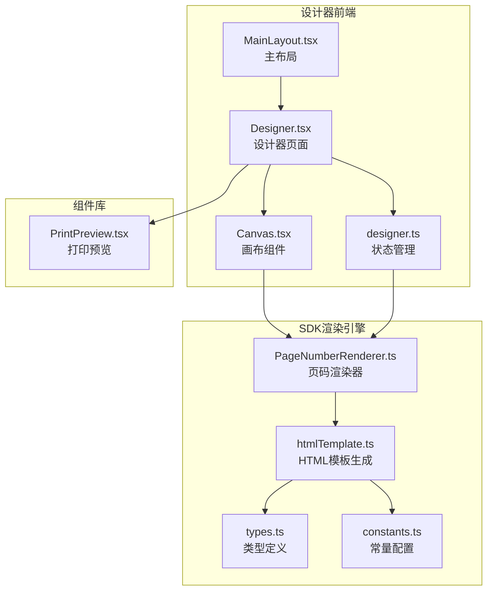
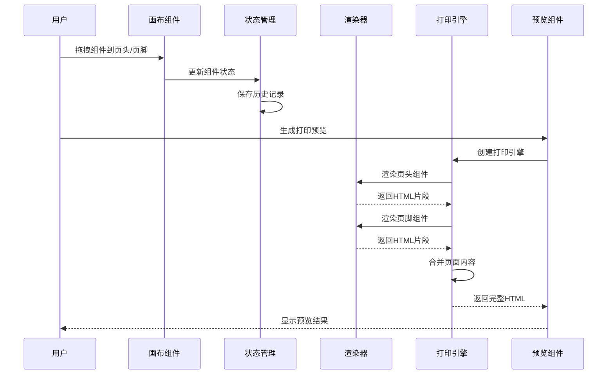
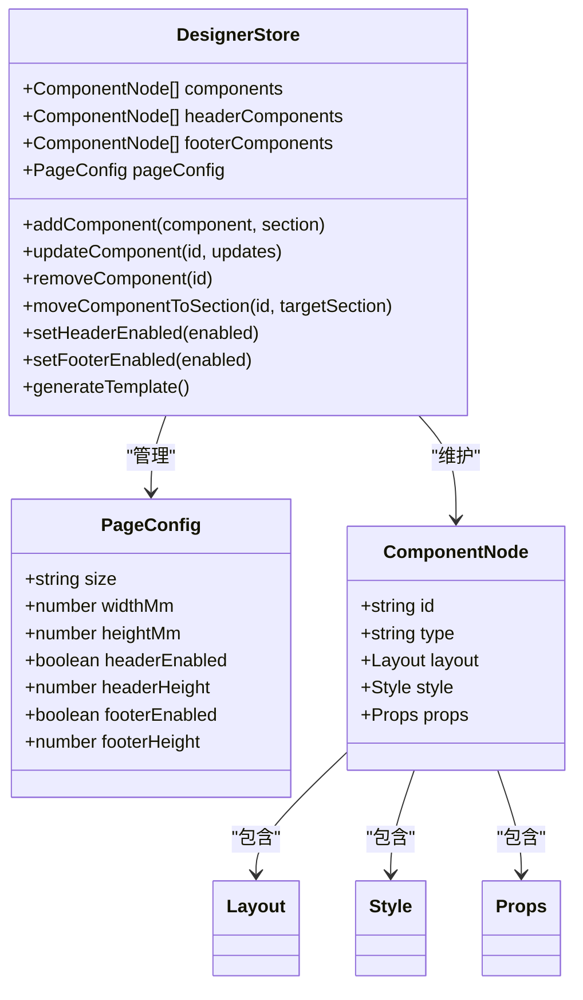
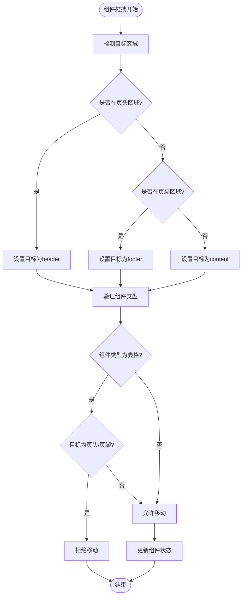
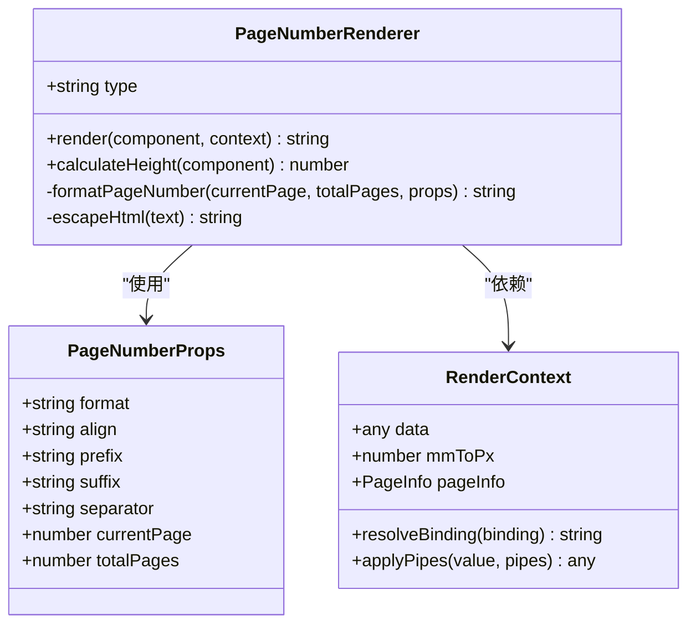
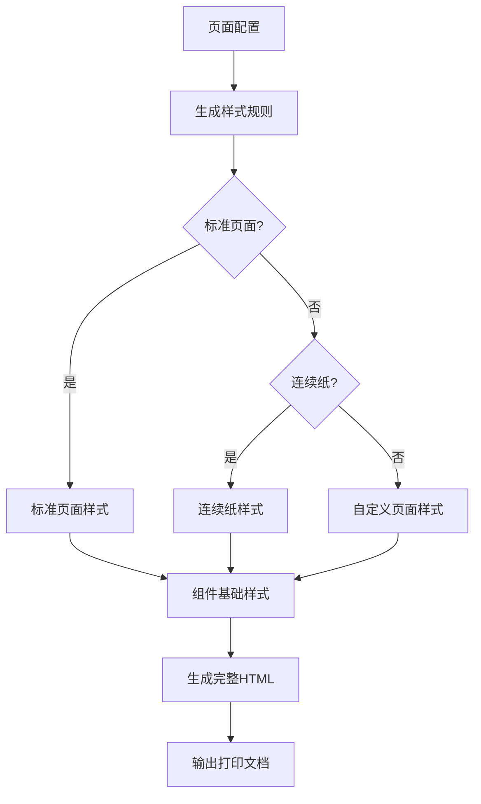
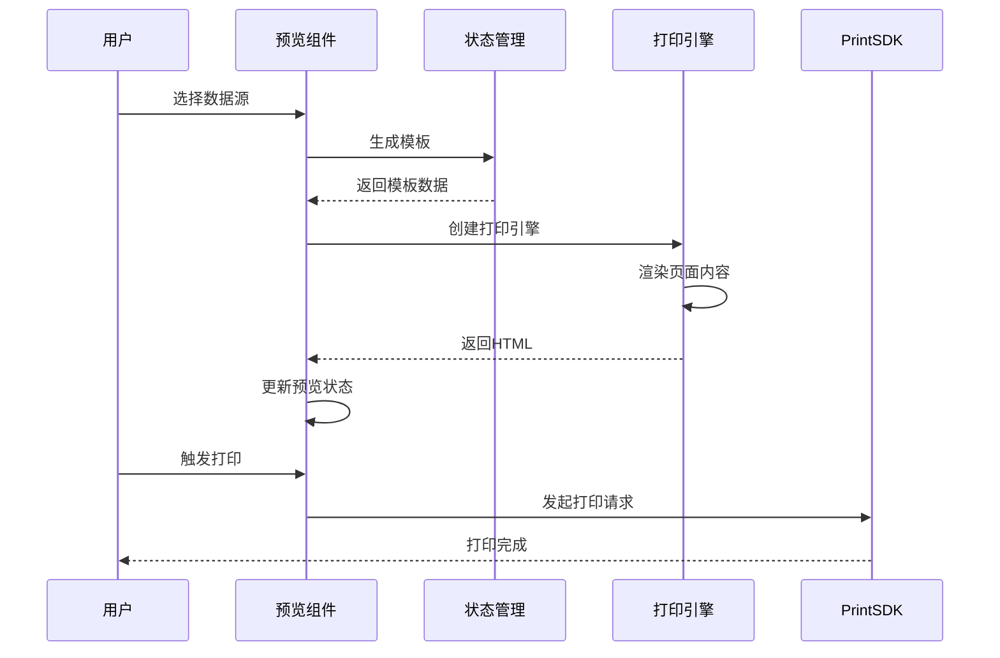
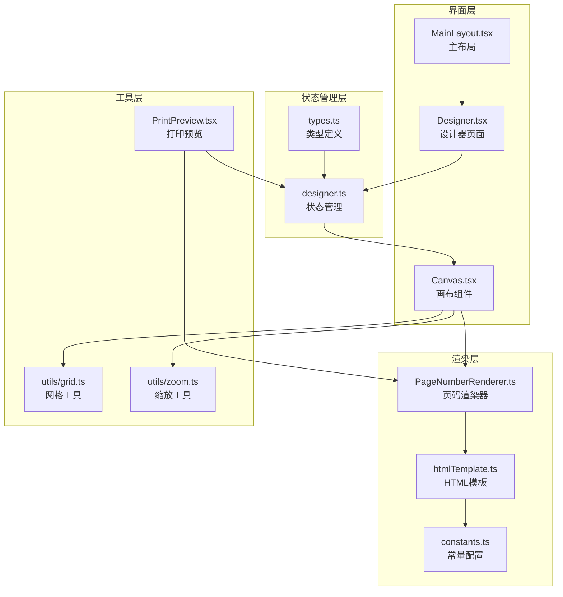

# 头尾部功能

<cite>
**本文档引用的文件**
- [MainLayout.tsx](file://designer/src/layouts/MainLayout.tsx)
- [Designer.tsx](file://designer/src/pages/Designer/index.tsx)
- [Canvas.tsx](file://designer/src/pages/Designer/components/Canvas/index.tsx)
- [designer.ts](file://designer/src/store/designer.ts)
- [types.ts](file://designer/src/types/index.ts)
- [PageNumberRenderer.ts](file://sdk/src/printEngine/renderers/PageNumberRenderer.ts)
- [htmlTemplate.ts](file://sdk/src/printEngine/htmlTemplate.ts)
- [types.ts](file://sdk/src/types.ts)
- [constants.ts](file://sdk/src/printEngine/constants.ts)
- [PrintPreview.tsx](file://designer/src/components/PrintPreview/index.tsx)
</cite>

## 目录
1. [简介](#简介)
2. [项目结构](#项目结构)
3. [核心组件](#核心组件)
4. [架构概览](#架构概览)
5. [详细组件分析](#详细组件分析)
6. [依赖分析](#依赖分析)
7. [性能考虑](#性能考虑)
8. [故障排除指南](#故障排除指南)
9. [结论](#结论)

## 简介

头尾部功能是打印设计器系统中的重要组成部分，负责管理页面的页眉和页脚区域。该功能允许用户在模板设计时创建和编辑页面顶部和底部的内容区域，包括页码组件、文本内容和其他装饰性元素。

本文档深入分析了头尾部功能的实现架构，包括设计器界面、存储管理、渲染引擎和打印预览等核心组件。重点涵盖了页头页脚区域的启用/禁用机制、动态高度调整、组件拖拽放置以及页码渲染等功能。

## 项目结构

打印设计器项目采用模块化架构，头尾部功能分布在以下主要模块中：

**图表来源**
- [MainLayout.tsx:12-56](file://designer/src/layouts/MainLayout.tsx#L12-L56)
- [Designer.tsx:17-365](file://designer/src/pages/Designer/index.tsx#L17-L365)
- [Canvas.tsx:22-800](file://designer/src/pages/Designer/components/Canvas/index.tsx#L22-L800)

**章节来源**
- [MainLayout.tsx:12-56](file://designer/src/layouts/MainLayout.tsx#L12-L56)
- [Designer.tsx:17-365](file://designer/src/pages/Designer/index.tsx#L17-L365)
- [Canvas.tsx:22-800](file://designer/src/pages/Designer/components/Canvas/index.tsx#L22-L800)

## 核心组件

头尾部功能的核心组件包括：

### 1. 状态管理组件
- **Designer Store**: 管理页头、内容、页脚三部分组件的状态
- **页面配置**: 包含页头页脚启用状态和高度设置

### 2. 设计器界面组件
- **Canvas**: 提供拖拽放置和区域切换功能
- **MainLayout**: 提供导航和侧边栏功能

### 3. 渲染引擎组件
- **PageNumberRenderer**: 专门处理页码组件渲染
- **HTMLTemplate**: 生成打印页面的CSS样式

### 4. 预览和打印组件
- **PrintPreview**: 提供打印预览和批量打印功能

**章节来源**
- [designer.ts:92-106](file://designer/src/store/designer.ts#L92-L106)
- [types.ts:115-123](file://designer/src/types/index.ts#L115-L123)
- [PageNumberRenderer.ts:14-105](file://sdk/src/printEngine/renderers/PageNumberRenderer.ts#L14-L105)
- [htmlTemplate.ts:81-171](file://sdk/src/printEngine/htmlTemplate.ts#L81-L171)

## 架构概览

头尾部功能采用分层架构设计，实现了清晰的关注点分离：

**图表来源**
- [Canvas.tsx:281-480](file://designer/src/pages/Designer/components/Canvas/index.tsx#L281-L480)
- [designer.ts:108-125](file://designer/src/store/designer.ts#L108-L125)
- [PrintPreview.tsx:174-304](file://designer/src/components/PrintPreview/index.tsx#L174-L304)

## 详细组件分析

### 状态管理系统

状态管理系统是头尾部功能的核心，负责维护页面各个区域的状态信息：

**图表来源**
- [designer.ts:9-90](file://designer/src/store/designer.ts#L9-L90)
- [types.ts:91-123](file://designer/src/types/index.ts#L91-L123)
- [types.ts:303-331](file://designer/src/types/index.ts#L303-L331)

#### 区域管理机制

系统实现了智能的区域管理机制，支持组件在不同页面区域间的移动：

**图表来源**
- [Canvas.tsx:647-684](file://designer/src/pages/Designer/components/Canvas/index.tsx#L647-L684)
- [designer.ts:469-506](file://designer/src/store/designer.ts#L469-L506)

**章节来源**
- [designer.ts:108-250](file://designer/src/store/designer.ts#L108-L250)
- [Canvas.tsx:647-684](file://designer/src/pages/Designer/components/Canvas/index.tsx#L647-L684)

### 页码渲染器

页码渲染器是专门处理页码组件的核心组件，支持多种显示格式：

**图表来源**
- [PageNumberRenderer.ts:14-105](file://sdk/src/printEngine/renderers/PageNumberRenderer.ts#L14-L105)
- [types.ts:121-129](file://sdk/src/types.ts#L121-L129)
- [types.ts:11-55](file://sdk/src/printEngine/types.ts#L11-L55)

#### 页码格式化逻辑

页码渲染器支持三种格式化模式：

| 格式类型 | 描述 | 示例输出 |
|---------|------|----------|
| simple | 简单数字格式 | 1, 2, 3 |
| text | 文本格式 | 第1页 共3页 |
| slash | 斜杠分隔 | 1/3 |

**章节来源**
- [PageNumberRenderer.ts:66-94](file://sdk/src/printEngine/renderers/PageNumberRenderer.ts#L66-L94)

### HTML模板生成

HTML模板生成器负责创建打印页面的CSS样式和结构：

**图表来源**
- [htmlTemplate.ts:81-171](file://sdk/src/printEngine/htmlTemplate.ts#L81-L171)
- [htmlTemplate.ts:229-251](file://sdk/src/printEngine/htmlTemplate.ts#L229-L251)

**章节来源**
- [htmlTemplate.ts:81-171](file://sdk/src/printEngine/htmlTemplate.ts#L81-L171)
- [htmlTemplate.ts:229-280](file://sdk/src/printEngine/htmlTemplate.ts#L229-L280)

### 打印预览功能

打印预览组件提供了完整的预览和打印体验：

**图表来源**
- [PrintPreview.tsx:174-304](file://designer/src/components/PrintPreview/index.tsx#L174-L304)
- [PrintPreview.tsx:340-418](file://designer/src/components/PrintPreview/index.tsx#L340-L418)

**章节来源**
- [PrintPreview.tsx:174-304](file://designer/src/components/PrintPreview/index.tsx#L174-L304)
- [PrintPreview.tsx:340-418](file://designer/src/components/PrintPreview/index.tsx#L340-L418)

## 依赖分析

头尾部功能的依赖关系展现了清晰的模块化设计：

**图表来源**
- [designer.ts:1-773](file://designer/src/store/designer.ts#L1-L773)
- [Canvas.tsx:1-800](file://designer/src/pages/Designer/components/Canvas/index.tsx#L1-L800)
- [PageNumberRenderer.ts:1-105](file://sdk/src/printEngine/renderers/PageNumberRenderer.ts#L1-L105)

**章节来源**
- [designer.ts:1-773](file://designer/src/store/designer.ts#L1-L773)
- [Canvas.tsx:1-800](file://designer/src/pages/Designer/components/Canvas/index.tsx#L1-L800)

## 性能考虑

头尾部功能在设计时充分考虑了性能优化：

### 1. 状态管理优化
- 使用 zustand 进行高效的状态管理
- 历史记录限制在20步以内
- 智能的组件更新策略

### 2. 渲染性能优化
- 组件渲染器的懒加载机制
- CSS样式的统一管理
- 预览模式下的DOM最小化更新

### 3. 内存管理
- 组件克隆时的深拷贝优化
- 画布清理时的资源释放
- 模板缓存的智能管理

## 故障排除指南

### 常见问题及解决方案

#### 1. 组件无法拖拽到页头/页脚
**问题症状**: 拖拽表格组件到页头或页脚区域被拒绝
**解决方法**: 表格组件不支持放置在页头/页脚区域，需要移动到内容区域

#### 2. 页头高度设置无效
**问题症状**: 调整页头高度后页面布局异常
**解决方法**: 确保页头高度至少为15mm，且不超过内容区域可用空间

#### 3. 页码不显示
**问题症状**: 页面上看不到页码
**解决方法**: 检查页码组件的属性配置，确认格式设置正确

#### 4. 打印预览空白
**问题症状**: 预览窗口显示空白
**解决方法**: 确认选择了有效的Mock数据，检查模板组件配置

**章节来源**
- [Canvas.tsx:298-302](file://designer/src/pages/Designer/components/Canvas/index.tsx#L298-L302)
- [designer.ts:480-481](file://designer/src/store/designer.ts#L480-L481)

## 结论

头尾部功能通过精心设计的架构实现了灵活而强大的页面区域管理能力。系统采用分层架构，将状态管理、界面交互、渲染逻辑和工具功能清晰分离，既保证了功能的完整性，又确保了系统的可维护性和扩展性。

关键特性包括：
- **智能区域管理**: 支持组件在页头、内容、页脚间的智能移动
- **灵活的高度控制**: 动态调整页头页脚高度，适应不同打印需求
- **丰富的渲染支持**: 完整的组件渲染体系，包括页码组件
- **完善的预览功能**: 提供实时预览和批量打印能力
- **优秀的用户体验**: 直观的拖拽界面和响应式设计

该功能为打印设计器提供了坚实的基础，能够满足各种复杂的打印模板设计需求。