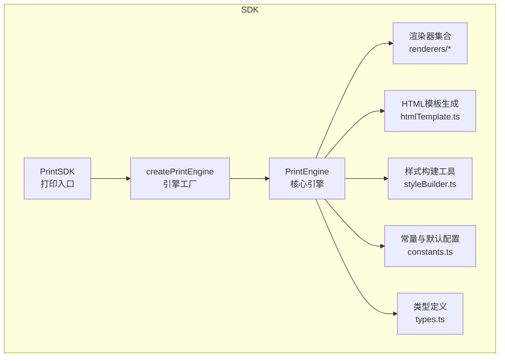
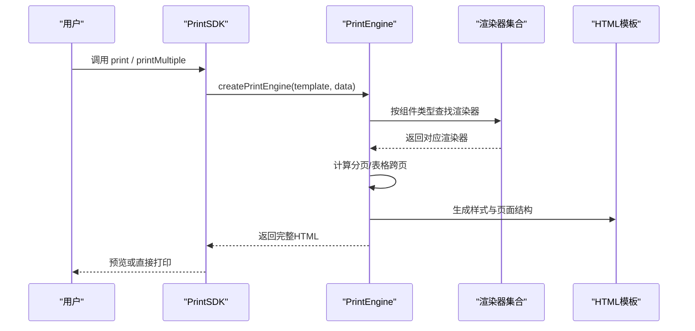
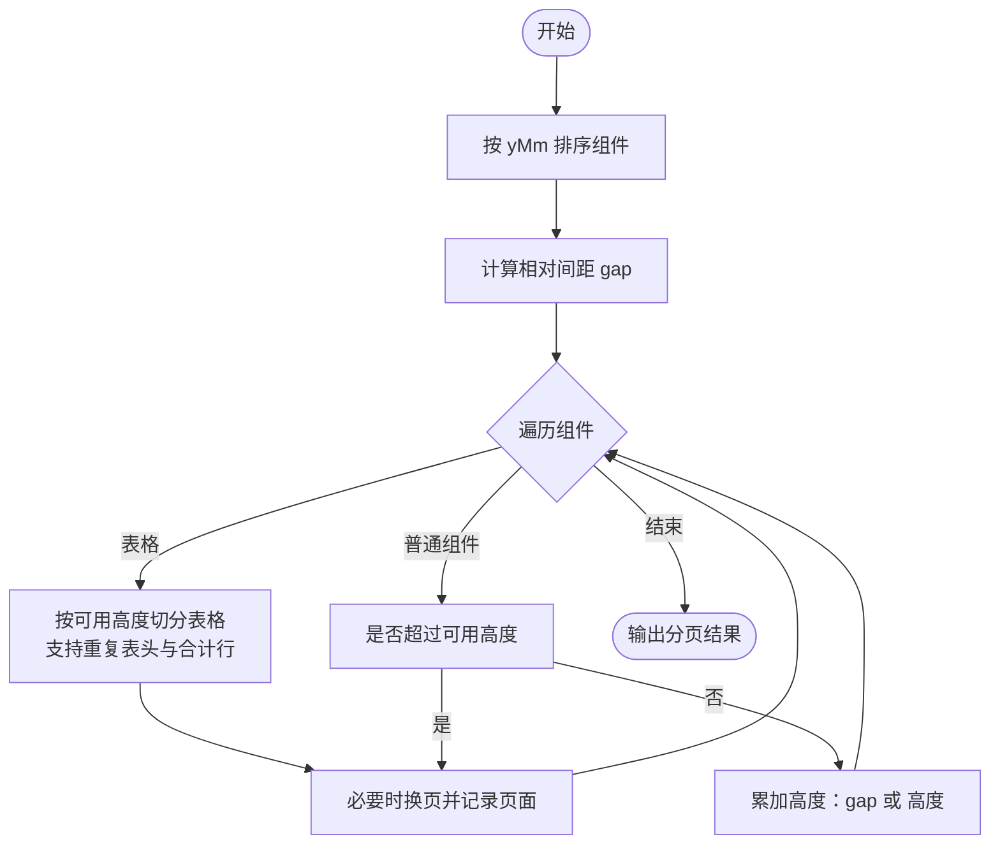
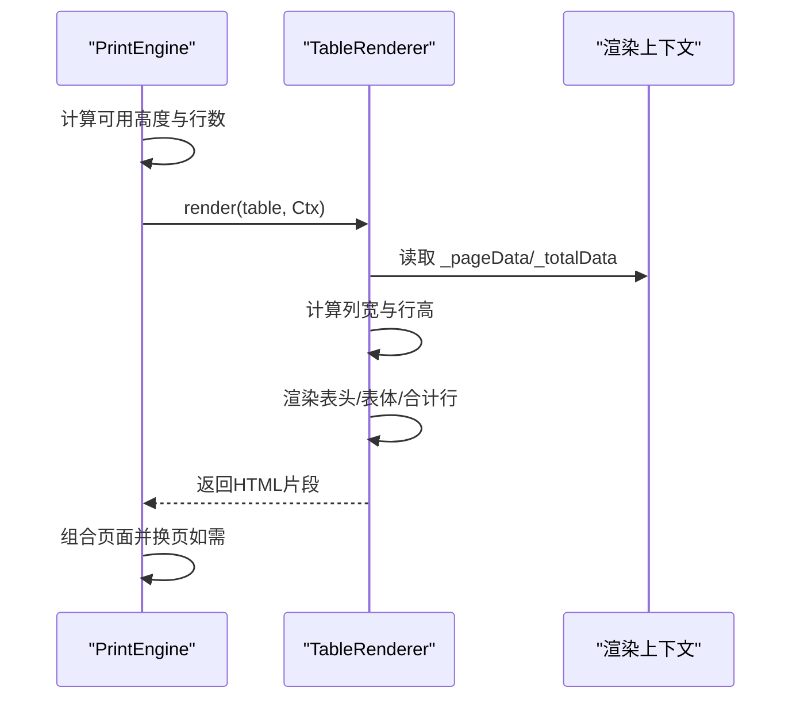
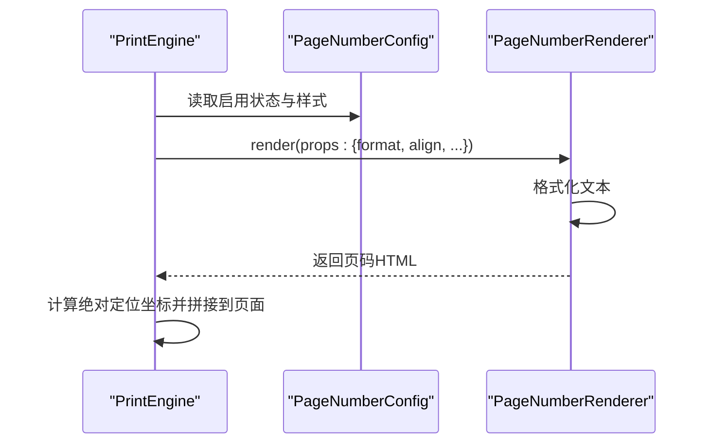
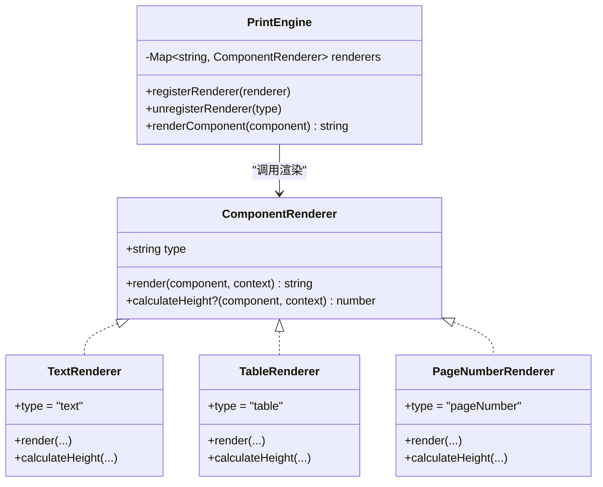
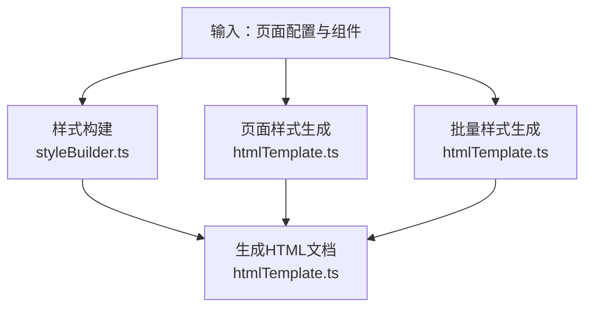
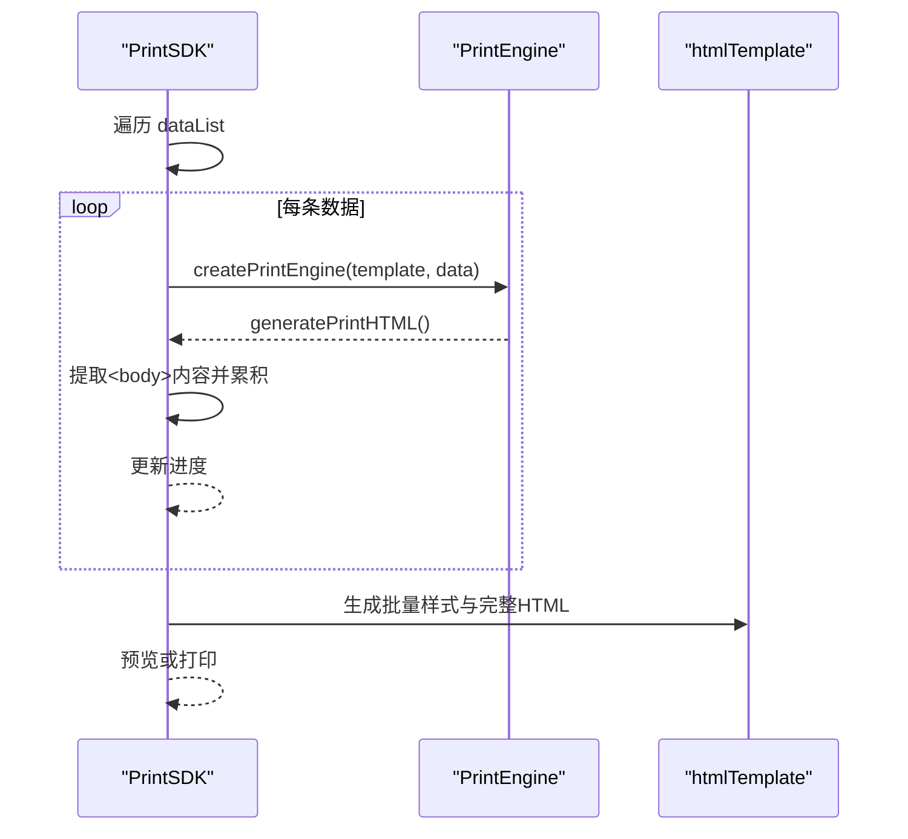
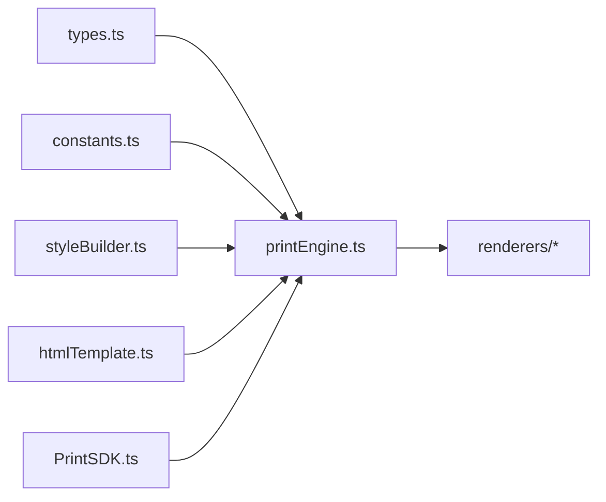

# 打印引擎

<cite>
**本文引用的文件**   
- [sdk/src/printEngine/types.ts](file://sdk/src/printEngine/types.ts)
- [sdk/src/printEngine/constants.ts](file://sdk/src/printEngine/constants.ts)
- [sdk/src/printEngine/htmlTemplate.ts](file://sdk/src/printEngine/htmlTemplate.ts)
- [sdk/src/printEngine/utils/styleBuilder.ts](file://sdk/src/printEngine/utils/styleBuilder.ts)
- [sdk/src/printEngine/renderers/index.ts](file://sdk/src/printEngine/renderers/index.ts)
- [sdk/src/printEngine/renderers/TableRenderer.ts](file://sdk/src/printEngine/renderers/TableRenderer.ts)
- [sdk/src/printEngine/renderers/PageNumberRenderer.ts](file://sdk/src/printEngine/renderers/PageNumberRenderer.ts)
- [sdk/src/printEngine/renderers/TextRenderer.ts](file://sdk/src/printEngine/renderers/TextRenderer.ts)
- [sdk/src/printEngine/renderers/BarcodeRenderer.ts](file://sdk/src/printEngine/renderers/BarcodeRenderer.ts)
- [sdk/src/printEngine.ts](file://sdk/src/printEngine.ts)
- [sdk/src/PrintSDK.ts](file://sdk/src/PrintSDK.ts)
- [sdk/src/types.ts](file://sdk/src/types.ts)
</cite>

## 目录
1. [简介](#简介)
2. [项目结构](#项目结构)
3. [核心组件](#核心组件)
4. [架构总览](#架构总览)
5. [详细组件分析](#详细组件分析)
6. [依赖关系分析](#依赖关系分析)
7. [性能考量](#性能考量)
8. [故障排除指南](#故障排除指南)
9. [结论](#结论)
10. [附录](#附录)

## 简介
本文件系统性阐述打印引擎的设计与实现，重点覆盖以下能力：
- 相对间距（Gap）分页模型：基于组件间相对间距的流式分页，支持表格跨页与智能换页。
- 表格智能跨页：按可用高度动态切分表格，支持重复表头、合计行跨页控制。
- 页码功能：v1.0.1 新增，支持6种位置、3种格式、可自定义样式的页码组件。
- 渲染器插件化：统一的组件渲染器接口，便于扩展与替换。
- 样式构建与HTML模板：集中管理打印样式与页面模板，支持连续纸与标准分页。
- 批量打印预览：一次性生成多页并统一打印，减少用户确认次数。

## 项目结构
打印引擎位于 SDK 子模块中，采用“插件化渲染器 + 统一模板生成”的架构。核心目录与职责如下：
- printEngine：打印引擎核心、渲染器、样式与模板生成。
- pipes：管道（Pipe）注册与执行，用于数据格式化。
- utils：通用工具（如资源加载等待）。
- types：模板、组件、页码、表格等类型定义。
- PrintSDK：面向用户的打印入口，封装预览、直接打印与批量打印。

图表来源
- [sdk/src/PrintSDK.ts:43-253](file://sdk/src/PrintSDK.ts#L43-L253)
- [sdk/src/printEngine.ts:31-757](file://sdk/src/printEngine.ts#L31-L757)
- [sdk/src/printEngine/renderers/index.ts:1-13](file://sdk/src/printEngine/renderers/index.ts#L1-L13)
- [sdk/src/printEngine/htmlTemplate.ts:1-274](file://sdk/src/printEngine/htmlTemplate.ts#L1-L274)
- [sdk/src/printEngine/utils/styleBuilder.ts:1-54](file://sdk/src/printEngine/utils/styleBuilder.ts#L1-L54)
- [sdk/src/printEngine/constants.ts:1-113](file://sdk/src/printEngine/constants.ts#L1-L113)
- [sdk/src/types.ts:1-171](file://sdk/src/types.ts#L1-L171)

章节来源
- [sdk/src/PrintSDK.ts:43-253](file://sdk/src/PrintSDK.ts#L43-L253)
- [sdk/src/printEngine.ts:31-757](file://sdk/src/printEngine.ts#L31-L757)

## 核心组件
- 渲染器插件化：组件渲染器需实现统一接口，支持文本、表格、图片、矩形、线条、二维码、条形码等。
- 渲染上下文：向渲染器提供数据解析、管道应用、路径取值、日期格式化、页面信息等能力。
- 分页计算：基于相对间距的流式分页，支持表格跨页与合计行控制。
- 页码组件：页面级配置，支持多种位置与格式，可自定义样式。
- HTML模板与样式：集中生成打印样式与页面结构，支持连续纸与标准分页。
- 批量打印：将多份数据合并为一份完整文档，统一打印或预览。

章节来源
- [sdk/src/printEngine/types.ts:57-82](file://sdk/src/printEngine/types.ts#L57-L82)
- [sdk/src/printEngine/types.ts:11-55](file://sdk/src/printEngine/types.ts#L11-L55)
- [sdk/src/printEngine.ts:396-541](file://sdk/src/printEngine.ts#L396-L541)
- [sdk/src/printEngine/renderers/PageNumberRenderer.ts:14-105](file://sdk/src/printEngine/renderers/PageNumberRenderer.ts#L14-L105)
- [sdk/src/printEngine/htmlTemplate.ts:81-170](file://sdk/src/printEngine/htmlTemplate.ts#L81-L170)
- [sdk/src/PrintSDK.ts:135-243](file://sdk/src/PrintSDK.ts#L135-L243)

## 架构总览
打印流程分为三层：
- 用户层：PrintSDK 提供 print、printDirect、printWithPreview、generateHTML、printMultiple 等方法。
- 引擎层：PrintEngine 负责插件注册、数据绑定、管道应用、分页计算、HTML生成。
- 渲染层：各组件渲染器负责将组件节点渲染为HTML字符串，并可选提供高度估算。

图表来源
- [sdk/src/PrintSDK.ts:53-97](file://sdk/src/PrintSDK.ts#L53-L97)
- [sdk/src/PrintSDK.ts:135-243](file://sdk/src/PrintSDK.ts#L135-L243)
- [sdk/src/printEngine.ts:197-207](file://sdk/src/printEngine.ts#L197-L207)
- [sdk/src/printEngine/htmlTemplate.ts:223-245](file://sdk/src/printEngine/htmlTemplate.ts#L223-L245)

## 详细组件分析

### 相对间距分页模型与表格跨页
- 相对间距：按组件 yMm 排序，计算相邻组件的 gap = 当前组件 y - 上一组件底部 y；首个组件 gap 为其到页面顶部距离。
- 累加高度：当前页高度从 marginTop 开始累加，若加入 gap+组件高度超过可用高度则换页。
- 表格跨页：按表头高度与行高计算可容纳行数，逐页切分；支持 repeatHeader、合计行控制（每页或仅最后一页）。
- 表格高度估算：基于内容长度估算换行数，结合默认行高与行高系数，得出近似高度。

图表来源
- [sdk/src/printEngine.ts:396-541](file://sdk/src/printEngine.ts#L396-L541)
- [sdk/src/printEngine.ts:547-663](file://sdk/src/printEngine.ts#L547-L663)

章节来源
- [sdk/src/printEngine.ts:244-253](file://sdk/src/printEngine.ts#L244-L253)
- [sdk/src/printEngine.ts:396-541](file://sdk/src/printEngine.ts#L396-L541)
- [sdk/src/printEngine.ts:547-663](file://sdk/src/printEngine.ts#L547-L663)

### 表格智能跨页与合计机制
- 跨页切分：根据可用高度与表头/行高计算可容纳行数，逐页生成片段；支持 repeatHeader 控制是否重复表头。
- 合计行：支持 page 与 total 两种模式；page 模式每页显示，total 模式仅最后一页显示；合计类型包括 sum、avg、max、min、count，支持精度、前后缀。
- 精度保障：使用高精度数值库进行合计计算，避免浮点误差。
- 数据传递：向渲染器传递 _pageData、_showHeader、_isLastPage、_totalData 等内部字段，确保渲染一致性。

图表来源
- [sdk/src/printEngine/renderers/TableRenderer.ts:14-161](file://sdk/src/printEngine/renderers/TableRenderer.ts#L14-L161)
- [sdk/src/printEngine/renderers/TableRenderer.ts:166-213](file://sdk/src/printEngine/renderers/TableRenderer.ts#L166-L213)
- [sdk/src/printEngine/renderers/TableRenderer.ts:218-269](file://sdk/src/printEngine/renderers/TableRenderer.ts#L218-L269)
- [sdk/src/printEngine.ts:547-663](file://sdk/src/printEngine.ts#L547-L663)

章节来源
- [sdk/src/printEngine/renderers/TableRenderer.ts:14-161](file://sdk/src/printEngine/renderers/TableRenderer.ts#L14-L161)
- [sdk/src/printEngine/renderers/TableRenderer.ts:166-213](file://sdk/src/printEngine/renderers/TableRenderer.ts#L166-L213)
- [sdk/src/printEngine/renderers/TableRenderer.ts:218-269](file://sdk/src/printEngine/renderers/TableRenderer.ts#L218-L269)

### 页码功能（v1.0.1 新增）
- 位置：支持顶部与底部的左/中/右六种位置，支持偏移量。
- 格式：simple（1,2,3）、text（第1页 共3页）、slash（1/3），支持前缀/后缀与分隔符。
- 样式：可配置字号、颜色、字重；自动适配对齐。
- 渲染：根据页面尺寸与页边距计算绝对定位坐标，生成固定尺寸的页码块。

图表来源
- [sdk/src/printEngine.ts:274-362](file://sdk/src/printEngine.ts#L274-L362)
- [sdk/src/printEngine/renderers/PageNumberRenderer.ts:17-57](file://sdk/src/printEngine/renderers/PageNumberRenderer.ts#L17-L57)
- [sdk/src/types.ts:30-46](file://sdk/src/types.ts#L30-L46)

章节来源
- [sdk/src/printEngine.ts:274-362](file://sdk/src/printEngine.ts#L274-L362)
- [sdk/src/printEngine/renderers/PageNumberRenderer.ts:14-105](file://sdk/src/printEngine/renderers/PageNumberRenderer.ts#L14-L105)
- [sdk/src/types.ts:30-46](file://sdk/src/types.ts#L30-L46)

### 渲染器插件化架构
- 统一接口：所有渲染器实现统一的 ComponentRenderer 接口，包含 type 与 render/calculateHeight。
- 插件注册：PrintEngine 初始化时注册默认渲染器，支持运行时注册/注销自定义渲染器。
- 渲染上下文：提供数据解析、管道应用、路径取值、日期格式化、页面信息等能力。
- 内置渲染器：文本、表格、图片、矩形、线条、二维码、条形码等。

图表来源
- [sdk/src/printEngine/types.ts:57-82](file://sdk/src/printEngine/types.ts#L57-L82)
- [sdk/src/printEngine/renderers/TextRenderer.ts:10-60](file://sdk/src/printEngine/renderers/TextRenderer.ts#L10-L60)
- [sdk/src/printEngine/renderers/TableRenderer.ts:11-320](file://sdk/src/printEngine/renderers/TableRenderer.ts#L11-L320)
- [sdk/src/printEngine/renderers/PageNumberRenderer.ts:14-105](file://sdk/src/printEngine/renderers/PageNumberRenderer.ts#L14-L105)
- [sdk/src/printEngine.ts:31-757](file://sdk/src/printEngine.ts#L31-L757)

章节来源
- [sdk/src/printEngine/types.ts:57-82](file://sdk/src/printEngine/types.ts#L57-L82)
- [sdk/src/printEngine/renderers/index.ts:1-13](file://sdk/src/printEngine/renderers/index.ts#L1-L13)
- [sdk/src/printEngine.ts:31-757](file://sdk/src/printEngine.ts#L31-L757)

### 样式构建与HTML模板
- 样式构建：将驼峰键转换为CSS连字符形式，支持绝对定位样式生成。
- 页面样式：区分连续纸与标准分页，生成页面容器、组件基础样式与媒体查询。
- 批量打印样式：生成一次性打印的完整样式，支持连续纸最小高度。
- HTML模板：统一生成完整HTML文档，包含标题与样式块。

图表来源
- [sdk/src/printEngine/utils/styleBuilder.ts:13-53](file://sdk/src/printEngine/utils/styleBuilder.ts#L13-L53)
- [sdk/src/printEngine/htmlTemplate.ts:81-170](file://sdk/src/printEngine/htmlTemplate.ts#L81-L170)
- [sdk/src/printEngine/htmlTemplate.ts:176-218](file://sdk/src/printEngine/htmlTemplate.ts#L176-L218)
- [sdk/src/printEngine/htmlTemplate.ts:223-245](file://sdk/src/printEngine/htmlTemplate.ts#L223-L245)

章节来源
- [sdk/src/printEngine/utils/styleBuilder.ts:13-53](file://sdk/src/printEngine/utils/styleBuilder.ts#L13-L53)
- [sdk/src/printEngine/htmlTemplate.ts:81-170](file://sdk/src/printEngine/htmlTemplate.ts#L81-L170)
- [sdk/src/printEngine/htmlTemplate.ts:176-218](file://sdk/src/printEngine/htmlTemplate.ts#L176-L218)
- [sdk/src/printEngine/htmlTemplate.ts:223-245](file://sdk/src/printEngine/htmlTemplate.ts#L223-L245)

### 批量打印预览
- 输入：同一模板与多份数据。
- 流程：逐条生成页面HTML，抽取页面内容，合并为完整文档，统一打印或预览。
- 进度回调：支持 onProgress 回调，反馈总任务、已完成、失败与当前索引。
- 连续纸：根据页面配置决定是否使用连续纸样式与最小高度。

图表来源
- [sdk/src/PrintSDK.ts:135-243](file://sdk/src/PrintSDK.ts#L135-L243)
- [sdk/src/printEngine/htmlTemplate.ts:176-218](file://sdk/src/printEngine/htmlTemplate.ts#L176-L218)
- [sdk/src/printEngine/htmlTemplate.ts:223-245](file://sdk/src/printEngine/htmlTemplate.ts#L223-L245)

章节来源
- [sdk/src/PrintSDK.ts:135-243](file://sdk/src/PrintSDK.ts#L135-L243)

## 依赖关系分析
- 渲染器依赖：各渲染器依赖样式构建工具与常量配置；表格渲染器额外依赖高精度数值库。
- 引擎依赖：PrintEngine 依赖渲染器集合、HTML模板与样式构建工具；类型定义贯穿全局。
- SDK 依赖：PrintSDK 依赖引擎工厂与资源加载工具，负责生命周期与打印行为。

图表来源
- [sdk/src/types.ts:1-171](file://sdk/src/types.ts#L1-L171)
- [sdk/src/printEngine.ts:31-757](file://sdk/src/printEngine.ts#L31-L757)
- [sdk/src/printEngine/renderers/index.ts:1-13](file://sdk/src/printEngine/renderers/index.ts#L1-L13)
- [sdk/src/PrintSDK.ts:43-253](file://sdk/src/PrintSDK.ts#L43-L253)

章节来源
- [sdk/src/printEngine.ts:31-757](file://sdk/src/printEngine.ts#L31-L757)
- [sdk/src/printEngine/renderers/index.ts:1-13](file://sdk/src/printEngine/renderers/index.ts#L1-L13)
- [sdk/src/PrintSDK.ts:43-253](file://sdk/src/PrintSDK.ts#L43-L253)

## 性能考量
- 分页计算：相对间距排序与逐组件累加，时间复杂度 O(n log n + n)；表格跨页按行高估算，避免真实渲染开销。
- 渲染器：文本与表格渲染为纯字符串拼接，避免DOM操作；二维码/条形码在浏览器端同步生成，注意图片资源加载等待。
- 样式生成：集中生成样式，避免重复计算；连续纸模式减少分页与页面切换成本。
- 批量打印：先生成全部页面再合并，适合一次性打印；若数据量极大，建议分批处理并提供进度反馈。

## 故障排除指南
- 组件高度异常：当组件高度接近可用高度时会触发警告，检查组件尺寸与页边距配置。
- 表格宽度溢出：表格宽度超过可用宽度时会自动调整并给出警告，建议显式设置宽度或减少列数。
- 二维码/条形码生成失败：渲染器会回退为占位提示，检查输入内容与格式配置。
- 图片未加载完成：预览与打印前等待图片加载，确保资源可访问。
- 页码样式错位：检查页码位置、偏移与页边距配置，确保坐标在页面范围内。

章节来源
- [sdk/src/printEngine.ts:446-451](file://sdk/src/printEngine.ts#L446-L451)
- [sdk/src/printEngine/renderers/TableRenderer.ts:42-55](file://sdk/src/printEngine/renderers/TableRenderer.ts#L42-L55)
- [sdk/src/printEngine/renderers/BarcodeRenderer.ts:34-56](file://sdk/src/printEngine/renderers/BarcodeRenderer.ts#L34-L56)
- [sdk/src/PrintSDK.ts:68-90](file://sdk/src/PrintSDK.ts#L68-L90)

## 结论
打印引擎通过“相对间距分页 + 表格智能跨页 + 渲染器插件化 + 集中式HTML模板”实现了高扩展性与易用性。v1.0.1 的页码功能进一步完善了打印体验，配合批量打印预览显著提升用户体验与效率。建议在复杂场景中充分利用表格合计与跨页配置，并结合进度回调与错误日志进行监控与优化。

## 附录

### 打印配置参数速览
- 页面配置（PageConfig）
  - size：A4/A5/CUSTOM/CONTINUOUS
  - widthMm/heightMm：自定义尺寸（mm）
  - minHeightMm：连续纸最小高度（mm）
  - orientation：portrait/landscape
  - marginMm：{top, right, bottom, left}
  - pageNumber：页码配置（见下）

- 页码配置（PageNumberConfig）
  - enabled：是否启用
  - position：top-left/top-center/top-right/bottom-left/bottom-center/bottom-right
  - format：simple/text/slash
  - prefix/suffix：前后缀
  - separator：分隔符（slash模式）
  - offsetX/offsetY：偏移（mm）
  - style：{fontSize, color, fontWeight}

- 表格配置（TableProps）
  - columns：列定义（含 summary 配置）
  - showHeader/bordered/repeatHeader/showSummary
  - summaryMode：page/total
  - summaryLabel/summaryStyle
  - 内部字段：_pageData/_showHeader/_isLastPage/_totalData

- 数据绑定（DataBinding）
  - path：数据路径
  - pipes：管道数组
  - fallback：回退值

章节来源
- [sdk/src/types.ts:48-62](file://sdk/src/types.ts#L48-L62)
- [sdk/src/types.ts:30-46](file://sdk/src/types.ts#L30-L46)
- [sdk/src/types.ts:118-132](file://sdk/src/types.ts#L118-L132)
- [sdk/src/types.ts:71-75](file://sdk/src/types.ts#L71-L75)