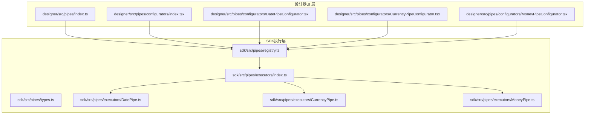
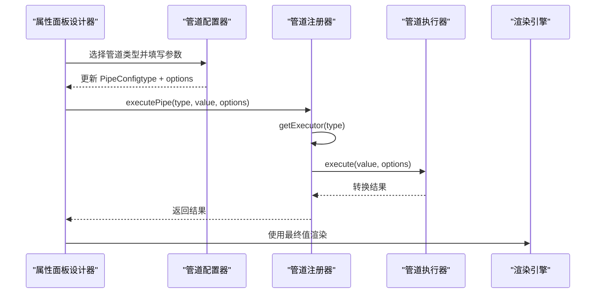
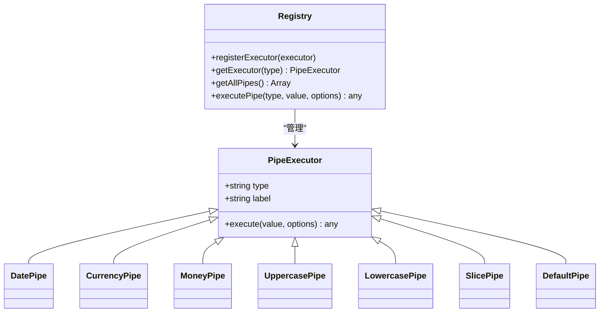
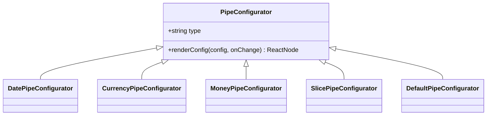
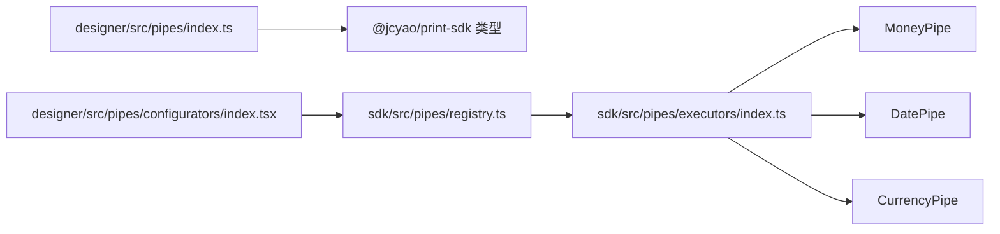

# 数据绑定系统

<cite>
**本文引用的文件**
- [sdk/src/pipes/registry.ts](file://sdk/src/pipes/registry.ts)
- [sdk/src/pipes/types.ts](file://sdk/src/pipes/types.ts)
- [sdk/src/pipes/executors/index.ts](file://sdk/src/pipes/executors/index.ts)
- [sdk/src/pipes/executors/DatePipe.ts](file://sdk/src/pipes/executors/DatePipe.ts)
- [sdk/src/pipes/executors/CurrencyPipe.ts](file://sdk/src/pipes/executors/CurrencyPipe.ts)
- [sdk/src/pipes/executors/MoneyPipe.ts](file://sdk/src/pipes/executors/MoneyPipe.ts)
- [designer/src/pipes/index.ts](file://designer/src/pipes/index.ts)
- [designer/src/pipes/configurators/index.tsx](file://designer/src/pipes/configurators/index.tsx)
- [designer/src/pipes/configurators/DatePipeConfigurator.tsx](file://designer/src/pipes/configurators/DatePipeConfigurator.tsx)
- [designer/src/pipes/configurators/CurrencyPipeConfigurator.tsx](file://designer/src/pipes/configurators/CurrencyPipeConfigurator.tsx)
- [designer/src/pipes/configurators/MoneyPipeConfigurator.tsx](file://designer/src/pipes/configurators/MoneyPipeConfigurator.tsx)
- [sdk/src/types.ts](file://sdk/src/types.ts)
- [designer/src/types/index.ts](file://designer/src/types/index.ts)
</cite>

## 目录
1. [简介](#简介)
2. [项目结构](#项目结构)
3. [核心组件](#核心组件)
4. [架构总览](#架构总览)
5. [详细组件分析](#详细组件分析)
6. [依赖关系分析](#依赖关系分析)
7. [性能考量](#性能考量)
8. [故障排查指南](#故障排查指南)
9. [结论](#结论)
10. [附录](#附录)

## 简介
本文件系统性阐述数据绑定与管道（Pipe）转换链在设计器与打印引擎中的实现与使用。重点覆盖以下主题：
- Schema 驱动的数据模型与点号路径（a.b.c）安全取值
- 数组字段自动生成表格与数组子字段智能标记（禁止拖拽）
- 管道注册器模式、管道执行器开发规范与自定义扩展
- 管道配置器（UI）与执行器（后端）的协作
- 空值与默认值处理策略
- 复杂数据绑定场景实战：日期格式化、货币格式化、金额转换、大小写转换、字符串截取、默认值

## 项目结构
数据绑定系统由“设计器（UI 层）+ SDK（执行层）”两部分组成：
- 设计器负责可视化配置数据绑定与管道参数，并通过导出入口统一暴露给上层使用
- SDK 负责管道执行器的注册、查找与执行，以及打印渲染时的数据转换

图表来源
- [designer/src/pipes/index.ts:1-11](file://designer/src/pipes/index.ts#L1-L11)
- [designer/src/pipes/configurators/index.tsx:1-83](file://designer/src/pipes/configurators/index.tsx#L1-L83)
- [sdk/src/pipes/registry.ts:1-64](file://sdk/src/pipes/registry.ts#L1-L64)
- [sdk/src/pipes/executors/index.ts:1-44](file://sdk/src/pipes/executors/index.ts#L1-L44)
- [sdk/src/pipes/executors/DatePipe.ts:1-35](file://sdk/src/pipes/executors/DatePipe.ts#L1-L35)
- [sdk/src/pipes/executors/CurrencyPipe.ts:1-17](file://sdk/src/pipes/executors/CurrencyPipe.ts#L1-L17)
- [sdk/src/pipes/executors/MoneyPipe.ts:1-62](file://sdk/src/pipes/executors/MoneyPipe.ts#L1-L62)

章节来源
- [designer/src/pipes/index.ts:1-11](file://designer/src/pipes/index.ts#L1-L11)
- [sdk/src/pipes/registry.ts:1-64](file://sdk/src/pipes/registry.ts#L1-L64)

## 核心组件
- 管道执行器接口与类型
  - 定义了管道的唯一标识、显示名称与执行函数签名
- 管道注册器
  - 提供注册、获取、遍历与执行能力；内置多种执行器并自动初始化
- 管道配置器（UI）
  - 面向不同管道类型的参数配置界面，支持格式、精度、符号、分隔符等
- 数据绑定类型
  - 定义了路径、管道链、回退值等绑定结构

章节来源
- [sdk/src/pipes/types.ts:1-30](file://sdk/src/pipes/types.ts#L1-L30)
- [sdk/src/pipes/registry.ts:1-64](file://sdk/src/pipes/registry.ts#L1-L64)
- [designer/src/pipes/configurators/index.tsx:1-83](file://designer/src/pipes/configurators/index.tsx#L1-L83)
- [sdk/src/types.ts:66-75](file://sdk/src/types.ts#L66-L75)

## 架构总览
数据绑定与管道执行的整体流程如下：
- 设计器侧：用户在属性面板中配置数据绑定路径与管道链，配置器根据管道类型渲染对应参数输入
- SDK 侧：注册器维护执行器映射，按类型查找并执行转换链；若找不到执行器则返回原始值并告警
- 渲染阶段：打印引擎根据最终值进行渲染

图表来源
- [sdk/src/pipes/registry.ts:45-52](file://sdk/src/pipes/registry.ts#L45-L52)
- [sdk/src/pipes/types.ts:11-29](file://sdk/src/pipes/types.ts#L11-L29)
- [designer/src/pipes/configurators/index.tsx:68-82](file://designer/src/pipes/configurators/index.tsx#L68-L82)

## 详细组件分析

### 管道注册器与执行器体系
- 注册器职责
  - 维护执行器映射表，提供注册、查询、枚举与执行入口
  - 内置初始化：自动注册日期、货币、金额、大小写、截取、默认值等执行器
- 执行器接口
  - 统一的 type、label 与 execute(value, options) 签名
- 执行链路
  - executePipe(type, value, options) → getExecutor(type) → executor.execute(value, options)

图表来源
- [sdk/src/pipes/types.ts:11-29](file://sdk/src/pipes/types.ts#L11-L29)
- [sdk/src/pipes/registry.ts:17-52](file://sdk/src/pipes/registry.ts#L17-L52)
- [sdk/src/pipes/executors/index.ts:15-43](file://sdk/src/pipes/executors/index.ts#L15-L43)
- [sdk/src/pipes/executors/DatePipe.ts:7-34](file://sdk/src/pipes/executors/DatePipe.ts#L7-L34)
- [sdk/src/pipes/executors/CurrencyPipe.ts:7-16](file://sdk/src/pipes/executors/CurrencyPipe.ts#L7-L16)
- [sdk/src/pipes/executors/MoneyPipe.ts:9-61](file://sdk/src/pipes/executors/MoneyPipe.ts#L9-L61)

章节来源
- [sdk/src/pipes/registry.ts:17-64](file://sdk/src/pipes/registry.ts#L17-L64)
- [sdk/src/pipes/executors/index.ts:15-43](file://sdk/src/pipes/executors/index.ts#L15-L43)

### 管道配置器（UI 层）
- 配置器集合
  - 提供日期、货币、金额、截取、默认值等配置器注册表
  - 通过 Map 以 type 为键管理配置器实例
- 配置器接口
  - renderConfig(config, onChange) 用于渲染参数输入控件
- 典型配置器
  - 日期：格式输入（如 YYYY-MM-DD HH:mm:ss）
  - 货币：货币符号输入
  - 金额：转换模式（分→元、元→分、不转换）、精度、符号、千分位分隔

图表来源
- [designer/src/pipes/configurators/index.tsx:16-75](file://designer/src/pipes/configurators/index.tsx#L16-L75)
- [designer/src/pipes/configurators/DatePipeConfigurator.tsx:9-22](file://designer/src/pipes/configurators/DatePipeConfigurator.tsx#L9-L22)
- [designer/src/pipes/configurators/CurrencyPipeConfigurator.tsx:9-22](file://designer/src/pipes/configurators/CurrencyPipeConfigurator.tsx#L9-L22)
- [designer/src/pipes/configurators/MoneyPipeConfigurator.tsx:9-79](file://designer/src/pipes/configurators/MoneyPipeConfigurator.tsx#L9-L79)

章节来源
- [designer/src/pipes/configurators/index.tsx:68-82](file://designer/src/pipes/configurators/index.tsx#L68-L82)
- [designer/src/pipes/configurators/DatePipeConfigurator.tsx:12-20](file://designer/src/pipes/configurators/DatePipeConfigurator.tsx#L12-L20)
- [designer/src/pipes/configurators/CurrencyPipeConfigurator.tsx:12-20](file://designer/src/pipes/configurators/CurrencyPipeConfigurator.tsx#L12-L20)
- [designer/src/pipes/configurators/MoneyPipeConfigurator.tsx:12-76](file://designer/src/pipes/configurators/MoneyPipeConfigurator.tsx#L12-L76)

### Schema 驱动的数据模型与点号路径安全取值
- Schema 字段类型
  - 支持 string、number、boolean、date、datetime、object、array 等
  - 支持 children 递归定义对象树，支持 enum 与 format（如 date、datetime、money、percent）
- 数据绑定结构
  - path：点号路径（如 a.b.c），用于从根数据安全取值
  - pipes：管道链，按序执行
  - fallback：回退值，当路径取值为空或异常时使用
- 设计器导出入口
  - 设计器通过统一入口导出 SDK 的类型与执行器，同时导出本地配置器，便于在设计器中使用

章节来源
- [sdk/src/types.ts:21-28](file://sdk/src/types.ts#L21-L28)
- [sdk/src/types.ts:11-19](file://sdk/src/types.ts#L11-L19)
- [sdk/src/types.ts:71-75](file://sdk/src/types.ts#L71-L75)
- [designer/src/pipes/index.ts:6-10](file://designer/src/pipes/index.ts#L6-L10)

### 数组字段自动生成表格与智能标记
- 数组字段的表格化
  - 当 Schema 字段类型为 array 时，设计器可将其渲染为表格组件
  - 表格列定义来源于数组元素的 Schema 子字段
- 智能标记（禁止拖拽）
  - 对数组子字段进行特殊标记，避免被误操作拖拽到非容器区域
- 表格属性与汇总
  - 支持列宽、对齐、隐藏、跨页重复表头、合计行等配置
  - 支持 sum、avg、max、min、count 等聚合类型与精度控制

章节来源
- [sdk/src/types.ts:90-98](file://sdk/src/types.ts#L90-L98)
- [sdk/src/types.ts:118-132](file://sdk/src/types.ts#L118-L132)

### 管道注册器模式与执行器开发规范
- 注册器模式
  - 通过 Map 维护执行器映射，提供注册、查询、枚举与执行
  - 执行失败时返回原始值并输出告警，保证健壮性
- 执行器开发规范
  - 必须实现 type、label、execute(value, options)
  - execute 应对空值、非法输入进行兜底处理
  - options 参数应具备合理的默认值与边界约束
- 自定义扩展
  - 新增执行器：实现 PipeExecutor 接口，导出并在注册器初始化处注册
  - 新增配置器：实现 PipeConfigurator 接口，注册到配置器映射表

章节来源
- [sdk/src/pipes/registry.ts:17-52](file://sdk/src/pipes/registry.ts#L17-L52)
- [sdk/src/pipes/types.ts:11-29](file://sdk/src/pipes/types.ts#L11-L29)
- [designer/src/pipes/configurators/index.tsx:68-82](file://designer/src/pipes/configurators/index.tsx#L68-L82)

### 管道配置的详细说明
- 通用配置项
  - type：管道类型标识
  - options：管道参数对象
- 典型管道参数
  - 日期：format（如 YYYY-MM-DD HH:mm:ss）
  - 货币：symbol（货币符号，默认 ¥）
  - 金额：mode（fenToYuan/yuanToFen/none）、precision（小数位数，默认 2）、symbol（货币符号）、separator（千分位分隔）
  - 截取：start、end
  - 默认值：defaultValue

章节来源
- [sdk/src/types.ts:66-69](file://sdk/src/types.ts#L66-L69)
- [designer/src/pipes/configurators/DatePipeConfigurator.tsx:12-19](file://designer/src/pipes/configurators/DatePipeConfigurator.tsx#L12-L19)
- [designer/src/pipes/configurators/CurrencyPipeConfigurator.tsx:12-19](file://designer/src/pipes/configurators/CurrencyPipeConfigurator.tsx#L12-L19)
- [designer/src/pipes/configurators/MoneyPipeConfigurator.tsx:13-76](file://designer/src/pipes/configurators/MoneyPipeConfigurator.tsx#L13-L76)

### 数据绑定的调试技巧
- 路径校验
  - 在渲染前对 path 进行静态检查，确保层级存在
- 管道链验证
  - 逐个执行管道，记录中间值，定位异常环节
- 回退值设置
  - 为关键字段设置 fallback，避免空白渲染
- 日志与告警
  - 注册器在执行器缺失时会输出告警，便于快速定位问题

章节来源
- [sdk/src/pipes/registry.ts:45-52](file://sdk/src/pipes/registry.ts#L45-L52)
- [sdk/src/types.ts:74](file://sdk/src/types.ts#L74)

## 依赖关系分析
- 设计器与 SDK 的耦合
  - 设计器通过统一入口导出 SDK 的类型与执行器，降低直接依赖风险
  - 配置器仅负责 UI 参数收集，执行由 SDK 完成
- 执行器依赖
  - 金额转换依赖 decimal.js 进行高精度计算
  - 日期转换依赖原生 Date 并进行格式化替换

图表来源
- [designer/src/pipes/index.ts:6-10](file://designer/src/pipes/index.ts#L6-L10)
- [designer/src/pipes/configurators/index.tsx:68-82](file://designer/src/pipes/configurators/index.tsx#L68-L82)
- [sdk/src/pipes/registry.ts:54-63](file://sdk/src/pipes/registry.ts#L54-L63)
- [sdk/src/pipes/executors/MoneyPipe.ts:6](file://sdk/src/pipes/executors/MoneyPipe.ts#L6)

章节来源
- [designer/src/pipes/index.ts:6-10](file://designer/src/pipes/index.ts#L6-L10)
- [sdk/src/pipes/registry.ts:54-63](file://sdk/src/pipes/registry.ts#L54-L63)

## 性能考量
- 管道执行器
  - 优先使用轻量执行器（如大小写、截取），避免昂贵运算
  - 金额转换使用高精度库，注意在大数据量场景下的调用频率
- 渲染优化
  - 对高频字段采用缓存策略，减少重复计算
  - 合理设置管道链长度，避免过长链导致的性能损耗

## 故障排查指南
- 管道未生效
  - 检查 type 是否正确，确认执行器已注册
  - 查看控制台告警信息
- 日期格式异常
  - 确认 format 参数合法，如包含 HH:mm:ss 时需确保输入为有效时间
- 金额转换错误
  - 检查 mode 与 precision 设置，确认输入为数值或可转换字符串
  - 关注异常分支的日志输出

章节来源
- [sdk/src/pipes/registry.ts:45-52](file://sdk/src/pipes/registry.ts#L45-L52)
- [sdk/src/pipes/executors/DatePipe.ts:11-33](file://sdk/src/pipes/executors/DatePipe.ts#L11-L33)
- [sdk/src/pipes/executors/MoneyPipe.ts:56-60](file://sdk/src/pipes/executors/MoneyPipe.ts#L56-L60)

## 结论
本数据绑定系统以 Schema 为核心，结合管道注册器模式与配置器 UI，实现了灵活、可扩展且易调试的数据转换链。通过内置的日期、货币、金额、大小写、截取、默认值等管道，满足常见业务需求；同时提供清晰的扩展接口，便于二次开发与定制。

## 附录

### 实战案例：复杂数据绑定场景
- 日期格式化
  - 场景：将时间戳字段按指定格式展示
  - 步骤：在属性面板选择“日期格式化”，设置 format（如 YYYY-MM-DD HH:mm:ss）
  - 注意：输入为空时返回空字符串，非法时间保持原样
- 货币格式化
  - 场景：将数值字段以带符号的货币形式展示
  - 步骤：选择“货币格式化”，设置 symbol（如 ¥）
  - 注意：默认精度 2 位，超出范围会四舍五入
- 金额转换
  - 场景：分与元之间的互转、千分位分隔与符号添加
  - 步骤：选择“金额转换”，设置 mode、precision、symbol、separator
  - 注意：异常输入会回退为原始值并记录错误日志
- 大小写转换
  - 场景：统一文本大小写风格
  - 步骤：选择“转大写”或“转小写”
- 字符串截取
  - 场景：从字符串中提取子串
  - 步骤：设置 start 与 end
- 默认值
  - 场景：当字段为空时显示占位文本
  - 步骤：设置 defaultValue

章节来源
- [sdk/src/pipes/executors/DatePipe.ts:11-33](file://sdk/src/pipes/executors/DatePipe.ts#L11-L33)
- [sdk/src/pipes/executors/CurrencyPipe.ts:11-15](file://sdk/src/pipes/executors/CurrencyPipe.ts#L11-L15)
- [sdk/src/pipes/executors/MoneyPipe.ts:13-60](file://sdk/src/pipes/executors/MoneyPipe.ts#L13-L60)
- [sdk/src/pipes/executors/index.ts:15-43](file://sdk/src/pipes/executors/index.ts#L15-L43)
- [designer/src/pipes/configurators/DatePipeConfigurator.tsx:12-19](file://designer/src/pipes/configurators/DatePipeConfigurator.tsx#L12-L19)
- [designer/src/pipes/configurators/CurrencyPipeConfigurator.tsx:12-19](file://designer/src/pipes/configurators/CurrencyPipeConfigurator.tsx#L12-L19)
- [designer/src/pipes/configurators/MoneyPipeConfigurator.tsx:13-76](file://designer/src/pipes/configurators/MoneyPipeConfigurator.tsx#L13-L76)