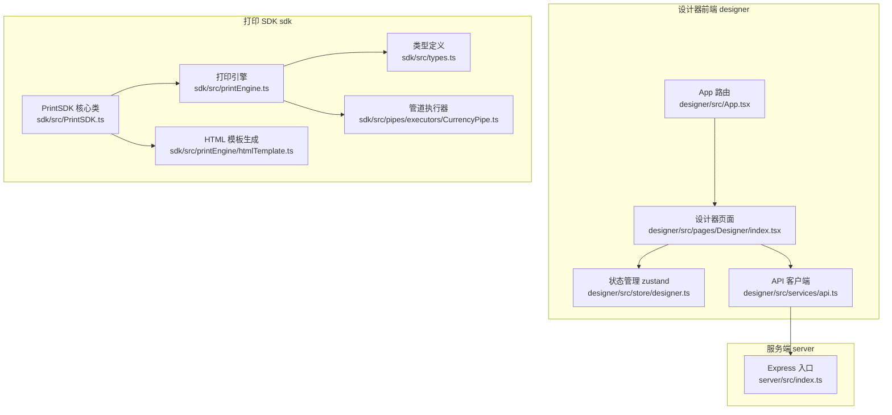
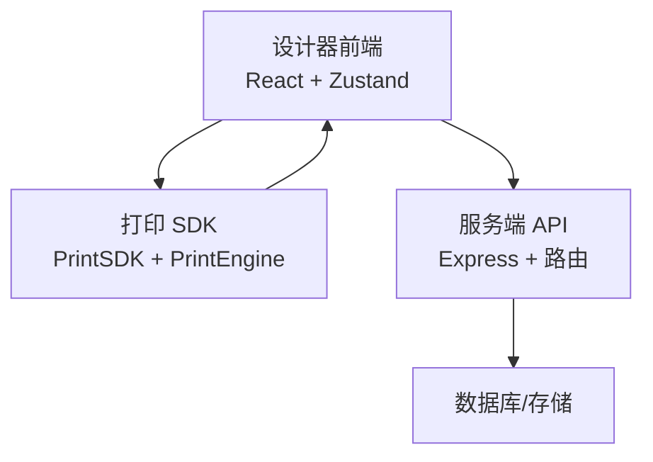
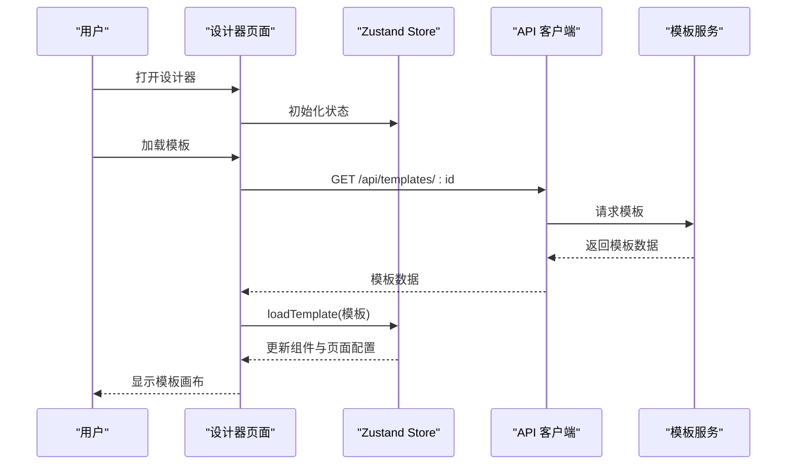
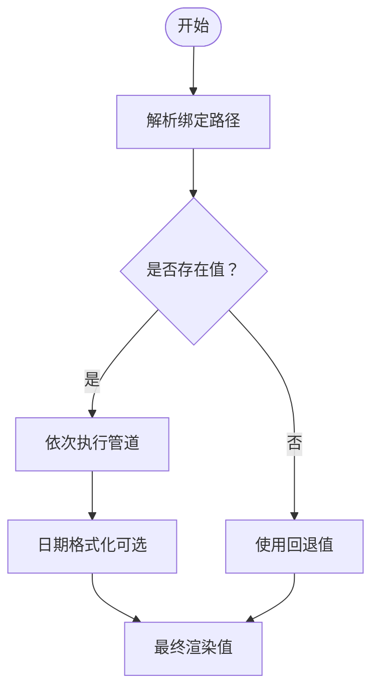
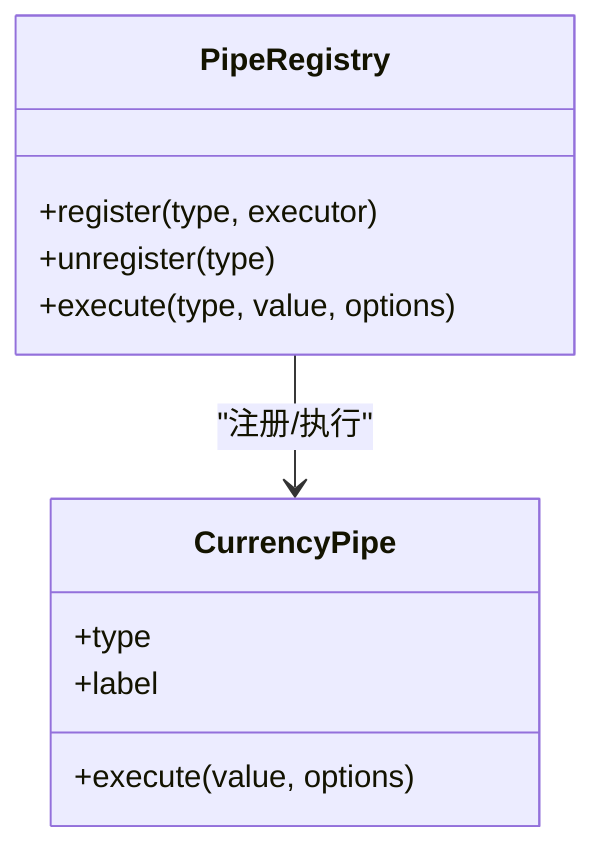
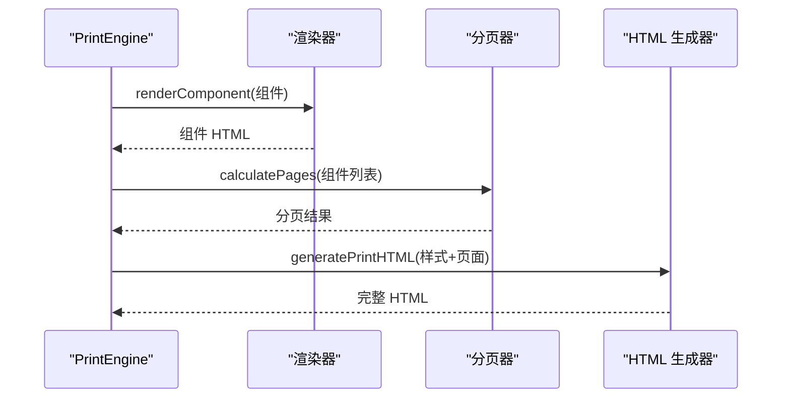
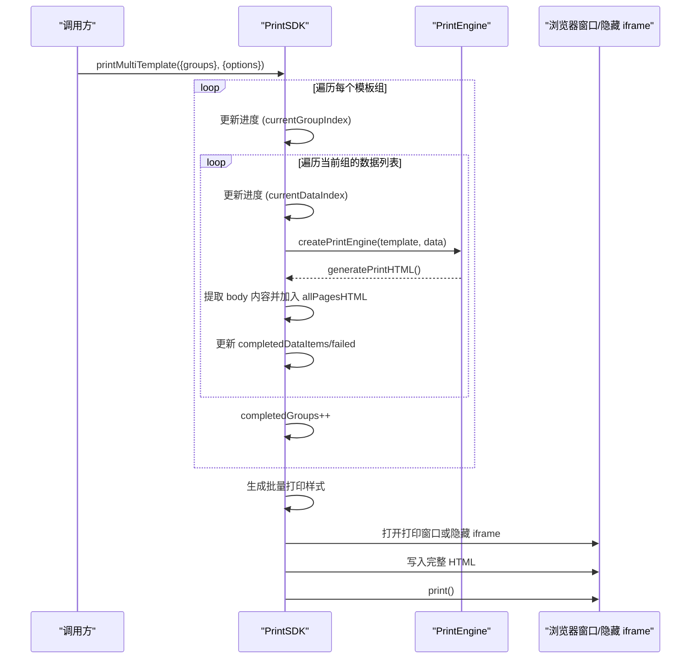
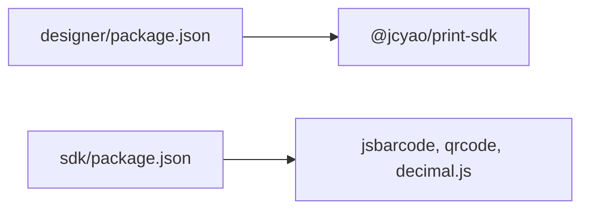

# 核心功能特性

<cite>
**本文引用的文件**   
- [designer/src/App.tsx](file://designer/src/App.tsx)
- [designer/src/pages/Designer/index.tsx](file://designer/src/pages/Designer/index.tsx)
- [designer/src/store/designer.ts](file://designer/src/store/designer.ts)
- [designer/src/services/api.ts](file://designer/src/services/api.ts)
- [designer/src/constants/index.ts](file://designer/src/constants/index.ts)
- [designer/src/types/index.ts](file://designer/src/types/index.ts)
- [designer/src/pipes/configurators/CurrencyPipeConfigurator.tsx](file://designer/src/pipes/configurators/CurrencyPipeConfigurator.tsx)
- [sdk/src/PrintSDK.ts](file://sdk/src/PrintSDK.ts)
- [sdk/src/printEngine.ts](file://sdk/src/printEngine.ts)
- [sdk/src/types.ts](file://sdk/src/types.ts)
- [sdk/src/pipes/executors/CurrencyPipe.ts](file://sdk/src/pipes/executors/CurrencyPipe.ts)
- [sdk/src/printEngine/htmlTemplate.ts](file://sdk/src/printEngine/htmlTemplate.ts)
- [server/src/index.ts](file://server/src/index.ts)
- [designer/package.json](file://designer/package.json)
- [sdk/package.json](file://sdk/package.json)
- [sdk/example.html](file://sdk/example.html)
</cite>

## 更新摘要
**变更内容**   
- 新增多模板批量打印功能的详细介绍
- 补充 printMultiTemplate 方法的特性和使用场景
- 更新独立 SDK 部分的功能对比表
- 添加多模板批量打印的最佳实践建议

## 目录
1. [简介](#简介)
2. [项目结构](#项目结构)
3. [核心组件](#核心组件)
4. [架构总览](#架构总览)
5. [详细组件分析](#详细组件分析)
6. [依赖关系分析](#依赖关系分析)
7. [性能考量](#性能考量)
8. [故障排查指南](#故障排查指南)
9. [结论](#结论)
10. [附录](#附录)

## 简介
本文件面向打印服务平台的六大核心功能特性，提供系统化、可操作的技术说明与使用指南。六大模块包括：
- 可视化模板设计器：提供拖拽式画布、属性面板、组件树与调试面板，支持网格吸附、对齐分布、撤销重做等。
- 丰富的组件库：内置文本、图像、矩形、表格、线条、二维码、条形码等组件，支持绝对定位与流式布局。
- 强大的数据绑定系统：支持路径式数据绑定、管道（Pipe）链式转换、回退值与日期格式化等。
- 插件化管道系统：通过注册表机制扩展数据转换能力，支持货币格式化等内置管道。
- 高级打印引擎：支持虚拟分页、连续纸模式、表格跨页拆分、页码渲染与样式构建。
- 独立 SDK：提供打印、预览、批量打印、多模板批量打印、HTML 生成与进度回调，解耦模板服务，直接消费模板数据。

## 项目结构
该仓库采用多包结构，包含设计器前端、打印 SDK、服务端 API 与文档：
- designer：React/Vite 前端，提供可视化模板设计器与管理页面。
- sdk：纯客户端打印 SDK，包含打印引擎与管道系统。
- server：Express 服务端，提供模板、Schema、Mock 数据的 REST API。
- docs：需求与待办文档。

**图表来源**
- [designer/src/App.tsx:1-31](file://designer/src/App.tsx#L1-L31)
- [designer/src/pages/Designer/index.tsx:1-279](file://designer/src/pages/Designer/index.tsx#L1-L279)
- [designer/src/store/designer.ts:1-539](file://designer/src/store/designer.ts#L1-L539)
- [designer/src/services/api.ts:1-97](file://designer/src/services/api.ts#L1-L97)
- [sdk/src/PrintSDK.ts:1-477](file://sdk/src/PrintSDK.ts#L1-L477)
- [sdk/src/printEngine.ts:1-757](file://sdk/src/printEngine.ts#L1-L757)
- [sdk/src/types.ts:1-171](file://sdk/src/types.ts#L1-L171)
- [sdk/src/pipes/executors/CurrencyPipe.ts:1-17](file://sdk/src/pipes/executors/CurrencyPipe.ts#L1-L17)
- [sdk/src/printEngine/htmlTemplate.ts:1-280](file://sdk/src/printEngine/htmlTemplate.ts#L1-L280)
- [server/src/index.ts:1-25](file://server/src/index.ts#L1-L25)

**章节来源**
- [designer/src/App.tsx:1-31](file://designer/src/App.tsx#L1-L31)
- [designer/src/pages/Designer/index.tsx:1-279](file://designer/src/pages/Designer/index.tsx#L1-L279)
- [sdk/src/PrintSDK.ts:1-477](file://sdk/src/PrintSDK.ts#L1-L477)
- [sdk/src/printEngine.ts:1-757](file://sdk/src/printEngine.ts#L1-L757)
- [server/src/index.ts:1-25](file://server/src/index.ts#L1-L25)

## 核心组件
本节概述六大核心功能模块的职责、实现要点与价值。

- 可视化模板设计器
  - 职责：提供模板编辑、组件拖拽、属性配置、数据绑定、组件树与调试面板；支持网格吸附、对齐分布、层级管理与撤销重做。
  - 关键实现：路由与页面组织、Zustand 状态管理、API 客户端、组件渲染器注册与调用。
  - 价值：降低模板制作门槛，提升设计效率与一致性。

- 丰富的组件库
  - 职责：提供文本、图像、矩形、容器、表格、线条、二维码、条形码等组件，支持绝对定位与流式布局。
  - 关键实现：组件节点类型定义、布局参数、样式与绑定字段。
  - 价值：覆盖常见打印场景，满足多样化排版需求。

- 强大的数据绑定系统
  - 职责：支持路径式数据绑定、管道链式转换、回退值与日期格式化；智能匹配 root 前缀。
  - 关键实现：绑定解析、管道执行、格式化函数。
  - 价值：实现模板与数据的强关联，支持复杂数据变换。

- 插件化管道系统
  - 职责：通过注册表机制扩展数据转换能力，内置货币格式化等管道。
  - 关键实现：管道执行器注册、配置器 UI、执行流程。
  - 价值：可扩展、可配置，满足业务定制化格式化需求。

- 高级打印引擎
  - 职责：插件化渲染器、虚拟分页、连续纸模式、表格跨页拆分、页码渲染与样式构建。
  - 关键实现：渲染器注册、分页算法、表格片段化、页码组件渲染。
  - 价值：稳定可靠、性能可控，适配多种纸张与布局。

- 独立 SDK
  - 职责：提供打印、预览、批量打印、多模板批量打印、HTML 生成与进度回调，解耦模板服务。
  - 关键实现：PrintSDK 类、打印引擎工厂、批量打印组装与样式注入、多模板组管理。
  - 价值：简化集成成本，支持浏览器端直接打印。

**章节来源**
- [designer/src/pages/Designer/index.tsx:1-279](file://designer/src/pages/Designer/index.tsx#L1-L279)
- [designer/src/store/designer.ts:1-539](file://designer/src/store/designer.ts#L1-L539)
- [designer/src/types/index.ts:123-160](file://designer/src/types/index.ts#L123-L160)
- [sdk/src/printEngine.ts:31-756](file://sdk/src/printEngine.ts#L31-L756)
- [sdk/src/PrintSDK.ts:43-467](file://sdk/src/PrintSDK.ts#L43-L467)
- [sdk/src/pipes/executors/CurrencyPipe.ts:1-17](file://sdk/src/pipes/executors/CurrencyPipe.ts#L1-L17)

## 架构总览
整体架构分为三层：前端设计器、打印 SDK、服务端 API。设计器负责模板与数据资产的管理，SDK 负责渲染与打印，服务端提供数据持久化与接口。

**图表来源**
- [designer/src/App.tsx:1-31](file://designer/src/App.tsx#L1-L31)
- [designer/src/services/api.ts:1-97](file://designer/src/services/api.ts#L1-L97)
- [sdk/src/PrintSDK.ts:1-477](file://sdk/src/PrintSDK.ts#L1-L477)
- [server/src/index.ts:1-25](file://server/src/index.ts#L1-L25)

## 详细组件分析

### 可视化模板设计器
- 功能要点
  - 三栏布局：左侧资产面板（组件库）、中间画布、右侧属性与组件树面板。
  - 交互能力：组件选择、复制粘贴、对齐分布、层级管理、网格吸附、撤销重做。
  - 调试能力：模板 JSON 调试抽屉，支持复制导出。
  - 数据来源：通过 API 客户端访问服务端模板、Schema、Mock 数据。
- 关键实现
  - 路由与页面组织：App 路由配置与 MainLayout 布局。
  - 状态管理：Zustand Store 管理组件集合、选中状态、页面配置、历史记录。
  - 组件渲染：Canvas 组件负责渲染与交互，PropertyPanel 与 ComponentTreePanel 提供属性与树形展示。
  - API 集成：schemaApi/templateApi/mockDataApi 封装 REST 请求。
- 协同机制
  - Store 与 Canvas/PropertyPanel/ComponentTree 的双向数据流。
  - API 与 Store 的异步加载与更新。
- 使用示例
  - 在资产面板拖拽组件到画布，选中组件在属性面板配置绑定与样式。
  - 使用调试抽屉查看模板 JSON，便于导出与复用。
- 最佳实践
  - 使用网格吸附与对齐分布保证布局一致性。
  - 合理设置页边距与页面尺寸，避免组件溢出。
  - 利用撤销重做功能进行迭代优化。

**图表来源**
- [designer/src/pages/Designer/index.tsx:26-46](file://designer/src/pages/Designer/index.tsx#L26-L46)
- [designer/src/store/designer.ts:150-159](file://designer/src/store/designer.ts#L150-L159)
- [designer/src/services/api.ts:47-50](file://designer/src/services/api.ts#L47-L50)

**章节来源**
- [designer/src/App.tsx:1-31](file://designer/src/App.tsx#L1-L31)
- [designer/src/pages/Designer/index.tsx:1-279](file://designer/src/pages/Designer/index.tsx#L1-L279)
- [designer/src/store/designer.ts:1-539](file://designer/src/store/designer.ts#L1-L539)
- [designer/src/services/api.ts:1-97](file://designer/src/services/api.ts#L1-L97)

### 丰富的组件库
- 组件类型
  - 文本、图像、矩形、容器、表格、线条、二维码、条形码。
- 数据结构
  - 组件节点包含 id、type、layout（绝对定位坐标与尺寸）、style、binding（数据绑定）、props（组件特定属性）、children（容器子节点）。
- 布局模式
  - 支持绝对定位与流式布局，流式布局基于相对间距进行虚拟分页。
- 使用示例
  - 在设计器中拖拽组件到画布，配置绑定路径与管道，设置样式与尺寸。
- 最佳实践
  - 表格组件建议开启跨页重复表头，确保阅读连贯性。
  - 图片组件注意资源加载时机，SDK 内部已处理图片加载完成再打印。

**章节来源**
- [designer/src/types/index.ts:123-160](file://designer/src/types/index.ts#L123-L160)
- [sdk/src/types.ts:134-160](file://sdk/src/types.ts#L134-L160)

### 强大的数据绑定系统
- 绑定语法
  - 支持点式路径（如 order.receiver.name），自动去除 root 前缀以适配不同数据结构。
- 管道链
  - 支持多个管道串联执行，如日期格式化、货币符号与精度控制。
- 回退值
  - 当路径不存在或为空时，使用 fallback 字符串。
- 日期格式化
  - 内置简单日期格式化函数，支持 YYYY、MM、DD、HH、mm、ss 占位符。
- 使用示例
  - 在属性面板配置数据绑定，添加货币格式化管道，设置货币符号与精度。
- 最佳实践
  - 管道顺序决定最终输出，建议先做数值转换再做格式化。
  - 使用回退值避免空数据导致的异常显示。

**图表来源**
- [sdk/src/printEngine.ts:79-165](file://sdk/src/printEngine.ts#L79-L165)

**章节来源**
- [sdk/src/printEngine.ts:79-165](file://sdk/src/printEngine.ts#L79-L165)

### 插件化管道系统
- 管道注册
  - 通过注册表统一管理管道执行器，支持动态注册与注销。
- 执行流程
  - 根据管道类型查找执行器，传入值与选项执行。
- 配置器 UI
  - 设计器侧提供配置器组件，用于在属性面板中配置管道参数（如货币符号）。
- 内置管道
  - 货币格式化：支持符号与精度配置。
- 使用示例
  - 在属性面板选择"货币格式化"管道，设置符号与精度。
- 最佳实践
  - 管道应尽量无副作用，确保可复用与可测试。
  - 为常用管道提供默认配置，减少用户配置成本。

**图表来源**
- [sdk/src/printEngine.ts:14](file://sdk/src/printEngine.ts#L14)
- [sdk/src/pipes/executors/CurrencyPipe.ts:1-17](file://sdk/src/pipes/executors/CurrencyPipe.ts#L1-L17)

**章节来源**
- [sdk/src/printEngine.ts:14-126](file://sdk/src/printEngine.ts#L14-L126)
- [sdk/src/pipes/executors/CurrencyPipe.ts:1-17](file://sdk/src/pipes/executors/CurrencyPipe.ts#L1-L17)
- [designer/src/pipes/configurators/CurrencyPipeConfigurator.tsx:1-23](file://designer/src/pipes/configurators/CurrencyPipeConfigurator.tsx#L1-L23)

### 高级打印引擎
- 渲染器插件化
  - 默认注册文本、表格、图像、矩形、线条、二维码、条形码渲染器。
- 虚拟分页
  - 基于组件相对间距进行流式布局，支持表格跨页拆分与重复表头。
- 连续纸模式
  - 不分页，单页渲染，支持最小高度配置。
- 页码渲染
  - 支持 top/bottom 与 left/center/right 位置，支持 simple/text/slash 三种格式。
- HTML 生成
  - 统一生成打印 HTML，注入页面样式与分页结构。
- 使用示例
  - 通过 PrintEngine 工厂创建引擎，传入模板与数据，生成打印 HTML。
- 最佳实践
  - 表格数据量大时，合理设置 repeatHeader 与合计行，提升可读性。
  - 连续纸场景下，设置合理的最小高度，避免内容被截断。

**图表来源**
- [sdk/src/printEngine.ts:31-756](file://sdk/src/printEngine.ts#L31-L756)

**章节来源**
- [sdk/src/printEngine.ts:31-756](file://sdk/src/printEngine.ts#L31-L756)

### 独立 SDK
- 打印能力
  - print：支持预览与直接打印，自动等待图片加载完成。
  - printDirect：快捷打印（非预览）。
  - printWithPreview：预览后打印。
  - generateHTML：仅生成 HTML，不触发打印。
  - printMultiple：批量打印（同模板多数据），支持进度回调。
  - printMultiTemplate：多模板批量打印，支持多个模板各自绑定数据列表，一次打印确认。
- 进度回调
  - printMultiple：提供 total/completed/failed/currentIndex 等进度信息。
  - printMultiTemplate：提供 totalGroups/completedGroups/totalDataItems/completedDataItems/failed/currentGroupIndex/currentDataIndex 等详细进度信息。
- 多模板批量打印特性
  - 支持多个模板各自绑定不同的数据列表。
  - 统一生成包含所有模板数据的完整打印文档。
  - 仅需用户确认一次打印，提升用户体验。
  - 所有模板需使用相同的纸张尺寸，混合尺寸暂不支持。
  - 提供详细的进度跟踪，包括当前处理的模板组和数据项。
- 使用示例
  - 通过 createPrintSDK 创建实例，传入模板与数据，调用 print、printMultiple 或 printMultiTemplate。
  - 多模板打印示例：`const groups = [{ template, dataList }, { template2, dataList2 }]; await sdk.printMultiTemplate(groups, { preview: true, onProgress });`
- 最佳实践
  - 批量打印时监听进度回调，向用户反馈处理状态。
  - 预览模式适合最终校验，生产打印建议使用 printDirect。
  - 多模板打印时确保所有模板使用相同的纸张尺寸配置。
  - 合理设置进度回调频率，避免频繁的 UI 更新影响性能。

**图表来源**
- [sdk/src/PrintSDK.ts:332-467](file://sdk/src/PrintSDK.ts#L332-L467)

**章节来源**
- [sdk/src/PrintSDK.ts:43-467](file://sdk/src/PrintSDK.ts#L43-L467)
- [sdk/src/printEngine/htmlTemplate.ts:177-224](file://sdk/src/printEngine/htmlTemplate.ts#L177-L224)
- [sdk/example.html:122-126](file://sdk/example.html#L122-L126)

## 依赖关系分析
- 设计器前端依赖
  - React 生态、Ant Design UI、Zustand 状态管理、Axios HTTP 客户端。
  - 依赖 @jcyao/print-sdk 以复用打印能力。
- SDK 依赖
  - jsbarcode、qrcode、decimal.js 等第三方库。
- 服务端依赖
  - Express、CORS、BodyParser、路由与错误处理中间件。

**图表来源**
- [designer/package.json:12-28](file://designer/package.json#L12-L28)
- [sdk/package.json:49-53](file://sdk/package.json#L49-L53)

**章节来源**
- [designer/package.json:12-28](file://designer/package.json#L12-L28)
- [sdk/package.json:49-53](file://sdk/package.json#L49-L53)

## 性能考量
- 渲染性能
  - 虚拟分页与表格跨页拆分避免一次性渲染大量内容，提升首屏与交互响应速度。
  - 图片资源加载完成后才触发打印，避免白屏或裁剪。
- 批量打印
  - 将多页 HTML 片段合并为单一文档，减少用户确认次数，提高吞吐。
  - 多模板批量打印时，使用 DOMParser 提取 body 内容，比正则表达式更健壮。
- 建议
  - 控制组件数量与层级深度，避免过度嵌套。
  - 合理设置表格行高与合计行，避免跨页碎片过多。
  - 使用预览模式进行最终校验，减少直接打印失败率。
  - 多模板打印时，确保模板组数量适中，避免内存占用过高。

## 故障排查指南
- 打开打印窗口失败
  - 现象：预览模式无法弹出新窗口。
  - 排查：检查浏览器弹窗策略与权限设置。
  - 参考：PrintSDK 预览逻辑与错误抛出。
- 图片未加载完成即打印
  - 现象：打印内容缺失图片。
  - 排查：确认资源加载完成后再调用 print。
  - 参考：waitForImagesLoaded 的使用。
- 表格跨页异常
  - 现象：跨页后表头缺失或合计行错位。
  - 排查：检查 repeatHeader 与 summaryMode 配置。
  - 参考：表格跨页拆分算法与片段化逻辑。
- 绑定路径无效
  - 现象：绑定值为空或显示回退值。
  - 排查：确认数据结构与路径一致，必要时去除 root 前缀。
  - 参考：绑定解析与回退值处理。
- 多模板批量打印失败
  - 现象：printMultiTemplate 执行中断或进度不更新。
  - 排查：检查 groups 参数是否为空，确认所有模板使用相同纸张尺寸。
  - 参考：printMultiTemplate 方法的错误处理与进度回调逻辑。

**章节来源**
- [sdk/src/PrintSDK.ts:59-62](file://sdk/src/PrintSDK.ts#L59-L62)
- [sdk/src/PrintSDK.ts:89-95](file://sdk/src/PrintSDK.ts#L89-L95)
- [sdk/src/printEngine.ts:547-663](file://sdk/src/printEngine.ts#L547-L663)
- [sdk/src/printEngine.ts:79-105](file://sdk/src/printEngine.ts#L79-L105)
- [sdk/src/PrintSDK.ts:338-341](file://sdk/src/PrintSDK.ts#L338-L341)

## 结论
该打印服务平台通过"可视化模板设计器 + 组件库 + 数据绑定 + 管道系统 + 打印引擎 + 独立 SDK"的完整体系，实现了从设计到打印的一体化解决方案。其插件化与解耦设计降低了集成成本，虚拟分页与表格跨页拆分提升了复杂报表的可读性与稳定性。新增的多模板批量打印功能进一步增强了系统的实用性，支持复杂的多模板打印场景，配合服务端 API，可快速搭建企业级打印平台。

## 附录

### 功能对比表
- 模块对比
  - 可视化模板设计器：提供拖拽式编辑与调试能力，适合非技术用户快速上手。
  - 组件库：覆盖常见打印元素，支持绝对与流式布局。
  - 数据绑定系统：路径绑定、管道链、回退值与日期格式化。
  - 管道系统：注册表机制，易于扩展与配置。
  - 打印引擎：虚拟分页、连续纸、表格跨页、页码渲染。
  - 独立 SDK：打印、预览、批量打印、多模板批量打印、HTML 生成与进度回调。

- 打印能力对比
  - print：基础打印功能，支持预览与直接打印。
  - printMultiple：同模板多数据批量打印，仅需一次确认。
  - printMultiTemplate：多模板批量打印，支持不同模板各自绑定数据列表。
  - generateHTML：仅生成 HTML，不触发打印。
  - printDirect/printWithPreview：快捷打印与预览打印。

**章节来源**
- [sdk/src/PrintSDK.ts:100-467](file://sdk/src/PrintSDK.ts#L100-L467)
- [sdk/src/printEngine/htmlTemplate.ts:177-224](file://sdk/src/printEngine/htmlTemplate.ts#L177-L224)