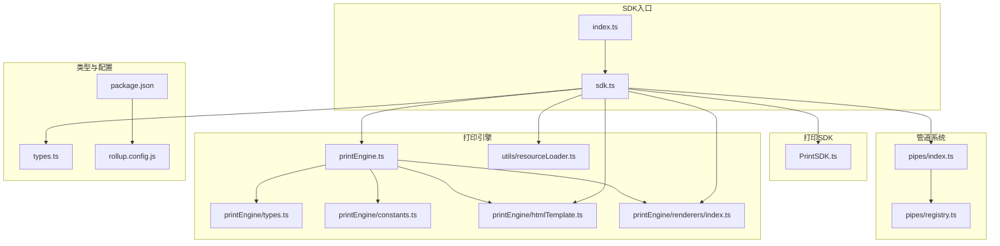
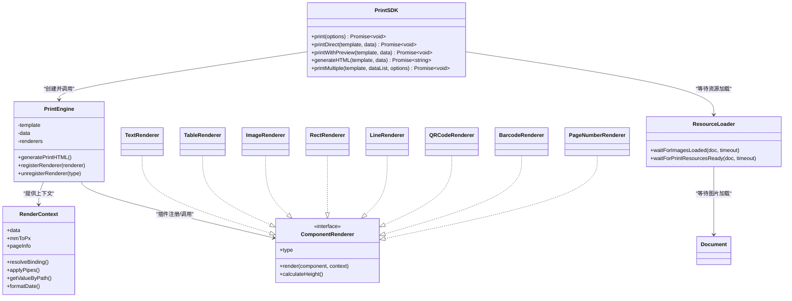
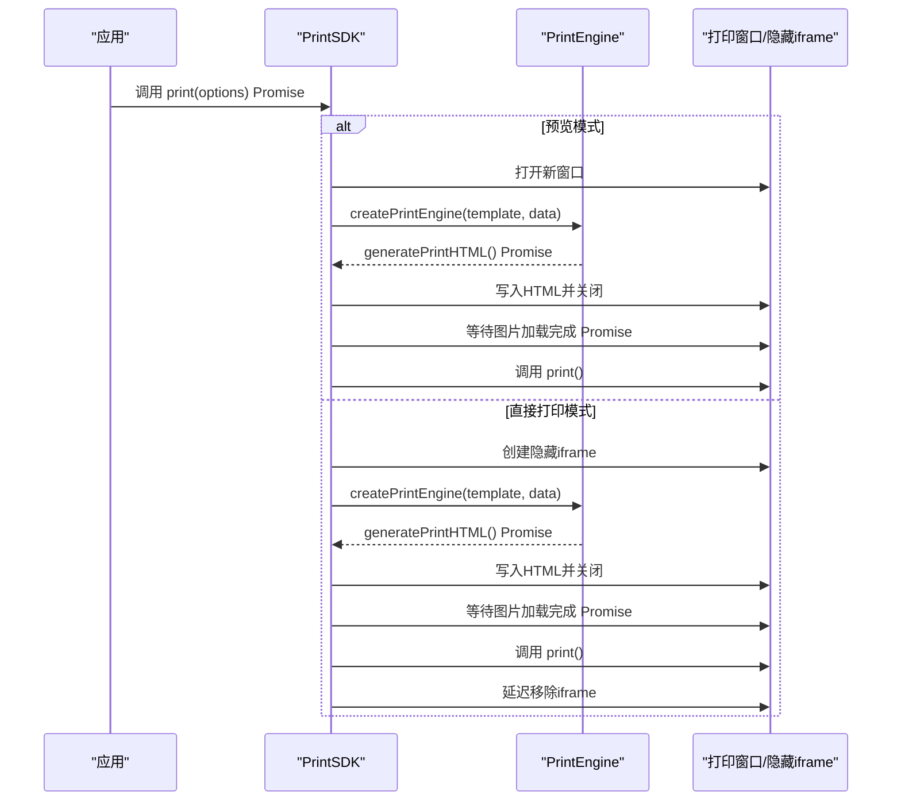
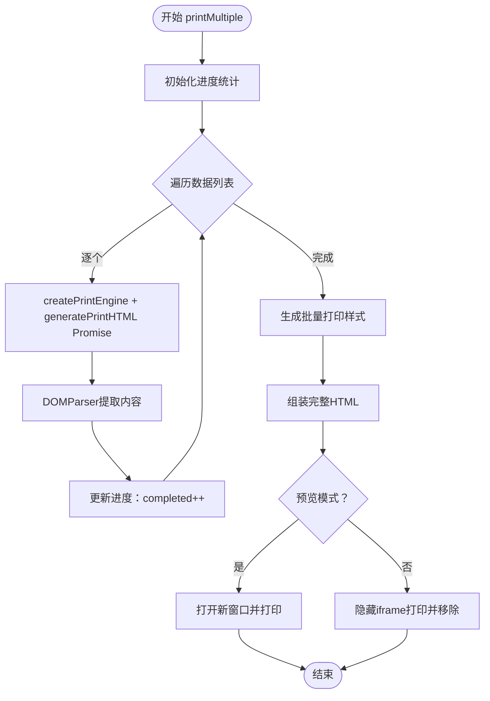
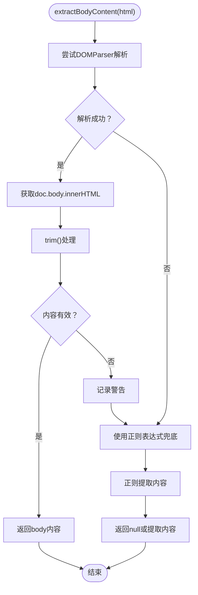
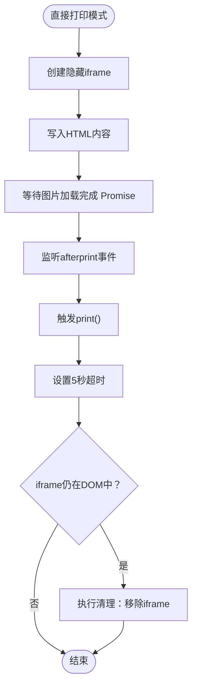
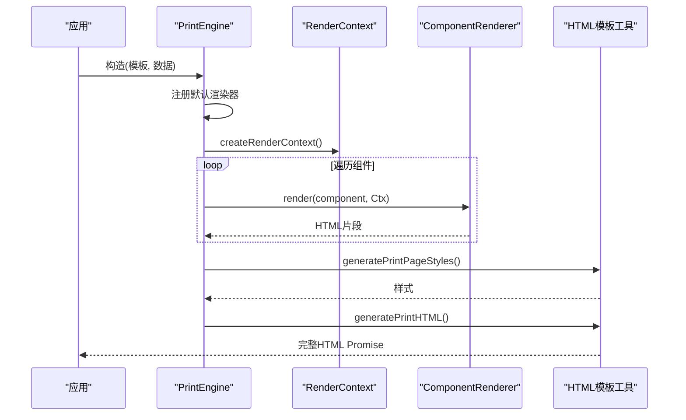
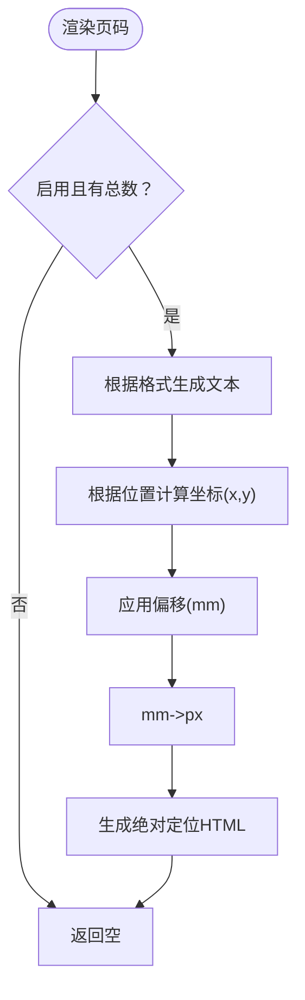
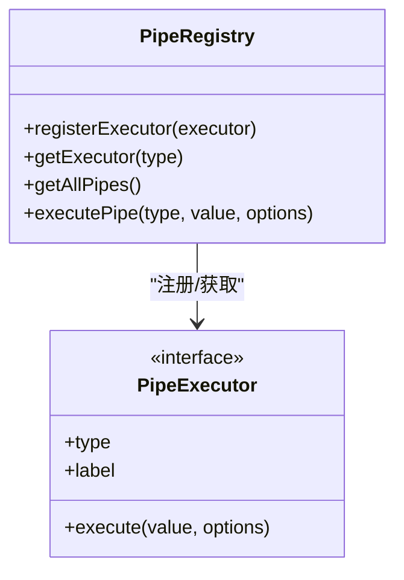
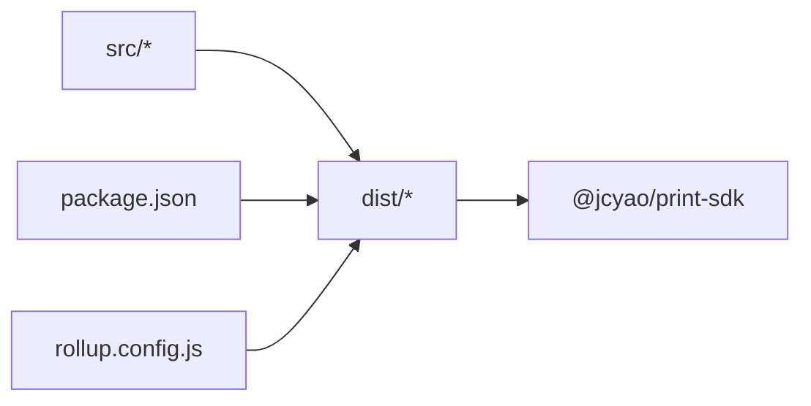

# 独立SDK

<cite>
**本文引用的文件**
- [sdk/src/index.ts](file://sdk/src/index.ts)
- [sdk/src/sdk.ts](file://sdk/src/sdk.ts)
- [sdk/src/PrintSDK.ts](file://sdk/src/PrintSDK.ts)
- [sdk/src/printEngine.ts](file://sdk/src/printEngine.ts)
- [sdk/src/printEngine/types.ts](file://sdk/src/printEngine/types.ts)
- [sdk/src/printEngine/constants.ts](file://sdk/src/printEngine/constants.ts)
- [sdk/src/printEngine/htmlTemplate.ts](file://sdk/src/printEngine/htmlTemplate.ts)
- [sdk/src/printEngine/renderers/index.ts](file://sdk/src/printEngine/renderers/index.ts)
- [sdk/src/pipes/index.ts](file://sdk/src/pipes/index.ts)
- [sdk/src/pipes/registry.ts](file://sdk/src/pipes/registry.ts)
- [sdk/src/types.ts](file://sdk/src/types.ts)
- [sdk/src/utils/resourceLoader.ts](file://sdk/src/utils/resourceLoader.ts)
- [sdk/package.json](file://sdk/package.json)
- [sdk/rollup.config.js](file://sdk/rollup.config.js)
- [sdk/example.html](file://sdk/example.html)
- [sdk/README.md](file://sdk/README.md)
- [docs/需求文档.md](file://docs/需求文档.md)
</cite>

## 更新摘要
**变更内容**
- HTML解析使用DOMParser替代正则表达式，提升解析健壮性
- iframe打印系统增强afterprint事件处理和5秒回退超时机制
- 所有方法现在返回Promise，支持异步操作
- 批量打印预览功能得到进一步完善

## 目录
1. [简介](#简介)
2. [项目结构](#项目结构)
3. [核心组件](#核心组件)
4. [架构总览](#架构总览)
5. [详细组件分析](#详细组件分析)
6. [依赖关系分析](#依赖关系分析)
7. [性能考量](#性能考量)
8. [故障排查指南](#故障排查指南)
9. [结论](#结论)
10. [附录](#附录)

## 简介
本独立SDK提供纯TypeScript实现的客户端打印能力，具备以下关键特性：
- 无UI依赖设计：完全解耦，不依赖任何前端框架或设计器UI
- 浏览器打印支持：直接在浏览器中生成打印HTML并通过window.print()或隐藏iframe触发打印
- 批量打印预览：支持同模板多数据的批量打印，一次性生成完整文档并预览/打印
- 插件化架构：渲染器与管道系统可扩展，便于新增组件类型与数据转换规则
- 页码功能：v1.0.1版本新增页面级页码渲染，支持多种位置与格式
- **异步操作支持**：所有打印方法现在返回Promise，支持async/await语法
- **健壮的HTML解析**：使用DOMParser替代正则表达式，提升解析可靠性

SDK采用模块化设计，通过Rollup打包为CommonJS与ES模块两种格式，依赖外部库（二维码、条形码、高精度计算），并在发布包中声明为external，避免重复打包。

## 项目结构
SDK位于sdk目录，核心源码位于src，包含以下关键子模块：
- 入口与导出：统一导出SDK主类、打印引擎、类型与工具
- 打印引擎：负责模板解析、数据绑定、管道转换、虚拟分页与HTML生成
- 渲染器：各组件渲染器插件（文本、表格、图片、矩形、线条、二维码、条形码、页码）
- 管道系统：数据转换插件（日期、货币、金额、大小写、切片、默认值）
- HTML模板工具：生成页面样式与完整HTML文档
- 资源加载工具：等待图片、二维码、条形码等异步资源加载完成
- 类型定义：模板、组件节点、表格、页码、Schema等完整类型
- 构建配置：Rollup打包配置，输出CJS与ESM两份产物

**图表来源**
- [sdk/src/index.ts:1-18](file://sdk/src/index.ts#L1-L18)
- [sdk/src/sdk.ts:1-63](file://sdk/src/sdk.ts#L1-L63)
- [sdk/src/PrintSDK.ts:1-299](file://sdk/src/PrintSDK.ts#L1-L299)
- [sdk/src/printEngine.ts:1-939](file://sdk/src/printEngine.ts#L1-L939)
- [sdk/src/printEngine/types.ts:1-116](file://sdk/src/printEngine/types.ts#L1-L116)
- [sdk/src/printEngine/constants.ts:1-113](file://sdk/src/printEngine/constants.ts#L1-L113)
- [sdk/src/printEngine/htmlTemplate.ts:1-274](file://sdk/src/printEngine/htmlTemplate.ts#L1-L274)
- [sdk/src/printEngine/renderers/index.ts:1-13](file://sdk/src/printEngine/renderers/index.ts#L1-L13)
- [sdk/src/utils/resourceLoader.ts:1-90](file://sdk/src/utils/resourceLoader.ts#L1-L90)
- [sdk/src/pipes/index.ts:1-9](file://sdk/src/pipes/index.ts#L1-L9)
- [sdk/src/pipes/registry.ts:1-64](file://sdk/src/pipes/registry.ts#L1-L64)
- [sdk/src/types.ts:1-171](file://sdk/src/types.ts#L1-L171)
- [sdk/package.json:1-61](file://sdk/package.json#L1-L61)
- [sdk/rollup.config.js:1-25](file://sdk/rollup.config.js#L1-L25)

**章节来源**
- [sdk/src/index.ts:1-18](file://sdk/src/index.ts#L1-L18)
- [sdk/src/sdk.ts:1-63](file://sdk/src/sdk.ts#L1-L63)
- [sdk/package.json:1-61](file://sdk/package.json#L1-L61)
- [sdk/rollup.config.js:1-25](file://sdk/rollup.config.js#L1-L25)

## 核心组件
- PrintSDK：对外API封装，提供print、printDirect、printWithPreview、generateHTML、printMultiple等方法；支持预览与直接打印，以及批量打印预览；**所有方法现在返回Promise**
- PrintEngine：核心渲染引擎，负责数据绑定、管道转换、虚拟分页、组件渲染与HTML生成；支持插件化渲染器注册与注销
- 渲染器插件：TextRenderer、TableRenderer、ImageRenderer、RectRenderer、LineRenderer、QRCodeRenderer、BarcodeRenderer、PageNumberRenderer
- 管道系统：通过注册器集中管理执行器，支持日期、货币、金额、大小写、切片、默认值等转换
- HTML模板工具：生成页面样式与完整HTML文档，区分预览与批量打印样式
- **资源加载工具**：waitForImagesLoaded和waitForPrintResourcesReady函数，用于等待图片、二维码、条形码等异步资源加载完成
- 类型系统：完整的模板、组件、表格、页码、Schema等类型定义

**章节来源**
- [sdk/src/PrintSDK.ts:71-299](file://sdk/src/PrintSDK.ts#L71-L299)
- [sdk/src/printEngine.ts:31-939](file://sdk/src/printEngine.ts#L31-L939)
- [sdk/src/printEngine/renderers/index.ts:1-13](file://sdk/src/printEngine/renderers/index.ts#L1-L13)
- [sdk/src/pipes/registry.ts:1-64](file://sdk/src/pipes/registry.ts#L1-L64)
- [sdk/src/printEngine/htmlTemplate.ts:1-274](file://sdk/src/printEngine/htmlTemplate.ts#L1-L274)
- [sdk/src/utils/resourceLoader.ts:1-90](file://sdk/src/utils/resourceLoader.ts#L1-L90)
- [sdk/src/types.ts:1-171](file://sdk/src/types.ts#L1-L171)

## 架构总览
SDK采用"入口导出—SDK封装—引擎渲染—插件扩展"的分层架构。PrintSDK负责对外API与流程编排，PrintEngine负责核心渲染与分页，渲染器与管道系统作为插件扩展点，HTML模板工具统一生成样式与文档，资源加载工具确保异步资源的完整加载。

**图表来源**
- [sdk/src/PrintSDK.ts:71-299](file://sdk/src/PrintSDK.ts#L71-L299)
- [sdk/src/printEngine.ts:31-939](file://sdk/src/printEngine.ts#L31-L939)
- [sdk/src/printEngine/types.ts:11-82](file://sdk/src/printEngine/types.ts#L11-L82)
- [sdk/src/printEngine/renderers/index.ts:5-12](file://sdk/src/printEngine/renderers/index.ts#L5-L12)
- [sdk/src/utils/resourceLoader.ts:12-90](file://sdk/src/utils/resourceLoader.ts#L12-L90)

**章节来源**
- [sdk/src/PrintSDK.ts:1-299](file://sdk/src/PrintSDK.ts#L1-L299)
- [sdk/src/printEngine.ts:1-939](file://sdk/src/printEngine.ts#L1-L939)
- [sdk/src/printEngine/types.ts:1-116](file://sdk/src/printEngine/types.ts#L1-L116)
- [sdk/src/utils/resourceLoader.ts:1-90](file://sdk/src/utils/resourceLoader.ts#L1-L90)

## 详细组件分析

### PrintSDK 组件分析
PrintSDK提供简洁的API，支持：
- 直接打印与预览打印：通过preview参数控制
- 仅生成HTML：用于自定义处理或二次加工
- 批量打印：将多份数据合并为一份完整文档，支持进度回调与预览
- **异步操作支持**：所有方法现在返回Promise，支持async/await语法

**图表来源**
- [sdk/src/PrintSDK.ts:81-143](file://sdk/src/PrintSDK.ts#L81-L143)
- [sdk/src/printEngine.ts:731-939](file://sdk/src/printEngine.ts#L731-L939)

**章节来源**
- [sdk/src/PrintSDK.ts:71-299](file://sdk/src/PrintSDK.ts#L71-L299)

### 批量打印预览流程
v1.0.1版本新增批量打印预览功能，核心流程：
- 遍历数据列表，逐个生成页面HTML片段
- **使用DOMParser提取<body>内容**（比正则更健壮）
- 提取<body>内容拼接到完整文档
- 生成批量打印样式并输出
- 支持预览与直接打印两种模式

**图表来源**
- [sdk/src/PrintSDK.ts:181-289](file://sdk/src/PrintSDK.ts#L181-L289)

**章节来源**
- [sdk/src/PrintSDK.ts:174-289](file://sdk/src/PrintSDK.ts#L174-L289)

### HTML解析优化
**更新** HTML解析现在使用DOMParser替代正则表达式，提升解析健壮性和准确性

PrintSDK中的extractBodyContent函数现在使用DOMParser进行HTML解析：
- 使用DOMParser.parseFromString()解析HTML字符串
- 从解析后的document.body中提取innerHTML
- 如果解析失败，提供正则表达式的兜底方案
- 返回处理后的body内容或null

**图表来源**
- [sdk/src/PrintSDK.ts:21-42](file://sdk/src/PrintSDK.ts#L21-L42)

**章节来源**
- [sdk/src/PrintSDK.ts:16-42](file://sdk/src/PrintSDK.ts#L16-L42)

### iframe打印系统增强
**更新** iframe打印系统增强了afterprint事件处理和5秒回退超时机制

PrintSDK中的直接打印模式现在包含更可靠的清理机制：
- 优先使用afterprint事件监听打印完成
- 如果afterprint事件未触发（如用户取消打印），设置5秒超时回退
- 确保iframe资源的可靠清理，避免内存泄漏

**图表来源**
- [sdk/src/PrintSDK.ts:120-142](file://sdk/src/PrintSDK.ts#L120-L142)

**章节来源**
- [sdk/src/PrintSDK.ts:120-142](file://sdk/src/PrintSDK.ts#L120-L142)

### 打印引擎与插件化架构
PrintEngine负责：
- 数据绑定与管道转换
- 虚拟分页与跨页表格拆分
- 组件渲染与页码渲染
- 生成打印HTML

**图表来源**
- [sdk/src/printEngine.ts:31-939](file://sdk/src/printEngine.ts#L31-L939)
- [sdk/src/printEngine/types.ts:11-82](file://sdk/src/printEngine/types.ts#L11-L82)
- [sdk/src/printEngine/htmlTemplate.ts:81-245](file://sdk/src/printEngine/htmlTemplate.ts#L81-L245)

**章节来源**
- [sdk/src/printEngine.ts:31-939](file://sdk/src/printEngine.ts#L31-L939)
- [sdk/src/printEngine/types.ts:1-116](file://sdk/src/printEngine/types.ts#L1-L116)
- [sdk/src/printEngine/htmlTemplate.ts:1-274](file://sdk/src/printEngine/htmlTemplate.ts#L1-L274)

### 页码功能（v1.0.1）
页码为页面级配置，非组件形式，支持：
- 6种位置：上/下 + 左/中/右
- 3种格式：simple、slash、text
- 自定义样式、偏移、前后缀

**图表来源**
- [sdk/src/printEngine.ts:278-366](file://sdk/src/printEngine.ts#L278-L366)

**章节来源**
- [sdk/src/printEngine.ts:278-366](file://sdk/src/printEngine.ts#L278-L366)
- [sdk/src/types.ts:30-46](file://sdk/src/types.ts#L30-L46)

### 管道系统与数据绑定
- 管道注册器集中管理执行器，支持内置与自定义扩展
- 数据绑定支持嵌套路径与智能前缀跳过（root.）
- 管道链式执行，支持fallback默认值

**图表来源**
- [sdk/src/pipes/registry.ts:12-63](file://sdk/src/pipes/registry.ts#L12-L63)

**章节来源**
- [sdk/src/pipes/registry.ts:1-64](file://sdk/src/pipes/registry.ts#L1-L64)
- [sdk/src/printEngine.ts:79-126](file://sdk/src/printEngine.ts#L79-L126)

### 资源加载工具
**新增** 资源加载工具提供异步资源等待功能

waitForImagesLoaded函数：
- 等待文档中所有图片加载完成
- 支持超时机制，默认10秒超时
- 监听load和error事件，统计加载状态
- 返回Promise，支持async/await语法

waitForPrintResourcesReady函数：
- 等待所有打印相关资源加载完成
- 目前主要用于等待图片加载
- 二维码和条形码已在渲染时同步生成为base64

**章节来源**
- [sdk/src/utils/resourceLoader.ts:1-90](file://sdk/src/utils/resourceLoader.ts#L1-L90)

## 依赖关系分析
- 打包格式：Rollup输出CJS与ESM两份产物，source map开启
- 外部依赖：qrcode、jsbarcode、decimal.js标记为external，避免打包进SDK
- 版本与关键词：v1.1.0，支持TypeScript、浏览器打印、模板引擎等

**图表来源**
- [sdk/package.json:49-53](file://sdk/package.json#L49-L53)
- [sdk/rollup.config.js:5-16](file://sdk/rollup.config.js#L5-L16)

**章节来源**
- [sdk/package.json:1-61](file://sdk/package.json#L1-L61)
- [sdk/rollup.config.js:1-25](file://sdk/rollup.config.js#L1-L25)

## 性能考量
- 图片加载等待：在预览与打印前等待图片资源加载完成，避免部分图片未渲染
- **异步操作优化**：所有方法返回Promise，支持并发处理和更好的用户体验
- **健壮的HTML解析**：DOMParser比正则表达式更健壮，减少解析错误和重试
- **可靠的iframe清理**：afterprint事件+5秒超时机制，确保资源正确释放
- 连续纸模式：不分页，单页渲染，适合连续纸场景
- 虚拟分页策略：基于相对间距的流式布局，表格跨页拆分时保留表头与合计行
- 页码渲染：仅在启用时生成，避免额外DOM开销
- 打包体积：外部依赖external，减小SDK体积，由使用者决定引入第三方库

## 故障排查指南
- 打开打印窗口失败：检查浏览器弹窗拦截设置
- iframe文档访问失败：确保同源策略与安全策略允许
- 图片未显示：确认资源URL可访问，或使用base64编码
- 页码不显示：检查页面配置pageNumber.enabled与数据总数
- 批量打印进度异常：确认onProgress回调正确订阅
- **异步操作错误**：确保使用await关键字或Promise.catch()处理错误
- **HTML解析失败**：检查输入的HTML字符串格式，系统会自动使用正则表达式兜底
- **iframe清理问题**：如果afterprint事件未触发，系统会在5秒后自动清理

**章节来源**
- [sdk/src/PrintSDK.ts:88-90](file://sdk/src/PrintSDK.ts#L88-L90)
- [sdk/src/PrintSDK.ts:109-111](file://sdk/src/PrintSDK.ts#L109-L111)
- [sdk/src/PrintSDK.ts:256-258](file://sdk/src/PrintSDK.ts#L256-L258)
- [sdk/src/PrintSDK.ts:274-276](file://sdk/src/PrintSDK.ts#L274-L276)
- [sdk/src/PrintSDK.ts:136-141](file://sdk/src/PrintSDK.ts#L136-L141)

## 结论
该独立SDK以纯TypeScript实现，采用插件化与数据驱动的设计理念，实现了浏览器端的高质量打印体验。v1.1.0版本的重大改进包括：HTML解析使用DOMParser替代正则表达式、iframe打印系统增强afterprint事件处理和5秒回退超时机制、所有方法返回Promise支持异步操作。这些改进显著提升了SDK的健壮性、可靠性和易用性。通过清晰的API与完善的类型系统，开发者可以快速集成并扩展功能，满足多样化的打印需求。

## 附录

### 安装与配置
- 安装命令：npm install @jcyao/print-sdk
- 打包格式：dist/index.js（CJS）、dist/index.esm.js（ESM）
- 外部依赖：qrcode、jsbarcode、decimal.js（需自行安装）

**章节来源**
- [sdk/README.md:34-39](file://sdk/README.md#L34-L39)
- [sdk/package.json:49-53](file://sdk/package.json#L49-L53)
- [sdk/rollup.config.js:17-18](file://sdk/rollup.config.js#L17-L18)

### API 使用示例
- 创建实例：createPrintSDK()
- 基本打印：await sdk.print({ template, data, preview })
- 仅生成HTML：const html = await sdk.generateHTML(template, data)
- 批量打印：await sdk.printMultiple(template, dataList, { preview, onProgress })
- **异步操作**：所有方法都返回Promise，支持async/await语法

**章节来源**
- [sdk/README.md:42-86](file://sdk/README.md#L42-L86)
- [sdk/example.html:130-198](file://sdk/example.html#L130-L198)

### 模板数据结构与类型
- 模板：PrintTemplate（page、components、schemaId等）
- 组件：ComponentNode（id、type、layout、binding、props、children）
- 表格：TableProps（columns、showHeader、repeatHeader、showSummary等）
- 页码：PageNumberConfig（enabled、position、format、offsetX、offsetY、style等）
- Schema：SchemaField、SchemaDictionary、MockData

**章节来源**
- [sdk/src/types.ts:48-171](file://sdk/src/types.ts#L48-L171)

### 错误处理机制
- 打开窗口/iframe失败抛出错误
- 批量打印过程中单条数据异常不影响整体流程，记录failed并继续
- 管道执行器缺失时返回原始值并发出警告
- **HTML解析失败**：自动使用正则表达式兜底，确保功能正常
- **异步操作错误**：Promise拒绝时提供详细的错误信息

**章节来源**
- [sdk/src/PrintSDK.ts:88-90](file://sdk/src/PrintSDK.ts#L88-L90)
- [sdk/src/PrintSDK.ts:109-111](file://sdk/src/PrintSDK.ts#L109-L111)
- [sdk/src/PrintSDK.ts:256-258](file://sdk/src/PrintSDK.ts#L256-L258)
- [sdk/src/PrintSDK.ts:274-276](file://sdk/src/PrintSDK.ts#L274-L276)
- [sdk/src/PrintSDK.ts:36-41](file://sdk/src/PrintSDK.ts#L36-L41)

### 最佳实践
- 使用Schema驱动的数据绑定，减少模板复杂度
- 在批量打印前预估页面数量，合理设置页边距与组件尺寸
- 为外部图片资源准备占位符或base64，提升加载稳定性
- 通过onProgress监控批量打印进度，及时反馈用户
- 页码配置应与实际打印纸张尺寸匹配，避免溢出
- **异步操作**：使用async/await语法处理Promise，确保代码可读性
- **健壮性**：利用DOMParser的HTML解析能力，减少正则表达式的使用
- **资源管理**：合理使用资源加载工具，确保异步资源的完整加载