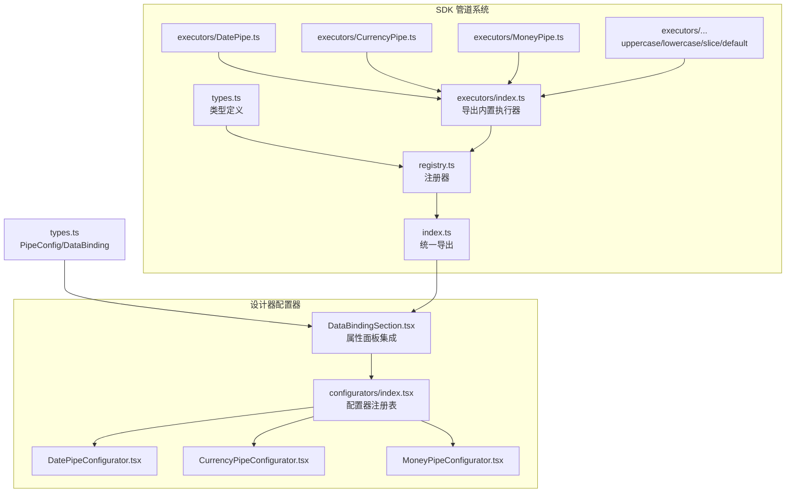
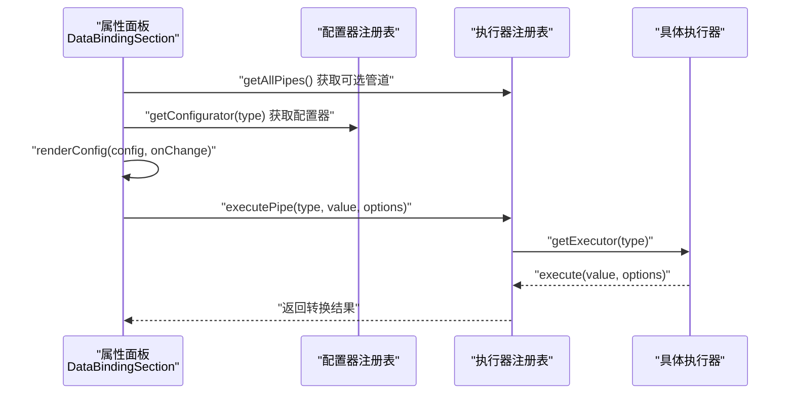
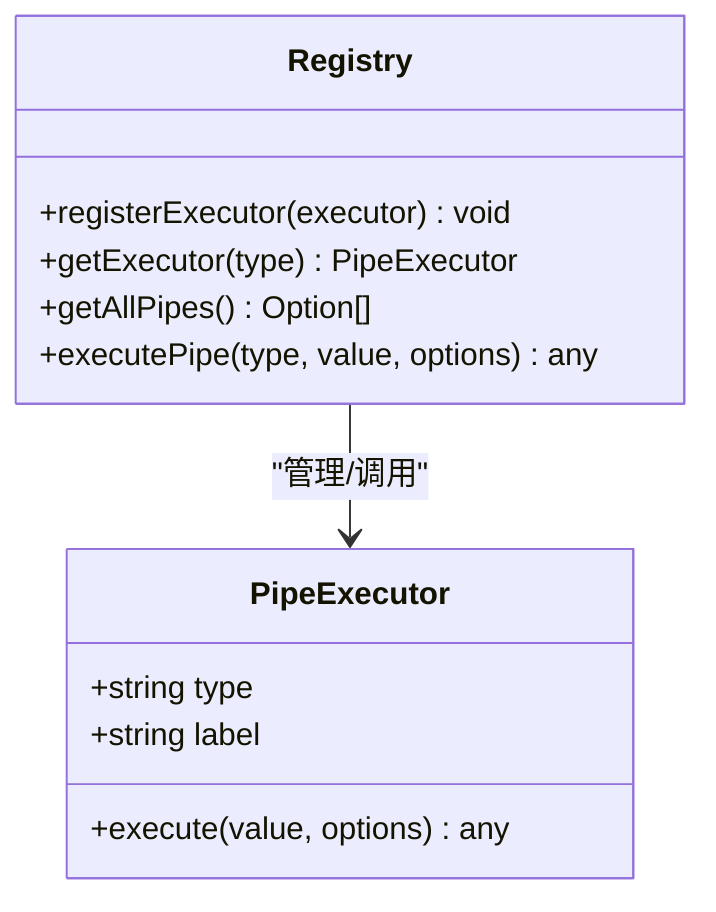
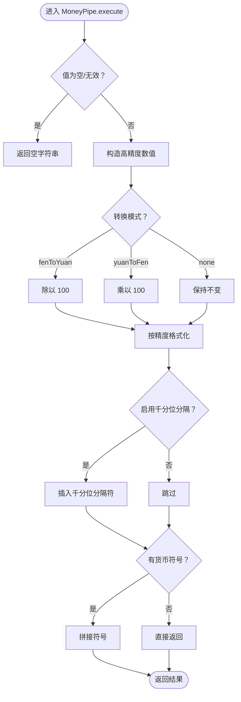
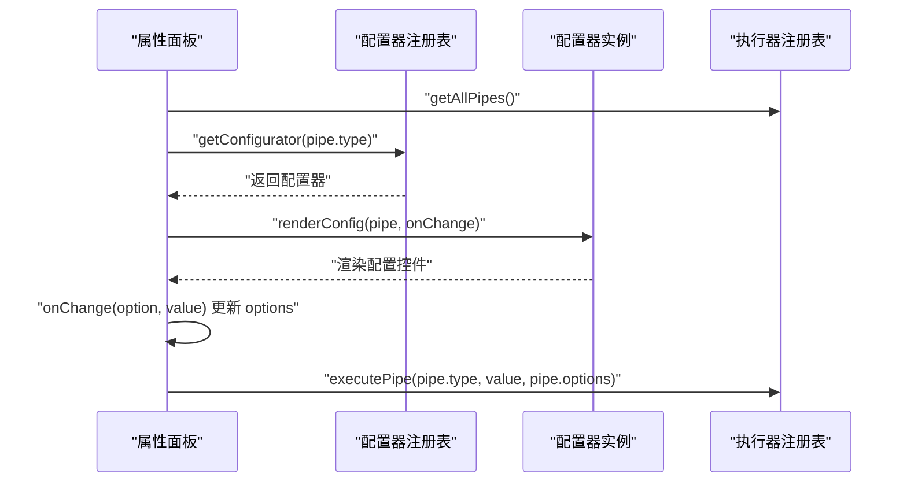
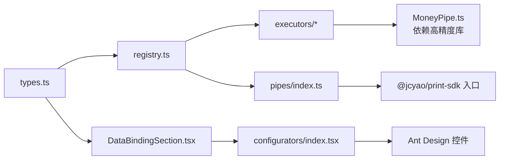

# 管道系统

<cite>
**本文引用的文件**
- [sdk/src/pipes/index.ts](file://sdk/src/pipes/index.ts)
- [sdk/src/pipes/registry.ts](file://sdk/src/pipes/registry.ts)
- [sdk/src/pipes/types.ts](file://sdk/src/pipes/types.ts)
- [sdk/src/pipes/executors/index.ts](file://sdk/src/pipes/executors/index.ts)
- [sdk/src/pipes/executors/DatePipe.ts](file://sdk/src/pipes/executors/DatePipe.ts)
- [sdk/src/pipes/executors/CurrencyPipe.ts](file://sdk/src/pipes/executors/CurrencyPipe.ts)
- [sdk/src/pipes/executors/MoneyPipe.ts](file://sdk/src/pipes/executors/MoneyPipe.ts)
- [designer/src/pipes/configurators/index.tsx](file://designer/src/pipes/configurators/index.tsx)
- [designer/src/pipes/configurators/DatePipeConfigurator.tsx](file://designer/src/pipes/configurators/DatePipeConfigurator.tsx)
- [designer/src/pipes/configurators/CurrencyPipeConfigurator.tsx](file://designer/src/pipes/configurators/CurrencyPipeConfigurator.tsx)
- [designer/src/pipes/configurators/MoneyPipeConfigurator.tsx](file://designer/src/pipes/configurators/MoneyPipeConfigurator.tsx)
- [designer/src/pages/Designer/components/PropertyPanel/DataBindingSection.tsx](file://designer/src/pages/Designer/components/PropertyPanel/DataBindingSection.tsx)
- [sdk/src/types.ts](file://sdk/src/types.ts)
- [README.md](file://README.md)
</cite>

## 目录
1. [简介](#简介)
2. [项目结构](#项目结构)
3. [核心组件](#核心组件)
4. [架构总览](#架构总览)
5. [详细组件分析](#详细组件分析)
6. [依赖关系分析](#依赖关系分析)
7. [性能考量](#性能考量)
8. [故障排查指南](#故障排查指南)
9. [结论](#结论)
10. [附录](#附录)

## 简介
本节概述管道系统的定位与价值：通过“执行器 + 配置器”的插件化架构，将数据转换逻辑与 UI 配置解耦，支持在可视化设计器中直观地为组件字段添加数据管道，并在渲染时按顺序执行转换。v1.0.1 版本对金额转换管道进行了精度增强，采用高精度数值库保障金融类数据的准确性。

- 管道系统是 SDK 的一部分，面向“无 UI 依赖”的纯 TS/ESM 场景，亦可在设计器中通过配置器进行可视化配置。
- 内置 6 种常用管道：日期格式化、货币格式化、金额转换、大小写转换、字符串截取、默认值。
- v1.0.1 新增：金额转换管道使用高精度库保证计算精度。

章节来源
- [README.md: 99-113:99-113](file://README.md#L99-L113)

## 项目结构
管道系统位于 SDK 的 pipes 子模块，采用“执行器 + 注册器 + 配置器”的分层组织：
- 执行器（后端逻辑）：位于 executors 目录，每个内置管道一个文件或常量对象。
- 注册器（后端）：集中注册与检索执行器，提供统一的执行入口。
- 配置器（UI 层）：位于 designer 的 pipes/configurators，负责渲染各管道的配置 UI 并与数据绑定面板联动。

图表来源
- [sdk/src/pipes/index.ts: 1-9:1-9](file://sdk/src/pipes/index.ts#L1-L9)
- [sdk/src/pipes/registry.ts: 1-64:1-64](file://sdk/src/pipes/registry.ts#L1-L64)
- [sdk/src/pipes/types.ts: 1-30:1-30](file://sdk/src/pipes/types.ts#L1-L30)
- [sdk/src/pipes/executors/index.ts: 1-44:1-44](file://sdk/src/pipes/executors/index.ts#L1-L44)
- [designer/src/pipes/configurators/index.tsx: 1-83:1-83](file://designer/src/pipes/configurators/index.tsx#L1-L83)
- [sdk/src/types.ts: 66-75:66-75](file://sdk/src/types.ts#L66-L75)

章节来源
- [sdk/src/pipes/index.ts: 1-9:1-9](file://sdk/src/pipes/index.ts#L1-L9)
- [sdk/src/pipes/registry.ts: 1-64:1-64](file://sdk/src/pipes/registry.ts#L1-L64)
- [sdk/src/pipes/types.ts: 1-30:1-30](file://sdk/src/pipes/types.ts#L1-L30)
- [sdk/src/pipes/executors/index.ts: 1-44:1-44](file://sdk/src/pipes/executors/index.ts#L1-L44)
- [designer/src/pipes/configurators/index.tsx: 1-83:1-83](file://designer/src/pipes/configurators/index.tsx#L1-L83)
- [sdk/src/types.ts: 66-75:66-75](file://sdk/src/types.ts#L66-L75)

## 核心组件
- 管道执行器接口：定义 type、label、execute(value, options)。
- 注册器：提供 registerExecutor/getExecutor/getAllPipes/executePipe。
- 内置执行器：日期格式化、货币格式化、金额转换、大小写转换、字符串截取、默认值。
- 配置器接口与注册表：UI 层根据管道类型渲染配置 UI，并与属性面板联动更新 options。
- 类型定义：PipeConfig、DataBinding 等，支撑管道配置与数据绑定。

章节来源
- [sdk/src/pipes/types.ts: 11-29:11-29](file://sdk/src/pipes/types.ts#L11-L29)
- [sdk/src/pipes/registry.ts: 17-52:17-52](file://sdk/src/pipes/registry.ts#L17-L52)
- [sdk/src/pipes/executors/index.ts: 15-43:15-43](file://sdk/src/pipes/executors/index.ts#L15-L43)
- [designer/src/pipes/configurators/index.tsx: 16-82:16-82](file://designer/src/pipes/configurators/index.tsx#L16-L82)
- [sdk/src/types.ts: 66-75:66-75](file://sdk/src/types.ts#L66-L75)

## 架构总览
管道系统采用“注册器模式 + 插件化执行器 + 配置器 UI”的架构：
- 后端：通过注册器集中管理执行器，统一暴露 executePipe；初始化阶段注册所有内置执行器。
- 前端（设计器）：通过配置器注册表为不同管道类型渲染配置 UI；属性面板 DataBindingSection 负责添加/删除/修改管道及其选项。
- 数据流：组件绑定字段 → 应用管道链（按顺序）→ 输出最终值。

图表来源
- [sdk/src/pipes/registry.ts: 31-52:31-52](file://sdk/src/pipes/registry.ts#L31-L52)
- [designer/src/pipes/configurators/index.tsx: 70-82:70-82](file://designer/src/pipes/configurators/index.tsx#L70-L82)
- [designer/src/pages/Designer/components/PropertyPanel/DataBindingSection.tsx: 72-120:72-120](file://designer/src/pages/Designer/components/PropertyPanel/DataBindingSection.tsx#L72-L120)

## 详细组件分析

### 管道执行器接口与注册器
- 接口职责：type（唯一标识）、label（显示名）、execute（执行转换）。
- 注册器职责：注册、查询、列举、执行；初始化时注册所有内置执行器。
- 执行流程：未找到执行器时回退原值并告警。

图表来源
- [sdk/src/pipes/types.ts: 11-29:11-29](file://sdk/src/pipes/types.ts#L11-L29)
- [sdk/src/pipes/registry.ts: 17-52:17-52](file://sdk/src/pipes/registry.ts#L17-L52)

章节来源
- [sdk/src/pipes/types.ts: 11-29:11-29](file://sdk/src/pipes/types.ts#L11-L29)
- [sdk/src/pipes/registry.ts: 17-52:17-52](file://sdk/src/pipes/registry.ts#L17-L52)

### 内置执行器一览与增强特性
- 日期格式化：支持格式模板（默认年月日），非法日期回退原值。
- 货币格式化：支持货币符号与精度，默认符号与精度可配置。
- 金额转换（v1.0.1 增强）：使用高精度库进行分/元互转与格式化，支持千分位分隔与货币符号，异常时回退原值。
- 大小写转换：全大写/全小写。
- 字符串截取：支持起止位置，缺省行为明确。
- 默认值：空值回退指定默认值。

图表来源
- [sdk/src/pipes/executors/MoneyPipe.ts: 13-61:13-61](file://sdk/src/pipes/executors/MoneyPipe.ts#L13-L61)

章节来源
- [sdk/src/pipes/executors/DatePipe.ts: 11-33:11-33](file://sdk/src/pipes/executors/DatePipe.ts#L11-L33)
- [sdk/src/pipes/executors/CurrencyPipe.ts: 11-15:11-15](file://sdk/src/pipes/executors/CurrencyPipe.ts#L11-L15)
- [sdk/src/pipes/executors/MoneyPipe.ts: 13-61:13-61](file://sdk/src/pipes/executors/MoneyPipe.ts#L13-L61)
- [sdk/src/pipes/executors/index.ts: 15-43:15-43](file://sdk/src/pipes/executors/index.ts#L15-L43)
- [README.md: 112](file://README.md#L112)

### 管道配置器（UI）与属性面板集成
- 配置器接口：type + renderConfig(config, onChange)。
- 注册表：按管道类型映射到对应配置器。
- 属性面板 DataBindingSection：提供管道下拉选择、逐项配置与删除；onChange 通过回调更新 options。
- 典型配置器：
  - 日期：格式模板输入。
  - 货币：货币符号输入。
  - 金额：转换模式（分/元/不转换）、精度、货币符号、千分位开关。
  - 字符串截取：起始/结束位置数字输入。
  - 默认值：默认值字符串输入。

图表来源
- [designer/src/pages/Designer/components/PropertyPanel/DataBindingSection.tsx: 72-120:72-120](file://designer/src/pages/Designer/components/PropertyPanel/DataBindingSection.tsx#L72-L120)
- [designer/src/pipes/configurators/index.tsx: 70-82:70-82](file://designer/src/pipes/configurators/index.tsx#L70-L82)
- [sdk/src/pipes/registry.ts: 31-52:31-52](file://sdk/src/pipes/registry.ts#L31-L52)

章节来源
- [designer/src/pipes/configurators/index.tsx: 16-82:16-82](file://designer/src/pipes/configurators/index.tsx#L16-L82)
- [designer/src/pipes/configurators/DatePipeConfigurator.tsx: 9-22:9-22](file://designer/src/pipes/configurators/DatePipeConfigurator.tsx#L9-L22)
- [designer/src/pipes/configurators/CurrencyPipeConfigurator.tsx: 9-22:9-22](file://designer/src/pipes/configurators/CurrencyPipeConfigurator.tsx#L9-L22)
- [designer/src/pipes/configurators/MoneyPipeConfigurator.tsx: 9-79:9-79](file://designer/src/pipes/configurators/MoneyPipeConfigurator.tsx#L9-L79)
- [designer/src/pages/Designer/components/PropertyPanel/DataBindingSection.tsx: 72-120:72-120](file://designer/src/pages/Designer/components/PropertyPanel/DataBindingSection.tsx#L72-L120)

### 管道配置语法与执行顺序
- 配置结构：PipeConfig 包含 type 与 options；DataBinding.pipes 为管道数组。
- 执行顺序：按数组顺序依次执行，前一结果作为下一输入。
- 配置更新：onChange 回调逐项更新 options，支持动态增删。

章节来源
- [sdk/src/types.ts: 66-75:66-75](file://sdk/src/types.ts#L66-L75)
- [designer/src/pages/Designer/components/PropertyPanel/DataBindingSection.tsx: 21-43:21-43](file://designer/src/pages/Designer/components/PropertyPanel/DataBindingSection.tsx#L21-L43)

### 开发规范与扩展方法
- 执行器开发规范：
  - 实现 PipeExecutor 接口，提供稳定 type 与清晰 label。
  - execute(value, options) 应对空值/异常进行显式处理，必要时回退原值。
  - 保持无副作用，尽量纯函数式。
- 注册器扩展：
  - 在初始化处 registerExecutor(你的执行器)。
  - 如需在 UI 中可见，补充对应的配置器并在注册表中登记。
- 配置器扩展：
  - 实现 PipeConfigurator 接口，renderConfig 返回 Ant Design 控件组合。
  - onChange(option, value) 通过父组件回调更新 options。
  - 在注册表中登记 type -> 配置器。

章节来源
- [sdk/src/pipes/types.ts: 11-29:11-29](file://sdk/src/pipes/types.ts#L11-L29)
- [sdk/src/pipes/registry.ts: 57-63:57-63](file://sdk/src/pipes/registry.ts#L57-L63)
- [designer/src/pipes/configurators/index.tsx: 70-82:70-82](file://designer/src/pipes/configurators/index.tsx#L70-L82)

## 依赖关系分析
- 执行器依赖：无外部 UI 依赖，仅依赖必要的格式化/数学能力；金额转换依赖高精度库。
- 注册器依赖：聚合 executors 下的执行器，提供统一查询与执行。
- 配置器依赖：Ant Design 控件，渲染配置 UI 并与属性面板联动。
- 类型依赖：PipeConfig/DataBinding 等类型贯穿前后端，确保配置结构一致。

图表来源
- [sdk/src/pipes/registry.ts: 6-7:6-7](file://sdk/src/pipes/registry.ts#L6-L7)
- [sdk/src/pipes/executors/MoneyPipe.ts: 6](file://sdk/src/pipes/executors/MoneyPipe.ts#L6)
- [sdk/src/pipes/index.ts: 6-8:6-8](file://sdk/src/pipes/index.ts#L6-L8)
- [designer/src/pipes/configurators/index.tsx: 5](file://designer/src/pipes/configurators/index.tsx#L5)
- [designer/src/pages/Designer/components/PropertyPanel/DataBindingSection.tsx: 9-11:9-11](file://designer/src/pages/Designer/components/PropertyPanel/DataBindingSection.tsx#L9-L11)

章节来源
- [sdk/src/pipes/registry.ts: 6-7:6-7](file://sdk/src/pipes/registry.ts#L6-L7)
- [sdk/src/pipes/executors/MoneyPipe.ts: 6](file://sdk/src/pipes/executors/MoneyPipe.ts#L6)
- [sdk/src/pipes/index.ts: 6-8:6-8](file://sdk/src/pipes/index.ts#L6-L8)
- [designer/src/pipes/configurators/index.tsx: 5](file://designer/src/pipes/configurators/index.tsx#L5)
- [designer/src/pages/Designer/components/PropertyPanel/DataBindingSection.tsx: 9-11:9-11](file://designer/src/pages/Designer/components/PropertyPanel/DataBindingSection.tsx#L9-L11)

## 性能考量
- 管道链长度：管道越多，转换链越长，建议按需组合，避免冗余转换。
- 金额转换：高精度库带来更准确的结果，但计算成本略高于普通浮点；仅在需要金融精度时启用。
- UI 渲染：配置器使用受控控件，onChange 逐项更新，避免不必要的重渲染；建议在属性面板层做防抖或批处理。
- 执行器幂等：执行器应尽量幂等，避免重复执行导致的副作用。

## 故障排查指南
- 管道未生效：
  - 检查 type 是否正确，确认执行器已注册。
  - 查看控制台是否有“未找到执行器”警告。
- 金额转换异常：
  - 确认输入值可被高精度库解析；异常时会回退原值。
  - 检查转换模式与精度设置。
- 日期格式化异常：
  - 确认输入为可解析时间；非法时回退原值。
- 货币格式化异常：
  - 检查符号与精度参数是否合法。

章节来源
- [sdk/src/pipes/registry.ts: 47-49:47-49](file://sdk/src/pipes/registry.ts#L47-L49)
- [sdk/src/pipes/executors/MoneyPipe.ts: 56-59:56-59](file://sdk/src/pipes/executors/MoneyPipe.ts#L56-L59)
- [sdk/src/pipes/executors/DatePipe.ts: 17](file://sdk/src/pipes/executors/DatePipe.ts#L17)
- [sdk/src/pipes/executors/CurrencyPipe.ts: 14](file://sdk/src/pipes/executors/CurrencyPipe.ts#L14)

## 结论
管道系统以“注册器模式 + 插件化执行器 + 配置器 UI”的方式实现了数据转换的可扩展与可视化配置。v1.0.1 对金额转换的精度增强显著提升了金融类数据的可靠性。通过清晰的类型定义与统一的执行入口，系统既适合在设计器中直观使用，也适合在 SDK 独立环境中灵活集成。

## 附录

### 管道类型与典型场景
- 日期格式化：订单日期显示、报表时间戳。
- 货币格式化：金额展示、价格标签。
- 金额转换（v1.0.1 增强）：后端分值转前端元值、带千分位与货币符号。
- 大小写转换：姓名、单位名称规范化。
- 字符串截取：手机号脱敏、地址缩略。
- 默认值：空值兜底、容错显示。

章节来源
- [README.md: 103-112:103-112](file://README.md#L103-L112)