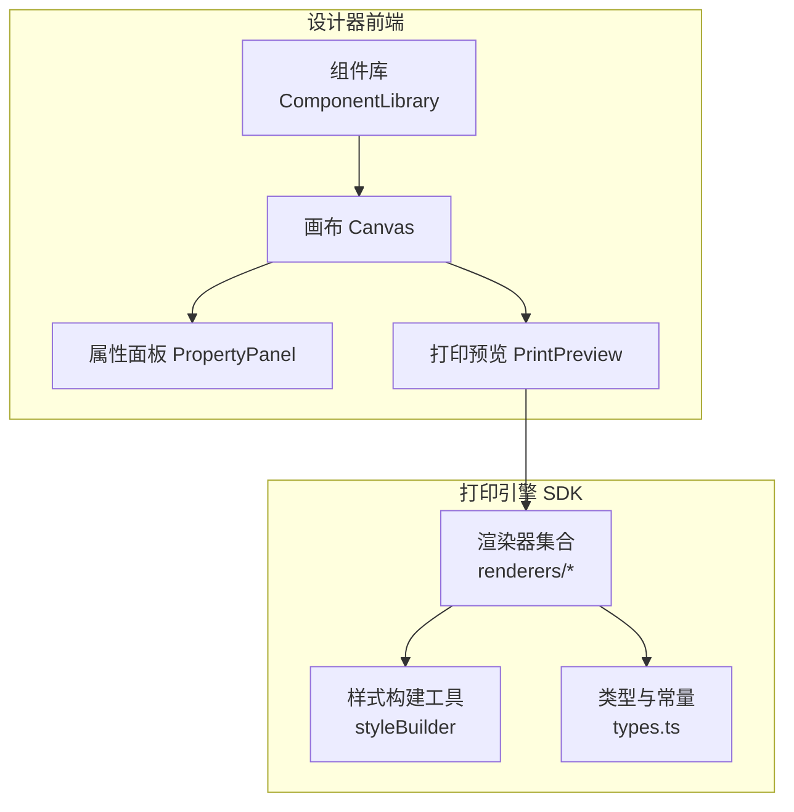
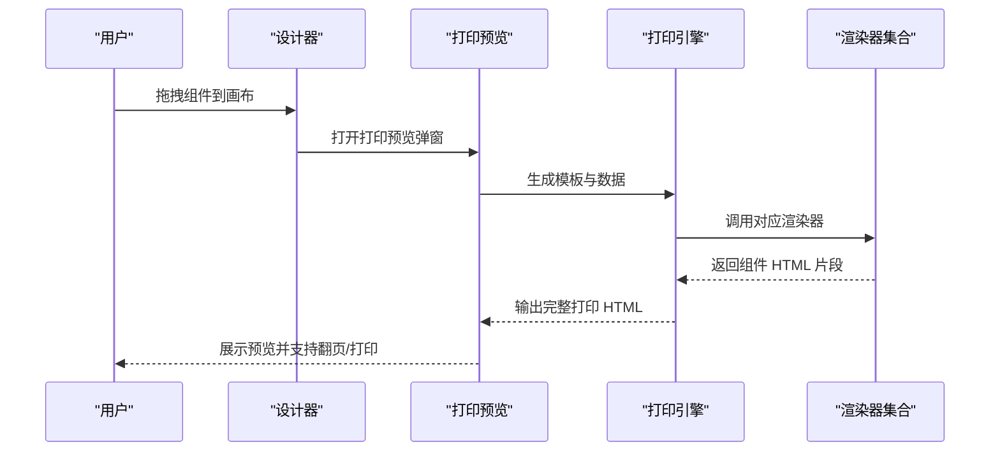
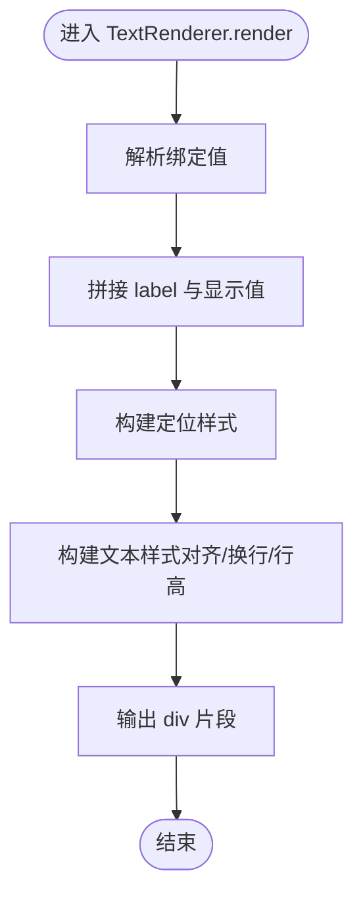
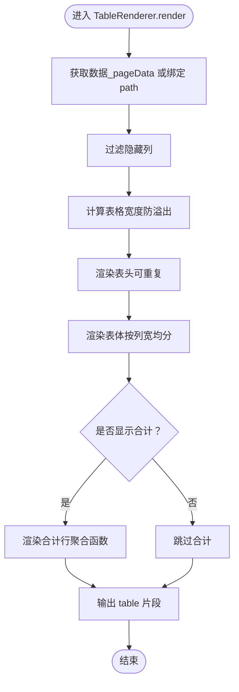
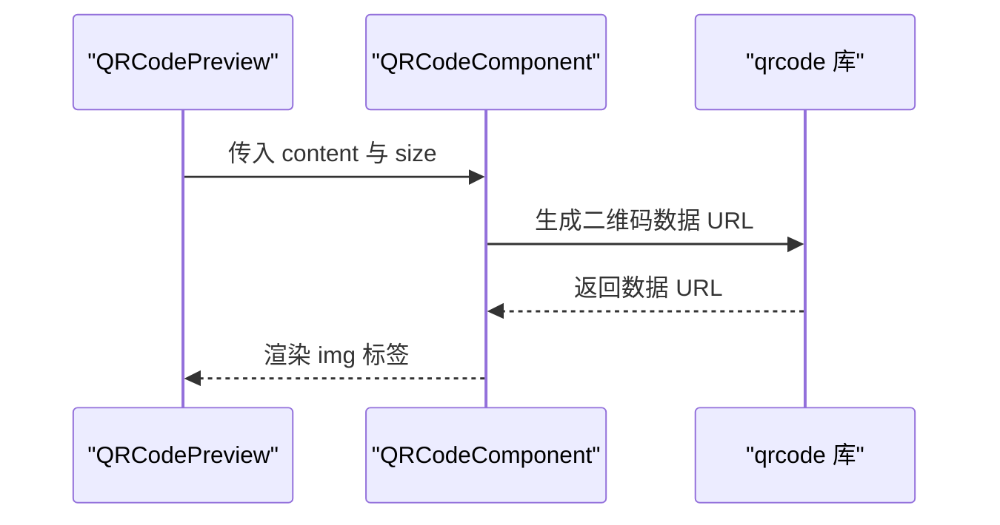
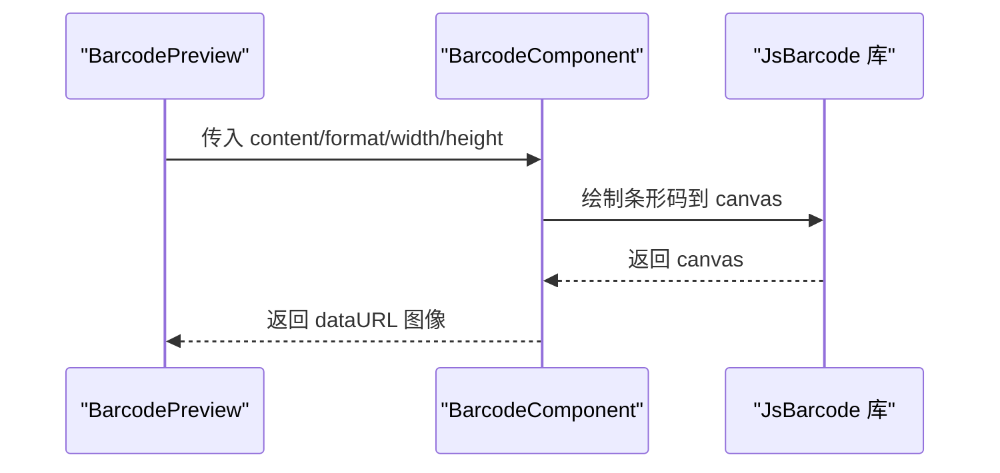
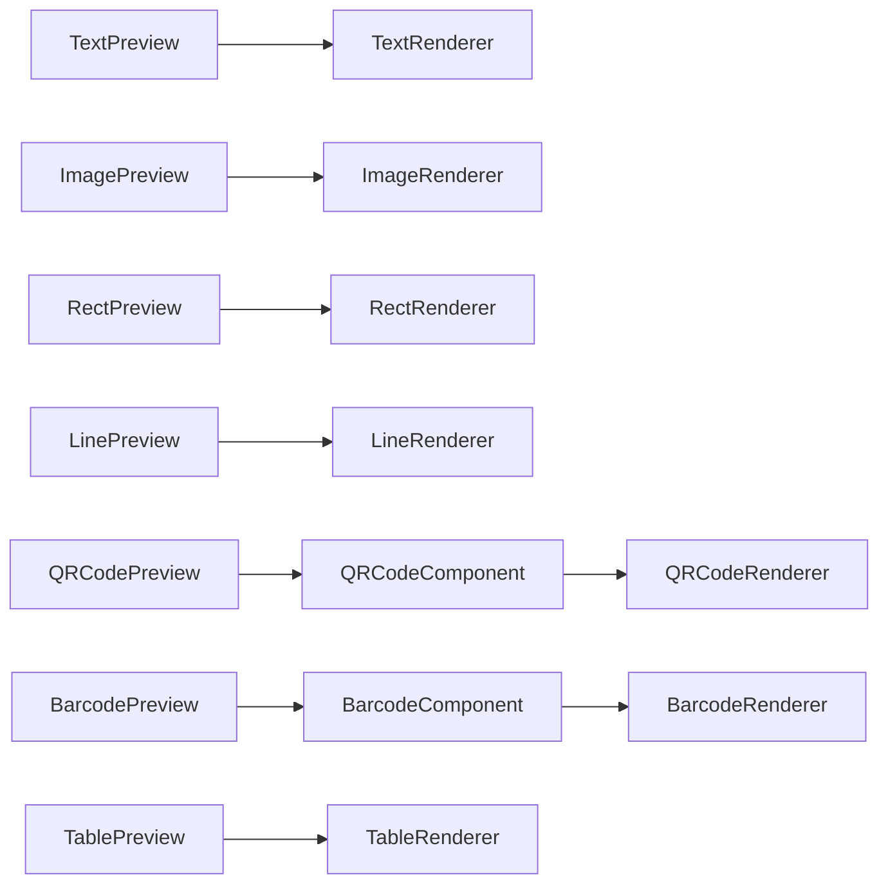

# 组件库系统

<cite>
**本文引用的文件**
- [designer/src/components/Barcode/index.tsx](file://designer/src/components/Barcode/index.tsx)
- [designer/src/components/QRCode/index.tsx](file://designer/src/components/QRCode/index.tsx)
- [designer/src/components/PrintPreview/index.tsx](file://designer/src/components/PrintPreview/index.tsx)
- [designer/src/pages/Designer/components/Canvas/componentRenderers/index.ts](file://designer/src/pages/Designer/components/Canvas/componentRenderers/index.ts)
- [designer/src/pages/Designer/components/Canvas/componentRenderers/TextPreview.tsx](file://designer/src/pages/Designer/components/Canvas/componentRenderers/TextPreview.tsx)
- [designer/src/pages/Designer/components/Canvas/componentRenderers/TablePreview.tsx](file://designer/src/pages/Designer/components/Canvas/componentRenderers/TablePreview.tsx)
- [designer/src/pages/Designer/components/Canvas/componentRenderers/ImagePreview.tsx](file://designer/src/pages/Designer/components/Canvas/componentRenderers/ImagePreview.tsx)
- [designer/src/pages/Designer/components/Canvas/componentRenderers/LinePreview.tsx](file://designer/src/pages/Designer/components/Canvas/componentRenderers/LinePreview.tsx)
- [designer/src/pages/Designer/components/Canvas/componentRenderers/RectPreview.tsx](file://designer/src/pages/Designer/components/Canvas/componentRenderers/RectPreview.tsx)
- [designer/src/pages/Designer/components/Canvas/componentRenderers/QRCodePreview.tsx](file://designer/src/pages/Designer/components/Canvas/componentRenderers/QRCodePreview.tsx)
- [designer/src/pages/Designer/components/Canvas/componentRenderers/BarcodePreview.tsx](file://designer/src/pages/Designer/components/Canvas/componentRenderers/BarcodePreview.tsx)
- [sdk/src/printEngine/renderers/index.ts](file://sdk/src/printEngine/renderers/index.ts)
- [sdk/src/printEngine/renderers/TextRenderer.ts](file://sdk/src/printEngine/renderers/TextRenderer.ts)
- [sdk/src/printEngine/renderers/TableRenderer.ts](file://sdk/src/printEngine/renderers/TableRenderer.ts)
- [sdk/src/printEngine/renderers/ImageRenderer.ts](file://sdk/src/printEngine/renderers/ImageRenderer.ts)
- [sdk/src/printEngine/renderers/RectRenderer.ts](file://sdk/src/printEngine/renderers/RectRenderer.ts)
- [sdk/src/printEngine/renderers/LineRenderer.ts](file://sdk/src/printEngine/renderers/LineRenderer.ts)
- [sdk/src/printEngine/renderers/QRCodeRenderer.ts](file://sdk/src/printEngine/renderers/QRCodeRenderer.ts)
- [sdk/src/printEngine/renderers/BarcodeRenderer.ts](file://sdk/src/printEngine/renderers/BarcodeRenderer.ts)
- [sdk/src/printEngine/renderers/PageNumberRenderer.ts](file://sdk/src/printEngine/renderers/PageNumberRenderer.ts)
- [sdk/src/types.ts](file://sdk/src/types.ts)
</cite>

## 目录
1. [简介](#简介)
2. [项目结构](#项目结构)
3. [核心组件](#核心组件)
4. [架构总览](#架构总览)
5. [详细组件分析](#详细组件分析)
6. [依赖关系分析](#依赖关系分析)
7. [性能考虑](#性能考虑)
8. [故障排查指南](#故障排查指南)
9. [结论](#结论)
10. [附录](#附录)

## 简介
本组件库系统围绕“所见即所得”的设计界面与“高保真打印引擎”两大能力构建，提供七类基础组件的可视化编辑与打印渲染能力：文本、表格、图片、二维码、条形码、线条、矩形。系统通过统一的组件节点模型与渲染器体系，将设计器中的组件配置转换为可打印的 HTML/CSS，支持跨页分页、表头重复、列隐藏、表格合计等高级特性，并提供组件预览与批量打印预览能力。

## 项目结构
- 设计器前端（designer）：提供组件库、画布、属性面板、预览弹窗等交互能力；组件预览渲染器负责在设计器中展示组件效果。
- 打印引擎（sdk）：提供渲染器集合，将模板与数据渲染为可打印 HTML；包含样式构建工具、常量与类型定义。
- 服务端（server）：提供 Mock 数据与模板管理接口（当前仓库未包含实现）。

图表来源
- [designer/src/pages/Designer/components/Canvas/componentRenderers/index.ts:1-11](file://designer/src/pages/Designer/components/Canvas/componentRenderers/index.ts#L1-L11)
- [sdk/src/printEngine/renderers/index.ts:1-13](file://sdk/src/printEngine/renderers/index.ts#L1-L13)

章节来源
- [designer/src/pages/Designer/components/Canvas/componentRenderers/index.ts:1-11](file://designer/src/pages/Designer/components/Canvas/componentRenderers/index.ts#L1-L11)
- [sdk/src/printEngine/renderers/index.ts:1-13](file://sdk/src/printEngine/renderers/index.ts#L1-L13)

## 核心组件
本系统提供以下七类基础组件，均以“预览渲染器 + 打印渲染器”的双层实现：
- 文本组件：支持标签前缀、数据绑定、样式对齐与字体配置。
- 表格组件：支持跨页分页、表头重复、列隐藏、表格合计（含多种聚合方式与精度控制）。
- 图片组件：支持本地/远程图片、base64、对象适配（objectFit）。
- 二维码组件：基于 qrcode 库生成二维码，支持尺寸缓存与占位提示。
- 条形码组件：基于 jsbarcode 生成条形码，支持格式与尺寸缓存。
- 线条组件：支持实线/虚线样式、颜色与粗细映射。
- 矩形组件：支持边框与背景色配置。

章节来源
- [designer/src/pages/Designer/components/Canvas/componentRenderers/TextPreview.tsx:1-31](file://designer/src/pages/Designer/components/Canvas/componentRenderers/TextPreview.tsx#L1-L31)
- [sdk/src/printEngine/renderers/TextRenderer.ts:1-60](file://sdk/src/printEngine/renderers/TextRenderer.ts#L1-L60)
- [designer/src/pages/Designer/components/Canvas/componentRenderers/TablePreview.tsx:1-56](file://designer/src/pages/Designer/components/Canvas/componentRenderers/TablePreview.tsx#L1-L56)
- [sdk/src/printEngine/renderers/TableRenderer.ts:1-292](file://sdk/src/printEngine/renderers/TableRenderer.ts#L1-L292)
- [designer/src/pages/Designer/components/Canvas/componentRenderers/ImagePreview.tsx:1-34](file://designer/src/pages/Designer/components/Canvas/componentRenderers/ImagePreview.tsx#L1-L34)
- [sdk/src/printEngine/renderers/ImageRenderer.ts](file://sdk/src/printEngine/renderers/ImageRenderer.ts)
- [designer/src/components/QRCode/index.tsx:1-52](file://designer/src/components/QRCode/index.tsx#L1-L52)
- [sdk/src/printEngine/renderers/QRCodeRenderer.ts](file://sdk/src/printEngine/renderers/QRCodeRenderer.ts)
- [designer/src/components/Barcode/index.tsx:1-66](file://designer/src/components/Barcode/index.tsx#L1-L66)
- [sdk/src/printEngine/renderers/BarcodeRenderer.ts](file://sdk/src/printEngine/renderers/BarcodeRenderer.ts)
- [designer/src/pages/Designer/components/Canvas/componentRenderers/LinePreview.tsx:1-31](file://designer/src/pages/Designer/components/Canvas/componentRenderers/LinePreview.tsx#L1-L31)
- [sdk/src/printEngine/renderers/LineRenderer.ts](file://sdk/src/printEngine/renderers/LineRenderer.ts)
- [designer/src/pages/Designer/components/Canvas/componentRenderers/RectPreview.tsx:1-20](file://designer/src/pages/Designer/components/Canvas/componentRenderers/RectPreview.tsx#L1-L20)
- [sdk/src/printEngine/renderers/RectRenderer.ts](file://sdk/src/printEngine/renderers/RectRenderer.ts)

## 架构总览
组件在设计器中通过“预览渲染器”即时呈现，在生成打印 HTML 时由“打印渲染器”输出最终 DOM 片段。渲染器遵循统一的接口约定，接收组件节点与上下文，输出字符串形式的 HTML 片段，并可计算组件高度用于分页估算。

图表来源
- [designer/src/components/PrintPreview/index.tsx:102-165](file://designer/src/components/PrintPreview/index.tsx#L102-L165)
- [sdk/src/printEngine/renderers/index.ts:1-13](file://sdk/src/printEngine/renderers/index.ts#L1-L13)

## 详细组件分析

### 文本组件
- 预览渲染器（设计器）：支持对齐（左/居中/右）、字号、字重、颜色与省略处理，优先展示绑定路径或标签+文本。
- 打印渲染器（SDK）：解析绑定值，支持标签前缀；使用 flex 布局与行高、换行策略；定位样式由布局参数与单位换算生成。
- 属性与样式
  - 属性：label（标签前缀）、text（默认文本）、props 映射。
  - 样式：fontSize、color、fontWeight、textAlign。
  - 数据绑定：path、pipes、fallback。
- 关键实现参考
  - 预览渲染器：[TextPreview:10-30](file://designer/src/pages/Designer/components/Canvas/componentRenderers/TextPreview.tsx#L10-L30)
  - 打印渲染器：[TextRenderer:13-53](file://sdk/src/printEngine/renderers/TextRenderer.ts#L13-L53)

图表来源
- [sdk/src/printEngine/renderers/TextRenderer.ts:13-53](file://sdk/src/printEngine/renderers/TextRenderer.ts#L13-L53)

章节来源
- [designer/src/pages/Designer/components/Canvas/componentRenderers/TextPreview.tsx:10-30](file://designer/src/pages/Designer/components/Canvas/componentRenderers/TextPreview.tsx#L10-L30)
- [sdk/src/printEngine/renderers/TextRenderer.ts:13-53](file://sdk/src/printEngine/renderers/TextRenderer.ts#L13-L53)
- [sdk/src/types.ts:134-149](file://sdk/src/types.ts#L134-L149)

### 表格组件
- 预览渲染器（设计器）：展示表头与占位“暂无数据”，支持列隐藏与边框开关。
- 打印渲染器（SDK）：支持跨页分页、表头重复、列隐藏、合计行（sum/avg/max/min/count，含精度与前后缀），自动计算表格宽度与行高，保证内容换行与可读性。
- 属性与样式
  - 属性：columns（列定义）、showHeader/bordered/repeatHeader、showSummary、summaryMode、summaryLabel、summaryStyle。
  - 列定义：dataIndex、title、width、align、hidden、summary。
  - 数据绑定：path（数组数据）。
- 关键实现参考
  - 预览渲染器：[TablePreview:10-55](file://designer/src/pages/Designer/components/Canvas/componentRenderers/TablePreview.tsx#L10-L55)
  - 打印渲染器：[TableRenderer:14-161](file://sdk/src/printEngine/renderers/TableRenderer.ts#L14-L161)

图表来源
- [sdk/src/printEngine/renderers/TableRenderer.ts:14-161](file://sdk/src/printEngine/renderers/TableRenderer.ts#L14-L161)

章节来源
- [designer/src/pages/Designer/components/Canvas/componentRenderers/TablePreview.tsx:10-55](file://designer/src/pages/Designer/components/Canvas/componentRenderers/TablePreview.tsx#L10-L55)
- [sdk/src/printEngine/renderers/TableRenderer.ts:14-161](file://sdk/src/printEngine/renderers/TableRenderer.ts#L14-L161)
- [sdk/src/types.ts:119-132](file://sdk/src/types.ts#L119-L132)
- [sdk/src/types.ts:90-98](file://sdk/src/types.ts#L90-L98)
- [sdk/src/types.ts:82-88](file://sdk/src/types.ts#L82-L88)

### 图片组件
- 预览渲染器（设计器）：当存在 src 时渲染 img，否则显示占位提示；支持 objectFit 控制。
- 打印渲染器（SDK）：直接输出 img 标签，保持尺寸与适配策略。
- 属性与样式
  - 属性：src（支持本地/远程/base64）。
  - 样式：objectFit。
- 关键实现参考
  - 预览渲染器：[ImagePreview:10-33](file://designer/src/pages/Designer/components/Canvas/componentRenderers/ImagePreview.tsx#L10-L33)
  - 打印渲染器：[ImageRenderer](file://sdk/src/printEngine/renderers/ImageRenderer.ts)

章节来源
- [designer/src/pages/Designer/components/Canvas/componentRenderers/ImagePreview.tsx:10-33](file://designer/src/pages/Designer/components/Canvas/componentRenderers/ImagePreview.tsx#L10-L33)
- [sdk/src/printEngine/renderers/ImageRenderer.ts](file://sdk/src/printEngine/renderers/ImageRenderer.ts)

### 二维码组件
- 预览渲染器（设计器）：基于组件尺寸换算像素后调用二维码组件；当无内容时提供占位提示。
- 二维码组件：基于 qrcode 库生成 base64 数据 URL，使用 useMemo 缓存 content 与 size 组合，避免重复生成。
- 属性与样式
  - 属性：content（二维码内容）、size（像素）。
- 关键实现参考
  - 预览渲染器：[QRCodePreview:11-16](file://designer/src/pages/Designer/components/Canvas/componentRenderers/QRCodePreview.tsx#L11-L16)
  - 二维码组件：[QRCodeComponent:10-49](file://designer/src/components/QRCode/index.tsx#L10-L49)
  - 打印渲染器：[QRCodeRenderer](file://sdk/src/printEngine/renderers/QRCodeRenderer.ts)

图表来源
- [designer/src/pages/Designer/components/Canvas/componentRenderers/QRCodePreview.tsx:11-16](file://designer/src/pages/Designer/components/Canvas/componentRenderers/QRCodePreview.tsx#L11-L16)
- [designer/src/components/QRCode/index.tsx:16-20](file://designer/src/components/QRCode/index.tsx#L16-L20)

章节来源
- [designer/src/pages/Designer/components/Canvas/componentRenderers/QRCodePreview.tsx:11-16](file://designer/src/pages/Designer/components/Canvas/componentRenderers/QRCodePreview.tsx#L11-L16)
- [designer/src/components/QRCode/index.tsx:10-49](file://designer/src/components/QRCode/index.tsx#L10-L49)
- [sdk/src/printEngine/renderers/QRCodeRenderer.ts](file://sdk/src/printEngine/renderers/QRCodeRenderer.ts)

### 条形码组件
- 预览渲染器（设计器）：根据组件尺寸换算像素，传递 content、format、width、height。
- 条形码组件：基于 jsbarcode 生成 canvas，再转为 dataURL；使用 useMemo 缓存 key，避免重复绘制。
- 属性与样式
  - 属性：content、format（如 CODE128）、width、height。
- 关键实现参考
  - 预览渲染器：[BarcodePreview:11-25](file://designer/src/pages/Designer/components/Canvas/componentRenderers/BarcodePreview.tsx#L11-L25)
  - 条形码组件：[BarcodeComponent:12-62](file://designer/src/components/Barcode/index.tsx#L12-L62)
  - 打印渲染器：[BarcodeRenderer](file://sdk/src/printEngine/renderers/BarcodeRenderer.ts)

图表来源
- [designer/src/pages/Designer/components/Canvas/componentRenderers/BarcodePreview.tsx:11-25](file://designer/src/pages/Designer/components/Canvas/componentRenderers/BarcodePreview.tsx#L11-L25)
- [designer/src/components/Barcode/index.tsx:21-34](file://designer/src/components/Barcode/index.tsx#L21-L34)

章节来源
- [designer/src/pages/Designer/components/Canvas/componentRenderers/BarcodePreview.tsx:11-25](file://designer/src/pages/Designer/components/Canvas/componentRenderers/BarcodePreview.tsx#L11-L25)
- [designer/src/components/Barcode/index.tsx:12-62](file://designer/src/components/Barcode/index.tsx#L12-L62)
- [sdk/src/printEngine/renderers/BarcodeRenderer.ts](file://sdk/src/printEngine/renderers/BarcodeRenderer.ts)

### 线条组件
- 预览渲染器（设计器）：将样式中的边框粗细、样式、颜色映射为实际线条高度与样式。
- 打印渲染器（SDK）：输出一条水平线，高度由样式换算为 px。
- 属性与样式
  - 样式：borderTopWidth、borderTopStyle、borderTopColor。
- 关键实现参考
  - 预览渲染器：[LinePreview:10-30](file://designer/src/pages/Designer/components/Canvas/componentRenderers/LinePreview.tsx#L10-L30)
  - 打印渲染器：[LineRenderer](file://sdk/src/printEngine/renderers/LineRenderer.ts)

章节来源
- [designer/src/pages/Designer/components/Canvas/componentRenderers/LinePreview.tsx:10-30](file://designer/src/pages/Designer/components/Canvas/componentRenderers/LinePreview.tsx#L10-L30)
- [sdk/src/printEngine/renderers/LineRenderer.ts](file://sdk/src/printEngine/renderers/LineRenderer.ts)

### 矩形组件
- 预览渲染器（设计器）：直接应用边框与背景样式。
- 打印渲染器（SDK）：输出带边框与背景的容器。
- 属性与样式
  - 样式：border、background。
- 关键实现参考
  - 预览渲染器：[RectPreview:10-19](file://designer/src/pages/Designer/components/Canvas/componentRenderers/RectPreview.tsx#L10-L19)
  - 打印渲染器：[RectRenderer](file://sdk/src/printEngine/renderers/RectRenderer.ts)

章节来源
- [designer/src/pages/Designer/components/Canvas/componentRenderers/RectPreview.tsx:10-19](file://designer/src/pages/Designer/components/Canvas/componentRenderers/RectPreview.tsx#L10-L19)
- [sdk/src/printEngine/renderers/RectRenderer.ts](file://sdk/src/printEngine/renderers/RectRenderer.ts)

## 依赖关系分析
- 组件预览渲染器与打印渲染器一一对应，通过统一的组件节点模型与数据绑定协议进行解耦。
- 预览渲染器依赖设计器的组件库与属性面板，打印渲染器依赖打印引擎的样式构建与常量。
- 二维码与条形码组件在设计器侧作为独立子组件，预览渲染器通过 props 传递尺寸与内容。

图表来源
- [designer/src/pages/Designer/components/Canvas/componentRenderers/index.ts:4-10](file://designer/src/pages/Designer/components/Canvas/componentRenderers/index.ts#L4-L10)
- [sdk/src/printEngine/renderers/index.ts:5-12](file://sdk/src/printEngine/renderers/index.ts#L5-L12)

章节来源
- [designer/src/pages/Designer/components/Canvas/componentRenderers/index.ts:4-10](file://designer/src/pages/Designer/components/Canvas/componentRenderers/index.ts#L4-L10)
- [sdk/src/printEngine/renderers/index.ts:5-12](file://sdk/src/printEngine/renderers/index.ts#L5-L12)

## 性能考虑
- 预览渲染器缓存
  - 二维码与条形码组件使用 useMemo 基于关键参数组合缓存生成结果，避免重复计算与闪烁。
  - 参考：[QRCodeComponent:13-20](file://designer/src/components/QRCode/index.tsx#L13-L20)、[BarcodeComponent:15-19](file://designer/src/components/Barcode/index.tsx#L15-L19)
- 预览弹窗渲染
  - 打印预览弹窗在生成 HTML 后写入 iframe，计算页数并滚动到目标页面，减少不必要的重排。
  - 参考：[PrintPreview:34-53](file://designer/src/components/PrintPreview/index.tsx#L34-L53)
- 表格渲染优化
  - 使用百分比列宽与 min-height 实现自然换行与可读性；合计计算采用高精度库避免浮点误差。
  - 参考：[TableRenderer:94-102](file://sdk/src/printEngine/renderers/TableRenderer.ts#L94-L102)
- 图片加载
  - 打印前等待图片加载完成，提升打印一致性；若加载失败仍允许打印。
  - 参考：[PrintPreview:220-229](file://designer/src/components/PrintPreview/index.tsx#L220-L229)

## 故障排查指南
- 二维码/条形码空白
  - 检查 content 是否为空；确认缓存 key 是否正确更新；查看控制台错误信息。
  - 参考：[QRCodeComponent:16-20](file://designer/src/components/QRCode/index.tsx#L16-L20)、[BarcodeComponent:21-34](file://designer/src/components/Barcode/index.tsx#L21-L34)
- 表格宽度溢出
  - 当 xMm + widthMm 超出页面可用宽度时会自动调整；可在布局上适当缩小宽度或减少列数。
  - 参考：[TableRenderer:42-55](file://sdk/src/printEngine/renderers/TableRenderer.ts#L42-L55)
- 合计计算异常
  - 检查列 summary 配置与数据类型；确认精度与前后缀设置是否合理。
  - 参考：[TableRenderer:216-267](file://sdk/src/printEngine/renderers/TableRenderer.ts#L216-L267)
- 预览弹窗无法打印
  - 检查浏览器弹窗拦截设置；确认 HTML 已写入且图片加载完成。
  - 参考：[PrintPreview:204-229](file://designer/src/components/PrintPreview/index.tsx#L204-L229)

章节来源
- [designer/src/components/QRCode/index.tsx:16-20](file://designer/src/components/QRCode/index.tsx#L16-L20)
- [designer/src/components/Barcode/index.tsx:21-34](file://designer/src/components/Barcode/index.tsx#L21-L34)
- [sdk/src/printEngine/renderers/TableRenderer.ts:42-55](file://sdk/src/printEngine/renderers/TableRenderer.ts#L42-L55)
- [sdk/src/printEngine/renderers/TableRenderer.ts:216-267](file://sdk/src/printEngine/renderers/TableRenderer.ts#L216-L267)
- [designer/src/components/PrintPreview/index.tsx:204-229](file://designer/src/components/PrintPreview/index.tsx#L204-L229)

## 结论
该组件库系统通过“预览渲染器 + 打印渲染器”的双轨设计，实现了从所见即所得到高保真打印的完整闭环。七类基础组件覆盖了常见的打印场景，配合表格的跨页分页、表头重复与合计能力，满足复杂报表需求。通过缓存与样式构建工具等手段，系统在易用性与性能之间取得平衡。建议后续扩展包括：组件库的拖拽排序、批量数据绑定、页码组件的渲染器完善与更丰富的样式插件。

## 附录
- 组件节点与类型定义
  - 组件类型：text、image、rect、container、table、line、qrcode、barcode。
  - 数据绑定：path、pipes、fallback。
  - 表格分页与合计：repeatHeader、showSummary、summaryMode、summaryLabel、summaryStyle。
  - 参考：[types.ts:64-132](file://sdk/src/types.ts#L64-L132)

章节来源
- [sdk/src/types.ts:64-132](file://sdk/src/types.ts#L64-L132)