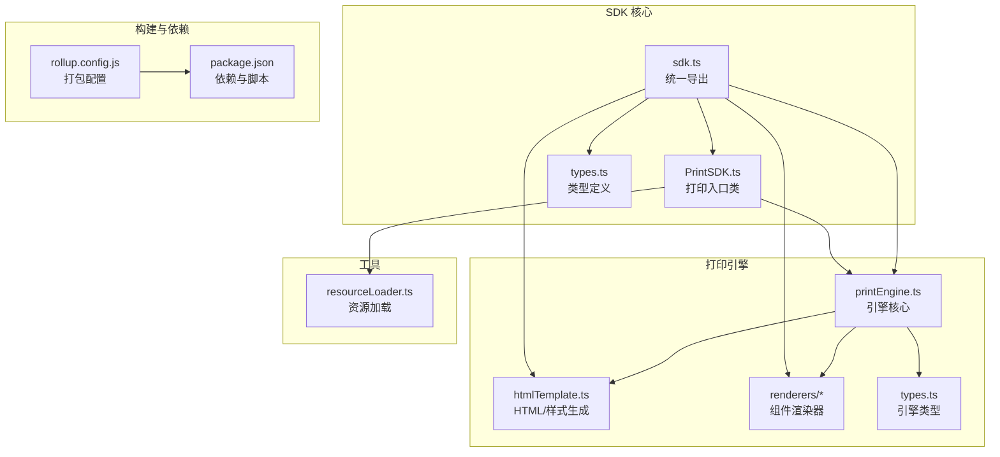
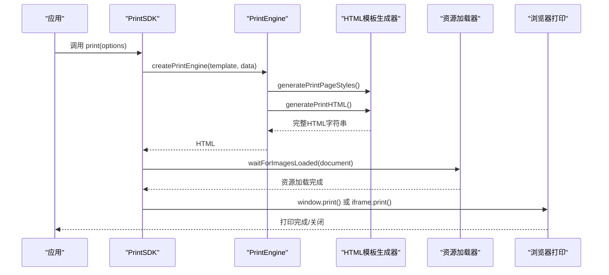
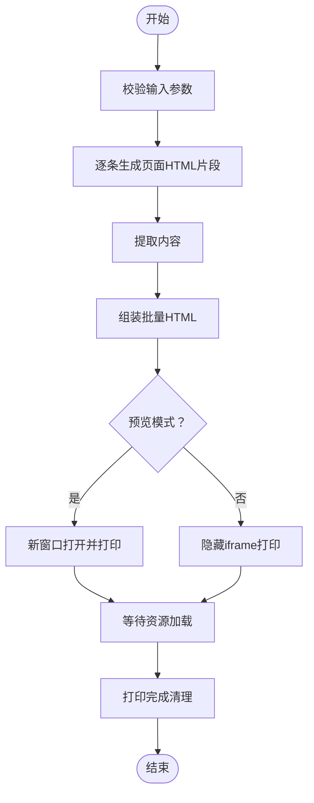
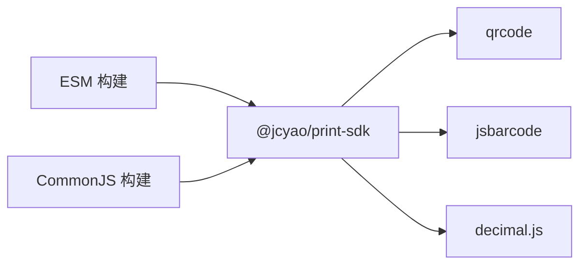

# SDK 集成使用

<cite>
**本文引用的文件**
- [PrintSDK.ts](file://sdk/src/PrintSDK.ts)
- [sdk.ts](file://sdk/src/sdk.ts)
- [printEngine.ts](file://sdk/src/printEngine.ts)
- [types.ts](file://sdk/src/types.ts)
- [printEngine/types.ts](file://sdk/src/printEngine/types.ts)
- [htmlTemplate.ts](file://sdk/src/printEngine/htmlTemplate.ts)
- [resourceLoader.ts](file://sdk/src/utils/resourceLoader.ts)
- [QRCodeRenderer.ts](file://sdk/src/printEngine/renderers/QRCodeRenderer.ts)
- [BarcodeRenderer.ts](file://sdk/src/printEngine/renderers/BarcodeRenderer.ts)
- [package.json](file://sdk/package.json)
- [rollup.config.js](file://sdk/rollup.config.js)
- [example.html](file://sdk/example.html)
- [README.md](file://sdk/README.md)
</cite>

## 目录
1. [简介](#简介)
2. [项目结构](#项目结构)
3. [核心组件](#核心组件)
4. [架构概览](#架构概览)
5. [详细组件分析](#详细组件分析)
6. [依赖分析](#依赖分析)
7. [性能考虑](#性能考虑)
8. [故障排除指南](#故障排除指南)
9. [结论](#结论)
10. [附录](#附录)

## 简介
本文件面向需要在前端项目中集成 PrintSDK 的开发者，提供从安装、引入、初始化到具体 API 使用的完整指南。PrintSDK 是一个纯 TypeScript 实现的客户端打印解决方案，具备以下关键特性：
- 无 UI 依赖：SDK 本身不包含任何前端框架 UI 组件，仅提供打印能力
- 浏览器打印支持：通过 iframe 或新窗口实现打印，支持预览与直接打印两种模式
- 批量打印：支持同模板多数据批量打印，以及多模板混合批量打印
- 插件化架构：渲染器与管道系统可扩展，便于二次开发
- 外部依赖：二维码、条形码、高精度十进制运算库通过 Rollup 外部化打包，减少 SDK 体积

## 项目结构
SDK 位于 `sdk/` 目录，核心文件组织如下：
- 核心类与入口：PrintSDK.ts、sdk.ts
- 打印引擎：printEngine.ts、renderers/*、htmlTemplate.ts、types.ts
- 工具：resourceLoader.ts
- 构建配置：rollup.config.js、package.json
- 示例：example.html
- 文档：README.md

**图表来源**
- [PrintSDK.ts:1-477](file://sdk/src/PrintSDK.ts#L1-L477)
- [sdk.ts:1-66](file://sdk/src/sdk.ts#L1-L66)
- [printEngine.ts:1-1096](file://sdk/src/printEngine.ts#L1-L1096)
- [htmlTemplate.ts:1-281](file://sdk/src/printEngine/htmlTemplate.ts#L1-L281)
- [resourceLoader.ts:1-90](file://sdk/src/utils/resourceLoader.ts#L1-L90)
- [rollup.config.js:1-25](file://sdk/rollup.config.js#L1-L25)
- [package.json:1-61](file://sdk/package.json#L1-L61)

**章节来源**
- [PrintSDK.ts:1-477](file://sdk/src/PrintSDK.ts#L1-L477)
- [sdk.ts:1-66](file://sdk/src/sdk.ts#L1-L66)
- [printEngine.ts:1-1096](file://sdk/src/printEngine.ts#L1-L1096)
- [htmlTemplate.ts:1-281](file://sdk/src/printEngine/htmlTemplate.ts#L1-L281)
- [resourceLoader.ts:1-90](file://sdk/src/utils/resourceLoader.ts#L1-L90)
- [rollup.config.js:1-25](file://sdk/rollup.config.js#L1-L25)
- [package.json:1-61](file://sdk/package.json#L1-L61)

## 核心组件
- PrintSDK：提供打印入口，支持直接打印、预览打印、HTML 生成、批量打印、多模板批量打印等功能
- PrintEngine：负责模板解析、数据绑定、管道转换、虚拟分页与渲染
- 渲染器：文本、表格、图片、矩形、线条、二维码、条形码等组件渲染器
- HTML 模板生成器：统一生成打印页面样式与完整 HTML 文档
- 资源加载器：等待图片、二维码、条形码等资源加载完成

**章节来源**
- [PrintSDK.ts:100-477](file://sdk/src/PrintSDK.ts#L100-L477)
- [printEngine.ts:30-1096](file://sdk/src/printEngine.ts#L30-L1096)
- [htmlTemplate.ts:1-281](file://sdk/src/printEngine/htmlTemplate.ts#L1-L281)
- [resourceLoader.ts:1-90](file://sdk/src/utils/resourceLoader.ts#L1-L90)

## 架构概览
PrintSDK 采用“解耦设计”，直接接收模板数据，不依赖模板服务。其核心流程如下：
- PrintSDK 接收模板与数据，调用 PrintEngine 生成 HTML
- 根据模式选择：预览模式在新窗口打开，直接打印模式在隐藏 iframe 中执行
- 使用资源加载器等待图片等资源加载完成，再触发打印
- 批量打印与多模板批量打印通过统一的 HTML 模板生成器与样式配置实现

**图表来源**
- [PrintSDK.ts:110-172](file://sdk/src/PrintSDK.ts#L110-L172)
- [printEngine.ts:389-420](file://sdk/src/printEngine.ts#L389-L420)
- [htmlTemplate.ts:230-252](file://sdk/src/printEngine/htmlTemplate.ts#L230-L252)
- [resourceLoader.ts:12-73](file://sdk/src/utils/resourceLoader.ts#L12-L73)

## 详细组件分析

### PrintSDK 类与工厂函数
- createPrintSDK()：创建 PrintSDK 实例，无需配置，完全解耦
- print(options)：核心打印方法，支持 preview 预览模式
- printDirect(template, data)：快捷直接打印
- printWithPreview(template, data)：快捷预览打印
- generateHTML(template, data)：仅生成 HTML 字符串
- printMultiple(template, dataList, options)：同模板多数据批量打印
- printMultiTemplate(groups, options)：多模板混合批量打印

参数与返回值要点：
- PrintOptions：template（模板数据）、data（业务数据）、preview（是否预览）
- 批量打印返回 Promise<void>，内部通过 onProgress 回调报告进度
- printMultiTemplate 支持多模板组，要求所有模板使用相同纸张尺寸

**章节来源**
- [PrintSDK.ts:47-98](file://sdk/src/PrintSDK.ts#L47-L98)
- [PrintSDK.ts:110-190](file://sdk/src/PrintSDK.ts#L110-L190)
- [PrintSDK.ts:210-322](file://sdk/src/PrintSDK.ts#L210-L322)
- [PrintSDK.ts:332-467](file://sdk/src/PrintSDK.ts#L332-L467)
- [sdk.ts:7-15](file://sdk/src/sdk.ts#L7-L15)

### 打印引擎 PrintEngine
- 插件化渲染器注册：默认注册文本、表格、图片、矩形、线条、二维码、条形码渲染器
- 数据绑定与管道：支持路径解析、管道链式转换、日期格式化
- 虚拟分页：基于相对间距的流式布局，支持表格跨页拆分与表头重复
- 页码渲染：根据页面配置在固定位置渲染页码
- 渲染上下文：提供 resolveBinding、applyPipes、getValueByPath、formatDate 等工具

**章节来源**
- [printEngine.ts:30-1096](file://sdk/src/printEngine.ts#L30-L1096)
- [printEngine/types.ts:11-82](file://sdk/src/printEngine/types.ts#L11-L82)

### HTML 模板生成器
- generatePrintPageStyles：生成预览模式的页面样式
- generateBatchPrintStyles：生成批量打印样式（直接打印模式）
- generatePrintHTML：组装完整 HTML 文档
- getPageSizeFromConfig：从 PageConfig 提取页面尺寸

**章节来源**
- [htmlTemplate.ts:81-281](file://sdk/src/printEngine/htmlTemplate.ts#L81-L281)

### 资源加载器
- waitForImagesLoaded：等待文档中所有图片加载完成，支持超时与错误统计
- waitForPrintResourcesReady：当前仅等待图片，二维码与条形码已同步生成为 base64

**章节来源**
- [resourceLoader.ts:12-89](file://sdk/src/utils/resourceLoader.ts#L12-L89)

### 二维码与条形码渲染器
- QRCodeRenderer：在浏览器环境同步生成二维码 base64，直接嵌入 img 标签
- BarcodeRenderer：在浏览器环境同步生成条形码 base64，直接嵌入 img 标签
- 两者均在渲染时同步生成，避免异步阻塞

**章节来源**
- [QRCodeRenderer.ts:12-62](file://sdk/src/printEngine/renderers/QRCodeRenderer.ts#L12-L62)
- [BarcodeRenderer.ts:12-62](file://sdk/src/printEngine/renderers/BarcodeRenderer.ts#L12-L62)

### 批量打印与多模板批量打印流程

**图表来源**
- [PrintSDK.ts:210-322](file://sdk/src/PrintSDK.ts#L210-L322)
- [PrintSDK.ts:332-467](file://sdk/src/PrintSDK.ts#L332-L467)
- [resourceLoader.ts:12-73](file://sdk/src/utils/resourceLoader.ts#L12-L73)

## 依赖分析
- 外部依赖库（通过 Rollup external 标记，不打包进 SDK）：
  - qrcode：用于生成二维码
  - jsbarcode：用于生成条形码
  - decimal.js：用于高精度十进制运算
- 打包格式：同时输出 CommonJS 与 ESM，满足不同模块系统的使用需求
- SDK 类型导出：统一通过 sdk.ts 导出，便于按需引入

**图表来源**
- [rollup.config.js:17-18](file://sdk/rollup.config.js#L17-L18)
- [package.json:49-53](file://sdk/package.json#L49-L53)

**章节来源**
- [rollup.config.js:1-25](file://sdk/rollup.config.js#L1-L25)
- [package.json:1-61](file://sdk/package.json#L1-L61)

## 性能考虑
- 资源加载等待：二维码与条形码已同步生成为 base64，主要等待外部图片资源，避免异步阻塞
- 批量打印：将多条数据合并为单一 HTML 文档，减少打印确认次数
- 虚拟分页：基于相对间距的流式布局，避免复杂计算带来的性能损耗
- 打印完成清理：使用 afterprint 事件与兜底定时器清理隐藏 iframe，避免内存泄漏

**章节来源**
- [resourceLoader.ts:82-89](file://sdk/src/utils/resourceLoader.ts#L82-L89)
- [PrintSDK.ts:149-171](file://sdk/src/PrintSDK.ts#L149-L171)
- [printEngine.ts:418-620](file://sdk/src/printEngine.ts#L418-L620)

## 故障排除指南
- 打开新窗口失败：预览模式下若无法打开新窗口，会抛出错误，请检查浏览器弹窗拦截设置
- iframe 访问失败：直接打印模式下若无法访问 iframe 文档，会抛出错误，请检查同源策略与 DOM 可用性
- 图片加载超时：waitForImagesLoaded 支持超时与错误统计，超时会记录日志并继续执行
- afterprint 事件未触发：若用户取消打印，SDK 提供兜底清理逻辑，5 秒后自动移除 iframe
- 多模板混合打印：所有模板必须使用相同纸张尺寸，否则会跳过打印并记录警告

**章节来源**
- [PrintSDK.ts:117-127](file://sdk/src/PrintSDK.ts#L117-L127)
- [PrintSDK.ts:138-143](file://sdk/src/PrintSDK.ts#L138-L143)
- [resourceLoader.ts:28-32](file://sdk/src/utils/resourceLoader.ts#L28-L32)
- [PrintSDK.ts:164-171](file://sdk/src/PrintSDK.ts#L164-L171)
- [PrintSDK.ts:338-341](file://sdk/src/PrintSDK.ts#L338-L341)

## 结论
PrintSDK 提供了纯 TypeScript 实现的客户端打印解决方案，具备无 UI 依赖、浏览器打印支持、批量打印与多模板批量打印等能力。通过插件化架构与外部依赖库的合理使用，SDK 在保证功能完整性的同时，保持了良好的可扩展性与性能表现。结合可视化设计器，开发者可以快速生成模板并集成到业务系统中。

## 附录

### 安装与引入
- 安装命令：使用 npm 安装 @jcyao/print-sdk
- 引入方式：通过 ES Module 或 CommonJS 引入 createPrintSDK 工厂函数
- 无需配置：createPrintSDK() 直接创建实例，完全解耦设计

**章节来源**
- [README.md:84-88](file://sdk/README.md#L84-L88)
- [sdk.ts:7-15](file://sdk/src/sdk.ts#L7-L15)
- [package.json:13-16](file://sdk/package.json#L13-L16)

### 使用示例与集成步骤
- 初始化：import { createPrintSDK } from '@jcyao/print-sdk'，然后 const sdk = createPrintSDK()
- 基本打印：await sdk.print({ template, data, preview: false })
- 预览打印：await sdk.print({ template, data, preview: true })
- 仅生成 HTML：const html = await sdk.generateHTML(template, data)
- 批量打印：await sdk.printMultiple(template, dataList, { preview, onProgress })
- 多模板批量打印：await sdk.printMultiTemplate(groups, { preview, onProgress })

**章节来源**
- [example.html:88-127](file://sdk/example.html#L88-L127)
- [README.md:90-136](file://sdk/README.md#L90-L136)
- [README.md:162-221](file://sdk/README.md#L162-L221)

### 错误处理策略
- 预览窗口与 iframe 访问失败：抛出明确错误信息，便于上层捕获与提示
- 图片加载超时：记录日志并继续执行，避免阻塞整体流程
- afterprint 事件兜底：5 秒后清理隐藏 iframe，防止内存泄漏
- 多模板混合打印：检测模板尺寸一致性，不一致时跳过并记录警告

**章节来源**
- [PrintSDK.ts:117-127](file://sdk/src/PrintSDK.ts#L117-L127)
- [PrintSDK.ts:138-143](file://sdk/src/PrintSDK.ts#L138-L143)
- [resourceLoader.ts:28-32](file://sdk/src/utils/resourceLoader.ts#L28-L32)
- [PrintSDK.ts:164-171](file://sdk/src/PrintSDK.ts#L164-L171)
- [PrintSDK.ts:338-341](file://sdk/src/PrintSDK.ts#L338-L341)

### 性能优化建议
- 合理使用批量打印：将多条数据合并为单一 HTML 文档，减少打印确认次数
- 控制图片资源：尽量使用本地或 CDN 图片，并确保加载路径正确
- 避免过多异步资源：二维码与条形码已同步生成，尽量减少其他异步资源
- 使用预览模式调试：在开发阶段使用预览模式，减少直接打印对系统的影响

**章节来源**
- [resourceLoader.ts:82-89](file://sdk/src/utils/resourceLoader.ts#L82-L89)
- [PrintSDK.ts:149-171](file://sdk/src/PrintSDK.ts#L149-L171)

### SDK 与可视化设计器关系
- 设计器生成模板 JSON：可视化拖拽设计打印模板，生成模板数据
- SDK 直接使用模板：SDK 不依赖模板服务，直接接收模板数据进行打印
- 独立使用优势：无需额外服务端依赖，可快速集成到现有前端项目
- 适用场景：订单小票、发票、标签、报表等需要浏览器端打印的业务场景

**章节来源**
- [README.md:10-14](file://sdk/README.md#L10-L14)
- [README.md:76-83](file://sdk/README.md#L76-L83)