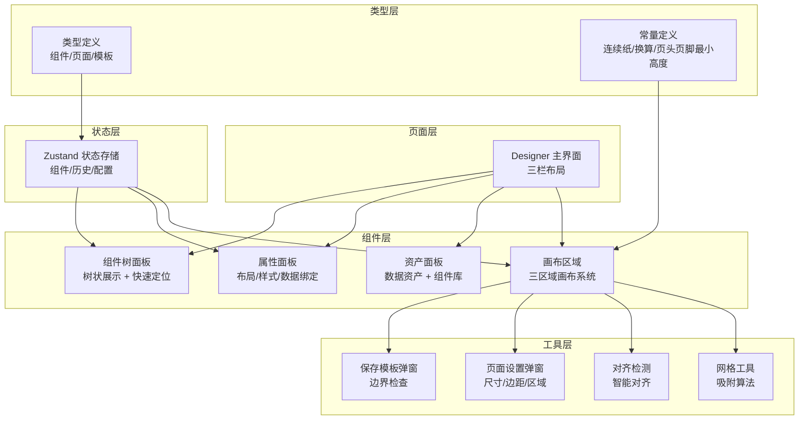
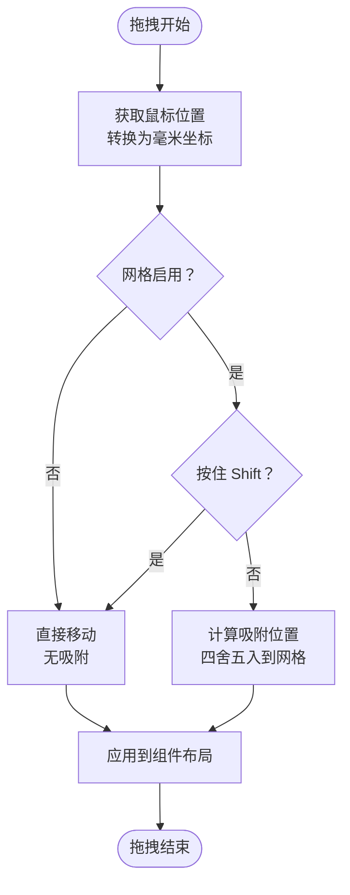
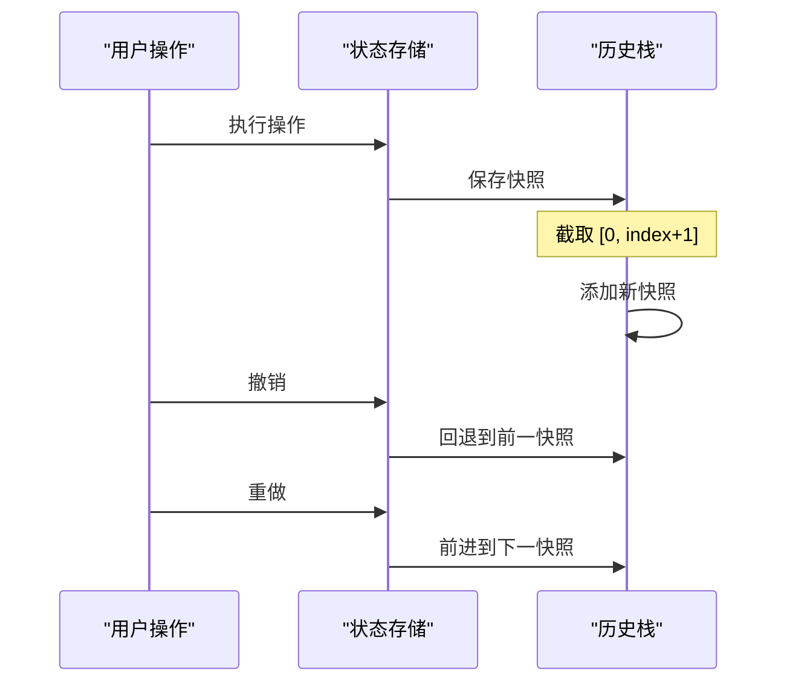
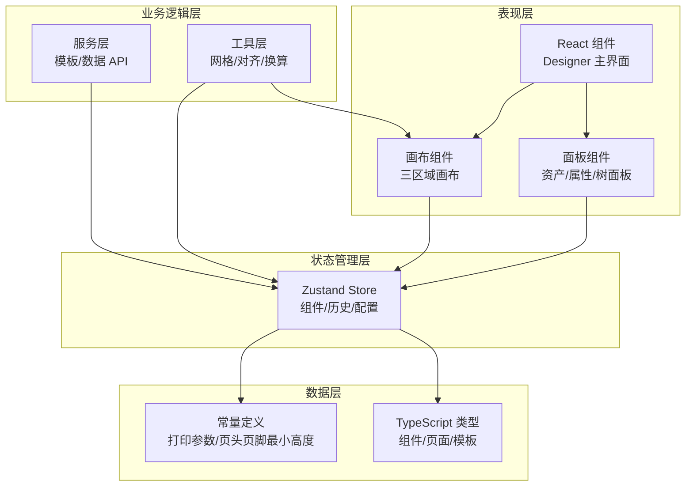
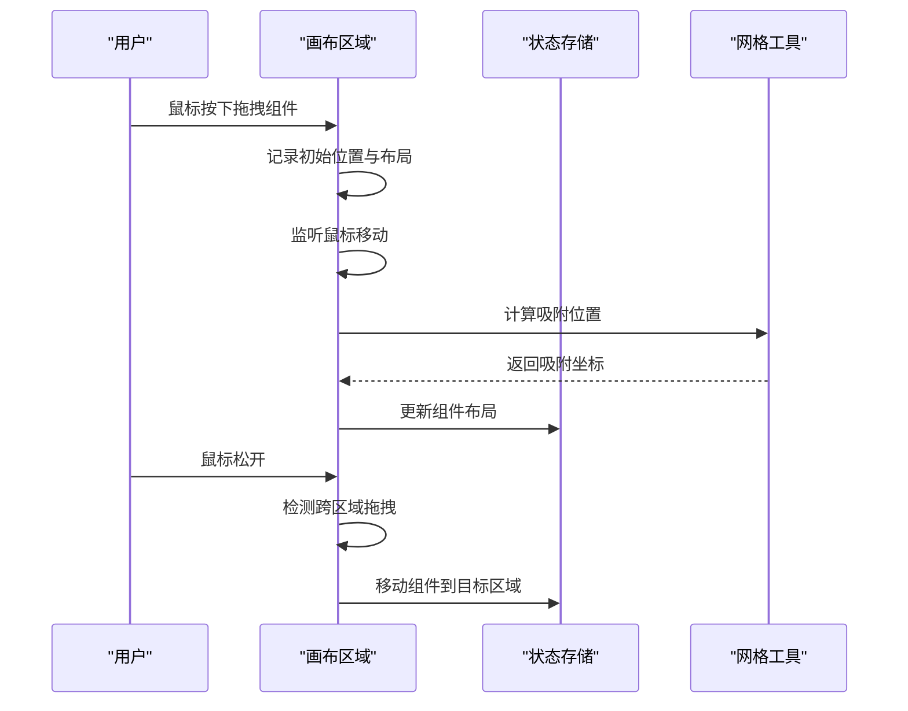
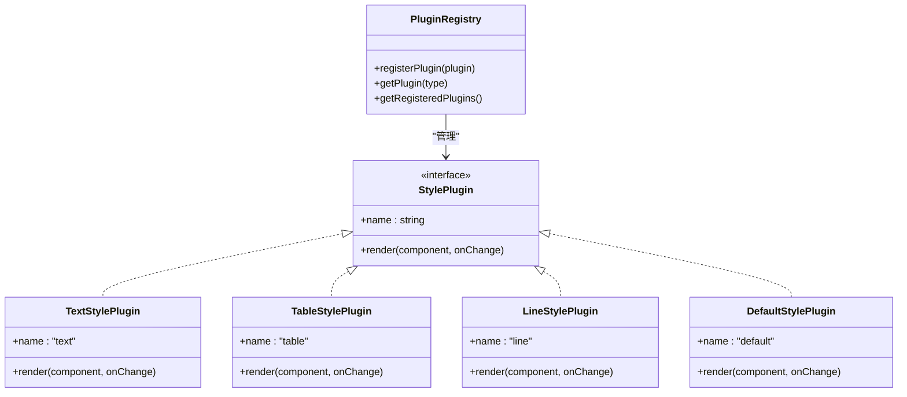
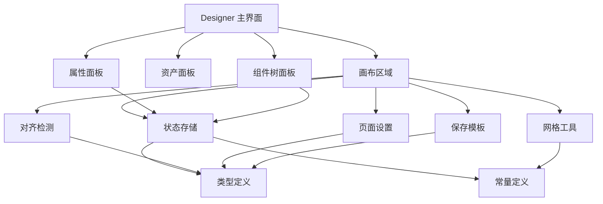

# 可视化模板设计器

<cite>
**本文档引用的文件**
- [Designer 主界面](file://designer/src/pages/Designer/index.tsx)
- [画布区域](file://designer/src/pages/Designer/components/Canvas/index.tsx)
- [资产面板](file://designer/src/pages/Designer/components/AssetPanel/index.tsx)
- [属性面板](file://designer/src/pages/Designer/components/PropertyPanel/index.tsx)
- [组件树面板](file://designer/src/pages/Designer/components/ComponentTreePanel/index.tsx)
- [网格工具](file://designer/src/utils/grid.ts)
- [智能对齐检测](file://designer/src/pages/Designer/components/Canvas/alignmentDetector.ts)
- [对齐参考线组件](file://designer/src/pages/Designer/components/Canvas/AlignmentGuides.tsx)
- [页面设置弹窗](file://designer/src/pages/Designer/components/Canvas/PageSettingModal.tsx)
- [保存模板弹窗](file://designer/src/pages/Designer/components/Canvas/SaveTemplateModal.tsx)
- [设计器状态存储](file://designer/src/store/designer.ts)
- [类型定义](file://designer/src/types/index.ts)
- [常量定义](file://designer/src/constants/index.ts)
</cite>

## 目录
1. [简介](#简介)
2. [项目结构](#项目结构)
3. [核心组件](#核心组件)
4. [架构概览](#架构概览)
5. [详细组件分析](#详细组件分析)
6. [依赖关系分析](#依赖关系分析)
7. [性能考量](#性能考量)
8. [故障排除指南](#故障排除指南)
9. [结论](#结论)
10. [附录](#附录)

## 简介
本项目是一个基于 React + TypeScript 的可视化模板设计器，专为打印模板设计而构建。系统采用三栏布局设计（数据资产树、画布编辑器、属性面板），支持三区域画布系统（页头/内容/页脚），提供智能网格吸附与对齐参考线、组件树面板、撤销/重做、多页预览与实时打印等核心功能。

## 项目结构
系统采用模块化组织，主要分为以下层次：
- 页面层：Designer 主界面负责布局与导航
- 组件层：画布、资产面板、属性面板、组件树面板等
- 工具层：网格、对齐检测、页面设置、保存模板等
- 状态层：Zustand 状态管理，集中管理组件、页面配置、历史记录等
- 类型层：完整的 TypeScript 类型定义，确保类型安全

**图表来源**
- [Designer 主界面:1-365](file://designer/src/pages/Designer/index.tsx#L1-L365)
- [画布区域:1-800](file://designer/src/pages/Designer/components/Canvas/index.tsx#L1-L800)
- [网格工具:1-36](file://designer/src/utils/grid.ts#L1-L36)
- [智能对齐检测:1-127](file://designer/src/pages/Designer/components/Canvas/alignmentDetector.ts#L1-L127)
- [页面设置弹窗:1-357](file://designer/src/pages/Designer/components/Canvas/PageSettingModal.tsx#L1-L357)
- [保存模板弹窗:1-177](file://designer/src/pages/Designer/components/Canvas/SaveTemplateModal.tsx#L1-L177)
- [设计器状态存储:1-773](file://designer/src/store/designer.ts#L1-L773)
- [类型定义:1-378](file://designer/src/types/index.ts#L1-L378)
- [常量定义:1-26](file://designer/src/constants/index.ts#L1-L26)

**章节来源**
- [Designer 主界面:1-365](file://designer/src/pages/Designer/index.tsx#L1-L365)
- [类型定义:1-378](file://designer/src/types/index.ts#L1-L378)

## 核心组件
本节深入分析三栏布局与三区域画布系统的核心实现。

### 三栏布局设计
系统采用 Ant Design Layout 组件实现三栏布局：
- 左侧资产面板：包含数据资产与组件库两个标签页
- 中央画布区域：三区域画布系统（页头/内容/页脚）
- 右侧属性面板：组件属性配置，支持标签页切换（组件树/属性配置）

布局特点：
- 支持左右面板折叠，提升空间利用率
- 画布区域提供缩放控制与悬浮工具栏
- 调试抽屉可查看模板 JSON 结构

**章节来源**
- [Designer 主界面:54-361](file://designer/src/pages/Designer/index.tsx#L54-L361)
- [资产面板:1-32](file://designer/src/pages/Designer/components/AssetPanel/index.tsx#L1-L32)
- [属性面板:1-152](file://designer/src/pages/Designer/components/PropertyPanel/index.tsx#L1-L152)

### 三区域画布系统
画布区域实现完整的三区域布局：
- 页头区域：可配置高度，支持组件拖拽与编辑
- 内容区域：主编辑区域，支持组件拖拽、缩放、对齐
- 页脚区域：可配置高度，支持组件拖拽与编辑

区域特性：
- 独立渲染：每个区域独立维护组件列表
- 区域感知：对齐、分布、层级管理均考虑区域边界
- 跨区域拖拽：支持组件在不同区域间拖拽移动

**更新** 页头页脚最小高度常量重构：新增 HEADER_FOOTER_MIN_HEIGHT = 1 常量，替换所有硬编码的 15mm，提升设计灵活性

**章节来源**
- [画布区域:22-95](file://designer/src/pages/Designer/components/Canvas/index.tsx#L22-L95)
- [设计器状态存储:108-125](file://designer/src/store/designer.ts#L108-L125)

### 智能网格吸附系统
网格系统提供精确的吸附对齐能力：

#### 网格吸附算法
- 基于毫米单位的精确计算
- 支持按住 Shift 键临时禁用吸附
- 网格大小可配置（默认 5mm）

#### 实现机制

**图表来源**
- [网格工具:12-15](file://designer/src/utils/grid.ts#L12-L15)
- [画布区域:101-106](file://designer/src/pages/Designer/components/Canvas/index.tsx#L101-L106)

**章节来源**
- [网格工具:1-36](file://designer/src/utils/grid.ts#L1-L36)
- [画布区域:101-106](file://designer/src/pages/Designer/components/Canvas/index.tsx#L101-L106)

### 智能对齐参考线
系统提供实时的智能对齐参考线功能：

#### 对齐检测算法
- 基于毫米单位的精确检测
- 阈值为 0.8mm（约 3px）
- 支持垂直和水平对齐检测
- 自动过滤重复的参考线

#### 参考线渲染
- 将毫米坐标转换为缩放后的像素位置
- 支持垂直和水平参考线
- 可选的对齐类型标签

**章节来源**
- [智能对齐检测:31-126](file://designer/src/pages/Designer/components/Canvas/alignmentDetector.ts#L31-L126)
- [对齐参考线组件:21-63](file://designer/src/pages/Designer/components/Canvas/AlignmentGuides.tsx#L21-L63)

### 组件树面板
组件树面板提供完整的组件层级管理：

#### 树状展示
- 三区域分组显示（页头/内容/页脚）
- 每个组件显示图标、类型、数据绑定路径
- 支持快速定位到画布中的组件

#### 快速定位功能
- 点击树节点自动选中并滚动到对应组件
- 支持右键菜单：复制、删除组件
- 实时统计各区域组件数量

**章节来源**
- [组件树面板:66-158](file://designer/src/pages/Designer/components/ComponentTreePanel/index.tsx#L66-L158)

### 撤销/重做机制
系统实现完整的全量状态快照机制：

#### 历史记录管理
- 最多保存 20 步历史
- 全量快照：同时保存三个区域的组件状态
- 历史索引跟踪当前状态位置

#### 实现原理

**图表来源**
- [设计器状态存储:93-106](file://designer/src/store/designer.ts#L93-L106)
- [设计器状态存储:509-548](file://designer/src/store/designer.ts#L509-L548)

**章节来源**
- [设计器状态存储:92-106](file://designer/src/store/designer.ts#L92-L106)
- [设计器状态存储:508-548](file://designer/src/store/designer.ts#L508-L548)

### 多页预览与实时打印
系统支持多页模板的预览与打印：

#### 页面设置
- 支持 A4/A5、自定义、连续纸三种尺寸
- 可配置页面方向（纵向/横向）
- 支持页边距、页头/页脚区域设置
- 页码配置（位置、格式、样式）

#### 连续纸支持
- 无限高度的连续纸模式
- 默认宽度 80mm（常见热敏打印机宽度）
- 最小高度 100mm（编辑时的基础显示高度）

**更新** 页头页脚最小高度常量重构：新增 HEADER_FOOTER_MIN_HEIGHT = 1 常量，替换所有硬编码的 15mm，提升设计灵活性

**章节来源**
- [页面设置弹窗:30-87](file://designer/src/pages/Designer/components/Canvas/PageSettingModal.tsx#L30-L87)
- [常量定义:7-13](file://designer/src/constants/index.ts#L7-L13)

## 架构概览
系统采用分层架构设计，确保关注点分离与可维护性：

**图表来源**
- [Designer 主界面:1-365](file://designer/src/pages/Designer/index.tsx#L1-L365)
- [设计器状态存储:1-773](file://designer/src/store/designer.ts#L1-L773)
- [类型定义:1-378](file://designer/src/types/index.ts#L1-L378)
- [常量定义:1-26](file://designer/src/constants/index.ts#L1-L26)

## 详细组件分析

### 画布区域组件分析
画布区域是系统的核心，实现了完整的编辑功能：

#### 组件拖拽机制

**图表来源**
- [画布区域:538-699](file://designer/src/pages/Designer/components/Canvas/index.tsx#L538-L699)
- [网格工具:12-15](file://designer/src/utils/grid.ts#L12-L15)

#### 区域高度拖拽
系统支持动态调整页头/页脚区域高度：
- 页头手柄在底部，向下拖拽增加高度
- 页脚手柄在顶部，向下拖拽减少高度
- **更新** 最小高度限制为 1mm（原为 15mm），提升设计灵活性
- 最大高度确保内容区域至少保留 30mm

**更新** 页头页脚最小高度常量重构：新增 HEADER_FOOTER_MIN_HEIGHT = 1 常量，替换所有硬编码的 15mm，提升设计灵活性

**章节来源**
- [画布区域:701-750](file://designer/src/pages/Designer/components/Canvas/index.tsx#L701-L750)

### 属性面板组件分析
属性面板采用模块化设计，支持多种组件类型的属性配置：

#### 样式插件系统

**图表来源**
- [样式插件注册器:1-52](file://designer/src/pages/Designer/components/PropertyPanel/stylePlugins/index.ts#L1-L52)

#### 数据绑定配置
属性面板支持组件的数据绑定：
- 支持点号路径（如 'user.name'）
- 支持数据管道链式转换
- 支持回退值设置

**章节来源**
- [属性面板:69-79](file://designer/src/pages/Designer/components/PropertyPanel/index.tsx#L69-L79)
- [类型定义:157-164](file://designer/src/types/index.ts#L157-L164)

### 资产面板组件分析
资产面板提供两种资源入口：

#### 数据资产
- 展示 Schema 字典中的字段
- 支持拖拽到画布生成相应组件
- 自动识别字段类型并生成合适组件

#### 组件库
- 提供常用打印组件（文本、图片、表格、线条、二维码、条形码、矩形）
- 支持拖拽到画布创建组件
- 自动计算默认布局与样式

**章节来源**
- [资产面板:7-31](file://designer/src/pages/Designer/components/AssetPanel/index.tsx#L7-L31)

## 依赖关系分析
系统采用清晰的依赖关系设计：

**图表来源**
- [Designer 主界面:1-365](file://designer/src/pages/Designer/index.tsx#L1-L365)
- [画布区域:1-800](file://designer/src/pages/Designer/components/Canvas/index.tsx#L1-L800)
- [设计器状态存储:1-773](file://designer/src/store/designer.ts#L1-L773)
- [类型定义:1-378](file://designer/src/types/index.ts#L1-L378)
- [常量定义:1-26](file://designer/src/constants/index.ts#L1-L26)

**章节来源**
- [Designer 主界面:1-365](file://designer/src/pages/Designer/index.tsx#L1-L365)
- [画布区域:1-800](file://designer/src/pages/Designer/components/Canvas/index.tsx#L1-L800)
- [设计器状态存储:1-773](file://designer/src/store/designer.ts#L1-L773)

## 性能考量
系统在性能方面采取了多项优化措施：

### 渲染优化
- 使用 useRef 缓存状态值，避免不必要的重新渲染
- 区域组件独立渲染，减少整体重绘
- 智能对齐参考线按需渲染

### 状态管理优化
- 全量快照机制，避免深度比较开销
- 历史记录长度限制（20步），防止内存泄漏
- 组件更新采用局部更新策略

### 计算优化
- 网格吸附使用四舍五入算法，计算简单高效
- 对齐检测阈值设置合理，避免过度计算
- 坐标换算使用常量，减少重复计算

## 故障排除指南
常见问题及解决方案：

### 组件超出边界
**问题现象**：组件拖拽到画布外或页头/页脚区域外
**解决方法**：
- 检查页面尺寸与边距设置
- 确认页头/页脚高度配置合理
- 使用网格吸附功能自动对齐

### 智能对齐无效
**问题现象**：拖拽组件时没有出现对齐参考线
**解决方法**：
- 检查对齐检测阈值（0.8mm）
- 确认组件间距在阈值范围内
- 避免按住 Shift 键（临时禁用吸附）

### 撤销/重做失效
**问题现象**：无法撤销或重做操作
**解决方法**：
- 检查历史记录是否超过 20 步
- 确认操作是否触发状态更新
- 重启应用重置状态

**更新** 页头页脚最小高度常量重构：新增 HEADER_FOOTER_MIN_HEIGHT = 1 常量，替换所有硬编码的 15mm，提升设计灵活性

**章节来源**
- [画布区域:222-279](file://designer/src/pages/Designer/components/Canvas/index.tsx#L222-L279)
- [智能对齐检测:11-12](file://designer/src/pages/Designer/components/Canvas/alignmentDetector.ts#L11-L12)
- [设计器状态存储:508-548](file://designer/src/store/designer.ts#L508-L548)

## 结论
可视化模板设计器采用现代化的前端技术栈，实现了完整的打印模板设计功能。系统具有以下优势：

1. **架构清晰**：分层设计确保代码可维护性
2. **功能完善**：覆盖模板设计的全流程需求
3. **用户体验佳**：直观的三栏布局与丰富的交互功能
4. **扩展性强**：插件化的样式系统支持新组件类型
5. **性能稳定**：合理的优化策略保证流畅体验

**更新** 页头页脚最小高度常量重构：新增 HEADER_FOOTER_MIN_HEIGHT = 1 常量，替换所有硬编码的 15mm，显著提升设计灵活性，允许更精细的页头页脚高度控制。

建议在实际使用中充分利用三区域画布系统、智能对齐功能和撤销重做机制，以提高模板设计效率。

## 附录

### 使用示例
1. **创建新模板**：打开资产面板 → 组件库 → 拖拽组件到画布
2. **配置页面**：点击页面设置 → 调整尺寸/边距/区域
3. **数据绑定**：在属性面板中设置数据路径
4. **智能对齐**：拖拽组件时观察参考线进行精确对齐
5. **保存模板**：点击保存按钮 → 输入模板名称 → 确认边界检查

### 最佳实践
1. **合理使用网格**：保持 5mm 网格大小，提升对齐精度
2. **分层设计**：利用页头/内容/页脚区域组织模板结构
3. **数据驱动**：优先使用数据资产而非硬编码文本
4. **渐进式设计**：先搭建框架，再填充细节内容
5. **定期保存**：利用撤销重做机制保护设计成果
6. **灵活的高度控制**：利用新的 1mm 最小高度常量进行精细调节