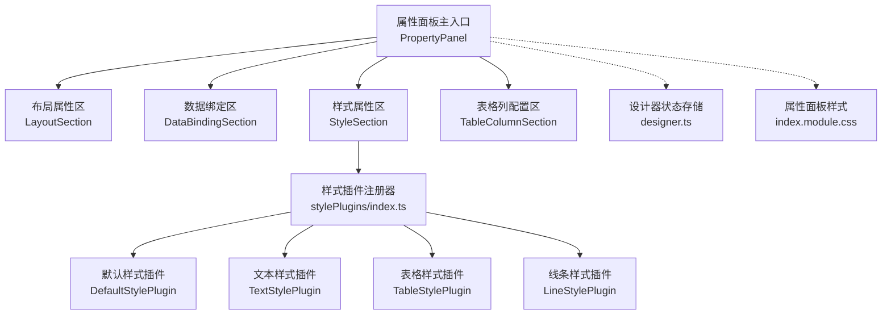
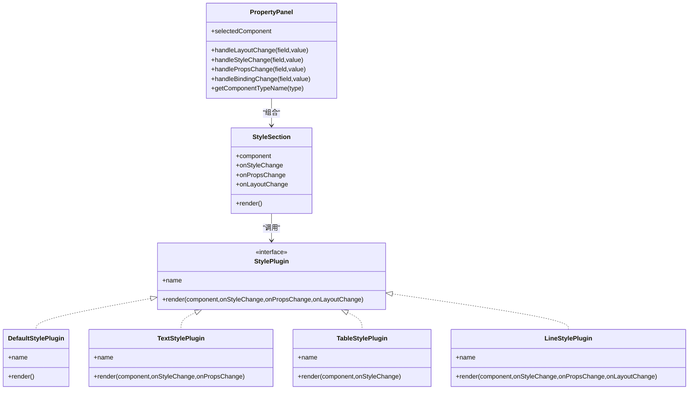
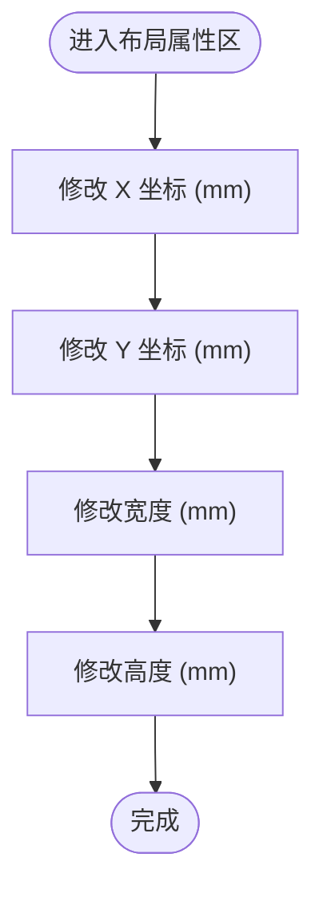
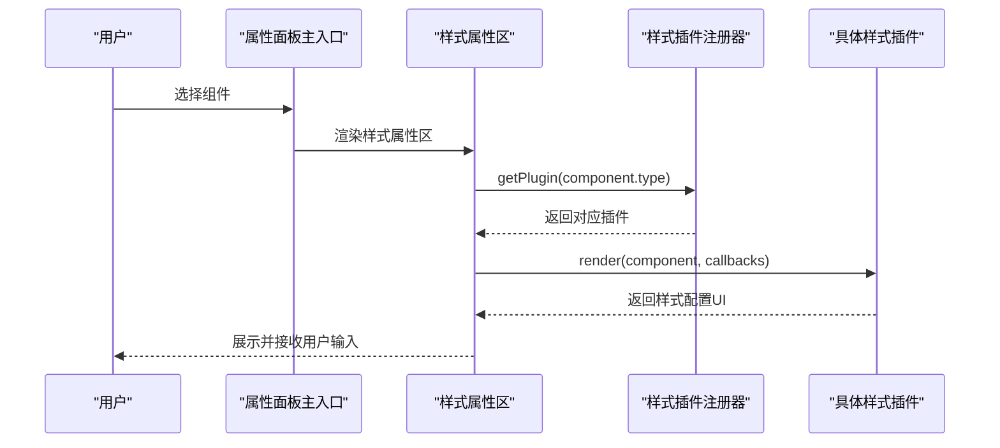
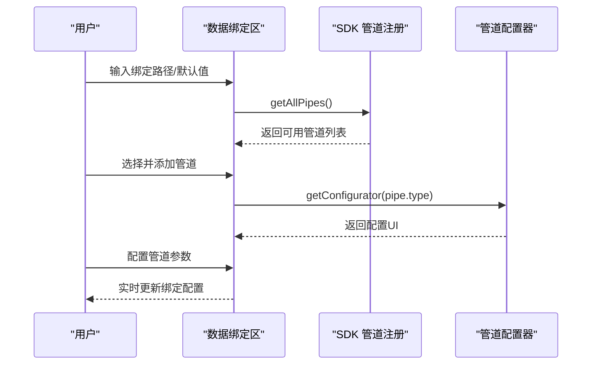
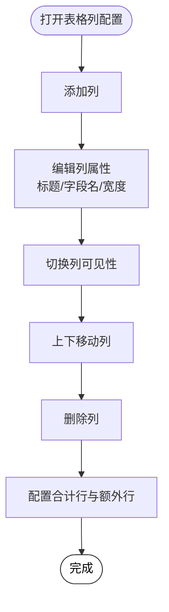
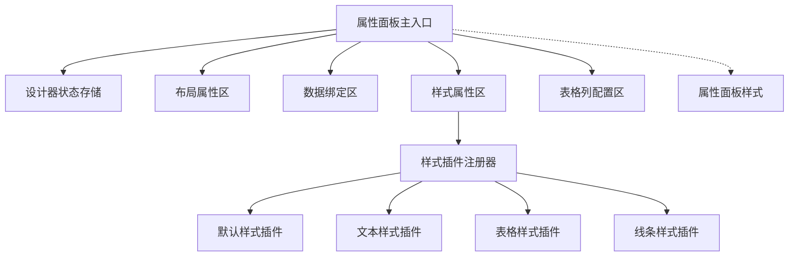

# 属性面板

<cite>
**本文档引用的文件**
- [PropertyPanel 主入口](file://designer/src/pages/Designer/components/PropertyPanel/index.tsx)
- [布局属性区](file://designer/src/pages/Designer/components/PropertyPanel/LayoutSection.tsx)
- [样式属性区](file://designer/src/pages/Designer/components/PropertyPanel/StyleSection.tsx)
- [数据绑定区](file://designer/src/pages/Designer/components/PropertyPanel/DataBindingSection.tsx)
- [表格列配置区](file://designer/src/pages/Designer/components/PropertyPanel/TableColumnSection.tsx)
- [样式插件注册器](file://designer/src/pages/Designer/components/PropertyPanel/stylePlugins/index.ts)
- [样式插件类型定义](file://designer/src/pages/Designer/components/PropertyPanel/stylePlugins/types.ts)
- [默认样式插件](file://designer/src/pages/Designer/components/PropertyPanel/stylePlugins/DefaultStylePlugin.tsx)
- [文本样式插件](file://designer/src/pages/Designer/components/PropertyPanel/stylePlugins/TextStylePlugin.tsx)
- [表格样式插件](file://designer/src/pages/Designer/components/PropertyPanel/stylePlugins/TableStylePlugin.tsx)
- [线条样式插件](file://designer/src/pages/Designer/components/PropertyPanel/stylePlugins/LineStylePlugin.tsx)
- [属性面板样式](file://designer/src/pages/Designer/components/PropertyPanel/index.module.css)
- [设计器状态存储](file://designer/src/store/designer.ts)
- [组件树面板](file://designer/src/pages/Designer/components/ComponentTreePanel/index.tsx)
</cite>

## 目录
1. [简介](#简介)
2. [项目结构](#项目结构)
3. [核心组件](#核心组件)
4. [架构概览](#架构概览)
5. [详细组件分析](#详细组件分析)
6. [依赖关系分析](#依赖关系分析)
7. [性能考量](#性能考量)
8. [故障排查指南](#故障排查指南)
9. [结论](#结论)
10. [附录](#附录)

## 简介
属性面板是打印模板设计器的重要交互区域，负责对画布上选中的组件进行属性配置。它包含三大核心功能模块：
- 布局属性配置：控制组件在页面上的位置与尺寸（X/Y坐标、宽高）。
- 样式属性设置：通过插件化机制为不同组件提供定制化的样式配置界面（默认样式、文本样式、表格样式、线条样式）。
- 数据绑定配置：为需要展示数据的组件配置数据源路径、默认值以及数据管道（Pipes）。

此外，针对表格组件，属性面板还提供完整的列配置能力，包括动态增删列、列宽调整、列属性设置、合计行与额外行配置等。属性面板采用响应式设计，结合表单验证与错误提示，确保用户在配置过程中的体验与准确性。

## 项目结构
属性面板位于设计器页面的右侧，由多个子区域组成，并通过样式插件系统实现组件样式的差异化配置。整体采用“主入口 + 子区域 + 插件系统”的分层结构，职责清晰、扩展性强。

图表来源
- [PropertyPanel 主入口:17-149](file://designer/src/pages/Designer/components/PropertyPanel/index.tsx#L17-L149)
- [样式插件注册器:31-51](file://designer/src/pages/Designer/components/PropertyPanel/stylePlugins/index.ts#L31-L51)

章节来源
- [PropertyPanel 主入口:17-149](file://designer/src/pages/Designer/components/PropertyPanel/index.tsx#L17-L149)
- [属性面板样式:1-60](file://designer/src/pages/Designer/components/PropertyPanel/index.module.css#L1-L60)

## 核心组件
- 布局属性区：提供 X/Y 坐标与宽高的数值输入控件，支持精度与步长配置，便于精确排版。
- 数据绑定区：支持绑定路径、默认值、数据管道（Pipes）的添加、移除与参数配置，提供直观的可视化配置界面。
- 样式属性区：通过插件化机制根据组件类型动态加载对应样式插件，实现统一的样式配置入口。
- 表格列配置区：面向表格组件，提供列的增删、排序、可见性切换、标题与字段名设置、列宽限制与校验、合计配置与额外行等完整能力。

章节来源
- [布局属性区:17-73](file://designer/src/pages/Designer/components/PropertyPanel/LayoutSection.tsx#L17-L73)
- [数据绑定区:20-125](file://designer/src/pages/Designer/components/PropertyPanel/DataBindingSection.tsx#L20-L125)
- [样式属性区:17-33](file://designer/src/pages/Designer/components/PropertyPanel/StyleSection.tsx#L17-L33)
- [表格列配置区:22-170](file://designer/src/pages/Designer/components/PropertyPanel/TableColumnSection.tsx#L22-L170)

## 架构概览
属性面板采用“主入口 + 子区域 + 插件系统”的架构，主入口负责装配各子区域并协调状态更新；子区域各自封装特定功能；插件系统以组件类型为键，提供可插拔的样式配置界面。

图表来源
- [PropertyPanel 主入口:17-149](file://designer/src/pages/Designer/components/PropertyPanel/index.tsx#L17-L149)
- [样式属性区:17-33](file://designer/src/pages/Designer/components/PropertyPanel/StyleSection.tsx#L17-L33)
- [样式插件类型定义:11-30](file://designer/src/pages/Designer/components/PropertyPanel/stylePlugins/types.ts#L11-L30)
- [默认样式插件:9-15](file://designer/src/pages/Designer/components/PropertyPanel/stylePlugins/DefaultStylePlugin.tsx#L9-L15)
- [文本样式插件:11-85](file://designer/src/pages/Designer/components/PropertyPanel/stylePlugins/TextStylePlugin.tsx#L11-L85)
- [表格样式插件:11-47](file://designer/src/pages/Designer/components/PropertyPanel/stylePlugins/TableStylePlugin.tsx#L11-L47)
- [线条样式插件:11-71](file://designer/src/pages/Designer/components/PropertyPanel/stylePlugins/LineStylePlugin.tsx#L11-L71)

## 详细组件分析

### 布局属性配置
布局属性区提供组件在页面上的位置与尺寸控制，支持毫米单位的数值输入，具备精度与步长控制，确保排版的精细调节。

图表来源
- [布局属性区:17-73](file://designer/src/pages/Designer/components/PropertyPanel/LayoutSection.tsx#L17-L73)

章节来源
- [布局属性区:17-73](file://designer/src/pages/Designer/components/PropertyPanel/LayoutSection.tsx#L17-L73)

### 样式属性设置（插件化）
样式属性区通过插件注册器根据组件类型动态选择对应的样式插件，实现“所见即所得”的样式配置体验。插件系统支持以下内置插件：
- 默认样式插件：适用于装饰性组件（如图片、二维码、条形码、矩形），无需额外样式配置。
- 文本样式插件：提供标签、静态文本、字体大小、字重、对齐方式、字体颜色等配置。
- 表格样式插件：提供表格内容字体大小与对齐方式配置。
- 线条样式插件：提供线条高度、样式（实线/虚线/点线）、颜色等配置，并在高度变化时同步更新布局高度。

图表来源
- [PropertyPanel 主入口:17-149](file://designer/src/pages/Designer/components/PropertyPanel/index.tsx#L17-L149)
- [样式属性区:17-33](file://designer/src/pages/Designer/components/PropertyPanel/StyleSection.tsx#L17-L33)
- [样式插件注册器:31-51](file://designer/src/pages/Designer/components/PropertyPanel/stylePlugins/index.ts#L31-L51)

章节来源
- [样式属性区:17-33](file://designer/src/pages/Designer/components/PropertyPanel/StyleSection.tsx#L17-L33)
- [样式插件注册器:31-51](file://designer/src/pages/Designer/components/PropertyPanel/stylePlugins/index.ts#L31-L51)
- [默认样式插件:9-15](file://designer/src/pages/Designer/components/PropertyPanel/stylePlugins/DefaultStylePlugin.tsx#L9-L15)
- [文本样式插件:11-85](file://designer/src/pages/Designer/components/PropertyPanel/stylePlugins/TextStylePlugin.tsx#L11-L85)
- [表格样式插件:11-47](file://designer/src/pages/Designer/components/PropertyPanel/stylePlugins/TableStylePlugin.tsx#L11-L47)
- [线条样式插件:11-71](file://designer/src/pages/Designer/components/PropertyPanel/stylePlugins/LineStylePlugin.tsx#L11-L71)

### 数据绑定配置
数据绑定区为文本、图片、二维码、条形码、表格等组件提供数据绑定能力，支持：
- 绑定路径：支持 JSON 路径语法，可从数据资产面板拖拽。
- 默认值：当数据为空、null 或 undefined 时的回退显示。
- 数据管道（Pipes）：按顺序执行的数据格式化工具，如日期格式化、大小写转换、货币与中文大写等。每个管道可配置参数并通过可视化配置器呈现。

图表来源
- [数据绑定区:20-125](file://designer/src/pages/Designer/components/PropertyPanel/DataBindingSection.tsx#L20-L125)

章节来源
- [数据绑定区:20-125](file://designer/src/pages/Designer/components/PropertyPanel/DataBindingSection.tsx#L20-L125)

### 表格列配置（动态增删、列宽调整、列属性设置）
表格列配置区提供完整的表格列管理能力，包括：
- 列的动态添加与删除、上下移动排序、可见性切换。
- 列标题与数据字段名（dataIndex）设置。
- 列宽调整与总宽度校验，防止超出表格可用宽度。
- 合计配置：支持聚合类型（求和/平均/最大/最小/计数）、小数位数、前缀/后缀、管道转换。
- 合计额外行：支持多行额外信息，每行可包含多个数据项，支持引用合计列与管道转换。

图表来源
- [表格列配置区:22-170](file://designer/src/pages/Designer/components/PropertyPanel/TableColumnSection.tsx#L22-L170)

章节来源
- [表格列配置区:22-170](file://designer/src/pages/Designer/components/PropertyPanel/TableColumnSection.tsx#L22-L170)

## 依赖关系分析
属性面板与设计器状态存储紧密耦合，所有属性变更最终通过状态存储的更新函数生效，保证历史记录与撤销重做功能的一致性。

图表来源
- [PropertyPanel 主入口:17-149](file://designer/src/pages/Designer/components/PropertyPanel/index.tsx#L17-L149)
- [设计器状态存储:126-137](file://designer/src/store/designer.ts#L126-L137)

章节来源
- [PropertyPanel 主入口:17-149](file://designer/src/pages/Designer/components/PropertyPanel/index.tsx#L17-L149)
- [设计器状态存储:126-137](file://designer/src/store/designer.ts#L126-L137)

## 性能考量
- 插件化渲染：样式属性区通过插件渲染，避免在主入口中堆积大量条件分支，提升渲染效率与可维护性。
- 状态更新原子化：属性变更通过状态存储的更新函数统一处理，减少不必要的重渲染。
- 表格列宽校验：在列宽输入时进行实时校验，避免无效配置导致的布局异常与后续渲染开销。
- 响应式布局：使用 CSS Grid 实现两列自适应布局，减少复杂计算与重排。

## 故障排查指南
- 未选中组件：若未在画布中选择任何组件，属性面板会显示空状态与提示信息，此时无法进行属性配置。
- 样式插件缺失：当组件类型未注册对应样式插件时，将回退到默认插件（通常不显示样式配置），请检查插件注册逻辑。
- 数据绑定路径无效：绑定路径应符合 JSON 路径语法规则，建议从数据资产面板拖拽以确保正确性。
- 表格列宽溢出：当列宽总和超过表格可用宽度时，输入框会标记为错误状态并提示超限原因，请适当调整列宽或隐藏部分列。
- 线条高度与布局高度不一致：线条样式插件在调整高度时会同步更新布局高度，若出现不一致，请确认是否通过插件提供的输入控件进行修改。

章节来源
- [PropertyPanel 主入口:25-37](file://designer/src/pages/Designer/components/PropertyPanel/index.tsx#L25-L37)
- [样式插件注册器:31-38](file://designer/src/pages/Designer/components/PropertyPanel/stylePlugins/index.ts#L31-L38)
- [表格列配置区:526-549](file://designer/src/pages/Designer/components/PropertyPanel/TableColumnSection.tsx#L526-L549)
- [线条样式插件:14-24](file://designer/src/pages/Designer/components/PropertyPanel/stylePlugins/LineStylePlugin.tsx#L14-L24)

## 结论
属性面板通过清晰的模块划分与插件化架构，实现了对布局、样式与数据绑定的全面配置能力。其响应式设计与完善的表单校验机制提升了用户体验，而针对表格组件的深度配置能力则满足了复杂报表场景的需求。建议在实际使用中遵循最佳实践，合理利用数据管道与样式插件，以获得更高效、稳定的模板设计体验。

## 附录
- 最佳实践
  - 在进行布局调整时，优先使用毫米单位并结合网格对齐工具，确保排版一致性。
  - 使用数据绑定时，尽量从数据资产面板拖拽路径，减少手输错误。
  - 表格列宽建议预留一定余量，避免因内容变化导致溢出。
  - 合计行与额外行的配置应与业务需求保持一致，避免冗余信息影响阅读。
- 常见问题
  - 未显示样式配置：确认组件类型是否已注册对应样式插件。
  - 数据不显示：检查绑定路径、默认值与数据管道配置。
  - 表格列宽无法保存：检查是否超出表格可用宽度，必要时隐藏列或调整其他列宽。