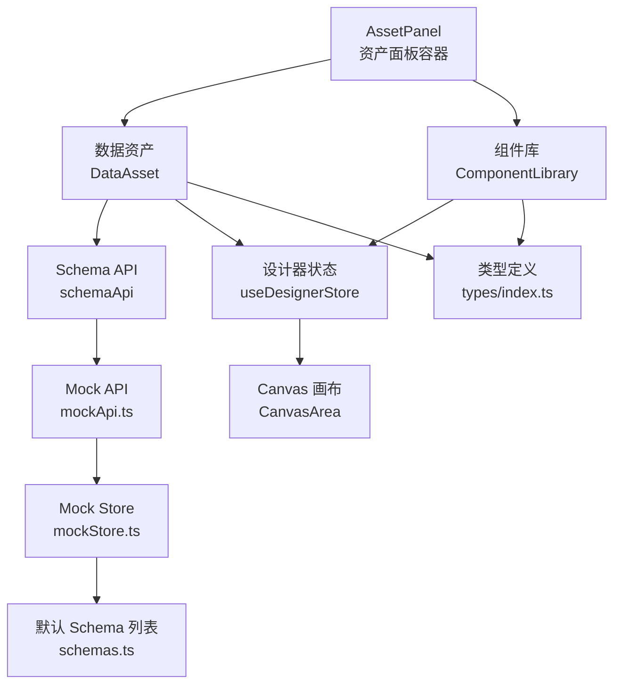
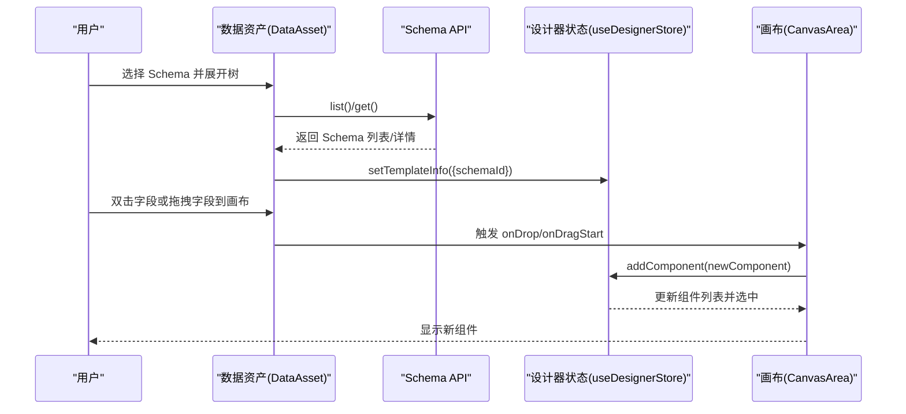
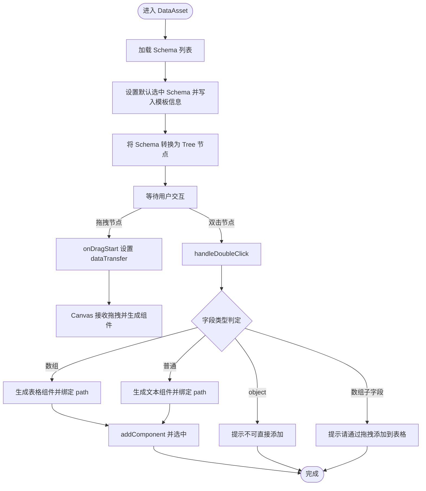
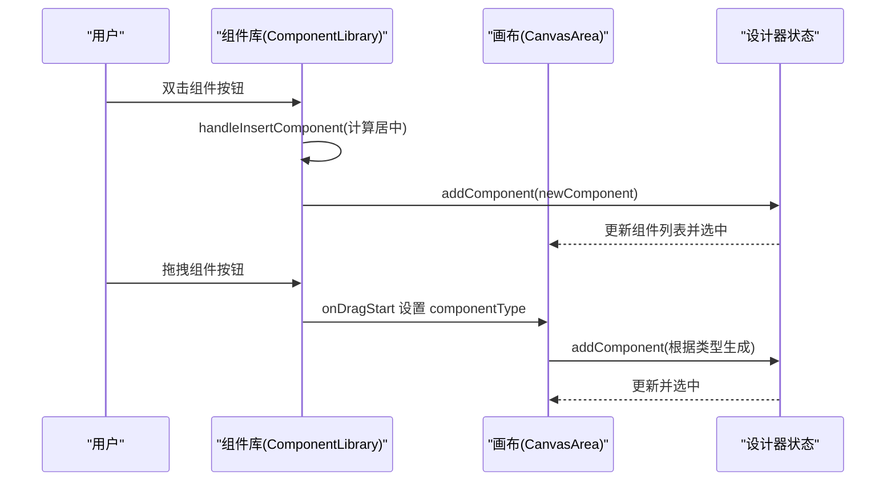
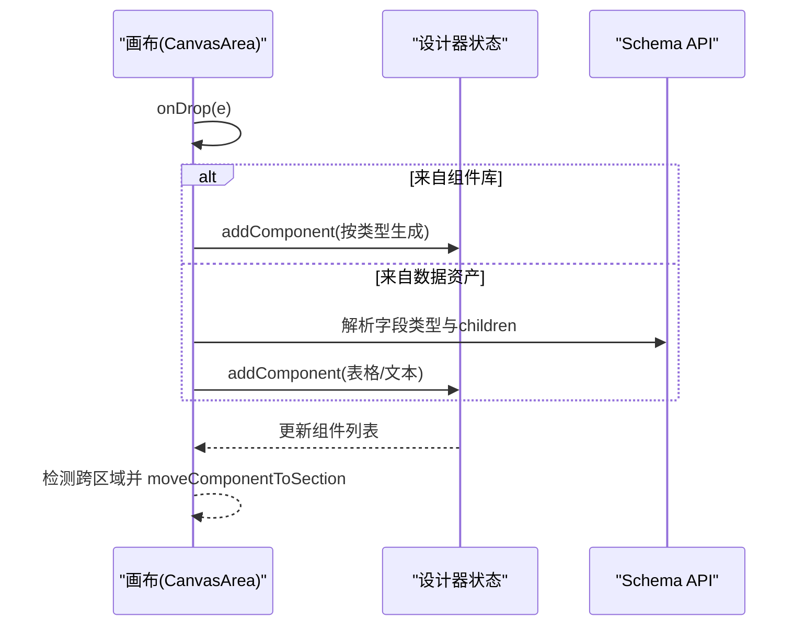
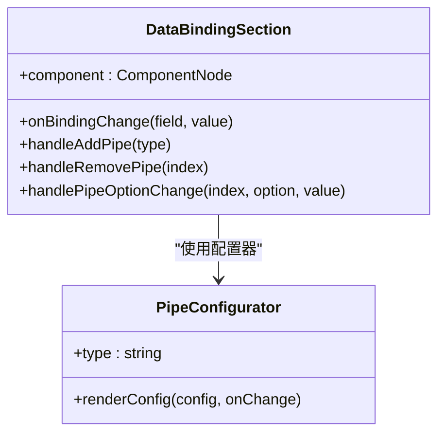
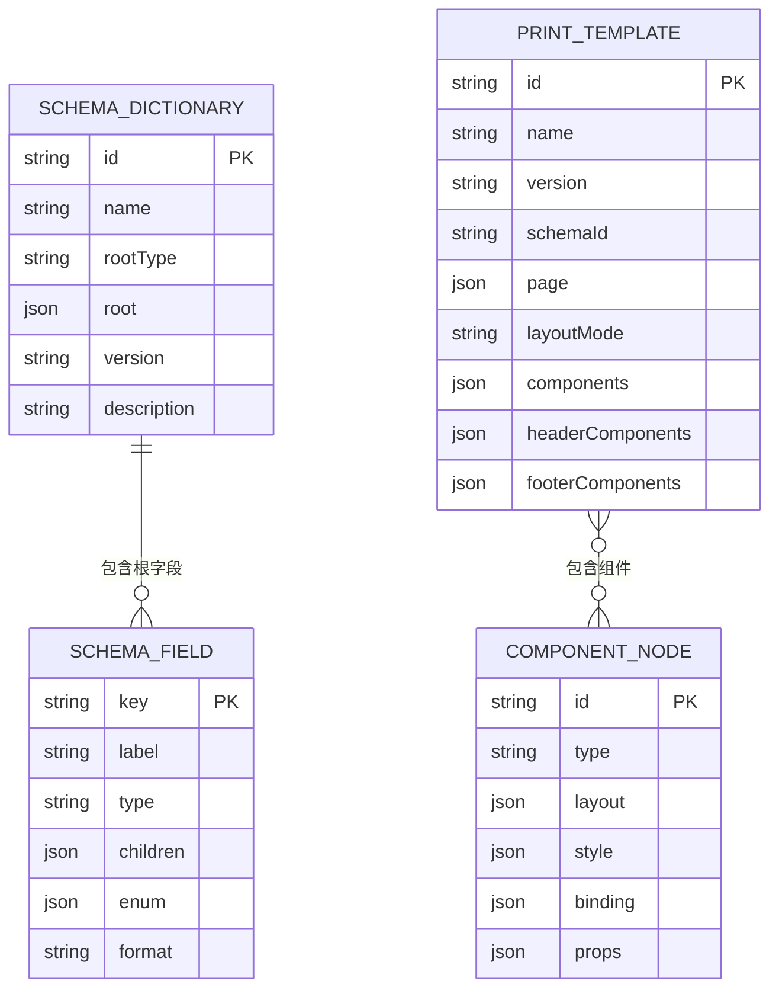
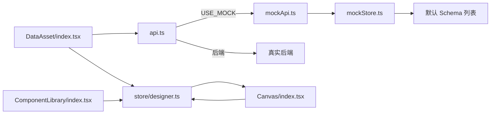

# 数据资产面板

<cite>
**本文引用的文件**
- [AssetPanel/index.tsx](file://designer/src/pages/Designer/components/AssetPanel/index.tsx)
- [DataAsset/index.tsx](file://designer/src/pages/Designer/components/AssetPanel/DataAsset/index.tsx)
- [ComponentLibrary/index.tsx](file://designer/src/pages/Designer/components/AssetPanel/ComponentLibrary/index.tsx)
- [types/index.ts](file://designer/src/types/index.ts)
- [store/designer.ts](file://designer/src/store/designer.ts)
- [api.ts](file://designer/src/services/api.ts)
- [mockApi.ts](file://designer/src/services/mockApi.ts)
- [mockStore.ts](file://designer/src/services/mockStore.ts)
- [schemas.ts](file://designer/src/services/mock/schemas.ts)
- [Canvas/index.tsx](file://designer/src/pages/Designer/components/Canvas/index.tsx)
- [DataBindingSection.tsx](file://designer/src/pages/Designer/components/PropertyPanel/DataBindingSection.tsx)
- [configurators/index.tsx](file://designer/src/pipes/configurators/index.tsx)
</cite>

## 目录
1. [简介](#简介)
2. [项目结构](#项目结构)
3. [核心组件](#核心组件)
4. [架构总览](#架构总览)
5. [详细组件分析](#详细组件分析)
6. [依赖分析](#依赖分析)
7. [性能考量](#性能考量)
8. [故障排查指南](#故障排查指南)
9. [结论](#结论)
10. [附录](#附录)

## 简介
本文件面向“数据资产面板”的功能与实现，围绕以下目标展开：
- 组件库的分类管理与拖拽到画布的实现机制
- 数据资产的管理能力：Schema 字典的导入导出、字段类型展示、数据预览
- 组件库的搜索过滤、分组显示、快速查找的技术实现
- 数据资产的版本管理、历史记录、批量操作功能
- 组件库与 Schema 字典的关联机制、数据绑定的自动提示功能
- 数据资产管理的最佳实践与使用技巧

## 项目结构
数据资产面板位于设计器页面的左侧资产面板中，由“数据资产”和“组件库”两个 Tab 组成。二者共享统一的状态管理与画布交互。

图表来源
- [AssetPanel/index.tsx:1-32](file://designer/src/pages/Designer/components/AssetPanel/index.tsx#L1-L32)
- [DataAsset/index.tsx:13-15](file://designer/src/pages/Designer/components/AssetPanel/DataAsset/index.tsx#L13-L15)
- [ComponentLibrary/index.tsx:11-13](file://designer/src/pages/Designer/components/AssetPanel/ComponentLibrary/index.tsx#L11-L13)
- [store/designer.ts:108-125](file://designer/src/store/designer.ts#L108-L125)
- [api.ts:131-134](file://designer/src/services/api.ts#L131-L134)
- [mockApi.ts:19-42](file://designer/src/services/mockApi.ts#L19-L42)
- [mockStore.ts:29-60](file://designer/src/services/mockStore.ts#L29-L60)
- [schemas.ts:6-146](file://designer/src/services/mock/schemas.ts#L6-L146)

章节来源
- [AssetPanel/index.tsx:1-32](file://designer/src/pages/Designer/components/AssetPanel/index.tsx#L1-L32)

## 核心组件
- 资产面板容器：负责切换“数据资产”和“组件库”两个面板。
- 数据资产面板：展示 Schema 字典树、字段类型图标、双击/拖拽添加到画布、数组子字段的特殊处理。
- 组件库面板：按分类展示组件（基础、装饰、编码），支持双击快速添加与拖拽到画布。
- 设计器状态（Zustand）：统一管理组件列表、选中状态、模板信息、页面配置、撤销/重做、复制/粘贴、层级管理等。
- API 层：根据环境变量动态选择真实后端或前端 Mock 实现，提供 Schema/模板/Mock 数据的 CRUD。

章节来源
- [DataAsset/index.tsx:19-349](file://designer/src/pages/Designer/components/AssetPanel/DataAsset/index.tsx#L19-L349)
- [ComponentLibrary/index.tsx:26-238](file://designer/src/pages/Designer/components/AssetPanel/ComponentLibrary/index.tsx#L26-L238)
- [store/designer.ts:9-90](file://designer/src/store/designer.ts#L9-L90)
- [api.ts:131-134](file://designer/src/services/api.ts#L131-L134)

## 架构总览
数据资产面板与画布之间的交互通过拖拽事件与状态管理完成。Schema 字典通过 API 加载，组件库通过配置化生成默认属性，最终统一由设计器状态写入画布。

图表来源
- [DataAsset/index.tsx:31-46](file://designer/src/pages/Designer/components/AssetPanel/DataAsset/index.tsx#L31-L46)
- [DataAsset/index.tsx:303-343](file://designer/src/pages/Designer/components/AssetPanel/DataAsset/index.tsx#L303-L343)
- [Canvas/index.tsx:281-479](file://designer/src/pages/Designer/components/Canvas/index.tsx#L281-L479)
- [store/designer.ts:113-125](file://designer/src/store/designer.ts#L113-L125)

## 详细组件分析

### 数据资产面板（DataAsset）
- 功能要点
  - 加载 Schema 列表并设置默认选中项，同时写入模板信息（schemaId）。
  - 将 SchemaField 转换为 Ant Design Tree 的 DataNode，支持对象/数组/普通字段的图标与禁用规则。
  - 双击字段：禁止 object 类型与数组子字段直接添加；数组类型生成表格组件；普通字段生成文本组件，并居中放置。
  - 拖拽字段：通过 dataTransfer 传递字段路径、类型、子字段等信息；在画布上根据类型生成组件并绑定数据路径。
  - 数组子字段识别：通过路径解析判断是否为数组的子字段，以禁用拖拽与双击添加。
  - 画布中心位置计算：根据页面尺寸与方向、边距计算组件居中坐标。

图表来源
- [DataAsset/index.tsx:31-46](file://designer/src/pages/Designer/components/AssetPanel/DataAsset/index.tsx#L31-L46)
- [DataAsset/index.tsx:73-130](file://designer/src/pages/Designer/components/AssetPanel/DataAsset/index.tsx#L73-L130)
- [DataAsset/index.tsx:207-287](file://designer/src/pages/Designer/components/AssetPanel/DataAsset/index.tsx#L207-L287)
- [DataAsset/index.tsx:303-343](file://designer/src/pages/Designer/components/AssetPanel/DataAsset/index.tsx#L303-L343)

章节来源
- [DataAsset/index.tsx:19-349](file://designer/src/pages/Designer/components/AssetPanel/DataAsset/index.tsx#L19-L349)

### 组件库面板（ComponentLibrary）
- 功能要点
  - 组件配置：定义组件类型、名称、图标、分类、描述、快捷提示与默认属性工厂。
  - 分类展示：基础组件、装饰组件、编码组件三类，分别渲染按钮卡片。
  - 双击快速添加：检测双击事件，调用插入逻辑并在画布中心生成组件。
  - 拖拽到画布：设置 dataTransfer 的组件类型，交由画布统一处理生成组件。
  - 画布中心位置：根据页面尺寸、方向与边距计算居中坐标。

图表来源
- [ComponentLibrary/index.tsx:152-180](file://designer/src/pages/Designer/components/AssetPanel/ComponentLibrary/index.tsx#L152-L180)
- [ComponentLibrary/index.tsx:219-225](file://designer/src/pages/Designer/components/AssetPanel/ComponentLibrary/index.tsx#L219-L225)
- [Canvas/index.tsx:295-386](file://designer/src/pages/Designer/components/Canvas/index.tsx#L295-L386)
- [store/designer.ts:113-125](file://designer/src/store/designer.ts#L113-L125)

章节来源
- [ComponentLibrary/index.tsx:26-238](file://designer/src/pages/Designer/components/AssetPanel/ComponentLibrary/index.tsx#L26-L238)

### 画布与拖拽交互（CanvasArea）
- 功能要点
  - 接收来自组件库与数据资产的拖拽事件，区分组件类型与字段路径。
  - 根据字段类型生成文本或表格组件，表格组件自动填充列定义并绑定路径。
  - 支持跨区域拖拽：根据鼠标位置判断目标区域（页头/内容/页脚），并进行区域移动。
  - 网格吸附、智能对齐、缩放、键盘快捷键（复制/粘贴/撤销/重做/缩放）等。

图表来源
- [Canvas/index.tsx:281-479](file://designer/src/pages/Designer/components/Canvas/index.tsx#L281-L479)
- [store/designer.ts:469-506](file://designer/src/store/designer.ts#L469-L506)

章节来源
- [Canvas/index.tsx:22-800](file://designer/src/pages/Designer/components/Canvas/index.tsx#L22-L800)

### 数据绑定与自动提示（PropertyPanel.DataBindingSection）
- 功能要点
  - 绑定路径输入：支持 JSON 路径（如 user.name、items.0.title），可从左侧数据资产拖拽。
  - 管道配置：支持多种数据管道（日期、货币、金额、中文大写、切片、默认值等），按顺序执行。
  - 配置器注册：通过注册表动态渲染各管道的配置 UI。

图表来源
- [DataBindingSection.tsx:20-125](file://designer/src/pages/Designer/components/PropertyPanel/DataBindingSection.tsx#L20-L125)
- [configurators/index.tsx:69-84](file://designer/src/pipes/configurators/index.tsx#L69-L84)

章节来源
- [DataBindingSection.tsx:1-128](file://designer/src/pages/Designer/components/PropertyPanel/DataBindingSection.tsx#L1-L128)
- [configurators/index.tsx:1-85](file://designer/src/pipes/configurators/index.tsx#L1-L85)

### 类型与状态模型
- Schema 字典与字段：定义字段键名、标签、类型、子字段、枚举、格式化等。
- 组件节点：包含布局、样式、数据绑定、组件特定属性等。
- 设计器状态：组件列表、选中状态、模板信息、页面配置、历史记录、复制粘贴、层级管理、撤销/重做等。

图表来源
- [types/index.ts:39-52](file://designer/src/types/index.ts#L39-L52)
- [types/index.ts:18-33](file://designer/src/types/index.ts#L18-L33)
- [types/index.ts:303-331](file://designer/src/types/index.ts#L303-L331)
- [types/index.ts:337-358](file://designer/src/types/index.ts#L337-L358)

章节来源
- [types/index.ts:1-378](file://designer/src/types/index.ts#L1-L378)

## 依赖分析
- API 层：根据环境变量选择真实后端或前端 Mock；Mock 层基于内存存储与默认数据。
- 状态层：Zustand 提供全量状态快照，支持撤销/重做；组件增删改查、复制粘贴、层级管理均通过状态更新触发。
- 交互层：数据资产与组件库通过拖拽事件与画布协作；画布负责跨区域移动、网格吸附、智能对齐等。

图表来源
- [api.ts:13-20](file://designer/src/services/api.ts#L13-L20)
- [api.ts:131-134](file://designer/src/services/api.ts#L131-L134)
- [mockApi.ts:19-42](file://designer/src/services/mockApi.ts#L19-L42)
- [mockStore.ts:29-60](file://designer/src/services/mockStore.ts#L29-L60)
- [schemas.ts:6-146](file://designer/src/services/mock/schemas.ts#L6-L146)
- [store/designer.ts:108-125](file://designer/src/store/designer.ts#L108-L125)

章节来源
- [api.ts:1-134](file://designer/src/services/api.ts#L1-L134)
- [mockApi.ts:1-103](file://designer/src/services/mockApi.ts#L1-L103)
- [mockStore.ts:1-135](file://designer/src/services/mockStore.ts#L1-L135)
- [schemas.ts:1-147](file://designer/src/services/mock/schemas.ts#L1-L147)
- [store/designer.ts:1-773](file://designer/src/store/designer.ts#L1-L773)

## 性能考量
- 撤销/重做：全量状态快照最多保存 20 步，避免内存膨胀；每次操作生成快照并裁剪历史队列。
- 网格吸附与智能对齐：在拖拽过程中按需计算，避免不必要的重绘；对齐检测阈值与缩放系数合理设置。
- 组件渲染：Ant Design Tree 与按钮卡片均采用受控渲染，尽量减少无关节点更新。
- API 调用：Mock 模式下使用微延迟模拟网络，避免阻塞主线程；生产环境建议开启缓存与节流。

## 故障排查指南
- 无法加载 Schema 列表
  - 检查环境变量 USE_MOCK 与 API 基础地址；确认 MockStore 中默认 Schema 是否存在。
  - 参考路径：[api.ts:13-20](file://designer/src/services/api.ts#L13-L20)，[mockStore.ts:29-60](file://designer/src/services/mockStore.ts#L29-L60)，[schemas.ts:6-146](file://designer/src/services/mock/schemas.ts#L6-L146)
- 拖拽到画布无响应
  - 确认 dataTransfer 是否正确设置字段路径/类型/子字段；检查画布 onDrop 逻辑与组件类型限制。
  - 参考路径：[DataAsset/index.tsx:325-342](file://designer/src/pages/Designer/components/AssetPanel/DataAsset/index.tsx#L325-L342)，[Canvas/index.tsx:295-479](file://designer/src/pages/Designer/components/Canvas/index.tsx#L295-L479)
- 表格组件被拖入页头/页脚
  - 画布已拦截表格组件放入非内容区域，检查区域移动逻辑与 moveComponentToSection。
  - 参考路径：[Canvas/index.tsx:298-302](file://designer/src/pages/Designer/components/Canvas/index.tsx#L298-L302)，[store/designer.ts:469-506](file://designer/src/store/designer.ts#L469-L506)
- 撤销/重做无效
  - 确认历史索引与队列长度；检查 saveHistory 与 canUndo/canRedo。
  - 参考路径：[store/designer.ts:92-106](file://designer/src/store/designer.ts#L92-L106)，[store/designer.ts:509-548](file://designer/src/store/designer.ts#L509-L548)

章节来源
- [api.ts:13-20](file://designer/src/services/api.ts#L13-L20)
- [mockStore.ts:29-60](file://designer/src/services/mockStore.ts#L29-L60)
- [schemas.ts:6-146](file://designer/src/services/mock/schemas.ts#L6-L146)
- [DataAsset/index.tsx:325-342](file://designer/src/pages/Designer/components/AssetPanel/DataAsset/index.tsx#L325-L342)
- [Canvas/index.tsx:295-302](file://designer/src/pages/Designer/components/Canvas/index.tsx#L295-L302)
- [store/designer.ts:92-106](file://designer/src/store/designer.ts#L92-L106)
- [store/designer.ts:509-548](file://designer/src/store/designer.ts#L509-L548)

## 结论
数据资产面板通过“Schema 字典 + 组件库”的协同，实现了从数据模型到可视化组件的高效映射。借助统一的状态管理与画布交互，用户可以快速完成数据绑定、组件布局与模板生成。Mock 模式与类型定义保证了开发体验与扩展性，未来可在 API 层引入版本管理与批量操作接口，进一步完善数据资产管理能力。

## 附录
- 最佳实践
  - 使用 Schema 字典统一管理数据模型，避免硬编码字段。
  - 优先使用拖拽而非手动输入绑定路径，降低错误率。
  - 合理使用数据管道对字段进行格式化（日期、货币、中文大写等）。
  - 利用撤销/重做与网格吸附提升设计效率。
- 使用技巧
  - 双击快速添加组件或字段；拖拽精确放置到画布。
  - 使用快捷键：复制(Ctrl+C)/粘贴(Ctrl+V)/撤销(Ctrl+Z)/重做(Ctrl+Shift+Z)/缩放(Ctrl+/0)。
  - 表格组件自动根据数组字段生成列定义，减少手工配置。