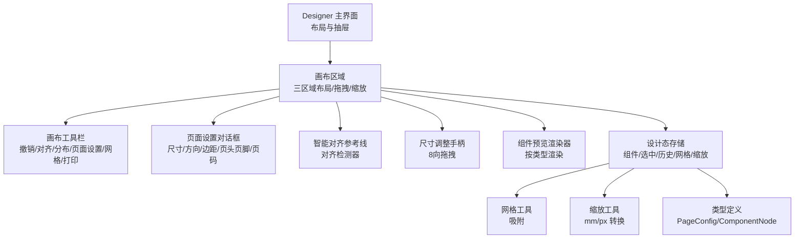
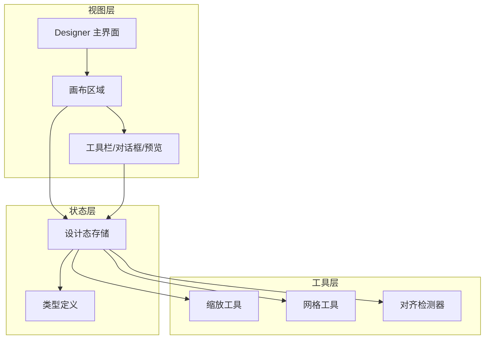
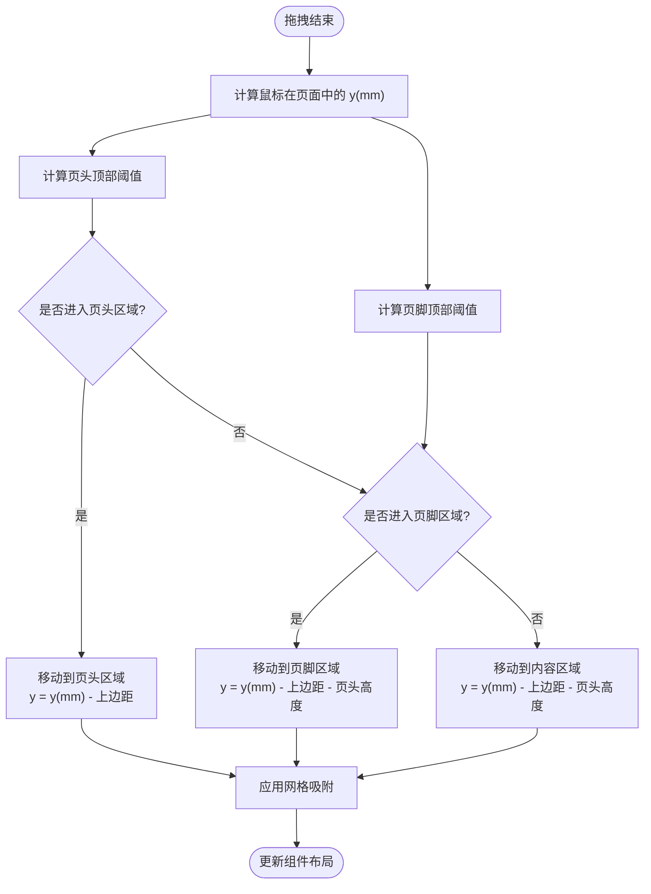
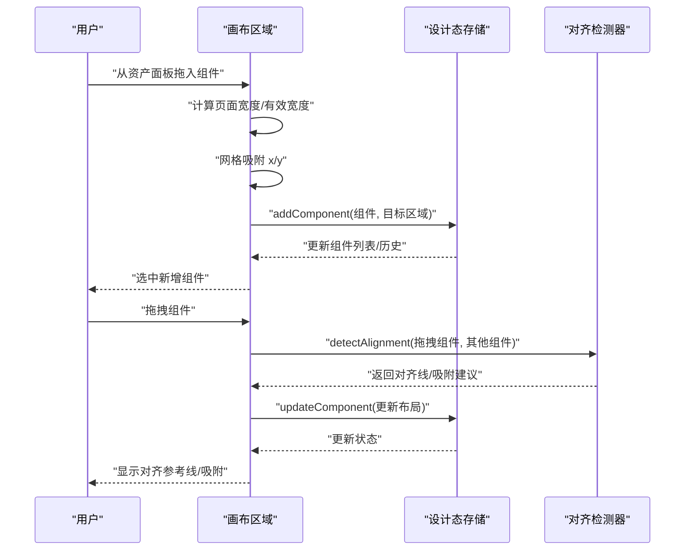
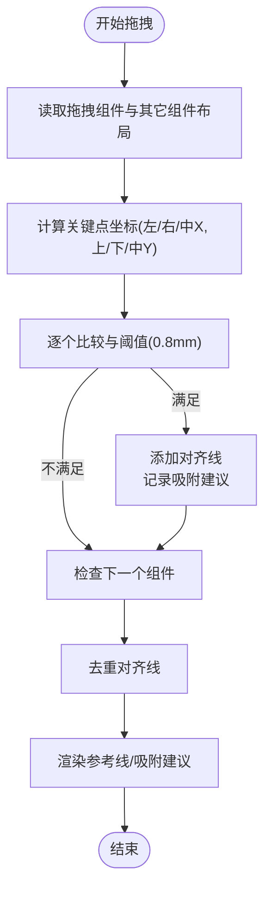
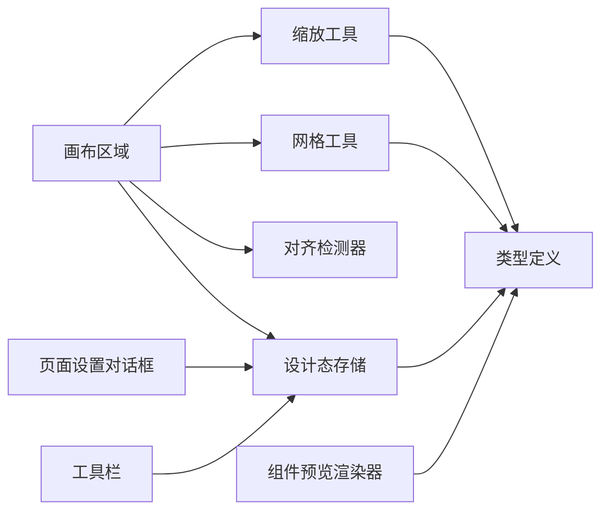

# 画布编辑器

<cite>
**本文引用的文件**
- [Designer 主界面](file://designer/src/pages/Designer/index.tsx)
- [画布区域](file://designer/src/pages/Designer/components/Canvas/index.tsx)
- [画布工具栏](file://designer/src/pages/Designer/components/Canvas/CanvasToolbar.tsx)
- [页面设置对话框](file://designer/src/pages/Designer/components/Canvas/PageSettingModal.tsx)
- [智能对齐参考线](file://designer/src/pages/Designer/components/Canvas/AlignmentGuides.tsx)
- [对齐检测器](file://designer/src/pages/Designer/components/Canvas/alignmentDetector.ts)
- [网格工具](file://designer/src/utils/grid.ts)
- [缩放工具](file://designer/src/utils/zoom.ts)
- [设计态存储](file://designer/src/store/designer.ts)
- [类型定义](file://designer/src/types/index.ts)
- [CSS 样式](file://designer/src/pages/Designer/components/Canvas/index.module.css)
- [组件预览渲染器](file://designer/src/pages/Designer/components/Canvas/ComponentPreview.tsx)
- [尺寸调整手柄](file://designer/src/pages/Designer/components/Canvas/ResizeHandles.tsx)
- [常量定义](file://designer/src/constants/index.ts)
</cite>

## 目录
1. [引言](#引言)
2. [项目结构](#项目结构)
3. [核心组件](#核心组件)
4. [架构总览](#架构总览)
5. [详细组件分析](#详细组件分析)
6. [依赖分析](#依赖分析)
7. [性能考量](#性能考量)
8. [故障排查指南](#故障排查指南)
9. [结论](#结论)
10. [附录](#附录)

## 引言
本文件面向画布编辑器的使用者与开发者，系统性阐述三区域画布系统（页头/内容/页脚）的设计架构与渲染机制，详解组件拖拽、缩放、旋转等交互实现原理，深入解析智能网格吸附系统（含 Shift 临时禁用机制与对齐参考线自动检测算法），并覆盖组件预览模式、实时预览与打印的技术实现、画布工具栏功能按钮与快捷键支持、页面设置对话框配置项，以及最佳实践与性能优化建议。

## 项目结构
- 设计器主界面负责布局三栏（左侧资产面板、中央画布、右侧属性/树面板）、悬浮缩放控件、抽屉调试面板与模板加载。
- 画布区域承载三区域布局、拖拽放置、组件选择与多选、对齐与分布、网格与吸附、尺寸调整、区域手柄、上下文菜单、键盘快捷键、预览与打印入口。
- 工具栏提供撤销/重做、对齐、分布、页面设置、网格切换、快速打印、保存与重置等操作。
- 页面设置对话框支持纸张尺寸、方向、边距、页头/页脚开关与高度、页码显示配置。
- 对齐检测器与参考线组件共同实现智能对齐吸附与可视化提示。
- 缩放与网格工具提供统一的 mm↔px 转换与吸附策略。
- 设计态存储集中管理组件集合、选中状态、历史记录、网格与缩放、区域移动与对齐分布等。
- 类型定义规范页面配置、组件节点与打印模板结构。
- CSS 样式定义画布容器、网格背景、组件选中/拖拽/越界态等视觉反馈。

图表来源
- [Designer 主界面:1-365](file://designer/src/pages/Designer/index.tsx#L1-L365)
- [画布区域:1-800](file://designer/src/pages/Designer/components/Canvas/index.tsx#L1-L800)
- [画布工具栏:1-166](file://designer/src/pages/Designer/components/Canvas/CanvasToolbar.tsx#L1-L166)
- [页面设置对话框:1-357](file://designer/src/pages/Designer/components/Canvas/PageSettingModal.tsx#L1-L357)
- [智能对齐参考线:1-66](file://designer/src/pages/Designer/components/Canvas/AlignmentGuides.tsx#L1-L66)
- [对齐检测器:1-127](file://designer/src/pages/Designer/components/Canvas/alignmentDetector.ts#L1-L127)
- [尺寸调整手柄:1-203](file://designer/src/pages/Designer/components/Canvas/ResizeHandles.tsx#L1-L203)
- [组件预览渲染器:1-53](file://designer/src/pages/Designer/components/Canvas/ComponentPreview.tsx#L1-L53)
- [设计态存储:1-773](file://designer/src/store/designer.ts#L1-L773)
- [网格工具:1-36](file://designer/src/utils/grid.ts#L1-L36)
- [缩放工具:1-72](file://designer/src/utils/zoom.ts#L1-L72)
- [类型定义:1-378](file://designer/src/types/index.ts#L1-L378)

章节来源
- [Designer 主界面:1-365](file://designer/src/pages/Designer/index.tsx#L1-L365)
- [画布区域:1-800](file://designer/src/pages/Designer/components/Canvas/index.tsx#L1-L800)
- [画布工具栏:1-166](file://designer/src/pages/Designer/components/Canvas/CanvasToolbar.tsx#L1-L166)
- [页面设置对话框:1-357](file://designer/src/pages/Designer/components/Canvas/PageSettingModal.tsx#L1-L357)
- [智能对齐参考线:1-66](file://designer/src/pages/Designer/components/Canvas/AlignmentGuides.tsx#L1-L66)
- [对齐检测器:1-127](file://designer/src/pages/Designer/components/Canvas/alignmentDetector.ts#L1-L127)
- [尺寸调整手柄:1-203](file://designer/src/pages/Designer/components/Canvas/ResizeHandles.tsx#L1-L203)
- [组件预览渲染器:1-53](file://designer/src/pages/Designer/components/Canvas/ComponentPreview.tsx#L1-L53)
- [设计态存储:1-773](file://designer/src/store/designer.ts#L1-L773)
- [网格工具:1-36](file://designer/src/utils/grid.ts#L1-L36)
- [缩放工具:1-72](file://designer/src/utils/zoom.ts#L1-L72)
- [类型定义:1-378](file://designer/src/types/index.ts#L1-L378)

## 核心组件
- 三区域画布系统
  - 页头/内容/页脚三大区域，支持独立开关与高度配置，连续纸模式下页头/页脚禁用。
  - 区域内组件支持绝对定位布局，坐标与尺寸以毫米为单位，统一通过缩放工具转换为像素渲染。
- 组件拖拽
  - 支持组件拖拽创建与从资产面板/数据资产面板拖入，拖拽过程中应用网格吸附与智能对齐参考线。
  - 支持跨区域拖拽移动，自动约束到目标区域坐标系。
- 缩放与网格
  - 支持固定缩放级别（25%/50%/75%/100%/125%/150%/200%），提供放大/缩小/重置。
  - 网格吸附以毫米为粒度，可按住 Shift 临时禁用吸附。
- 智能对齐
  - 拖拽时检测与相邻组件的对齐关系，提供垂直/水平参考线与吸附建议，吸附阈值约 3px。
- 尺寸调整
  - 8个手柄支持四角与四边拖拽，最小尺寸限制为 5mm，并在页面范围内约束。
- 工具栏与快捷键
  - 工具栏提供撤销/重做、对齐/分布、页面设置、网格开关、快速打印、保存与重置。
  - 键盘快捷键覆盖删除、复制/粘贴/克隆、撤销/重做、缩放、全屏等常用操作。
- 预览与打印
  - 组件预览渲染器按类型渲染，工具栏提供“测试打印”入口，主界面提供悬浮缩放控件与抽屉调试面板。

章节来源
- [画布区域:1-800](file://designer/src/pages/Designer/components/Canvas/index.tsx#L1-L800)
- [画布工具栏:1-166](file://designer/src/pages/Designer/components/Canvas/CanvasToolbar.tsx#L1-L166)
- [页面设置对话框:1-357](file://designer/src/pages/Designer/components/Canvas/PageSettingModal.tsx#L1-L357)
- [智能对齐参考线:1-66](file://designer/src/pages/Designer/components/Canvas/AlignmentGuides.tsx#L1-L66)
- [对齐检测器:1-127](file://designer/src/pages/Designer/components/Canvas/alignmentDetector.ts#L1-L127)
- [尺寸调整手柄:1-203](file://designer/src/pages/Designer/components/Canvas/ResizeHandles.tsx#L1-L203)
- [组件预览渲染器:1-53](file://designer/src/pages/Designer/components/Canvas/ComponentPreview.tsx#L1-L53)
- [设计态存储:1-773](file://designer/src/store/designer.ts#L1-L773)
- [缩放工具:1-72](file://designer/src/utils/zoom.ts#L1-L72)
- [网格工具:1-36](file://designer/src/utils/grid.ts#L1-L36)

## 架构总览
画布编辑器采用“视图层 + 工具层 + 状态层”的分层架构：
- 视图层：Designer 主界面与画布区域负责布局、渲染与用户交互。
- 工具层：缩放与网格工具提供统一的 mm/px 转换与吸附策略。
- 状态层：设计态存储集中管理组件集合、选中状态、历史记录、页面配置与行为动作。

图表来源
- [Designer 主界面:1-365](file://designer/src/pages/Designer/index.tsx#L1-L365)
- [画布区域:1-800](file://designer/src/pages/Designer/components/Canvas/index.tsx#L1-L800)
- [画布工具栏:1-166](file://designer/src/pages/Designer/components/Canvas/CanvasToolbar.tsx#L1-L166)
- [页面设置对话框:1-357](file://designer/src/pages/Designer/components/Canvas/PageSettingModal.tsx#L1-L357)
- [智能对齐参考线:1-66](file://designer/src/pages/Designer/components/Canvas/AlignmentGuides.tsx#L1-L66)
- [对齐检测器:1-127](file://designer/src/pages/Designer/components/Canvas/alignmentDetector.ts#L1-L127)
- [尺寸调整手柄:1-203](file://designer/src/pages/Designer/components/Canvas/ResizeHandles.tsx#L1-L203)
- [组件预览渲染器:1-53](file://designer/src/pages/Designer/components/Canvas/ComponentPreview.tsx#L1-L53)
- [设计态存储:1-773](file://designer/src/store/designer.ts#L1-L773)
- [缩放工具:1-72](file://designer/src/utils/zoom.ts#L1-L72)
- [网格工具:1-36](file://designer/src/utils/grid.ts#L1-L36)
- [类型定义:1-378](file://designer/src/types/index.ts#L1-L378)

## 详细组件分析

### 三区域画布系统
- 区域划分与渲染
  - 页头/内容/页脚三区域分别维护组件列表，渲染时按页面配置计算有效区域与边距。
  - 连续纸模式下，页头/页脚禁用，内容区域高度动态扩展。
- 区域移动
  - 组件在画布区域内跨区域移动时，自动调整 y 坐标至目标区域相对坐标系，并应用网格吸附。
- 边界检测
  - 组件越界时高亮提示，越界检测综合页面尺寸、边距、页头/页脚高度与内容区域可用高度。

图表来源
- [画布区域:632-689](file://designer/src/pages/Designer/components/Canvas/index.tsx#L632-L689)

章节来源
- [画布区域:222-279](file://designer/src/pages/Designer/components/Canvas/index.tsx#L222-L279)
- [画布区域:632-689](file://designer/src/pages/Designer/components/Canvas/index.tsx#L632-L689)
- [设计态存储:468-506](file://designer/src/store/designer.ts#L468-L506)

### 组件拖拽与放置
- 组件创建
  - 从组件库拖入：根据类型生成默认布局与样式，绝对定位，应用网格吸附。
  - 从数据资产面板拖入：根据字段类型生成文本或表格组件，表格组件禁止放入页头/页脚。
- 拖拽移动
  - 单选拖拽：应用网格吸附与智能对齐参考线，支持 Shift 临时禁用吸附。
  - 多选拖拽：整体偏移，保持相对位置不变。
- 跨区域移动
  - 拖拽结束时根据鼠标位置判断目标区域，自动调整 y 坐标并移动组件。

图表来源
- [画布区域:281-479](file://designer/src/pages/Designer/components/Canvas/index.tsx#L281-L479)
- [对齐检测器:31-126](file://designer/src/pages/Designer/components/Canvas/alignmentDetector.ts#L31-L126)
- [设计态存储:113-149](file://designer/src/store/designer.ts#L113-L149)

章节来源
- [画布区域:281-479](file://designer/src/pages/Designer/components/Canvas/index.tsx#L281-L479)
- [对齐检测器:1-127](file://designer/src/pages/Designer/components/Canvas/alignmentDetector.ts#L1-L127)
- [设计态存储:113-149](file://designer/src/store/designer.ts#L113-L149)

### 智能网格吸附与对齐参考线
- 网格吸附
  - 启用网格时，所有涉及坐标的修改（拖拽、粘贴、尺寸调整）均按网格大小取整。
  - 按住 Shift 键可临时禁用吸附，便于微调。
- 对齐检测
  - 拖拽时检测与相邻组件的左/右/中心X、上/下/中心Y对齐关系。
  - 吸附阈值约 3px（0.8mm），避免轻微偏差产生多余对齐线。
  - 参考线渲染使用缩放比例转换为像素位置，避免缩放影响对齐体验。

图表来源
- [对齐检测器:31-126](file://designer/src/pages/Designer/components/Canvas/alignmentDetector.ts#L31-L126)
- [智能对齐参考线:21-63](file://designer/src/pages/Designer/components/Canvas/AlignmentGuides.tsx#L21-L63)
- [网格工具:12-15](file://designer/src/utils/grid.ts#L12-L15)

章节来源
- [对齐检测器:1-127](file://designer/src/pages/Designer/components/Canvas/alignmentDetector.ts#L1-L127)
- [智能对齐参考线:1-66](file://designer/src/pages/Designer/components/Canvas/AlignmentGuides.tsx#L1-L66)
- [网格工具:1-36](file://designer/src/utils/grid.ts#L1-L36)

### 尺寸调整手柄
- 8向拖拽：四角与四边，支持同时调整宽高或单向调整。
- 最小尺寸：5mm，防止组件过小。
- 页面约束：始终保证组件不超出页面范围。
- 网格吸附：按住 Shift 可临时禁用吸附。

章节来源
- [尺寸调整手柄:1-203](file://designer/src/pages/Designer/components/Canvas/ResizeHandles.tsx#L1-L203)

### 工具栏与快捷键
- 工具栏功能
  - 撤销/重做：基于全量状态快照的历史记录。
  - 对齐/分布：支持水平/垂直对齐与分布，跨区域限制。
  - 页面设置：打开对话框配置尺寸/方向/边距/页头/页脚/页码。
  - 网格开关：显示/隐藏网格与设置网格大小。
  - 快速打印：触发打印预览。
  - 保存/重置：保存模板与清空画布。
- 快捷键
  - Delete/Backspace：删除选中组件。
  - Ctrl/Cmd+C/V/D：复制/粘贴/克隆。
  - Ctrl/Cmd+Z/Z+Shift：撤销/重做。
  - Ctrl/Cmd++/-/0：缩放放大/缩小/重置。

章节来源
- [画布工具栏:1-166](file://designer/src/pages/Designer/components/Canvas/CanvasToolbar.tsx#L1-L166)
- [画布区域:146-220](file://designer/src/pages/Designer/components/Canvas/index.tsx#L146-L220)
- [设计态存储:508-548](file://designer/src/store/designer.ts#L508-L548)

### 页面设置对话框
- 纸张尺寸：A4/A5/自定义/连续纸。
- 方向：纵向/横向（连续纸固定纵向）。
- 边距：上下左右独立设置。
- 页头/页脚：连续纸禁用；可设置高度并校验内容区域最小可用高度。
- 页码：可开启，支持位置、格式、样式与偏移。

章节来源
- [页面设置对话框:1-357](file://designer/src/pages/Designer/components/Canvas/PageSettingModal.tsx#L1-L357)

### 组件预览与渲染
- 预览渲染器按组件类型分发到具体渲染器（文本/线条/二维码/条形码/表格/矩形/图片）。
- 预览模式用于画布上实时呈现组件效果，与最终打印渲染一致。

章节来源
- [组件预览渲染器:1-53](file://designer/src/pages/Designer/components/Canvas/ComponentPreview.tsx#L1-L53)

### 缩放与网格工具
- 缩放工具
  - mm↔px 转换，支持固定缩放级别与边界约束。
  - 提供放大/缩小/重置方法。
- 网格工具
  - 提供单点与批量吸附，支持按住 Shift 临时禁用。

章节来源
- [缩放工具:1-72](file://designer/src/utils/zoom.ts#L1-L72)
- [网格工具:1-36](file://designer/src/utils/grid.ts#L1-L36)

### 设计态存储（Zustand）
- 组件管理：增删改、复制/粘贴/克隆、区域移动。
- 选中管理：单选/多选/切换/清空。
- 历史记录：最多20步全量快照，支持撤销/重做。
- 网格与缩放：开关、网格大小、缩放级别。
- 对齐与分布：区域感知的对齐/分布算法。
- 页面配置：尺寸、方向、边距、页头/页脚与页码。

章节来源
- [设计态存储:1-773](file://designer/src/store/designer.ts#L1-L773)

### 类型定义
- 页面配置：尺寸、方向、边距、页头/页脚开关与高度、页码配置。
- 组件节点：类型、布局（绝对定位）、样式、数据绑定、属性与子组件。
- 打印模板：名称、版本、关联 Schema、页面配置、组件列表与三区域组件。

章节来源
- [类型定义:87-378](file://designer/src/types/index.ts#L87-L378)

## 依赖分析
- 组件耦合
  - 画布区域与设计态存储强耦合，所有布局变更通过 store 更新。
  - 对齐检测器与画布区域解耦，仅依赖组件布局与缩放级别。
  - 网格与缩放工具为纯函数，被多处复用。
- 外部依赖
  - Ant Design 组件库用于工具栏、对话框与表单。
  - Zustand 管理全局状态。
  - CSS Modules 提供样式隔离。

图表来源
- [画布区域:1-800](file://designer/src/pages/Designer/components/Canvas/index.tsx#L1-L800)
- [设计态存储:1-773](file://designer/src/store/designer.ts#L1-L773)
- [对齐检测器:1-127](file://designer/src/pages/Designer/components/Canvas/alignmentDetector.ts#L1-L127)
- [网格工具:1-36](file://designer/src/utils/grid.ts#L1-L36)
- [缩放工具:1-72](file://designer/src/utils/zoom.ts#L1-L72)
- [组件预览渲染器:1-53](file://designer/src/pages/Designer/components/Canvas/ComponentPreview.tsx#L1-L53)
- [类型定义:1-378](file://designer/src/types/index.ts#L1-L378)

章节来源
- [画布区域:1-800](file://designer/src/pages/Designer/components/Canvas/index.tsx#L1-L800)
- [设计态存储:1-773](file://designer/src/store/designer.ts#L1-L773)

## 性能考量
- 状态更新
  - 使用全量快照保存历史，注意组件数量较多时内存占用；可通过限制历史步数或采用差异快照优化。
- 事件监听
  - 拖拽过程使用全局 mousemove/mouseup，需在组件卸载时清理监听，避免内存泄漏。
- 渲染优化
  - 组件列表较长时，建议对画布容器使用虚拟滚动或分页渲染。
  - 对齐参考线仅在拖拽时显示，避免常驻 DOM 增加渲染压力。
- 缩放与吸附
  - 缩放级别变化时，避免重复计算 mm/px 转换，可缓存中间结果。
  - 网格吸附在高频拖拽中应尽量减少不必要的状态更新。

## 故障排查指南
- 组件无法拖入页头/页脚
  - 表格组件不支持放入页头/页脚，拖拽时会提示。
- 组件越界高亮
  - 检查页面尺寸、边距与页头/页脚高度设置，确认内容区域可用高度。
- 对齐参考线不出现
  - 确认网格启用且吸附阈值范围内；按住 Shift 可临时禁用吸附导致参考线消失。
- 缩放无效
  - 确认缩放级别未达上限/下限；快捷键与工具栏按钮均可操作。
- 撤销/重做不可用
  - 检查历史记录索引，确保存在可撤销/重做的状态。

章节来源
- [画布区域:298-302](file://designer/src/pages/Designer/components/Canvas/index.tsx#L298-L302)
- [画布区域:222-279](file://designer/src/pages/Designer/components/Canvas/index.tsx#L222-L279)
- [对齐检测器:11-12](file://designer/src/pages/Designer/components/Canvas/alignmentDetector.ts#L11-L12)
- [设计态存储:508-548](file://designer/src/store/designer.ts#L508-L548)

## 结论
本画布编辑器围绕三区域画布系统构建，结合网格吸附与智能对齐参考线，提供了直观高效的组件布局体验。通过统一的缩放与网格工具、完善的工具栏与快捷键支持、以及区域感知的对齐/分布能力，能够满足复杂打印模板的编辑需求。配合页面设置对话框与预览/打印入口，形成从设计到输出的完整工作流。

## 附录
- 最佳实践
  - 优先使用网格与对齐功能提升布局一致性。
  - 大量组件时启用虚拟滚动与合理分页，降低渲染压力。
  - 频繁撤销/重做场景下，注意历史步数上限，必要时手动清理。
- 常用配置
  - 页面设置：A4/横向/边距 10mm；页头/页脚高度 15mm；页码右下角。
  - 网格：5mm；吸附启用；Shift 临时禁用。
  - 缩放：100%；按需 25%/50%/75%/125%/150%/200%。