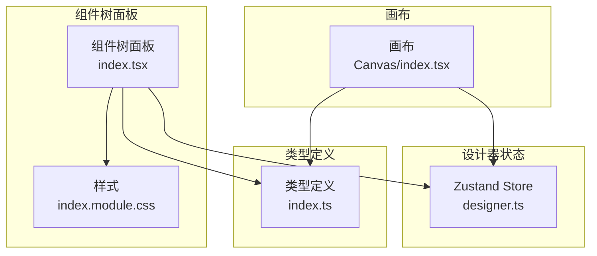
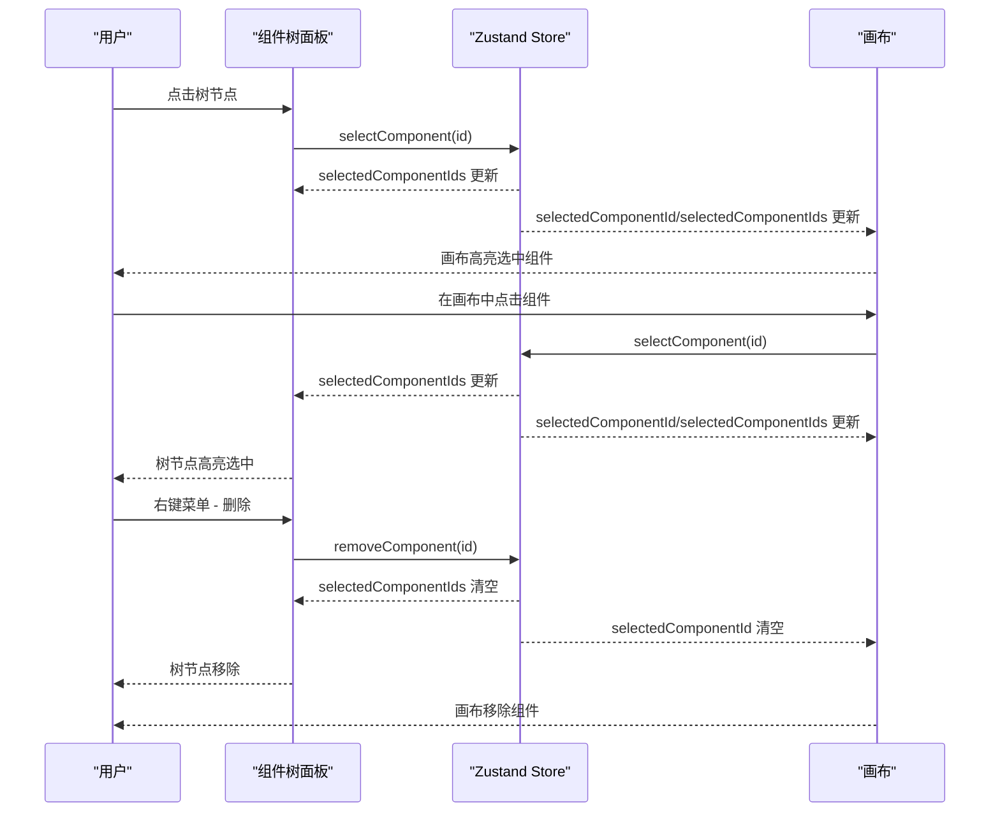
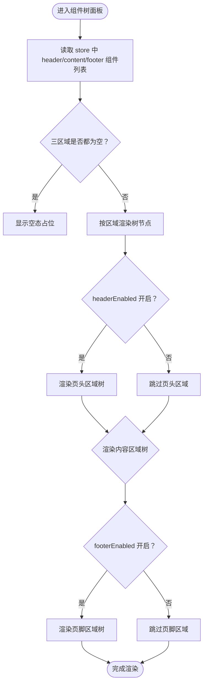
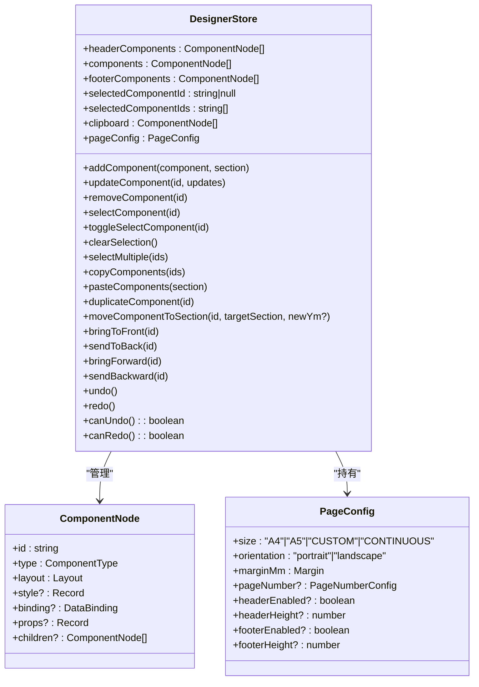
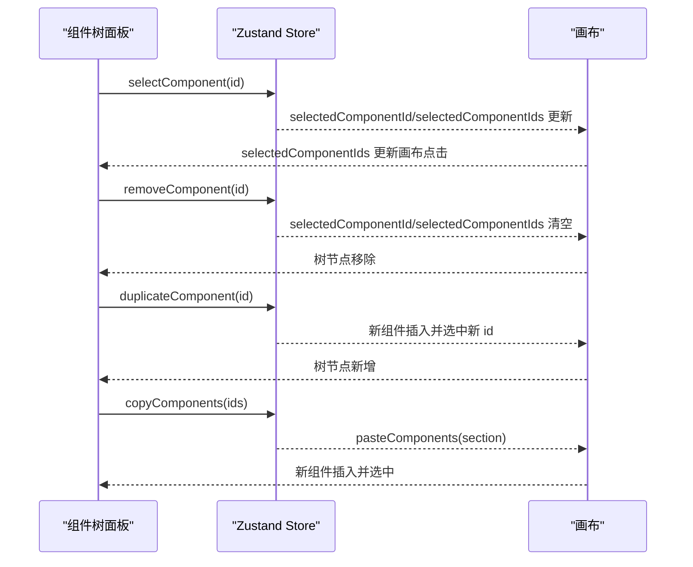
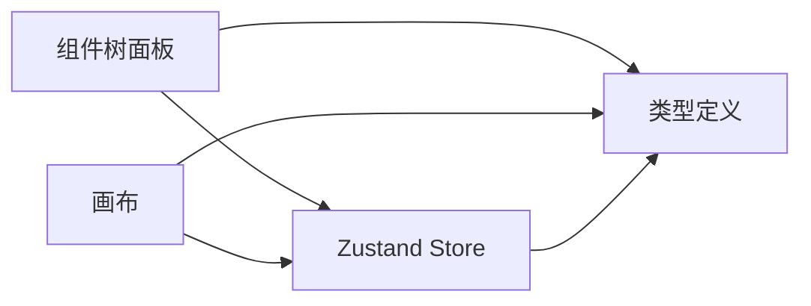

# 组件树面板

<cite>
**本文引用的文件**
- [组件树面板/index.tsx](file://designer/src/pages/Designer/components/ComponentTreePanel/index.tsx)
- [组件树面板/index.module.css](file://designer/src/pages/Designer/components/ComponentTreePanel/index.module.css)
- [设计器状态/设计系统/store/designer.ts](file://designer/src/store/designer.ts)
- [类型定义/index.ts](file://designer/src/types/index.ts)
- [画布/index.tsx](file://designer/src/pages/Designer/components/Canvas/index.tsx)
</cite>

## 目录
1. [简介](#简介)
2. [项目结构](#项目结构)
3. [核心组件](#核心组件)
4. [架构总览](#架构总览)
5. [详细组件分析](#详细组件分析)
6. [依赖分析](#依赖分析)
7. [性能考量](#性能考量)
8. [故障排查指南](#故障排查指南)
9. [结论](#结论)
10. [附录](#附录)

## 简介
组件树面板是打印模板设计器的重要交互入口，负责以层级树的形式展示画布上“页头/内容/页脚”三区域的组件集合，并提供节点选择、右键菜单、复制粘贴、删除等基础能力。它与画布实现双向联动：点击树节点可选中画布对应组件并滚动定位；在画布中选中组件时，树面板也会同步选中对应节点。此外，组件树还支持区域分组显示、组件图标与类型名映射、空态提示等功能。

## 项目结构
组件树相关文件位于设计器页面的组件目录中，采用“按功能模块划分”的组织方式：
- 组件树面板：负责树形展示、节点操作、右键菜单、空态与统计信息
- 设计器状态：集中管理组件列表、选中状态、区域开关、复制粘贴、撤销重做、层级管理等
- 类型定义：统一定义组件节点、页面配置、组件类型等数据结构
- 画布：承载组件渲染与交互，与组件树形成双向联动

**图表来源**
- [组件树面板/index.tsx:1-159](file://designer/src/pages/Designer/components/ComponentTreePanel/index.tsx#L1-L159)
- [组件树面板/index.module.css:1-29](file://designer/src/pages/Designer/components/ComponentTreePanel/index.module.css#L1-L29)
- [设计器状态/设计系统/store/designer.ts:1-773](file://designer/src/store/designer.ts#L1-L773)
- [类型定义/index.ts:1-378](file://designer/src/types/index.ts#L1-L378)
- [画布/index.tsx:1-800](file://designer/src/pages/Designer/components/Canvas/index.tsx#L1-L800)

**章节来源**
- [组件树面板/index.tsx:1-159](file://designer/src/pages/Designer/components/ComponentTreePanel/index.tsx#L1-L159)
- [组件树面板/index.module.css:1-29](file://designer/src/pages/Designer/components/ComponentTreePanel/index.module.css#L1-L29)
- [设计器状态/设计系统/store/designer.ts:1-773](file://designer/src/store/designer.ts#L1-L773)
- [类型定义/index.ts:1-378](file://designer/src/types/index.ts#L1-L378)
- [画布/index.tsx:1-800](file://designer/src/pages/Designer/components/Canvas/index.tsx#L1-L800)

## 核心组件
- 组件树面板：将 headerComponents/content/footerComponents 三区域组件转换为树节点，支持节点标题渲染（含图标、类型名、数据绑定路径）、右键菜单（复制、删除）、空态与总数统计、按区域分组展示。
- 设计器状态（Zustand Store）：维护组件列表、选中状态、区域开关、复制粘贴、撤销重做、层级管理（置顶/置底/上移/下移）、区域移动、网格与缩放等。
- 类型定义：定义 ComponentNode、PageConfig、ComponentType、PageSection 等关键类型，保证组件树与画布的数据一致性。
- 画布：承载组件渲染与交互，支持拖拽、对齐、尺寸调整、键盘快捷键、右键菜单、区域高度拖拽等，与组件树实现选中状态同步与删除联动。

**章节来源**
- [组件树面板/index.tsx:66-156](file://designer/src/pages/Designer/components/ComponentTreePanel/index.tsx#L66-L156)
- [设计器状态/设计系统/store/designer.ts:9-90](file://designer/src/store/designer.ts#L9-L90)
- [类型定义/index.ts:129-331](file://designer/src/types/index.ts#L129-L331)
- [画布/index.tsx:22-56](file://designer/src/pages/Designer/components/Canvas/index.tsx#L22-L56)

## 架构总览
组件树与画布通过 Zustand Store 实现松耦合的双向联动：
- 选中同步：树面板 onSelect 更新 store 中 selectedComponentId/selectedComponentIds；画布点击组件也更新 store，树面板订阅该状态并刷新选中态。
- 删除联动：树面板右键菜单删除或画布快捷键删除均调用 store.removeComponent，同时清空选中状态。
- 区域分组：树面板按 header/content/footer 三区域分别渲染，区域开关由 store.pageConfig 控制。
- 复制粘贴：树面板右键复制，画布支持 Ctrl+C/V 快捷键与右键菜单，二者均通过 store.copyComponents/pasteComponents 实现。

**图表来源**
- [组件树面板/index.tsx:77-83](file://designer/src/pages/Designer/components/ComponentTreePanel/index.tsx#L77-L83)
- [设计器状态/设计系统/store/designer.ts:138-149](file://designer/src/store/designer.ts#L138-L149)
- [画布/index.tsx:490-500](file://designer/src/pages/Designer/components/Canvas/index.tsx#L490-L500)

**章节来源**
- [组件树面板/index.tsx:66-156](file://designer/src/pages/Designer/components/ComponentTreePanel/index.tsx#L66-L156)
- [设计器状态/设计系统/store/designer.ts:138-149](file://designer/src/store/designer.ts#L138-L149)
- [画布/index.tsx:490-500](file://designer/src/pages/Designer/components/Canvas/index.tsx#L490-L500)

## 详细组件分析

### 组件树面板（ComponentTreePanel）
- 展示结构
  - 三区域分组：页头区域、内容区域、页脚区域，每个区域独立渲染树节点。
  - 统计信息：顶部显示“组件总数”，包含各区域组件数量。
  - 空态：当三区域均为空时，显示“暂无组件”占位图。
- 节点渲染
  - 标题包含组件图标、类型名与序号；若存在数据绑定路径，会显示在标题右侧作为次级信息。
  - 使用 Ant Design Tree 组件，blockNode 与 titleRender 自定义节点渲染。
- 交互行为
  - 点击节点：调用 store.selectComponent 并滚动到画布对应组件元素（通过 DOM 元素 id 定位）。
  - 右键菜单：支持“复制组件”“删除组件”，复制调用 duplicateComponent，删除调用 removeComponent。
- 区域开关
  - 通过 store.pageConfig.headerEnabled/footerEnabled 控制区域是否渲染。

**图表来源**
- [组件树面板/index.tsx:100-127](file://designer/src/pages/Designer/components/ComponentTreePanel/index.tsx#L100-L127)
- [组件树面板/index.tsx:148-150](file://designer/src/pages/Designer/components/ComponentTreePanel/index.tsx#L148-L150)

**章节来源**
- [组件树面板/index.tsx:66-156](file://designer/src/pages/Designer/components/ComponentTreePanel/index.tsx#L66-L156)
- [组件树面板/index.module.css:1-29](file://designer/src/pages/Designer/components/ComponentTreePanel/index.module.css#L1-L29)

### 设计器状态（Zustand Store）
- 组件与选中
  - 维护 headerComponents/components/footerComponents 三列表，以及 selectedComponentId/selectedComponentIds。
  - 提供 selectComponent/toggleSelectComponent/clearSelection/selectMultiple 等操作。
- 删除与复制粘贴
  - removeComponent：从三区域中移除指定 id，并清理选中状态。
  - duplicateComponent：深拷贝源组件并插入到其后，生成新 id，更新选中状态。
  - copyComponents/pasteComponents：复制所选组件到剪贴板并在目标区域粘贴，生成新 id 并吸附网格。
- 区域移动与层级管理
  - moveComponentToSection：将组件移动到目标区域并约束坐标。
  - bringToFront/sendToBack/bringForward/sendBackward：区域内层级调整。
- 历史与撤销重做
  - 保存全量状态快照，限制步数，提供 undo/redo 与 canUndo/canRedo。

**图表来源**
- [设计器状态/设计系统/store/designer.ts:9-90](file://designer/src/store/designer.ts#L9-L90)
- [设计器状态/设计系统/store/designer.ts:138-149](file://designer/src/store/designer.ts#L138-L149)
- [设计器状态/设计系统/store/designer.ts:308-345](file://designer/src/store/designer.ts#L308-L345)
- [设计器状态/设计系统/store/designer.ts:469-506](file://designer/src/store/designer.ts#L469-L506)
- [类型定义/index.ts:303-331](file://designer/src/types/index.ts#L303-L331)
- [类型定义/index.ts:91-123](file://designer/src/types/index.ts#L91-L123)

**章节来源**
- [设计器状态/设计系统/store/designer.ts:138-149](file://designer/src/store/designer.ts#L138-L149)
- [设计器状态/设计系统/store/designer.ts:308-345](file://designer/src/store/designer.ts#L308-L345)
- [设计器状态/设计系统/store/designer.ts:469-506](file://designer/src/store/designer.ts#L469-L506)
- [类型定义/index.ts:303-331](file://designer/src/types/index.ts#L303-L331)
- [类型定义/index.ts:91-123](file://designer/src/types/index.ts#L91-L123)

### 画布与组件树的双向联动
- 选中同步
  - 树面板 onSelect：调用 selectComponent 并滚动到画布元素。
  - 画布点击组件：更新 store 选中状态，树面板订阅并刷新。
- 删除联动
  - 树面板右键删除或画布快捷键删除：调用 removeComponent，清空选中并提示。
- 复制粘贴
  - 树面板右键复制，画布支持 Ctrl+C/V 与右键菜单，二者均通过 store.copyComponents/pasteComponents 实现。
- 区域移动
  - 画布拖拽跨区域：根据鼠标位置推断目标区域并调用 moveComponentToSection。

**图表来源**
- [组件树面板/index.tsx:77-83](file://designer/src/pages/Designer/components/ComponentTreePanel/index.tsx#L77-L83)
- [画布/index.tsx:490-500](file://designer/src/pages/Designer/components/Canvas/index.tsx#L490-L500)
- [设计器状态/设计系统/store/designer.ts:138-149](file://designer/src/store/designer.ts#L138-L149)
- [设计器状态/设计系统/store/designer.ts:308-345](file://designer/src/store/designer.ts#L308-L345)
- [设计器状态/设计系统/store/designer.ts:268-307](file://designer/src/store/designer.ts#L268-L307)

**章节来源**
- [组件树面板/index.tsx:77-89](file://designer/src/pages/Designer/components/ComponentTreePanel/index.tsx#L77-L89)
- [画布/index.tsx:490-500](file://designer/src/pages/Designer/components/Canvas/index.tsx#L490-L500)
- [设计器状态/设计系统/store/designer.ts:138-149](file://designer/src/store/designer.ts#L138-L149)
- [设计器状态/设计系统/store/designer.ts:308-345](file://designer/src/store/designer.ts#L308-L345)
- [设计器状态/设计系统/store/designer.ts:268-307](file://designer/src/store/designer.ts#L268-L307)

### 右键菜单与批量操作
- 组件树右键菜单
  - “复制组件”：调用 duplicateComponent，生成新 id 并选中新组件。
  - “删除组件”：调用 removeComponent，同时清空选中状态。
- 画布右键菜单
  - 支持“复制”“克隆”“层级”等子菜单，与树面板能力互补。
- 批量操作
  - 画布支持多选拖拽、多选对齐与分布，树面板通过 selectedComponentIds 同步选中状态。

**章节来源**
- [组件树面板/index.tsx:85-89](file://designer/src/pages/Designer/components/ComponentTreePanel/index.tsx#L85-L89)
- [画布/index.tsx:769-800](file://designer/src/pages/Designer/components/Canvas/index.tsx#L769-L800)
- [设计器状态/设计系统/store/designer.ts:155-168](file://designer/src/store/designer.ts#L155-L168)

### 快速定位与搜索高亮
- 快速定位
  - 树面板 onSelect 后，通过 DOM 元素 id 定位到画布对应组件并平滑滚动至可视区域中心。
- 搜索高亮
  - 当前实现未提供搜索高亮功能；可通过扩展标题渲染逻辑，在匹配到关键字时对标题内容进行高亮标记（建议在 titleRender 中实现）。

**章节来源**
- [组件树面板/index.tsx:77-83](file://designer/src/pages/Designer/components/ComponentTreePanel/index.tsx#L77-L83)

### 组件排序与层级管理
- 组件排序
  - 通过 bringToFront/sendToBack/bringForward/sendBackward 在区域内进行层级调整。
- 区域移动
  - moveComponentToSection 支持将组件从一个区域移动到另一个区域，并约束坐标与区域限制（表格不支持放入页头/页脚）。

**章节来源**
- [设计器状态/设计系统/store/designer.ts:361-466](file://designer/src/store/designer.ts#L361-L466)
- [设计器状态/设计系统/store/designer.ts:469-506](file://designer/src/store/designer.ts#L469-L506)

## 依赖分析
- 组件树面板依赖
  - Zustand Store：读取组件列表、选中状态、区域开关；触发选择、删除、复制、粘贴、克隆等动作。
  - Ant Design Tree：提供树形控件的基础能力。
  - 类型定义：确保组件节点与页面配置的数据结构一致。
- 画布依赖
  - Zustand Store：读取组件列表、选中状态、页面配置；处理拖拽、对齐、尺寸调整、键盘快捷键、右键菜单等。
  - 类型定义：确保组件节点与页面配置的数据结构一致。

**图表来源**
- [组件树面板/index.tsx:1-21](file://designer/src/pages/Designer/components/ComponentTreePanel/index.tsx#L1-L21)
- [设计器状态/设计系统/store/designer.ts:1-10](file://designer/src/store/designer.ts#L1-L10)
- [类型定义/index.ts:1-10](file://designer/src/types/index.ts#L1-L10)
- [画布/index.tsx:1-21](file://designer/src/pages/Designer/components/Canvas/index.tsx#L1-L21)

**章节来源**
- [组件树面板/index.tsx:1-21](file://designer/src/pages/Designer/components/ComponentTreePanel/index.tsx#L1-L21)
- [设计器状态/设计系统/store/designer.ts:1-10](file://designer/src/store/designer.ts#L1-L10)
- [类型定义/index.ts:1-10](file://designer/src/types/index.ts#L1-L10)
- [画布/index.tsx:1-21](file://designer/src/pages/Designer/components/Canvas/index.tsx#L1-L21)

## 性能考量
- 渲染优化
  - 树节点标题渲染采用轻量 JSX 结构，避免复杂计算；建议在大数据量场景下对标题内容进行缓存或懒渲染。
  - Ant Design Tree 默认按需渲染可见节点，结合虚拟滚动（如需要）可进一步降低长列表开销。
- 状态更新
  - Store 中的 removeComponent/duplicateComponent/pasteComponents 等操作均通过浅层/深拷贝与局部更新，避免不必要的重渲染。
- DOM 操作
  - 选中定位使用 getElementById 与 scrollIntoView，建议在大量节点时限制滚动频率或使用 IntersectionObserver 优化可视区域定位。

[本节为通用性能建议，不直接分析具体文件，故不附加“章节来源”]

## 故障排查指南
- 点击树节点无法定位到画布
  - 检查画布组件是否正确挂载了 id="component-{id}" 的 DOM 元素。
  - 确认 store.selectComponent 已被调用且 selectedComponentId 不为空。
- 删除组件后树面板未更新
  - 确认 removeComponent 是否从 headerComponents/components/footerComponents 中移除了对应 id。
  - 检查 selectedComponentId/selectedComponentIds 是否同步清空。
- 复制粘贴无效
  - 确认 copyComponents 是否正确将组件写入 clipboard。
  - 粘贴时检查 pasteComponents 是否根据目标区域追加组件并生成新 id。
- 区域移动异常
  - 表格组件不应放入页头/页脚；确认 moveComponentToSection 的类型校验逻辑。
  - 检查坐标约束与网格吸附是否生效。

**章节来源**
- [组件树面板/index.tsx:77-83](file://designer/src/pages/Designer/components/ComponentTreePanel/index.tsx#L77-L83)
- [设计器状态/设计系统/store/designer.ts:138-149](file://designer/src/store/designer.ts#L138-L149)
- [设计器状态/设计系统/store/designer.ts:308-345](file://designer/src/store/designer.ts#L308-L345)
- [设计器状态/设计系统/store/designer.ts:268-307](file://designer/src/store/designer.ts#L268-L307)
- [设计器状态/设计系统/store/designer.ts:469-506](file://designer/src/store/designer.ts#L469-L506)

## 结论
组件树面板提供了清晰的三区域组件层级视图与基础交互能力，配合 Zustand Store 实现了与画布的稳定双向联动。通过选中同步、删除联动、复制粘贴与区域移动等机制，用户可以高效地组织与管理打印模板中的组件。未来可在搜索高亮、虚拟滚动、标题内容缓存等方面进一步优化，以应对更大规模的模板场景。

[本节为总结性内容，不直接分析具体文件，故不附加“章节来源”]

## 附录
- 最佳实践与效率提升技巧
  - 使用 Ctrl/Cmd + 点击在画布中进行多选，随后在树面板中一次性操作（复制、删除、层级调整）。
  - 优先使用画布右键菜单进行复制/克隆，避免重复选择。
  - 在连续纸或自定义尺寸场景下，注意区域高度与组件尺寸约束，避免越界。
  - 批量对齐与分布时，确保所选组件在同一区域内，避免跨区域操作被拒绝。
  - 合理利用撤销/重做，避免误删或误改造成不可逆影响。

[本节为通用建议，不直接分析具体文件，故不附加“章节来源”]