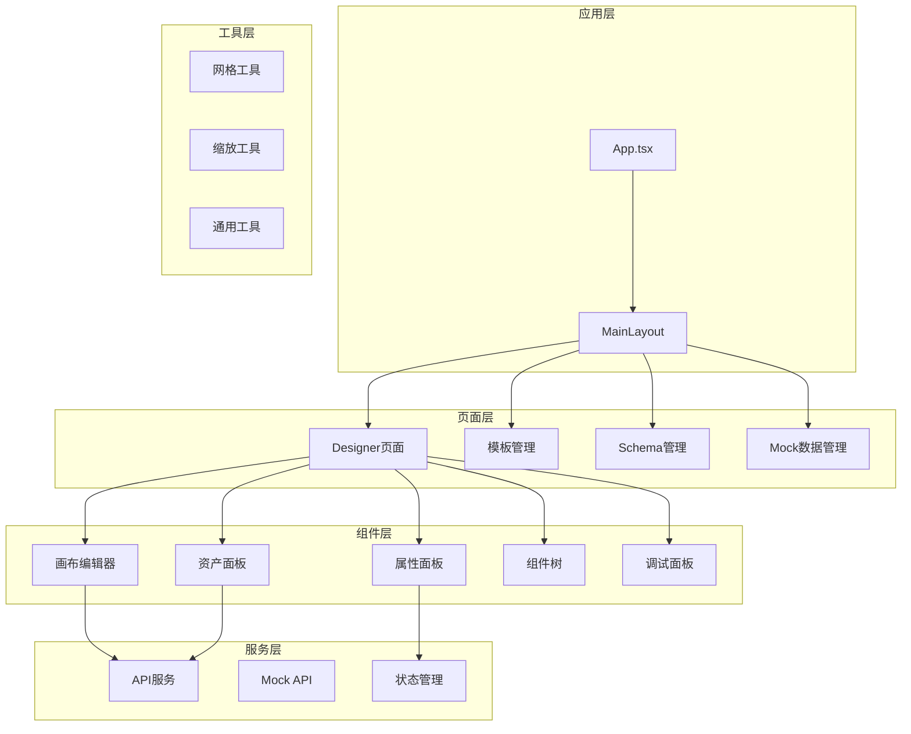
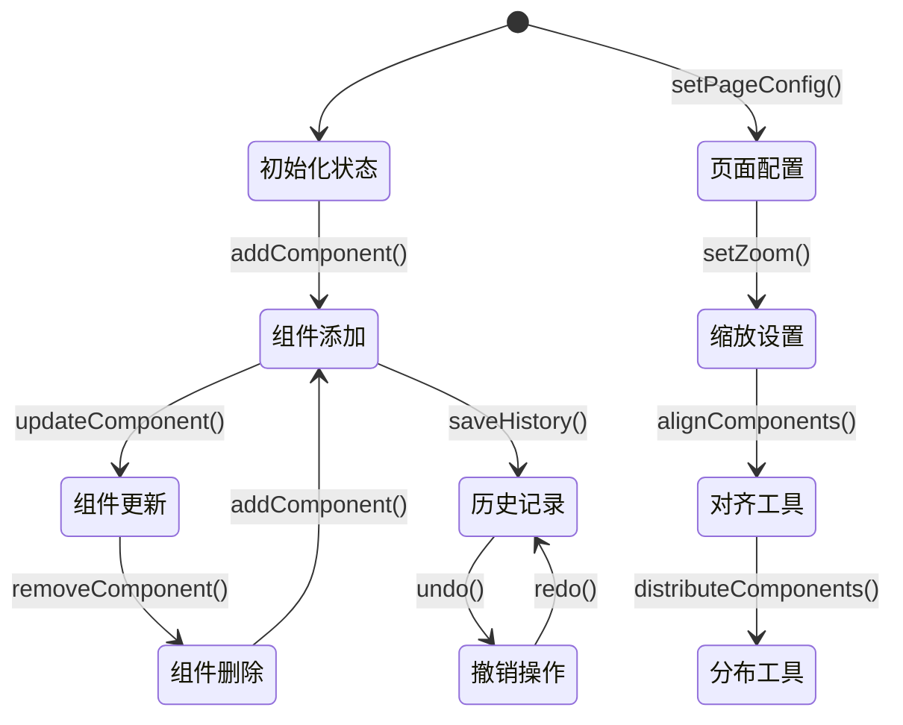
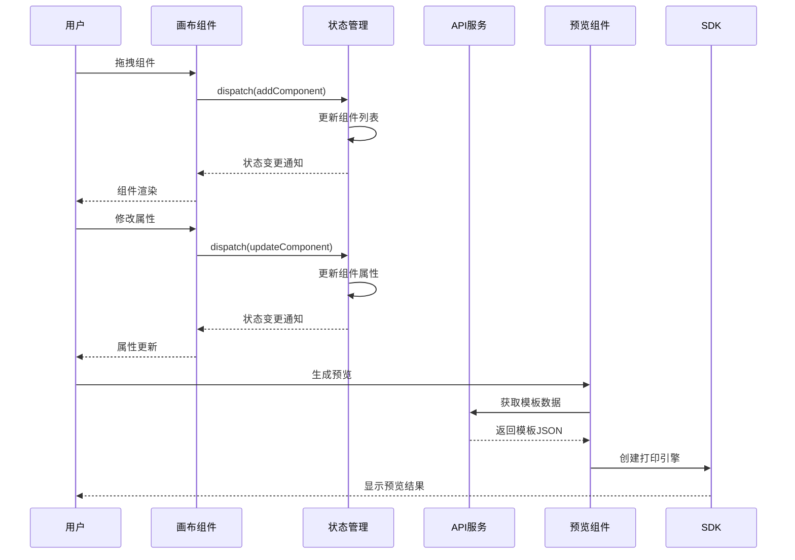
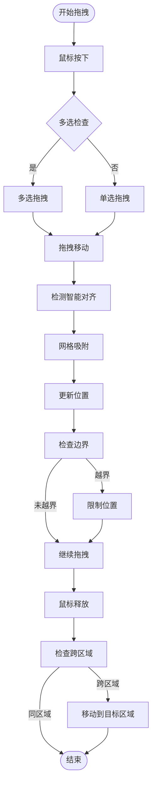
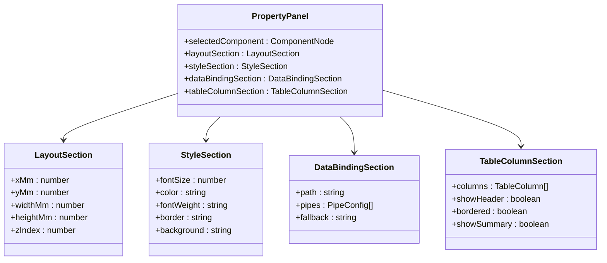
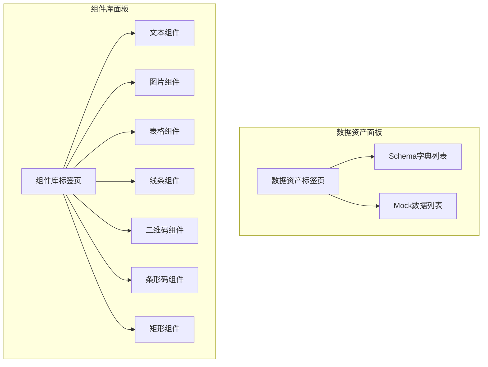
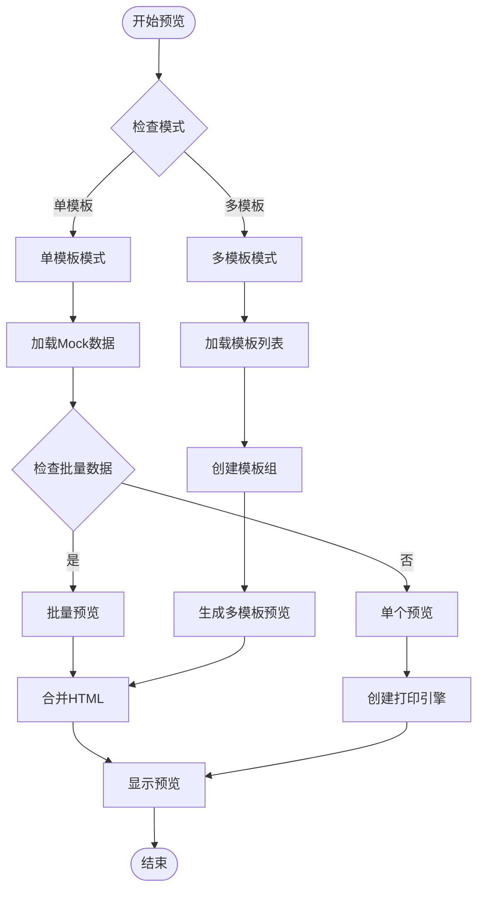

# 设计器 README 文档

<cite>
**本文档引用的文件**
- [README.md](file://designer/README.md)
- [package.json](file://designer/package.json)
- [vite.config.ts](file://designer/vite.config.ts)
- [tsconfig.json](file://designer/tsconfig.json)
- [src/App.tsx](file://designer/src/App.tsx)
- [src/main.tsx](file://designer/src/main.tsx)
- [src/pages/Designer/index.tsx](file://designer/src/pages/Designer/index.tsx)
- [src/store/designer.ts](file://designer/src/store/designer.ts)
- [src/services/api.ts](file://designer/src/services/api.ts)
- [src/types/index.ts](file://designer/src/types/index.ts)
- [src/components/PrintPreview/index.tsx](file://designer/src/components/PrintPreview/index.tsx)
- [src/utils/grid.ts](file://designer/src/utils/grid.ts)
- [src/pages/Designer/components/Canvas/index.tsx](file://designer/src/pages/Designer/components/Canvas/index.tsx)
- [src/pages/Designer/components/PropertyPanel/index.tsx](file://designer/src/pages/Designer/components/PropertyPanel/index.tsx)
- [src/pages/Designer/components/AssetPanel/index.tsx](file://designer/src/pages/Designer/components/AssetPanel/index.tsx)
</cite>

## 目录
1. [简介](#简介)
2. [项目结构](#项目结构)
3. [核心组件](#核心组件)
4. [架构概览](#架构概览)
5. [详细组件分析](#详细组件分析)
6. [依赖分析](#依赖分析)
7. [性能考虑](#性能考虑)
8. [故障排除指南](#故障排除指南)
9. [结论](#结论)

## 简介

可视化打印模板设计器是一个基于 React + Vite 的现代化打印模板设计工具，配合 `@jcyao/print-sdk` 使用。用户可以通过直观的拖拽界面设计打印模板，生成标准化的模板 JSON，然后交由 SDK 执行实际的打印任务。

该设计器提供了完整的模板设计工作流，包括组件库拖拽、属性配置、数据绑定、实时预览和批量打印等功能。系统采用模块化架构设计，支持多种页面配置和组件类型，满足各种打印场景的需求。

## 项目结构

设计器采用清晰的分层架构，主要分为以下几个核心层次：



**图表来源**
- [src/App.tsx:1-31](file://designer/src/App.tsx#L1-L31)
- [src/pages/Designer/index.tsx:1-365](file://designer/src/pages/Designer/index.tsx#L1-L365)

**章节来源**
- [README.md:47-72](file://designer/README.md#L47-L72)
- [package.json:1-46](file://designer/package.json#L1-L46)

## 核心组件

### 设计器主组件

Designer 主组件是整个设计器的核心入口，负责协调各个子组件的工作。它实现了完整的模板设计工作流，包括模板加载、组件管理、属性配置和预览打印等功能。

```mermaid
classDiagram
class Designer {
+navigate : useNavigate()
+searchParams : useSearchParams()
+debugOpen : boolean
+leftPanelCollapsed : boolean
+rightPanelCollapsed : boolean
+zoomLevel : number
+loadTemplateById(templateId)
+handleCopy()
+generateTemplate()
}
class AssetPanel {
+tabs : DataAsset | ComponentLibrary
}
class Canvas {
+components : ComponentNode[]
+headerComponents : ComponentNode[]
+footerComponents : ComponentNode[]
+dragAndDrop : true
+gridEnabled : boolean
+zoomLevel : number
}
class PropertyPanel {
+selectedComponent : ComponentNode
+layoutSection : LayoutSection
+styleSection : StyleSection
+dataBindingSection : DataBindingSection
}
Designer --> AssetPanel
Designer --> Canvas
Designer --> PropertyPanel
Canvas --> Store[useDesignerStore]
PropertyPanel --> Store[useDesignerStore]
```

**图表来源**
- [src/pages/Designer/index.tsx:17-365](file://designer/src/pages/Designer/index.tsx#L17-L365)
- [src/store/designer.ts:108-773](file://designer/src/store/designer.ts#L108-L773)

### 状态管理系统

设计器采用 Zustand 作为状态管理解决方案，实现了集中式的全局状态管理。状态系统涵盖了组件管理、页面配置、模板信息、历史记录等多个方面。



**图表来源**
- [src/store/designer.ts:84-106](file://designer/src/store/designer.ts#L84-L106)

**章节来源**
- [src/store/designer.ts:1-773](file://designer/src/store/designer.ts#L1-L773)

## 架构概览

设计器采用了现代化的前端架构设计，结合了多种最佳实践：

### 技术栈架构

```mermaid
graph LR
subgraph "前端框架"
React[React 18]
TS[TypeScript]
Vite[Vite 5]
end
subgraph "UI组件库"
AntD[Ant Design 6]
Monaco[Monaco Editor 0.55]
end
subgraph "状态管理"
Zustand[Zustand 5]
ZustandStore[全局状态管理]
end
subgraph "打印引擎"
SDK[@jcyao/print-sdk]
PrintEngine[打印引擎]
end
subgraph "工具链"
ESLint[ESLint]
Build[构建系统]
end
React --> AntD
React --> Zustand
Zustand --> ZustandStore
ZustandStore --> SDK
SDK --> PrintEngine
Vite --> Build
Build --> ESLint
```

**图表来源**
- [README.md:7-17](file://designer/README.md#L7-L17)
- [package.json:13-29](file://designer/package.json#L13-L29)

### 数据流架构

设计器实现了清晰的数据流向，从用户交互到状态更新再到渲染的完整流程：



**图表来源**
- [src/pages/Designer/components/Canvas/index.tsx:281-479](file://designer/src/pages/Designer/components/Canvas/index.tsx#L281-L479)
- [src/store/designer.ts:113-149](file://designer/src/store/designer.ts#L113-L149)

**章节来源**
- [README.md:1-81](file://designer/README.md#L1-L81)

## 详细组件分析

### 画布编辑器

画布编辑器是设计器的核心交互区域，提供了丰富的拖拽、对齐、吸附等编辑功能。

#### 拖拽系统

画布编辑器实现了完整的拖拽系统，支持组件拖拽、区域拖拽和智能对齐功能：



**图表来源**
- [src/pages/Designer/components/Canvas/index.tsx:502-699](file://designer/src/pages/Designer/components/Canvas/index.tsx#L502-L699)

#### 区域管理

设计器支持三种页面区域：页头、内容和页脚，每种区域都有特定的约束和行为：

| 区域类型 | 特性 | 约束 | 功能 |
|---------|------|------|------|
| 页头(header) | 顶部区域 | 高度可配置，最多占用内容区域30% | 支持组件拖拽，智能对齐 |
| 内容(content) | 主要区域 | 受页边距和页头/页脚高度限制 | 支持所有组件类型 |
| 页脚(footer) | 底部区域 | 高度可配置，最多占用内容区域30% | 支持组件拖拽，智能对齐 |

**章节来源**
- [src/pages/Designer/components/Canvas/index.tsx:1-800](file://designer/src/pages/Designer/components/Canvas/index.tsx#L1-L800)

### 属性面板

属性面板提供了组件属性的统一配置界面，根据不同组件类型动态显示相应的配置选项。

#### 属性分类



**图表来源**
- [src/pages/Designer/components/PropertyPanel/index.tsx:17-152](file://designer/src/pages/Designer/components/PropertyPanel/index.tsx#L17-L152)

**章节来源**
- [src/pages/Designer/components/PropertyPanel/index.tsx:1-152](file://designer/src/pages/Designer/components/PropertyPanel/index.tsx#L1-L152)

### 资产面板

资产面板整合了数据资产和组件库两个重要功能模块：

#### 数据资产管理

数据资产面板展示了可用的 Schema 字典和 Mock 数据，支持直接拖拽到画布进行数据绑定：



**图表来源**
- [src/pages/Designer/components/AssetPanel/index.tsx:7-32](file://designer/src/pages/Designer/components/AssetPanel/index.tsx#L7-L32)

**章节来源**
- [src/pages/Designer/components/AssetPanel/index.tsx:1-32](file://designer/src/pages/Designer/components/AssetPanel/index.tsx#L1-L32)

### 打印预览组件

打印预览组件提供了强大的预览和打印功能，支持单模板和多模板模式：

#### 预览生成流程



**图表来源**
- [src/components/PrintPreview/index.tsx:174-304](file://designer/src/components/PrintPreview/index.tsx#L174-L304)

**章节来源**
- [src/components/PrintPreview/index.tsx:1-624](file://designer/src/components/PrintPreview/index.tsx#L1-L624)

## 依赖分析

设计器的依赖关系体现了清晰的分层架构和模块化设计：

### 核心依赖关系

```mermaid
graph TD
subgraph "应用层依赖"
App[App.tsx] --> React[react]
App --> Router[react-router-dom]
App --> Antd[antd]
end
subgraph "状态管理依赖"
Zustand[zustand] --> Store[designer.ts]
Store --> Types[index.ts]
end
subgraph "工具类依赖"
Grid[grid.ts] --> Utils[通用工具]
Zoom[zoom.ts] --> Utils
PageSize[pageSize.ts] --> Utils
end
subgraph "外部SDK依赖"
SDK[@jcyao/print-sdk] --> PrintEngine[打印引擎]
PrintEngine --> Renderers[渲染器]
end
subgraph "开发工具依赖"
Vite[vite] --> Config[vite.config.ts]
ESLint[eslint] --> Config
Monaco[monaco-editor] --> Editor[代码编辑器]
end
App --> Zustand
Store --> SDK
App --> Monaco
App --> Vite
```

**图表来源**
- [package.json:13-29](file://designer/package.json#L13-L29)
- [vite.config.ts:1-29](file://designer/vite.config.ts#L1-L29)

### 环境配置

设计器支持多种运行环境，通过环境变量控制不同的行为模式：

| 环境变量 | 值 | 作用 | 用途 |
|----------|-----|------|------|
| VITE_USE_MOCK | true/false | 启用Mock模式 | 前端内存数据模拟 |
| VITE_API_BASE_URL | URL | API基础地址 | 后端服务地址配置 |
| NODE_ENV | development/production | 环境模式 | 构建配置切换 |

**章节来源**
- [src/services/api.ts:13-20](file://designer/src/services/api.ts#L13-L20)
- [vite.config.ts:8-14](file://designer/vite.config.ts#L8-L14)

## 性能考虑

设计器在设计时充分考虑了性能优化，采用了多种策略来提升用户体验：

### 状态管理优化

- **局部状态分离**：将组件状态与全局状态分离，避免不必要的重渲染
- **状态快照机制**：实现撤销/重做功能，同时控制历史记录数量
- **批量更新**：支持多组件同时更新，减少状态变更次数

### 渲染性能优化

- **虚拟滚动**：对于大量组件的场景，考虑使用虚拟滚动技术
- **懒加载**：组件库和数据资产采用懒加载策略
- **防抖处理**：对频繁触发的操作进行防抖处理

### 网络请求优化

- **请求缓存**：模板和数据的请求结果进行缓存
- **批量请求**：支持批量获取相关数据
- **错误重试**：网络异常时提供重试机制

## 故障排除指南

### 常见问题及解决方案

#### 模板加载失败

**问题描述**：设计器无法加载模板数据
**可能原因**：
- API服务不可用
- 网络连接异常
- 模板ID无效

**解决步骤**：
1. 检查网络连接状态
2. 验证API服务是否正常运行
3. 确认模板ID的正确性
4. 查看浏览器开发者工具的网络面板

#### 组件拖拽异常

**问题描述**：组件拖拽功能失效或行为异常
**可能原因**：
- 鼠标事件处理冲突
- 状态管理异常
- 浏览器兼容性问题

**解决步骤**：
1. 刷新页面重新加载
2. 检查是否有其他元素遮挡画布
3. 尝试禁用浏览器扩展程序
4. 更换浏览器测试

#### 预览显示异常

**问题描述**：打印预览无法正常显示
**可能原因**：
- 打印引擎初始化失败
- 模板数据格式错误
- 浏览器安全策略限制

**解决步骤**：
1. 检查模板JSON格式
2. 验证Mock数据的有效性
3. 查看浏览器控制台错误信息
4. 确认跨域设置正确

**章节来源**
- [src/services/api.ts:131-134](file://designer/src/services/api.ts#L131-L134)
- [src/components/PrintPreview/index.tsx:174-304](file://designer/src/components/PrintPreview/index.tsx#L174-L304)

## 结论

可视化打印模板设计器是一个功能完善、架构清晰的现代化前端应用。它成功地将复杂的打印模板设计过程简化为直观的拖拽操作，为用户提供了高效的模板设计体验。

### 主要优势

1. **模块化设计**：清晰的组件分层和职责分离
2. **用户体验优秀**：直观的拖拽界面和实时反馈
3. **功能完整性**：涵盖从设计到打印的完整工作流
4. **扩展性强**：支持自定义组件和数据绑定
5. **性能优化**：合理的状态管理和渲染优化

### 技术亮点

- 采用React Hooks和Zustand实现高效的状态管理
- 集成Monaco Editor提供代码编辑能力
- 支持多种页面配置和组件类型
- 实现智能对齐和网格吸附功能
- 提供完整的预览和打印功能

该设计器为打印模板的设计和管理提供了强有力的技术支撑，是企业级打印解决方案的重要组成部分。