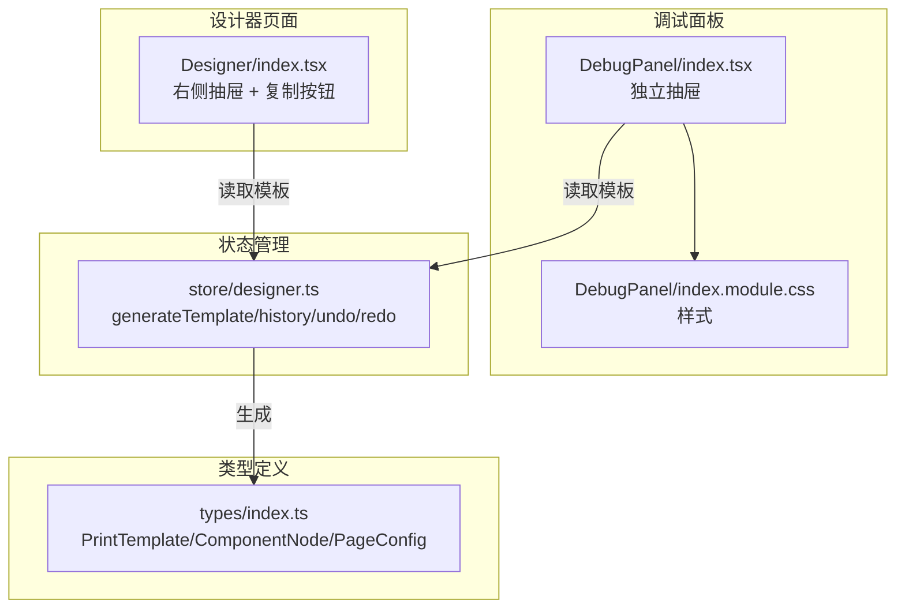
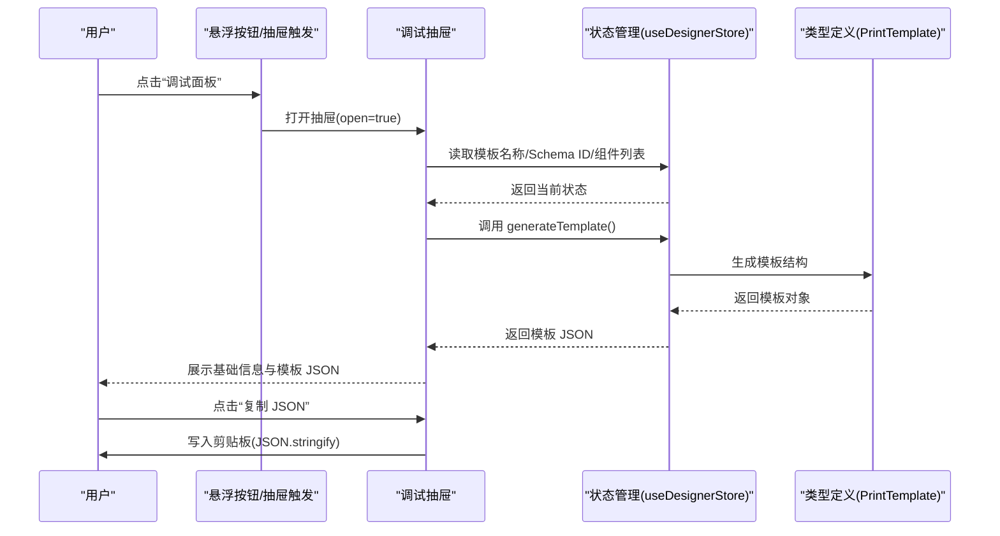
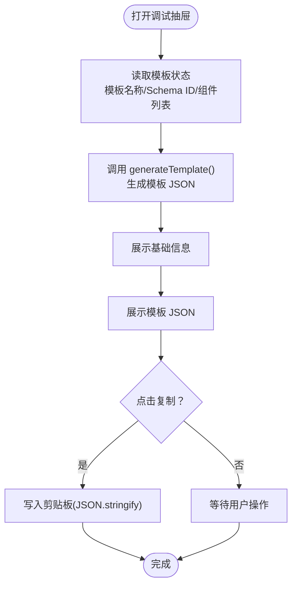
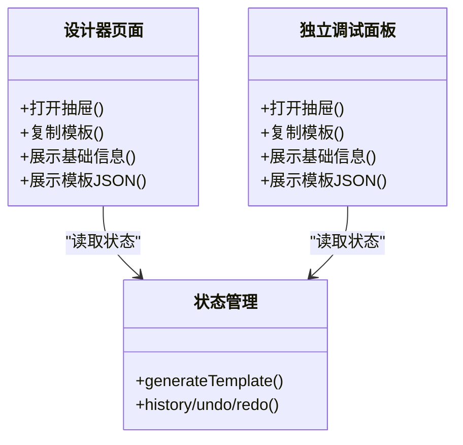
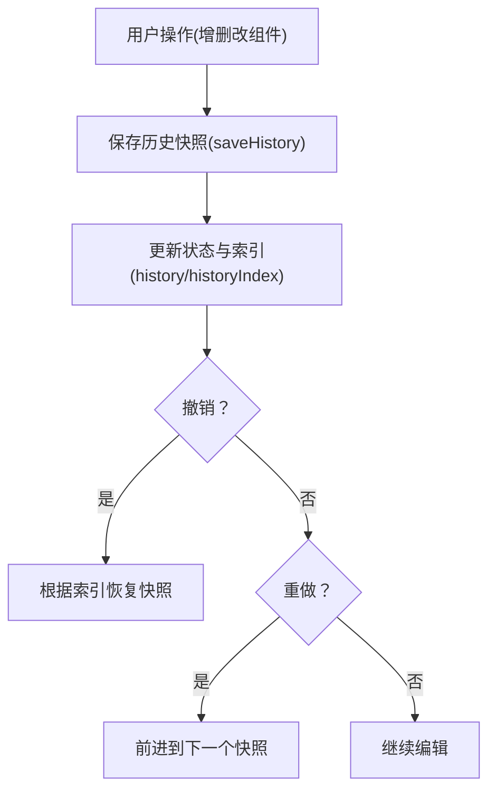
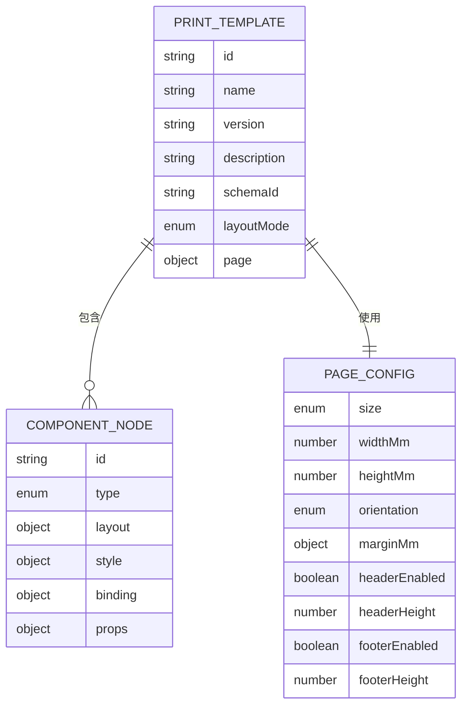
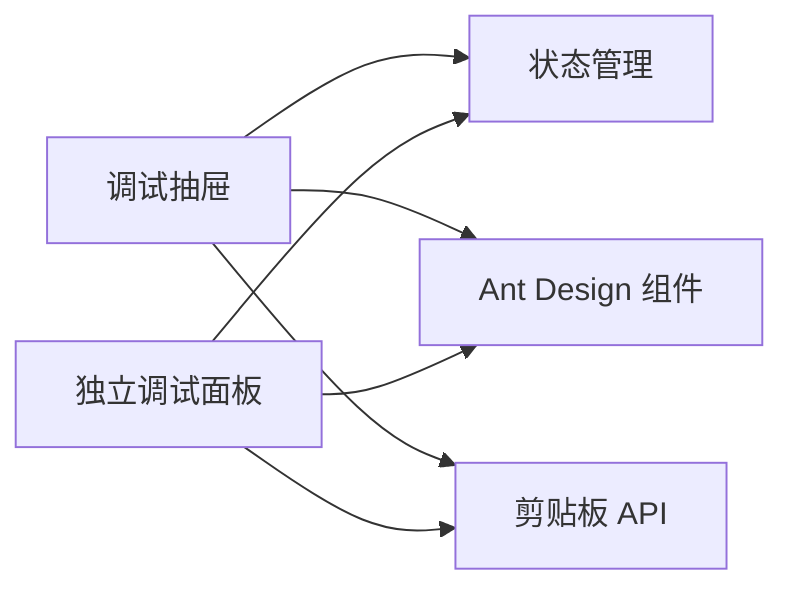

# 调试面板

<cite>
**本文引用的文件**
- [index.tsx](file://designer/src/pages/Designer/components/DebugPanel/index.tsx)
- [index.module.css](file://designer/src/pages/Designer/components/DebugPanel/index.module.css)
- [index.tsx](file://designer/src/pages/Designer/index.tsx)
- [designer.ts](file://designer/src/store/designer.ts)
- [index.ts](file://designer/src/types/index.ts)
- [index.tsx](file://designer/src/pages/TemplateManagement/index.tsx)
</cite>

## 目录
1. [简介](#简介)
2. [项目结构](#项目结构)
3. [核心组件](#核心组件)
4. [架构总览](#架构总览)
5. [详细组件分析](#详细组件分析)
6. [依赖分析](#依赖分析)
7. [性能考虑](#性能考虑)
8. [故障排查指南](#故障排查指南)
9. [结论](#结论)
10. [附录](#附录)

## 简介
本文件面向“调试面板”的功能与实现进行全面说明，重点覆盖以下方面：
- 调试信息的采集与展示：组件状态、数据绑定信息、渲染性能指标
- 日志输出、错误追踪、性能监控能力
- 调试信息的过滤筛选、时间轴回放、状态快照
- 与开发者工具的集成、断点调试、变量监视支持
- 调试面板的配置选项、显示模式切换、信息导出
- 调试技巧与故障排查最佳实践

当前仓库中的调试面板主要提供“模板 JSON Schema”导出与基础状态展示，尚未内置日志、错误追踪、性能监控、时间轴回放与变量监视等高级能力。本文在“概念性扩展建议”部分给出可落地的增强方案，帮助团队在现有基础上迭代完善。

## 项目结构
调试面板位于设计器页面的右侧抽屉中，通过状态管理读取当前模板的完整结构，并提供 JSON 导出与复制能力。其核心文件如下：
- 设计器页面右侧抽屉：负责打开/关闭抽屉、复制模板 JSON、展示基础统计信息
- 调试面板组件：独立抽屉，展示模板名称、Schema ID、组件数量与模板 JSON
- 状态管理：提供 generateTemplate 生成模板、历史快照、撤销/重做等能力
- 类型定义：定义模板、组件、页面配置等核心数据结构

**图表来源**
- [index.tsx:317-364](file://designer/src/pages/Designer/index.tsx#L317-L364)
- [index.tsx:1-77](file://designer/src/pages/Designer/components/DebugPanel/index.tsx#L1-L77)
- [index.module.css:1-34](file://designer/src/pages/Designer/components/DebugPanel/index.module.css#L1-L34)
- [designer.ts:189-201](file://designer/src/store/designer.ts#L189-L201)
- [index.ts:333-358](file://designer/src/types/index.ts#L333-L358)

**章节来源**
- [index.tsx:17-364](file://designer/src/pages/Designer/index.tsx#L17-L364)
- [index.tsx:1-77](file://designer/src/pages/Designer/components/DebugPanel/index.tsx#L1-L77)
- [index.module.css:1-34](file://designer/src/pages/Designer/components/DebugPanel/index.module.css#L1-L34)
- [designer.ts:108-201](file://designer/src/store/designer.ts#L108-L201)
- [index.ts:333-358](file://designer/src/types/index.ts#L333-L358)

## 核心组件
- 设计器右侧抽屉（调试面板）
  - 打开/关闭：通过按钮触发 Drawer 的 open 状态
  - 复制模板：点击“复制 JSON”按钮，将当前模板 JSON 写入剪贴板
  - 基础信息：展示模板名称、Schema ID、组件总数与分段统计
  - 模板 JSON：以等宽字体展示完整模板 JSON，支持滚动查看
- 独立调试面板组件
  - 与设计器页面共享同一套状态读取与复制逻辑
  - 通过固定悬浮按钮快速打开，便于在不同场景下使用

**章节来源**
- [index.tsx:247-257](file://designer/src/pages/Designer/index.tsx#L247-L257)
- [index.tsx:317-364](file://designer/src/pages/Designer/index.tsx#L317-L364)
- [index.tsx:9-77](file://designer/src/pages/Designer/components/DebugPanel/index.tsx#L9-L77)
- [index.module.css:1-34](file://designer/src/pages/Designer/components/DebugPanel/index.module.css#L1-L34)

## 架构总览
调试面板与状态管理、类型系统的交互关系如下：

**图表来源**
- [index.tsx:247-257](file://designer/src/pages/Designer/index.tsx#L247-L257)
- [index.tsx:317-364](file://designer/src/pages/Designer/index.tsx#L317-L364)
- [designer.ts:189-201](file://designer/src/store/designer.ts#L189-L201)
- [index.ts:333-358](file://designer/src/types/index.ts#L333-L358)

## 详细组件分析

### 组件 A：调试抽屉（设计器页面）
- 功能要点
  - 固定悬浮按钮触发右侧抽屉
  - 展示模板名称、Schema ID、组件数量与分段统计
  - 提供“复制 JSON”按钮，一键导出当前模板
  - 模板 JSON 以等宽字体展示，支持滚动
- 性能与可用性
  - 模板 JSON 在抽屉打开时才生成并渲染，避免常驻开销
  - 复制操作基于浏览器剪贴板 API，无需额外依赖
- 可扩展点
  - 增加“展开/收起”控制，减少遮挡
  - 增加“搜索/过滤”输入框，按组件类型/绑定路径筛选
  - 增加“时间轴回放”按钮，结合历史快照进行状态恢复

**图表来源**
- [index.tsx:317-364](file://designer/src/pages/Designer/index.tsx#L317-L364)
- [designer.ts:189-201](file://designer/src/store/designer.ts#L189-L201)

**章节来源**
- [index.tsx:247-257](file://designer/src/pages/Designer/index.tsx#L247-L257)
- [index.tsx:317-364](file://designer/src/pages/Designer/index.tsx#L317-L364)

### 组件 B：独立调试面板组件
- 功能要点
  - 独立 Drawer 展示调试信息
  - 与设计器页面共享状态读取与复制逻辑
  - 固定悬浮按钮，便于在不同场景下快速打开
- 与设计器页面的关系
  - 两者使用相同的模板生成与复制流程
  - 样式通过模块化 CSS 管理，保持一致的排版与字体

**图表来源**
- [index.tsx:9-77](file://designer/src/pages/Designer/components/DebugPanel/index.tsx#L9-L77)
- [designer.ts:189-201](file://designer/src/store/designer.ts#L189-L201)

**章节来源**
- [index.tsx:1-77](file://designer/src/pages/Designer/components/DebugPanel/index.tsx#L1-L77)
- [index.module.css:1-34](file://designer/src/pages/Designer/components/DebugPanel/index.module.css#L1-L34)

### 组件 C：状态管理与历史快照
- 能力概述
  - 生成完整模板：将当前状态整合为模板对象
  - 历史快照：记录组件列表与索引，支持撤销/重做
  - 撤销/重做：基于快照恢复到指定历史状态
- 与调试面板的关系
  - 调试面板通过 generateTemplate 获取当前模板
  - 历史快照可用于“时间轴回放”，但当前实现未暴露该能力

**图表来源**
- [designer.ts:92-106](file://designer/src/store/designer.ts#L92-L106)
- [designer.ts:508-548](file://designer/src/store/designer.ts#L508-L548)

**章节来源**
- [designer.ts:92-106](file://designer/src/store/designer.ts#L92-L106)
- [designer.ts:508-548](file://designer/src/store/designer.ts#L508-L548)

### 组件 D：类型定义与模板结构
- 关键类型
  - PrintTemplate：模板对象，包含页面配置、布局模式、组件列表、页头/页脚组件
  - ComponentNode：组件节点，包含布局、样式、数据绑定、属性等
  - PageConfig：页面配置，包含尺寸、方向、边距、页头/页脚开关与高度等
- 与调试面板的关系
  - generateTemplate 输出的模板对象即遵循上述类型定义
  - 调试面板展示的 JSON 严格符合类型约束，便于外部 SDK 或服务端消费

**图表来源**
- [index.ts:333-358](file://designer/src/types/index.ts#L333-L358)
- [index.ts:300-331](file://designer/src/types/index.ts#L300-L331)
- [index.ts:87-123](file://designer/src/types/index.ts#L87-L123)

**章节来源**
- [index.ts:333-358](file://designer/src/types/index.ts#L333-L358)
- [index.ts:300-331](file://designer/src/types/index.ts#L300-L331)
- [index.ts:87-123](file://designer/src/types/index.ts#L87-L123)

## 依赖分析
- 组件耦合
  - 调试抽屉与独立调试面板均依赖状态管理提供的模板生成与复制能力
  - 样式通过模块化 CSS 管理，避免全局污染
- 外部依赖
  - Ant Design 组件库（Button、Drawer、Typography 等）
  - 浏览器剪贴板 API（navigator.clipboard）

**图表来源**
- [index.tsx:317-364](file://designer/src/pages/Designer/index.tsx#L317-L364)
- [index.tsx:1-77](file://designer/src/pages/Designer/components/DebugPanel/index.tsx#L1-L77)

**章节来源**
- [index.tsx:317-364](file://designer/src/pages/Designer/index.tsx#L317-L364)
- [index.tsx:1-77](file://designer/src/pages/Designer/components/DebugPanel/index.tsx#L1-L77)

## 性能考虑
- 渲染开销
  - 模板 JSON 仅在抽屉打开时生成与渲染，避免常驻开销
  - JSON 字符串化与等宽字体展示，建议在大数据量时开启“懒加载”或“分页展示”
- 复制性能
  - 复制操作基于浏览器剪贴板 API，单次操作耗时极短
- 历史快照
  - 每次操作保存一次全量快照，内存占用与序列化成本随历史步数增长
  - 建议限制最大历史步数，避免内存膨胀

[本节为通用指导，不直接分析具体文件]

## 故障排查指南
- 无法复制模板
  - 检查浏览器剪贴板权限与安全上下文（HTTPS）
  - 确认 generateTemplate 返回有效对象
- 模板 JSON 显示异常
  - 检查类型定义是否与实际数据一致
  - 确认组件节点的布局、样式、绑定字段未出现循环引用
- 历史回放无效
  - 确认历史快照索引与数组长度匹配
  - 检查撤销/重做按钮的可用状态判断逻辑

**章节来源**
- [designer.ts:189-201](file://designer/src/store/designer.ts#L189-L201)
- [designer.ts:508-548](file://designer/src/store/designer.ts#L508-L548)

## 结论
当前调试面板提供了“模板 JSON 导出 + 基础状态展示”的核心能力，满足日常开发与问题定位的基本需求。若需进一步提升调试效率，可在现有基础上增加：
- 日志输出与错误追踪：在状态变更处埋点，记录关键事件与错误堆栈
- 性能监控：统计模板生成耗时、组件渲染耗时、内存占用
- 时间轴回放：暴露历史快照浏览与跳转能力
- 过滤筛选：按组件类型、绑定路径、样式属性进行筛选
- 信息导出：支持导出为多种格式（JSON、YAML、CSV 等）

这些增强将显著提升调试面板的实用性和可维护性。

[本节为总结性内容，不直接分析具体文件]

## 附录

### 调试面板与开发者工具的集成建议
- 断点调试
  - 在 generateTemplate 与状态更新的关键路径设置断点，观察模板结构变化
- 变量监视
  - 监视 templateName、schemaId、components/headerComponents/footerComponents 等关键字段
- 日志输出
  - 在每次撤销/重做前后输出历史索引与快照摘要，辅助定位问题

[本节为概念性建议，不直接分析具体文件]

### 配置选项与显示模式
- 显示模式
  - 单列/双列：右侧抽屉与独立抽屉的切换
  - 展开/收起：减少遮挡，提升画布可视面积
- 导出格式
  - JSON：当前实现
  - YAML/CSV：可扩展，便于人工审阅与自动化处理

[本节为概念性建议，不直接分析具体文件]

### 信息导出与模板管理
- 模板管理页面提供导出/导入能力，可与调试面板形成闭环
- 建议在调试面板中增加“导出为模板管理格式”的按钮，便于快速分享与复用

**章节来源**
- [index.tsx:138-201](file://designer/src/pages/TemplateManagement/index.tsx#L138-L201)