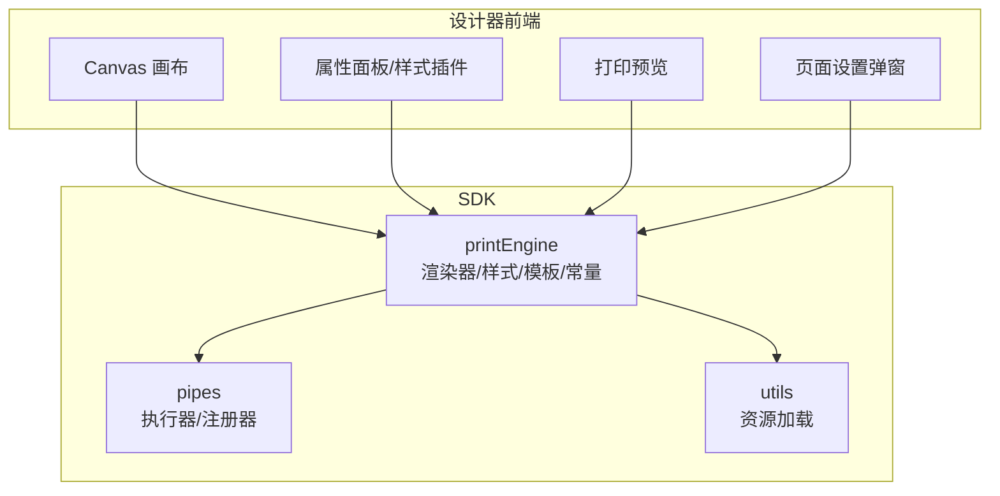
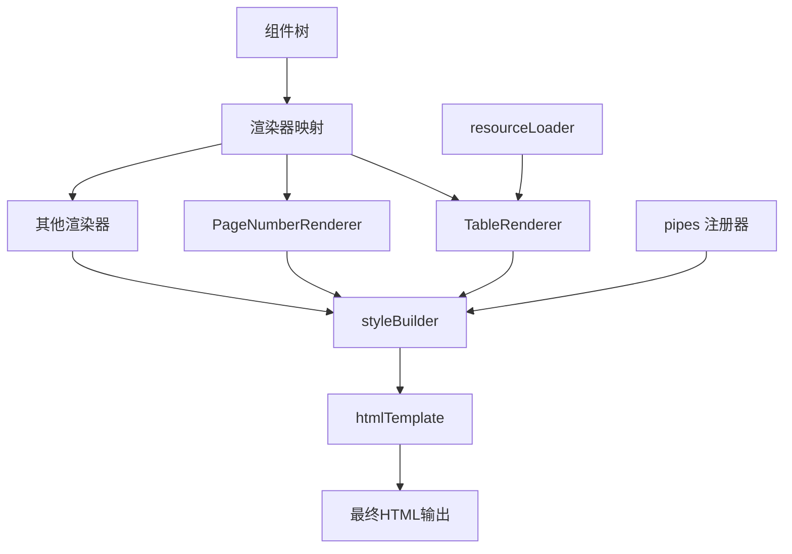
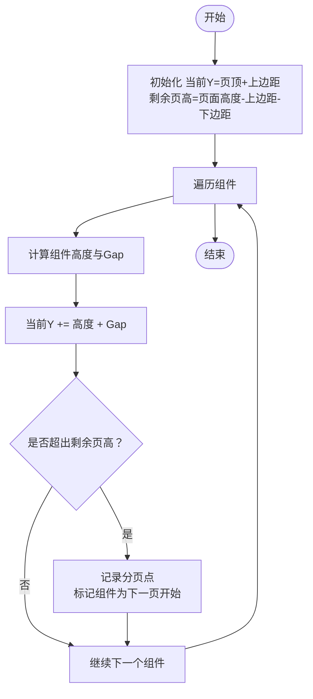
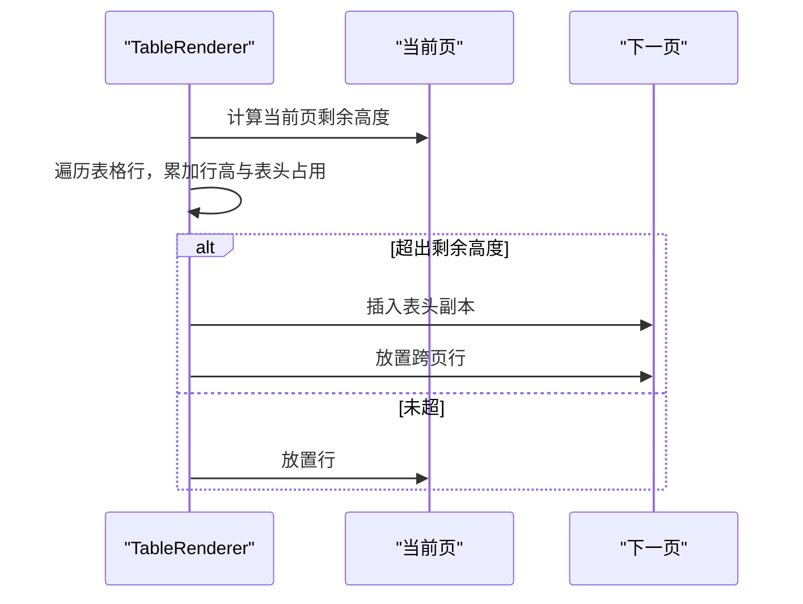
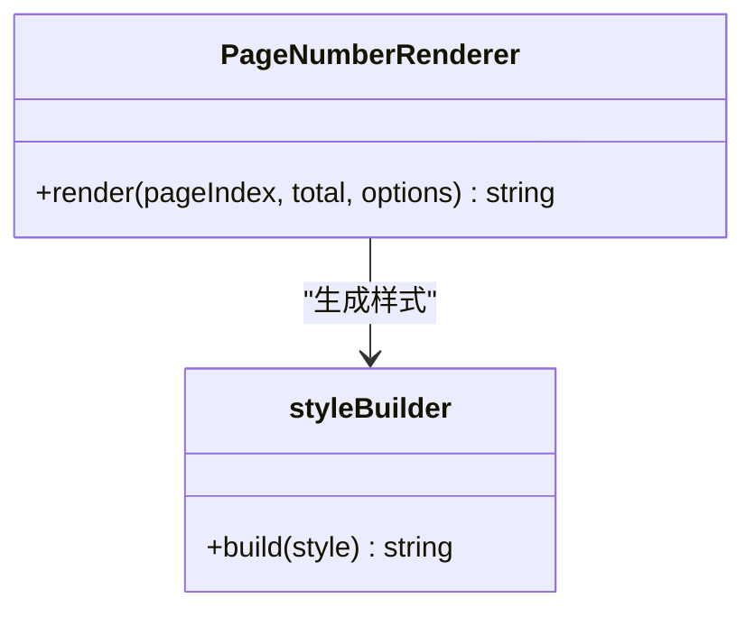
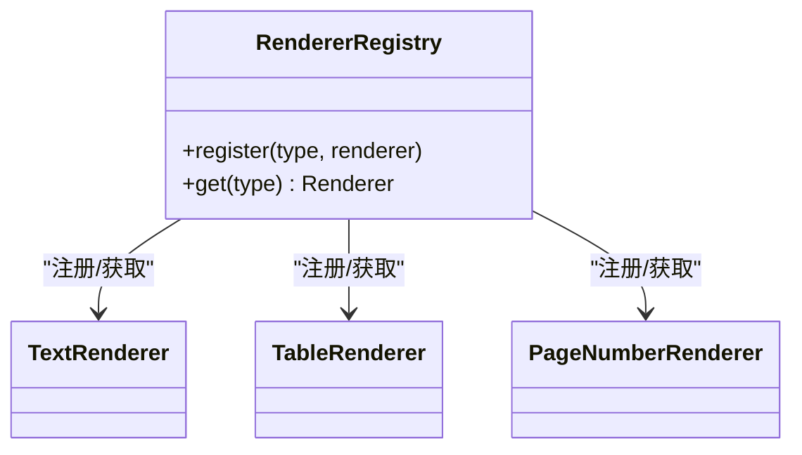
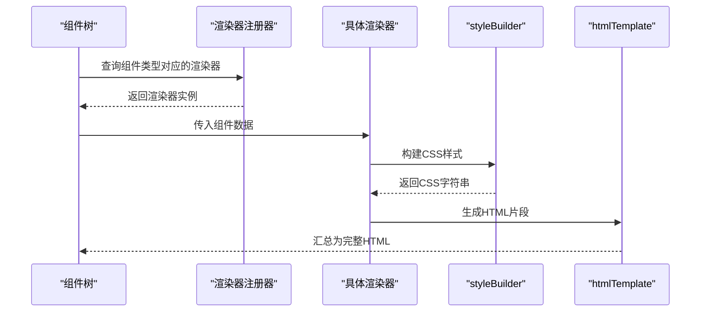
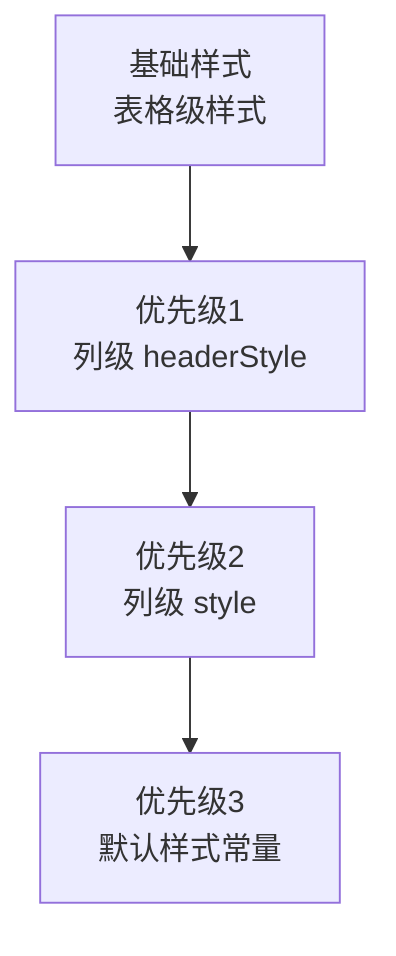
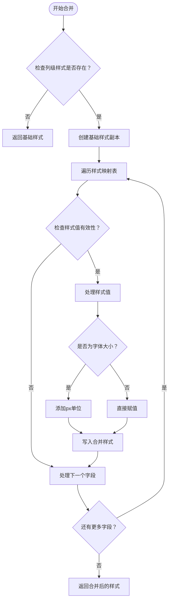
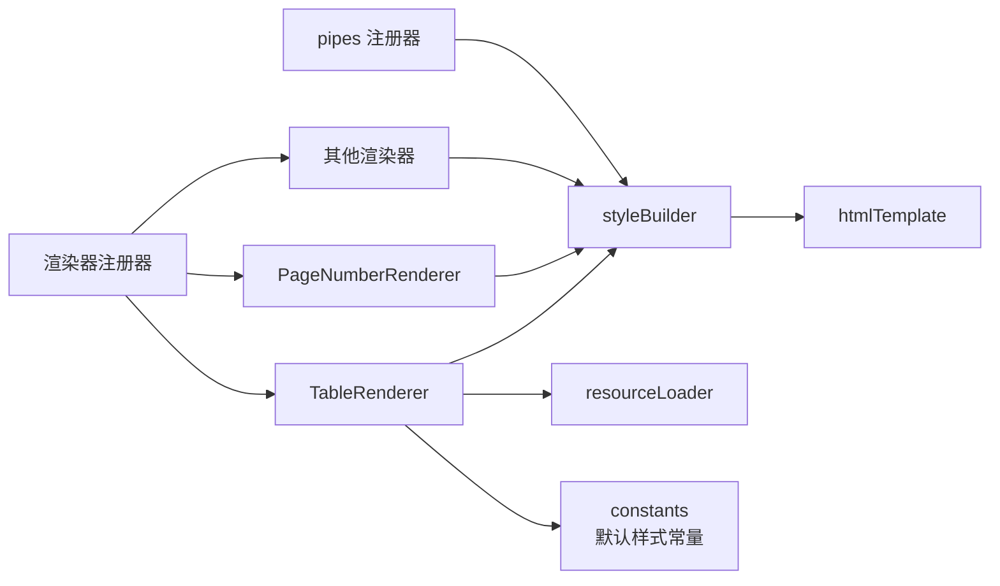

# 打印引擎系统

<cite>
**本文引用的文件**
- [README.md](file://README.md)
- [sdk/src/printEngine/renderers/index.ts](file://sdk/src/printEngine/renderers/index.ts)
- [sdk/src/printEngine/renderers/TableRenderer.ts](file://sdk/src/printEngine/renderers/TableRenderer.ts)
- [sdk/src/printEngine/renderers/PageNumberRenderer.ts](file://sdk/src/printEngine/renderers/PageNumberRenderer.ts)
- [sdk/src/printEngine/utils/styleBuilder.ts](file://sdk/src/printEngine/utils/styleBuilder.ts)
- [sdk/src/printEngine/htmlTemplate.ts](file://sdk/src/printEngine/htmlTemplate.ts)
- [sdk/src/printEngine/constants.ts](file://sdk/src/printEngine/constants.ts)
- [sdk/src/pipes/registry.ts](file://sdk/src/pipes/registry.ts)
- [sdk/src/pipes/executors/index.ts](file://sdk/src/pipes/executors/index.ts)
- [sdk/src/pipes/executors/ChineseNumberPipe.ts](file://sdk/src/pipes/executors/ChineseNumberPipe.ts)
- [sdk/src/pipes/executors/CurrencyPipe.ts](file://sdk/src/pipes/executors/CurrencyPipe.ts)
- [sdk/src/pipes/executors/DatePipe.ts](file://sdk/src/pipes/executors/DatePipe.ts)
- [sdk/src/pipes/executors/MoneyPipe.ts](file://sdk/src/pipes/executors/MoneyPipe.ts)
- [sdk/src/utils/resourceLoader.ts](file://sdk/src/utils/resourceLoader.ts)
- [designer/src/pages/Designer/components/Canvas/componentRenderers/index.ts](file://designer/src/pages/Designer/components/Canvas/componentRenderers/index.ts)
- [designer/src/pages/Designer/components/Canvas/componentRenderers/TablePreview.tsx](file://designer/src/pages/Designer/components/Canvas/componentRenderers/TablePreview.tsx)
- [designer/src/pages/Designer/components/Canvas/componentRenderers/TextPreview.tsx](file://designer/src/pages/Designer/components/Canvas/componentRenderers/TextPreview.tsx)
- [designer/src/pages/Designer/components/Canvas/Canvas.tsx](file://designer/src/pages/Designer/components/Canvas/Canvas.tsx)
- [designer/src/pages/Designer/components/Canvas/PageSettingModal.tsx](file://designer/src/pages/Designer/components/Canvas/PageSettingModal.tsx)
- [designer/src/utils/pageSize.ts](file://designer/src/utils/pageSize.ts)
- [designer/src/pages/Designer/components/PropertyPanel/stylePlugins/index.ts](file://designer/src/pages/Designer/components/PropertyPanel/stylePlugins/index.ts)
- [designer/src/pages/Designer/components/PropertyPanel/stylePlugins/TableStylePlugin.tsx](file://designer/src/pages/Designer/components/PropertyPanel/stylePlugins/TableStylePlugin.tsx)
- [designer/src/pages/Designer/components/PropertyPanel/stylePlugins/DefaultStylePlugin.tsx](file://designer/src/pages/Designer/components/PropertyPanel/stylePlugins/DefaultStylePlugin.tsx)
- [designer/src/pages/Designer/components/PropertyPanel/TableColumnSection.tsx](file://designer/src/pages/Designer/components/PropertyPanel/TableColumnSection.tsx)
- [designer/src/pages/Designer/components/PrintPreview/index.tsx](file://designer/src/pages/Designer/components/PrintPreview/index.tsx)
- [designer/src/pages/Designer/components/PrintPreview/index.module.css](file://designer/src/pages/Designer/components/PrintPreview/index.module.css)
</cite>

## 目录
1. [简介](#简介)
2. [项目结构](#项目结构)
3. [核心组件](#核心组件)
4. [架构总览](#架构总览)
5. [详细组件分析](#详细组件分析)
6. [依赖关系分析](#依赖关系分析)
7. [性能考虑](#性能考虑)
8. [故障排查指南](#故障排查指南)
9. [结论](#结论)
10. [附录](#附录)

## 简介
本文件面向"打印引擎系统"的功能与实现进行系统性说明，重点覆盖以下方面：
- 相对间距（Gap）分页模型的设计原理与实现机制
- 组件按相对间距布局的实现思路
- 自动虚拟分页计算算法的总体流程
- 表格智能跨页拆分技术、表头重复渲染机制、页边距精确控制方法
- 页码功能的实现（6种位置、3种格式、自定义样式）
- 页面配置模式的架构优化
- 渲染器插件化架构（注册器模式）、每类组件独立渲染器的优势与扩展方式
- HTML 生成机制、样式构建工具、高精度数值计算（decimal.js）的应用
- **列级样式支持**（新增）：样式继承优先级、默认样式常量、列级样式合并机制
- 使用示例与性能优化建议

## 项目结构
打印引擎系统主要由两部分组成：
- SDK 层：包含渲染器、样式构建、管道（pipes）、常量与模板等核心能力
- 设计器前端（designer）：提供可视化设计界面、属性面板、预览与页面设置等功能

**图表来源**
- [sdk/src/printEngine/renderers/index.ts](file://sdk/src/printEngine/renderers/index.ts)
- [sdk/src/printEngine/utils/styleBuilder.ts](file://sdk/src/printEngine/utils/styleBuilder.ts)
- [sdk/src/pipes/registry.ts](file://sdk/src/pipes/registry.ts)
- [designer/src/pages/Designer/components/Canvas/Canvas.tsx](file://designer/src/pages/Designer/components/Canvas/Canvas.tsx)
- [designer/src/pages/Designer/components/PrintPreview/index.tsx](file://designer/src/pages/Designer/components/PrintPreview/index.tsx)
- [designer/src/pages/Designer/components/Canvas/PageSettingModal.tsx](file://designer/src/pages/Designer/components/Canvas/PageSettingModal.tsx)

**章节来源**
- [README.md](file://README.md)
- [sdk/src/printEngine/renderers/index.ts](file://sdk/src/printEngine/renderers/index.ts)
- [sdk/src/printEngine/utils/styleBuilder.ts](file://sdk/src/printEngine/utils/styleBuilder.ts)
- [sdk/src/pipes/registry.ts](file://sdk/src/pipes/registry.ts)
- [designer/src/pages/Designer/components/Canvas/Canvas.tsx](file://designer/src/pages/Designer/components/Canvas/Canvas.tsx)
- [designer/src/pages/Designer/components/PrintPreview/index.tsx](file://designer/src/pages/Designer/components/PrintPreview/index.tsx)
- [designer/src/pages/Designer/components/Canvas/PageSettingModal.tsx](file://designer/src/pages/Designer/components/Canvas/PageSettingModal.tsx)

## 核心组件
- 渲染器模块：负责将抽象组件树渲染为可打印的 HTML 片段，支持文本、矩形、线条、二维码、条形码、图片、表格、页码等组件类型
- 样式构建工具：统一构建 CSS 样式字符串，确保布局、定位、尺寸、边距、对齐等属性正确映射
- HTML 模板：封装页面容器、页眉页脚、内容区与页码占位符，形成最终可打印的 HTML 结构
- 管道（Pipes）：提供数据格式化能力（如中文大写金额、货币、日期、金额），通过注册器集中管理
- 资源加载：统一处理外部资源（如图片、字体）加载与缓存
- 设计器集成：在设计器中提供组件预览、属性面板样式插件、打印预览与页面设置
- **列级样式系统**（新增）：支持表格列级样式配置，包括样式继承优先级和默认样式常量

**章节来源**
- [sdk/src/printEngine/renderers/index.ts](file://sdk/src/printEngine/renderers/index.ts)
- [sdk/src/printEngine/utils/styleBuilder.ts](file://sdk/src/printEngine/utils/styleBuilder.ts)
- [sdk/src/printEngine/htmlTemplate.ts](file://sdk/src/printEngine/htmlTemplate.ts)
- [sdk/src/pipes/registry.ts](file://sdk/src/pipes/registry.ts)
- [sdk/src/utils/resourceLoader.ts](file://sdk/src/utils/resourceLoader.ts)
- [designer/src/pages/Designer/components/Canvas/componentRenderers/index.ts](file://designer/src/pages/Designer/components/Canvas/componentRenderers/index.ts)

## 架构总览
打印引擎采用"渲染器插件化 + 样式构建 + 管道格式化"的分层架构。渲染器根据组件类型选择对应渲染器；样式构建器将组件样式转换为 CSS 字符串；HTML 模板负责组织页面结构；管道用于数据格式化；资源加载保障外部资源可用。

**图表来源**
- [sdk/src/printEngine/renderers/index.ts](file://sdk/src/printEngine/renderers/index.ts)
- [sdk/src/printEngine/renderers/TableRenderer.ts](file://sdk/src/printEngine/renderers/TableRenderer.ts)
- [sdk/src/printEngine/renderers/PageNumberRenderer.ts](file://sdk/src/printEngine/renderers/PageNumberRenderer.ts)
- [sdk/src/printEngine/utils/styleBuilder.ts](file://sdk/src/printEngine/utils/styleBuilder.ts)
- [sdk/src/printEngine/htmlTemplate.ts](file://sdk/src/printEngine/htmlTemplate.ts)
- [sdk/src/pipes/registry.ts](file://sdk/src/pipes/registry.ts)
- [sdk/src/utils/resourceLoader.ts](file://sdk/src/utils/resourceLoader.ts)

## 详细组件分析

### 相对间距（Gap）分页模型与自动虚拟分页
- 设计原理
  - 将页面划分为若干"行"或"块"，每行/块以相对间距（Gap）进行垂直排列，Gap 可为正数（行间距）或负数（重叠），用于控制组件间的相对位置
  - 通过累计当前累积高度与剩余空间，判断是否需要换页；当组件高度超过剩余空间时，触发虚拟分页（不实际渲染，仅记录分页点）
- 实现机制
  - 在渲染过程中维护"当前Y坐标"和"剩余页高"，逐个组件累加其所需高度与Gap
  - 当组件插入后超出剩余页高，则记录一个分页点，并将该组件标记为"下一页开始"
  - 对于表格等复杂组件，采用智能跨页策略（见下节）
- 自动虚拟分页计算算法（流程）

**图表来源**
- [sdk/src/printEngine/renderers/index.ts](file://sdk/src/printEngine/renderers/index.ts)

**章节来源**
- [sdk/src/printEngine/renderers/index.ts](file://sdk/src/printEngine/renderers/index.ts)

### 组件按相对间距布局
- 布局策略
  - 每个组件在渲染时提供"期望高度"和"Gap"参数；Gap 决定与前一组件的垂直间距
  - 渲染器在累计高度时，同时考虑组件自身高度与Gap，从而实现稳定的相对间距布局
- 边界处理
  - 若组件高度为0或不可测量，渲染器需提供默认值或跳过策略，避免破坏整体布局
  - 上边距与下边距作为页面边界约束，影响首次与末次组件的放置

**章节来源**
- [sdk/src/printEngine/renderers/index.ts](file://sdk/src/printEngine/renderers/index.ts)

### 表格智能跨页拆分与表头重复
- 智能跨页拆分
  - 表格组件在渲染时先计算整表高度与每行高度，结合当前页剩余高度，决定哪些行应留在当前页，哪些行应移至下一页
  - 对于跨页行，复制表头到下一页，保证上下页阅读连贯性
- 表头重复渲染
  - 下一页开始处自动插入表头行，确保列宽、对齐、样式一致
- 页边距控制
  - 表格渲染时严格遵守页面上/下边距，避免表头被截断；必要时允许表头在页底微调以避免裁切

**图表来源**
- [sdk/src/printEngine/renderers/TableRenderer.ts](file://sdk/src/printEngine/renderers/TableRenderer.ts)

**章节来源**
- [sdk/src/printEngine/renderers/TableRenderer.ts](file://sdk/src/printEngine/renderers/TableRenderer.ts)

### 页码功能（6种位置、3种格式、自定义样式）
- 位置
  - 支持页眉/页脚的左/中/右位置，共6种位置组合
- 格式
  - 提供总页码、当前页、自定义文本等格式选项
- 样式
  - 通过样式构建工具生成 CSS，支持字号、颜色、对齐、定位等
- 渲染器
  - PageNumberRenderer 负责根据当前页信息与模板生成页码片段

**图表来源**
- [sdk/src/printEngine/renderers/PageNumberRenderer.ts](file://sdk/src/printEngine/renderers/PageNumberRenderer.ts)
- [sdk/src/printEngine/utils/styleBuilder.ts](file://sdk/src/printEngine/utils/styleBuilder.ts)

**章节来源**
- [sdk/src/printEngine/renderers/PageNumberRenderer.ts](file://sdk/src/printEngine/renderers/PageNumberRenderer.ts)
- [sdk/src/printEngine/utils/styleBuilder.ts](file://sdk/src/printEngine/utils/styleBuilder.ts)

### 页面配置模式与页边距精确控制
- 页面配置
  - 通过页面设置弹窗配置纸张大小、方向、页边距等
- 页边距控制
  - 渲染器在计算布局时严格遵循上/下/左/右边距，避免内容被裁剪
- 页面尺寸工具
  - 提供常用纸张尺寸与换算工具，便于设计器与渲染器协同

**章节来源**
- [designer/src/pages/Designer/components/Canvas/PageSettingModal.tsx](file://designer/src/pages/Designer/components/Canvas/PageSettingModal.tsx)
- [designer/src/utils/pageSize.ts](file://designer/src/utils/pageSize.ts)

### 渲染器插件化架构（注册器模式）
- 注册器模式
  - 通过渲染器索引文件集中导出各组件渲染器，形成"组件类型 → 渲染器"的映射
- 每类组件独立渲染器的优势
  - 解耦：不同组件的布局、样式、跨页策略互不影响
  - 易扩展：新增组件只需实现对应渲染器并加入注册表
  - 可测试：每个渲染器可单独单元测试
- 设计器中的组件预览
  - 设计器侧提供组件预览渲染器，用于可视化展示组件效果

**图表来源**
- [sdk/src/printEngine/renderers/index.ts](file://sdk/src/printEngine/renderers/index.ts)
- [designer/src/pages/Designer/components/Canvas/componentRenderers/index.ts](file://designer/src/pages/Designer/components/Canvas/componentRenderers/index.ts)

**章节来源**
- [sdk/src/printEngine/renderers/index.ts](file://sdk/src/printEngine/renderers/index.ts)
- [designer/src/pages/Designer/components/Canvas/componentRenderers/index.ts](file://designer/src/pages/Designer/components/Canvas/componentRenderers/index.ts)
- [designer/src/pages/Designer/components/Canvas/componentRenderers/TablePreview.tsx](file://designer/src/pages/Designer/components/Canvas/componentRenderers/TablePreview.tsx)
- [designer/src/pages/Designer/components/Canvas/componentRenderers/TextPreview.tsx](file://designer/src/pages/Designer/components/Canvas/componentRenderers/TextPreview.tsx)

### HTML 生成机制与样式构建工具
- HTML 模板
  - 统一封装页面容器、内容区与页码占位符，形成可打印的 HTML 结构
- 样式构建
  - 将组件样式对象转换为 CSS 字符串，支持定位、尺寸、边距、对齐、边框、背景等
- 数据格式化
  - 管道（pipes）提供多种格式化器，注册器集中管理，渲染时按需调用

**图表来源**
- [sdk/src/printEngine/renderers/index.ts](file://sdk/src/printEngine/renderers/index.ts)
- [sdk/src/printEngine/utils/styleBuilder.ts](file://sdk/src/printEngine/utils/styleBuilder.ts)
- [sdk/src/printEngine/htmlTemplate.ts](file://sdk/src/printEngine/htmlTemplate.ts)
- [sdk/src/pipes/registry.ts](file://sdk/src/pipes/registry.ts)

**章节来源**
- [sdk/src/printEngine/htmlTemplate.ts](file://sdk/src/printEngine/htmlTemplate.ts)
- [sdk/src/printEngine/utils/styleBuilder.ts](file://sdk/src/printEngine/utils/styleBuilder.ts)
- [sdk/src/pipes/registry.ts](file://sdk/src/pipes/registry.ts)

### 高精度数值计算（decimal.js）应用
- 应用场景
  - 页面尺寸、边距、组件尺寸与位置计算，避免浮点误差导致的布局错位
- 推荐实践
  - 所有涉及像素/毫米换算、百分比计算、累计高度与间距的逻辑均使用高精度库
  - 在样式构建与布局计算中保持一致的精度与单位换算规则

**章节来源**
- [sdk/src/printEngine/utils/styleBuilder.ts](file://sdk/src/printEngine/utils/styleBuilder.ts)

### 列级样式支持系统（新增功能）

#### 样式继承优先级
表格组件支持三级样式继承机制，确保样式配置的灵活性和一致性：

**优先级规则**：
1. **列级 headerStyle**：表头单元格样式优先级最高
2. **列级 style**：数据单元格样式次之
3. **默认样式常量**：表格级样式作为回退值

#### 默认样式常量
系统提供完整的默认样式常量体系，确保表格渲染的一致性和可预测性：

- **STYLE_DEFAULT**：通用组件默认样式
  - 字体大小：14px
  - 文本颜色：#000
  - 字体粗细：normal
  - 文本对齐：left
  - 行高：1.5
  - 边框：1px solid #000
  - 背景色：transparent

- **TABLE_STYLE_DEFAULT**：表格组件默认样式
  - 表格字体大小：12px
  - 边框颜色：#d9d9d9
  - 单元格内边距：4px 8px

- **TABLE_HEADER_STYLE_DEFAULT**：表头默认样式
  - 背景色：#fafafa
  - 字重：600

#### 列级样式合并机制
系统实现了高效的列级样式合并算法，支持以下样式属性：

**列级样式字段映射**：
- fontSize → font-size（自动添加px单位）
- fontWeight → font-weight
- color → color
- backgroundColor → background-color
- textAlign → text-align

**合并算法流程**：

#### 设计器集成
列级样式在设计器中提供了完整的配置界面：

- **表头样式配置**：支持字重、颜色、对齐方式的独立配置
- **数据样式配置**：支持字重、字号、颜色、对齐方式的独立配置
- **继承机制**：支持"继承"选项，允许样式从父级继承
- **实时预览**：配置变化时实时预览样式效果

**章节来源**
- [sdk/src/printEngine/renderers/TableRenderer.ts](file://sdk/src/printEngine/renderers/TableRenderer.ts)
- [sdk/src/printEngine/constants.ts](file://sdk/src/printEngine/constants.ts)
- [designer/src/pages/Designer/components/PropertyPanel/TableColumnSection.tsx](file://designer/src/pages/Designer/components/PropertyPanel/TableColumnSection.tsx)

### 使用示例与最佳实践
- 设计器端
  - 在画布中拖拽组件，属性面板调整样式与布局，预览实时查看打印效果
  - 通过页面设置弹窗配置纸张与边距，确保内容不被裁剪
  - **列级样式配置**：在表格属性面板中配置列级样式，支持样式继承和实时预览
- SDK 端
  - 通过渲染器注册器获取目标组件渲染器，传入组件数据与样式，得到 HTML 片段
  - 使用管道注册器获取格式化器，对数据进行格式化后再渲染
- 最佳实践
  - 优先使用相对间距（Gap）进行组件布局，减少绝对定位带来的复杂性
  - 表格跨页时保留表头，提升阅读体验
  - 合理设置页边距，避免重要内容被裁切
  - 对涉及金额、日期等敏感数据，使用相应管道进行格式化
  - **列级样式使用**：利用样式继承优先级，减少重复配置，提升维护效率

**章节来源**
- [designer/src/pages/Designer/components/PrintPreview/index.tsx](file://designer/src/pages/Designer/components/PrintPreview/index.tsx)
- [designer/src/pages/Designer/components/Canvas/Canvas.tsx](file://designer/src/pages/Designer/components/Canvas/Canvas.tsx)
- [sdk/src/pipes/registry.ts](file://sdk/src/pipes/registry.ts)

## 依赖关系分析
- 渲染器依赖样式构建工具与 HTML 模板
- 表格渲染器依赖资源加载器（如图片）与样式构建工具
- 管道注册器为渲染器提供数据格式化能力
- 设计器前端通过组件预览渲染器与属性面板样式插件与渲染器交互
- **列级样式系统**：依赖常量配置和样式构建工具

**图表来源**
- [sdk/src/printEngine/renderers/index.ts](file://sdk/src/printEngine/renderers/index.ts)
- [sdk/src/printEngine/renderers/TableRenderer.ts](file://sdk/src/printEngine/renderers/TableRenderer.ts)
- [sdk/src/printEngine/renderers/PageNumberRenderer.ts](file://sdk/src/printEngine/renderers/PageNumberRenderer.ts)
- [sdk/src/printEngine/utils/styleBuilder.ts](file://sdk/src/printEngine/utils/styleBuilder.ts)
- [sdk/src/printEngine/htmlTemplate.ts](file://sdk/src/printEngine/htmlTemplate.ts)
- [sdk/src/utils/resourceLoader.ts](file://sdk/src/utils/resourceLoader.ts)
- [sdk/src/pipes/registry.ts](file://sdk/src/pipes/registry.ts)
- [sdk/src/printEngine/constants.ts](file://sdk/src/printEngine/constants.ts)

**章节来源**
- [sdk/src/printEngine/renderers/index.ts](file://sdk/src/printEngine/renderers/index.ts)
- [sdk/src/printEngine/renderers/TableRenderer.ts](file://sdk/src/printEngine/renderers/TableRenderer.ts)
- [sdk/src/printEngine/renderers/PageNumberRenderer.ts](file://sdk/src/printEngine/renderers/PageNumberRenderer.ts)
- [sdk/src/printEngine/utils/styleBuilder.ts](file://sdk/src/printEngine/utils/styleBuilder.ts)
- [sdk/src/printEngine/htmlTemplate.ts](file://sdk/src/printEngine/htmlTemplate.ts)
- [sdk/src/utils/resourceLoader.ts](file://sdk/src/utils/resourceLoader.ts)
- [sdk/src/pipes/registry.ts](file://sdk/src/pipes/registry.ts)

## 性能考虑
- 渲染器分层与职责单一，降低耦合，提高可维护性与可测试性
- 样式构建工具集中处理 CSS 生成，减少重复计算
- 管道注册器按需加载格式化器，避免不必要的开销
- 表格跨页策略提前计算行分布，减少回溯成本
- **列级样式优化**：样式合并算法采用浅拷贝和增量更新，避免不必要的样式重建
- 建议
  - 对高频组件（如文本、矩形）进行批量渲染优化
  - 对图片等资源使用懒加载与缓存策略
  - 在设计器端对预览进行节流，避免频繁重绘

## 故障排查指南
- 表格跨页异常
  - 检查表头高度与行高计算是否准确，确认页边距与表头重复逻辑
- 页码显示异常
  - 校验页码渲染器的位置与格式配置，检查样式构建结果
- 样式错乱
  - 确认样式构建工具的输入样式对象与单位换算
  - **列级样式问题**：检查样式继承优先级是否符合预期，验证默认样式常量配置
- 资源加载失败
  - 检查资源加载器的路径与缓存策略

**章节来源**
- [sdk/src/printEngine/renderers/TableRenderer.ts](file://sdk/src/printEngine/renderers/TableRenderer.ts)
- [sdk/src/printEngine/renderers/PageNumberRenderer.ts](file://sdk/src/printEngine/renderers/PageNumberRenderer.ts)
- [sdk/src/printEngine/utils/styleBuilder.ts](file://sdk/src/printEngine/utils/styleBuilder.ts)
- [sdk/src/utils/resourceLoader.ts](file://sdk/src/utils/resourceLoader.ts)

## 结论
打印引擎系统通过"渲染器插件化 + 样式构建 + 管道格式化"的架构，实现了对多组件类型的统一渲染与高精度布局控制。相对间距分页模型与表格智能跨页策略提升了复杂报表的可读性与可打印性；页码功能支持灵活的位置与格式配置；页面配置模式与页边距控制确保内容不被裁剪。**新增的列级样式支持系统**进一步增强了表格的样式控制能力，通过三级继承优先级和完整的默认样式常量体系，为用户提供了灵活而强大的样式配置方案。整体架构清晰、扩展性强，适合在业务场景中快速落地与持续演进。

## 附录
- 设计器样式插件
  - 提供针对不同组件类型的样式插件，支持表单、文本、表格等组件的属性配置与样式预览
- 常用工具
  - 页面尺寸工具、网格对齐辅助、缩放与对齐检测等
- **列级样式配置**
  - 表头样式配置：支持字重、颜色、对齐方式的独立配置
  - 数据样式配置：支持字重、字号、颜色、对齐方式的独立配置
  - 继承机制：支持"继承"选项，允许样式从父级继承

**章节来源**
- [designer/src/pages/Designer/components/PropertyPanel/stylePlugins/index.ts](file://designer/src/pages/Designer/components/PropertyPanel/stylePlugins/index.ts)
- [designer/src/pages/Designer/components/PropertyPanel/stylePlugins/TableStylePlugin.tsx](file://designer/src/pages/Designer/components/PropertyPanel/stylePlugins/TableStylePlugin.tsx)
- [designer/src/pages/Designer/components/PropertyPanel/stylePlugins/DefaultStylePlugin.tsx](file://designer/src/pages/Designer/components/PropertyPanel/stylePlugins/DefaultStylePlugin.tsx)
- [designer/src/utils/pageSize.ts](file://designer/src/utils/pageSize.ts)
- [designer/src/pages/Designer/components/PropertyPanel/TableColumnSection.tsx](file://designer/src/pages/Designer/components/PropertyPanel/TableColumnSection.tsx)