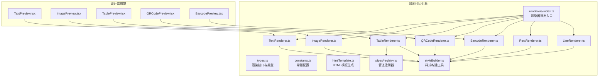
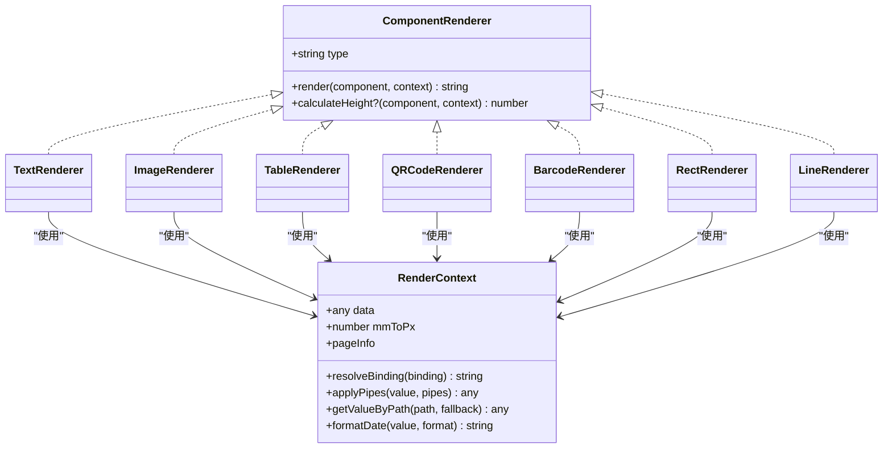
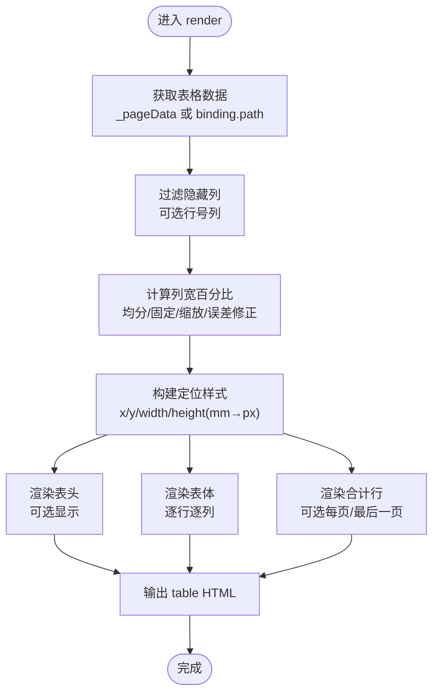
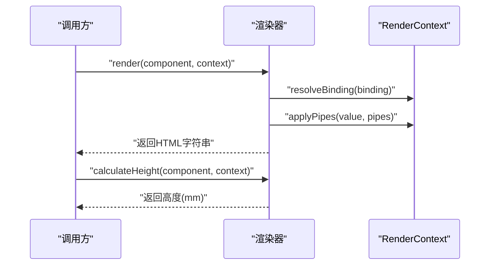
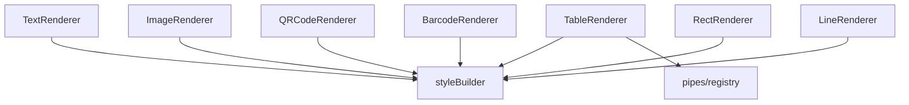

# 渲染器插件架构

<cite>
**本文引用的文件**
- [renderers/index.ts](file://sdk/src/printEngine/renderers/index.ts)
- [types.ts](file://sdk/src/printEngine/types.ts)
- [constants.ts](file://sdk/src/printEngine/constants.ts)
- [htmlTemplate.ts](file://sdk/src/printEngine/htmlTemplate.ts)
- [styleBuilder.ts](file://sdk/src/printEngine/utils/styleBuilder.ts)
- [TextRenderer.ts](file://sdk/src/printEngine/renderers/TextRenderer.ts)
- [ImageRenderer.ts](file://sdk/src/printEngine/renderers/ImageRenderer.ts)
- [TableRenderer.ts](file://sdk/src/printEngine/renderers/TableRenderer.ts)
- [QRCodeRenderer.ts](file://sdk/src/printEngine/renderers/QRCodeRenderer.ts)
- [BarcodeRenderer.ts](file://sdk/src/printEngine/renderers/BarcodeRenderer.ts)
- [RectRenderer.ts](file://sdk/src/printEngine/renderers/RectRenderer.ts)
- [LineRenderer.ts](file://sdk/src/printEngine/renderers/LineRenderer.ts)
- [registry.ts](file://sdk/src/pipes/registry.ts)
- [TextPreview.tsx](file://designer/src/pages/Designer/components/Canvas/componentRenderers/TextPreview.tsx)
- [ImagePreview.tsx](file://designer/src/pages/Designer/components/Canvas/componentRenderers/ImagePreview.tsx)
- [TablePreview.tsx](file://designer/src/pages/Designer/components/Canvas/componentRenderers/TablePreview.tsx)
- [QRCodePreview.tsx](file://designer/src/pages/Designer/components/Canvas/componentRenderers/QRCodePreview.tsx)
- [BarcodePreview.tsx](file://designer/src/pages/Designer/components/Canvas/componentRenderers/BarcodePreview.tsx)
</cite>

## 目录
1. [简介](#简介)
2. [项目结构](#项目结构)
3. [核心组件](#核心组件)
4. [架构总览](#架构总览)
5. [详细组件分析](#详细组件分析)
6. [依赖分析](#依赖分析)
7. [性能考虑](#性能考虑)
8. [故障排查指南](#故障排查指南)
9. [结论](#结论)
10. [附录](#附录)

## 简介
本技术文档围绕“渲染器插件架构”展开，系统阐述了组件类型与渲染器之间的映射关系、插件化扩展机制、标准化渲染接口设计、生命周期与错误处理策略，以及性能优化与自定义渲染器开发指南。重点覆盖文本、图像、表格、二维码、条形码、矩形、线条等七类内置渲染器的实现特点与最佳实践。

## 项目结构
本仓库包含两大部分：
- SDK（打印引擎与渲染器集合）：位于 sdk/ 目录，提供渲染器接口、常量配置、HTML 模板生成、样式构建工具与各组件渲染器实现。
- 设计器（可视化编辑器）：位于 designer/ 目录，提供组件预览与属性面板，与 SDK 渲染器形成前后端协同。

图表来源
- [renderers/index.ts:1-13](file://sdk/src/printEngine/renderers/index.ts#L1-L13)
- [types.ts:58-82](file://sdk/src/printEngine/types.ts#L58-L82)
- [constants.ts:1-113](file://sdk/src/printEngine/constants.ts#L1-L113)
- [htmlTemplate.ts:1-281](file://sdk/src/printEngine/htmlTemplate.ts#L1-L281)
- [styleBuilder.ts:1-54](file://sdk/src/printEngine/utils/styleBuilder.ts#L1-L54)
- [TextRenderer.ts:1-60](file://sdk/src/printEngine/renderers/TextRenderer.ts#L1-L60)
- [ImageRenderer.ts:1-55](file://sdk/src/printEngine/renderers/ImageRenderer.ts#L1-L55)
- [TableRenderer.ts:1-602](file://sdk/src/printEngine/renderers/TableRenderer.ts#L1-L602)
- [QRCodeRenderer.ts:1-63](file://sdk/src/printEngine/renderers/QRCodeRenderer.ts#L1-L63)
- [BarcodeRenderer.ts:1-63](file://sdk/src/printEngine/renderers/BarcodeRenderer.ts#L1-L63)
- [RectRenderer.ts:1-39](file://sdk/src/printEngine/renderers/RectRenderer.ts#L1-L39)
- [LineRenderer.ts:1-59](file://sdk/src/printEngine/renderers/LineRenderer.ts#L1-L59)
- [registry.ts:1-65](file://sdk/src/pipes/registry.ts#L1-L65)
- [TextPreview.tsx:1-31](file://designer/src/pages/Designer/components/Canvas/componentRenderers/TextPreview.tsx#L1-L31)
- [ImagePreview.tsx:1-34](file://designer/src/pages/Designer/components/Canvas/componentRenderers/ImagePreview.tsx#L1-L34)
- [TablePreview.tsx:1-175](file://designer/src/pages/Designer/components/Canvas/componentRenderers/TablePreview.tsx#L1-L175)
- [QRCodePreview.tsx:1-17](file://designer/src/pages/Designer/components/Canvas/componentRenderers/QRCodePreview.tsx#L1-L17)
- [BarcodePreview.tsx:1-26](file://designer/src/pages/Designer/components/Canvas/componentRenderers/BarcodePreview.tsx#L1-L26)

章节来源
- [renderers/index.ts:1-13](file://sdk/src/printEngine/renderers/index.ts#L1-L13)
- [types.ts:58-82](file://sdk/src/printEngine/types.ts#L58-L82)
- [constants.ts:1-113](file://sdk/src/printEngine/constants.ts#L1-L113)
- [htmlTemplate.ts:1-281](file://sdk/src/printEngine/htmlTemplate.ts#L1-L281)
- [styleBuilder.ts:1-54](file://sdk/src/printEngine/utils/styleBuilder.ts#L1-L54)

## 核心组件
- 渲染器接口与上下文
  - ComponentRenderer：标准化渲染器接口，包含 type、render、可选 calculateHeight。
  - RenderContext：提供数据解析、管道应用、路径取值、日期格式化、mm→px 转换、页面信息等能力。
- 渲染器注册与导出
  - renderers/index.ts 导出全部内置渲染器，便于集中引入与扩展。
- 样式与模板
  - styleBuilder：提供样式对象到 CSS 字符串的转换与绝对定位样式构建。
  - htmlTemplate：统一生成打印页面样式与完整 HTML 文档，支持预览与批量打印两种模式。
- 常量与默认配置
  - constants：提供单位换算、组件默认尺寸、表格默认尺寸与样式、条形码/二维码配置等。

章节来源
- [types.ts:58-82](file://sdk/src/printEngine/types.ts#L58-L82)
- [types.ts:11-55](file://sdk/src/printEngine/types.ts#L11-L55)
- [renderers/index.ts:5-12](file://sdk/src/printEngine/renderers/index.ts#L5-L12)
- [styleBuilder.ts:13-53](file://sdk/src/printEngine/utils/styleBuilder.ts#L13-L53)
- [htmlTemplate.ts:81-225](file://sdk/src/printEngine/htmlTemplate.ts#L81-L225)
- [constants.ts:8-113](file://sdk/src/printEngine/constants.ts#L8-L113)

## 架构总览
渲染器插件架构采用“接口标准化 + 插件化导出”的设计，通过 RenderContext 传递上下文，渲染器专注于将组件节点转换为 HTML 片段；HTML 模板生成器负责统一注入样式与页面结构；表格渲染器内置复杂的数据绑定、列宽计算与合计逻辑；二维码/条形码渲染器在浏览器环境中同步生成图片；样式构建工具保证 mm→px 的一致性与样式复用。

图表来源
- [types.ts:58-82](file://sdk/src/printEngine/types.ts#L58-L82)
- [TextRenderer.ts:10-59](file://sdk/src/printEngine/renderers/TextRenderer.ts#L10-L59)
- [ImageRenderer.ts:10-54](file://sdk/src/printEngine/renderers/ImageRenderer.ts#L10-L54)
- [TableRenderer.ts:147-601](file://sdk/src/printEngine/renderers/TableRenderer.ts#L147-L601)
- [QRCodeRenderer.ts:12-62](file://sdk/src/printEngine/renderers/QRCodeRenderer.ts#L12-L62)
- [BarcodeRenderer.ts:12-62](file://sdk/src/printEngine/renderers/BarcodeRenderer.ts#L12-L62)
- [RectRenderer.ts:10-38](file://sdk/src/printEngine/renderers/RectRenderer.ts#L10-L38)
- [LineRenderer.ts:10-58](file://sdk/src/printEngine/renderers/LineRenderer.ts#L10-L58)

## 详细组件分析

### 渲染器注册器模式与映射关系
- 注册与导出
  - renderers/index.ts 将各组件渲染器集中导出，便于上层按需引入与扩展。
  - types.ts 定义 ComponentRenderer 接口，确保所有渲染器具备统一的 type 与 render 方法。
- 组件类型与渲染器映射
  - 文本：type='text'
  - 图像：type='image'
  - 表格：type='table'
  - 二维码：type='qrcode'
  - 条形码：type='barcode'
  - 矩形：type='rect'
  - 线条：type='line'

章节来源
- [renderers/index.ts:5-12](file://sdk/src/printEngine/renderers/index.ts#L5-L12)
- [types.ts:61-73](file://sdk/src/printEngine/types.ts#L61-L73)

### 文本渲染器（TextRenderer）
- 设计要点
  - 使用 flex 布局实现文本对齐，支持 label 前缀拼接。
  - 通过 styleBuilder 构建定位与文本样式，确保 mm→px 一致。
  - calculateHeight 返回布局高度或默认值。
- 上下文使用
  - 通过 RenderContext.resolveBinding 获取绑定值，支持 props.text 作为回退。
- HTML 输出约定
  - 返回一个 div 容器，内部承载文本内容，样式字符串由 buildStyleString 生成。

章节来源
- [TextRenderer.ts:13-53](file://sdk/src/printEngine/renderers/TextRenderer.ts#L13-L53)
- [TextRenderer.ts:55-58](file://sdk/src/printEngine/renderers/TextRenderer.ts#L55-L58)
- [styleBuilder.ts:13-53](file://sdk/src/printEngine/utils/styleBuilder.ts#L13-L53)

### 图像渲染器（ImageRenderer）
- 设计要点
  - 优先使用绑定值作为图片源，否则回退到 props.src。
  - 容器使用绝对定位，img 强制 100% 尺寸与 object-fit 控制裁剪。
  - 无图片时返回占位提示。
- HTML 输出约定
  - 返回容器 div 包裹 img 标签，或占位文本。

章节来源
- [ImageRenderer.ts:13-49](file://sdk/src/printEngine/renderers/ImageRenderer.ts#L13-L49)
- [ImageRenderer.ts:51-53](file://sdk/src/printEngine/renderers/ImageRenderer.ts#L51-L53)

### 表格渲染器（TableRenderer）
- 设计要点
  - 列宽计算：支持全部未设宽均分、部分固定列、固定列总和超限的两种场景（按比例缩放或给未固定列最小份额），并保证最后一列吸收舍入误差使总和为 100%。
  - 数据绑定：优先使用 _pageData（跨页拆分）或 binding.path 的完整数据；支持行号列、表头显示、边框与单元格内边距。
  - 合计与额外行：支持 sum/avg/max/min/count 等汇总，支持管道转换与额外行组合。
  - XSS 防护：对单元格内容进行 HTML 转义。
- 错误处理
  - 合计计算异常与格式化失败时返回友好提示。
- 性能与分页
  - calculateHeight 提供估算高度，实际分页使用行高测量。
- HTML 输出约定
  - 返回 table 元素，包含 thead/tbody/tfoot（如有合计）。

图表来源
- [TableRenderer.ts:150-327](file://sdk/src/printEngine/renderers/TableRenderer.ts#L150-L327)
- [TableRenderer.ts:51-125](file://sdk/src/printEngine/renderers/TableRenderer.ts#L51-L125)
- [TableRenderer.ts:332-385](file://sdk/src/printEngine/renderers/TableRenderer.ts#L332-L385)
- [TableRenderer.ts:468-579](file://sdk/src/printEngine/renderers/TableRenderer.ts#L468-L579)

章节来源
- [TableRenderer.ts:147-601](file://sdk/src/printEngine/renderers/TableRenderer.ts#L147-L601)

### 二维码渲染器（QRCodeRenderer）
- 设计要点
  - 使用 qrcode 库在内存 canvas 同步生成二维码，转换为 base64 并直接嵌入 img 标签。
  - 尺寸以布局宽度为主，高度与宽度一致（正方形）。
- 错误处理
  - 生成失败时返回带边框的占位提示。
- HTML 输出约定
  - 返回 img 标签，样式由定位样式与块级显示组成。

章节来源
- [QRCodeRenderer.ts:15-57](file://sdk/src/printEngine/renderers/QRCodeRenderer.ts#L15-L57)
- [QRCodeRenderer.ts:59-61](file://sdk/src/printEngine/renderers/QRCodeRenderer.ts#L59-L61)

### 条形码渲染器（BarcodeRenderer）
- 设计要点
  - 使用 jsbarcode 在内存 canvas 同步生成条形码，转换为 base64 并嵌入 img 标签。
  - 支持 format、width、height 等配置。
- 错误处理
  - 生成失败时返回占位提示。
- HTML 输出约定
  - 返回 img 标签，样式由定位样式与块级显示组成。

章节来源
- [BarcodeRenderer.ts:15-57](file://sdk/src/printEngine/renderers/BarcodeRenderer.ts#L15-L57)
- [BarcodeRenderer.ts:59-61](file://sdk/src/printEngine/renderers/BarcodeRenderer.ts#L59-L61)

### 矩形渲染器（RectRenderer）
- 设计要点
  - 使用绝对定位容器，支持边框与背景色，默认尺寸来自常量。
- HTML 输出约定
  - 返回空 div，样式由定位与边框/背景组成。

章节来源
- [RectRenderer.ts:13-33](file://sdk/src/printEngine/renderers/RectRenderer.ts#L13-L33)
- [RectRenderer.ts:35-37](file://sdk/src/printEngine/renderers/RectRenderer.ts#L35-L37)

### 线条渲染器（LineRenderer）
- 设计要点
  - 使用双层结构：外层容器用于占据布局空间并居中，内层使用 border 实现线条。
  - 支持 horizontal/vertical 方向切换。
- HTML 输出约定
  - 返回外层容器包裹内层线条的结构。

章节来源
- [LineRenderer.ts:13-51](file://sdk/src/printEngine/renderers/LineRenderer.ts#L13-L51)
- [LineRenderer.ts:53-57](file://sdk/src/printEngine/renderers/LineRenderer.ts#L53-L57)

### 渲染器接口标准化设计
- render 方法参数规范
  - component：组件节点，包含 layout、style、props、binding 等字段。
  - context：渲染上下文，提供数据解析、管道应用、路径取值、日期格式化、mmToPx、pageInfo 等。
- 上下文传递机制
  - resolveBinding：解析数据绑定，支持 fallback。
  - applyPipes：应用管道转换（与管道注册器配合）。
  - getValueByPath：按路径取值，支持嵌套。
  - formatDate：统一日期格式化。
  - mmToPx：统一单位换算系数。
  - pageInfo：页面尺寸与页边距，用于布局约束与溢出检测。
- HTML 输出约定
  - 所有渲染器返回字符串形式的 HTML 片段，由 HTML 模板生成器统一包裹到完整文档中。

章节来源
- [types.ts:11-55](file://sdk/src/printEngine/types.ts#L11-L55)
- [types.ts:61-82](file://sdk/src/printEngine/types.ts#L61-L82)

### 生命周期管理与分页
- calculateHeight
  - 文本、图像、矩形、线条、二维码、条形码：返回组件高度（mm）。
  - 表格：提供估算高度，实际分页通过行高测量与跨页数据（_pageData）控制。
- 分页流程（概念示意）
  - 预估每页组件高度，遇到表格时根据行高动态测量。
  - 表格跨页时，通过 props._pageData 与 _startRowIndex、_isLastPage 等标记控制渲染。

图表来源
- [types.ts:73-81](file://sdk/src/printEngine/types.ts#L73-L81)
- [TextRenderer.ts:55-58](file://sdk/src/printEngine/renderers/TextRenderer.ts#L55-L58)
- [ImageRenderer.ts:51-53](file://sdk/src/printEngine/renderers/ImageRenderer.ts#L51-L53)
- [RectRenderer.ts:35-37](file://sdk/src/printEngine/renderers/RectRenderer.ts#L35-L37)
- [LineRenderer.ts:53-57](file://sdk/src/printEngine/renderers/LineRenderer.ts#L53-L57)
- [QRCodeRenderer.ts:59-61](file://sdk/src/printEngine/renderers/QRCodeRenderer.ts#L59-L61)
- [BarcodeRenderer.ts:59-61](file://sdk/src/printEngine/renderers/BarcodeRenderer.ts#L59-L61)
- [TableRenderer.ts:581-600](file://sdk/src/printEngine/renderers/TableRenderer.ts#L581-L600)

### 错误处理策略
- 表格渲染
  - 合计计算异常与格式化失败时返回友好提示，避免中断渲染。
  - 列宽计算与溢出检测：当 xMm + widthMm 超过右页边距时自动调整宽度并发出警告。
- 二维码/条形码
  - 生成失败时返回占位提示，避免空白区域影响预览。
- 通用建议
  - 对外部依赖（canvas、第三方库）进行 try/catch 包裹，并记录日志以便定位问题。

章节来源
- [TableRenderer.ts:429-463](file://sdk/src/printEngine/renderers/TableRenderer.ts#L429-L463)
- [TableRenderer.ts:200-228](file://sdk/src/printEngine/renderers/TableRenderer.ts#L200-L228)
- [QRCodeRenderer.ts:52-56](file://sdk/src/printEngine/renderers/QRCodeRenderer.ts#L52-L56)
- [BarcodeRenderer.ts:52-56](file://sdk/src/printEngine/renderers/BarcodeRenderer.ts#L52-L56)

### 性能优化方案
- 样式构建复用
  - 使用 buildStyleString 与 buildPositionStyle 统一生成 CSS，减少重复计算。
- 单位换算集中化
  - 通过 mmToPx 常量统一换算，避免重复计算与误差累积。
- 表格列宽计算
  - 预先计算列宽百分比，避免运行时重复计算。
- 合计计算精度
  - 使用 decimal.js 避免浮点精度问题，提升合计准确性。
- 预览与打印分离
  - htmlTemplate 提供预览与批量打印两种样式，减少不必要的 DOM 重绘。

章节来源
- [styleBuilder.ts:13-53](file://sdk/src/printEngine/utils/styleBuilder.ts#L13-L53)
- [constants.ts:8](file://sdk/src/printEngine/constants.ts#L8)
- [TableRenderer.ts:51-125](file://sdk/src/printEngine/renderers/TableRenderer.ts#L51-L125)
- [TableRenderer.ts:390-463](file://sdk/src/printEngine/renderers/TableRenderer.ts#L390-L463)
- [htmlTemplate.ts:81-225](file://sdk/src/printEngine/htmlTemplate.ts#L81-L225)

### 自定义渲染器开发指南与扩展最佳实践
- 实现步骤
  - 新建类实现 ComponentRenderer 接口，设置 type 与 render 方法；如需分页，实现 calculateHeight。
  - 使用 RenderContext 解析绑定、应用管道、取值与格式化。
  - 使用 styleBuilder 构建定位与样式，返回 HTML 字符串。
  - 在 renderers/index.ts 中导出自定义渲染器，便于统一引入。
- 最佳实践
  - 统一使用 mm→px 换算，避免混用像素与毫米导致布局偏差。
  - 对外部资源（图片、二维码、条形码）进行容错处理与占位提示。
  - 表格类组件优先支持列宽计算、溢出检测与合计功能。
  - 通过 constants.ts 定义默认尺寸与样式，保持一致性。
- 前端预览协同
  - 设计器组件预览（如 TextPreview、ImagePreview、TablePreview、QRCodePreview、BarcodePreview）应与渲染器输出风格保持一致，便于设计师校验。

章节来源
- [types.ts:61-82](file://sdk/src/printEngine/types.ts#L61-L82)
- [styleBuilder.ts:31-53](file://sdk/src/printEngine/utils/styleBuilder.ts#L31-L53)
- [renderers/index.ts:5-12](file://sdk/src/printEngine/renderers/index.ts#L5-L12)
- [constants.ts:13-92](file://sdk/src/printEngine/constants.ts#L13-L92)
- [TextPreview.tsx:10-30](file://designer/src/pages/Designer/components/Canvas/componentRenderers/TextPreview.tsx#L10-L30)
- [ImagePreview.tsx:10-33](file://designer/src/pages/Designer/components/Canvas/componentRenderers/ImagePreview.tsx#L10-L33)
- [TablePreview.tsx:69-174](file://designer/src/pages/Designer/components/Canvas/componentRenderers/TablePreview.tsx#L69-L174)
- [QRCodePreview.tsx:11-16](file://designer/src/pages/Designer/components/Canvas/componentRenderers/QRCodePreview.tsx#L11-L16)
- [BarcodePreview.tsx:11-25](file://designer/src/pages/Designer/components/Canvas/componentRenderers/BarcodePreview.tsx#L11-L25)

## 依赖分析
- 组件耦合
  - 渲染器之间低耦合，均依赖 RenderContext 与 styleBuilder。
  - 表格渲染器依赖管道注册器 registry.ts 以支持合计与额外行的管道转换。
- 外部依赖
  - qrcode、jsbarcode：用于二维码与条形码生成。
  - decimal.js：用于表格合计的高精度计算。
- 潜在风险
  - 外部库生成失败时需有降级策略（占位提示）。
  - 表格列宽计算逻辑复杂，需确保边界条件与精度控制。

图表来源
- [TableRenderer.ts:10](file://sdk/src/printEngine/renderers/TableRenderer.ts#L10)
- [registry.ts:7-8](file://sdk/src/pipes/registry.ts#L7-L8)
- [styleBuilder.ts:7-8](file://sdk/src/printEngine/utils/styleBuilder.ts#L7-L8)

章节来源
- [TableRenderer.ts:10](file://sdk/src/printEngine/renderers/TableRenderer.ts#L10)
- [registry.ts:1-65](file://sdk/src/pipes/registry.ts#L1-L65)
- [styleBuilder.ts:1-54](file://sdk/src/printEngine/utils/styleBuilder.ts#L1-L54)

## 性能考虑
- 样式与定位
  - 使用 buildPositionStyle 与 buildStyleString 统一生成，减少字符串拼接与重复计算。
- 单位换算
  - 通过 mmToPx 常量集中换算，避免多次计算。
- 表格渲染
  - 列宽预计算与合计使用 decimal.js，降低精度误差带来的重复计算。
- 预览与打印
  - htmlTemplate 提供预览与批量打印两种样式，减少不必要的 DOM 变更。

## 故障排查指南
- 表格溢出与列宽异常
  - 现象：表格右侧溢出或列宽异常。
  - 处理：检查 xMm 与 widthMm 是否超过右页边距；确认列宽计算逻辑与百分比总和。
- 合计计算错误
  - 现象：合计显示“计算错误”或空值。
  - 处理：检查数据路径、数值类型与精度；确认管道配置正确。
- 二维码/条形码为空
  - 现象：二维码/条形码区域显示占位提示。
  - 处理：检查绑定值或默认内容；确认 canvas 生成过程无异常。
- 预览与打印差异
  - 现象：预览与打印样式不一致。
  - 处理：确认使用 generatePrintPageStyles 与 generateBatchPrintStyles 的正确性。

章节来源
- [TableRenderer.ts:200-228](file://sdk/src/printEngine/renderers/TableRenderer.ts#L200-L228)
- [TableRenderer.ts:429-463](file://sdk/src/printEngine/renderers/TableRenderer.ts#L429-L463)
- [QRCodeRenderer.ts:52-56](file://sdk/src/printEngine/renderers/QRCodeRenderer.ts#L52-L56)
- [BarcodeRenderer.ts:52-56](file://sdk/src/printEngine/renderers/BarcodeRenderer.ts#L52-L56)
- [htmlTemplate.ts:81-225](file://sdk/src/printEngine/htmlTemplate.ts#L81-L225)

## 结论
该渲染器插件架构通过标准化接口、统一上下文与样式构建工具，实现了组件类型与渲染器的清晰映射与良好扩展性。内置渲染器覆盖常见打印场景，表格渲染器具备复杂的列宽计算与合计能力，二维码/条形码渲染器在浏览器端同步生成图片，HTML 模板生成器统一了预览与批量打印的样式。遵循本文的最佳实践与性能优化建议，可快速扩展自定义渲染器并保障稳定性与一致性。

## 附录
- 常用配置与默认值
  - 单位换算：1mm ≈ 3.78px
  - 组件默认尺寸：文本、图片、矩形、线条、二维码、条形码、表格
  - 表格默认样式：字体大小、边框颜色、表头背景、单元格内边距
  - 条形码/二维码默认配置：格式、高度比例、默认内容
- 管道注册器
  - registry.ts 提供执行器注册、获取与执行能力，支持日期、货币、中文大写等内置管道。

章节来源
- [constants.ts:8](file://sdk/src/printEngine/constants.ts#L8)
- [constants.ts:13-92](file://sdk/src/printEngine/constants.ts#L13-L92)
- [registry.ts:17-65](file://sdk/src/pipes/registry.ts#L17-L65)