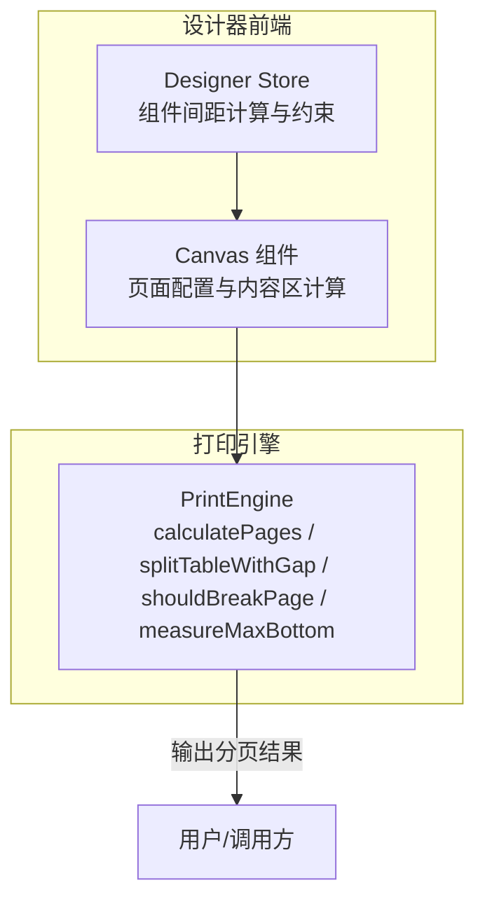
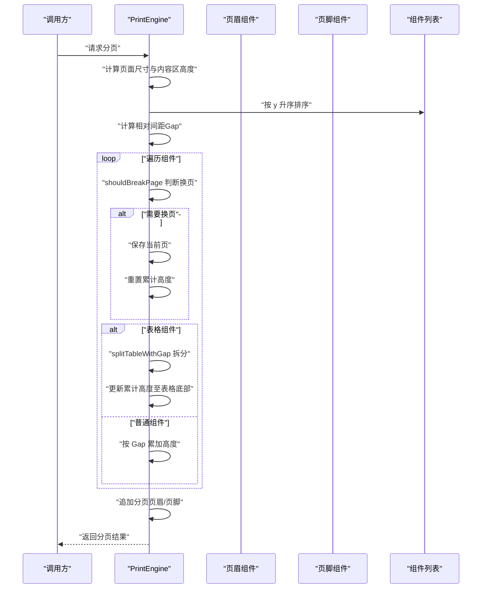
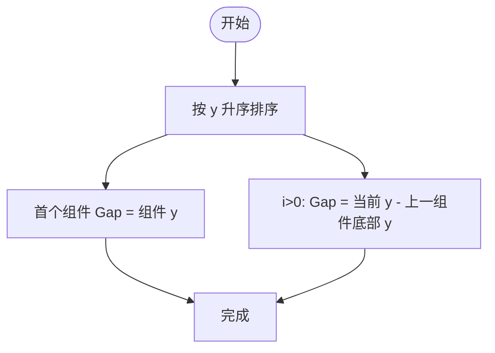
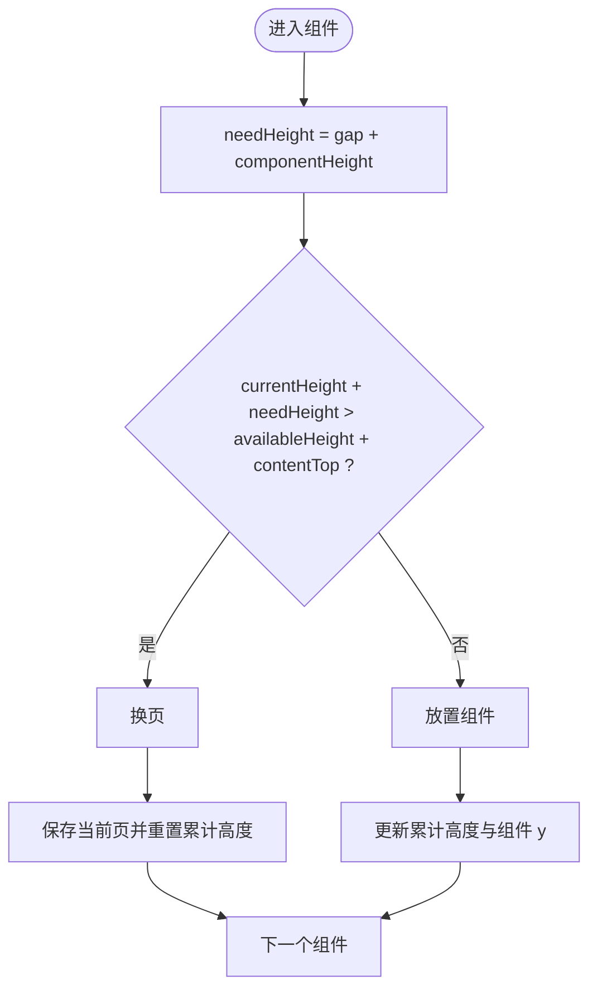
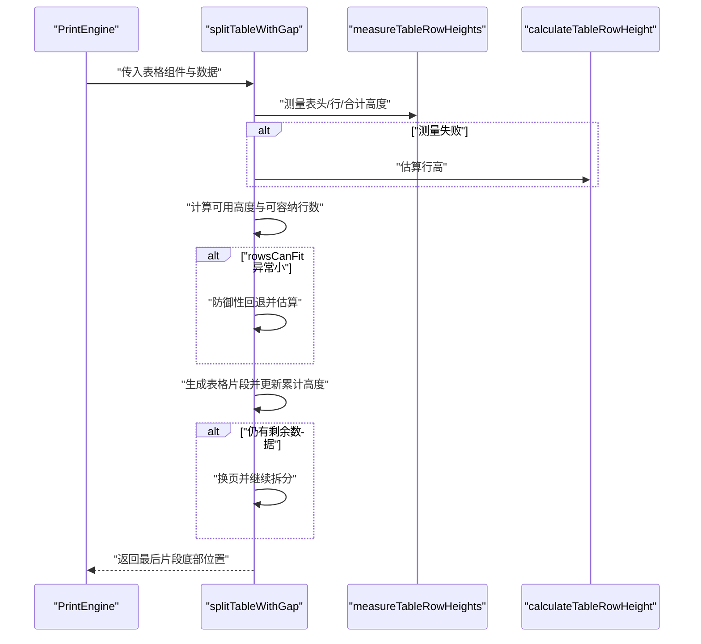
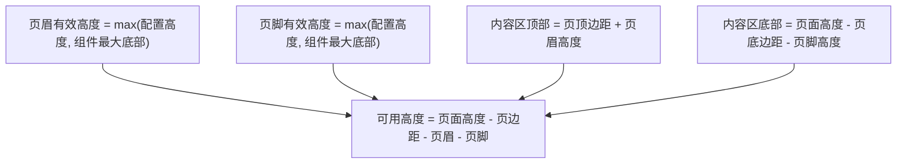
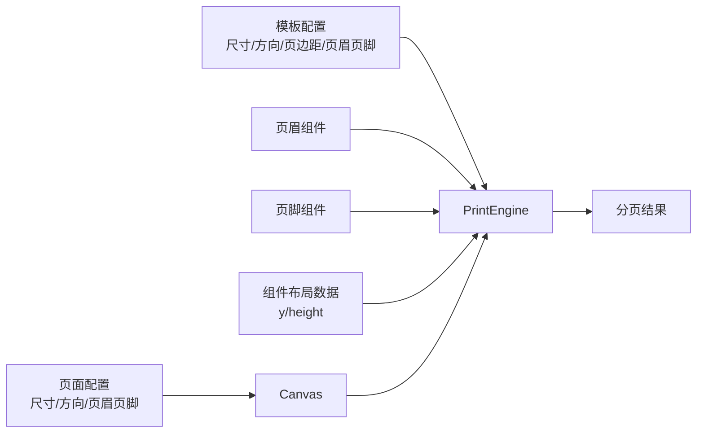

# 相对间距分页模型

<cite>
**本文引用的文件**
- [printEngine.ts](file://sdk/src/printEngine.ts)
- [index.tsx](file://designer/src/pages/Designer/components/Canvas/index.tsx)
- [designer.ts](file://designer/src/store/designer.ts)
</cite>

## 目录
1. [引言](#引言)
2. [项目结构](#项目结构)
3. [核心组件](#核心组件)
4. [架构总览](#架构总览)
5. [详细组件分析](#详细组件分析)
6. [依赖关系分析](#依赖关系分析)
7. [性能考量](#性能考量)
8. [故障排查指南](#故障排查指南)
9. [结论](#结论)
10. [附录](#附录)

## 引言
本技术文档围绕“相对间距分页模型”展开，系统阐述基于组件间相对距离（Gap）进行智能分页计算的设计理念与实现细节。该模型通过“相对间距”这一核心参数，将组件布局的“设计意图”转化为可执行的分页策略，从而在不同页面尺寸、页眉页脚、连续纸模式等复杂场景下，仍能保持稳定的分页行为。

## 项目结构
本仓库中与相对间距分页模型直接相关的代码主要分布在以下模块：
- 打印引擎：负责页面尺寸计算、页眉页脚高度推断、组件排序与相对间距计算、虚拟分页与表格跨页拆分、换页决策与最终页面组装。
- 设计器前端：负责页面配置（尺寸、方向、页眉页脚开关与高度、连续纸模式）、内容区约束与布局网格等。
- 设计器状态管理：提供组件拖拽与间距计算能力，便于在设计阶段生成合理的相对间距布局。

图表来源
- [printEngine.ts:418-620](file://sdk/src/printEngine.ts#L418-L620)
- [index.tsx:659-710](file://designer/src/pages/Designer/components/Canvas/index.tsx#L659-L710)
- [designer.ts:746-766](file://designer/src/store/designer.ts#L746-L766)

章节来源
- [printEngine.ts:223-240](file://sdk/src/printEngine.ts#L223-L240)
- [index.tsx:659-710](file://designer/src/pages/Designer/components/Canvas/index.tsx#L659-L710)
- [designer.ts:746-766](file://designer/src/store/designer.ts#L746-L766)

## 核心组件
- 相对间距计算器：对组件序列按 y 坐标升序排列后，计算相邻组件之间的相对间距（Gap）。首个组件的 Gap 为其到页面顶部的距离；其余组件的 Gap 为当前组件顶部坐标减去前一组件底部坐标，允许负值以表达重叠。
- 虚拟分页引擎：维护当前页累计高度（含页头），逐个评估组件是否应换页；普通组件按 Gap 累加，表格组件走专用的跨页拆分流程。
- 表格跨页拆分器：根据表头、行、合计行的实际测量高度，结合页头/页脚与安全余量，动态确定每页可容纳的行数，并支持“每页显示合计”和“总计模式”的差异处理。
- 换页决策器：统一到绝对坐标系，比较“当前高度 + 组件高度 + 间距”与“可用高度 + 内容区顶部”的阈值，决定是否换页。
- 页眉页脚适配器：通过测量页眉/页脚组件的最大底部位置，推断其实际占用高度，参与可用内容高度的计算。

章节来源
- [printEngine.ts:418-620](file://sdk/src/printEngine.ts#L418-L620)
- [printEngine.ts:762-998](file://sdk/src/printEngine.ts#L762-L998)
- [printEngine.ts:250-261](file://sdk/src/printEngine.ts#L250-L261)
- [printEngine.ts:406-409](file://sdk/src/printEngine.ts#L406-L409)

## 架构总览
相对间距分页模型的运行流程如下：
- 输入：组件列表、页眉/页脚组件、模板页面配置（尺寸、方向、页边距、页眉页脚开关与高度）。
- 处理：
  - 计算页面尺寸与内容区高度（考虑页眉/页脚与页边距）。
  - 组件排序与相对间距计算。
  - 遍历组件，依据相对间距与组件高度进行累加与换页判断。
  - 表格组件走专用拆分流程，保证表头重复与合计行正确放置。
- 输出：按页分割的组件数组，每页附加页眉/页脚。

图表来源
- [printEngine.ts:418-620](file://sdk/src/printEngine.ts#L418-L620)
- [printEngine.ts:762-998](file://sdk/src/printEngine.ts#L762-L998)
- [printEngine.ts:250-261](file://sdk/src/printEngine.ts#L250-L261)

## 详细组件分析

### 相对间距计算与排序
- 排序策略：按组件布局的 y 坐标升序排列，确保从上到下的顺序一致性。
- 相对间距定义：
  - 首个组件：Gap = 组件顶部 y 坐标。
  - 其他组件：Gap = 当前组件顶部 y - 上一组件底部 y。该定义允许负值，体现设计阶段允许的组件重叠。
- 设计意图保留：采用“设计时 Gap”，即不改变布局设计，仅在分页时按此相对关系进行累加。

图表来源
- [printEngine.ts:447-471](file://sdk/src/printEngine.ts#L447-L471)

章节来源
- [printEngine.ts:447-471](file://sdk/src/printEngine.ts#L447-L471)

### 虚拟分页与换页决策
- 累计高度：以“内容区顶部”为基准，记录当前页累计高度（含页头）。
- 换页条件：将“可用高度 + 内容区顶部”转换为绝对坐标系，比较“当前高度 + 组件高度 + 间距”与阈值，决定是否换页。
- 特殊处理：
  - 新页面第一个组件：若非首组件，仍应用 Gap，以保持设计时相对间距的一致性。
  - 表格组件：交由专用拆分器处理，结束后将累计高度更新为表格片段底部，确保后续组件的相对间距连续。

图表来源
- [printEngine.ts:250-261](file://sdk/src/printEngine.ts#L250-L261)
- [printEngine.ts:548-580](file://sdk/src/printEngine.ts#L548-L580)

章节来源
- [printEngine.ts:250-261](file://sdk/src/printEngine.ts#L250-L261)
- [printEngine.ts:548-580](file://sdk/src/printEngine.ts#L548-L580)

### 表格跨页拆分器
- 流程概览：
  - 读取表格数据，测量表头、行、合计行的实际高度；若测量失败，回退到估算行高。
  - 计算每页可用高度（含表头/合计行预留与安全余量），按行高累加确定可容纳行数。
  - 支持“每页显示合计”与“总计模式”的差异：前者在中间页预留合计行高度，后者仅在最后一页显示。
  - 若 rowsCanFit 异常小，触发防御性检查并回退到估算行高；若仍无法容纳，强制至少放 1 行以避免死循环。
  - 将表格拆分为多个片段，每个片段携带起始行索引、数据切片与是否最后一页等信息。
- 关键点：
  - 首个片段在非首组件场景下需考虑 Gap 的影响。
  - 最后一页在“总计模式”下，若合计行导致溢出，会主动减少一行数据以保证完整显示。

图表来源
- [printEngine.ts:762-998](file://sdk/src/printEngine.ts#L762-L998)

章节来源
- [printEngine.ts:762-998](file://sdk/src/printEngine.ts#L762-L998)

### 页眉页脚对可用高度的影响
- 页眉/页脚有效高度：取“配置高度”与“组件最大底部位置”中的较大者，避免因组件为空或高度为 0 导致误判。
- 可用内容高度：页面高度 - 页边距 - 页眉高度 - 页脚高度。
- 内容区顶部：页顶边距 + 页眉高度；内容区底部：页面高度 - 页底边距 - 页脚高度。
- 分页时，表格拆分器使用内容区上下边界进行高度校验，普通组件则统一到绝对坐标系进行换页判断。

图表来源
- [printEngine.ts:434-445](file://sdk/src/printEngine.ts#L434-L445)
- [printEngine.ts:778-788](file://sdk/src/printEngine.ts#L778-L788)

章节来源
- [printEngine.ts:434-445](file://sdk/src/printEngine.ts#L434-L445)
- [printEngine.ts:778-788](file://sdk/src/printEngine.ts#L778-L788)

### 连续纸模式的特殊处理
- 连续纸模式不分页：当页面尺寸为连续纸或高度为无穷大时，直接返回整页组件列表。
- 设计器侧配合：在计算内容区高度时，连续纸模式下将页面高度设为足够大的固定值，确保布局与预览一致。

章节来源
- [printEngine.ts:426-429](file://sdk/src/printEngine.ts#L426-L429)
- [index.tsx:664-666](file://designer/src/pages/Designer/components/Canvas/index.tsx#L664-L666)

### 边界条件与警告机制
- 组件高度接近可用高度：当组件高度超过可用高度的 80% 时，输出警告，提示可能影响分页效果。
- 表格异常情况：rowsCanFit 异常小或测量失败时，触发防御性检查并回退到估算行高；若仍无法容纳，强制至少放 1 行，避免死循环。

章节来源
- [printEngine.ts:491-496](file://sdk/src/printEngine.ts#L491-L496)
- [printEngine.ts:861-872](file://sdk/src/printEngine.ts#L861-L872)
- [printEngine.ts:915-935](file://sdk/src/printEngine.ts#L915-L935)

### 设计阶段的相对间距生成
- 设计器在多选组件时，按“首尾组件相对位置 - 总宽度/高度”计算平均间距，再依次设置各组件的 x/y 坐标，形成稳定的相对间距布局，为打印分页提供良好基础。

章节来源
- [designer.ts:746-766](file://designer/src/store/designer.ts#L746-L766)

## 依赖关系分析
- 打印引擎依赖：
  - 页面尺寸与方向：来自模板配置，支持 A4/A3/自定义/连续纸。
  - 页眉页脚组件：用于推断实际占用高度。
  - 组件布局数据：包含 y 与 height，用于排序与 Gap 计算。
- 设计器前端依赖：
  - 页面配置：尺寸、方向、页边距、页眉页脚开关与高度。
  - 内容区约束：根据页眉/页脚与页边距计算内容区范围，限制组件放置区域。

图表来源
- [printEngine.ts:418-620](file://sdk/src/printEngine.ts#L418-L620)
- [index.tsx:659-710](file://designer/src/pages/Designer/components/Canvas/index.tsx#L659-L710)

章节来源
- [printEngine.ts:418-620](file://sdk/src/printEngine.ts#L418-L620)
- [index.tsx:659-710](file://designer/src/pages/Designer/components/Canvas/index.tsx#L659-L710)

## 性能考量
- 时间复杂度
  - 组件排序：O(n log n)。
  - 相对间距计算：O(n)。
  - 普通组件遍历与换页：O(n)。
  - 表格拆分：对每页进行行高累加，最坏 O(n)；若数据量大，可考虑分批处理或缓存测量结果。
- 空间复杂度
  - 临时存储 pages、currentPage 与中间变量，空间复杂度 O(n)。
- 优化建议
  - 预先缓存组件高度：对静态组件或已知高度的组件，提前计算并缓存，减少运行时测量开销。
  - 批量表格测量：在表格数据量较大时，采用分段测量与增量缓存，降低 splitTableWithGap 的重复计算。
  - 早期剪枝：在 shouldBreakPage 中快速判断极端情况（如组件高度远超可用高度），尽早换页。
  - 并发测量：在支持异步测量的环境下，对表格行高测量进行并发化（注意 DOM/渲染上下文限制）。

## 故障排查指南
- 组件被截断或挤出页面
  - 检查组件高度是否接近可用高度（触发 80% 警告）。
  - 确认页眉/页脚高度是否过大，导致可用高度不足。
- 表格跨页异常
  - 观察 rowsCanFit 是否异常小，确认是否触发防御性回退。
  - 检查合计行模式（page/total）与 showSummary 配置是否合理。
- 组件重叠导致的间距异常
  - 确认 Gap 是否为负值（设计允许重叠），并在分页时按设计 Gap 累加。
- 连续纸模式未分页
  - 确认页面尺寸配置为连续纸或高度为无穷大，此时不分页为预期行为。

章节来源
- [printEngine.ts:491-496](file://sdk/src/printEngine.ts#L491-L496)
- [printEngine.ts:861-872](file://sdk/src/printEngine.ts#L861-L872)
- [printEngine.ts:915-935](file://sdk/src/printEngine.ts#L915-L935)
- [printEngine.ts:426-429](file://sdk/src/printEngine.ts#L426-L429)

## 结论
相对间距分页模型以“设计时相对间距”为核心，结合页眉页脚高度推断与可用内容高度计算，在普通组件与表格组件上实现了稳定、可预测的分页行为。通过表格专用拆分器与换页决策器，系统在复杂场景下仍能保持良好的分页质量；同时，边界条件与警告机制有助于及时发现潜在问题。配合设计器端的间距生成与内容区约束，整体方案在设计与打印之间建立了清晰的桥梁。

## 附录
- 关键流程路径参考
  - 相对间距计算与排序：[printEngine.ts:447-471](file://sdk/src/printEngine.ts#L447-L471)
  - 换页决策：[printEngine.ts:250-261](file://sdk/src/printEngine.ts#L250-L261)
  - 虚拟分页主流程：[printEngine.ts:418-620](file://sdk/src/printEngine.ts#L418-L620)
  - 表格跨页拆分：[printEngine.ts:762-998](file://sdk/src/printEngine.ts#L762-L998)
  - 页眉页脚高度推断：[printEngine.ts:434-445](file://sdk/src/printEngine.ts#L434-L445)
  - 连续纸模式处理：[printEngine.ts:426-429](file://sdk/src/printEngine.ts#L426-L429)
  - 设计阶段相对间距生成：[designer.ts:746-766](file://designer/src/store/designer.ts#L746-L766)
  - 页面配置与内容区计算：[index.tsx:659-710](file://designer/src/pages/Designer/components/Canvas/index.tsx#L659-L710)