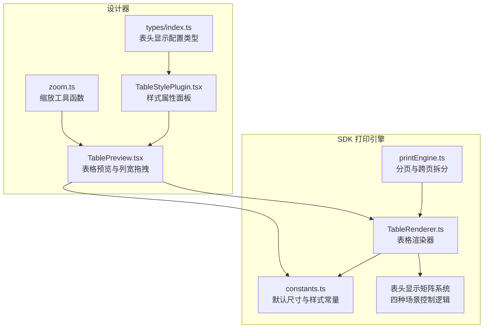
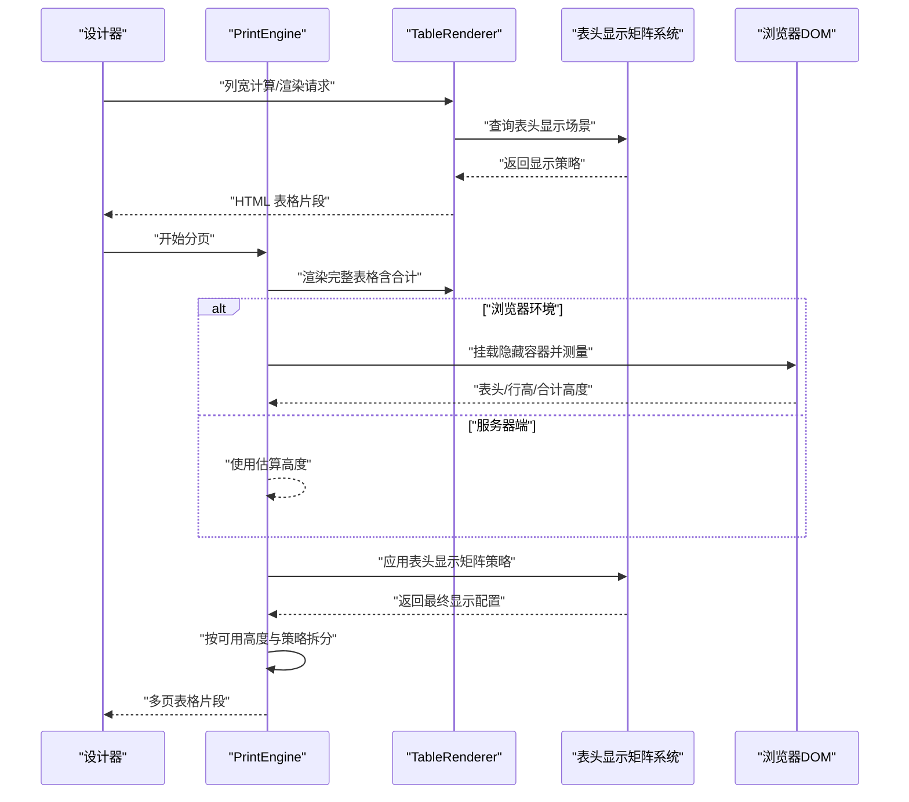
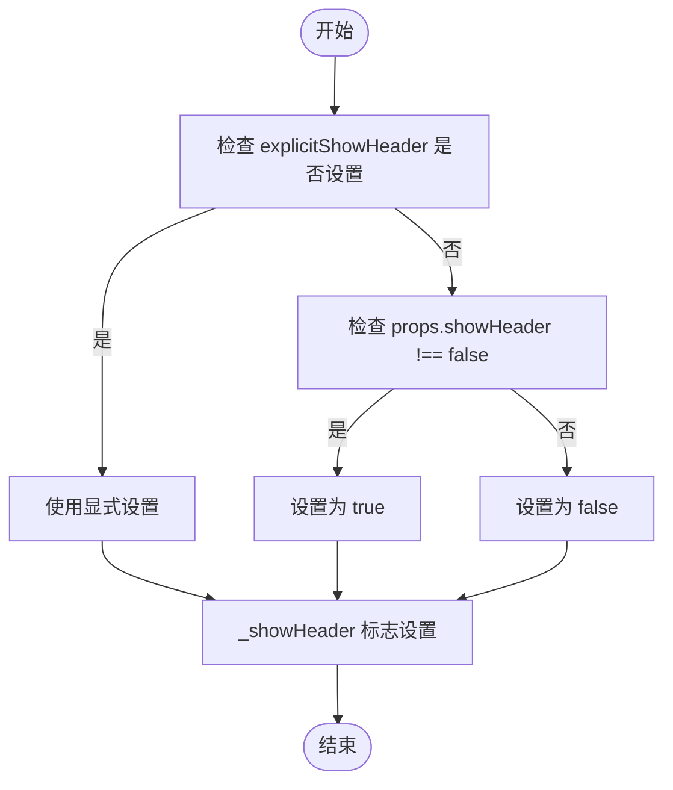
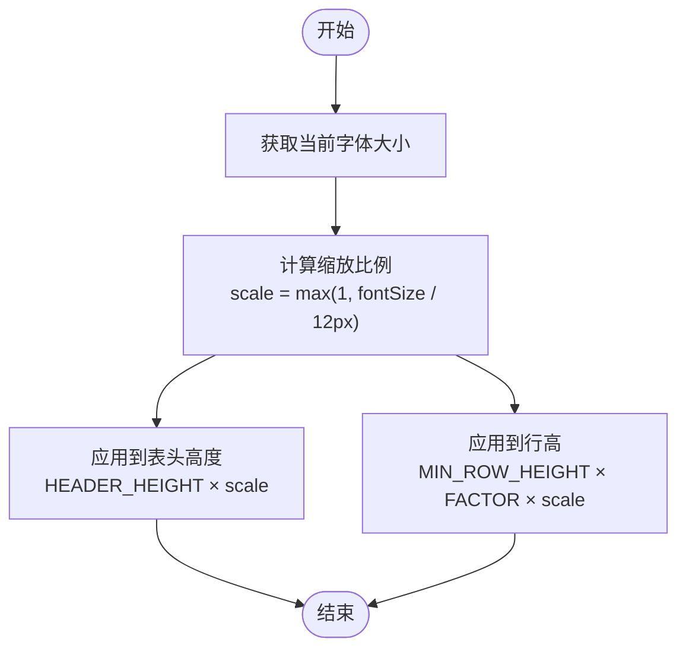
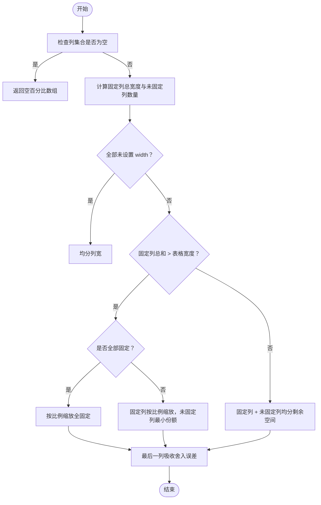
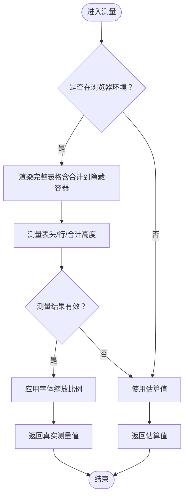
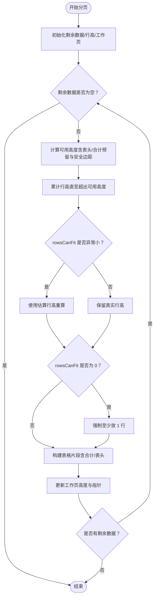
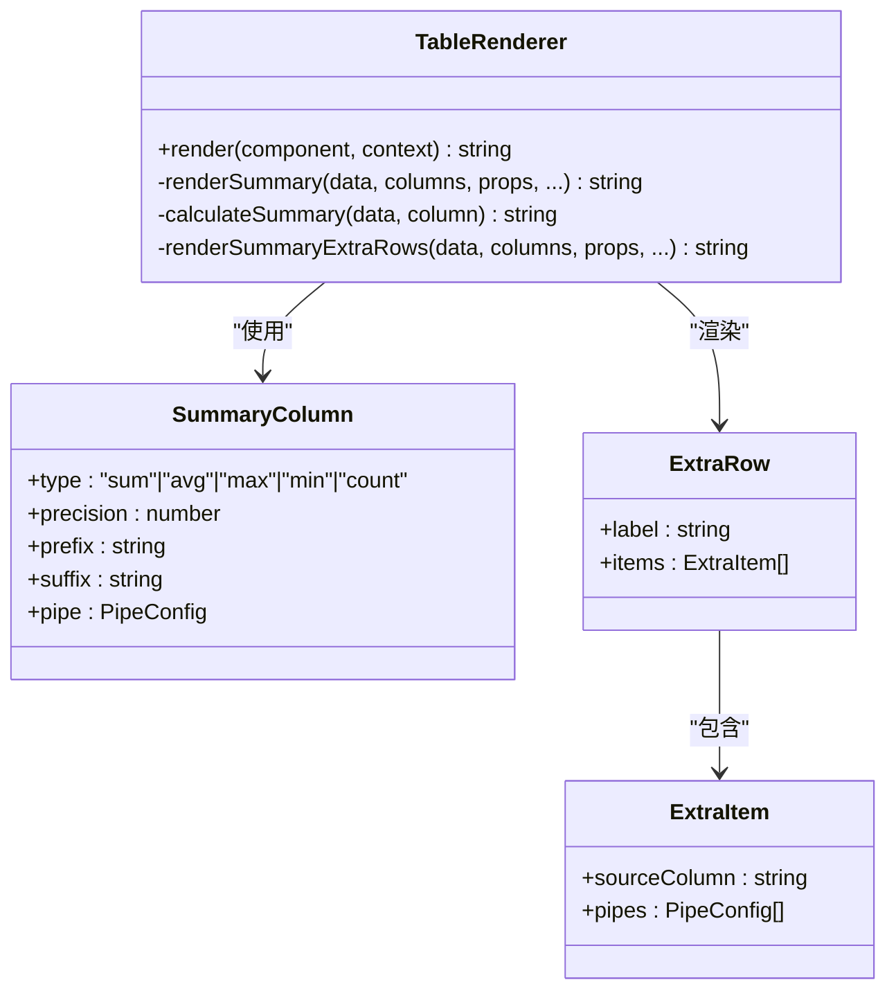
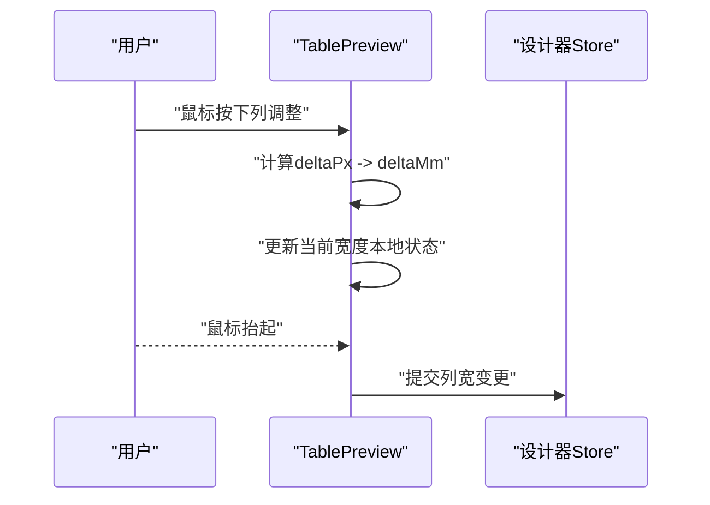
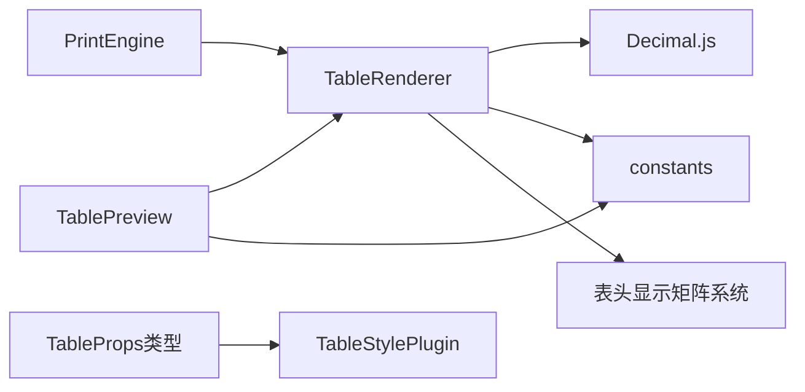

# 表格智能渲染

<cite>
**本文引用的文件**
- [TableRenderer.ts](file://sdk/src/printEngine/renderers/TableRenderer.ts)
- [printEngine.ts](file://sdk/src/printEngine.ts)
- [TablePreview.tsx](file://designer/src/pages/Designer/components/Canvas/componentRenderers/TablePreview.tsx)
- [TableStylePlugin.tsx](file://designer/src/pages/Designer/components/PropertyPanel/stylePlugins/TableStylePlugin.tsx)
- [constants.ts](file://sdk/src/printEngine/constants.ts)
- [zoom.ts](file://designer/src/utils/zoom.ts)
- [index.ts](file://designer/src/types/index.ts)
</cite>

## 更新摘要
**变更内容**
- 新增表头显示矩阵系统，支持四种表头显示场景的精确控制
- 改进表头显示策略的逻辑判断，确保跨页表格的视觉一致性
- 优化表头显示与重复渲染的协同机制，提升复杂场景下的渲染准确性

## 目录
1. [简介](#简介)
2. [项目结构](#项目结构)
3. [核心组件](#核心组件)
4. [架构总览](#架构总览)
5. [详细组件分析](#详细组件分析)
6. [依赖关系分析](#依赖关系分析)
7. [性能考量](#性能考量)
8. [故障排查指南](#故障排查指南)
9. [结论](#结论)

## 简介
本文件围绕"表格智能渲染"能力，系统阐述以下主题：
- 表格跨页拆分算法：渲染后测量、表头重复策略、合计行处理
- 字体大小等比缩放机制：基于基准字体的动态高度计算
- 表格高度测量的双轨制：浏览器真实测量与服务器端估算
- 动态布局算法：列宽计算、行高适配、内容溢出处理
- 表头显示矩阵系统：四种场景控制逻辑的精确实现
- 不同页面中的渲染策略与跨页视觉一致性
- 性能优化技巧与常见问题解决方案

## 项目结构
表格相关代码主要分布在 SDK 的打印引擎与渲染器，以及设计器侧的预览与样式插件：
- SDK 打印引擎负责模板解析、组件分页与跨页拆分
- TableRenderer 负责表格 HTML 渲染与列宽计算，支持字体大小等比缩放
- 设计器 TablePreview 提供可视化列宽拖拽与预览
- TableStylePlugin 提供字体大小与对齐方式等样式属性面板

**图表来源**
- [printEngine.ts:498-998](file://sdk/src/printEngine.ts#L498-L998)
- [TableRenderer.ts:147-601](file://sdk/src/printEngine/renderers/TableRenderer.ts#L147-L601)
- [constants.ts:12-60](file://sdk/src/printEngine/constants.ts#L12-L60)
- [TablePreview.tsx:69-174](file://designer/src/pages/Designer/components/Canvas/componentRenderers/TablePreview.tsx#L69-L174)
- [TableStylePlugin.tsx:11-47](file://designer/src/pages/Designer/components/PropertyPanel/stylePlugins/TableStylePlugin.tsx#L11-L47)
- [zoom.ts:1-71](file://designer/src/utils/zoom.ts#L1-L71)
- [index.ts:287-298](file://designer/src/types/index.ts#L287-L298)

**章节来源**
- [printEngine.ts:498-998](file://sdk/src/printEngine.ts#L498-L998)
- [TableRenderer.ts:147-601](file://sdk/src/printEngine/renderers/TableRenderer.ts#L147-L601)
- [constants.ts:12-60](file://sdk/src/printEngine/constants.ts#L12-L60)
- [TablePreview.tsx:69-174](file://designer/src/pages/Designer/components/Canvas/componentRenderers/TablePreview.tsx#L69-L174)
- [TableStylePlugin.tsx:11-47](file://designer/src/pages/Designer/components/PropertyPanel/stylePlugins/TableStylePlugin.tsx#L11-L47)
- [zoom.ts:1-71](file://designer/src/utils/zoom.ts#L1-L71)
- [index.ts:287-298](file://designer/src/types/index.ts#L287-L298)

## 核心组件
- 表格渲染器（TableRenderer）
  - 负责根据列配置、数据与样式生成表格 HTML，支持表头、行号、合计行与额外行
  - 提供列宽计算函数与表格高度估算接口，支持字体大小等比缩放
  - 实现表头显示矩阵系统，精确控制四种表头显示场景
- 打印引擎（PrintEngine）
  - 负责模板解析、组件布局与跨页拆分
  - 实现"渲染后测量"以精确计算行高，并据此进行分页
  - 提供独立的表头高度和行高计算函数，支持字体缩放
  - 集成表头显示矩阵系统，确保跨页表头显示的一致性
- 设计器表格预览（TablePreview）
  - 在设计阶段提供列宽拖拽与实时预览，与 SDK 的列宽计算逻辑保持一致
- 表格样式插件（TableStylePlugin）
  - 提供字体大小与对齐方式的可视化配置入口
- 类型定义（TableProps）
  - 定义表头显示配置类型，包括 showHeader 和 repeatHeader 属性

**章节来源**
- [TableRenderer.ts:147-601](file://sdk/src/printEngine/renderers/TableRenderer.ts#L147-L601)
- [printEngine.ts:626-998](file://sdk/src/printEngine.ts#L626-L998)
- [TablePreview.tsx:69-174](file://designer/src/pages/Designer/components/Canvas/componentRenderers/TablePreview.tsx#L69-L174)
- [TableStylePlugin.tsx:11-47](file://designer/src/pages/Designer/components/PropertyPanel/stylePlugins/TableStylePlugin.tsx#L11-L47)
- [index.ts:287-298](file://designer/src/types/index.ts#L287-L298)

## 架构总览
表格智能渲染的整体流程如下：
- 设计器阶段：通过 TablePreview 与 TableStylePlugin 配置列宽、样式与数据绑定
- 渲染阶段：TableRenderer 根据列配置与数据生成 HTML；若启用合计行，渲染合计与额外行
- 分页阶段：PrintEngine 使用 TableRenderer 生成完整表格 HTML，插入隐藏容器进行真实测量（浏览器）或使用估算值（服务器端），随后按可用高度与表头显示矩阵策略进行跨页拆分

**图表来源**
- [printEngine.ts:626-756](file://sdk/src/printEngine.ts#L626-L756)
- [TableRenderer.ts:150-327](file://sdk/src/printEngine/renderers/TableRenderer.ts#L150-L327)
- [printEngine.ts:780-843](file://sdk/src/printEngine.ts#L780-L843)

**章节来源**
- [printEngine.ts:626-756](file://sdk/src/printEngine.ts#L626-L756)
- [TableRenderer.ts:150-327](file://sdk/src/printEngine/renderers/TableRenderer.ts#L150-L327)
- [printEngine.ts:780-843](file://sdk/src/printEngine.ts#L780-L843)

## 详细组件分析

### 表头显示矩阵系统
**更新** 新增表头显示矩阵系统，支持四种表头显示场景的精确控制

- 四种显示场景
  - 场景1：showHeader=false，repeatHeader=false → 所有页都不显示表头
  - 场景2：showHeader=true，repeatHeader=true → 所有页都显示表头
  - 场景3：showHeader=true，repeatHeader=false → 仅第一页显示表头
  - 场景4：showHeader=undefined，repeatHeader=undefined → 默认行为（根据实际需求确定）
- 实现机制
  - 显式控制：explicitShowHeader 参数优先级最高
  - 隐式推导：当显式参数未设置时，基于 props?.showHeader !== false 推导
  - 上下文传递：通过 _showHeader 属性在分页过程中传递给各页面片段
- 逻辑判断流程

**图表来源**
- [TableRenderer.ts:218](file://sdk/src/printEngine/renderers/TableRenderer.ts#L218)
- [TableRenderer.ts:695](file://sdk/src/printEngine/renderers/TableRenderer.ts#L695)
- [printEngine.ts:700](file://sdk/src/printEngine.ts#L700)
- [printEngine.ts:780](file://sdk/src/printEngine.ts#L780)

**章节来源**
- [TableRenderer.ts:218](file://sdk/src/printEngine/renderers/TableRenderer.ts#L218)
- [TableRenderer.ts:695](file://sdk/src/printEngine/renderers/TableRenderer.ts#L695)
- [printEngine.ts:700](file://sdk/src/printEngine.ts#L700)
- [printEngine.ts:780](file://sdk/src/printEngine.ts#L780)

### 字体大小等比缩放机制
**更新** 新增字体大小等比缩放机制，显著提升了表格高度计算的准确性

- 缩放原理
  - 基准字体：默认 12px 对应基准高度（表头 10mm，行高 8mm）
  - 缩放公式：scale = max(1, fontSize / TABLE_STYLE_DEFAULT.FONT_SIZE)
  - 应用范围：表头高度、行高、合计行高度均按相同比例缩放
- 实现细节
  - 表头高度：TABLE_DEFAULT.HEADER_HEIGHT × scale
  - 行高：TABLE_DEFAULT.MIN_ROW_HEIGHT × TABLE_DEFAULT.ROW_HEIGHT_FACTOR × scale
  - 字体缩放在渲染器中同时应用于 CSS 样式和高度计算
- 优势
  - 确保字体变化时表格整体比例保持一致
  - 提升测量精度，避免固定常量导致的偏差
  - 支持动态字体调整而无需修改布局逻辑

**图表来源**
- [TableRenderer.ts:265-269](file://sdk/src/printEngine/renderers/TableRenderer.ts#L265-L269)
- [printEngine.ts:266-285](file://sdk/src/printEngine.ts#L266-L285)

**章节来源**
- [TableRenderer.ts:265-269](file://sdk/src/printEngine/renderers/TableRenderer.ts#L265-L269)
- [printEngine.ts:266-285](file://sdk/src/printEngine.ts#L266-L285)

### 表格列宽计算与动态布局
- 列宽计算规则
  - 若全部未设置 width：均分
  - 部分设置 width：固定列按 width，未设置列均分剩余空间
  - 固定列总和超过表格宽度：全固定按比例缩放；部分固定则固定列按比例缩放，未固定列分配最小份额
  - 最后一列吸收舍入误差，确保百分比总和为 100%
- 行高与内容适配
  - 表头高度与最小行高由常量与因子确定，单元格使用 min-height 与自然换行
  - 文本换行与对齐通过样式控制，避免溢出
- 最大列宽约束
  - 提供计算某列最大允许宽度的工具函数，考虑其他列宽度与预留宽度（如行号列）

**图表来源**
- [TableRenderer.ts:51-125](file://sdk/src/printEngine/renderers/TableRenderer.ts#L51-L125)

**章节来源**
- [TableRenderer.ts:51-125](file://sdk/src/printEngine/renderers/TableRenderer.ts#L51-L125)
- [constants.ts:50-60](file://sdk/src/printEngine/constants.ts#L50-L60)

### 表格高度测量的双轨制方案
**更新** 改进表格高度计算逻辑，增强测量准确性

- 浏览器环境（真实测量）
  - 创建隐藏容器，渲染完整表格（含合计行），测量表头、数据行与合计行高度
  - 将 offsetHeight 转换为 mm 并返回
  - 支持字体大小等比缩放的精确测量
- 服务器端（估算机制）
  - 无法访问 DOM，直接使用估算值：基础行高、表头高度与合计行高度（包含额外行）
  - 估算值同样遵循字体缩放比例
- 回退策略
  - 若测量结果长度与数据长度不一致（例如所有列隐藏），回退到估算值

**图表来源**
- [printEngine.ts:626-756](file://sdk/src/printEngine.ts#L626-L756)

**章节来源**
- [printEngine.ts:626-756](file://sdk/src/printEngine.ts#L626-L756)

### 表格跨页拆分算法与视觉一致性
- 关键策略
  - 表头重复：可通过配置控制是否在每页重复表头
  - 合计行策略：支持"每页合计"和"总计到末页"
  - 安全边距：减去微小安全余量，避免浮点误差导致溢出
  - 防御性检查：当可容纳行数异常小时，使用估算行高重算
  - 至少一行：避免只有表头的空页
  - 表头显示矩阵：根据四种场景精确控制表头显示
- 分页流程
  - 计算可用高度（含页眉/页脚与边距）
  - 使用真实测量或估算行高，累计行高直至超出可用高度
  - 对"总计到末页"模式，若最后一页加上合计行会溢出，主动减少一行
  - 生成表格片段（带 _pageData、_showHeader、_isLastPage、_startRowIndex 等上下文）
  - 更新当前页高度并推进到下一页

**图表来源**
- [printEngine.ts:762-998](file://sdk/src/printEngine.ts#L762-L998)

**章节来源**
- [printEngine.ts:762-998](file://sdk/src/printEngine.ts#L762-L998)

### 合计行处理方案
- 合计行渲染
  - 支持多种聚合类型（求和、平均、最大、最小、计数）
  - 支持自定义精度、前后缀与格式化管道
  - 支持额外行（summaryExtraRows），可对指定列汇总值进行二次处理并拼接文本
- 数据源选择
  - "每页合计"：使用当前页数据
  - "总计到末页"：使用全量数据，仅在最后一页显示
- 视觉与样式
  - 合计行背景色、字重、字号可配置
  - 与普通行一致的列宽与对齐策略

**图表来源**
- [TableRenderer.ts:329-579](file://sdk/src/printEngine/renderers/TableRenderer.ts#L329-L579)

**章节来源**
- [TableRenderer.ts:329-579](file://sdk/src/printEngine/renderers/TableRenderer.ts#L329-L579)

### 设计器侧预览与交互
- 列宽拖拽
  - 基于像素增量换算为 mm，限制最大宽度（由 computeColumnMaxWidth 计算）
  - 拖拽过程中仅更新本地状态，mouseup 时一次性提交到 store
- 预览渲染
  - 与 SDK 渲染逻辑一致，支持表头、行号与边框样式
  - 无数据时显示"暂无数据"占位

**图表来源**
- [TablePreview.tsx:12-107](file://designer/src/pages/Designer/components/Canvas/componentRenderers/TablePreview.tsx#L12-L107)

**章节来源**
- [TablePreview.tsx:69-174](file://designer/src/pages/Designer/components/Canvas/componentRenderers/TablePreview.tsx#L69-L174)

## 依赖关系分析
- 组件内聚与耦合
  - TableRenderer 内聚了表格渲染、列宽计算与合计逻辑，对外暴露 render 与 calculateHeight
  - PrintEngine 通过渲染器生成 HTML，再进行测量与分页，耦合度适中
  - 表头显示矩阵系统作为独立模块集成到渲染流程中
- 外部依赖
  - 浏览器环境依赖 DOM API 进行真实测量
  - Decimal.js 用于合计计算的高精度
- 潜在循环依赖
  - 未见直接循环导入；渲染器与引擎通过接口调用解耦

**图表来源**
- [printEngine.ts:498-998](file://sdk/src/printEngine.ts#L498-L998)
- [TableRenderer.ts:147-601](file://sdk/src/printEngine/renderers/TableRenderer.ts#L147-L601)
- [TablePreview.tsx:69-174](file://designer/src/pages/Designer/components/Canvas/componentRenderers/TablePreview.tsx#L69-L174)
- [index.ts:287-298](file://designer/src/types/index.ts#L287-L298)

**章节来源**
- [printEngine.ts:498-998](file://sdk/src/printEngine.ts#L498-L998)
- [TableRenderer.ts:147-601](file://sdk/src/printEngine/renderers/TableRenderer.ts#L147-L601)
- [TablePreview.tsx:69-174](file://designer/src/pages/Designer/components/Canvas/componentRenderers/TablePreview.tsx#L69-L174)
- [index.ts:287-298](file://designer/src/types/index.ts#L287-L298)

## 性能考量
- 渲染后测量的代价
  - 在浏览器中创建隐藏容器并测量，适合对精度要求高的场景；在大量表格或大数据量时应关注 DOM 操作成本
- 服务器端估算
  - 通过估算值快速分页，避免 DOM 依赖；在设计器预览或服务端渲染时更高效
- 估算与真实测量的平衡
  - 优先使用真实测量；当测量失败或列隐藏导致异常时回退估算
- 表头显示矩阵的优化
  - 通过显式参数优先级机制，减少重复计算
  - 在分页过程中复用计算结果，避免重复判断
- 防御性检查
  - 当 rowsCanFit 异常小时，使用估算行高重算，避免分页死循环与极端情况
- 样式与布局
  - 合理设置字体大小与对齐，减少换行与溢出，降低测量误差与重排成本

## 故障排查指南
- 表格测量结果异常
  - 现象：测量行高数组长度与数据长度不一致
  - 处理：检查列是否全部隐藏；回退到估算行高继续分页
- 合计计算错误
  - 现象：合计结果异常或报错
  - 处理：确认数据路径与列配置；检查管道执行是否抛错；查看日志输出
- 表格溢出或截断
  - 现象：末行溢出页底或表头被截断
  - 处理：检查页边距与可用高度；适当增大安全边距；调整列宽或字体大小
- 服务器端无法测量
  - 现象：在非浏览器环境无法访问 DOM
  - 处理：依赖估算值；确保默认尺寸与样式常量合理
- 字体缩放问题
  - 现象：字体变化时表格高度不匹配
  - 处理：确认字体大小设置正确；检查缩放比例计算；验证 CSS 样式应用
- 表头显示异常
  - 现象：跨页表头显示不符合预期
  - 处理：检查 showHeader 和 repeatHeader 配置；验证表头显示矩阵逻辑；确认 _showHeader 传递正确

**章节来源**
- [printEngine.ts:626-756](file://sdk/src/printEngine.ts#L626-L756)
- [TableRenderer.ts:387-463](file://sdk/src/printEngine/renderers/TableRenderer.ts#L387-L463)
- [TableRenderer.ts:218](file://sdk/src/printEngine/renderers/TableRenderer.ts#L218)
- [printEngine.ts:780-843](file://sdk/src/printEngine.ts#L780-L843)

## 结论
本方案通过"渲染后测量 + 服务器端估算"的双轨制，结合严谨的列宽计算与防御性分页策略，在保证跨页视觉一致性的同时兼顾了性能与稳定性。新增的表头显示矩阵系统通过四种精确的显示场景控制逻辑，确保了复杂场景下的渲染准确性。字体大小等比缩放机制显著提升了表格高度计算的准确性，使表格在不同字体设置下都能保持精确的布局。合计行与额外行的灵活配置进一步增强了表格在打印场景下的表达力。建议在设计器与生产环境中分别采用合适的测量策略，并配合合理的样式与布局参数，获得最佳的渲染效果。