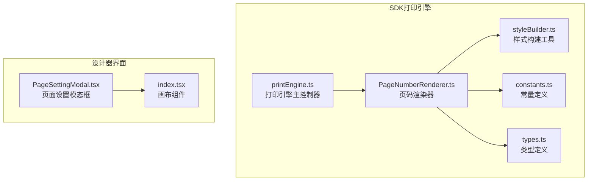
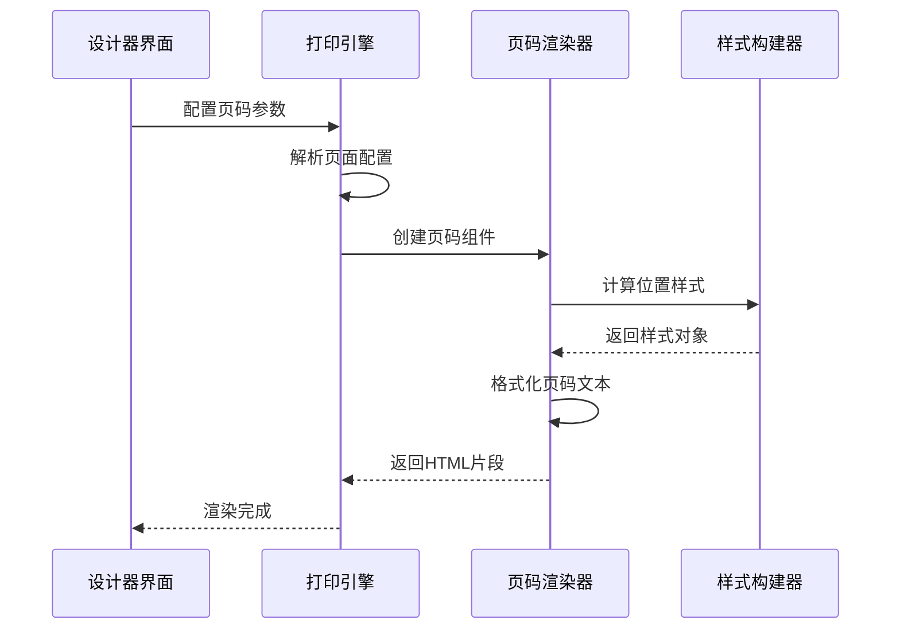
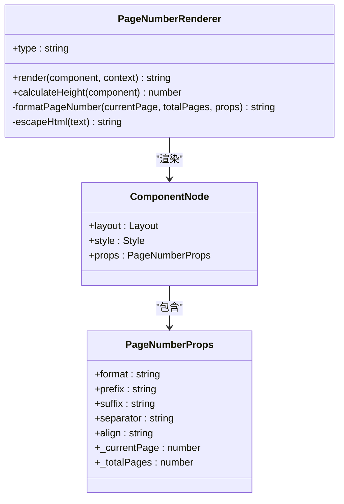
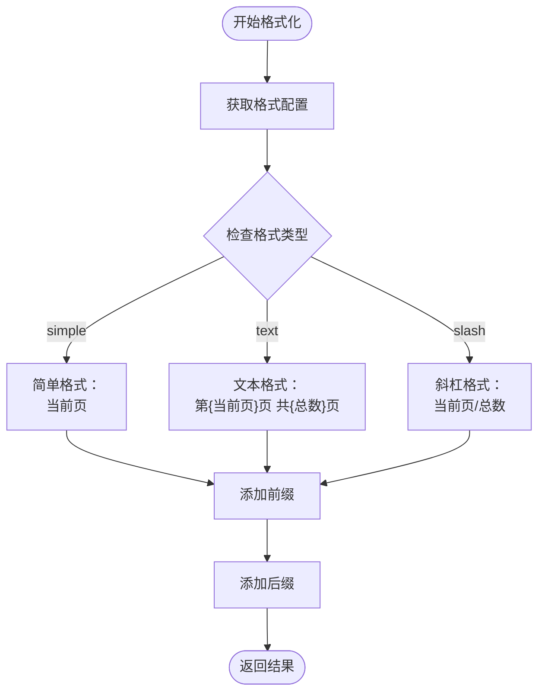
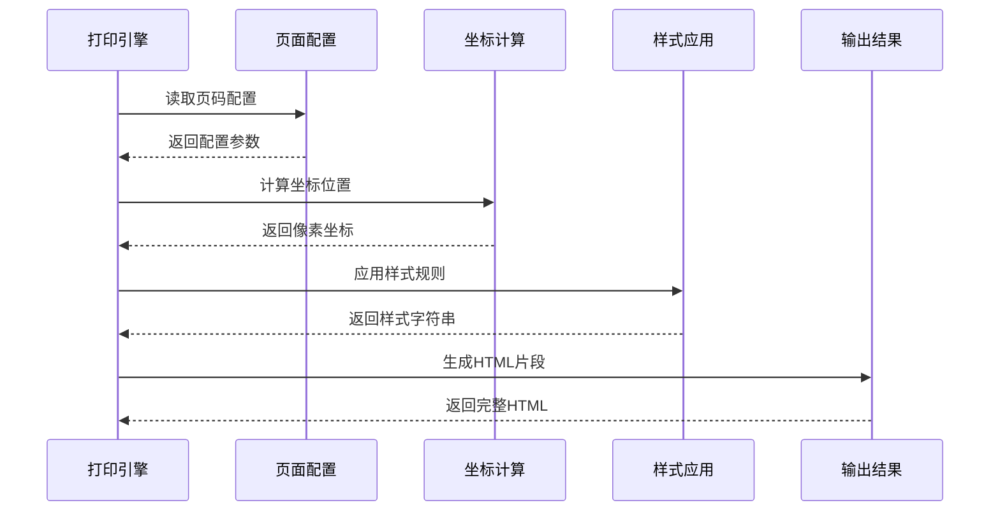
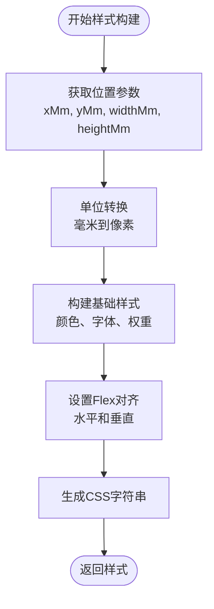
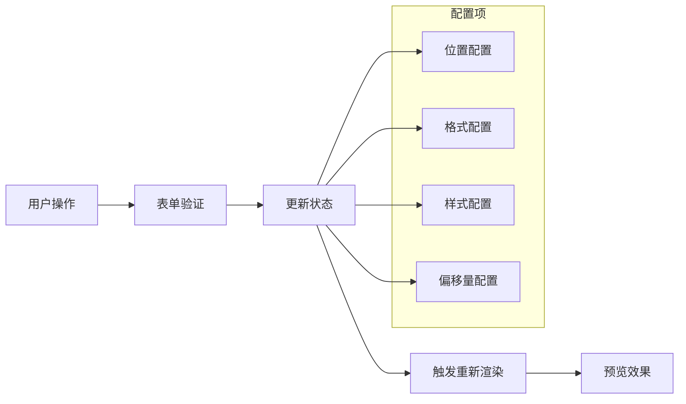
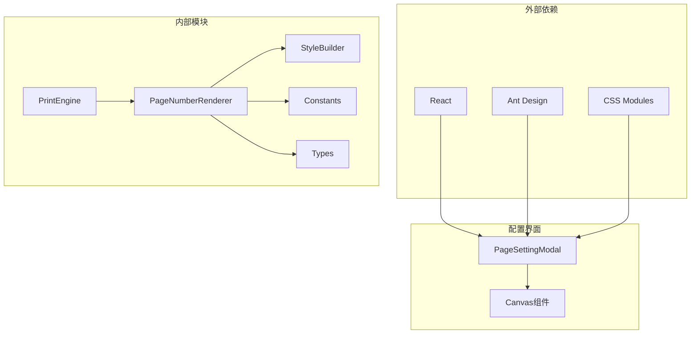

# 页码功能实现

<cite>
**本文档引用的文件**
- [PageNumberRenderer.ts](file://sdk/src/printEngine/renderers/PageNumberRenderer.ts)
- [printEngine.ts](file://sdk/src/printEngine.ts)
- [styleBuilder.ts](file://sdk/src/printEngine/utils/styleBuilder.ts)
- [constants.ts](file://sdk/src/printEngine/constants.ts)
- [types.ts](file://sdk/src/printEngine/types.ts)
- [PageSettingModal.tsx](file://designer/src/pages/Designer/components/Canvas/PageSettingModal.tsx)
- [index.tsx](file://designer/src/pages/Designer/components/Canvas/index.tsx)
</cite>

## 目录
1. [简介](#简介)
2. [项目结构](#项目结构)
3. [核心组件](#核心组件)
4. [架构概览](#架构概览)
5. [详细组件分析](#详细组件分析)
6. [依赖关系分析](#依赖关系分析)
7. [性能考虑](#性能考虑)
8. [故障排除指南](#故障排除指南)
9. [结论](#结论)
10. [附录](#附录)

## 简介
本文档详细介绍页码功能的完整实现方案，涵盖6种位置配置(top-left、top-center、top-right、bottom-left、bottom-center、bottom-right)、3种格式选项(simple、slash、text)、自定义样式支持。文档深入解析页码坐标的精确计算方法、基于页边距的定位算法、偏移量应用机制以及响应式布局适配策略，并说明页码HTML结构的生成过程及内联样式的应用。

## 项目结构
页码功能主要分布在两个模块中：
- SDK打印引擎：负责页码渲染的核心逻辑和样式构建
- 设计器界面：提供页码配置的可视化界面

**图表来源**
- [PageNumberRenderer.ts:1-104](file://sdk/src/printEngine/renderers/PageNumberRenderer.ts#L1-L104)
- [printEngine.ts:283-399](file://sdk/src/printEngine.ts#L283-L399)
- [styleBuilder.ts:1-200](file://sdk/src/printEngine/utils/styleBuilder.ts#L1-L200)

**章节来源**
- [PageNumberRenderer.ts:1-104](file://sdk/src/printEngine/renderers/PageNumberRenderer.ts#L1-L104)
- [printEngine.ts:283-399](file://sdk/src/printEngine.ts#L283-L399)

## 核心组件
页码功能由以下核心组件构成：

### 页码渲染器(PageNumberRenderer)
负责将页码组件节点渲染为HTML字符串，支持多种格式和样式配置。

### 打印引擎(PrintEngine)
管理整个打印流程，包含页码渲染的集成点和全局配置处理。

### 样式构建器(styleBuilder)
提供通用的样式构建和位置计算功能。

### 类型系统
定义了页码组件的属性接口和渲染上下文类型。

**章节来源**
- [PageNumberRenderer.ts:14-104](file://sdk/src/printEngine/renderers/PageNumberRenderer.ts#L14-L104)
- [printEngine.ts:283-399](file://sdk/src/printEngine.ts#L283-L399)
- [types.ts:1-200](file://sdk/src/printEngine/types.ts#L1-L200)

## 架构概览
页码功能采用分层架构设计，确保功能的模块化和可维护性。

**图表来源**
- [PageNumberRenderer.ts:17-57](file://sdk/src/printEngine/renderers/PageNumberRenderer.ts#L17-L57)
- [printEngine.ts:286-374](file://sdk/src/printEngine.ts#L286-L374)

## 详细组件分析

### 页码渲染器实现
页码渲染器是页码功能的核心实现类，负责将页码组件转换为最终的HTML输出。

#### 主要特性
- 支持三种页码格式：simple、text、slash
- 基于Flexbox的居中对齐机制
- 完整的HTML转义防护
- 可扩展的样式配置系统

#### 核心方法分析

**图表来源**
- [PageNumberRenderer.ts:14-104](file://sdk/src/printEngine/renderers/PageNumberRenderer.ts#L14-L104)
- [types.ts:1-200](file://sdk/src/printEngine/types.ts#L1-L200)

#### 页码格式化逻辑
渲染器支持三种不同的页码格式化方式：

**图表来源**
- [PageNumberRenderer.ts:66-94](file://sdk/src/printEngine/renderers/PageNumberRenderer.ts#L66-L94)

**章节来源**
- [PageNumberRenderer.ts:14-104](file://sdk/src/printEngine/renderers/PageNumberRenderer.ts#L14-L104)

### 打印引擎中的页码集成
打印引擎负责在整体打印流程中集成页码渲染功能。

#### 关键实现要点
- 页面级配置优先于组件级配置
- 支持绝对定位和相对定位
- 自动处理页码可见性控制
- 完整的错误处理和边界情况处理

#### 页码渲染流程

**图表来源**
- [printEngine.ts:286-374](file://sdk/src/printEngine.ts#L286-L374)

**章节来源**
- [printEngine.ts:283-399](file://sdk/src/printEngine.ts#L283-L399)

### 样式构建与定位系统
样式构建器提供了统一的样式处理机制，确保页码的视觉表现一致性。

#### 样式构建流程

**图表来源**
- [styleBuilder.ts:1-200](file://sdk/src/printEngine/utils/styleBuilder.ts#L1-L200)

**章节来源**
- [styleBuilder.ts:1-200](file://sdk/src/printEngine/utils/styleBuilder.ts#L1-L200)

### 设计器界面集成
设计器提供了可视化的页码配置界面，支持实时预览和参数调整。

#### 配置界面功能
- 位置选择器：支持6种预设位置
- 格式选择器：支持3种页码格式
- 样式编辑器：字体、颜色、尺寸等
- 实时预览：配置变更即时反映

#### 配置数据流

**图表来源**
- [PageSettingModal.tsx:56-69](file://designer/src/pages/Designer/components/Canvas/PageSettingModal.tsx#L56-L69)
- [index.tsx:897-905](file://designer/src/pages/Designer/components/Canvas/index.tsx#L897-L905)

**章节来源**
- [PageSettingModal.tsx:56-69](file://designer/src/pages/Designer/components/Canvas/PageSettingModal.tsx#L56-L69)
- [index.tsx:897-905](file://designer/src/pages/Designer/components/Canvas/index.tsx#L897-L905)

## 依赖关系分析

**图表来源**
- [PageNumberRenderer.ts:9-12](file://sdk/src/printEngine/renderers/PageNumberRenderer.ts#L9-L12)
- [printEngine.ts:1-50](file://sdk/src/printEngine.ts#L1-L50)

**章节来源**
- [PageNumberRenderer.ts:9-12](file://sdk/src/printEngine/renderers/PageNumberRenderer.ts#L9-L12)
- [printEngine.ts:1-50](file://sdk/src/printEngine.ts#L1-L50)

## 性能考虑
页码功能在设计时充分考虑了性能优化：

### 渲染性能优化
- 使用纯函数式渲染，避免不必要的重渲染
- 样式计算缓存机制
- 最小化DOM操作次数

### 内存管理
- 合理的事件监听器清理
- 避免内存泄漏的资源管理
- 及时释放临时变量

### 响应式设计
- 基于Flexbox的自适应布局
- 动态字体大小调整
- 移动端兼容性支持

## 故障排除指南

### 常见问题及解决方案

#### 页码不显示
- 检查页面配置中的启用状态
- 验证页码位置参数的有效性
- 确认CSS样式是否被正确应用

#### 页码格式异常
- 检查格式配置参数
- 验证前缀和后缀字符
- 确认分隔符设置

#### 样式显示问题
- 检查字体文件加载
- 验证颜色值格式
- 确认尺寸单位转换

**章节来源**
- [PageNumberRenderer.ts:99-103](file://sdk/src/printEngine/renderers/PageNumberRenderer.ts#L99-L103)
- [printEngine.ts:379-381](file://sdk/src/printEngine.ts#L379-L381)

## 结论
页码功能实现了完整的页面标识解决方案，具有以下优势：

### 技术优势
- 模块化设计，易于维护和扩展
- 完善的类型系统，提供良好的开发体验
- 灵活的配置选项，满足多样化需求
- 优秀的性能表现，适合大规模应用

### 功能完整性
- 支持多种页码格式和位置配置
- 提供丰富的样式定制能力
- 集成可视化配置界面
- 完备的错误处理机制

该实现为打印和报表系统提供了可靠的页码标识功能，可根据具体业务需求进行进一步定制和扩展。

## 附录

### 配置示例
以下为常见的页码配置场景：

#### 基础配置
- 位置：bottom-right
- 格式：slash
- 字体：12px Arial
- 颜色：#666666

#### 高级配置
- 位置：top-center
- 格式：text
- 前缀：第
- 后缀：页
- 分隔符：/
- 偏移量：X轴+10px，Y轴-5px

### 最佳实践建议
1. **性能优化**：合理设置页码刷新频率，避免频繁重渲染
2. **样式一致性**：统一使用CSS变量管理样式参数
3. **可访问性**：确保页码对比度符合WCAG标准
4. **国际化**：支持多语言环境下的页码格式
5. **测试覆盖**：建立完善的单元测试和集成测试体系