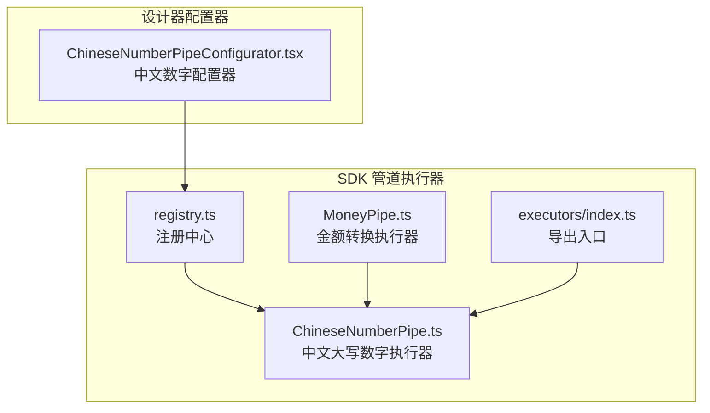
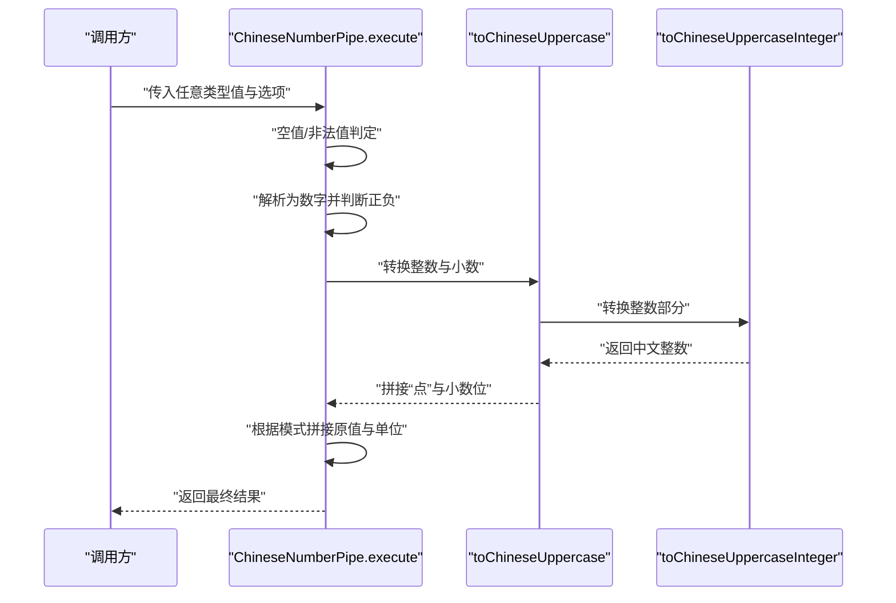
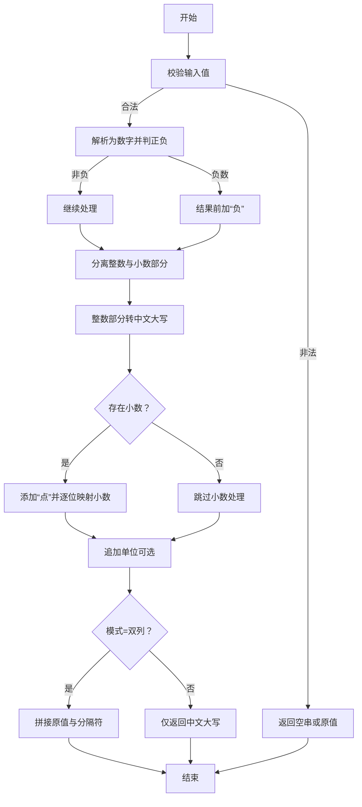
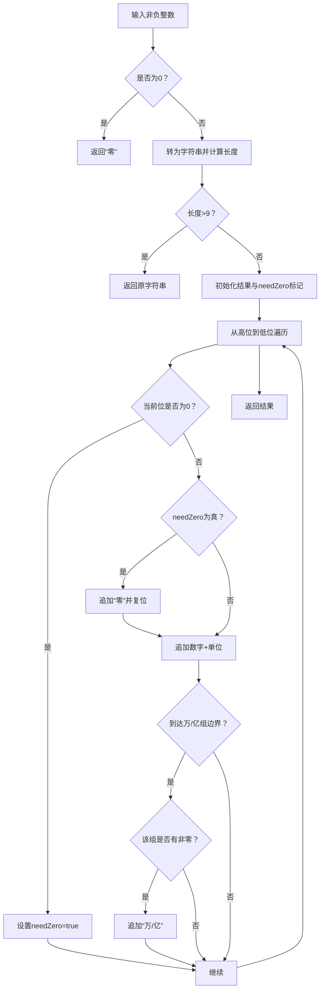
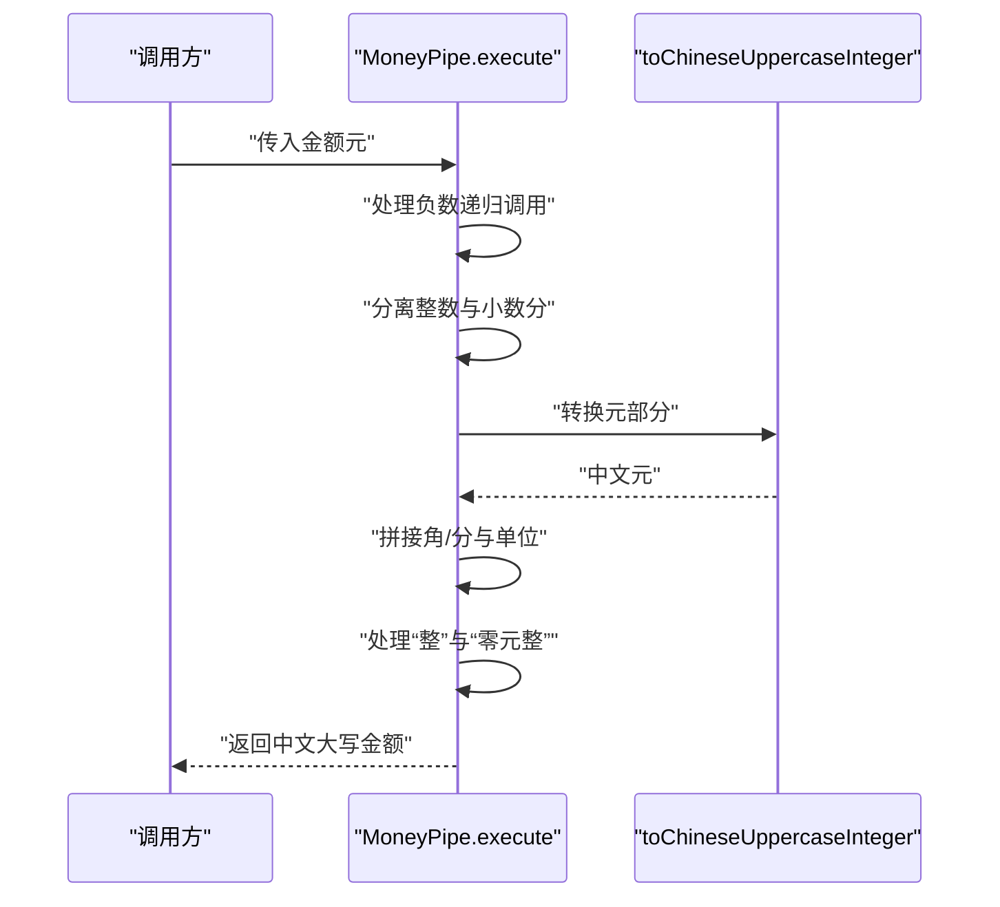
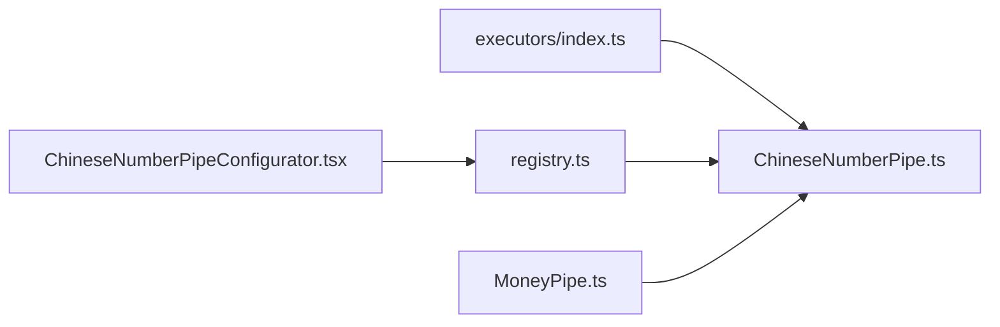

# 中文数字管道

<cite>
**本文引用的文件**
- [ChineseNumberPipe.ts](file://sdk/src/pipes/executors/ChineseNumberPipe.ts)
- [MoneyPipe.ts](file://sdk/src/pipes/executors/MoneyPipe.ts)
- [ChineseNumberPipeConfigurator.tsx](file://designer/src/pipes/configurators/ChineseNumberPipeConfigurator.tsx)
- [index.ts](file://sdk/src/pipes/executors/index.ts)
- [registry.ts](file://sdk/src/pipes/registry.ts)
- [README.md](file://README.md)
</cite>

## 目录
1. [简介](#简介)
2. [项目结构](#项目结构)
3. [核心组件](#核心组件)
4. [架构总览](#架构总览)
5. [详细组件分析](#详细组件分析)
6. [依赖关系分析](#依赖关系分析)
7. [性能考量](#性能考量)
8. [故障排查指南](#故障排查指南)
9. [结论](#结论)
10. [附录](#附录)

## 简介
本文件围绕“中文数字管道”展开，系统性阐述中文数字转换的算法原理与实现细节，覆盖以下关键点：
- 数字到中文字符的映射规则与层级单位（个、十、百、千、万、亿）组织方式
- 小数处理机制（如“壹仟、叁点壹肆”的转换逻辑）
- 负数与零的处理策略
- 与“金额转换”管道的关系及在正式文档中的应用
- 在设计器中的配置器与注册流程

该实现遵循会计大写中文书写规范，确保在正式文档场景中具备可读性与合规性。

## 项目结构
中文数字管道位于 SDK 的管道执行器模块中，并通过注册中心对外暴露；设计器侧提供可视化配置器以选择模式与附加单位。

图表来源
- [ChineseNumberPipe.ts:99-137](file://sdk/src/pipes/executors/ChineseNumberPipe.ts#L99-L137)
- [MoneyPipe.ts:1-61](file://sdk/src/pipes/executors/MoneyPipe.ts#L1-L61)
- [index.ts:1-10](file://sdk/src/pipes/executors/index.ts#L1-L10)
- [registry.ts:60-70](file://sdk/src/pipes/registry.ts#L60-L70)
- [ChineseNumberPipeConfigurator.tsx:1-15](file://designer/src/pipes/configurators/ChineseNumberPipeConfigurator.tsx#L1-L15)

章节来源
- [ChineseNumberPipe.ts:1-137](file://sdk/src/pipes/executors/ChineseNumberPipe.ts#L1-L137)
- [MoneyPipe.ts:1-61](file://sdk/src/pipes/executors/MoneyPipe.ts#L1-L61)
- [index.ts:1-10](file://sdk/src/pipes/executors/index.ts#L1-L10)
- [registry.ts:60-70](file://sdk/src/pipes/registry.ts#L60-L70)
- [ChineseNumberPipeConfigurator.tsx:1-15](file://designer/src/pipes/configurators/ChineseNumberPipeConfigurator.tsx#L1-L15)

## 核心组件
- 中文大写数字执行器：负责将数值转换为中文大写形式，支持整数与小数，内置负数与零的处理，以及可选的“双列显示模式”和单位后缀。
- 金额转换执行器：基于中文大写数字执行器，扩展为符合会计规范的金额大写（元、角、分、整），并处理分/元换算。
- 配置器：在设计器中提供模式选择（大写/双列）、分隔符与单位等参数化配置。
- 注册中心与导出入口：统一注册与导出执行器，便于上层调用。

章节来源
- [ChineseNumberPipe.ts:99-137](file://sdk/src/pipes/executors/ChineseNumberPipe.ts#L99-L137)
- [MoneyPipe.ts:1-61](file://sdk/src/pipes/executors/MoneyPipe.ts#L1-L61)
- [ChineseNumberPipeConfigurator.tsx:1-15](file://designer/src/pipes/configurators/ChineseNumberPipeConfigurator.tsx#L1-L15)
- [index.ts:1-10](file://sdk/src/pipes/executors/index.ts#L1-L10)
- [registry.ts:60-70](file://sdk/src/pipes/registry.ts#L60-L70)

## 架构总览
中文数字管道的运行链路如下：
- 输入值经执行器解析为数字，进行空值、NaN、无穷等边界判断
- 若为负数，前置“负”字
- 整数部分通过中文大写整数转换函数生成
- 小数部分逐位映射为中文数字并拼接“点”
- 可选模式下，输出“原值（中文大写）”或“原值+自定义分隔符+中文大写”
- 金额转换在上述基础上，按“元/角/分”拆分并追加单位

图表来源
- [ChineseNumberPipe.ts:103-137](file://sdk/src/pipes/executors/ChineseNumberPipe.ts#L103-L137)
- [ChineseNumberPipe.ts:70-97](file://sdk/src/pipes/executors/ChineseNumberPipe.ts#L70-L97)
- [ChineseNumberPipe.ts:17-62](file://sdk/src/pipes/executors/ChineseNumberPipe.ts#L17-L62)

## 详细组件分析

### 中文大写数字执行器（ChineseNumberPipe）
职责与行为
- 输入容错：对 null、undefined、空字符串直接返回空串；对非空字符串若无法解析为有效数字则回退原值；对 NaN 或无穷返回空串
- 正负处理：负数在结果前加“负”字
- 小数处理：以“点”分隔整数与小数，小数位逐位映射为中文数字
- 模式与单位：支持“大写”“双列”两种模式；双列模式下可自定义分隔符，默认括号；可附加单位后缀
- 单元与映射：内置数字字符与单位映射表，按“个/十/百/千”“万/亿”分组处理

图表来源
- [ChineseNumberPipe.ts:103-137](file://sdk/src/pipes/executors/ChineseNumberPipe.ts#L103-L137)
- [ChineseNumberPipe.ts:70-97](file://sdk/src/pipes/executors/ChineseNumberPipe.ts#L70-L97)
- [ChineseNumberPipe.ts:17-62](file://sdk/src/pipes/executors/ChineseNumberPipe.ts#L17-L62)

章节来源
- [ChineseNumberPipe.ts:1-137](file://sdk/src/pipes/executors/ChineseNumberPipe.ts#L1-L137)

### 中文大写整数转换函数（toChineseUppercaseInteger）
算法要点
- 零：直接返回“零”
- 位权组织：按“个/十/百/千”为一组，“万/亿”为更高单位组
- 零的插入规则：当前位为0时标记需要插入“零”，遇到非零位再一次性插入一个“零”，避免重复
- 组边界处理：当从千位跨越到更高单位组时，仅在该组内存在非零数字时才追加“万/亿”单位
- 长度限制：超过9位整数直接回退为原始字符串（不进行中文转换）

图表来源
- [ChineseNumberPipe.ts:17-62](file://sdk/src/pipes/executors/ChineseNumberPipe.ts#L17-L62)

章节来源
- [ChineseNumberPipe.ts:17-62](file://sdk/src/pipes/executors/ChineseNumberPipe.ts#L17-L62)

### 金额转换执行器（MoneyPipe）
与中文数字管道的关系
- 复用中文大写整数转换函数，用于元部分
- 对小数部分进行“角/分”拆分，按会计规范追加“元/角/分/整”
- 特殊零值处理：当元角分均为0时，返回“零元整”

图表来源
- [MoneyPipe.ts:18-57](file://sdk/src/pipes/executors/MoneyPipe.ts#L18-L57)
- [ChineseNumberPipe.ts:17-62](file://sdk/src/pipes/executors/ChineseNumberPipe.ts#L17-L62)

章节来源
- [MoneyPipe.ts:1-61](file://sdk/src/pipes/executors/MoneyPipe.ts#L1-L61)

### 设计器配置器（ChineseNumberPipeConfigurator）
功能概述
- 提供模式选择（大写/双列）
- 支持自定义分隔符（双列模式）
- 支持附加单位后缀
- 与执行器选项保持一致，便于可视化配置

章节来源
- [ChineseNumberPipeConfigurator.tsx:1-15](file://designer/src/pipes/configurators/ChineseNumberPipeConfigurator.tsx#L1-L15)

## 依赖关系分析
- 执行器导出与注册
  - 执行器通过导出入口统一导出
  - 注册中心集中注册，保证执行器可用性
- 执行器间依赖
  - 金额转换依赖中文大写整数转换函数
  - 设计器配置器依赖执行器类型与选项结构
- 外部依赖
  - 使用数值解析与字符串处理完成输入容错与格式化

图表来源
- [index.ts:1-10](file://sdk/src/pipes/executors/index.ts#L1-L10)
- [registry.ts:60-70](file://sdk/src/pipes/registry.ts#L60-L70)
- [ChineseNumberPipe.ts:99-137](file://sdk/src/pipes/executors/ChineseNumberPipe.ts#L99-L137)
- [MoneyPipe.ts:1-61](file://sdk/src/pipes/executors/MoneyPipe.ts#L1-L61)
- [ChineseNumberPipeConfigurator.tsx:1-15](file://designer/src/pipes/configurators/ChineseNumberPipeConfigurator.tsx#L1-L15)

章节来源
- [index.ts:1-10](file://sdk/src/pipes/executors/index.ts#L1-L10)
- [registry.ts:60-70](file://sdk/src/pipes/registry.ts#L60-L70)
- [ChineseNumberPipe.ts:99-137](file://sdk/src/pipes/executors/ChineseNumberPipe.ts#L99-L137)
- [MoneyPipe.ts:1-61](file://sdk/src/pipes/executors/MoneyPipe.ts#L1-L61)
- [ChineseNumberPipeConfigurator.tsx:1-15](file://designer/src/pipes/configurators/ChineseNumberPipeConfigurator.tsx#L1-L15)

## 性能考量
- 时间复杂度
  - 字符串遍历与单位映射为线性复杂度 O(d)，其中 d 为数字位数
  - 小数处理按位映射，整体仍为线性
- 空间复杂度
  - 结果字符串线性增长，额外空间主要来自中间变量与临时字符串
- 优化建议
  - 对超长整数（>9位）直接回退为原始字符串，避免不必要的处理
  - 合理缓存映射表（数字与单位）以减少重复构造
  - 在批量转换场景中，尽量减少字符串拼接次数，采用数组收集后再 join

## 故障排查指南
常见问题与处理
- 输入为空或非法
  - null/undefined/空字符串：返回空串
  - 非空字符串但无法解析为有效数字：回退原值
  - NaN/无穷：返回空串
- 负数与零
  - 负数自动加“负”字
  - 零直接返回“零”
- 小数与单位
  - 小数点后逐位映射，注意末尾零的省略策略
  - 单位后缀追加在中文大写之后
- 模式与分隔符
  - 双列模式默认括号分隔，可自定义分隔符
- 异常兜底
  - 执行过程中捕获异常并回退为原值字符串，避免中断

章节来源
- [ChineseNumberPipe.ts:103-137](file://sdk/src/pipes/executors/ChineseNumberPipe.ts#L103-L137)

## 结论
中文数字管道以清晰的算法与稳健的容错设计，实现了从数值到中文大写的可靠转换。其核心在于：
- 基于“个/十/百/千—万/亿”层级的单位组织与零插入规则
- 对小数、负数、零的规范化处理
- 与金额转换的协同，满足会计规范
- 可视化配置与注册机制，便于集成与扩展

## 附录

### 中文数字书写规范与传统写法要点
- 零的使用：连续多个零只读作一个“零”，末尾零不读
- 单位顺序：从高位到低位依次为“亿、万、个”，每级内部按“千、百、十、个”
- 小数点：统一读作“点”，小数位逐位读出
- 负数：前置“负”字
- 金额规范：元、角、分、整，角分缺位时按会计习惯处理（如分缺时元有角无时补零）

### 应用场景与格式要求
- 正式文档：合同、票据、财务报表等需使用大写中文数字
- 双列展示：在表格或表单中以“原值（中文大写）”或“原值+分隔符+中文大写”的形式呈现
- 金额场景：严格遵循“元/角/分/整”的单位与零填充规则

### 示例（概念性说明）
- 零：0 → “零”
- 负数：-123 → “负壹佰贰拾叁”
- 小数：3.14 → “叁点壹肆”
- 大数：123456789 → “壹亿贰仟叁佰肆拾万伍仟陆佰柒拾捌”
- 金额：123.45元 → “壹佰贰拾叁元肆角伍分”
- 金额零值：0.00元 → “零元整”