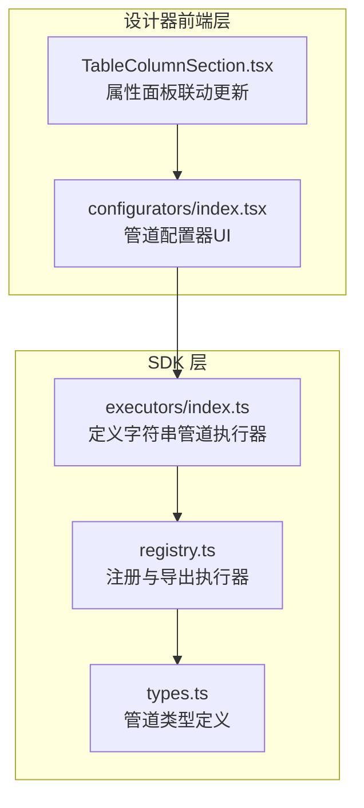
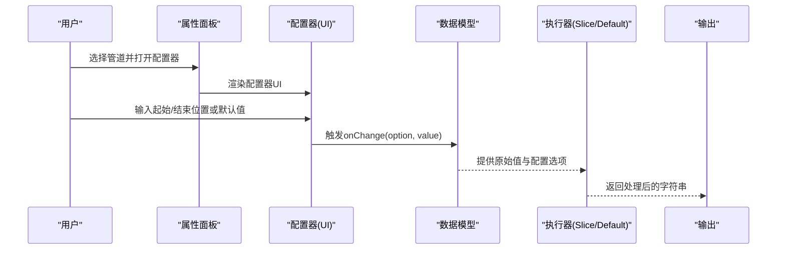
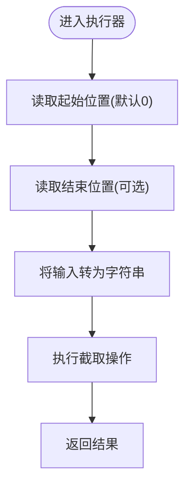
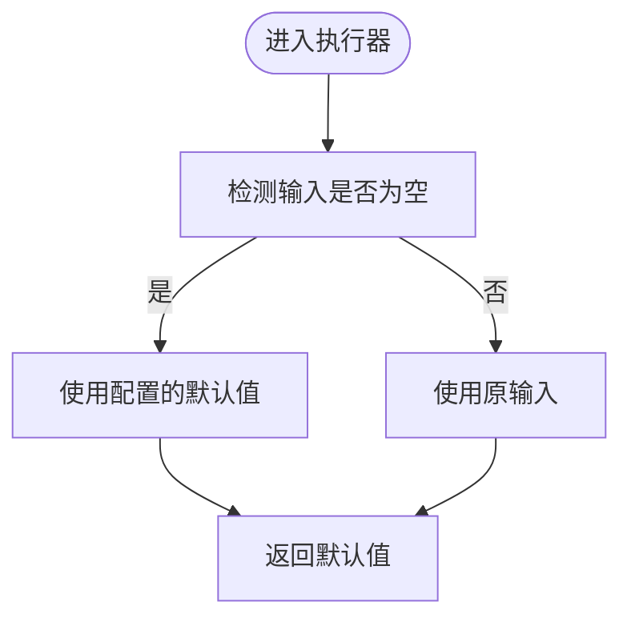
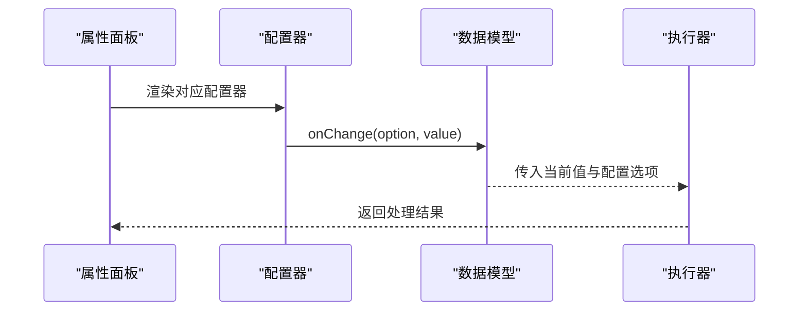

# 字符串操作管道

<cite>
**本文引用的文件**
- [sdk/src/pipes/executors/index.ts](file://sdk/src/pipes/executors/index.ts)
- [designer/src/pipes/configurators/index.tsx](file://designer/src/pipes/configurators/index.tsx)
- [sdk/src/pipes/registry.ts](file://sdk/src/pipes/registry.ts)
- [sdk/src/pipes/types.ts](file://sdk/src/pipes/types.ts)
- [designer/src/pages/Designer/components/PropertyPanel/TableColumnSection.tsx](file://designer/src/pages/Designer/components/PropertyPanel/TableColumnSection.tsx)
</cite>

## 目录
1. [引言](#引言)
2. [项目结构](#项目结构)
3. [核心组件](#核心组件)
4. [架构总览](#架构总览)
5. [详细组件分析](#详细组件分析)
6. [依赖分析](#依赖分析)
7. [性能考虑](#性能考虑)
8. [故障排查指南](#故障排查指南)
9. [结论](#结论)
10. [附录](#附录)

## 引言
本技术指南聚焦于“字符串操作管道”，围绕以下主题展开：字符串截取管道的实现与配置、手机号脱敏等隐私保护思路、默认值管道的空值检测与替代策略、常见应用场景与最佳实践，以及在大数据量场景下的性能优化建议。读者可据此快速理解并正确使用字符串类管道，同时在实际工程中安全、高效地应用。

## 项目结构
本仓库包含两个主要部分：
- SDK 层：提供管道执行器（如截取、默认值、大小写转换等）及注册机制，供渲染引擎或业务逻辑调用。
- 设计器前端层：提供管道配置器 UI，允许用户通过可视化界面配置管道参数（如截取的起始/结束位置、默认值等），并通过属性面板联动更新配置。

图表来源
- [sdk/src/pipes/executors/index.ts:1-44](file://sdk/src/pipes/executors/index.ts#L1-L44)
- [sdk/src/pipes/registry.ts:59-62](file://sdk/src/pipes/registry.ts#L59-L62)
- [sdk/src/pipes/types.ts](file://sdk/src/pipes/types.ts)
- [designer/src/pipes/configurators/index.tsx:25-64](file://designer/src/pipes/configurators/index.tsx#L25-L64)
- [designer/src/pages/Designer/components/PropertyPanel/TableColumnSection.tsx:366-385](file://designer/src/pages/Designer/components/PropertyPanel/TableColumnSection.tsx#L366-L385)

章节来源
- [sdk/src/pipes/executors/index.ts:1-44](file://sdk/src/pipes/executors/index.ts#L1-L44)
- [designer/src/pipes/configurators/index.tsx:25-64](file://designer/src/pipes/configurators/index.tsx#L25-L64)

## 核心组件
- 字符串截取管道（slice）：支持指定起始位置与结束位置进行子串提取，兼容负索引语义，未配置时默认从索引 0 开始。
- 默认值管道（default）：当输入为空值时，返回配置的默认值；若未配置，默认回退为空字符串。
- 大小写转换管道（uppercase/lowercase）：对任意值先转为字符串后进行全大写/全小写转换。
- 管道注册与类型：通过注册表集中管理执行器，并以统一的类型约束保证调用一致性。

章节来源
- [sdk/src/pipes/executors/index.ts:16-44](file://sdk/src/pipes/executors/index.ts#L16-L44)
- [sdk/src/pipes/registry.ts:59-62](file://sdk/src/pipes/registry.ts#L59-L62)
- [sdk/src/pipes/types.ts](file://sdk/src/pipes/types.ts)

## 架构总览
字符串管道的运行链路如下：
- 用户在设计器属性面板中选择“截取字符串”或“默认值”等管道，并通过配置器设置参数。
- 配置变更通过属性面板回调更新到数据模型。
- 渲染引擎或业务逻辑在处理数据时，按顺序执行已配置的管道，最终得到目标字符串结果。

图表来源
- [designer/src/pipes/configurators/index.tsx:25-64](file://designer/src/pipes/configurators/index.tsx#L25-L64)
- [designer/src/pages/Designer/components/PropertyPanel/TableColumnSection.tsx:366-385](file://designer/src/pages/Designer/components/PropertyPanel/TableColumnSection.tsx#L366-L385)
- [sdk/src/pipes/executors/index.ts:28-44](file://sdk/src/pipes/executors/index.ts#L28-L44)

## 详细组件分析

### 字符串截取管道（SlicePipe）
- 功能概述：根据起始位置与结束位置对字符串进行截取，支持负索引，未配置时默认从索引 0 开始。
- 关键点：
  - 起始位置：未提供时默认为 0。
  - 结束位置：未提供时截取至末尾。
  - 类型与注册：在执行器集合中声明，由注册表统一导出。
- 典型用途：字段截断、固定宽度展示、摘要提取等。

图表来源
- [sdk/src/pipes/executors/index.ts:28-36](file://sdk/src/pipes/executors/index.ts#L28-L36)

章节来源
- [sdk/src/pipes/executors/index.ts:28-36](file://sdk/src/pipes/executors/index.ts#L28-L36)
- [designer/src/pipes/configurators/index.tsx:25-46](file://designer/src/pipes/configurators/index.tsx#L25-L46)

### 默认值管道（DefaultPipe）
- 功能概述：当输入为空值时，返回配置的默认值；若未配置，则回退为空字符串。
- 关键点：
  - 空值检测：采用宽松的空值判断（如 null、undefined、空字符串等）。
  - 替代值设置：通过配置项提供默认值。
- 典型用途：占位显示、兜底文案、避免渲染空白。

图表来源
- [sdk/src/pipes/executors/index.ts:38-44](file://sdk/src/pipes/executors/index.ts#L38-L44)

章节来源
- [sdk/src/pipes/executors/index.ts:38-44](file://sdk/src/pipes/executors/index.ts#L38-L44)
- [designer/src/pipes/configurators/index.tsx:49-64](file://designer/src/pipes/configurators/index.tsx#L49-L64)

### 大小写转换管道（Uppercase/Lowercase）
- 功能概述：将任意值先转为字符串，再进行全大写或全小写转换。
- 关键点：
  - 统一转字符串策略，确保非字符串输入也能被处理。
  - 适合标题化、标准化文本等场景。

章节来源
- [sdk/src/pipes/executors/index.ts:16-26](file://sdk/src/pipes/executors/index.ts#L16-L26)

### 手机号脱敏（隐私保护思路）
- 实现思路（概念性说明）：
  - 使用“截取字符串”管道配合“默认值”管道，对手机号中间 4 位进行替换。
  - 典型流程：先对手机号做固定格式校验，再通过截取拼接保留前 3 位与后 4 位，中间替换为星号或其他占位符。
  - 若手机号为空或格式不合法，使用默认值管道兜底显示占位符。
- 注意事项：
  - 建议在业务层先做格式校验与清洗，避免错误数据进入管道链。
  - 脱敏策略应遵循最小披露原则，尽量只暴露必要信息。

（本节为概念性说明，不直接分析具体源码文件）

### 管道配置器与属性面板联动
- 配置器职责：根据管道类型渲染对应的配置 UI（如截取的起始/结束位置、默认值输入框）。
- 属性面板联动：当用户修改配置时，通过回调更新数据模型中的管道配置对象，确保后续执行器拿到最新参数。

图表来源
- [designer/src/pipes/configurators/index.tsx:25-64](file://designer/src/pipes/configurators/index.tsx#L25-L64)
- [designer/src/pages/Designer/components/PropertyPanel/TableColumnSection.tsx:366-385](file://designer/src/pages/Designer/components/PropertyPanel/TableColumnSection.tsx#L366-L385)

章节来源
- [designer/src/pipes/configurators/index.tsx:25-64](file://designer/src/pipes/configurators/index.tsx#L25-L64)
- [designer/src/pages/Designer/components/PropertyPanel/TableColumnSection.tsx:366-385](file://designer/src/pages/Designer/components/PropertyPanel/TableColumnSection.tsx#L366-L385)

## 依赖分析
- 执行器与注册表：
  - 执行器集合导出多个内置管道（如 slice、default、uppercase、lowercase）。
  - 注册表负责将这些执行器注册并统一导出，便于上层按类型查找与调用。
- 类型约束：
  - 通过统一的类型定义保证执行器具备一致的接口形态（type、label、execute）。

图表来源
- [sdk/src/pipes/executors/index.ts:1-44](file://sdk/src/pipes/executors/index.ts#L1-L44)
- [sdk/src/pipes/registry.ts:59-62](file://sdk/src/pipes/registry.ts#L59-L62)
- [sdk/src/pipes/types.ts](file://sdk/src/pipes/types.ts)

章节来源
- [sdk/src/pipes/executors/index.ts:1-44](file://sdk/src/pipes/executors/index.ts#L1-L44)
- [sdk/src/pipes/registry.ts:59-62](file://sdk/src/pipes/registry.ts#L59-L62)
- [sdk/src/pipes/types.ts](file://sdk/src/pipes/types.ts)

## 性能考虑
- 字符串截取：
  - 时间复杂度近似 O(n)，其中 n 为截取长度；尽量减少不必要的多次截取链式调用。
  - 对超长字符串，优先在上游做分段或预截断，避免重复计算。
- 默认值管道：
  - 判断与字符串转换开销极低，通常可忽略；但应避免在热路径中频繁创建新对象。
- 大数据量处理建议：
  - 合理拆分数据批次，避免一次性处理过多记录。
  - 在渲染层延迟计算或缓存中间结果，减少重复执行。
  - 将复杂的格式化逻辑下沉到服务端或离线阶段，前端仅做轻量处理。

（本节为通用性能建议，不直接分析具体源码文件）

## 故障排查指南
- 截取结果异常：
  - 检查起始/结束位置是否越界或为负数时的预期行为是否符合需求。
  - 确认输入是否为字符串，必要时在管道链前加入类型转换。
- 默认值未生效：
  - 确认配置项中是否设置了默认值，且空值检测逻辑是否覆盖了预期的空值类型。
- 配置器不更新：
  - 检查属性面板的回调是否正确触发并更新到数据模型。
  - 确保执行器在注册表中已注册并可被识别。

章节来源
- [sdk/src/pipes/executors/index.ts:28-44](file://sdk/src/pipes/executors/index.ts#L28-L44)
- [designer/src/pipes/configurators/index.tsx:25-64](file://designer/src/pipes/configurators/index.tsx#L25-L64)
- [designer/src/pages/Designer/components/PropertyPanel/TableColumnSection.tsx:366-385](file://designer/src/pages/Designer/components/PropertyPanel/TableColumnSection.tsx#L366-L385)

## 结论
字符串操作管道提供了简洁而强大的文本处理能力。通过“截取字符串”和“默认值”两大基础能力，结合可视化配置器与属性面板联动，可在设计器中快速完成常见的文本格式化任务。在实际工程中，建议结合类型约束、注册表与统一的执行器接口，构建稳定、可维护的管道体系，并在大数据量场景下关注性能与缓存策略。

## 附录
- 常见应用场景与最佳实践：
  - 文本截断：对超长描述进行定宽展示，优先使用“截取字符串”。
  - 占位与兜底：对缺失或空值字段统一显示默认值，使用“默认值”管道。
  - 标准化：对标题或关键词进行大小写统一，使用“转大写/转小写”。
  - 隐私保护：手机号脱敏可通过组合“截取字符串+默认值”实现，或在业务层进行格式校验后再处理。
- 参数配置要点：
  - 截取：起始位置默认 0，结束位置可选；注意负索引与边界情况。
  - 默认值：明确空值类型，合理设置默认文案，避免误导用户。

（本节为总结性内容，不直接分析具体源码文件）