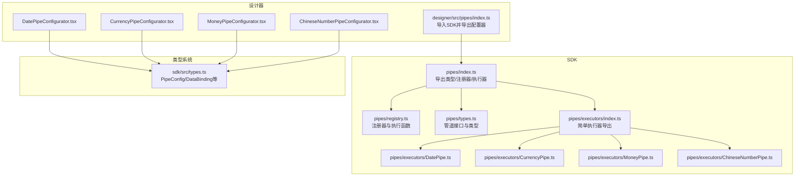
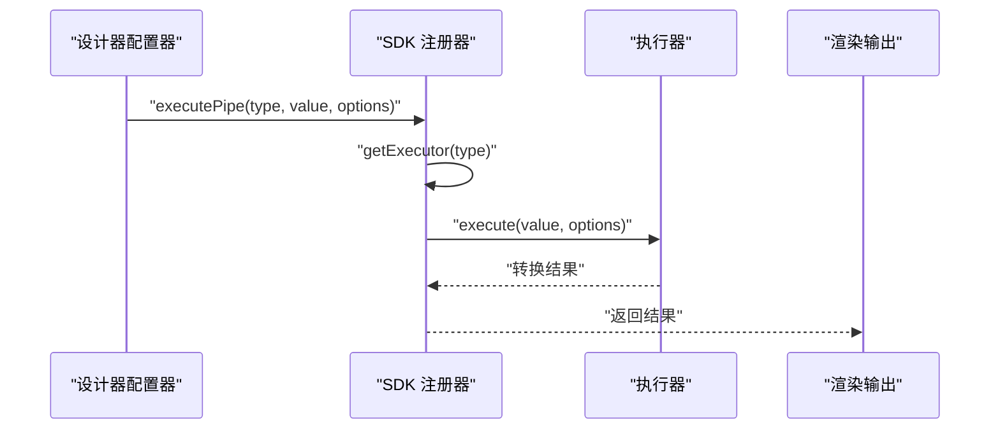
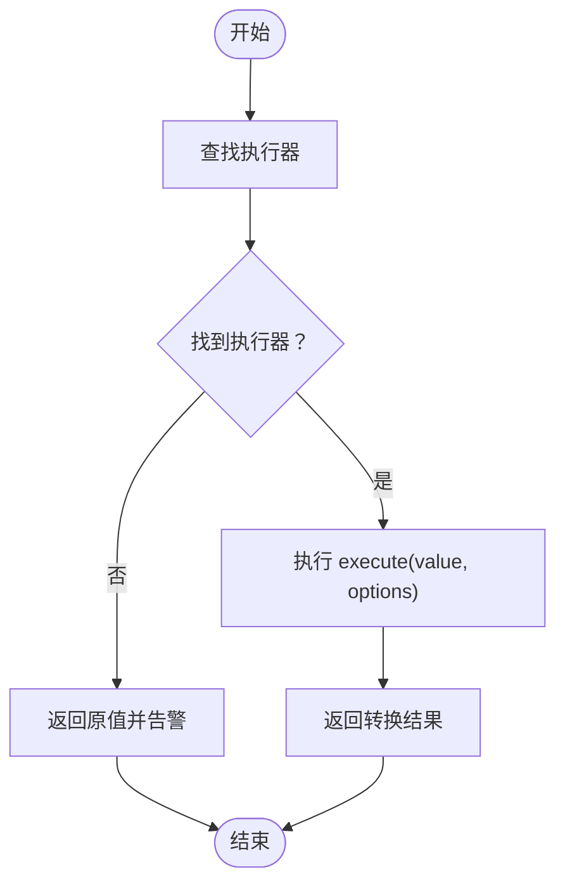
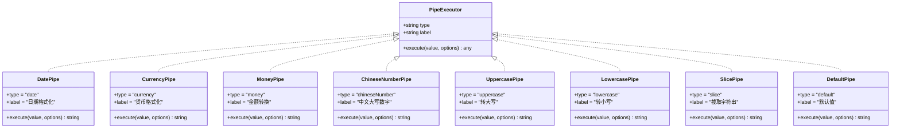
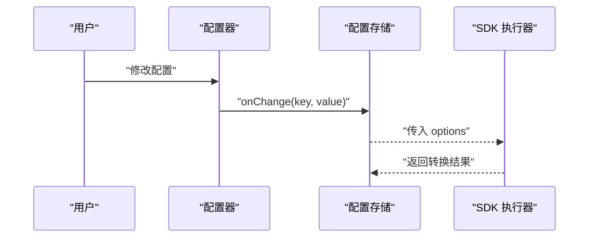
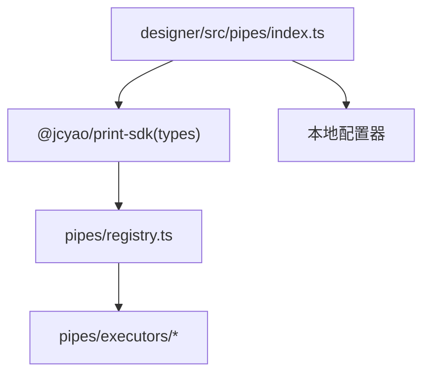

# 数据管道系统

<cite>
**本文引用的文件**
- [sdk/src/pipes/index.ts](file://sdk/src/pipes/index.ts)
- [sdk/src/pipes/registry.ts](file://sdk/src/pipes/registry.ts)
- [sdk/src/pipes/types.ts](file://sdk/src/pipes/types.ts)
- [sdk/src/pipes/executors/index.ts](file://sdk/src/pipes/executors/index.ts)
- [sdk/src/pipes/executors/DatePipe.ts](file://sdk/src/pipes/executors/DatePipe.ts)
- [sdk/src/pipes/executors/CurrencyPipe.ts](file://sdk/src/pipes/executors/CurrencyPipe.ts)
- [sdk/src/pipes/executors/MoneyPipe.ts](file://sdk/src/pipes/executors/MoneyPipe.ts)
- [sdk/src/pipes/executors/ChineseNumberPipe.ts](file://sdk/src/pipes/executors/ChineseNumberPipe.ts)
- [designer/src/pipes/index.ts](file://designer/src/pipes/index.ts)
- [designer/src/pipes/configurators/DatePipeConfigurator.tsx](file://designer/src/pipes/configurators/DatePipeConfigurator.tsx)
- [designer/src/pipes/configurators/CurrencyPipeConfigurator.tsx](file://designer/src/pipes/configurators/CurrencyPipeConfigurator.tsx)
- [designer/src/pipes/configurators/MoneyPipeConfigurator.tsx](file://designer/src/pipes/configurators/MoneyPipeConfigurator.tsx)
- [designer/src/pipes/configurators/ChineseNumberPipeConfigurator.tsx](file://designer/src/pipes/configurators/ChineseNumberPipeConfigurator.tsx)
- [sdk/src/types.ts](file://sdk/src/types.ts)
</cite>

## 目录
1. [简介](#简介)
2. [项目结构](#项目结构)
3. [核心组件](#核心组件)
4. [架构总览](#架构总览)
5. [详细组件分析](#详细组件分析)
6. [依赖关系分析](#依赖关系分析)
7. [性能考虑](#性能考虑)
8. [故障排查指南](#故障排查指南)
9. [结论](#结论)
10. [附录](#附录)

## 简介
本系统提供一套可扩展的数据管道转换能力，支持在设计阶段通过可视化配置器对数据进行链式转换，并在渲染阶段由统一的执行器完成最终格式化输出。系统采用“注册器模式”集中管理执行器，“执行器与配置器分离”的设计理念，既保证了前端可视化配置的易用性，又确保了后端执行的稳定与可扩展。

## 项目结构
- SDK 层：提供管道类型定义、注册器、内置执行器及入口导出。
- 设计器层：提供各管道对应的 UI 配置器，负责收集用户配置并通过事件回调更新配置。
- 类型系统：统一的数据绑定与管道配置结构，支撑表格合计、组件绑定等场景。

**图表来源**
- [sdk/src/pipes/index.ts:1-9](file://sdk/src/pipes/index.ts#L1-L9)
- [sdk/src/pipes/registry.ts:1-65](file://sdk/src/pipes/registry.ts#L1-L65)
- [sdk/src/pipes/types.ts:1-30](file://sdk/src/pipes/types.ts#L1-L30)
- [sdk/src/pipes/executors/index.ts:1-45](file://sdk/src/pipes/executors/index.ts#L1-L45)
- [sdk/src/pipes/executors/DatePipe.ts:1-35](file://sdk/src/pipes/executors/DatePipe.ts#L1-L35)
- [sdk/src/pipes/executors/CurrencyPipe.ts:1-17](file://sdk/src/pipes/executors/CurrencyPipe.ts#L1-L17)
- [sdk/src/pipes/executors/MoneyPipe.ts:1-130](file://sdk/src/pipes/executors/MoneyPipe.ts#L1-L130)
- [sdk/src/pipes/executors/ChineseNumberPipe.ts:1-138](file://sdk/src/pipes/executors/ChineseNumberPipe.ts#L1-L138)
- [designer/src/pipes/index.ts:1-11](file://designer/src/pipes/index.ts#L1-L11)
- [designer/src/pipes/configurators/DatePipeConfigurator.tsx:1-23](file://designer/src/pipes/configurators/DatePipeConfigurator.tsx#L1-L23)
- [designer/src/pipes/configurators/CurrencyPipeConfigurator.tsx:1-23](file://designer/src/pipes/configurators/CurrencyPipeConfigurator.tsx#L1-L23)
- [designer/src/pipes/configurators/MoneyPipeConfigurator.tsx:1-143](file://designer/src/pipes/configurators/MoneyPipeConfigurator.tsx#L1-L143)
- [designer/src/pipes/configurators/ChineseNumberPipeConfigurator.tsx:1-58](file://designer/src/pipes/configurators/ChineseNumberPipeConfigurator.tsx#L1-L58)
- [sdk/src/types.ts:77-86](file://sdk/src/types.ts#L77-L86)

**章节来源**
- [sdk/src/pipes/index.ts:1-9](file://sdk/src/pipes/index.ts#L1-L9)
- [designer/src/pipes/index.ts:1-11](file://designer/src/pipes/index.ts#L1-L11)
- [sdk/src/types.ts:77-86](file://sdk/src/types.ts#L77-L86)

## 核心组件
- 管道执行器接口：定义 type、label 与 execute 方法，统一执行签名。
- 注册器：集中注册与检索执行器，提供执行函数与可用管道列表。
- 执行器集合：内置多种执行器，覆盖日期、货币、金额、中文大写、大小写、截取、默认值等。
- 配置器：在设计器中提供可视化的配置界面，收集用户选项并回传给执行器。
- 类型系统：PipeConfig、DataBinding 等类型，支撑链式管道与数据绑定。

**章节来源**
- [sdk/src/pipes/types.ts:11-29](file://sdk/src/pipes/types.ts#L11-L29)
- [sdk/src/pipes/registry.ts:12-52](file://sdk/src/pipes/registry.ts#L12-L52)
- [sdk/src/pipes/executors/index.ts:16-44](file://sdk/src/pipes/executors/index.ts#L16-L44)
- [sdk/src/types.ts:77-86](file://sdk/src/types.ts#L77-L86)

## 架构总览
系统采用“注册器模式 + 执行器与配置器分离”的架构：
- 注册器集中管理执行器，提供查询与执行能力。
- 设计器侧仅维护配置器，不直接包含执行逻辑，降低耦合。
- 执行器在 SDK 中实现，保证跨环境复用与一致性。

**图表来源**
- [sdk/src/pipes/registry.ts:45-52](file://sdk/src/pipes/registry.ts#L45-L52)
- [sdk/src/pipes/executors/DatePipe.ts:11-33](file://sdk/src/pipes/executors/DatePipe.ts#L11-L33)
- [sdk/src/pipes/executors/CurrencyPipe.ts:11-15](file://sdk/src/pipes/executors/CurrencyPipe.ts#L11-L15)
- [sdk/src/pipes/executors/MoneyPipe.ts:63-128](file://sdk/src/pipes/executors/MoneyPipe.ts#L63-L128)
- [sdk/src/pipes/executors/ChineseNumberPipe.ts:103-136](file://sdk/src/pipes/executors/ChineseNumberPipe.ts#L103-L136)

## 详细组件分析

### 管道注册器与执行器
- 注册器职责：注册内置执行器、提供执行函数、导出可用管道列表。
- 执行流程：根据 type 查找执行器，若未找到则回退原值并告警。
- 初始化：在注册器文件末尾集中注册所有内置执行器。

**图表来源**
- [sdk/src/pipes/registry.ts:45-52](file://sdk/src/pipes/registry.ts#L45-L52)

**章节来源**
- [sdk/src/pipes/registry.ts:12-52](file://sdk/src/pipes/registry.ts#L12-L52)
- [sdk/src/pipes/registry.ts:54-65](file://sdk/src/pipes/registry.ts#L54-L65)

### 内置执行器概览
- 日期格式化：支持 YYYY-MM-DD HH:mm:ss 等占位符替换。
- 货币格式化：支持符号与精度配置。
- 金额转换：支持分↔元、精度、千分位、中文大写、带符号等。
- 中文大写数字：支持整数与小数、单位后缀、原值+大写组合。
- 大小写转换：全大写与全小写。
- 字符串截取：支持 start/end 位置。
- 默认值：空值回退。
- 手机号脱敏：可在上层业务或自定义执行器中实现（当前仓库未提供专用执行器）。

**章节来源**
- [sdk/src/pipes/executors/DatePipe.ts:7-34](file://sdk/src/pipes/executors/DatePipe.ts#L7-L34)
- [sdk/src/pipes/executors/CurrencyPipe.ts:7-16](file://sdk/src/pipes/executors/CurrencyPipe.ts#L7-L16)
- [sdk/src/pipes/executors/MoneyPipe.ts:59-129](file://sdk/src/pipes/executors/MoneyPipe.ts#L59-L129)
- [sdk/src/pipes/executors/ChineseNumberPipe.ts:99-137](file://sdk/src/pipes/executors/ChineseNumberPipe.ts#L99-L137)
- [sdk/src/pipes/executors/index.ts:16-44](file://sdk/src/pipes/executors/index.ts#L16-L44)

### 执行器类图

**图表来源**
- [sdk/src/pipes/types.ts:11-29](file://sdk/src/pipes/types.ts#L11-L29)
- [sdk/src/pipes/executors/DatePipe.ts:7-34](file://sdk/src/pipes/executors/DatePipe.ts#L7-L34)
- [sdk/src/pipes/executors/CurrencyPipe.ts:7-16](file://sdk/src/pipes/executors/CurrencyPipe.ts#L7-L16)
- [sdk/src/pipes/executors/MoneyPipe.ts:59-129](file://sdk/src/pipes/executors/MoneyPipe.ts#L59-L129)
- [sdk/src/pipes/executors/ChineseNumberPipe.ts:99-137](file://sdk/src/pipes/executors/ChineseNumberPipe.ts#L99-L137)
- [sdk/src/pipes/executors/index.ts:16-44](file://sdk/src/pipes/executors/index.ts#L16-L44)

### 配置器与参数配置
- 配置器职责：基于 PipeConfig 提供 UI，收集 options 并通过回调更新。
- 参数传递：executePipe 接收 options，执行器按需解析。
- 设计器入口：设计器仅导出配置器，执行器来自 SDK，保持职责分离。

**图表来源**
- [designer/src/pipes/configurators/DatePipeConfigurator.tsx:12-21](file://designer/src/pipes/configurators/DatePipeConfigurator.tsx#L12-L21)
- [designer/src/pipes/configurators/CurrencyPipeConfigurator.tsx:12-21](file://designer/src/pipes/configurators/CurrencyPipeConfigurator.tsx#L12-L21)
- [designer/src/pipes/configurators/MoneyPipeConfigurator.tsx:12-141](file://designer/src/pipes/configurators/MoneyPipeConfigurator.tsx#L12-L141)
- [designer/src/pipes/configurators/ChineseNumberPipeConfigurator.tsx:14-56](file://designer/src/pipes/configurators/ChineseNumberPipeConfigurator.tsx#L14-L56)
- [sdk/src/pipes/registry.ts:45-52](file://sdk/src/pipes/registry.ts#L45-L52)

**章节来源**
- [designer/src/pipes/index.ts:6-10](file://designer/src/pipes/index.ts#L6-L10)
- [sdk/src/types.ts:77-86](file://sdk/src/types.ts#L77-L86)

### 管道链式调用机制
- 数据绑定结构支持在单一字段上串联多个管道，形成链式转换。
- 执行顺序：从前到后依次执行，每个管道的输出作为下一个管道的输入。
- 典型场景：先货币化，再加符号；先金额转换，再中文大写。

**图表来源**
- [sdk/src/types.ts:82-86](file://sdk/src/types.ts#L82-L86)

**章节来源**
- [sdk/src/types.ts:77-86](file://sdk/src/types.ts#L77-L86)

### 自定义管道开发指南
- 实现 PipeExecutor 接口：定义 type、label 与 execute 方法。
- 在注册器中注册：通过 registerExecutor(type) 完成注册。
- 设计器配置器：新增对应配置器组件，渲染配置项并回传 onChange。
- 注意事项：execute 方法应健壮处理空值与异常，避免影响整体渲染。

**章节来源**
- [sdk/src/pipes/types.ts:11-29](file://sdk/src/pipes/types.ts#L11-L29)
- [sdk/src/pipes/registry.ts:17-26](file://sdk/src/pipes/registry.ts#L17-L26)
- [designer/src/pipes/configurators/DatePipeConfigurator.tsx:9-22](file://designer/src/pipes/configurators/DatePipeConfigurator.tsx#L9-L22)

### 实际使用案例
- 日期字段：配置日期格式化，占位符替换为 YYYY-MM-DD HH:mm:ss。
- 货币字段：配置货币符号与精度，输出如 ¥9999.00。
- 金额字段：分转元、保留两位小数、添加千分位与货币符号；或输出中文大写金额。
- 中文大写数字：支持仅大写或原值+大写组合，可配置连接符与单位。
- 大小写转换：将任意字符串转为全大写或全小写。
- 字符串截取：指定起始与结束位置，实现手机号中间脱敏等效果。
- 默认值：当值为空时回退为指定默认字符串。
- 链式转换：先货币化，再加符号；先金额转换，再中文大写。

**章节来源**
- [sdk/src/pipes/executors/DatePipe.ts:11-33](file://sdk/src/pipes/executors/DatePipe.ts#L11-L33)
- [sdk/src/pipes/executors/CurrencyPipe.ts:11-15](file://sdk/src/pipes/executors/CurrencyPipe.ts#L11-L15)
- [sdk/src/pipes/executors/MoneyPipe.ts:63-128](file://sdk/src/pipes/executors/MoneyPipe.ts#L63-L128)
- [sdk/src/pipes/executors/ChineseNumberPipe.ts:103-136](file://sdk/src/pipes/executors/ChineseNumberPipe.ts#L103-L136)
- [sdk/src/pipes/executors/index.ts:16-44](file://sdk/src/pipes/executors/index.ts#L16-L44)
- [sdk/src/types.ts:82-86](file://sdk/src/types.ts#L82-L86)

## 依赖关系分析
- 设计器仅依赖 SDK 的类型与执行器，不包含执行逻辑，降低耦合度。
- 注册器集中管理执行器，避免分散注册带来的遗漏。
- 执行器之间无直接依赖，通过统一接口解耦。

**图表来源**
- [designer/src/pipes/index.ts:6-10](file://designer/src/pipes/index.ts#L6-L10)
- [sdk/src/pipes/registry.ts:6-7](file://sdk/src/pipes/registry.ts#L6-L7)

**章节来源**
- [designer/src/pipes/index.ts:6-10](file://designer/src/pipes/index.ts#L6-L10)
- [sdk/src/pipes/registry.ts:6-7](file://sdk/src/pipes/registry.ts#L6-L7)

## 性能考虑
- 执行器内部尽量避免重复计算与高复杂度操作，必要时引入缓存策略。
- 对于金额转换，优先使用高精度数值库，减少浮点误差。
- 链式管道过长可能影响渲染性能，建议合理拆分与合并。
- 大文本截取与中文大写转换属于 O(n) 操作，注意批量处理时的节流与批处理。

## 故障排查指南
- 执行器未找到：检查 type 是否正确，确认已在注册器中注册。
- 空值处理：执行器通常对空值有默认回退，若不符合预期，请检查配置。
- 异常捕获：金额转换等复杂逻辑包含 try/catch，错误时会回退原值并记录日志。

**章节来源**
- [sdk/src/pipes/registry.ts:47-50](file://sdk/src/pipes/registry.ts#L47-L50)
- [sdk/src/pipes/executors/MoneyPipe.ts:124-127](file://sdk/src/pipes/executors/MoneyPipe.ts#L124-L127)
- [sdk/src/pipes/executors/ChineseNumberPipe.ts:132-135](file://sdk/src/pipes/executors/ChineseNumberPipe.ts#L132-L135)

## 结论
本数据管道系统通过注册器模式与执行器/配置器分离的设计，实现了高内聚、低耦合的可扩展架构。内置八种常用转换满足大多数打印场景需求，同时提供清晰的链式调用与自定义扩展路径，便于在复杂业务中灵活组合与演进。

## 附录
- 管道类型与选项要点
  - 日期格式化：format 占位符（如 YYYY-MM-DD HH:mm:ss）。
  - 货币格式化：symbol 货币符号、precision 精度。
  - 金额转换：mode 分/元互转或不转换、precision 精度、symbol 符号、separator 千分位、format 输出格式 number/chineseUppercase、uppercaseMode 中文大写模式、separator 连接符。
  - 中文大写数字：mode uppercase/both、separator 连接符、unit 单位。
  - 大小写转换：无需选项。
  - 字符串截取：start 起始位置、end 结束位置。
  - 默认值：defaultValue 回退值。

**章节来源**
- [sdk/src/pipes/executors/DatePipe.ts:14](file://sdk/src/pipes/executors/DatePipe.ts#L14)
- [sdk/src/pipes/executors/CurrencyPipe.ts:12-14](file://sdk/src/pipes/executors/CurrencyPipe.ts#L12-L14)
- [sdk/src/pipes/executors/MoneyPipe.ts:70-74](file://sdk/src/pipes/executors/MoneyPipe.ts#L70-L74)
- [sdk/src/pipes/executors/MoneyPipe.ts:96-107](file://sdk/src/pipes/executors/MoneyPipe.ts#L96-L107)
- [sdk/src/pipes/executors/ChineseNumberPipe.ts:118-121](file://sdk/src/pipes/executors/ChineseNumberPipe.ts#L118-L121)
- [sdk/src/pipes/executors/index.ts:32-35](file://sdk/src/pipes/executors/index.ts#L32-L35)
- [sdk/src/pipes/executors/index.ts:42](file://sdk/src/pipes/executors/index.ts#L42)