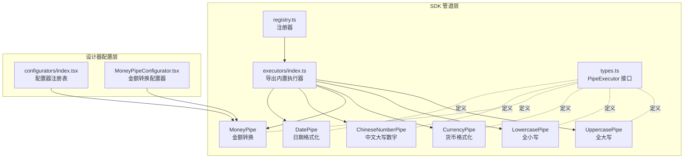
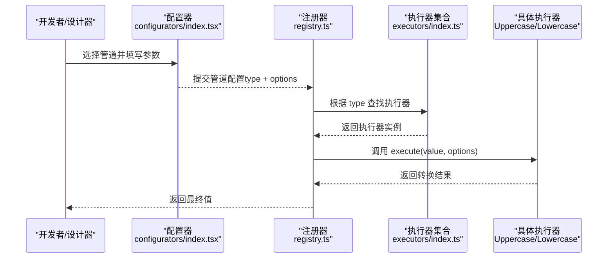
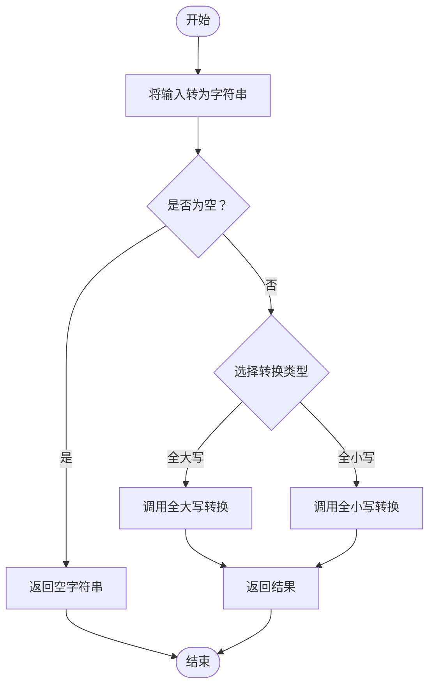
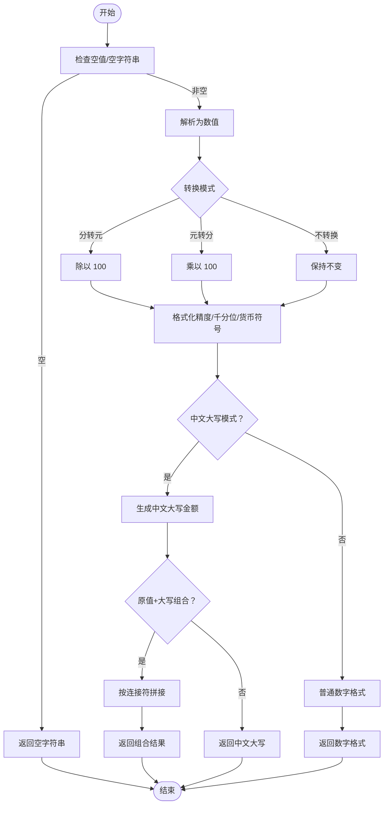
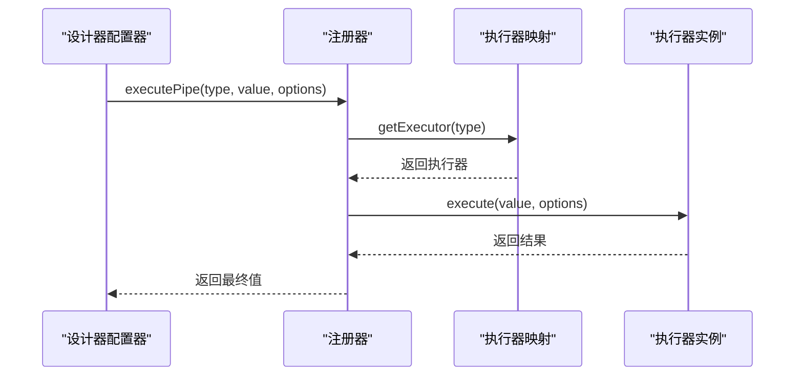
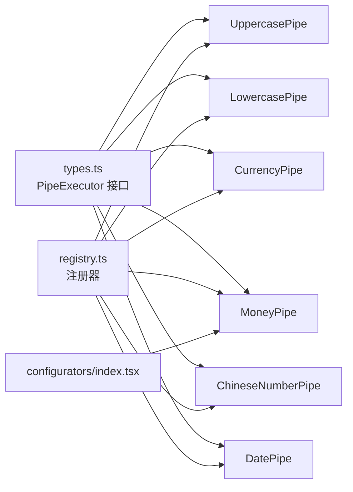

# 文本转换管道

<cite>
**本文引用的文件**
- [sdk/src/pipes/registry.ts](file://sdk/src/pipes/registry.ts)
- [sdk/src/pipes/executors/index.ts](file://sdk/src/pipes/executors/index.ts)
- [sdk/src/pipes/executors/ChineseNumberPipe.ts](file://sdk/src/pipes/executors/ChineseNumberPipe.ts)
- [sdk/src/pipes/executors/CurrencyPipe.ts](file://sdk/src/pipes/executors/CurrencyPipe.ts)
- [sdk/src/pipes/executors/DatePipe.ts](file://sdk/src/pipes/executors/DatePipe.ts)
- [sdk/src/pipes/executors/MoneyPipe.ts](file://sdk/src/pipes/executors/MoneyPipe.ts)
- [sdk/src/pipes/types.ts](file://sdk/src/pipes/types.ts)
- [sdk/src/types.ts](file://sdk/src/types.ts)
- [designer/src/pipes/configurators/index.tsx](file://designer/src/pipes/configurators/index.tsx)
- [designer/src/pipes/configurators/MoneyPipeConfigurator.tsx](file://designer/src/pipes/configurators/MoneyPipeConfigurator.tsx)
</cite>

## 目录
1. [简介](#简介)
2. [项目结构](#项目结构)
3. [核心组件](#核心组件)
4. [架构总览](#架构总览)
5. [详细组件分析](#详细组件分析)
6. [依赖关系分析](#依赖关系分析)
7. [性能考量](#性能考量)
8. [故障排查指南](#故障排查指南)
9. [结论](#结论)
10. [附录](#附录)

## 简介
本技术文档围绕“文本转换管道组”展开，重点介绍大小写转换（全大写与全小写）的实现原理、Unicode 字符处理与本地化支持现状、性能优化策略与内存使用考量，并结合实际应用场景（如数据标准化、显示格式统一）给出组合使用与链式调用示例。本文同时梳理了 SDK 端的管道注册与执行机制、设计器端的管道配置器以及与表格合计等场景的集成方式。

## 项目结构
文本转换管道位于 SDK 的 pipes 子模块中，采用“执行器 + 注册器”的架构设计：
- 执行器：具体实现各类转换逻辑（如大小写、货币、金额、中文大写、日期等）
- 注册器：集中管理执行器的注册、查询与执行
- 类型定义：统一约束执行器接口与数据绑定中的管道配置结构
- 设计器配置器：在可视化界面中为不同管道提供参数配置入口

图表来源
- [sdk/src/pipes/registry.ts:1-65](file://sdk/src/pipes/registry.ts#L1-L65)
- [sdk/src/pipes/executors/index.ts:1-45](file://sdk/src/pipes/executors/index.ts#L1-L45)
- [sdk/src/pipes/executors/CurrencyPipe.ts:1-17](file://sdk/src/pipes/executors/CurrencyPipe.ts#L1-L17)
- [sdk/src/pipes/executors/MoneyPipe.ts:1-129](file://sdk/src/pipes/executors/MoneyPipe.ts#L1-L129)
- [sdk/src/pipes/executors/ChineseNumberPipe.ts:1-138](file://sdk/src/pipes/executors/ChineseNumberPipe.ts#L1-L138)
- [sdk/src/pipes/executors/DatePipe.ts:1-35](file://sdk/src/pipes/executors/DatePipe.ts#L1-L35)
- [sdk/src/pipes/types.ts:1-30](file://sdk/src/pipes/types.ts#L1-L30)
- [designer/src/pipes/configurators/index.tsx:66-84](file://designer/src/pipes/configurators/index.tsx#L66-L84)
- [designer/src/pipes/configurators/MoneyPipeConfigurator.tsx:65-97](file://designer/src/pipes/configurators/MoneyPipeConfigurator.tsx#L65-L97)

章节来源
- [sdk/src/pipes/registry.ts:1-65](file://sdk/src/pipes/registry.ts#L1-L65)
- [sdk/src/pipes/executors/index.ts:1-45](file://sdk/src/pipes/executors/index.ts#L1-L45)
- [sdk/src/pipes/types.ts:1-30](file://sdk/src/pipes/types.ts#L1-L30)

## 核心组件
- 管道执行器接口：统一定义 type、label 与 execute 方法，确保各执行器具备一致的调用契约
- 大小写转换执行器：提供全大写与全小写两种简单转换
- 货币与金额执行器：支持数值格式化、千分位分隔、中文大写金额等
- 中文大写数字执行器：支持整数与小数的中文大写读法
- 日期格式化执行器：支持多种占位符替换
- 注册器：集中注册与查找执行器，并提供统一的执行入口

章节来源
- [sdk/src/pipes/types.ts:11-29](file://sdk/src/pipes/types.ts#L11-L29)
- [sdk/src/pipes/executors/index.ts:16-44](file://sdk/src/pipes/executors/index.ts#L16-L44)
- [sdk/src/pipes/executors/CurrencyPipe.ts:7-16](file://sdk/src/pipes/executors/CurrencyPipe.ts#L7-L16)
- [sdk/src/pipes/executors/MoneyPipe.ts:59-129](file://sdk/src/pipes/executors/MoneyPipe.ts#L59-L129)
- [sdk/src/pipes/executors/ChineseNumberPipe.ts:99-138](file://sdk/src/pipes/executors/ChineseNumberPipe.ts#L99-L138)
- [sdk/src/pipes/executors/DatePipe.ts:7-35](file://sdk/src/pipes/executors/DatePipe.ts#L7-L35)
- [sdk/src/pipes/registry.ts:12-52](file://sdk/src/pipes/registry.ts#L12-L52)

## 架构总览
管道系统通过注册器集中管理执行器，设计器侧通过配置器为不同管道提供参数面板，最终在渲染或数据绑定阶段按配置链式执行。

图表来源
- [sdk/src/pipes/registry.ts:45-52](file://sdk/src/pipes/registry.ts#L45-L52)
- [sdk/src/pipes/executors/index.ts:16-44](file://sdk/src/pipes/executors/index.ts#L16-L44)
- [designer/src/pipes/configurators/index.tsx:66-84](file://designer/src/pipes/configurators/index.tsx#L66-L84)

## 详细组件分析

### 大小写转换执行器（全大写与全小写）
- 实现原理
  - 全大写：将输入值转为字符串后调用全大写转换
  - 全小写：将输入值转为字符串后调用全小写转换
- Unicode 与本地化
  - 使用语言无关的字符串方法进行转换，适用于 ASCII 字母
  - 对于需要严格本地化的场景（如土耳其语 dotted/dotless i 差异），建议在上层业务或自定义执行器中引入 ICU 或 locale-aware 库
- 性能与内存
  - 时间复杂度 O(n)，空间复杂度 O(n)，其中 n 为字符串长度
  - 仅进行一次字符串转换，内存开销主要来自新字符串对象

图表来源
- [sdk/src/pipes/executors/index.ts:16-26](file://sdk/src/pipes/executors/index.ts#L16-L26)

章节来源
- [sdk/src/pipes/executors/index.ts:16-26](file://sdk/src/pipes/executors/index.ts#L16-L26)

### 货币格式化执行器
- 功能要点
  - 支持货币符号与精度控制
  - 对空值进行安全兜底
- 适用场景
  - 展示价格、账单金额等

章节来源
- [sdk/src/pipes/executors/CurrencyPipe.ts:7-16](file://sdk/src/pipes/executors/CurrencyPipe.ts#L7-L16)

### 金额转换执行器（MoneyPipe）
- 功能要点
  - 支持“分转元”“元转分”“不转换”
  - 支持精度控制、千分位分隔、货币符号
  - 支持中文大写金额（含元角分整）
  - 支持“原值+中文大写”组合输出与连接符配置
- 错误处理
  - 对异常输入进行捕获并回退为原始值

图表来源
- [sdk/src/pipes/executors/MoneyPipe.ts:63-129](file://sdk/src/pipes/executors/MoneyPipe.ts#L63-L129)

章节来源
- [sdk/src/pipes/executors/MoneyPipe.ts:59-129](file://sdk/src/pipes/executors/MoneyPipe.ts#L59-L129)

### 中文大写数字执行器（ChineseNumberPipe）
- 功能要点
  - 支持整数与小数的中文大写读法
  - 支持“原值+中文大写”组合输出与连接符配置
  - 支持附加单位后缀
- 错误处理
  - 对非法数值进行兜底

章节来源
- [sdk/src/pipes/executors/ChineseNumberPipe.ts:99-138](file://sdk/src/pipes/executors/ChineseNumberPipe.ts#L99-L138)

### 日期格式化执行器（DatePipe）
- 功能要点
  - 支持 YYYY-MM-DD 等占位符替换
  - 对无效日期回退为原始值

章节来源
- [sdk/src/pipes/executors/DatePipe.ts:7-35](file://sdk/src/pipes/executors/DatePipe.ts#L7-L35)

### 管道注册与执行流程
- 注册器负责维护执行器映射、提供查询与执行入口
- 在设计器中，通过配置器为不同管道提供参数面板，最终在运行时按配置链式执行

图表来源
- [sdk/src/pipes/registry.ts:45-52](file://sdk/src/pipes/registry.ts#L45-L52)

章节来源
- [sdk/src/pipes/registry.ts:12-52](file://sdk/src/pipes/registry.ts#L12-L52)

## 依赖关系分析
- 执行器依赖统一的接口类型定义，保证扩展性与一致性
- 注册器集中管理执行器，避免分散的导入与初始化
- 设计器配置器通过注册表动态加载对应配置器，形成松耦合

图表来源
- [sdk/src/pipes/types.ts:11-29](file://sdk/src/pipes/types.ts#L11-L29)
- [sdk/src/pipes/registry.ts:12-52](file://sdk/src/pipes/registry.ts#L12-L52)
- [designer/src/pipes/configurators/index.tsx:66-84](file://designer/src/pipes/configurators/index.tsx#L66-L84)

章节来源
- [sdk/src/pipes/types.ts:11-29](file://sdk/src/pipes/types.ts#L11-L29)
- [sdk/src/pipes/registry.ts:12-52](file://sdk/src/pipes/registry.ts#L12-L52)
- [designer/src/pipes/configurators/index.tsx:66-84](file://designer/src/pipes/configurators/index.tsx#L66-L84)

## 性能考量
- 时间复杂度
  - 大小写转换：O(n)
  - 数字格式化/中文大写：O(n)（取决于字符串长度与位数）
  - 金额转换：整体 O(n)，包含解析、运算与格式化步骤
- 内存使用
  - 主要消耗在中间字符串对象的创建与拼接
  - 建议在批量处理时复用字符串缓冲或采用流式处理思路
- 优化建议
  - 缓存常用格式化结果（如固定精度的货币格式）
  - 对高频调用的管道进行去抖/节流
  - 在前端渲染场景中，优先使用纯函数式转换，避免不必要的 DOM 操作
  - 对超长文本分片处理，减少单次内存峰值

## 故障排查指南
- 管道未找到
  - 现象：执行时打印警告并回退为原始值
  - 排查：确认管道类型是否正确、是否已完成注册
- 数值转换异常
  - 现象：抛出错误或返回原始值
  - 排查：检查输入是否为合法数值、精度与模式配置是否合理
- 金额中文大写输出不符合预期
  - 现象：缺少“整”或“零”等
  - 排查：核对金额的元角分拆分逻辑与组合模式（原值+大写）

章节来源
- [sdk/src/pipes/registry.ts:47-49](file://sdk/src/pipes/registry.ts#L47-L49)
- [sdk/src/pipes/executors/MoneyPipe.ts:124-127](file://sdk/src/pipes/executors/MoneyPipe.ts#L124-L127)
- [sdk/src/pipes/executors/ChineseNumberPipe.ts:132-135](file://sdk/src/pipes/executors/ChineseNumberPipe.ts#L132-L135)

## 结论
文本转换管道以“执行器 + 注册器 + 配置器”的分层架构实现，既保证了扩展性，又提供了良好的开发体验。大小写转换作为最基础的文本处理能力，具备线性时间复杂度与较低内存占用；在更复杂的金额与中文大写场景中，通过模式切换与组合输出满足多样化需求。建议在生产环境中结合缓存与批处理策略进一步提升性能，并针对本地化需求在上层引入更完善的国际化方案。

## 附录

### 实际应用场景与链式调用示例
- 数据标准化
  - 场景：统一用户输入的姓名、地址等字段大小写
  - 示例：先全小写再首字母大写（可在上层自定义执行器实现）
- 显示格式统一
  - 场景：金额展示统一为带货币符号与千分位的格式
  - 示例：金额转换（分转元 + 千分位 + 货币符号）
- 中文大写金额
  - 场景：财务票据、合同金额的大写化
  - 示例：金额转换（中文大写模式）或中文大写数字管道
- 组合使用
  - 场景：先进行金额转换，再进行中文大写金额输出
  - 示例：[MoneyPipeConfigurator 参数配置:65-97](file://designer/src/pipes/configurators/MoneyPipeConfigurator.tsx#L65-L97)

章节来源
- [designer/src/pipes/configurators/MoneyPipeConfigurator.tsx:65-97](file://designer/src/pipes/configurators/MoneyPipeConfigurator.tsx#L65-L97)

### 与表格合计的集成
- 表格列合计支持通过管道对合计值进行转换（如中文大写）
- 管道配置可直接应用于合计行，便于统一格式

章节来源
- [sdk/src/types.ts:94-101](file://sdk/src/types.ts#L94-L101)