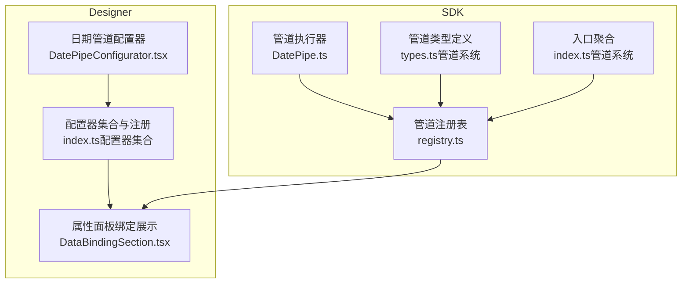
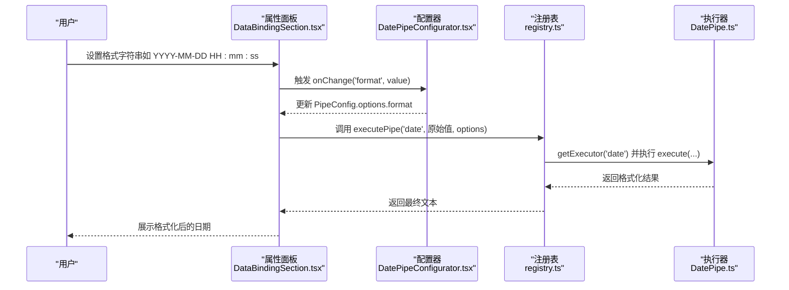
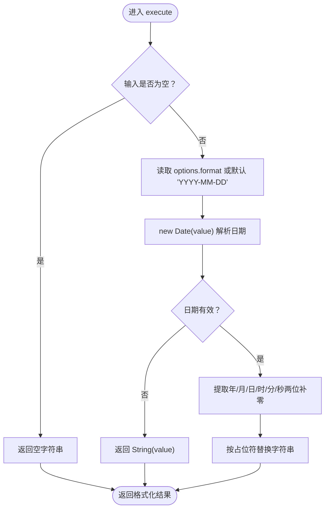
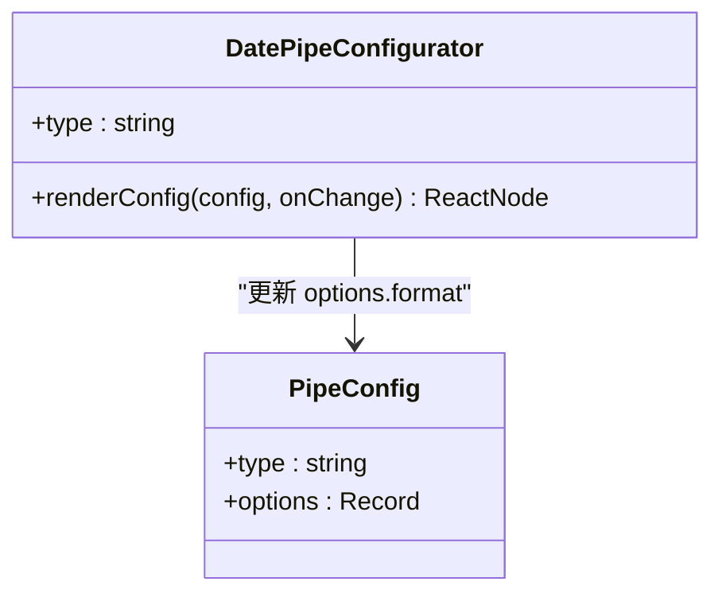
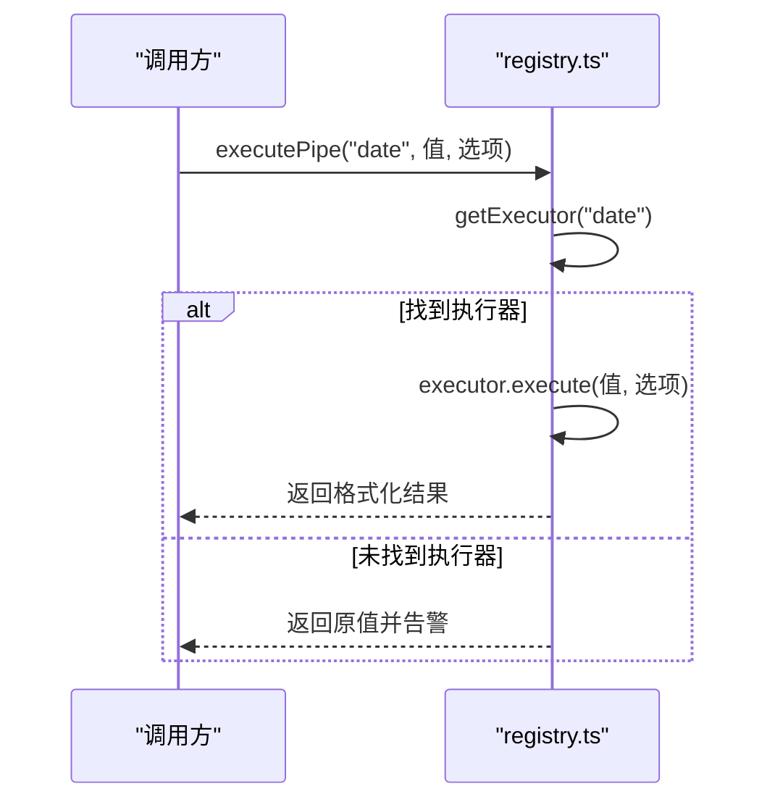
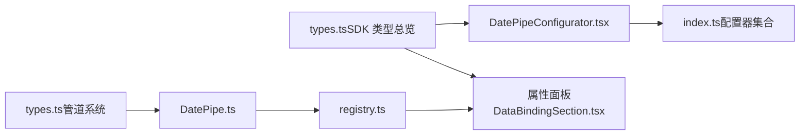

# 日期格式化管道

<cite>
**本文引用的文件**
- [DatePipe.ts](file://sdk/src/pipes/executors/DatePipe.ts)
- [DatePipeConfigurator.tsx](file://designer/src/pipes/configurators/DatePipeConfigurator.tsx)
- [registry.ts](file://sdk/src/pipes/registry.ts)
- [types.ts（管道系统）](file://sdk/src/pipes/types.ts)
- [types.ts（SDK 类型总览）](file://sdk/src/types.ts)
- [index.ts（管道系统入口）](file://sdk/src/pipes/index.ts)
- [index.ts（配置器集合）](file://designer/src/pipes/configurators/index.tsx)
- [DataBindingSection.tsx](file://designer/src/pages/Designer/components/PropertyPanel/DataBindingSection.tsx)
</cite>

## 目录
1. [简介](#简介)
2. [项目结构](#项目结构)
3. [核心组件](#核心组件)
4. [架构总览](#架构总览)
5. [详细组件分析](#详细组件分析)
6. [依赖关系分析](#依赖关系分析)
7. [性能考虑](#性能考虑)
8. [故障排查指南](#故障排查指南)
9. [结论](#结论)
10. [附录](#附录)

## 简介
本文件面向“日期格式化管道”的使用者与维护者，系统性阐述其设计与实现要点，包括：
- 支持的格式模式与行为边界
- 配置器的使用方法与格式字符串设置
- 处理流程、容错与错误策略
- 性能优化建议与常见问题解决思路

## 项目结构
围绕日期格式化管道的相关模块分布于 SDK 与 Designer 两个子工程中：
- SDK 提供管道执行器、注册表与类型定义
- Designer 提供可视化配置器与集成界面

**图示来源**
- [DatePipe.ts:1-35](file://sdk/src/pipes/executors/DatePipe.ts#L1-L35)
- [registry.ts:1-65](file://sdk/src/pipes/registry.ts#L1-L65)
- [types.ts（管道系统）:1-30](file://sdk/src/pipes/types.ts#L1-L30)
- [index.ts（管道系统入口）:1-8](file://sdk/src/pipes/index.ts#L1-L8)
- [DatePipeConfigurator.tsx:1-23](file://designer/src/pipes/configurators/DatePipeConfigurator.tsx#L1-L23)
- [index.ts（配置器集合）:1-84](file://designer/src/pipes/configurators/index.tsx#L1-L84)
- [DataBindingSection.tsx:92-127](file://designer/src/pages/Designer/components/PropertyPanel/DataBindingSection.tsx#L92-L127)

**章节来源**
- [DatePipe.ts:1-35](file://sdk/src/pipes/executors/DatePipe.ts#L1-L35)
- [registry.ts:1-65](file://sdk/src/pipes/registry.ts#L1-L65)
- [types.ts（管道系统）:1-30](file://sdk/src/pipes/types.ts#L1-L30)
- [index.ts（管道系统入口）:1-8](file://sdk/src/pipes/index.ts#L1-L8)
- [DatePipeConfigurator.tsx:1-23](file://designer/src/pipes/configurators/DatePipeConfigurator.tsx#L1-L23)
- [index.ts（配置器集合）:1-84](file://designer/src/pipes/configurators/index.tsx#L1-L84)
- [DataBindingSection.tsx:92-127](file://designer/src/pages/Designer/components/PropertyPanel/DataBindingSection.tsx#L92-L127)

## 核心组件
- 管道执行器（DatePipe）
  - 类型标识与显示名
  - 执行函数：接收任意输入值与可选配置项，返回格式化后的字符串
- 管道注册表（registry）
  - 注册、查询与统一执行入口
- 配置器（DatePipeConfigurator）
  - 在设计器属性面板中渲染输入框，支持设置格式字符串
- 类型系统
  - PipeExecutor 接口定义了执行器契约
  - PipeConfig 定义了管道配置结构（type + options）

**章节来源**
- [DatePipe.ts:7-34](file://sdk/src/pipes/executors/DatePipe.ts#L7-L34)
- [registry.ts:45-52](file://sdk/src/pipes/registry.ts#L45-L52)
- [types.ts（管道系统）:11-29](file://sdk/src/pipes/types.ts#L11-L29)
- [types.ts（SDK 类型总览）:77-86](file://sdk/src/types.ts#L77-L86)
- [DatePipeConfigurator.tsx:9-22](file://designer/src/pipes/configurators/DatePipeConfigurator.tsx#L9-L22)

## 架构总览
下面以序列图展示从“用户在属性面板设置格式字符串”到“最终输出格式化结果”的完整调用链。

**图示来源**
- [DataBindingSection.tsx:113-115](file://designer/src/pages/Designer/components/PropertyPanel/DataBindingSection.tsx#L113-L115)
- [DatePipeConfigurator.tsx:12-21](file://designer/src/pipes/configurators/DatePipeConfigurator.tsx#L12-L21)
- [registry.ts:45-52](file://sdk/src/pipes/registry.ts#L45-L52)
- [DatePipe.ts:11-34](file://sdk/src/pipes/executors/DatePipe.ts#L11-L34)

## 详细组件分析

### 组件一：日期格式化执行器（DatePipe）
- 功能定位
  - 将输入值转换为日期对象，并依据配置的格式字符串输出对应格式的文本
- 关键行为
  - 输入为空时返回空字符串
  - 未提供格式时默认采用“年-月-日”
  - 若输入无法解析为有效日期，则回退为原始输入的字符串形式
  - 通过字符串替换的方式完成占位符替换（年、月、日、时、分、秒）
- 支持的格式模式
  - 年：YYYY
  - 月：MM
  - 日：DD
  - 时：HH
  - 分：mm
  - 秒：ss
- 注意事项
  - 月份与日期均以两位补零输出
  - 时分秒均为 24 小时制
  - 仅支持上述占位符，不支持其他字符集或本地化格式

**图示来源**
- [DatePipe.ts:11-34](file://sdk/src/pipes/executors/DatePipe.ts#L11-L34)

**章节来源**
- [DatePipe.ts:7-34](file://sdk/src/pipes/executors/DatePipe.ts#L7-L34)

### 组件二：日期格式化配置器（DatePipeConfigurator）
- 功能定位
  - 在设计器属性面板中提供一个输入框，允许用户编辑格式字符串
- 交互细节
  - 占位符提示文案明确列出常用格式（如：YYYY-MM-DD HH:mm:ss）
  - onChange 回调会将新的格式字符串写入 config.options.format
- 集成方式
  - 通过配置器集合注册表进行映射，属性面板在渲染管道配置时根据 type 获取对应配置器

**图示来源**
- [DatePipeConfigurator.tsx:9-22](file://designer/src/pipes/configurators/DatePipeConfigurator.tsx#L9-L22)
- [types.ts（SDK 类型总览）:77-86](file://sdk/src/types.ts#L77-L86)

**章节来源**
- [DatePipeConfigurator.tsx:1-23](file://designer/src/pipes/configurators/DatePipeConfigurator.tsx#L1-L23)
- [index.ts（配置器集合）:69-84](file://designer/src/pipes/configurators/index.tsx#L69-L84)
- [types.ts（SDK 类型总览）:77-86](file://sdk/src/types.ts#L77-L86)

### 组件三：管道注册表与执行入口（registry）
- 注册表职责
  - 维护执行器映射、提供查询与统一执行入口
- 执行流程
  - executePipe(type, value, options) 会先查找执行器，若不存在则记录告警并直接返回原值
- 内置注册
  - 初始化阶段注册了 DatePipe 等多个执行器，确保可用性

**图示来源**
- [registry.ts:45-52](file://sdk/src/pipes/registry.ts#L45-L52)

**章节来源**
- [registry.ts:1-65](file://sdk/src/pipes/registry.ts#L1-L65)

### 组件四：类型系统与集成点
- PipeExecutor 接口
  - 定义 type、label 与 execute 契约，保证各执行器一致性
- PipeConfig
  - 由属性面板生成，包含 type 与 options（如 format）
- 组件渲染集成
  - 属性面板在渲染管道配置时，根据 type 查找配置器并渲染对应的 UI 控件

**章节来源**
- [types.ts（管道系统）:11-29](file://sdk/src/pipes/types.ts#L11-L29)
- [types.ts（SDK 类型总览）:77-86](file://sdk/src/types.ts#L77-L86)
- [DataBindingSection.tsx:113-115](file://designer/src/pages/Designer/components/PropertyPanel/DataBindingSection.tsx#L113-L115)

## 依赖关系分析
- 执行器与注册表
  - DatePipe 通过 registry 注册，executePipe 统一调度
- 配置器与 UI
  - DatePipeConfigurator 通过配置器集合注册表与属性面板联动
- 类型约束
  - PipeExecutor 与 PipeConfig 的契约确保了跨模块的一致性

**图示来源**
- [DatePipe.ts:1-35](file://sdk/src/pipes/executors/DatePipe.ts#L1-L35)
- [registry.ts:1-65](file://sdk/src/pipes/registry.ts#L1-L65)
- [DatePipeConfigurator.tsx:1-23](file://designer/src/pipes/configurators/DatePipeConfigurator.tsx#L1-L23)
- [index.ts（配置器集合）:69-84](file://designer/src/pipes/configurators/index.tsx#L69-L84)
- [types.ts（管道系统）:1-30](file://sdk/src/pipes/types.ts#L1-L30)
- [types.ts（SDK 类型总览）:77-86](file://sdk/src/types.ts#L77-L86)
- [DataBindingSection.tsx:92-127](file://designer/src/pages/Designer/components/PropertyPanel/DataBindingSection.tsx#L92-L127)

**章节来源**
- [registry.ts:56-65](file://sdk/src/pipes/registry.ts#L56-L65)
- [index.ts（配置器集合）:72-77](file://designer/src/pipes/configurators/index.tsx#L72-L77)

## 性能考虑
- 时间复杂度
  - execute 为 O(1)，仅进行一次日期解析与常数次字符串替换
- 空值与回退
  - 对空值快速返回，避免不必要的解析与格式化
- 建议
  - 在高频渲染场景中，尽量复用已解析的日期对象，减少重复 new Date
  - 对于批量数据，优先在数据源侧完成预处理，降低渲染阶段开销

## 故障排查指南
- 现象：输出仍为原始输入
  - 可能原因：输入无法被解析为有效日期
  - 处理：检查输入类型与格式，确保可被浏览器 Date 解析
- 现象：格式字符串无效或部分占位符未替换
  - 可能原因：使用了不支持的占位符
  - 处理：仅使用 YYYY、MM、DD、HH、mm、ss 占位符
- 现象：未看到格式化结果
  - 可能原因：未正确设置 options.format 或未触发重新渲染
  - 处理：在属性面板确认 format 已更新，并确保调用 executePipe

**章节来源**
- [DatePipe.ts:11-17](file://sdk/src/pipes/executors/DatePipe.ts#L11-L17)
- [DatePipeConfigurator.tsx:12-21](file://designer/src/pipes/configurators/DatePipeConfigurator.tsx#L12-L21)
- [registry.ts:47-51](file://sdk/src/pipes/registry.ts#L47-L51)

## 结论
日期格式化管道以简洁的占位符替换为核心，具备良好的可配置性与易用性。通过注册表与配置器的解耦设计，实现了前端可视化配置与后端执行的清晰分离。遵循本文档的使用规范与容错策略，可在大多数业务场景中稳定地输出期望的日期格式。

## 附录

### 使用示例（基于占位符）
- 输入：时间戳或可解析日期字符串
- 输出：按格式字符串替换后的文本
- 示例占位符组合
  - 年-月-日：YYYY-MM-DD
  - 年-月-日 时:分:秒：YYYY-MM-DD HH:mm:ss

**章节来源**
- [DatePipe.ts:14-32](file://sdk/src/pipes/executors/DatePipe.ts#L14-L32)
- [DatePipeConfigurator.tsx:14-18](file://designer/src/pipes/configurators/DatePipeConfigurator.tsx#L14-L18)