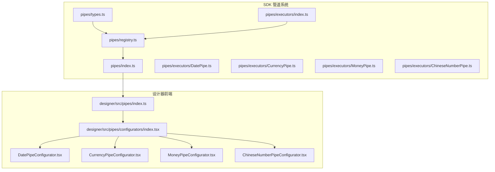
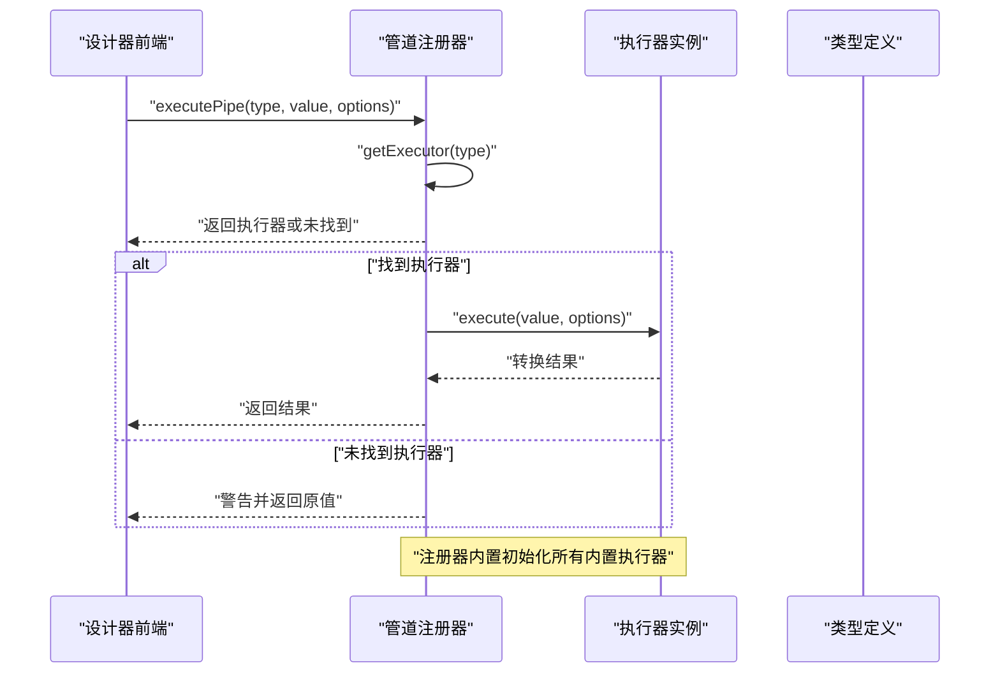
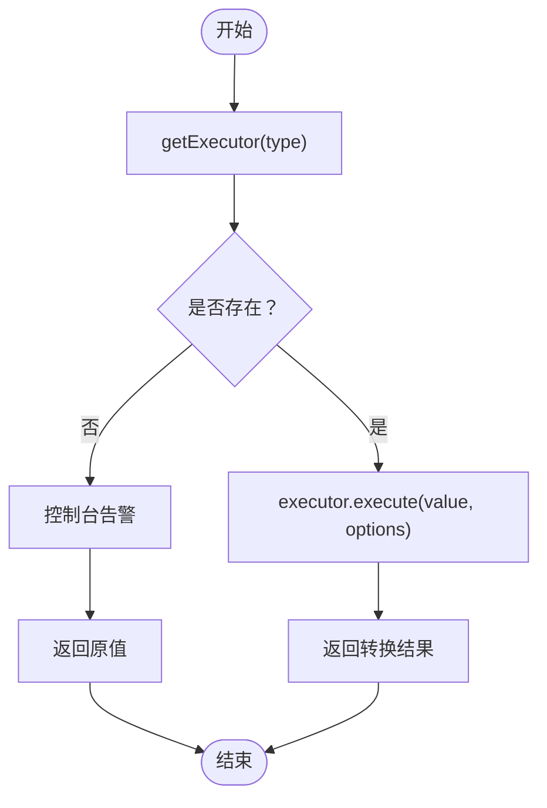
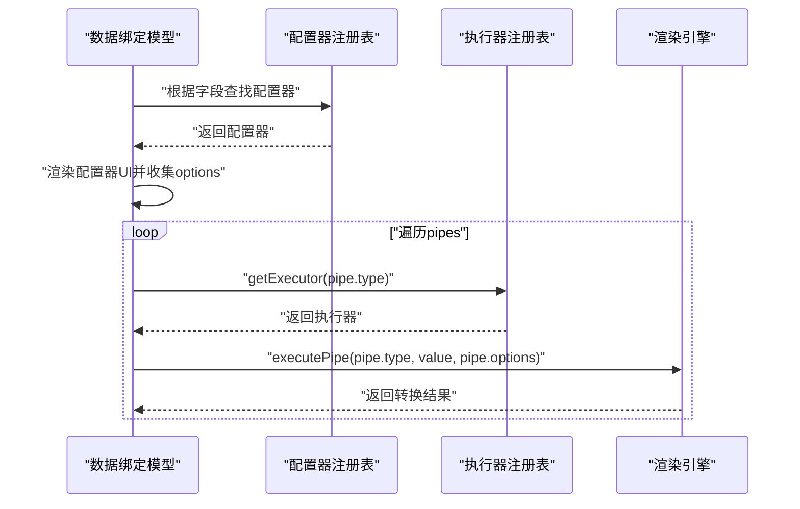
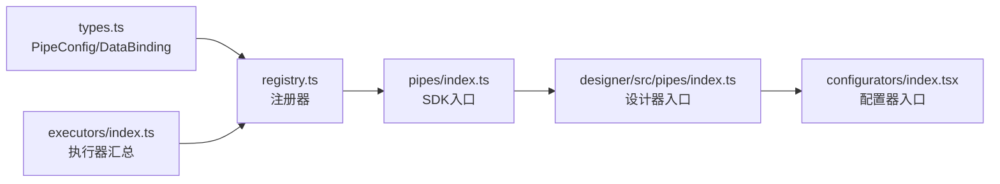

# 管道类型概览

<cite>
**本文引用的文件**
- [sdk/src/pipes/index.ts](file://sdk/src/pipes/index.ts)
- [sdk/src/pipes/registry.ts](file://sdk/src/pipes/registry.ts)
- [sdk/src/pipes/types.ts](file://sdk/src/pipes/types.ts)
- [sdk/src/pipes/executors/index.ts](file://sdk/src/pipes/executors/index.ts)
- [sdk/src/pipes/executors/ChineseNumberPipe.ts](file://sdk/src/pipes/executors/ChineseNumberPipe.ts)
- [sdk/src/pipes/executors/CurrencyPipe.ts](file://sdk/src/pipes/executors/CurrencyPipe.ts)
- [sdk/src/pipes/executors/DatePipe.ts](file://sdk/src/pipes/executors/DatePipe.ts)
- [sdk/src/pipes/executors/MoneyPipe.ts](file://sdk/src/pipes/executors/MoneyPipe.ts)
- [designer/src/pipes/index.ts](file://designer/src/pipes/index.ts)
- [designer/src/pipes/configurators/index.tsx](file://designer/src/pipes/configurators/index.tsx)
- [designer/src/pipes/configurators/ChineseNumberPipeConfigurator.tsx](file://designer/src/pipes/configurators/ChineseNumberPipeConfigurator.tsx)
- [designer/src/pipes/configurators/CurrencyPipeConfigurator.tsx](file://designer/src/pipes/configurators/CurrencyPipeConfigurator.tsx)
- [designer/src/pipes/configurators/DatePipeConfigurator.tsx](file://designer/src/pipes/configurators/DatePipeConfigurator.tsx)
- [designer/src/pipes/configurators/MoneyPipeConfigurator.tsx](file://designer/src/pipes/configurators/MoneyPipeConfigurator.tsx)
- [sdk/src/types.ts](file://sdk/src/types.ts)
</cite>

## 目录
1. [引言](#引言)
2. [项目结构](#项目结构)
3. [核心组件](#核心组件)
4. [架构总览](#架构总览)
5. [详细组件分析](#详细组件分析)
6. [依赖关系分析](#依赖关系分析)
7. [性能考量](#性能考量)
8. [故障排查指南](#故障排查指南)
9. [结论](#结论)
10. [附录](#附录)

## 引言
本文件面向“数据管道类型系统”，旨在提供一个从整体到细节的概览性文档。重点涵盖：
- 管道注册器的核心作用与设计理念
- 管道执行器的注册机制与获取方式
- 管道链式调用的工作原理（基于执行器配置器分离的设计思路）
- 管道类型的分类体系与命名规范
- 如何通过类型标识符查找对应执行器
- 管道注册表的使用方法与最佳实践，以及内置管道的初始化流程

## 项目结构
围绕“管道系统”的核心目录与文件分布如下：
- SDK 层（后端执行器与类型定义）
  - 管道入口：sdk/src/pipes/index.ts
  - 注册器：sdk/src/pipes/registry.ts
  - 类型定义：sdk/src/pipes/types.ts
  - 执行器集合：sdk/src/pipes/executors/index.ts
  - 具体执行器实现：sdk/src/pipes/executors/*.ts
- 设计器前端（UI 配置器）
  - 管道入口：designer/src/pipes/index.ts
  - 配置器集合：designer/src/pipes/configurators/index.tsx
  - 具体配置器实现：designer/src/pipes/configurators/*.tsx
- 共享类型定义
  - 数据绑定与管道配置类型：sdk/src/types.ts

图表来源
- [sdk/src/pipes/index.ts:1-9](file://sdk/src/pipes/index.ts#L1-L9)
- [sdk/src/pipes/registry.ts:1-65](file://sdk/src/pipes/registry.ts#L1-L65)
- [sdk/src/pipes/types.ts:1-30](file://sdk/src/pipes/types.ts#L1-L30)
- [sdk/src/pipes/executors/index.ts:1-45](file://sdk/src/pipes/executors/index.ts#L1-L45)
- [sdk/src/pipes/executors/DatePipe.ts:1-35](file://sdk/src/pipes/executors/DatePipe.ts#L1-L35)
- [sdk/src/pipes/executors/CurrencyPipe.ts:1-17](file://sdk/src/pipes/executors/CurrencyPipe.ts#L1-L17)
- [sdk/src/pipes/executors/MoneyPipe.ts:1-130](file://sdk/src/pipes/executors/MoneyPipe.ts#L1-L130)
- [sdk/src/pipes/executors/ChineseNumberPipe.ts:1-138](file://sdk/src/pipes/executors/ChineseNumberPipe.ts#L1-L138)
- [designer/src/pipes/index.ts:1-11](file://designer/src/pipes/index.ts#L1-L11)
- [designer/src/pipes/configurators/index.tsx:1-85](file://designer/src/pipes/configurators/index.tsx#L1-L85)

章节来源
- [sdk/src/pipes/index.ts:1-9](file://sdk/src/pipes/index.ts#L1-L9)
- [designer/src/pipes/index.ts:1-11](file://designer/src/pipes/index.ts#L1-L11)

## 核心组件
- 管道执行器接口（PipeExecutor）
  - 定义了 type、label 与 execute 方法，统一了执行器的契约
- 管道注册器（registry）
  - 提供注册、获取、枚举与执行能力，并内置初始化注册所有内置执行器
- 执行器集合（executors）
  - 暴露内置执行器，包含简单执行器与复杂执行器
- 配置器集合（configurators）
  - 设计器侧的 UI 配置器，负责渲染配置界面并回传选项
- 类型定义（types）
  - 包含 PipeConfig、DataBinding 等与管道相关的类型

章节来源
- [sdk/src/pipes/types.ts:1-30](file://sdk/src/pipes/types.ts#L1-L30)
- [sdk/src/pipes/registry.ts:1-65](file://sdk/src/pipes/registry.ts#L1-L65)
- [sdk/src/pipes/executors/index.ts:1-45](file://sdk/src/pipes/executors/index.ts#L1-L45)
- [designer/src/pipes/configurators/index.tsx:1-85](file://designer/src/pipes/configurators/index.tsx#L1-L85)
- [sdk/src/types.ts:77-86](file://sdk/src/types.ts#L77-L86)

## 架构总览
管道系统采用“执行器与配置器分离”的设计：
- 执行器位于 SDK，负责纯数据转换逻辑
- 配置器位于设计器前端，负责可视化配置与参数收集
- 通过类型标识符（type）在运行时动态匹配执行器与配置器

图表来源
- [sdk/src/pipes/registry.ts:45-52](file://sdk/src/pipes/registry.ts#L45-L52)
- [sdk/src/pipes/registry.ts:54-65](file://sdk/src/pipes/registry.ts#L54-L65)

## 详细组件分析

### 管道注册器与执行器注册机制
- 注册表结构
  - 使用 Map 存储执行器，键为 type，值为执行器对象
- 注册方式
  - 通过 registerExecutor 将执行器加入注册表
  - 在模块初始化阶段批量注册内置执行器
- 获取方式
  - 通过 getExecutor(type) 获取执行器实例
  - 通过 getAllPipes() 返回可选项列表（value=label=type）
- 执行流程
  - executePipe(type, value, options)：先查表再执行，未命中时返回原值并告警

图表来源
- [sdk/src/pipes/registry.ts:24-52](file://sdk/src/pipes/registry.ts#L24-L52)

章节来源
- [sdk/src/pipes/registry.ts:1-65](file://sdk/src/pipes/registry.ts#L1-L65)

### 管道链式调用与配置器分离设计
- 链式调用
  - 数据绑定中通过 pipes 数组串联多个 PipeConfig
  - 每个 PipeConfig 包含 type 与 options
  - 渲染时依次执行每个执行器，上一步输出作为下一步输入
- 配置器分离
  - 设计器前端维护配置器注册表，按键为“去除复数的执行器类型名”
  - 通过 getConfigurator(type) 获取对应配置器，渲染 UI 并回传 options
  - SDK 侧仅依赖 PipeExecutor 接口，不关心 UI 实现

图表来源
- [designer/src/pipes/configurators/index.tsx:67-84](file://designer/src/pipes/configurators/index.tsx#L67-L84)
- [sdk/src/pipes/registry.ts:24-52](file://sdk/src/pipes/registry.ts#L24-L52)
- [sdk/src/types.ts:77-86](file://sdk/src/types.ts#L77-L86)

章节来源
- [designer/src/pipes/configurators/index.tsx:1-85](file://designer/src/pipes/configurators/index.tsx#L1-L85)
- [sdk/src/types.ts:77-86](file://sdk/src/types.ts#L77-L86)

### 管道类型分类与命名规范
- 类型标识符（type）
  - 执行器：使用具体语义的短横线分隔标识，如 date、currency、money、chineseNumber
  - 配置器：使用去除复数的执行器类型名，如 date、currency、money、slice、default、chineseNumber
- 显示标签（label）
  - 用于 UI 下拉与展示，如“日期格式化”、“货币格式化”等
- 命名建议
  - 执行器 type 使用全小写与短横线，避免与 UI 名称混淆
  - 配置器 type 与执行器 type 的核心词保持一致，便于映射

章节来源
- [sdk/src/pipes/types.ts:11-29](file://sdk/src/pipes/types.ts#L11-L29)
- [sdk/src/pipes/executors/index.ts:16-44](file://sdk/src/pipes/executors/index.ts#L16-L44)
- [designer/src/pipes/configurators/index.tsx:67-77](file://designer/src/pipes/configurators/index.tsx#L67-L77)

### 内置执行器一览与特性
- 日期格式化（date）
  - 支持格式占位符替换，如 YYYY-MM-DD HH:mm:ss
- 货币格式化（currency）
  - 支持自定义货币符号与精度
- 金额转换（money）
  - 支持分/元互转、精度控制、千分位分隔、中文大写（含整/角/分）
- 中文大写数字（chineseNumber）
  - 支持数值转中文大写、可选“原值+大写”模式与连接符
- 简单执行器
  - uppercase、lowercase、slice、default：无配置器，直接执行

章节来源
- [sdk/src/pipes/executors/DatePipe.ts:1-35](file://sdk/src/pipes/executors/DatePipe.ts#L1-L35)
- [sdk/src/pipes/executors/CurrencyPipe.ts:1-17](file://sdk/src/pipes/executors/CurrencyPipe.ts#L1-L17)
- [sdk/src/pipes/executors/MoneyPipe.ts:1-130](file://sdk/src/pipes/executors/MoneyPipe.ts#L1-L130)
- [sdk/src/pipes/executors/ChineseNumberPipe.ts:1-138](file://sdk/src/pipes/executors/ChineseNumberPipe.ts#L1-L138)
- [sdk/src/pipes/executors/index.ts:16-44](file://sdk/src/pipes/executors/index.ts#L16-L44)

### 管道注册表的使用方法与最佳实践
- 使用方法
  - 在 SDK 侧通过 executePipe(type, value, options) 执行转换
  - 在设计器侧通过 getConfigurator(type) 获取配置器渲染 UI
- 最佳实践
  - 执行器命名与配置器命名一一对应，便于维护
  - 新增执行器时同步更新注册器初始化与配置器注册
  - 对于复杂执行器，提供清晰的 options 文档与默认值
  - 在执行器内部做好异常兜底，避免影响渲染流程

章节来源
- [sdk/src/pipes/registry.ts:45-65](file://sdk/src/pipes/registry.ts#L45-L65)
- [designer/src/pipes/configurators/index.tsx:67-84](file://designer/src/pipes/configurators/index.tsx#L67-L84)

## 依赖关系分析
- 模块耦合
  - SDK 管道系统与执行器解耦，通过接口契约通信
  - 设计器仅依赖 SDK 的类型与执行器注册表，不依赖具体实现
- 关键依赖链
  - types.ts 定义 PipeConfig/DataBinding
  - registry.ts 依赖 executors/index.ts 与 types.ts
  - executors/index.ts 汇总各执行器
  - designer 端通过 pipes/index.ts 从 SDK 导入类型与执行器

图表来源
- [sdk/src/types.ts:77-86](file://sdk/src/types.ts#L77-L86)
- [sdk/src/pipes/registry.ts:6-7](file://sdk/src/pipes/registry.ts#L6-L7)
- [sdk/src/pipes/executors/index.ts:6-9](file://sdk/src/pipes/executors/index.ts#L6-L9)
- [sdk/src/pipes/index.ts:6-8](file://sdk/src/pipes/index.ts#L6-L8)
- [designer/src/pipes/index.ts:6-7](file://designer/src/pipes/index.ts#L6-L7)
- [designer/src/pipes/configurators/index.tsx:1-12](file://designer/src/pipes/configurators/index.tsx#L1-L12)

章节来源
- [sdk/src/types.ts:77-86](file://sdk/src/types.ts#L77-L86)
- [sdk/src/pipes/registry.ts:6-7](file://sdk/src/pipes/registry.ts#L6-L7)
- [sdk/src/pipes/executors/index.ts:6-9](file://sdk/src/pipes/executors/index.ts#L6-L9)
- [sdk/src/pipes/index.ts:6-8](file://sdk/src/pipes/index.ts#L6-L8)
- [designer/src/pipes/index.ts:6-7](file://designer/src/pipes/index.ts#L6-L7)
- [designer/src/pipes/configurators/index.tsx:1-12](file://designer/src/pipes/configurators/index.tsx#L1-L12)

## 性能考量
- 注册表查询
  - 使用 Map 结构，get/set 时间复杂度为 O(1)，适合高频调用场景
- 执行器执行
  - 简单执行器开销低；复杂执行器（如金额转换、中文大写）应避免重复计算，必要时引入缓存策略
- 链式调用
  - 多个执行器串联时，注意中间值的类型一致性，减少无效转换
- UI 配置器
  - 配置器仅负责渲染与收集，不参与数据转换，避免阻塞渲染

## 故障排查指南
- 执行器未找到
  - 现象：控制台告警并返回原值
  - 排查：确认 type 是否正确、执行器是否已注册、是否被初始化
- 执行器异常
  - 现象：捕获错误并回退为原始值
  - 排查：检查 options 参数合法性、边界条件（空值、非法字符）
- 配置器不生效
  - 现象：UI 无法渲染或选项未回传
  - 排查：确认配置器 type 与执行器 type 的映射关系、注册表是否包含对应项

章节来源
- [sdk/src/pipes/registry.ts:45-52](file://sdk/src/pipes/registry.ts#L45-L52)
- [sdk/src/pipes/executors/MoneyPipe.ts:124-127](file://sdk/src/pipes/executors/MoneyPipe.ts#L124-L127)
- [sdk/src/pipes/executors/ChineseNumberPipe.ts:132-135](file://sdk/src/pipes/executors/ChineseNumberPipe.ts#L132-L135)

## 结论
本管道类型系统通过“执行器与配置器分离”的架构，实现了类型驱动的数据转换与可视化配置。注册器提供统一的注册、获取与执行入口，内置执行器覆盖常用场景。通过明确的类型命名规范与链式调用机制，系统具备良好的扩展性与可维护性。

## 附录
- 类型与配置器映射参考
  - date ↔ date
  - currency ↔ currency
  - money ↔ money
  - chineseNumber ↔ chineseNumber
  - slice ↔ slice
  - default ↔ default

章节来源
- [designer/src/pipes/configurators/index.tsx:67-77](file://designer/src/pipes/configurators/index.tsx#L67-L77)
- [sdk/src/pipes/executors/index.ts:16-44](file://sdk/src/pipes/executors/index.ts#L16-L44)